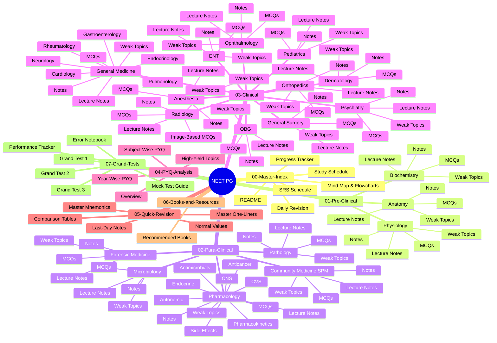
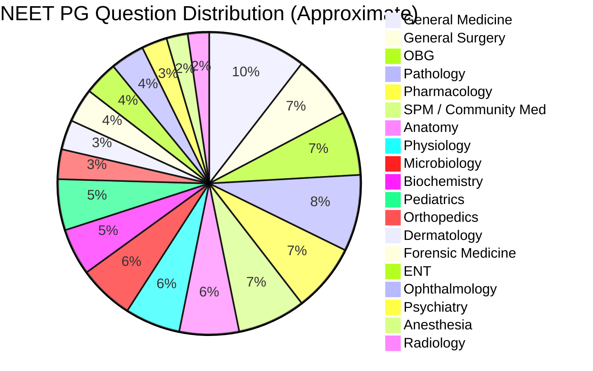
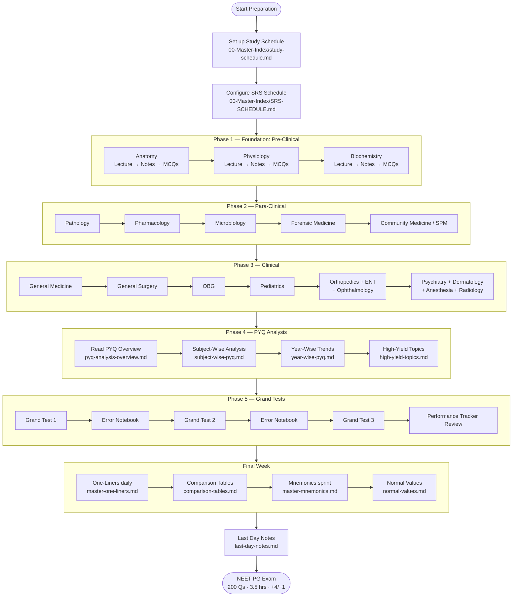
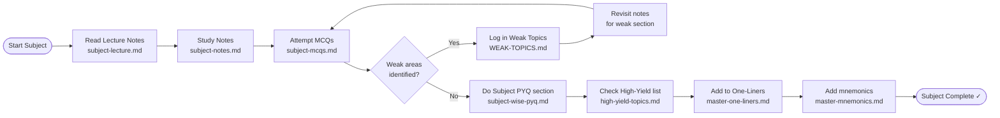
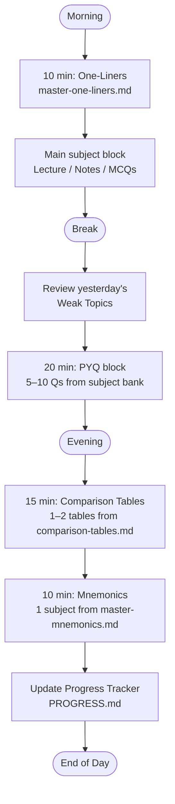
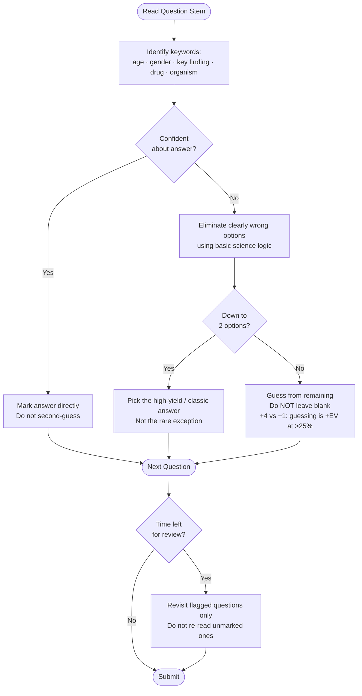
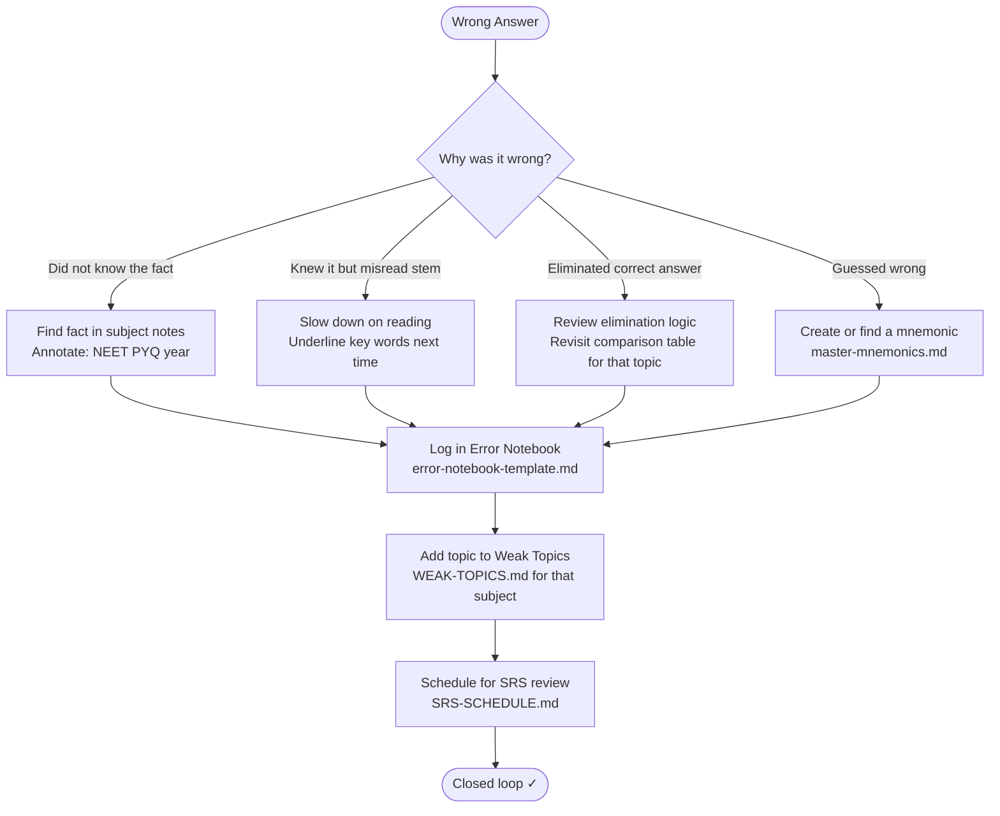

# Repository Mind Map & Flowcharts

> **Navigation:** [Master Index](README.md) · [Study Schedule](study-schedule.md) · [Daily Revision](DAILY-REVISION.md) · [Progress Tracker](PROGRESS.md)

---

## 1. Repository Mind Map

Full structure of every folder and file in the repo.

---

## 2. Subject Question Weight Map

Size of each subject's contribution to the NEET PG paper (~200 Qs total).

---

## 3. Study Phase Flowchart

How to progress through the repo from Day 1 to exam day.

---

## 4. Per-Subject Study Flowchart

The standard workflow to follow for every subject.

---

## 5. Daily Revision Flowchart

What to do every single study day.

---

## 6. MCQ Strategy Flowchart

Decision logic for answering a NEET PG MCQ under exam conditions.

---

## 7. Error Analysis Flowchart

What to do with every wrong answer in a mock test or PYQ session.

