> **Diagram note:** Mermaid mindmap — renders in VS Code (Markdown Preview), Obsidian, or GitHub with the Mermaid extension. Plain-text overview below.

```mermaid
graph TD
    A["🦴 ANATOMY — NEET PG<br/>9 Major Sections"]

    A --> B["Upper Limb"]
    A --> C["Lower Limb"]
    A --> D["Thorax"]
    A --> E["Abdomen"]
    A --> F["Head & Neck"]
    A --> G["Neuroanatomy"]
    A --> H["Embryology"]

    B --> B1["Brachial Plexus<br/>C5–T1"]
    B --> B2["Nerve Lesions<br/>Radial/Median/Ulnar"]
    B --> B3["Rotator Cuff<br/>Carpal Tunnel"]

    C --> C1["Femoral Triangle<br/>NAVY mnemonic"]
    C --> C2["Sciatic Nerve<br/>Piriformis"]
    C --> C3["Foot Drop<br/>Common Peroneal"]

    D --> D1["Coronary Arteries<br/>LAD / RCA / LCx"]
    D --> D2["Mediastinum<br/>Superior / Ant / Mid / Post"]
    D --> D3["Inguinal Canal<br/>Deep → Superficial ring"]

    E --> E1["Portal Circulation<br/>SMV + Splenic v"]
    E --> E2["Portosystemic<br/>Anastomoses"]
    E --> E3["Peritoneal Relations<br/>McBurney's point"]

    F --> F1["Cavernous Sinus<br/>CN III IV V1 V2 VI"]
    F --> F2["Thyroid / Parathyroid<br/>RLN & External LN"]
    F --> F3["Parotid Gland<br/>CN VII branches"]

    G --> G1["Internal Capsule<br/>Anterior/Genu/Post limb"]
    G --> G2["Basal Ganglia<br/>Caudate/Putamen/GP"]
    G --> G3["Cerebellum<br/>Peduncles & Lobes"]

    H --> H1["Pharyngeal Arches<br/>1→V3, 2→VII, 3→IX"]
    H --> H2["Neural Tube Defects<br/>Spina bifida / Anencephaly"]
    H --> H3["Germ Layers<br/>Ecto / Meso / Endo"]
```

**Subject Overview (plain text):**
- Upper Limb: Brachial Plexus (C5–T1), Nerve Lesions (Radial/Median/Ulnar), Rotator Cuff, Carpal Tunnel
- Lower Limb: Femoral Triangle (NAVY mnemonic), Sciatic Nerve, Foot Drop (Common Peroneal)
- Thorax: Coronary Arteries (LAD/RCA/LCx), Mediastinum divisions, Inguinal Canal
- Abdomen: Portal Circulation, Portosystemic Anastomoses, Peritoneal Relations
- Head & Neck: Cavernous Sinus (CN III IV V1 V2 VI), Thyroid/Parathyroid/RLN, Parotid/CN VII
- Neuroanatomy: Internal Capsule, Basal Ganglia, Cerebellum
- Embryology: Pharyngeal Arches, Neural Tube Defects, Germ Layers

# Anatomy: Lecture-Style Notes for NEET PG
### Written as if a great teacher is speaking to you

---

> **How to use these notes:** Do not memorize. Understand. Read each section like a lecture — let the logic sink in, then the facts become obvious. When you understand *why*, you never forget *what*.

---

## Table of Contents
1. [Brachial Plexus](#1-brachial-plexus)
2. [Upper Limb Nerves](#2-upper-limb-nerves-in-detail)
3. [Lower Limb](#3-lower-limb)
4. [Thorax — Heart and Great Vessels](#4-thorax--heart-and-great-vessels)
5. [Abdomen](#5-abdomen)
6. [Head and Neck](#6-head-and-neck)
7. [Neuroanatomy](#7-neuroanatomy)
8. [Embryology](#8-embryology)
9. [Histology](#9-histology)

---

## 1. Brachial Plexus

### Why Does the Arm Need Such a Complex Plexus?

Think about what the arm actually does. It reaches, grabs, twists, pinches, pushes, pulls — it is arguably the most functionally diverse limb in the human body. The hand alone has more individual movements than almost any other structure. Now think about where the nerves to this arm have to come from: the spinal cord, a structure running down a narrow canal, organized in neat segments. You have one nerve root per spinal level, but you need a highly coordinated, multi-directional motor and sensory system to serve a limb that moves in three dimensions.

The answer evolution found is the plexus — a network that *recombines* spinal roots into functional units. Instead of each root independently going to one muscle, the roots pool their fibers, remix them, and redistribute them along lines of functional relevance. The brachial plexus (C5, C6, C7, C8, T1) is essentially a biological circuit board. Incoming spinal segments get reshuffled so that each terminal nerve carries fibers from multiple spinal levels — giving redundancy, fine control, and logical grouping of muscles that work together.

The funnel works like this: **Roots → Trunks → Divisions → Cords → Branches**. Think of it as a river system. Multiple small streams (roots) merge into larger rivers (trunks), those rivers split at a divide (divisions: anterior and posterior), reform as tributaries (cords), and finally branch into individual streams reaching specific territories (branches/terminal nerves). The anterior divisions supply *flexors* (muscles on the front — the arm's "reach and grab" surface), while the posterior divisions supply *extensors* (the back of the arm). This anterior/posterior logic is not arbitrary — it mirrors the embryological division of the limb bud into a pre-axial (flexor) and post-axial (extensor) compartment.

### Roots to Trunks

The five roots (C5–T1) form three trunks at the level of the posterior triangle of the neck:

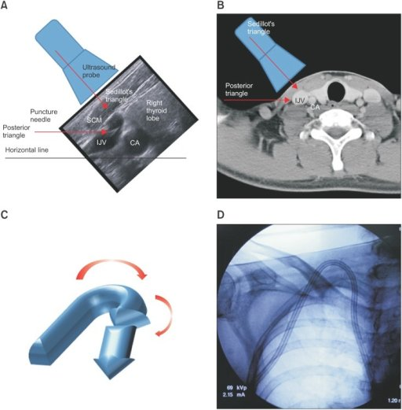
> **IBQ tip:** Look for the trunks visible in the posterior triangle between the two scalene muscles — upper, middle, and lower trunks are identifiable above the clavicle. Differentiate from a cystic hygroma (which is a translucent, fluctuant swelling in the same triangle but lacks the cord-like nerve structure).
- C5 + C6 → **Upper trunk**
- C7 alone → **Middle trunk**
- C8 + T1 → **Lower trunk**

The trunks then each divide into anterior and posterior divisions behind the clavicle. Anterior divisions supply anterior (flexor) compartments. Posterior divisions supply posterior (extensor) compartments. Each trunk generates one anterior and one posterior division, giving six divisions total. These six divisions then regroup into three cords, named by their relationship to the axillary artery:

- Posterior cord: all three **posterior** divisions (C5–T1) — serves the extensors of the entire upper limb
- Lateral cord: anterior divisions of upper and middle trunks (C5, C6, C7) — serves the lateral flexors
- Medial cord: anterior division of lower trunk (C8, T1) — serves the medial flexors and intrinsic hand muscles

> **Key insight:** The posterior cord gives rise to the radial nerve and axillary nerve — both extensors. The lateral cord gives rise partly to the median nerve and to the musculocutaneous nerve. The medial cord gives rise partly to the median nerve and to the ulnar nerve. Notice: the median nerve gets contributions from BOTH lateral (C6,C7) and medial (C8,T1) cords — this is why median nerve injury at different levels produces different motor patterns.

### Cord to Branch: The Terminal Nerves

The five terminal branches are: **musculocutaneous, median, ulnar, radial, axillary** — a mnemonic: "My Mother Used Rear Axle" (or choose your own).

> **IBQ tip:** Trace the lateral cord (C5–C7 anterior divisions) giving musculocutaneous + lateral root of median, and the posterior cord (all posterior divisions) giving radial + axillary — this colour-coded diagram is the fastest way to answer "which cord is injured" questions. Differentiate a cord-level lesion from a root-level lesion by the presence of long thoracic nerve (C5–C7, root-level) or dorsal scapular nerve involvement.

Each cord's branches make functional sense:

**Lateral cord** → musculocutaneous nerve (elbow flexion, forearm sensation) + lateral root of median nerve. The lateral cord is C5, C6, C7 — the "reach and grab" roots. Musculocutaneous nerve supplies biceps and brachialis — elbow flexors, exactly what you'd expect from C5/C6.

**Medial cord** → ulnar nerve + medial root of median nerve. The medial cord is C8, T1 — the fine-hand-movement roots. Ulnar nerve supplies most intrinsic hand muscles. Makes sense: T1 is the root for the tiny, precise muscles of the hand.

**Posterior cord** → radial nerve + axillary nerve. Both serve extensors. Radial nerve is the "extension nerve" — it extends the wrist, fingers, elbow. Axillary nerve supplies deltoid (shoulder abduction, extension) and teres minor.

### Clinical Injuries: Stories That Teach the Anatomy

**Erb's Palsy (C5, C6 injury — Upper Trunk)**

Imagine a baby being born with shoulder dystocia, or an adult thrown from a motorcycle and landing on their shoulder — the head gets forced away from the shoulder, violently stretching the upper trunk. C5 and C6 roots are avulsed or stretched. What's lost?

C5, C6 supply: shoulder abduction (deltoid), elbow flexion (biceps, brachialis), forearm supination (biceps), and wrist extension partially. When these are lost, the *unopposed* muscles produce the deformity. With no deltoid, the arm hangs. With no biceps, the elbow extends (triceps unopposed). With no supinator and biceps, the forearm pronates. The result is the classic "waiter's tip" position: arm adducted, elbow extended, forearm pronated, wrist flexed slightly. The baby looks like a waiter holding a hand out to receive a tip — palm facing backward and upward.

> **IBQ tip:** The key visual is the forearm pronation combined with elbow extension — the palm faces backward (posteriorly), not just downward. Differentiate from Klumpke's palsy, which spares shoulder and elbow but claws all four fingers, and from a clavicle fracture, which produces pseudoparalysis with a normal arm posture when the limb is supported.

The reason C5,C6 injury is "upper" — the upper roots are the most lateral, and when the neck and shoulder are forcibly separated, these uppermost fibers get the most traction stress.

> **IBQ tip:** C6 (thumb) and C7 (middle finger) are the two most tested upper limb dermatomes — C6 loss (disc prolapse at C5/6) also reduces the biceps jerk, while C7 loss (disc at C6/7) reduces the triceps jerk. Differentiate a C6 radiculopathy (sensory loss on thumb + lateral forearm + reduced biceps reflex) from carpal tunnel syndrome (sensory loss lateral 3.5 fingers but preserved biceps reflex and no neck pain).

**Klumpke's Palsy (C8, T1 injury — Lower Trunk)**

Now imagine the opposite mechanism: the arm is violently pulled upward — a baby's arm is yanked upward during delivery, or an adult grabs a ledge while falling. This stretches the lower trunk (C8, T1). What's lost?

C8, T1 supply: all the intrinsic hand muscles (interossei, lumbricals, thenar and hypothenar eminences), plus flexors of the fingers. With intrinsic muscles paralyzed but long flexors and extensors partially intact, the fingers hyperextend at the metacarpophalangeal joints (extensor digitorum pulls them back, with no lumbricals to counter) and flex at the interphalangeal joints — producing the **claw hand**. But in Klumpke's, it's a *total* claw (all four fingers), because both median (C8,T1 component) and ulnar (C8,T1) intrinsics are affected.

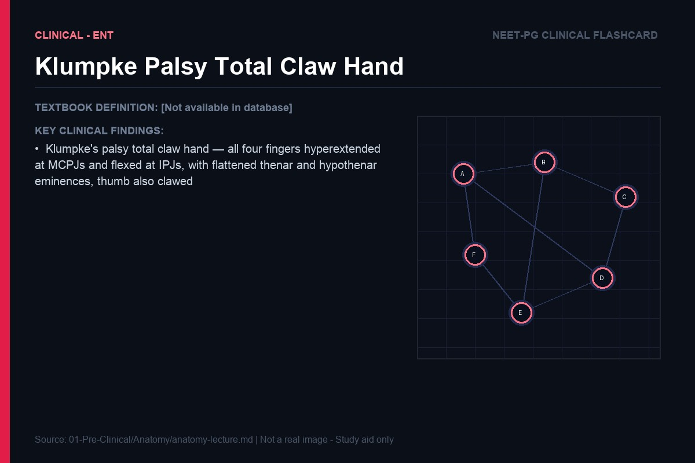
> **IBQ tip:** In Klumpke's total claw, ALL four fingers claw (including index and middle), distinguishing it from ulnar claw where only ring and little fingers claw. Also look for ipsilateral Horner's syndrome (ptosis + miosis) if the T1 root is avulsed proximally — this combination is pathognomonic of a preganglionic lower trunk injury.

Additionally, T1 fibers carry sympathetic fibers to the eye — specifically to dilator pupillae and superior tarsal muscle (Muller's muscle). If the T1 root is avulsed proximally enough, you get **Horner's syndrome**: ptosis (drooping lid), miosis (small pupil), anhidrosis on the face. This is a red flag sign telling you the injury is at the root level (preganglionic), not just the lower trunk or ulnar nerve distally.

**Saturday Night Palsy / Radial Nerve Palsy (Spiral Groove)**

A man falls asleep with his arm hanging over a park bench, or a chair edge, compressing the radial nerve in the spiral (radial) groove of the humerus. At this point, the radial nerve has already given off its branch to triceps (the long and medial heads of triceps get their branches proximally, before the groove), but has not yet given branches to the forearm extensors. Result: triceps works (elbow can extend), but wrist drop occurs — the patient cannot extend the wrist, cannot extend the fingers at the MCPJs, and cannot extend the thumb.

> **IBQ tip:** The hallmark is wrist drop with preserved triceps function (elbow extension intact) — confirm by asking the patient to extend the elbow against resistance before testing the wrist. Differentiate from a more proximal radial nerve or posterior cord injury (triceps also weak) and from PIN palsy (finger drop only, wrist extension preserved via ECRL). The reason for wrist drop is the loss of extensor carpi radialis longus, extensor carpi radialis brevis, extensor digitorum, and extensor carpi ulnaris.

> **Why wrist drop causes functional grip weakness:** Even though the flexors are intact, you cannot grip powerfully with a dropped wrist. The flexor tendons cross the wrist — if the wrist is flexed (dropped), the finger flexors are shortened and cannot generate full tension. This is why wrist extension actually potentiates grip — you can test this yourself. Radial nerve palsy thus weakens grip indirectly even though the grip muscles themselves are fine.

| Injury | Roots | Mechanism | Deformity | Key Loss |
|--------|-------|-----------|-----------|----------|
| Erb's Palsy | C5, C6 | Shoulder-neck separation | Waiter's tip | Shoulder abduction, elbow flexion, supination |
| Klumpke's Palsy | C8, T1 | Arm yanked up | Total claw hand ± Horner's | Intrinsic hand muscles |
| Radial nerve (spiral groove) | C5–C8 post. cord | Compression against humerus | Wrist drop | Wrist/finger extension |
| Axillary nerve (surgical neck) | C5, C6 | Humeral neck fracture, shoulder dislocation | Flat shoulder | Deltoid (abduction 15–90°) |
| Long thoracic nerve | C5, C6, C7 | Neck dissection, compression | Winged scapula | Serratus anterior |

> **IBQ tip:** Winging is maximal when the patient pushes forward against a wall (protracts the scapula against resistance) — this is the standard provocative test. Differentiate serratus anterior palsy (long thoracic nerve, medial border and inferior angle wing posteriorly) from trapezius palsy (spinal accessory nerve, CN XI — the superior angle wings and the shoulder droops, with inability to shrug).

> **IBQ tip:** The posterior cord lies directly behind the axillary artery — a shoulder dislocation (anterior) or surgical neck of humerus fracture can stretch or compress the posterior cord, producing combined radial + axillary nerve palsy (wrist drop + deltoid paralysis). Differentiate from an isolated axillary nerve injury (deltoid loss only, patch of sensory loss over the regimental badge area of the upper lateral arm).

---

## 2. Upper Limb Nerves in Detail

### Tracing the Median Nerve: The "Labourer's Nerve"

The median nerve forms in the axilla from the union of lateral cord (C6, C7) and medial cord (C8, T1) roots, meeting anterior to the axillary artery in a characteristic "V" or "M" shape. It is the nerve of the front of the forearm and the lateral palm — the "working hand" nerve.

In the arm itself, the median nerve gives off *nothing* — it is just traveling, staying medial to the brachial artery, heading down toward the elbow. At the elbow, it passes medial to the brachial artery under the bicipital aponeurosis. This is clinically important: a supracondylar fracture in children — the most common elbow fracture in kids — can trap the median nerve here.

> **IBQ tip:** The mnemonic for cubital fossa contents from lateral to medial is "Really Need Beer To Be at My Best" (Radial Nerve, Biceps tendon, Brachial artery, Median nerve). The brachial artery is the landmark for blood pressure measurement and cardiac catheterisation pressure; injury to the median nerve here (supracondylar fracture) produces AIN palsy + forearm pronator weakness, distinct from carpal tunnel (wrist level) or pronator teres syndrome. If a child fractures the distal humerus and develops median nerve signs, you know the nerve is injured at or just above the elbow.

Immediately past the elbow, the median nerve dives between the two heads of pronator teres (superficial and deep). In some people, the nerve can be compressed here — **pronator teres syndrome**. A high median nerve lesion (at or above the elbow) paralyzes both the intrinsic thenar muscles AND the long flexors (FDS, lateral FDP, FPL), so when the patient attempts to make a fist, the index and middle fingers fail to flex at both the PIP and DIP joints — they remain extended, producing the "Pope's blessing" or "hand of benediction" appearance (ring and little flex, index and middle stay straight).

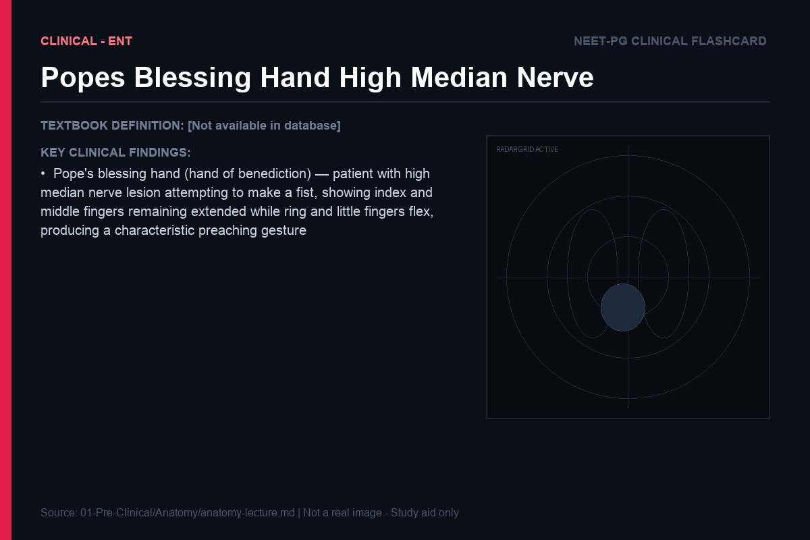
> **IBQ tip:** Pope's blessing appears on attempted fist closure (active) — at rest the hand looks normal. Differentiate from ulnar claw (which is present at REST with ring and little extended, index and middle normal) — the two signs are opposite in which fingers are extended and in the resting vs. active context. A high median nerve injury at the elbow produces Pope's blessing; wrist-level median nerve injury produces only thenar wasting (ape hand) because the long flexors are spared. It then gives off the **anterior interosseous nerve (AIN)**, which supplies the deep flexors: flexor pollicis longus (FPL), and the lateral half of flexor digitorum profundus (FDP to index and middle fingers). AIN also supplies pronator quadratus. The AIN has *no sensory function* — it is purely motor. This matters: AIN palsy produces motor loss without sensory loss. The classic sign: ask the patient to make an "OK" sign — they cannot, because they can't flex the distal phalanx of the thumb (FPL) or index finger (FDP lateral head). Instead of a circle, they make a "pinch" that looks like a triangle or flat-sided figure.

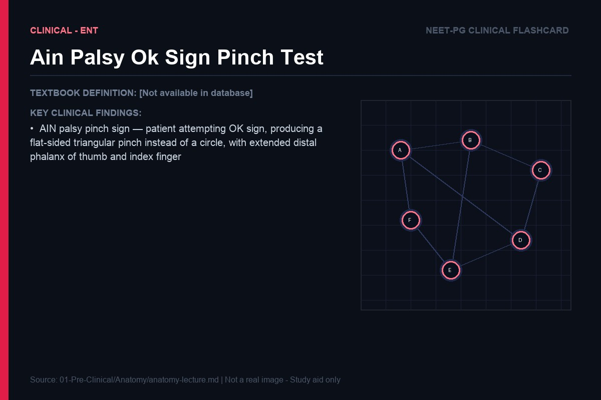
> **IBQ tip:** The AIN pinch sign is purely motor with NO sensory loss — if the patient also has palmar numbness, the lesion is the main median nerve, not the AIN branch. Differentiate from carpal tunnel (which has sensory symptoms and thenar wasting) and from a flexor tendon rupture (where passive flexion of the distal phalanx is also absent).

The main median nerve continues and gives branches to: pronator teres, flexor carpi radialis (FCR), palmaris longus, flexor digitorum superficialis (FDS). All are forearm flexors/pronators. It then passes through the carpal tunnel.

### Carpal Tunnel Syndrome: First Principles

Why does the flexor retinaculum compress the median nerve? Let's think about the anatomy. The carpal tunnel is a rigid osteofibrous tunnel: floor and sides are the concave arch of the carpal bones, roof is the tough, unyielding flexor retinaculum. Through this tunnel pass: 4 tendons of FDS, 4 tendons of FDP, 1 tendon of FPL, and the median nerve — 10 structures in total. The tunnel has essentially no capacity to expand.

Any condition that increases the *contents* of the tunnel (tenosynovitis, fluid retention in pregnancy, hypothyroid myxedema, RA synovitis, ganglion) or decreases the *size* of the tunnel (acromegaly causing bone thickening, lunate dislocation pushing into the tunnel) raises pressure inside. The median nerve, being the softest structure, gets compressed first.

At the level of the carpal tunnel and beyond, the median nerve supplies: **LOAF muscles** — Lumbricals 1 and 2, Opponens pollicis, Abductor pollicis brevis, Flexor pollicis brevis (superficial head). These are the thenar muscles responsible for thumb opposition — the defining human hand movement. Also note: sensory supply is lateral 3.5 fingers (thumb, index, middle, half of ring) on the palmar surface.

> **IBQ tip:** The thumb cannot be brought into opposition (across the palm) and instead lies flat in the plane of the fingers — the "ape" position. Differentiate from ulnar nerve palsy (where the thumb retains opposition but loses adduction, shown by positive Froment's sign) and from a combined median + ulnar palsy (global intrinsic loss with both thenar and hypothenar wasting plus all-four-finger claw).

> **Carpal tunnel sensory trick:** The palmar cutaneous branch of the median nerve arises 5cm proximal to the flexor retinaculum and passes *superficial* to it — not through the carpal tunnel. This branch supplies the skin of the central palm. So in carpal tunnel syndrome, the central palm sensation is *preserved* even though the fingers are numb. If a patient has palm numbness too, the lesion is more proximal.

The symptoms: burning, tingling in the lateral 3.5 fingers, worse at night (because nocturnal fluid redistribution increases tunnel pressure), relieved by hanging the hand over the bed (Flick sign). Thenar wasting in severe cases — the LOAF muscles waste. Opposition is lost: the patient cannot touch the thumb to the base of the little finger.

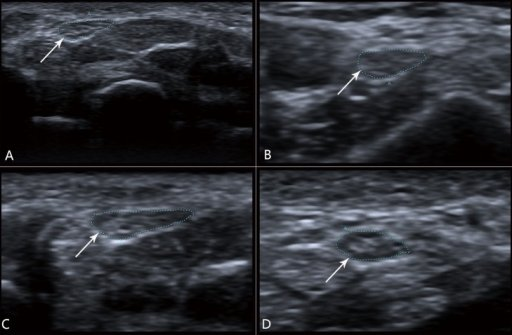
> **IBQ tip:** The wasting is confined to the thenar eminence (radial side of palm) — the hypothenar eminence (ulnar side) is preserved because hypothenar muscles are supplied by the ulnar nerve. Differentiate from combined median + ulnar nerve injury (global intrinsic wasting across entire palm) and from T1 root lesion (where thenar + hypothenar + all intrinsics waste together).

### Tracing the Ulnar Nerve: The "Musician's Nerve"

The ulnar nerve (C8, T1) arises from the medial cord. It is the nerve of fine, intricate finger movements — the interossei, the lumbricals 3 and 4, the hypothenar muscles. Like the median nerve, it gives nothing in the arm. It passes posterior to the medial epicondyle in the **cubital tunnel** — this is the "funny bone" groove. Here, it is completely exposed, vulnerable to direct trauma (leaning on elbows, cubitus valgus deformity from old fractures). Cubital tunnel syndrome is the second most common compression neuropathy after carpal tunnel.

At the elbow, the ulnar nerve gives off a branch to flexor carpi ulnaris (FCU) and the medial half of FDP (ring and little fingers). Important: FCU is the only forearm muscle supplied by the ulnar nerve. It pulls the wrist toward ulnar deviation and flexion.

The ulnar nerve then travels down the medial forearm under FCU, enters the wrist through **Guyon's canal** (between pisiform and hook of hamate), and divides into superficial (sensory) and deep (motor) branches. The deep branch wraps around the hook of hamate to supply all interossei, hypothenar muscles, adductor pollicis, and medial two lumbricals.

**Ulnar claw hand — the logic of the deformity:**

When the ulnar nerve is injured at the wrist (affecting interossei and lumbricals 3,4 but NOT FCU or medial FDP because those branches came off earlier), here's what happens at the ring and little fingers:

Lumbricals 3 and 4 normally flex the MCPJs and extend the IPJs. Without them, the extensor digitorum pulls the MCPJs into hyperextension, and the FDP (whose medial head to ring/little is still working because its branch came off at the elbow) pulls the IPs into flexion. Result: clawing of ring and little fingers (hyperextended MCP + flexed IP).

> **IBQ tip:** Only ring and little fingers claw in ulnar nerve injury (lumbricals 3 and 4 lost) — index and middle fingers are spared because their lumbricals (1 and 2) are median-innervated and intact. Differentiate from Klumpke's total claw (all four fingers) and from a combined median + ulnar lesion (all four fingers claw with complete intrinsic wasting).

> **"Ulnar paradox" — why wrist-level ulnar injury causes MORE clawing than elbow-level injury:** At the wrist, FDP to ring/little is intact (branch came off at elbow), so it actively pulls the IPs into flexion — producing visible clawing. At the elbow, both intrinsics AND FDP medial head are lost, so there is no active IP flexion — less dramatic claw. More proximal injury = less claw. This seems paradoxical (more muscles lost = less deformity) but makes mechanistic sense.

**Froment's sign:** Ask the patient to grip a piece of paper between thumb and index finger. The adductor pollicis (ulnar) is paralyzed, so to grip, the patient compensates by flexing the thumb IP joint using FPL (median nerve). A flexed thumb IP while pinching = positive Froment's = ulnar nerve palsy.

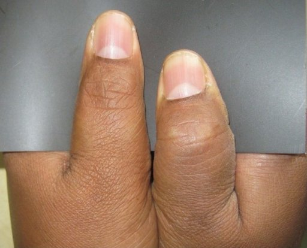
> **IBQ tip:** Compare both hands simultaneously — the affected thumb IP flexes to compensate for absent adductor pollicis, while the normal thumb remains extended (flat) during the same grip. Differentiate from a median nerve lesion, where the patient cannot make the pinch at all (AIN palsy) rather than making it with an abnormal thumb IP posture.

### Tracing the Radial Nerve: The Extension Expert

The radial nerve (C5–C8, posterior cord) is the nerve of all extensors of the upper limb — wrist, fingers, thumb, and elbow. It winds posteriorly around the humerus in the spiral groove and enters the anterior forearm by piercing the lateral intermuscular septum.

At the elbow, it divides into two branches:
- **Superficial radial nerve** (purely sensory — dorsum of hand, lateral 3.5 fingers on the back)
- **Posterior interosseous nerve (PIN)** (purely motor — enters the posterior compartment by piercing supinator muscle, supplies all finger extensors, thumb extensors, abductors)

> **IBQ tip:** Tenderness in the anatomical snuffbox after a fall on an outstretched hand indicates scaphoid fracture until proven otherwise — scaphoid X-rays may be normal initially (10–15% false negative), so MRI or bone scan is needed if clinical suspicion is high. Differentiate from de Quervain's tenosynovitis (tenderness along the tendons forming the lateral border of the snuffbox, positive Finkelstein's test) rather than at the floor.

PIN entrapment at the supinator (Arcade of Frohse) causes finger drop without sensory loss and without wrist drop (because extensor carpi radialis longus gets its branch before the division). Classic PIN palsy: patient can extend the wrist (ECRL intact) but cannot extend fingers. This is different from spiral groove injury where wrist drop is present.

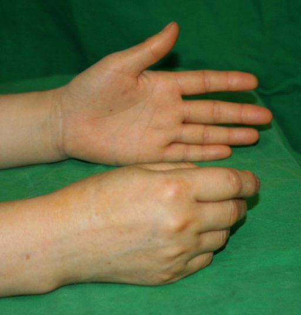
> **IBQ tip:** The preserved wrist extension (radially deviated, because ECRL works but ECU does not) distinguishes PIN palsy from spiral groove radial nerve injury where the wrist also drops. No sensory loss in PIN palsy distinguishes it from superficial radial nerve injury (which causes dorsal hand numbness without motor loss).

---

## 3. Lower Limb

### The Femoral Triangle: A Surgical Crossroads

Before you can understand the femoral triangle clinically, understand why it exists anatomically. When the lower limb embryologically rotates medially (unlike the upper limb which rotates laterally), the major neurovascular structures end up running in front of the hip — in the groin — not behind it. The femoral triangle is the region where all these structures converge before diving into the thigh.

The femoral triangle is bounded by: inguinal ligament (superiorly), sartorius muscle (laterally), adductor longus muscle (medially), and the floor is made by iliacus and psoas (laterally) and pectineus (medially). The apex points inferiorly toward the adductor canal.

The structures within the triangle from lateral to medial follow the mnemonic **NAVY** (Nerve-Artery-Vein-Y-lymphatics) where Y stands for the empty space (the femoral canal containing lymph node of Cloquet):

> **IBQ tip:** The femoral nerve lies OUTSIDE the femoral sheath (most lateral) while artery and vein are inside — this single fact explains why femoral nerve is unaffected by femoral hernias but femoral vein compression causes DVT. Differentiate the femoral triangle from the femoral canal: the canal is the most medial compartment of the femoral sheath and is the path of femoral hernias, not the entire triangle.

- Nerve (femoral nerve) — most lateral, *outside* the femoral sheath
- Artery (femoral artery) — within femoral sheath
- Vein (femoral vein) — within femoral sheath, medial to artery
- Y (empty space/femoral canal) — most medial compartment of femoral sheath, containing fat and Cloquet's lymph node

Why does the nerve sit outside the femoral sheath while the artery and vein are inside? Because the femoral sheath is a continuation of the transversalis fascia (anteriorly) and psoas fascia (posteriorly) — it wraps the vessels which develop within the parietal layer of the body cavity. The femoral nerve, being a nerve, develops from neural tissue and pierces fascia to reach the limb; it doesn't get wrapped in the same fascial sleeve.

> **Clinical relevance:** Femoral hernia descends through the femoral canal (the most medial compartment of the femoral sheath, medial to the vein). It is more common in women because the female pelvis is wider, creating a larger femoral canal. Femoral hernias are notorious for strangulation — the neck is the rigid femoral ring, which cannot expand, making these hernias far more likely to strangulate than inguinal hernias.

Femoral artery catheterization (for cardiac catheterization, angiography) uses the femoral triangle. The needle goes just medial to the midpoint of the inguinal ligament (mid-inguinal point) — this is where the femoral artery pulsates. Pressure is applied after the procedure directly over the artery to prevent hematoma.

### Sciatic Nerve: The Largest Nerve in the Body

The sciatic nerve (L4, L5, S1, S2, S3) is actually two nerves — the tibial (medial) and common peroneal (lateral) — bundled together in a common epineural sheath. They usually separate at the apex of the popliteal fossa, though in some people they separate higher (or in rare anatomical variants, even in the pelvis, with the common peroneal piercing piriformis).

The sciatic nerve leaves the pelvis through the *greater sciatic foramen*, below piriformis (in the infrapiriform compartment). Above piriformis exits the superior gluteal nerve (and vessels); below piriformis exits the sciatic nerve, inferior gluteal nerve, pudendal nerve, nerve to quadratus femoris, nerve to obturator internus, and the posterior femoral cutaneous nerve. This crowded exit makes piriformis syndrome clinically possible: hypertrophy or spasm of piriformis can compress the sciatic nerve here.

In the posterior thigh, the sciatic nerve gives branches to the hamstrings (biceps femoris long head, semimembranosus, semitendinosus) and also to the short head of biceps (via common peroneal component). This means the knee flexors are mostly intact in hip-level sciatic injury, though all muscles below the knee will be paralyzed.

**Foot drop — the mechanistic explanation:**

At the neck of fibula, the common peroneal (fibular) nerve winds around the head of the fibula, completely superficial with no protection. This makes it the most commonly injured large nerve in the body by external compression (tight plaster cast, leg crossing, prolonged squatting). The common peroneal nerve divides into:

- **Deep peroneal nerve** → dorsiflexors (tibialis anterior, extensor digitorum longus, extensor hallucis longus) and evertor (peroneus tertius)
- **Superficial peroneal nerve** → evertor muscles (peroneus longus and brevis) and sensory to dorsum of foot

When the common peroneal nerve is injured, ALL these muscles are lost. Result: the foot cannot dorsiflex (foot drop) and cannot evert. The foot is pulled into plantarflexion and inversion by the unopposed tibialis posterior and gastrocnemius (both tibial nerve). Walking becomes a "steppage gait" — the patient lifts the knee high to clear the dropped foot with each step. Sensory loss is over the dorsum of the foot and lateral leg.

> **IBQ tip:** The foot hangs in plantarflexion AND inversion (tibialis posterior unopposed) — the inversion component distinguishes common peroneal palsy from an L5 root lesion, where hip abduction weakness (gluteus medius) accompanies the foot drop. Absent dorsal foot sensation confirms the peripheral nerve (not root) location of the lesion.

> **Why foot drop at fibular neck but NOT in L4/L5 disc prolapse:** Disc prolapse at L4/5 compresses L5 root, affecting tibialis anterior (foot drop) but also causing weakness of hip abduction (gluteus medius, L5). If hip abduction is weak along with foot drop, think L5 radiculopathy. If only foot drop with no hip abduction weakness, think common peroneal nerve at fibular neck.

### The Lumbar and Sacral Plexus

The lumbar plexus (L1–L4) forms within psoas major muscle. This is why psoas abscess (TB of spine, Crohn's disease) can compress the lumbar plexus, causing thigh numbness and hip flexion weakness. The femoral nerve (L2, L3, L4) is the major terminal branch — hip flexion and knee extension, with sensory supply to anterior thigh and medial leg/foot.

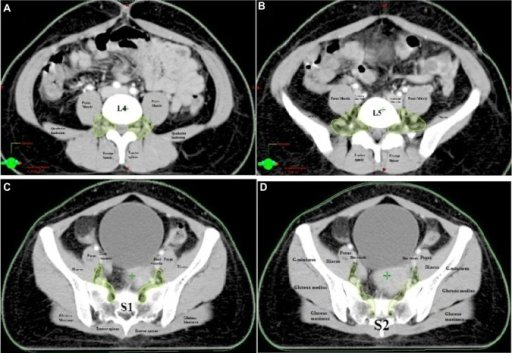
> **IBQ tip:** The key differentiator on this diagram is that the femoral nerve (L2–L4) stays anterior to the hip joint while the sciatic nerve (L4–S3) exits posterior through the greater sciatic foramen — injuries at the hip joint (anterior dislocation vs. posterior dislocation) therefore affect different nerves. Psoas abscess compresses the lumbar plexus proximal to the inguinal ligament, producing combined femoral + obturator weakness rather than an isolated nerve palsy.

The obturator nerve (L2, L3, L4) exits the pelvis through the obturator foramen, supplying adductors of the thigh and medial thigh sensation. In pelvic surgery (hysterectomy, pelvic lymph node dissection), the obturator nerve runs along the lateral pelvic wall — it is at risk of injury. Obturator nerve injury causes weakness of thigh adduction and sensory loss on medial thigh.

The sacral plexus (L4–S3) forms on the anterior surface of piriformis, within the pelvis. During radical pelvic surgery (abdominoperineal resection, Wertheim's hysterectomy), branches of the sacral plexus are at risk, causing bladder/bowel dysfunction and sexual dysfunction alongside any leg weakness.

| Nerve | Roots | Key muscles | Deformity if injured |
|-------|-------|-------------|---------------------|
| Femoral | L2,L3,L4 | Quads, iliopsoas | Knee extension loss, "knee buckling" |
| Obturator | L2,L3,L4 | Adductors | Thigh adduction weakness |
| Sciatic | L4,L5,S1–S3 | All below knee + hamstrings | Loss of all ankle/foot movement |
| Common peroneal | L4,L5,S1 | Dorsiflexors, evertors | Foot drop, inversion |
| Tibial | L4,L5,S1–S3 | Plantarflexors, intrinsic foot | Calcaneovalgus foot (heel walking) |
| Superior gluteal | L4,L5,S1 | Gluteus medius/minimus | Trendelenburg gait |

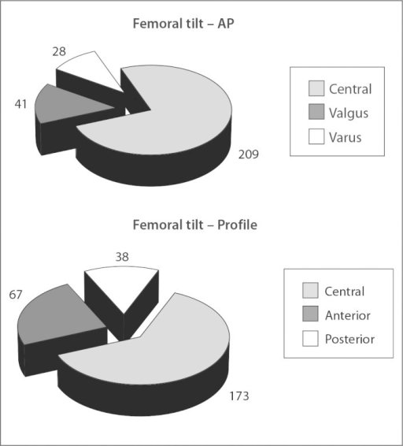
> **IBQ tip:** The pelvis drops on the OPPOSITE (contralateral) side to the weak gluteus medius — remember "the pelvis drops away from the lesion." Differentiate from an antalgic gait (where the patient leans toward the painful hip to reduce joint reaction force) by the characteristic pelvic tilt direction: Trendelenburg tilts contralaterally, antalgic tilts ipsilaterally.
| Inferior gluteal | L5,S1,S2 | Gluteus maximus | Cannot rise from chair/climb stairs |

---

## 4. Thorax — Heart and Great Vessels

### Coronary Circulation: Supply Meets Demand

To understand coronary artery disease, you first need to understand *why* the heart has a special blood supply at all. Every other organ in the body gets perfused during systole — blood is pushed through capillaries under arterial pressure. But the heart is different: when the ventricles contract (systole), the myocardium itself squeezes the intramyocardial vessels shut. The coronary arteries fill primarily during **diastole**, when the myocardium relaxes.

This has a profound implication: the left ventricle, which has a far thicker wall and generates much higher pressures than the right, compresses its own intramyocardial vessels during systole so forcefully that left coronary flow occurs almost *entirely* during diastole. The left ventricular wall essentially acts as its own tourniquet during contraction. Now you understand why tachycardia (which shortens diastole) is so dangerous in patients with coronary artery disease — less diastolic time = less left ventricular perfusion.

The left ventricle does roughly **five times** the work of the right (it ejects against systemic vascular resistance, ~120 mmHg; the right ejects against pulmonary vascular resistance, ~25 mmHg). More work = more oxygen demand = more blood supply needed. This is why the left coronary artery system (LAD + circumflex) supplies a larger territory than the right coronary artery in most people.

### The Left Coronary System

The left main coronary artery (LMCA) arises from the left aortic sinus and runs a short course (< 2 cm typically) behind the pulmonary trunk before dividing into the **left anterior descending (LAD)** and **left circumflex (LCx)** arteries.

The LAD descends in the anterior interventricular groove — the groove on the surface of the heart that overlies the interventricular septum. This is not a coincidence. The LAD is perfectly positioned to send perpendicular branches (septal perforators) deep into the septum. The interventricular septum is embryologically derived from *both* ventricles — it is formed by the muscular ventricular septum growing upward and fusing with the membranous septum — but functionally it is part of the *left* ventricular wall. The left side of the septum forms the left ventricular outflow tract. LAD infarction therefore causes:

1. Anterior wall MI (anterior LV) — from diagonal branches of LAD
2. Septal infarction — from septal perforators
3. Bundle branch blocks — because the bundle of His and left bundle branch run through the upper septum, supplied by first septal perforator
4. Papillary muscle dysfunction — anterolateral papillary muscle (LAD territory) → mitral regurgitation

> **LAD = "widow maker":** Because it supplies the bulk of the LV, proximal LAD occlusion causes massive anterior MI, often with acute left heart failure. The term "widow maker" reflects the historically high mortality before revascularization therapy.

The left circumflex (LCx) passes in the left atrioventricular groove (between left atrium and left ventricle), supplying the lateral and posterior LV wall. In "left dominant" circulation (seen in ~15% of people), the LCx gives off the posterior descending artery (PDA).

### RCA and the Concept of Dominance

The right coronary artery (RCA) arises from the right aortic sinus and passes in the right atrioventricular groove. It supplies the right ventricle and, crucially, the **SA node** (55% of people, from a proximal RCA branch) and the **AV node** (90% of people, from the AV nodal artery — a branch of whichever artery crosses the crux of the heart). This is why inferior MI (RCA territory) commonly presents with bradycardia and heart blocks — the conduction system is in the RCA territory.

**Coronary dominance** is defined by which artery gives rise to the PDA (posterior descending artery). The PDA runs in the posterior interventricular groove and supplies the posterior one-third of the interventricular septum and the inferior LV wall.

- **Right dominant (85%):** RCA gives off PDA → RCA supplies inferior LV, posterior septum, AV node
- **Left dominant (8%):** LCx gives off PDA
- **Co-dominant (7%):** Both contribute

Clinical pearl: In a left-dominant patient who has a major LCx occlusion, they lose the PDA — meaning a left-sided blockage also knocks out the inferior LV wall and the AV node. This is an unusually large territory for a circumflex occlusion.

### Cardiac Valves: Anatomy of Auscultation

The four cardiac valves all lie at roughly the same level — the base of the heart — clustered around the fibrous cardiac skeleton. From right to left: tricuspid, pulmonary, mitral, aortic. The fibrous skeleton anchors them and electrically insulates the atria from the ventricles (except through the AV node).

But you don't auscultate valves where they anatomically sit. You auscultate them *downstream* — where the sound carried by blood flow is loudest. Blood flow creates turbulence and sound; that sound travels *with* the flow direction.

| Valve | Anatomical location | Auscultation area | Why |
|-------|--------------------|--------------------|-----|
| Aortic | Right, 2nd intercostal space | Right 2nd ICS (RSB) | Blood flows up into aorta → sound carries rightward and upward |
| Pulmonary | Left, 2nd intercostal space | Left 2nd ICS (LSB) | Blood flows into pulmonary trunk → sound carries leftward |
| Mitral | Behind sternum at 4th rib | Apex (5th ICS, MCL) | Blood flows from LA to LV to apex; LV apex is most superficial |
| Tricuspid | Behind sternum at 5th rib | Lower left sternal border | Blood flows toward right ventricular apex |

> **Mnemonic for valve sounds at exam spots — "All Physicians Take Money":** Aortic (right 2nd), Pulmonary (left 2nd), Tricuspid (lower LSB), Mitral (apex). Real auscultation is about understanding flow direction — this is why mitral stenosis is heard best at the apex with the patient in left lateral decubitus (brings the apex closer to the chest wall).

### The Mediastinum: A Logical Compartment Map

The mediastinum is the central compartment of the thorax, flanked by the pleural cavities on each side. It is divided into:

**Superior mediastinum** (above the sternal angle of Louis, which corresponds to the T4/T5 disc level — where the aorta arches, the trachea bifurcates, and the superior vena cava enters the pericardium):
Contents: arch of aorta and its branches (brachiocephalic, left CCA, left subclavian), SVC, brachiocephalic veins, trachea, esophagus, thoracic duct, thymus, vagus nerves, phrenic nerves, left recurrent laryngeal nerve (loops around ligamentum arteriosum).

**Inferior mediastinum** is divided by the pericardium:
- **Anterior** (between sternum and pericardium): thymus (in children), fat, lymph nodes. Thymoma, teratoma, terrible lymphoma, thyroid — the "4 T's" of anterior mediastinal masses.
- **Middle**: heart and pericardium, ascending aorta, lower SVC, bifurcation of trachea (carina), main bronchi, phrenic nerves.
- **Posterior** (between pericardium and vertebral column): descending thoracic aorta, esophagus, thoracic duct, azygos vein, sympathetic chain, splanchnic nerves. Neurogenic tumors (most common posterior mediastinal mass), hiatus hernia, aortic aneurysm.

> **Why the left recurrent laryngeal nerve (RLN) loops so low:** The RLN hooks around the ligamentum arteriosum (remnant of ductus arteriosus) adjacent to the aortic arch. This is deep in the chest, far from the larynx. This long intrathoracic course makes the left RLN vulnerable to compression by lung tumors (especially left hilar carcinoma), enlarged lymph nodes, aortic aneurysm — causing a hoarse voice from a chest disease.

---

## 5. Abdomen

### Inguinal Canal: A Story of Descent

To truly understand the inguinal canal, you need to go back to embryology. During fetal development, the testes begin their life in the retroperitoneum, near the kidneys. They then descend — guided by the gubernaculum — first across the posterior abdominal wall, then through the anterior abdominal wall via the inguinal canal, and finally into the scrotum. This happens between weeks 28–32 of gestation.

As the testis descends, it drags a finger of peritoneum along with it — the **processus vaginalis**. Think of it like pushing your finger into a deflated balloon: the finger (testis) pushes into the balloon (peritoneum), and the balloon wraps around your finger on all sides. This processus vaginalis normally obliterates after birth (when it no longer needs to allow descent), leaving behind only the tunica vaginalis surrounding the testis.

If the processus vaginalis fails to close, you have a patent channel from the peritoneal cavity down to the scrotum. This is the anatomical basis of **indirect inguinal hernia** — abdominal contents can herniate through the *internal* inguinal ring (the opening in the transversalis fascia) into the patent processus vaginalis, travel through the inguinal canal, and potentially enter the scrotum. This is why indirect inguinal hernias are congenital in nature, more common in males (because of testicular descent), and in males enter the scrotum.

**Direct inguinal hernia** is an acquired weakness — it pushes directly through the *posterior wall* of the inguinal canal (specifically Hesselbach's triangle: medial to inferior epigastric vessels, lateral to rectus abdominis, above inguinal ligament). It does not pass through the internal ring — it pushes directly forward through weakened transversalis fascia. Direct hernias are almost never in the scrotum, because they protrude medially, not down the canal path.

> **IBQ tip:** On laparoscopy, the inferior epigastric vessels are the landmark — a direct hernia defect lies MEDIAL to these vessels (inside Hesselbach's triangle), while an indirect hernia enters through the internal ring LATERAL to the vessels. This medial vs. lateral relationship to the inferior epigastric artery is the single most reliable intraoperative differentiator.

> **The coverings tell the story:** Indirect hernias acquire three coverings (internal spermatic fascia from transversalis fascia, cremasteric fascia from internal oblique, external spermatic fascia from external oblique) because the hernial sac passes through all three layers. Direct hernias only acquire external spermatic fascia (they push through the posterior wall, not through the internal ring).

**Calot's triangle** (hepatocystic triangle): bounded by the cystic duct (inferiorly), the common hepatic duct (medially), and the inferior surface of the liver (superiorly). The cystic artery (usually a branch of the right hepatic artery) runs within this triangle — the surgeon must identify and clip it here during cholecystectomy.

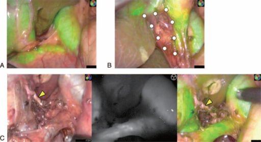
> **IBQ tip:** The cystic artery is the key structure to identify within Calot's triangle before clipping — an accessory right hepatic artery passing through this triangle is a dangerous anatomical variant (present in ~20%) that can be mistaken for the cystic artery and inadvertently clipped. Differentiate the hepatocystic triangle (Calot's — bounded by liver, CHD, cystic duct) from the hepatoduodenal ligament (contains portal triad: portal vein, hepatic artery, bile duct).

**The canal itself:** It runs from internal ring (in transversalis fascia, 1.5 cm above the midinguinal point) to external ring (in external oblique aponeurosis, above and medial to pubic tubercle), passing obliquely at roughly 4 cm. Its walls:
- Anterior wall: external oblique aponeurosis (full length) + internal oblique (lateral one-third)
- Posterior wall: transversalis fascia (full length) + conjoint tendon (medial one-third)
- Roof: arched fibers of internal oblique and transversus abdominis
- Floor: inguinal ligament + lacunar ligament medially

### The Lesser Sac and Foramen of Winslow

The lesser sac (omental bursa) is a potential space behind the stomach and lesser omentum, communicating with the greater peritoneal cavity only through the **foramen of Winslow** (epiploic foramen). The foramen of Winslow is bounded anteriorly by the free edge of the lesser omentum (containing the portal triad: portal vein, hepatic artery, bile duct), posteriorly by the inferior vena cava, superiorly by the caudate lobe of the liver, and inferiorly by the first part of the duodenum.

> **IBQ tip:** A pancreatic pseudocyst preferentially collects in the lesser sac because the pancreas forms its posterior wall — on CT, fluid behind the stomach anterior to the pancreas confined by the lesser sac boundaries is the classic appearance. Differentiate from a mesenteric cyst (freely mobile, not confined to the lesser sac boundaries) and from perigastric ascites (which communicates freely with the greater peritoneal cavity).

### Portal Hypertension and Porto-Systemic Anastomoses

The portal vein drains the entire gastrointestinal tract (from lower esophagus to upper rectum), spleen, pancreas, and gallbladder. All this blood, rich in absorbed nutrients (and toxins, drugs, bacteria), passes through the liver before reaching the systemic circulation. The liver is the gatekeeper.

Normal portal pressure is 5–10 mmHg. When the liver is diseased (cirrhosis being the most common cause — fibrous bands distort and compress the sinusoids, raising resistance), pressure backs up in the portal system. Portal hypertension is defined as portal pressure > 12 mmHg (or porto-hepatic gradient > 5 mmHg).

Now, blood under high pressure seeks alternative routes — collateral channels that connect the high-pressure portal system to the low-pressure systemic venous system. These **porto-systemic anastomoses** exist normally as tiny connections, but under portal hypertension they dilate massively into **varices**:

**1. Gastro-esophageal junction:** Left gastric (portal) veins connect with esophageal tributaries of azygos (systemic). These become **esophageal varices** — the most dangerous, because they can rupture causing massive upper GI bleed with very high mortality.

**2. Umbilicus:** Paraumbilical veins (remnants of umbilical vein, portal side) connect with superficial epigastric veins (systemic). These appear as dilated tortuous veins radiating from the umbilicus — **caput medusae** (the Medusa's head pattern).

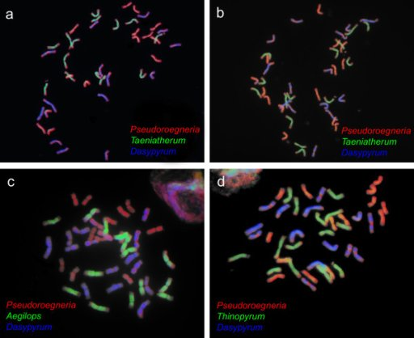
> **IBQ tip:** The veins radiate outward FROM the umbilicus in all directions — flow is away from the umbilicus (centrifugal). Differentiate from inferior vena cava obstruction, where dilated abdominal veins run vertically up both flanks with upward flow but do NOT converge at the umbilicus. Confirming flow direction by occluding and releasing is the classic clinical test.

**3. Rectum:** Superior rectal vein (portal, drains from inferior mesenteric) connects with middle and inferior rectal veins (systemic, draining to internal iliac). These become **anorectal varices** — distinct from hemorrhoids (which are dilated venous plexuses unrelated to portal hypertension, though both can occur simultaneously).

**4. Retroperitoneum:** Veins of Retzius — connections between retroperitoneal portal tributaries (colic veins) and systemic retroperitoneal veins. Also around the bare area of the liver.

> **Why esophageal varices bleed so catastrophically:** The submucosa of the lower esophagus is thin; the veins lie just beneath a delicate epithelium. The pressure in portal hypertension can be 20–30+ mmHg — several times the normal capillary pressure. Even minor trauma (swallowing, retching) can rupture these turgid, thin-walled vessels, causing hemorrhage that can exsanguinate a patient rapidly.

### McBurney's Point and the Appendix

McBurney's point is located one-third of the way from the anterior superior iliac spine (ASIS) to the umbilicus. This point overlies the base of the appendix on the surface of the abdomen. But why does appendicitis cause *pain at this specific point*?

> **IBQ tip:** The point is one-third from the ASIS (not one-third from the umbilicus) — a common reversal error in MCQs. On clinical examination, maximum tenderness here combined with a history of pain that migrated from the periumbilical region (T10 dermatome) to this spot is pathognomonic of appendicitis; Rovsing's sign (left-side pressure causing right-sided pain) further confirms peritoneal irritation at this location.

The logic is in dermatomes. The appendix is supplied by visceral afferent nerves traveling with sympathetic fibers at the **T10** level. When inflammation first begins (acute visceral phase), the pain is referred to the **T10 dermatome** — which is the periumbilical region. This is classic appendicitis: starts with central, periumbilical, dull, poorly localized pain.

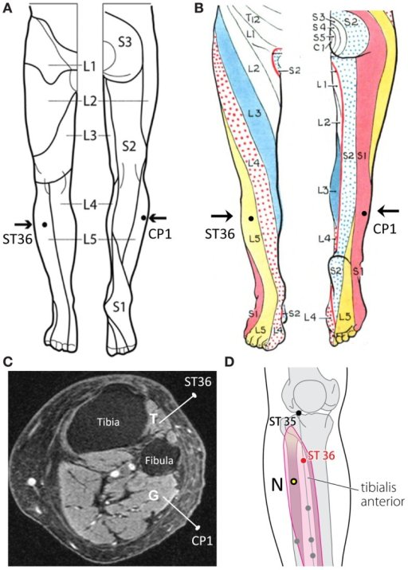
> **IBQ tip:** The T10 dermatome at the umbilicus is the highest-yield dermatome landmark — it explains periumbilical referral in appendicitis, ureteric colic (T10–L1), and testicular pain (T10, because the testis descended from the same embryological level as the appendix). Differentiate visceral (T10 referral, dull, poorly localised) from somatic (L1 at RIF, sharp, precisely localised) pain in appendicitis progression.

As inflammation progresses and the parietal peritoneum overlying the appendix gets inflamed (somatic phase), the pain now involves **somatic afferents** of the overlying skin — which, in the right iliac fossa, are L1 dermatome fibers (ilioinguinal and iliohypogastric nerves, also supplying the groin and scrotum). The pain becomes sharp, localized, and exquisitely tender at McBurney's point — because that's where the inflamed appendix contacts the peritoneum.

The migration of pain from umbilicus → right iliac fossa is *pathognomonic* of appendicitis. Any right iliac fossa pain that did NOT start centrally should make you question the diagnosis.

Rovsing's sign (pressing on left side causes right-sided pain) works because pressing left shifts the bowel and peritoneal contents to the right, stretching the inflamed peritoneum over the appendix. Psoas sign (pain on right hip extension) works when the appendix is retrocaecal — lying on the psoas muscle, which is stretched by hip extension.

---

## 6. Head and Neck

### The Cavernous Sinus: A Venous Lake of Clinical Importance

The cavernous sinus is not a true sinus in the sense of a hollow channel — it is a trabeculated, sponge-like venous lake on either side of the sella turcica (the bony seat of the pituitary gland). Think of it as a blood-filled sponge perched beside the pituitary, through which several critical structures pass on their way from the brain to the orbit and face.

What runs *through* the cavernous sinus (within its substance or its lateral wall):

 *([Source: Radiopaedia](https://radiopaedia.org/articles/cavernous-sinus))*
> **IBQ tip:** On coronal MRI, the cavernous sinus appears as a signal-enhancing structure flanking the pituitary — asymmetric enhancement or lateral wall bulging indicates pathology. Differentiate cavernous sinus thrombosis (bilateral involvement, fever, chemosis) from a carotid-cavernous fistula (pulsatile proptosis, bruit audible over the orbit, arterialized conjunctival vessels).

**Inside the sinus itself (surrounded by venous blood):**
- Internal carotid artery (the cavernous segment, making its S-shaped carotid siphon)
- Abducens nerve (CN VI) — cranial nerve 6, which supplies lateral rectus (eye abduction)

**In the lateral wall of the cavernous sinus (from superior to inferior):**
- Oculomotor nerve (CN III) — superior division of superior wall, inferior division of lateral wall
- Trochlear nerve (CN IV) — below CN III in lateral wall
- Ophthalmic division of trigeminal (V1)
- Maxillary division of trigeminal (V2) — lowest, at inferior margin of lateral wall

This anatomical packing of critical nerves explains why cavernous sinus pathology — thrombosis, tumor, carotid-cavernous fistula — presents with a characteristic syndrome: ipsilateral ophthalmoplegia (multiple eye movement nerves affected), Horner's syndrome (sympathetic fibers ride along the internal carotid artery through the sinus), and facial numbness in the V1/V2 distribution.

> **Cavernous sinus thrombosis:** Infection spreads from the "danger triangle of the face" (region bounded by corners of mouth to bridge of nose) — because veins in this region (facial vein, angular vein) have NO valves and drain backward through the ophthalmic veins into the cavernous sinus. Squeezing a pimple in the danger triangle can push infected material retrogradely into the cavernous sinus → septic thrombosis → bilateral ophthalmoplegia, chemosis, proptosis, high fever. This is a neurosurgical emergency with high mortality.

**Carotid-cavernous fistula:** An abnormal connection between the internal carotid artery and the cavernous sinus — usually from trauma (base of skull fracture). Arterial blood under high pressure pours into the venous sinus, raising venous pressure. The patient develops pulsatile proptosis (the eye pulses with the heartbeat), chemosis (conjunctival redness/edema), and a bruit heard over the eye. The high venous pressure prevents orbital venous drainage.

### Thyroid Gland: Blood Supply and the Danger of RLN

The thyroid gland is a butterfly-shaped structure sitting on the anterior trachea, from C5 to T1. It is one of the most vascular organs in the body — proportionally receiving more blood flow per gram than the kidney. This vascularity exists because it is an endocrine gland manufacturing hormones that require iodine delivered by the blood.

Blood supply:
- **Superior thyroid artery** (first branch of external carotid artery) → upper pole
- **Inferior thyroid artery** (from thyrocervical trunk, a branch of subclavian artery) → lower pole and posterior surface
- **Thyroidea ima artery** (unpaired, from brachiocephalic or arch of aorta) → present in 10% of people, runs in the midline — surgical hazard during emergency tracheotomy

The **recurrent laryngeal nerve (RLN)** — a branch of the vagus (CN X) — loops back up from the thorax to supply all intrinsic laryngeal muscles *except* cricothyroid (which is supplied by the external laryngeal nerve, superior laryngeal nerve branch). The larynx's function: voicing (vocal cord tension and adduction), swallowing (closing the glottis), and breathing (opening the glottis between breaths).

The RLN's surgical danger lies in its relationship to the inferior thyroid artery. The nerve and artery are intimately intertwined at the level of the lower pole of the thyroid, where the artery passes between branches of the RLN in many individuals. Surgeons must identify and preserve the RLN before ligating the inferior thyroid artery.

**RLN injury during thyroidectomy:**

- *Unilateral RLN injury:* The vocal cord on that side is paralyzed, usually in the paramedian position (slightly medial, near the midline). The other cord compensates partially by crossing to the midline. Result: hoarse, weak, breathy voice. Over time, the opposite cord often fully compensates and voice improves.

- *Bilateral RLN injury:* Both cords may lie near the midline. The patient cannot open the glottis to breathe. Severe stridor, respiratory distress requiring emergency tracheotomy. This is a feared complication of total thyroidectomy.

- *External laryngeal nerve injury:* Damages cricothyroid (which tenses the vocal cord, producing high-pitched sounds). Singer's nerve — a professional singer's career can be devastated by losing the ability to hit high notes, even with normal speaking voice.

> **Why is the right RLN shorter and in a less vulnerable position than the left?** The left RLN loops around the ligamentum arteriosum (aortic arch level), taking a longer intrathoracic course and passing through more surgical territory. The right RLN loops around the right subclavian artery, higher and more lateral. Both enter the larynx in the tracheoesophageal groove behind the thyroid — but the left has more territory to travel through.

### Cranial Nerve Nuclei and Clinical Localization

The brainstem is organized segmentally — cranial nerve nuclei line the floor of the fourth ventricle in a predictable pattern. Understanding which cranial nerves emerge from which brainstem level helps you localize lesions precisely:

- **Midbrain**: CN III (oculomotor) and CN IV (trochlear)
- **Pons**: CN V (trigeminal), VI (abducens), VII (facial), VIII (vestibulocochlear)
- **Medulla**: CN IX (glossopharyngeal), X (vagus), XI (spinal accessory, partially), XII (hypoglossal)

A "crossed" neurological syndrome — ipsilateral cranial nerve deficit + contralateral hemiplegia — is the hallmark of a brainstem lesion. The cranial nerve is affected ipsilaterally (because its nucleus is in the brainstem on that side), but the corticospinal tract (which crosses at the medullary pyramids) causes contralateral limb weakness. This crossed pattern is impossible to create with a cortical lesion.

---

## 7. Neuroanatomy

### The Internal Capsule: The Bottleneck of the Brain

Imagine the brain's motor and sensory systems as highways. The cerebral cortex is a vast, distributed network — billions of neurons across the cortex formulating movement, receiving sensation. But all these signals must eventually converge into the spinal cord through the brainstem — like a vast interstate highway system funneling into a single tunnel.

The internal capsule is that tunnel. It is a dense white matter tract — a compact collection of projection fibers — lying between the lentiform nucleus (putamen + globus pallidus) laterally and the caudate nucleus + thalamus medially. All fibers passing between cortex and spinal cord (corticospinal, corticobulbar) and between thalamus and cortex (thalamocortical, carrying sensory information) must pass through this narrow corridor.

The internal capsule has a characteristic bent shape (like a boomerang or the letter "V") when viewed in a horizontal section. Its parts:

**Anterior limb** (between caudate and lentiform): frontopontine fibers (connecting prefrontal cortex to pons/cerebellum) and anterior thalamic radiations (connecting thalamus to frontal lobe).

**Genu** (the bend): corticobulbar fibers — the upper motor neuron fibers going to cranial nerve motor nuclei (for face, speech, swallowing).

**Posterior limb** (between thalamus and lentiform): this is the most critical part for NEET PG:
- Corticospinal fibers (for limbs) — in the *anterior* part of posterior limb
- Sensory fibers (thalamocortical) — in the *posterior* part of posterior limb
- Optic radiations — in the *retrolenticular* part
- Auditory radiations — in the *sublenticular* part

> **Why a small internal capsule bleed causes massive deficits:** A hemorrhage the size of a grape in the posterior limb of the internal capsule will sever ALL the motor fibers to the contralateral body (face, arm, leg simultaneously) and ALL the sensory fibers from the contralateral body. This produces pure motor hemiplegia or sensorimotor hemiparesis affecting face, arm, and leg equally — which is far more complete than any cortical lesion (where some areas would be spared due to the large cortical surface area).

**Blood supply of the internal capsule:** The lenticulostriate arteries — small perforating branches arising directly from the M1 segment of the middle cerebral artery (MCA). These are end-arteries with no collateral supply. In hypertension, these small vessels develop lipohyalinosis (fibrinoid degeneration) and are prone to rupture → hypertensive hemorrhage into the basal ganglia/internal capsule. This is the classic "hypertensive bleed" — a patient with uncontrolled hypertension suddenly develops contralateral hemiplegia during exertion.

The "watershed" between MCA and ACA territory passes through the internal capsule — ACA supplies some anterior limb (Heubner's artery), MCA supplies the genu and posterior limb through lenticulostriate arteries.

### Basal Ganglia: The Movement Accelerator and Brake

The basal ganglia are a collection of subcortical nuclei — the striatum (caudate + putamen), globus pallidus (internal, GPi; external, GPe), subthalamic nucleus (STN), and substantia nigra (pars compacta, SNc; pars reticulata, SNr). They form a loop with the cortex: Cortex → Striatum → Globus Pallidus/SNr → Thalamus → Cortex.

The key insight is that the basal ganglia don't initiate movement — they *select and amplify* wanted movements while *suppressing* unwanted movements. Think of it like a spotlight system in a theatre: the basal ganglia direct the spotlight of movement onto the right muscle groups and ensure other, competing movements are dimmed.

There are two pathways:

**Direct pathway (Go signal — movement facilitation):**
Cortex → Striatum → GPi/SNr (inhibition) → Thalamus (disinhibited, now excites cortex) → Movement

The striatum inhibits GPi. GPi normally inhibits the thalamus (tonic inhibition). If GPi is inhibited, the thalamus is released (disinhibited) and can excite the motor cortex. Net effect: dopamine (from SNc) *facilitates* the direct pathway via D1 receptors on striatal neurons → more movement.

**Indirect pathway (Stop signal — movement suppression):**
Cortex → Striatum → GPe (inhibition) → STN (disinhibited) → GPi (excitation) → Thalamus (more inhibited) → Less movement

Dopamine *inhibits* the indirect pathway via D2 receptors → less braking → more movement. So dopamine overall promotes movement by facilitating the go-pathway and suppressing the stop-pathway.

**Parkinson's Disease:** Loss of dopaminergic neurons in SNc → decreased dopamine → direct pathway underactive (less movement signal) + indirect pathway overactive (more braking). Net result: thalamus excessively inhibited → cortex under-stimulated → bradykinesia (slowness), rigidity (constant muscle tone because the brake is always partially applied), resting tremor (at 4–6 Hz, from oscillations in the basal ganglia-thalamic loop). Treatment: dopamine replacement (L-DOPA) restores the balance.

**Huntington's Disease:** Trinucleotide repeat expansion (CAG in huntingtin gene). The first cells to die are the striatal neurons projecting to GPe — these are the indirect pathway neurons. Loss of indirect pathway (Stop signal) → less braking → thalamus overactive → cortex over-stimulated → **hyperkinesia** (chorea — involuntary, random, dance-like movements). Later, as the disease progresses, direct pathway neurons also die → hypokinesia.

> **Memory anchor:** In Parkinson's, the brake is always ON (rigidity, bradykinesia). In Huntington's, the brake is broken first (chorea). Both conditions can be understood from which pathway is preferentially damaged.

### Cerebellum: The Error-Correction Processor

The cerebellum does not initiate movement — the motor cortex does that. The cerebellum's role is to *compare* the intended movement (efference copy from motor cortex) with the actual movement (sensory feedback from the limbs, vestibular system, visual system) and send *corrective signals* to smooth out errors. Think of it as the autopilot that keeps a plane on course, constantly making micro-corrections.

Anatomically, the cerebellum is organized into three functional zones:

**Vermis (midline):** Receives input from the spinal cord (spinocerebellar tracts) about trunk and proximal limb position. Controls axial muscles — balance, posture, gait, eye movements. Vermis lesions (e.g., in chronic alcoholism, which selectively damages the anterior vermis) cause **truncal ataxia and gait ataxia**: the patient staggers with a wide-based gait (cerebellar gait, also called "drunken gait"). Limb coordination may be relatively preserved.

**Intermediate zone (paravermal):** Receives proprioceptive input from limbs via spinocerebellar tracts + input from motor cortex. Controls distal limb coordination during voluntary movement.

**Lateral hemispheres:** Largest and most developed in humans (reflecting our manual dexterity). Receive input from the contralateral motor cortex via corticopontocerebellar pathway (cortex → pons → contralateral cerebellar hemisphere). Control ipsilateral limb movements — planning and executing fine, skilled movements. Hemispheric lesions cause **ipsilateral limb ataxia**: intention tremor (tremor that worsens as the hand approaches a target — because the error-correction system is oscillating around the target), dysdiadochokinesia (inability to do rapid alternating movements), dysmetria (past-pointing — the finger overshoots the target).

> **The double-crossing logic of the cerebellum:** The cerebellar hemispheres control ipsilateral limbs, despite the fact that the cerebral cortex controls contralateral limbs. How? Because the circuit double-crosses. Input to the cerebellum from the cortex crosses in the pons (corticopontocerebellar). Output from the cerebellum crosses back in the superior cerebellar peduncle (dentate-rubro-thalamic tract). Two crosses = ipsilateral control. A right cerebellar hemisphere lesion causes right-sided limb ataxia.

**Three cerebellar peduncles — which carries what:**
- Inferior cerebellar peduncle (restiform body): input — spinocerebellar tracts (from spinal cord), olivocerebellar tract (from inferior olive), vestibulocerebellar
- Middle cerebellar peduncle (brachium pontis): input — pontocerebellar (from contralateral pons, relaying cortical signals)
- Superior cerebellar peduncle (brachium conjunctivum): output — dentate-rubro-thalamic tract to contralateral thalamus/cortex

---

## 8. Embryology

### Germ Layers: The Logic of Derivation

After fertilization and early cell divisions, the embryo goes through gastrulation — one of the most dramatic events in development. The single-layered epiblast reorganizes into three germ layers via the primitive streak. Understanding *why* each germ layer gives rise to what it does is far more powerful than memorizing a table.

**Ectoderm** is the outermost layer. It covers the body surface and it also invaginates inward to form the nervous system (neural plate → neural tube). The logic: ectoderm = *surface + nervous system*. Anything on the surface (epidermis, hair, nails, skin glands, lens of the eye — which is an invagination of surface ectoderm), and anything derived from neural tissue (brain, spinal cord, peripheral nerves, retina, posterior pituitary [neural tissue], adrenal medulla [neural crest], melanocytes [neural crest], dental enamel [enamel organ from oral ectoderm]).

**Mesoderm** is the middle layer. It fills the space between ectoderm and endoderm, forming the structural scaffold of the body. The logic: mesoderm = *connective tissue, muscle, bone, blood, and internal organs' supporting stroma*. Specific derivatives: skeleton (vertebrae, limb bones), musculature (cardiac, smooth, skeletal), cardiovascular system (heart, blood vessels, blood cells), kidneys (from intermediate mesoderm — metanephric mesoderm), gonads, adrenal cortex (intermediate/urogenital ridge mesoderm), spleen (mesoderm despite being a lymphoid organ), serous lining of body cavities (pleura, peritoneum, pericardium — from lateral plate mesoderm/splanchnopleure).

**Endoderm** is the inner layer, lining the primitive gut tube. The logic: endoderm = *internal lining and glands derived from that lining*. Derivatives: epithelial lining of GI tract, respiratory tract, urinary bladder and urethra (from cloaca), thyroid gland (from pharyngeal endoderm, descends through thyroglossal duct), parathyroid glands (from pharyngeal pouches 3 and 4), thymus (from pharyngeal pouch 3), liver (hepatic diverticulum from foregut endoderm), pancreas (dorsal and ventral buds from foregut endoderm), lungs (from laryngotracheal groove in foregut endoderm), anterior pituitary (from Rathke's pouch — oral ectoderm, NOT endoderm — important exception).

> **A good question to test yourself:** The adrenal gland has two parts. The cortex (secretes cortisol, aldosterone) is derived from *mesoderm* (intermediate mesoderm/coelomic epithelium). The medulla (secretes adrenaline) is derived from *neural crest ectoderm* — it is essentially a modified sympathetic ganglion. This explains why neuroblastomas can arise from the medulla (neural tissue), while adrenocortical carcinomas arise from the cortex (mesoderm).

### Pharyngeal Arches: The Pattern of Nerve-Muscle Linkage

The pharyngeal (branchial) arches are the evolutionary remnants of gill arches in fish ancestors. In human embryos (weeks 4–7), six pairs of arches develop in the head and neck. Each arch contains a cartilage bar, a muscle mass, an artery, and a cranial nerve.

The fundamental rule: **the nerve of the arch supplies the muscles derived from that arch**. This rule is inviolable because it reflects how developmental migration works — muscles migrate away from their arch of origin, but they keep the nerve they were given at birth (the nerve migrates with the muscle or grows along with it). So no matter how far a muscle migrates during development, its nerve of supply tells you which arch it came from.

**Arch 1 (mandibular arch):** Nerve = V3 (mandibular division of trigeminal). Muscles: muscles of mastication (temporalis, masseter, medial/lateral pterygoids), mylohyoid, anterior belly of digastric, tensor tympani, tensor veli palatini. Cartilage: Meckel's cartilage → malleus, incus (middle ear ossicles!), anterior ligament of malleus, sphenomandibular ligament.

**Arch 2 (hyoid arch):** Nerve = CN VII (facial nerve). Muscles: muscles of facial expression, stapedius, stylohyoid, posterior belly of digastric, platysma. Cartilage: Reichert's cartilage → stapes, styloid process, stylohyoid ligament, lesser cornu of hyoid.

**Arch 3:** Nerve = CN IX (glossopharyngeal). Muscles: stylopharyngeus (the ONLY muscle of arch 3 — and notably, stylopharyngeus is the only pharyngeal muscle supplied by CN IX). Cartilage: greater cornu of hyoid, lower body of hyoid.

**Arches 4 and 6:** Nerve = CN X (vagus), specifically: arch 4 → superior laryngeal nerve (cricothyroid muscle, pharyngeal constrictors); arch 6 → recurrent laryngeal nerve (all intrinsic laryngeal muscles except cricothyroid). Note: there is no arch 5 in humans (it regresses). This is why the RLN, as a nerve of arch 6, loops so inferiorly — it follows the path of the sixth arch artery (which becomes the ductus arteriosus on the left, and regresses on the right leaving only the segment around the subclavian artery).

> **Clinical pearl:** If a patient has a pharyngeal pouch (Zenker's diverticulum) — it herniated through Killian's dehiscence, the gap between the thyropharyngeus and cricopharyngeus parts of inferior pharyngeal constrictor. Both are derived from mesoderm of arches 4/6, both supplied by the vagus — so both are affected in vagal damage, weakening the sphincter effect and allowing the pouch to form.

### Neural Tube Defects and Folic Acid

The neural plate — a flat sheet of dorsal ectoderm — folds upward at both edges (neural folds) and the two edges fuse in the dorsal midline, forming the neural tube. This fusion begins in the middle and zips toward both ends (cranially and caudally) from days 22–28. The anterior neuropore closes on day 25; the posterior neuropore closes on day 27.

Failure of anterior neuropore closure → **anencephaly** (no forebrain development, the brain tissue is exposed and degenerates — incompatible with life). Failure of posterior neuropore closure → **spina bifida** (spinal column defect, with a spectrum from spina bifida occulta to meningocele to myelomeningocele).

Why does folic acid prevent neural tube defects? Folate is essential for the synthesis of thymidine (a DNA nucleotide — specifically for methylation of dUMP to dTMP by thymidylate synthase, using 5,10-methylenetetrahydrofolate as the methyl donor). Without adequate thymidine, rapidly dividing cells cannot replicate their DNA quickly enough. The neural plate cells during neurulation are among the most rapidly dividing cells in the entire embryo. Folate deficiency slows their replication, interferes with the precise timing of neural fold fusion, and increases the risk of failure to close.

The supplementation timing is critical: neurulation occurs in weeks 3–4, before most women even know they are pregnant. This is why **periconceptional** folate supplementation (starting at least one month before conception) is recommended — not just once pregnancy is confirmed.

### Heart Development: Septation Logic

The primitive heart tube begins beating on day 22, before it even has proper chambers. The original tube is a single-lumen tube with a simple flow from caudal (venous, sinus venosus) to cranial (arterial, aortic arches). The tube then folds rightward (D-loop — dextral looping, normally to the RIGHT — if it loops leftward, you get situs inversus or more complex congenital heart disease), bringing the future ventricle caudally and the future atria cranially.

**Atrial septation:** Two septa form, one after the other. The septum primum grows down from the atrial roof toward the endocardial cushions. Before it closes, it develops holes (ostium secundum) in its upper part. Then septum secundum grows on the right side, with its own opening (foramen ovale) that is offset from the ostium secundum. The two septa overlap, creating a flap valve. In fetal life, the flap opens (right-to-left, because right atrial pressure exceeds left atrial pressure — the lungs are collapsed and pulmonary resistance is high). At birth, the first breath expands the lungs, pulmonary resistance drops, left atrial pressure rises, the flap is pressed shut, and over months fuses. Patent foramen ovale (PFO) — in 25% of adults, this fusion is incomplete, creating a potential channel for right-to-left shunting (paradoxical emboli).

**Ventricular septation:** The muscular interventricular septum grows upward from the apex. The membranous septum (small upper portion) is formed from endocardial cushion tissue and neural crest. VSD (ventricular septal defect) is most commonly in the membranous septum — a small "perimembranous" VSD is the most common congenital heart defect overall.

> **Coarctation of the aorta — the developmental logic:** The ductus arteriosus, which carries blood from the pulmonary trunk to the aorta in fetal life (bypassing the high-resistance fetal lungs), connects to the aorta just distal to the left subclavian artery. At birth, the ductus contracts and closes (stimulated by increased oxygen tension). In coarctation, there is a narrowing of the aorta at or near this ductal insertion. The pre-ductal (infantile) type — narrowing proximal to ductus — is more severe; the post-ductal (adult) type is distal to the closed ductus. In adult coarctation, collateral channels develop (internal thoracic → intercostal → descending aorta), eroding the undersurface of ribs — producing the classic "rib notching" on chest X-ray.

---

## 9. Histology

### Epithelium: Form Follows Function

The most elegant principle in histology is that epithelial type is determined by function. You do not need to memorize epithelial types by location if you understand what each location *does* — the form will be obvious.

**Simple squamous epithelium:** A single layer of flat, plate-like cells with minimal cytoplasm. Why squamous? Because squamous cells offer minimal barrier to diffusion and minimal resistance to flow. You find them wherever diffusion across the epithelium is the primary function:
- Alveoli (gas exchange — O2 and CO2 must cross)
- Capillary endothelium (nutrients diffuse in, waste out)
- Bowman's capsule parietal layer (ultrafiltrate just passes through)
- Mesothelium (pleura, peritoneum, pericardium — a slippery, frictionless surface that secretes serous fluid, needs to be thin and smooth)

**Simple cuboidal epithelium:** Cube-shaped cells with central, round nuclei. More cytoplasm = more metabolic machinery. You find them where active *absorption or secretion* occurs at a moderate pace:
- Kidney tubules (PCT, DCT — active reabsorption of glucose, amino acids, ions)
- Follicular cells of thyroid (synthesizing and secreting thyroid hormones)
- Duct cells of many glands

**Simple columnar epithelium:** Tall cells with basally located nuclei, often with apical specializations. Height means more surface area for absorption (with microvilli = brush border) and more cytoplasm for secretion:
- Small intestinal lining (columnar cells + goblet cells for mucus — absorption + protection)
- Gastric lining (surface mucous cells)
- Large intestine

**Pseudostratified ciliated columnar (respiratory epithelium):** A "fake" stratification — all cells touch the basement membrane, but not all reach the surface. The cells appear at different heights, giving a layered look. Present in the respiratory tract from nose to bronchi (not bronchioles, which transition to simple ciliated columnar and then cuboidal). This epithelium carries out the **mucociliary escalator**: goblet cells secrete mucus that traps inhaled particles and microbes; ciliated cells beat the mucus blanket upward toward the larynx at ~5–10 mm/min where it is swallowed. This is the respiratory tract's primary defense mechanism. In smokers, cilia are paralyzed and goblet cells proliferate — the escalator breaks down, causing productive cough as the patient has to manually clear mucus (smoker's cough).

**Transitional epithelium (urothelium):** Found in the urinary tract — renal pelvis, ureter, bladder, proximal urethra. It is unique: it can *stretch* dramatically (when the bladder fills) and return to a thicker, more rounded appearance when empty. The surface "umbrella cells" have thick apical membranes and can unfold from rounded domes to flat sheets, accommodating up to a 10-fold change in bladder surface area. The impermeability is critical — urine is toxic and hyperosmolar; any leakage across the epithelium would damage underlying tissue.

**Stratified squamous (keratinized and non-keratinized):** Multiple layers, squamous cells on the surface. The multiple layers exist for mechanical protection against abrasion. Keratinized (skin): dead surface cells filled with keratin protein — provide a waterproof, tough barrier. Non-keratinized (oral mucosa, esophagus, vagina): living cells on the surface — no keratin — because these surfaces need to remain moist for swallowing or lubrication.

> **A mnemonic for epithelial type by function:** "Simple layers for single jobs, stratified for protection, transitional for transformation." Simple layers pass things (diffusion, absorption, secretion). Stratified layers withstand wear (skin, esophagus). Transitional layers accommodate change (bladder stretching).

### Collagen: The Architecture of the Body

Collagen is not one molecule but a family of at least 28 types, all sharing a triple helix structure (three alpha chains wound around each other). The type of collagen present in a tissue reflects the *mechanical demands* of that tissue.

**Type I collagen:** The most abundant collagen in the body (90% of all collagen). Found in: bone (osteoid), tendons, ligaments, dermis, cornea, sclera. The logic: these structures need to bear *tensile loads* — they need to resist being pulled apart. Type I collagen fibers are thick, organized in parallel bundles, and have very high tensile strength. Tendons can withstand 100 MPa of tensile stress. In osteogenesis imperfecta (brittle bone disease), Type I collagen is mutated → bones fracture easily, sclera are blue (thin sclera lets choroid pigment show through), teeth are abnormal.

**Type II collagen:** Found in hyaline cartilage, fibrocartilage (intervertebral discs, symphysis pubis), and vitreous humor of the eye. These locations need to bear *compressive loads* while maintaining some flexibility. Type II fibers are thinner and more randomly oriented (to resist compression rather than pure tension). In achondroplasia, the mutation is in FGFR3 (not collagen) but affects chondrocytes that produce Type II collagen in cartilage.

**Type III collagen:** The "emergency" or "early" collagen — forms reticulin fibers. Found in: fetal skin (replaced by Type I as the fetus matures), granulation tissue (early wound healing — Type III is laid down first, then remodeled to Type I), liver sinusoids and portal tracts, spleen, lymph nodes, blood vessel walls. In liver fibrosis (cirrhosis), Type I and III collagen are deposited in excess, replacing hepatocytes and disrupting the sinusoidal architecture.

**Type IV collagen:** Non-fibrillar — forms a sheet-like network rather than fibers. Found exclusively in **basement membranes** throughout the body. Its network structure allows it to be a filtration scaffold while being flexible. The glomerular basement membrane is largely Type IV collagen, acting as the size-barrier for filtration. In Alport's syndrome, mutations in the alpha-3, 4, or 5 chains of Type IV collagen disrupt the glomerular basement membrane → haematuria, progressive renal failure, sensorineural hearing loss (Type IV collagen is also in the cochlear basement membrane).

**Type VII collagen:** Anchoring fibrils at the dermo-epidermal junction — anchor the epidermis to the dermis. In epidermolysis bullosa (dystrophic type), Type VII collagen mutations cause the skin to blister at the slightest touch — the epidermis literally separates from the dermis.

| Collagen Type | Location | Mechanical Role | Disease if Mutated |
|---------------|----------|-----------------|-------------------|
| Type I | Bone, tendon, skin dermis | Tensile strength | Osteogenesis imperfecta |
| Type II | Cartilage, disc | Compression resistance | Achondroplasia (indirect) |
| Type III | Vessels, fetal skin, granulation tissue | Elasticity + early repair | Ehlers-Danlos (vascular type) |
| Type IV | All basement membranes | Filtration scaffold | Alport syndrome |
| Type VII | Dermo-epidermal junction | Epidermal anchoring | Epidermolysis bullosa dystrophica |

### The Mucociliary Escalator and Ciliary Histology

Cilia in the respiratory tract are the most studied in medicine. Each cilium is a microtubule-based structure: the **9+2 axoneme** — nine doublet microtubules arranged in a ring around two central singlet microtubules. The doublets are connected to each other by nexin links, and connected to the central pair by radial spokes. Dynein arms (inner and outer) on each doublet use ATP to "walk" along adjacent doublets, converting the walking motion (sliding) into bending motion (beating), because the doublets are anchored at the base.

**Primary ciliary dyskinesia (Kartagener's syndrome):** Absent or dysfunctional dynein arms → cilia cannot beat → mucociliary clearance fails → recurrent sinusitis, bronchiectasis, recurrent respiratory infections. Because the dynein motor also drives the leftward rotation of the embryo that normally causes leftward heart looping (L-loop → situs solitus), in primary ciliary dyskinesia there is a 50% chance of situs inversus (mirror-image organ arrangement). When Kartagener's syndrome includes situs inversus + sinusitis + bronchiectasis, the trio is pathognomonic.

---

## Quick Reference: High-Yield NEET PG Correlations

> **Brachial Plexus:**
> - C5, C6 injury → Erb's palsy (waiter's tip)
> - C8, T1 injury → Klumpke's palsy (total claw + Horner's if preganglionic)
> - Radial nerve at spiral groove → wrist drop, triceps spared
> - Long thoracic nerve (C5–C7) → winged scapula (serratus anterior paralysis)
> - Axillary nerve (surgical neck fracture) → deltoid paralysis, flat shoulder

> **Upper Limb Nerves:**
> - Carpal tunnel: LOAF muscles wasted, lateral 3.5 fingers numb, central palm SPARED (palmar cutaneous branch)
> - Ulnar paradox: wrist-level injury more clawing than elbow-level
> - AIN (branch of median): pure motor loss, "pinch sign" (can't make OK sign)
> - PIN (branch of radial): finger drop, no wrist drop, no sensory loss

> **Lower Limb:**
> - Common peroneal at fibular neck: foot drop + eversion loss, steppage gait
> - Femoral nerve: knee extension loss (quads), anterior thigh sensation
> - NAVY in femoral triangle: Nerve (outside sheath) – Artery – Vein – Y (femoral canal)
> - Sciatic at piriformis: entire lower leg paralysis + hamstring weakness

> **Heart:**
> - LAD → anterior MI + LBBB + anterolateral papillary muscle (mitral regurgitation)
> - RCA → inferior MI + AV block + SA node dysfunction (bradycardia)
> - Right dominant 85%, SA node: 55% from RCA, AV node: 90% from RCA
> - Auscultation: "All Physicians Take Money" — Aortic (R 2nd), Pulmonary (L 2nd), Tricuspid (LLSB), Mitral (apex)

> **Abdomen:**
> - Indirect hernia: lateral to inferior epigastric artery, congenital, has 3 coverings
> - Direct hernia: medial to inferior epigastric (Hesselbach's triangle), acquired, 1 covering
> - Femoral hernia: below inguinal ligament, medial to femoral vein, more common in women, common strangulation
> - Portal hypertension → esophageal varices (bleed), caput medusae, anorectal varices

> **Neuroanatomy:**
> - Internal capsule: posterior limb carries corticospinal (anterior portion) and sensory (posterior portion)
> - Lenticulostriate arteries from MCA → hypertensive bleeds into internal capsule/basal ganglia
> - Parkinson's: dopamine loss → direct pathway down + indirect pathway up → bradykinesia, rigidity, tremor
> - Huntington's: indirect pathway striatal neurons die first → chorea; CAG repeats in huntingtin gene
> - Cerebellum: vermis → axial/gait ataxia; hemispheres → ipsilateral limb ataxia (double-cross circuit)

> **Embryology:**
> - Ectoderm: skin + nervous system + adrenal medulla (neural crest)
> - Mesoderm: muscle, bone, vessels, kidneys, adrenal cortex
> - Endoderm: GI lining, thyroid, parathyroids, thymus, lung, liver, pancreas
> - Anterior pituitary: from oral ectoderm (Rathke's pouch) — NOT endoderm
> - Arch 1: V3 — muscles of mastication, malleus, incus
> - Arch 2: VII — muscles of facial expression, stapes, styloid
> - Arch 3: IX — stylopharyngeus only
> - Arches 4,6: X (SLN and RLN) — pharyngeal constrictors, laryngeal muscles
> - Folate → thymidine synthesis → neural tube closure (periconceptional supplementation essential)

> **Histology:**
> - Simple squamous: diffusion (alveoli, capillaries, Bowman's capsule)
> - Pseudostratified ciliated columnar: respiratory tract (mucociliary escalator)
> - Transitional: urinary tract (stretches with filling)
> - Type I collagen: tensile strength (bone, tendon) — OI if mutated
> - Type IV collagen: basement membranes (filtration) — Alport syndrome if mutated
> - 9+2 axoneme: cilia structure; dynein arms absent → Kartagener's (PCD)

---

*End of Anatomy Lecture Notes — NEET PG Edition*
*Total coverage: Brachial Plexus, Upper Limb Nerves, Lower Limb, Thorax, Abdomen, Head & Neck, Neuroanatomy, Embryology, Histology*
