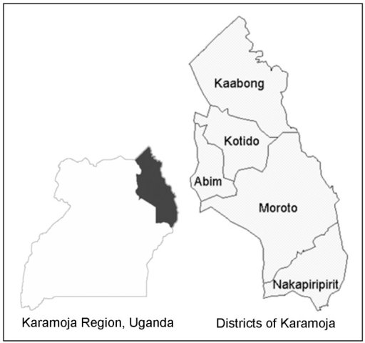

> **Diagram note:** Mermaid mindmap — renders in VS Code (Markdown Preview), Obsidian, or GitHub with the Mermaid extension. Plain-text overview below.

```mermaid
graph TD
    A["⚗️ BIOCHEMISTRY — NEET PG<br/>7 Major Topics"]

    A --> B["Carbohydrate Metabolism"]
    A --> C["Lipid Metabolism"]
    A --> D["Protein & AA Metabolism"]
    A --> E["Molecular Biology"]
    A --> F["Vitamins"]
    A --> G["Clinical Biochemistry"]

    B --> B1["Glycolysis<br/>PFK-1 rate-limiting"]
    B --> B2["TCA Cycle<br/>Isocitrate DH rate-limiting"]
    B --> B3["HMP Shunt<br/>G6PD deficiency"]
    B --> B4["Glycogen Storage<br/>von Gierke / Pompe / McArdle"]

    C --> C1["Beta-Oxidation<br/>Mitochondria"]
    C --> C2["FA Synthesis<br/>Cytoplasm / ACC rate-limiting"]
    C --> C3["Ketogenesis<br/>HMG-CoA → Acetoacetate"]
    C --> C4["Lipoproteins<br/>Chylomicron→VLDL→IDL→LDL→HDL"]

    D --> D1["Urea Cycle<br/>CPS-1 rate-limiting"]
    D --> D2["PKU / Alkaptonuria<br/>Homocystinuria / MSUD"]
    D --> D3["Transamination<br/>ALT & AST (PLP cofactor)"]

    E --> E1["DNA Replication<br/>DNA Pol III (prokaryotes)"]
    E --> E2["Transcription<br/>RNA Pol II → mRNA"]
    E --> E3["Molecular Techniques<br/>PCR / Southern / Northern / FISH"]

    F --> F1["Fat-Soluble A D E K<br/>Stored in liver / fat"]
    F --> F2["Water-Soluble B-complex<br/>B1 Thiamine → Wernicke's"]
    F --> F3["Vitamin C<br/>Scurvy / Collagen synthesis"]

    G --> G1["LFTs<br/>ALT>AST viral; AST>ALT alcohol"]
    G --> G2["Cardiac Markers<br/>Troponin / CK-MB / LDH"]
    G --> G3["Tumor Markers<br/>AFP / CEA / CA-125 / PSA"]
```



**Subject Overview (plain text):**
- Carbohydrate Metabolism: Glycolysis (PFK-1 rate-limiting), TCA Cycle (Isocitrate DH), HMP Shunt (G6PD deficiency), Glycogen Storage diseases
- Lipid Metabolism: Beta-Oxidation, Fatty Acid Synthesis (ACC rate-limiting), Ketogenesis, Lipoproteins
- Protein & AA Metabolism: Urea Cycle (CPS-1 rate-limiting), PKU/Alkaptonuria/Homocystinuria/MSUD, Transamination
- Molecular Biology: DNA Replication, Transcription, PCR/Southern/Northern/FISH techniques
- Vitamins: Fat-Soluble (A D E K), Water-Soluble B-complex (B1 Thiamine → Wernicke's), Vitamin C/Scurvy
- Clinical Biochemistry: LFTs, Cardiac Markers (Troponin/CK-MB/LDH), Tumor Markers

# Biochemistry — NEET PG Lecture Notes

*Written in the style of a classroom lecture: first principles, clinical reasoning, and metabolic logic. Read this like you are in the front row.*

---

## 1. Carbohydrate Metabolism

### Why Glucose? The Logic of Fuel Selection

Before memorizing a single enzyme, ask the most basic question: why does the cell use glucose as its primary fuel? The answer is not arbitrary. Glucose has three properties that make it uniquely suited as a universal, moment-to-moment energy currency.

First, glucose is water-soluble. It dissolves freely in plasma and cytoplasm, which means it can be transported through the bloodstream without a carrier protein and can diffuse into reactions in aqueous compartments without any special packaging. Fat, by contrast, is hydrophobic — it needs lipoprotein vehicles just to survive in the blood. Second, glucose can be metabolized in the absence of oxygen. This is the anaerobic fallback that evolution built in — when a muscle is contracting explosively or a tissue is temporarily under-perfused, it can still extract energy from glucose through glycolysis and lactic acid fermentation. Fat oxidation is entirely oxygen-dependent. Third, glucose can be stored rapidly as glycogen in the liver and muscle — a polymer that can be broken down in seconds when blood glucose drops. These three properties make glucose the emergency fuel, the sprint fuel, and the brain's preferred fuel all at once.

**Clinical connection:** The brain consumes about 120 g of glucose per day and has almost no glycogen reserve. It is therefore the organ most immediately threatened by hypoglycemia. This is why glycogen storage diseases and defects in gluconeogenesis present with neurological symptoms — the brain starves first.

### Glycolysis: The Investment-Payoff Logic

Think of glycolysis as a 10-step business deal in two phases. In the first phase — the investment phase — the cell spends ATP to activate glucose. Hexokinase phosphorylates glucose to glucose-6-phosphate (using 1 ATP), and then phosphofructokinase-1 (PFK-1) phosphorylates fructose-6-phosphate to fructose-1,6-bisphosphate (using another 1 ATP). This seems paradoxical: why spend energy to make energy? Because phosphorylation traps glucose inside the cell (charged molecules can't cross membranes) and destabilizes the 6-carbon molecule so it cleaves easily. You are priming the spring.

The second phase is the payoff phase. Fructose-1,6-bisphosphate is cleaved into two 3-carbon molecules (DHAP and G3P), and from each of those, the cell harvests 2 ATP and 1 NADH through a series of reactions that end in pyruvate. So the net yield is 2 ATP and 2 NADH per glucose. This seems meager compared to the 30-32 ATP from complete oxidation, but the crucial point is speed — glycolysis operates in the cytoplasm without any oxygen and generates ATP almost instantaneously, making it the cell's first responder.

Now here is where it gets intellectually satisfying: PFK-1 is the rate-limiting enzyme, and it is regulated by ATP concentration itself. When ATP is high, PFK-1 is allosterically inhibited — the cell is already energized, so there is no reason to keep burning glucose. When AMP is high (low energy state), PFK-1 is activated. AMP is a much more sensitive signal than ADP because small changes in adenylate balance produce large fractional changes in AMP. This is called the adenylate kinase amplification principle. The cell essentially monitors its own energy charge and adjusts glycolytic rate accordingly — a beautiful feedback loop.

> **Key fact:** PFK-1 is activated by AMP, ADP, fructose-2,6-bisphosphate (F2,6-BP) and inhibited by ATP and citrate. F2,6-BP is the most potent activator and is synthesized by PFK-2, which is itself activated by insulin and inhibited by glucagon.

**Analogy:** Think of PFK-1 as the throttle of a car. F2,6-BP is the accelerator pedal pressed down by insulin (postprandial state). ATP is the cruise control that says "you're already moving fast enough, ease off." Citrate accumulating from the TCA cycle signals that acetyl-CoA supply is abundant, so there is no need to push more pyruvate through.


> **IBQ tip:** PFK-1 at the fructose-6-phosphate step is the key regulatory checkpoint — in a diagram showing allosteric effectors, ATP and citrate inhibit (indicating energy surplus or TCA overflow) while AMP and F2,6-BP activate; a question showing citrate accumulation inhibiting PFK-1 means the TCA cycle is saturated and glycolysis should slow, distinguishing this from hexokinase inhibition by G6P accumulation (a separate upstream regulatory point).

### The TCA Cycle: A Circular Economy

The pyruvate produced by glycolysis is transported into the mitochondria and converted to acetyl-CoA by the pyruvate dehydrogenase complex (PDC). This is an irreversible step — once acetyl-CoA is made, you cannot go back to glucose. This irreversibility is metabolically significant: it explains why fatty acids (which enter as acetyl-CoA) cannot be converted to glucose, and why excessive pyruvate dehydrogenase activity in thiamine deficiency leads to lactic acidosis (pyruvate can't be processed, backs up, becomes lactate).

The TCA cycle is best understood not as a series of named intermediates to memorize, but as an electron extraction machine. Each turn of the cycle takes one acetyl group (2 carbons), combines it with oxaloacetate (4 carbons) to form citrate (6 carbons), and then systematically oxidizes the carbons, releasing 2 CO2 and — critically — reducing 3 NAD+ to NADH and 1 FAD to FADH2. These reduced cofactors are the real product. They carry high-energy electrons to the electron transport chain, where oxidative phosphorylation converts their energy into ATP. One turn of the TCA cycle yields 1 GTP, 3 NADH, and 1 FADH2 — which ultimately translate into about 10 ATP.

The cycle is "circular" because oxaloacetate is regenerated at the end and is ready to accept another acetyl-CoA. But oxaloacetate is also a gluconeogenic precursor, which creates an important tension: if the cell is using OAA for gluconeogenesis, there is less to drive the TCA cycle. In starvation, when gluconeogenesis is running full speed, the TCA cycle can be rate-limited by OAA depletion. Ketogenesis, which we discuss later, is partly a consequence of this bottleneck — acetyl-CoA builds up because OAA isn't available to accept it.


> **IBQ tip:** The two CO2-releasing steps (isocitrate dehydrogenase and α-ketoglutarate dehydrogenase) are the key energy-releasing points and both require thiamine (TPP) — a question showing TCA cycle disruption with lactic acidosis and elevated α-ketoglutarate points to thiamine deficiency; distinguish from a TCA inhibition by fluoroacetate which blocks aconitase (citrate accumulates) rather than a dehydrogenase step.

**Clinical connection:** Isocitrate dehydrogenase (IDH) mutations are found in gliomas and AML. The mutant IDH produces 2-hydroxyglutarate (an oncometabolite) instead of α-ketoglutarate. This is a perfect example of how understanding the enzyme's normal function helps you understand the disease: if IDH normally converts isocitrate to α-KG (a step that generates NADH and drives the cycle forward), then a mutant IDH that produces a dead-end metabolite simultaneously impairs the TCA cycle AND generates a toxic compound. The accumulation of 2-HG inhibits α-KG-dependent dioxygenases, causing epigenetic dysregulation and malignant transformation.

### Glycogen Storage Diseases: First-Principles Reasoning

Rather than memorizing each disease as a list, derive the phenotype from the enzymatic defect. Ask: what does this enzyme do in normal physiology? What happens if it's missing?

**Von Gierke's disease (Type I)** is caused by deficiency of glucose-6-phosphatase (G6Pase). This enzyme is present in the liver and kidney and is responsible for the final step of both glycogenolysis and gluconeogenesis — it removes the phosphate from G6P to release free glucose into the blood. Without G6Pase, the liver cannot export glucose even if it has abundant glycogen. The result is severe fasting hypoglycemia. But because G6P cannot exit, it must go somewhere: it floods into glycolysis (producing lactate — hence lactic acidosis), into the pentose phosphate pathway (producing NADPH which drives fatty acid synthesis — hence hypertriglyceridemia), and into glycogen (which accumulates in the liver — hence hepatomegaly). The gout is explained by hyperuricemia: increased G6P drives the pentose phosphate pathway which generates ribose-5-phosphate, a substrate for purine synthesis, and the excess purines are degraded to uric acid. Every feature of Von Gierke's disease can be derived from the single enzyme defect.

**Pompe's disease (Type II)** is caused by deficiency of lysosomal acid α-glucosidase (acid maltase). This is a completely different kind of glycogen storage disease. The enzyme is not involved in cytoplasmic glycogen metabolism at all — it lives inside lysosomes and degrades small amounts of glycogen that are taken into lysosomes by autophagy as normal cellular housekeeping. Without this enzyme, glycogen accumulates inside lysosomes. The organs most affected are those with high autophagic flux and high energy demand: heart (massive cardiomegaly), skeletal muscle (hypotonia, weakness), and liver. Hypoglycemia does NOT occur because cytoplasmic glycogen metabolism is intact. This disease is curable — alglucosidase alfa (recombinant enzyme replacement therapy) replaces the missing lysosomal enzyme.

**McArdle's disease (Type V)** involves muscle phosphorylase (myophosphorylase) deficiency. Muscle needs to mobilize its own glycogen stores during exercise — it cannot import glucose fast enough to support high-intensity contraction. Without myophosphorylase, glycogenolysis in muscle is blocked. During exercise, lactate should rise as muscle glycolysis generates pyruvate → lactate; in McArdle's patients, lactate paradoxically fails to rise during exercise (the "ischemic forearm exercise test" shows no lactate rise). The clinical picture is cramps and myoglobinuria after exercise. Importantly, the liver phosphorylase is different from muscle phosphorylase, so blood glucose regulation is normal — these patients are not hypoglycemic.

> **Key exam fact:** In glycogen storage diseases, always ask two questions: (1) is the defect in the liver or muscle or both? and (2) is the defect in cytoplasmic or lysosomal glycogen metabolism? These two axes determine the phenotype.

| Disease | Enzyme Deficient | Key Features |
|---|---|---|
| Von Gierke (I) | G6Pase (liver/kidney) | Hypoglycemia, lactic acidosis, hepatomegaly, hyperuricemia |
| Pompe (II) | Lysosomal acid maltase | Cardiomegaly, hypotonia, NO hypoglycemia |
| Cori (III) | Debranching enzyme | Mild Von Gierke phenotype; muscle may also be affected |
| McArdle (V) | Muscle phosphorylase | Exercise cramps, myoglobinuria, no lactate rise, no hypoglycemia |
| Hers (VI) | Liver phosphorylase | Mild hypoglycemia, hepatomegaly |

---

## 2. Lipid Metabolism

### Why Fat? The Evolutionary Logic

Fat stores 9 kcal/g — more than twice the energy density of carbohydrate or protein (4 kcal/g each). But the reason isn't just caloric density: fat is stored essentially anhydrous. Glycogen, by contrast, is hydrophilic and binds about 3 g of water per gram — so the effective energy storage density of glycogen is closer to 1 kcal/g when you account for associated water. If you needed to store 100,000 kcal (roughly the energy reserves of a 70 kg person), you would need about 110 kg of glycogen with its water versus only 11 kg of fat. Evolution chose fat for long-term energy storage because it is stunningly efficient.

The downside of fat is that it is obligately aerobic. Beta-oxidation requires oxygen, and fatty acids cannot cross the blood-brain barrier to fuel the brain directly. This is why the body maintains some carbohydrate stores and why the liver synthesizes ketone bodies during starvation — to give the brain a fat-derived fuel it can actually use.

### Fatty Acid Synthesis vs. Beta-Oxidation: Compartmental Logic

The synthesis and degradation of fatty acids use completely separate enzyme systems in completely separate compartments, and this separation is not accidental — it is essential for independent regulation.

Beta-oxidation (degradation) occurs in the mitochondrial matrix. Fatty acids are activated to acyl-CoA in the cytoplasm and then transported across the inner mitochondrial membrane via the carnitine shuttle (carnitine acyltransferase I and II). Each round of beta-oxidation removes a 2-carbon acetyl-CoA unit and yields 1 NADH and 1 FADH2. A 16-carbon palmitoyl-CoA undergoes 7 rounds of beta-oxidation to yield 8 acetyl-CoA molecules, with a total ATP yield of about 106 ATP — a massive return on investment.

Fatty acid synthesis occurs in the cytoplasm and runs in the opposite direction: it elongates a growing acyl chain by adding 2-carbon malonyl-CoA units, using NADPH as the reducing agent. The key commitment step is acetyl-CoA carboxylase (ACC), which converts acetyl-CoA to malonyl-CoA using CO2 and biotin. This is the rate-limiting step, regulated by insulin (activates) and glucagon/epinephrine (inhibit via phosphorylation of ACC). Citrate (the exported form of mitochondrial acetyl-CoA) activates ACC — signaling that the TCA cycle is running in surplus and the excess should be converted to fat.

The entire fatty acid synthase (FAS) complex is a single multifunctional enzyme that can be thought of as an assembly line: the growing chain moves from one active site to the next within the same protein complex. Each step adds 2 carbons (from malonyl-CoA), reduces the ketone to a methylene, and the chain grows until it is 16 carbons long (palmitate). Elongation beyond 16 carbons occurs in the smooth ER.

**Analogy:** Think of beta-oxidation as a disassembly line in the mitochondrial factory — the fatty acid comes in and is taken apart two carbons at a time, with each piece releasing energy. Fatty acid synthesis is the assembly line in the cytoplasmic factory — raw 2-carbon units are welded together, powered by NADPH (which itself comes primarily from the pentose phosphate pathway and the malic enzyme). The two factories run in different buildings (compartments) so you can run them independently.

![Beta-oxidation versus fatty acid synthesis compartment diagram showing a cell with nucleus and mitochondria: left side (cytoplasm) shows fatty acid synthesis pathway with acetyl-CoA carboxylase (ACC) producing malonyl-CoA, FAS complex assembling palmitate, NADPH as reductant, and insulin/glucagon regulatory arrows; right side (mitochondrial matrix) shows beta-oxidation spiral with acyl-CoA dehydrogenase, NADH and FADH2 outputs per cycle, acetyl-CoA entering TCA; carnitine shuttle (CPT-I and CPT-II) at the inner mitochondrial membrane connecting cytoplasm to matrix](../../images/fatty-acid-synthesis-vs-beta-oxidation-compartments.jpg)
> **IBQ tip:** The carnitine shuttle (CPT-I on the outer face, CPT-II on the inner face of the inner mitochondrial membrane) is the rate-limiting transport step for beta-oxidation — malonyl-CoA (made by ACC when insulin is high) inhibits CPT-I, simultaneously promoting synthesis and blocking degradation; a diagram question showing malonyl-CoA inhibiting a transporter at the mitochondrial membrane specifically identifies CPT-I, not CPT-II.

**Clinical connection:** Carnitine deficiency impairs fatty acid transport into mitochondria. The result is fatty acid oxidation deficiency — particularly severe during fasting when fat is the primary fuel. Patients present with hypoglycemia (can't oxidize fat, must use more glucose), hypoketotic hypoglycemia (can't make ketones either), and lipid myopathy (fat accumulates in muscle). This is a classic cause of sudden death in infants with MCAD (medium-chain acyl-CoA dehydrogenase) deficiency, the most common fatty acid oxidation disorder.

### Ketogenesis: The Brain's Emergency Fuel System

During prolonged starvation or uncontrolled diabetes, insulin falls and glucagon rises. Glucagon signals the liver to mobilize fat, and free fatty acids flood into hepatic mitochondria for beta-oxidation. But here is the bottleneck: OAA is being drained away for gluconeogenesis (the body is trying to maintain blood glucose). Without adequate OAA, acetyl-CoA cannot enter the TCA cycle efficiently, so it accumulates.

What does the liver do with excess acetyl-CoA? It condenses two molecules into acetoacetyl-CoA, then adds another acetyl-CoA via HMG-CoA synthase to make HMG-CoA, and then HMG-CoA lyase cleaves it into acetoacetate and acetyl-CoA. Acetoacetate is the primary ketone body, and it can be spontaneously or enzymatically reduced to beta-hydroxybutyrate, or non-enzymatically decarboxylated to acetone (the fruity breath of diabetic ketoacidosis).

Ketone bodies are exported from the liver and used by peripheral tissues — crucially, the brain. After 3-4 days of starvation, the brain adapts to derive up to 70% of its energy from ketones, dramatically reducing its glucose requirement and sparing muscle protein from being broken down for gluconeogenesis. This is an elegant evolutionary solution: the liver converts insoluble fat stores into water-soluble ketones that the brain can directly oxidize.

> **Key fact:** The liver makes ketones but cannot use them — it lacks succinyl-CoA:acetoacetate CoA-transferase (thiophorase/SCOT), the enzyme needed to reactivate acetoacetate. This ensures that liver-derived ketones are exported exclusively for peripheral use.

**Clinical connection:** In diabetic ketoacidosis (DKA), the absence of insulin causes unrestrained lipolysis and ketogenesis. The pH drops because ketone bodies (acetoacetate and beta-hydroxybutyrate) are acids. The anion gap is elevated because the unmeasured anions (ketoacid anions) accumulate. Treatment with insulin drives glucose and potassium into cells (hence the need to monitor K+) and shuts down ketogenesis by suppressing lipolysis and activating malonyl-CoA synthesis — and recall that malonyl-CoA inhibits carnitine acyltransferase I, blocking fatty acid entry into mitochondria.

### Cholesterol Synthesis and Statins

Cholesterol synthesis occurs in the smooth ER and is one of the cell's most metabolically expensive processes. The entire pathway from acetyl-CoA to cholesterol requires 18 steps and enormous amounts of NADPH and ATP. The rate-limiting step is HMG-CoA reductase, which converts HMG-CoA to mevalonate.

Why is this the rate-limiting step? Because it is positioned early in the pathway, at a branch point before the synthesis is committed irrevocably to cholesterol. All the downstream steps lead to cholesterol (and related isoprenoids, including coenzyme Q, dolichol, and farnesyl groups for protein prenylation). By regulating HMG-CoA reductase, the cell can throttle the entire pathway with a single molecular switch.

Statins are competitive inhibitors of HMG-CoA reductase. By blocking cholesterol synthesis in hepatocytes, statins cause the liver to upregulate LDL receptors to pull more cholesterol from the bloodstream, thereby reducing circulating LDL. This is the mechanism by which statins lower cardiovascular risk — they don't just reduce cholesterol synthesis; they increase LDL clearance. A rare but important adverse effect is myopathy/rhabdomyolysis, particularly when statins are combined with drugs that inhibit their metabolism (CYP3A4 inhibitors like macrolides, azole antifungals).

### Lipoprotein Metabolism: The Transport System

Think of lipoproteins as specialized cargo ships for fat in the aqueous bloodstream. Each ship has a different origin, cargo, and destination, and the system as a whole ensures that dietary fat, liver-synthesized fat, and tissue-scavenged cholesterol are efficiently distributed.

**Chylomicrons** are assembled in intestinal enterocytes to carry dietary fat (triglycerides predominantly) and fat-soluble vitamins through the lymphatics into the bloodstream. They are the largest lipoproteins and the least dense. As they circulate, lipoprotein lipase (LPL) on capillary endothelium (activated by ApoC-II on the chylomicron surface) hydrolyzes their triglycerides, releasing fatty acids for uptake by muscle and adipose tissue. The remnants — now triglyceride-poor but cholesterol-rich — are taken up by the liver via ApoE receptors.

**VLDL** (very low density lipoprotein) is assembled by the liver and carries endogenously synthesized triglycerides to peripheral tissues. It undergoes the same LPL-mediated triglyceride stripping as chylomicrons, becoming progressively smaller and denser. VLDL → IDL → LDL. LDL is the cholesterol-rich remnant — it is the primary carrier of cholesterol to peripheral tissues and is taken up by cells via the LDL receptor (a process requiring ApoB-100). The LDL receptor story is fundamental to cardiovascular medicine: familial hypercholesterolemia is caused by LDL receptor mutations, causing LDL to accumulate in plasma and deposit in arteries.

**HDL** operates in reverse: it is synthesized as a small, lipid-poor disc by the liver and intestine, circulates through tissues, and acquires cholesterol from cell membranes and other lipoproteins via LCAT (lecithin-cholesterol acyltransferase, activated by ApoA-I). This "reverse cholesterol transport" returns cholesterol to the liver. HDL is therefore anti-atherogenic — it removes cholesterol from arterial walls. ApoA-I deficiency (Tangier disease) is characterized by absent HDL, cholesterol accumulation in tissues, and premature atherosclerosis.

> **Key exam fact:** ApoB-48 is on chylomicrons; ApoB-100 is on VLDL, IDL, LDL. ApoC-II activates LPL. ApoE is the remnant receptor ligand. ApoA-I activates LCAT. Abetalipoproteinemia (absent ApoB) causes fat malabsorption, acanthocytosis, ataxia, retinitis pigmentosa.


> **IBQ tip:** Size and density are inversely related — chylomicrons are the largest and least dense (float to the top of plasma in the "chylomicron test tube" test, forming a creamy layer), while HDL is the smallest and most dense; a question showing a creamy supernatant after overnight refrigeration indicates chylomicronemia (hypertriglyceridemia type I or V), not an LDL or HDL abnormality.

---

## 3. Protein and Amino Acid Metabolism

### Essential vs. Non-Essential Amino Acids

There are 20 standard amino acids. Humans can synthesize 11 of them but must obtain 9 from the diet — these are the "essential" amino acids (histidine, isoleucine, leucine, lysine, methionine, phenylalanine, threonine, tryptophan, valine). The reason humans cannot synthesize these is straightforward: over the course of evolution, the enzymes required for their biosynthetic pathways were lost. Because these amino acids were abundant in the omnivorous human diet, there was no evolutionary pressure to maintain the costly biosynthetic machinery. This is an example of reductive evolution — losing expensive capabilities that are no longer needed.

The consequences of essential amino acid deficiency are dramatic. Kwashiorkor (protein deficiency with adequate caloric intake) and marasmus (total caloric deficiency including protein) represent the spectrum of protein-energy malnutrition. The hypoalbuminemia of kwashiorkor causes edema — plasma oncotic pressure falls, fluid leaks into interstitial spaces. The characteristic "potbelly" of kwashiorkor in malnourished children is ascites and hepatomegaly (fatty liver from impaired apoprotein synthesis — without protein, the liver cannot export fat as VLDL).

### The Urea Cycle: Nitrogen Disposal

Amino acids are constantly being turned over — broken down and resynthesized. When an amino acid is catabolized, its amino group must be disposed of safely. Free ammonia (NH3) is highly toxic: it crosses the blood-brain barrier and interferes with the TCA cycle by driving α-KG → glutamate in reverse (via glutamate dehydrogenase), depleting α-KG and thereby slowing the TCA cycle. In neurons, this causes ATP depletion and swelling (cerebral edema). The liver evolved the urea cycle specifically to convert toxic NH3 into non-toxic, water-soluble urea that the kidney excretes.

The urea cycle begins in the mitochondrial matrix: ammonia + CO2 → carbamoyl phosphate (catalyzed by CPS1, requiring N-acetylglutamate as an allosteric activator). Carbamoyl phosphate condenses with ornithine to form citrulline (OTC, the most commonly deficient enzyme). Citrulline exits the mitochondria, condenses with aspartate to form argininosuccinate (ASS1), which is cleaved to arginine + fumarate (ASL). Arginine is hydrolyzed to urea + ornithine by arginase, and ornithine re-enters the mitochondria. Net result: 2 nitrogens (one from NH3, one from aspartate) are incorporated into one urea molecule.

![Urea cycle diagram showing the two-compartment pathway: mitochondrial matrix contains CPS1 (NH3 + CO2 → carbamoyl phosphate) and OTC (carbamoyl phosphate + ornithine → citrulline); cytoplasm contains ASS1 (citrulline + aspartate → argininosuccinate), ASL (argininosuccinate → arginine + fumarate), and arginase (arginine → urea + ornithine); ornithine transporter across the inner mitochondrial membrane; orotic acid accumulation pathway from excess carbamoyl phosphate in OTC deficiency shown with dotted arrow](../../images/urea-cycle-diagram.jpg)
> **IBQ tip:** OTC deficiency causes orotic aciduria because carbamoyl phosphate accumulates in the mitochondria and leaks into the cytoplasm to enter pyrimidine synthesis, producing orotic acid — this distinguishes OTC deficiency from CPS1 deficiency (no orotic aciduria, as the block is before carbamoyl phosphate is made); both cause hyperammonemia, but the presence or absence of orotic acid in the urine is the key distinguishing finding.

> **ASCII diagram:**
> ```
> MITOCHONDRIA                        CYTOPLASM
> ─────────────────────────────────────────────────────
> NH3 + CO2
>     ↓ CPS-I (needs N-acetylglutamate)
> Carbamoyl phosphate ──[OTC defect: leaks out]──→ Orotic acid ↑
>     ↓ OTC  ←── Ornithine (returns from cytoplasm)
> Citrulline ──────────────────────────────────→ Citrulline
>                                                     + Aspartate
>                                                     ↓ ASS1
>                                               Argininosuccinate
>                                                     ↓ ASL
>                                               Arginine + Fumarate
>                                                     ↓ Arginase
>                                               Ornithine + UREA
>                                                     ↓
>                                               Ornithine returns ←──┘
>
> OTC defect → ↑ orotic acid (carbamoyl-P leaks to pyrimidine path)
> CPS1 defect → NO orotic acid (block before carbamoyl-P)
> ```

**Urea cycle defects — derive the phenotype from the block.** All urea cycle defects cause hyperammonemia — the fundamental consequence of impaired nitrogen disposal. But they differ in what accumulates before the block. CPS1 and OTC deficiency produce hyperammonemia WITHOUT orotic aciduria, because the block is before carbamoyl phosphate can enter the cytoplasm. When carbamoyl phosphate does enter the cytoplasm (in OTC deficiency, it accumulates and leaks out), it enters the pyrimidine synthesis pathway and is converted to orotic acid. Wait — actually OTC deficiency DOES cause orotic aciduria, because carbamoyl phosphate accumulates in the mitochondria and leaks into the cytoplasm where it enters pyrimidine synthesis. CPS1 deficiency does not cause orotic aciduria (block is before carbamoyl phosphate is made). Argininosuccinic aciduria (ASL deficiency) causes argininosuccinate accumulation and is the most common urea cycle defect to cause hepatomegaly. Arginase deficiency is unique: it causes elevated arginine rather than ammonia, and the clinical picture is spastic diplegia rather than acute encephalopathy.

> **Key exam fact:** OTC deficiency is X-linked (the OTC gene is on the X chromosome). All other urea cycle defects are autosomal recessive. OTC deficiency is the most common urea cycle defect.

### Phenylketonuria: A Masterclass in Metabolic Disease Logic

Phenylalanine is an essential amino acid that normally gets converted to tyrosine by phenylalanine hydroxylase (PAH), which requires tetrahydrobiopterin (BH4) as a cofactor. In PKU, PAH is absent or severely reduced. The consequences cascade logically from this single enzymatic defect.

Phenylalanine accumulates dramatically in plasma and brain. At high concentrations, phenylalanine is a competitive inhibitor of other large neutral amino acid transporters at the blood-brain barrier, reducing brain uptake of tryptophan, tyrosine, and other aromatic amino acids. Since tryptophan is the precursor to serotonin, and tyrosine is the precursor to dopamine and norepinephrine, the developing brain is deprived of multiple neurotransmitters simultaneously. Excess phenylalanine is transaminated to phenylpyruvate, phenyllactate, and phenylacetate — the "phenylketones" that give the disease its name, detected as a musty/mousy odor in urine. Melanin synthesis is also impaired (tyrosine → melanin), explaining the characteristic fair skin and blue eyes of untreated PKU patients.

The treatment is elegantly logical: restrict phenylalanine in the diet (keep it just above zero, since it is essential) and supplement tyrosine (which is now conditionally essential because the body cannot make it from phenylalanine). For BH4-responsive PKU (a milder variant with residual PAH activity), pharmacologic doses of sapropterin (synthetic BH4) can stabilize the enzyme and increase its activity.


> **IBQ tip:** In PKU, the block at PAH makes tyrosine conditionally essential (cannot be synthesized from phenylalanine) — distinguishing it from albinism where tyrosine is present but tyrosinase (tyrosine → melanin) is blocked (normal phenylalanine, isolated pigmentation loss, normal neurotransmitters); a patient with intellectual disability, fair skin AND musty urine odor points to PKU, not albinism.

> **ASCII diagram:**
> ```
> Phenylalanine ──[PAH + BH4]──→ Tyrosine
>      │  (PAH deficient in PKU)       ↓
>      │  ✗ blocked                Melanin (↓ → fair skin)
>      ↓                           Dopamine / Norepinephrine (↓)
> Phenylpyruvate
> Phenylacetate   → musty/mousy urine odor
> Phenyllactate   → intellectual disability
>                   fair skin, blue eyes
>
> BH4 (cofactor) deficiency → also ↓ serotonin (Trp hydroxylase needs BH4)
> Treatment: ↓ Phe diet + supplement Tyrosine + sapropterin (BH4-responsive PKU)
> ```

**Clinical connection:** Maternal PKU is a critical exam topic. If a woman with PKU is not on a phenylalanine-restricted diet during pregnancy, her elevated phenylalanine crosses the placenta and is teratogenic to the fetus — causing microcephaly, cardiac defects, and intellectual disability in the infant even if the infant does not have PKU. This is a metabolic teratogen, not a genetic disease of the fetus.

---

## 4. Molecular Biology

### DNA Replication: The Copying Machine with Proofreading

DNA replication is fundamentally a problem of accurately copying 3 billion base pairs with an error rate of less than one mistake per 10^9 bases. To achieve this fidelity, evolution built not just a copying machine but one with real-time proofreading.

The key chemistry: DNA polymerase can only add nucleotides to a free 3'-OH group, adding them in the 5'→3' direction. This is a fundamental chemical constraint — the 3'-OH performs a nucleophilic attack on the α-phosphate of the incoming dNTP, releasing pyrophosphate. The reaction is energetically driven by the hydrolysis of pyrophosphate. There is no biochemical mechanism to add nucleotides to a 5' end. This single chemical fact forces the entire architecture of replication: you need a primer (RNA, synthesized by primase, providing a 3'-OH) to start synthesis, the leading strand can be synthesized continuously toward the replication fork, but the lagging strand must be synthesized away from the fork in short fragments (Okazaki fragments, ~100-200 nt in eukaryotes, ~1000-2000 nt in prokaryotes), each requiring its own primer.

The proofreading function resides in the 3'→5' exonuclease activity of DNA polymerase — if a mismatched nucleotide is incorporated, the enzyme pauses, removes the incorrect nucleotide (going backwards, 3'→5'), and then resynthesizes correctly. This reduces the error rate from ~1/10^5 to ~1/10^7. Mismatch repair after replication brings the final rate to ~1/10^9.


> **IBQ tip:** The lagging strand Okazaki fragments are synthesized in the 5'→3' direction but overall move away from the replication fork — a diagram showing the lagging strand with multiple short fragments each preceded by an RNA primer (shown in a different color) indicates normal lagging strand synthesis; if asked which enzyme removes RNA primers, it is DNA polymerase I (in prokaryotes) using its 5'→3' exonuclease activity, not RNase H alone.

**Clinical connection:** Defects in mismatch repair genes (MLH1, MSH2, MSH6, PMS2) cause Lynch syndrome (hereditary non-polyposis colorectal cancer, HNPCC) — the most common hereditary colorectal cancer syndrome. Without mismatch repair, errors accumulate rapidly, particularly at microsatellite repeats (causing "microsatellite instability," a diagnostic marker). The logic: lose proofreading → accumulate mutations → cancer accelerates.

### The Central Dogma: Information Flow

The central dogma describes the flow of genetic information: DNA → RNA → Protein. Understanding WHY this flow is one-directional explains much of cell biology.

DNA is the master archive — double-stranded, chemically stable, stored in the nucleus, never directly used in catalysis. Its stability comes from the double helix (hydrogen bonds, base stacking), from the deoxyribose backbone (the missing 2'-OH makes DNA more resistant to hydrolysis than RNA), and from elaborate repair systems. Cells protect the master copy by never using it directly.

mRNA is the working copy — transcribed from DNA by RNA polymerase II (and the large transcriptional machinery), exported to the cytoplasm, translated at ribosomes, and then rapidly degraded. The transience of mRNA is a feature, not a bug: it allows gene expression to be rapidly turned up or down. The average mammalian mRNA has a half-life of minutes to hours; this is the time-resolution of transcriptional control.

Translation occurs at ribosomes — the RNA-based molecular machines that decode the mRNA codon-by-anticodon into amino acid sequence. Eukaryotic ribosomes are 80S (60S + 40S), while prokaryotic ribosomes are 70S (50S + 30S). This structural difference is the basis of antibiotic selectivity — aminoglycosides and tetracyclines target the 30S subunit, chloramphenicol and macrolides target the 50S subunit, and neither class affects human 80S ribosomes (at therapeutic doses). This is why antibiotics kill bacteria without killing us.

> **Key exam fact:** "CETAM" — Chloramphenicol, Erythromycin, clindamycin (cLINDAmycin), Linezolid all target 50S. Aminoglycosides, Tetracyclines target 30S. Fusidic acid inhibits EF-G (translocation). Rifampin inhibits prokaryotic RNA polymerase. None of these drugs affect 80S ribosomes at therapeutic concentrations.

### PCR: The Photocopier for DNA

The polymerase chain reaction is conceptually simple: it amplifies a specific DNA sequence exponentially by repeated cycles of denaturation, annealing, and extension. What makes it elegant is that it is isothermal in its chemistry but temperature-cycling in its execution.

Denaturing (95°C) separates the double strands. Annealing (50-65°C) allows short oligonucleotide primers (designed by the investigator to flank the target sequence) to bind their complementary sequences. Extension (72°C, the optimal temperature for Taq polymerase) allows the thermostable polymerase to synthesize new DNA from the primer. After 30 cycles, you have 2^30 = about one billion copies of the target sequence. The use of Taq polymerase (from Thermus aquaticus, a thermophile) was the key innovation — it survives the 95°C denaturation step, so you don't have to add fresh polymerase each cycle.

**Clinical connection:** PCR is the backbone of infectious disease diagnostics (COVID-19 RT-PCR, HIV viral load, TB GeneXpert), prenatal genetic diagnosis (detecting single-gene disorders from fetal DNA), and forensic medicine (DNA fingerprinting from nanogram quantities of material). Understanding PCR allows you to interpret diagnostic reports: a false-positive is more likely when there is contamination (PCR amplifies any matching DNA, including contaminants); a false-negative is more likely when the viral load is low or the primer binding site has a mutation.

---

## 5. Vitamins

### The Cofactor Logic

The cell needs thousands of chemical reactions, many of which involve chemistry that polypeptide backbones cannot perform alone — oxidations requiring specific electron carriers, carboxylations requiring CO2 transfer, decarboxylations requiring stabilized carbanion intermediates. Vitamins are the chemical tools that enable this chemistry. The body can synthesize complex polypeptides but cannot always synthesize the reactive organic molecules that the polypeptides need to function — hence the dietary requirement.

### Fat-Soluble Vitamins (A, D, E, K)

The fat-soluble vitamins are stored in adipose tissue and the liver. This means two things: they do not need to be consumed daily (unlike water-soluble vitamins, which are excreted in urine), but they can accumulate to toxic levels with excessive supplementation. Vitamins A and D are particularly prone to toxicity.

**Vitamin A** exists in three interconvertible forms with different functions. Retinol is the storage and transport form. Retinal (retinaldehyde) is used in vision — it is the chromophore in rhodopsin, and its photoisomerization (11-cis-retinal → all-trans-retinal) upon photon absorption is the initiating event of phototransduction. Retinoic acid is the active form for gene regulation — it binds to nuclear receptors (RAR/RXR), which are transcription factors controlling differentiation of epithelial cells, immune cells, and many other tissues. This explains why Vitamin A deficiency causes night blindness (retinal deficiency), xerophthalmia (keratinization of conjunctiva/cornea — from loss of epithelial differentiation), and immune deficiency (impaired T-cell development). The treatment of acute promyelocytic leukemia (APL) with all-trans retinoic acid (ATRA) exploits this gene-regulatory function — ATRA forces the malignant blasts to differentiate, a remarkable therapeutic use of a vitamin.

**Vitamin D** is a hormone rather than a classic vitamin — most of it is synthesized in the skin from 7-dehydrocholesterol upon UV-B exposure. The process requires two activation steps: first hydroxylation to 25-OH-cholecalciferol in the liver (by CYP27A1), and then hydroxylation to 1,25-(OH)₂-cholecalciferol (calcitriol, the active form) in the kidney (by CYP27B1). Calcitriol binds the VDR nuclear receptor and promotes intestinal calcium absorption, renal calcium reabsorption, and osteoclast activation (paradoxically, calcitriol can both build and resorb bone, depending on context).

Kidney disease impairs the final activation step, causing renal osteodystrophy (a combination of osteomalacia from Vitamin D deficiency and secondary hyperparathyroidism from hypocalcemia). Liver disease impairs the first hydroxylation, but the liver has tremendous reserve capacity, so significant Vitamin D deficiency from liver disease alone requires severe hepatic dysfunction.

Rickets (Vitamin D deficiency in children) causes failure of bone mineralization at the growth plates — the cartilage is not calcified, so the growth plate widens and the metaphysis flares and softens.


> **IBQ tip:** Rickets X-ray shows cupping (concave deformity of the metaphyseal end) and fraying (irregular, indistinct metaphyseal margin) as the hallmarks — distinguished from scurvy X-ray which shows a dense "white line of Frankel" at the metaphysis (calcified cartilage that cannot be remodeled) with a "Trummerfeld zone" of rarefaction just beneath it and subperiosteal hemorrhage along the shaft.

**Vitamin K** is required for the gamma-carboxylation of glutamate residues in coagulation factors II, VII, IX, X, and proteins C, S, Z. The carboxylation reaction (catalyzed by gamma-glutamyl carboxylase) requires Vitamin K as a cofactor and CO2 — it adds a carboxyl group to the gamma-carbon of glutamate, creating gamma-carboxyglutamate (Gla). These Gla residues can chelate calcium ions, anchoring the coagulation factors to phospholipid membranes at sites of vascular injury — calcium is the bridge between the protein and the membrane. Warfarin inhibits Vitamin K epoxide reductase (VKOR), blocking the recycling of Vitamin K to its active form. The PT/INR is prolonged because factors II, VII, IX, X are depleted.

### B Vitamins as Coenzymes

**Thiamine (B1)** is the cofactor for oxidative decarboxylation reactions. Specifically, thiamine pyrophosphate (TPP) is the active form, and it is essential for three enzyme complexes: pyruvate dehydrogenase (pyruvate → acetyl-CoA), alpha-ketoglutarate dehydrogenase (α-KG → succinyl-CoA in the TCA cycle), and branched-chain alpha-keto acid dehydrogenase (catabolism of leucine, isoleucine, valine).

The clinical consequence of thiamine deficiency is strikingly logical: the cells that use the most glucose are the first to fail. Neurons are obligate glucose consumers — they cannot switch to fat oxidation — and when thiamine is absent, pyruvate cannot be converted to acetyl-CoA. Pyruvate backs up, lactate rises (lactic acidosis), and the TCA cycle grinds to a halt. Wernicke's encephalopathy (confusion, ophthalmoplegia, ataxia) occurs when the periventricular gray matter and mamillary bodies, which are exquisitely sensitive to thiamine deficiency, are damaged. Korsakoff syndrome (anterograde amnesia, confabulation) follows if Wernicke's is not treated. Wet beriberi (high-output cardiac failure) occurs because the heart, another high-energy organ, also fails.

> **Key fact:** Always give thiamine BEFORE glucose in any alcoholic or malnourished patient presenting with altered mental status. Giving glucose first increases pyruvate production and worsens thiamine deficiency, potentially precipitating Wernicke's.

**Niacin (B3)** is the precursor to NAD+ and NADP+, the electron carriers of metabolism. Without NAD+, glycolysis and the TCA cycle shut down entirely — niacin deficiency (pellagra) causes the 4 D's: Dermatitis (photosensitive, in sun-exposed areas), Diarrhea, Dementia, Death. Niacin can be synthesized from tryptophan (60 mg tryptophan = 1 mg niacin), which is why carcinoid syndrome (tumor secreting serotonin, consuming tryptophan) can cause pellagra.

Pellagra's dermatitis has a pathognomonic distribution: it affects sun-exposed areas in a symmetric pattern, most classically a scarf-like distribution around the neck called "Casal's necklace."


> **IBQ tip:** Pellagra's Casal's necklace distribution (symmetric collar-like rash around the neck and on dorsum of hands) is sharply demarcated at the sun-exposure line — distinguishing it from contact dermatitis (follows the contact pattern, not sun distribution) and from the butterfly malar rash of SLE (face only, spares nasolabial folds, not the neck collar pattern).

**Pyridoxine (B6)** in its active form (pyridoxal phosphate, PLP) is required for transamination reactions (the primary mechanism by which amino groups are moved between amino acids), decarboxylation of amino acids (for synthesis of neurotransmitters — DOPA decarboxylase, histidine decarboxylase, glutamic acid decarboxylase all need PLP), and heme synthesis (ALA synthase). Isoniazid (INH) used for TB treatment is a structural analog that inactivates PLP — hence INH causes B6 deficiency, manifesting as peripheral neuropathy. Pyridoxine supplementation prevents this.

Angular cheilitis (cracking at the corners of the mouth) is a clinical sign of B2 (riboflavin) deficiency, often co-occurring with glossitis and seborrheic dermatitis.


> **IBQ tip:** Angular cheilitis at the corners of the mouth (commissures) with glossitis (magenta/beefy red tongue) indicates B2 (riboflavin) deficiency — distinguished from the central lip fissuring of B3 (niacin/pellagra) deficiency which affects the lips as part of the broader photosensitive dermatitis, and from the atrophic glossitis of B12 deficiency which presents with a smooth, beefy-red tongue without the commissure fissuring.

### The B12-Folate Relationship: The Methyl Trap

This is one of the most intellectually elegant relationships in metabolism, and understanding it from first principles makes both the biochemistry and the clinical findings immediately logical.

Folate enters cells as folic acid and is reduced first to dihydrofolate (DHF) then to tetrahydrofolate (THF) by dihydrofolate reductase (DHFR). THF is the active carrier of single-carbon units — it can carry these carbon fragments in various oxidation states and donate them for purine synthesis, thymidylate synthesis, and amino acid interconversions. The most important reaction for understanding the B12-folate connection is the conversion of homocysteine to methionine by methionine synthase, which requires methylcobalamin (B12) to accept the methyl group from 5-methyl-THF. After donating its methyl group, 5-methyl-THF is converted back to THF, which can then re-enter the folate cycle.

Here is the trap: 5-methyl-THF is a dead end. Once THF is methylated at N5, it CANNOT be demethylated by any other enzyme — only methionine synthase can remove the methyl group. If B12 is absent, methionine synthase cannot function, and all the cellular folate gets stuck as 5-methyl-THF. This is the "methyl trap" — folate is present in the diet, enters cells, but becomes trapped in an unusable form. The cell is effectively folate-deficient even though folate intake is normal.

The clinical consequence: B12 deficiency causes megaloblastic anemia by a folate-trapping mechanism. This explains why giving folate to a B12-deficient patient can correct the anemia (by supplying fresh folate that bypasses the trap temporarily) but will NOT correct the neurological damage of B12 deficiency — and can mask it. The neurological damage (subacute combined degeneration of the spinal cord — demyelination of dorsal and lateral columns, causing loss of proprioception, vibration sense, and upper motor neuron signs) is caused by B12-dependent methylation reactions in the nervous system, and folate cannot substitute for these.

> **Key exam fact:** Distinguish B12 deficiency from folate deficiency: both cause megaloblastic anemia with elevated MCV, hypersegmented neutrophils, and elevated homocysteine. But B12 deficiency ALSO causes elevated methylmalonic acid (MMA) and neurological damage. Folate deficiency does NOT cause elevated MMA or neurological damage.

---

## 6. Enzymes

### Kinetics from First Principles

An enzyme works by lowering the activation energy of a reaction. It does this not by changing the thermodynamics (the ΔG of the reaction remains the same — the enzyme cannot make an unfavorable reaction favorable), but by providing an alternative reaction pathway with a lower energy barrier. The enzyme binds the substrate in its active site, stabilizes the transition state (the highest-energy configuration along the reaction coordinate), and then releases the product. Because the enzyme is not consumed, it can catalyze the same reaction repeatedly.

The Michaelis-Menten equation — v = Vmax[S] / (Km + [S]) — describes enzyme kinetics mathematically, but the intuition is more important than the equation. At very low substrate concentrations, [S] << Km, and the equation simplifies to v ≈ Vmax[S]/Km — the rate is proportional to substrate concentration (first-order kinetics). At very high substrate concentrations, [S] >> Km, and the equation simplifies to v ≈ Vmax — the rate is maximal and no longer increases with substrate (zero-order kinetics, because all active sites are occupied).

Vmax is the maximum velocity — the rate when every enzyme molecule has its active site occupied by substrate. It depends on enzyme concentration and the catalytic rate constant (kcat). Km is the Michaelis constant — the substrate concentration at which the reaction runs at half-maximal velocity. Km is a measure of affinity: a low Km means the enzyme is half-saturated at a low substrate concentration (high affinity), while a high Km means the enzyme needs a lot of substrate to reach half-saturation (low affinity). This distinction is clinically useful in understanding isoenzymes — hexokinase has a low Km for glucose (high affinity, saturated at normal blood glucose, constant activity) while glucokinase (liver, pancreatic beta cells) has a high Km (acts as a glucose sensor, increasing activity only when blood glucose is elevated).

### Competitive vs. Non-Competitive Inhibition

**Competitive inhibition** occurs when the inhibitor resembles the substrate and binds reversibly to the active site. The substrate and inhibitor compete for the same binding site. With enough substrate, you can out-compete the inhibitor and restore Vmax — hence Vmax is unchanged in competitive inhibition. But you need more substrate to achieve a given velocity (because some active sites are occupied by inhibitor), so Km appears increased.

**Analogy:** Imagine a taxi stand (enzyme) that accepts passengers (substrate). A competitor inhibitor is a fake passenger (same size, wrong ticket) who occasionally blocks a taxi. If you flood the stand with real passengers, the fake passengers get crowded out. Maximum throughput (Vmax) is the same if you wait long enough with enough real passengers.

**Non-competitive inhibition** occurs when the inhibitor binds to a site other than the active site (an allosteric site) and changes the enzyme's conformation, reducing its catalytic efficiency. Because the inhibitor doesn't compete with substrate for the active site, adding more substrate doesn't help — Vmax decreases. Since substrate binding and inhibitor binding are independent events, Km is unchanged (affinity is unaffected).

The Lineweaver-Burk (double-reciprocal) plot is a linear transformation of the Michaelis-Menten equation: 1/v vs 1/[S]. The y-intercept is 1/Vmax and the x-intercept is -1/Km. For competitive inhibition: same y-intercept (Vmax unchanged), different x-intercept (Km increased → x-intercept shifts toward zero). For non-competitive inhibition: different y-intercept (Vmax decreased → y-intercept increases), same x-intercept (Km unchanged). These are the logical consequences of the definitions — no memorization required.

![Lineweaver-Burk double-reciprocal plot showing 1/v on y-axis and 1/[S] on x-axis: three lines intersecting at different points — the normal enzyme line, a competitive inhibition line (same y-intercept as normal = same Vmax, but steeper slope and x-intercept shifted rightward toward zero = increased apparent Km), and a non-competitive inhibition line (same x-intercept as normal = same Km, but higher y-intercept = decreased Vmax); y-intercept = 1/Vmax and x-intercept = −1/Km labeled on each line](../../images/lineweaver-burk-plot-competitive-noncompetitive.jpg)
> **IBQ tip:** On the Lineweaver-Burk plot, competitive and non-competitive inhibition lines cross the normal line at different axes — competitive inhibition lines intersect on the y-axis (same Vmax, y-intercept unchanged) while non-competitive inhibition lines intersect on the x-axis (same Km, x-intercept unchanged); a question showing two lines that cross exactly on the y-axis identifies competitive inhibition, while lines crossing on the x-axis identifies non-competitive (or uncompetitive lines don't cross either axis at the same point as normal).

> **ASCII diagram:**
> ```
> 1/V ↑
>     │         Non-competitive (↓Vmax, same Km)
>     │        ╱  Competitive (same Vmax, ↑Km)
>     │       ╱  ╱
>     │      ╱  ╱  Normal
>     │     ╱  ╱  ╱
>     │    ╱  ╱  ╱
>  ───┼───╱──╱──╱──────────────→ 1/[S]
>     │  ←same x-intercept     (non-comp: same Km)
>     │        ←same y-intercept (compet: same Vmax)
>
> Competitive:     Vmax unchanged, Km ↑ (x-intercept shifts right)
> Non-competitive: Vmax ↓, Km unchanged (x-intercept same, y-intercept ↑)
> ```

> **Key fact:** Suicide (irreversible) inhibitors bind covalently and permanently inactivate the enzyme. Examples: aspirin (irreversible inhibitor of COX), penicillin (irreversible inhibitor of transpeptidase/PBP), organophosphates (irreversible inhibitors of acetylcholinesterase). These cannot be out-competed by substrate and recovery requires synthesis of new enzyme.

---

## 7. Collagen

### Collagen as the Body's Structural Scaffold

Collagen is the most abundant protein in the body by mass — approximately 25-35% of total body protein. To understand why, consider that the body is not just a collection of cells in solution: it needs structural support, tensile strength, tissue organization, and a scaffold for cell attachment. Bones need a flexible matrix to resist fracture, tendons need high tensile strength to transmit muscle force, skin needs a fibrous network to resist tearing, and basement membranes need a fine filter to control what passes from blood into tissues. Collagen provides all of this.

### The Triple Helix: Structural Logic

Collagen is built from three polypeptide chains (alpha chains) wound together in a triple helix. Each chain contains the repeating sequence Gly-X-Y, where X is frequently proline and Y is frequently hydroxyproline. The critical residue is glycine at every third position — and the reason is pure geometry. The triple helix is an extremely tight, compact structure. At the center of the helix, where the three chains come closest together, there is only room for the smallest amino acid — glycine, which has only a hydrogen as its side chain. Any other amino acid at the central position would cause steric clashing and destabilize the helix. This is why Gly→X substitutions in collagen diseases (like osteogenesis imperfecta) are so damaging: they disrupt the triple helix at its core.

The proline residues in the X position contribute to the rigidity of each chain — proline's pyrrolidine ring constrains the backbone. Hydroxyproline (in the Y position) and hydroxylysine are formed by post-translational hydroxylation of proline and lysine residues, and these hydroxyl groups form hydrogen bonds that stabilize the triple helix. Vitamin C (ascorbic acid) is essential for prolyl and lysyl hydroxylase activity — without it, the triple helix is unstable and collagen fibrils fall apart.

![Collagen triple helix structure diagram showing three polypeptide alpha chains (shown in three different colors) wound together in a right-handed superhelix, with Gly-X-Y repeating pattern labeled on one chain; glycine residues pointing toward the central axis of the helix; hydroxyproline residues shown with hydroxyl groups extending outward forming hydrogen bonds between chains; the overall fibril cross-section shown at the right with the characteristic staggered arrangement of tropocollagen molecules](../../images/collagen-triple-helix-structure.jpg)
> **IBQ tip:** The Gly-X-Y repeating sequence with glycine mandatory at every third position (to fit in the cramped center of the triple helix) is the key structural rule — a question identifying a collagen mutation at a glycine position (Gly→Ala or Gly→Cys substitution) predicts the most severe phenotype (e.g., lethal osteogenesis imperfecta type II), while mutations in X or Y positions (often proline or hydroxyproline) tend to produce milder phenotypes.

**Clinical connection:** Scurvy (Vitamin C deficiency) is a disease of defective collagen. Weakened collagen causes perifollicular hemorrhages (the hair follicle dermis breaks down), corkscrew hairs, bleeding gums, poor wound healing, and subperiosteal hemorrhages. The gums bleed because the gingival collagen is particularly highly turned over. Scurvy's classic presentation in infants is painful limbs from subperiosteal hemorrhages — the child refuses to move (pseudoparalysis) because bleeding under the periosteum is exquisitely painful.


> **IBQ tip:** Scurvy's perifollicular hemorrhages (small hemorrhagic halos specifically around hair follicles) are distinct from the generalized petechiae of thrombocytopenia (not follicle-centered) and from the palpable purpura of vasculitis (raised, not follicle-centered); the corkscrew hair and gum hemorrhage together are pathognomonic for scurvy (Vitamin C deficiency) and do not occur in other vitamin deficiencies.

### Collagen Cross-linking and Menkes Disease

After secretion into the extracellular space, collagen fibrils are strengthened enormously by cross-links between lysine and hydroxylysine residues. This cross-linking is catalyzed by lysyl oxidase, a copper-dependent amine oxidase that converts lysine and hydroxylysine to reactive aldehydes (allysine), which then spontaneously condense with each other or with unmodified lysyl residues to form covalent cross-links. These cross-links are what give mature collagen its extraordinary tensile strength — the difference between green bamboo (uncross-linked) and seasoned hardwood (cross-linked).

Menkes disease (kinky hair disease) is an X-linked recessive defect in copper transport (ATP7A gene). Without copper, lysyl oxidase cannot function, cross-linking fails, and connective tissue is grossly weakened. The result is a combination of features: lax skin, joint laxity, tortuous arteries (which can dissect or rupture), subdural hematomas, and the characteristic "kinky" (pili torti) hair — the hair shaft becomes twisted because the keratin cross-linking in hair also requires copper-dependent enzymes. The neurological deterioration is severe because copper is also required for dopamine beta-hydroxylase (making norepinephrine), cytochrome c oxidase (mitochondrial complex IV), and other critical enzymes.

### Collagen Types: Function Determines Structure

Collagen is not one protein but a family of at least 28 types, and the type present in any given tissue reflects that tissue's mechanical and biological requirements.

**Type I collagen** is the structural workhorse — found in bone, tendon, skin, fascia, dentin, and cornea. It is the collagen of tensile strength. Osteogenesis imperfecta (brittle bone disease) is caused by mutations in the Type I collagen genes (COL1A1/COL1A2), with Gly substitutions causing the most severe phenotypes. The bones fracture easily not just because they are fragile but because the mineral (hydroxyapatite) requires a proper collagen scaffold to deposit on — defective scaffold means defective mineralization and structurally compromised bone.

**Type II collagen** is specific to cartilage (and vitreous humor). Cartilage must resist compressive loads while remaining flexible — hyaline cartilage covers joint surfaces and must dissipate forces repeatedly without failing. Type II collagen's fine fibrillar structure within the cartilage matrix, combined with the high proteoglycan content (aggrecan attracting water), creates a resilient, shock-absorbing material. Achondroplasia (the most common cause of dwarfism) is caused by an activating mutation in FGFR3, not in Type II collagen — but mutations in Type II collagen cause other chondrodysplasias.

**Type III collagen** is the early-response and flexible collagen. It is prominent in embryonic tissues, granulation tissue during wound healing, and in hollow organs like blood vessels, intestines, and uterus. It coexists with Type I collagen in skin and vessels. Ehlers-Danlos syndrome Type IV (vascular EDS) is caused by Type III collagen mutations — hence the characteristic vascular fragility (aortic and intestinal rupture) rather than just skin hyperelasticity.

**Type IV collagen** is the collagen of basement membranes. Unlike fibrillar collagens, Type IV forms a two-dimensional network (rather than fibrils) — a true molecular sieve. The glomerular basement membrane (GBM) is rich in Type IV collagen, and it acts as a charge-selective and size-selective filter for the glomerulus. Alport syndrome is caused by mutations in Type IV collagen genes (COL4A3/COL4A4 on autosomes, or COL4A5 on the X chromosome) — the GBM is structurally abnormal, causing progressive glomerulonephritis. Goodpasture syndrome is caused by autoantibodies against the alpha-3 chain of Type IV collagen in the GBM and pulmonary alveolar basement membrane — explaining the dual picture of glomerulonephritis and pulmonary hemorrhage.

> **Key exam fact:** Type I — bone, tendon, skin (most abundant). Type II — cartilage, vitreous. Type III — vessels, fetal tissue, granulation tissue. Type IV — basement membranes (Alport, Goodpasture). "Type I is number one — most abundant."

| Collagen Type | Location | Disease Associations |
|---|---|---|
| Type I | Bone, tendon, skin, cornea | Osteogenesis imperfecta (COL1A1/A2 mutation) |
| Type II | Cartilage, vitreous humor | Chondrodysplasias |
| Type III | Vessels, uterus, fetal tissue | Vascular EDS (Ehlers-Danlos Type IV) |
| Type IV | Basement membranes (GBM, etc.) | Alport syndrome, Goodpasture syndrome |

### Collagen Synthesis: End-to-End Summary

The collagen synthesis pathway is a journey from ribosome to extracellular matrix, with each step providing a potential point of failure and a clinical disease.

Pre-pro-alpha chains are synthesized on the rough ER, with a signal peptide directing them into the lumen. Proline and lysine residues are hydroxylated (requires Vitamin C and O2) to hydroxyproline and hydroxylysine. Hydroxylysines are glycosylated (unique to collagen). Three alpha chains assemble into a triple helix from the C-terminus toward the N-terminus (the registration peptides at each end help alignment). The procollagen is secreted and the propeptides are cleaved by procollagen peptidases (cleavage of N-propeptide is deficient in Ehlers-Danlos type VIIA/B — causing the "dermatosparaxis" form). Tropocollagen self-assembles into fibrils. Lysyl oxidase cross-links fibrils (requires copper — deficient in Menkes).

![Electron transport chain and oxidative phosphorylation diagram showing the inner mitochondrial membrane with Complexes I through V: Complex I (NADH dehydrogenase, rotenone-sensitive), Complex II (succinate dehydrogenase, FADH2 entry), Complex III (cytochrome bc1, antimycin A-sensitive), Complex IV (cytochrome c oxidase, cyanide/CO-sensitive), and Complex V (ATP synthase, oligomycin-sensitive); electron flow shown with arrows from NADH→Complex I→CoQ→Complex III→cytochrome c→Complex IV→O2; proton pumping shown at Complexes I, III, IV creating the proton gradient; ATP synthase using the gradient to phosphorylate ADP→ATP; inhibitor binding sites labeled](../../images/electron-transport-chain-oxidative-phosphorylation.jpg)
> **IBQ tip:** Each complex has a specific inhibitor and substrate entry point — NADH enters at Complex I (blocked by rotenone), FADH2 enters at Complex II (bypasses Complex I, explaining why FADH2 yields fewer ATP than NADH), cyanide and carbon monoxide block Complex IV (cytochrome c oxidase) causing histotoxic hypoxia; a question asking why FADH2 yields less ATP than NADH is answered by FADH2 entering at Complex II, bypassing the proton-pumping step of Complex I.

This pathway is the canonical post-translational modification story and appears frequently in NEET PG in the context of specific enzyme deficiencies, vitamin dependencies, and metabolic diseases.

---

## Integration: Connecting the Dots

Biochemistry is not a collection of isolated pathways but an integrated metabolic network where everything connects. Consider a single patient with alcoholic liver disease: ethanol metabolism generates excess NADH, which inhibits gluconeogenesis (NADH drives pyruvate → lactate, depleting gluconeogenic substrate) and drives fatty acid synthesis (NADH inhibits beta-oxidation, acetyl-CoA accumulates, goes to fat) — explaining the fatty liver. Impaired protein synthesis reduces albumin production (edema, ascites) and impaired activation of clotting factors II, VII, IX, X (bleeding tendency). Impaired bile acid production and secretion causes fat malabsorption (fat-soluble vitamin deficiencies — A, D, E, K). The entire clinical picture flows from understanding the biochemistry of the liver.

This is the skill that biochemistry is teaching — not isolated facts, but a coherent metabolic logic that allows you to predict clinical consequences from enzymatic defects, to recognize patterns, and to derive answers from first principles rather than retrieve them from rote memory. Every enzyme exists because it performs a specific chemical task. Every genetic disease is what happens when that task is left undone. Every drug target is a bottleneck in a pathway. Master the logic, and the facts follow.

---

*End of Biochemistry Lecture Notes — NEET PG*
