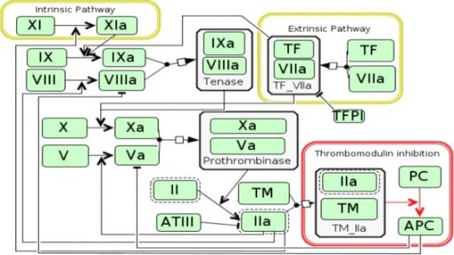
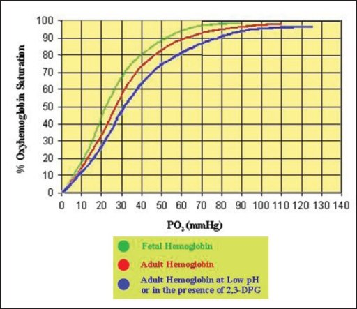

> **Diagram note:** Mermaid mindmap — renders in VS Code (Markdown Preview), Obsidian, or GitHub with the Mermaid extension. Plain-text overview below.

```mermaid
graph TD
    A["🫀 PHYSIOLOGY — NEET PG<br/>7 Major Systems"]

    A --> B["Blood & Coagulation"]
    A --> C["Cardiovascular"]
    A --> D["Respiratory"]
    A --> E["Renal"]
    A --> F["Endocrine"]
    A --> G["Neuromuscular"]

    B --> B1["Coagulation Cascade<br/>Intrinsic XII→ / Extrinsic VII→"]
    B --> B2["Blood Groups<br/>ABO / Rh / Cross-match"]
    B --> B3["O2-Hb Curve<br/>P50=26 mmHg / Right vs Left shift"]
    B --> B4["ESR<br/>Westergren / Zeta method"]

    C --> C1["Cardiac Cycle<br/>Wiggers diagram / JVP waves"]
    C --> C2["Heart Sounds<br/>S1-S4 / Murmurs"]
    C --> C3["Frank-Starling Law<br/>Preload / Afterload / Contractility"]
    C --> C4["RAAS<br/>Renin→AngII→Aldosterone"]

    D --> D1["Lung Volumes<br/>FRC / RV / TLC"]
    D --> D2["Spirometry<br/>Obstructive FEV1/FVC<70%<br/>Restrictive TLC↓"]
    D --> D3["V/Q Mismatch<br/>Shunt / Dead space / HPV"]
    D --> D4["Hypoxia Types<br/>Hypoxic / Anemic / Stagnant / Histotoxic"]

    E --> E1["GFR & Clearance<br/>125 mL/min / Inulin gold std"]
    E --> E2["Tubular Handling<br/>PCT / Loop / DCT / CD"]
    E --> E3["Acid-Base<br/>Met Acidosis/Alkalosis<br/>Resp Acidosis/Alkalosis"]
    E --> E4["Diuretics<br/>Loop / Thiazide / Spironolactone"]

    F --> F1["Hypothalamo-Pituitary<br/>TRH→TSH→T3/T4"]
    F --> F2["Adrenal Zones<br/>Glom(Aldo)/Fasc(Cortisol)/Retic(DHEA)"]
    F --> F3["Insulin & Glucagon<br/>GLUT2 beta cells / Counter-regulatory"]

    G --> G1["Action Potential<br/>Phase 0-4 / Cardiac vs Nerve"]
    G --> G2["Neuromuscular Junction<br/>ACh / Myasthenia / Lambert-Eaton"]
    G --> G3["Reflexes<br/>Stretch / Inverse stretch / Withdrawal"]
```



**Subject Overview (plain text):**
- Blood & Coagulation: Coagulation Cascade (Intrinsic/Extrinsic), Blood Groups (ABO/Rh), O2-Hb Curve (P50=26 mmHg), ESR
- Cardiovascular: Cardiac Cycle (Wiggers diagram), Heart Sounds (S1-S4/Murmurs), Frank-Starling Law, RAAS
- Respiratory: Lung Volumes (FRC/RV/TLC), Spirometry (Obstructive/Restrictive), V/Q Mismatch, Hypoxia types
- Renal: GFR & Clearance (125 mL/min), Tubular Handling (PCT/Loop/DCT/CD), Acid-Base disorders, Diuretics
- Endocrine: Hypothalamo-Pituitary axis, Adrenal Zones (Glomerulosa/Fasciculata/Reticularis), Insulin & Glucagon
- Neuromuscular: Action Potential (Phase 0-4), Neuromuscular Junction (ACh/Myasthenia), Reflexes

# Physiology — Lecture-Style Notes for NEET PG

*Written as a lecture transcript: first principles first, clinical medicine woven throughout, analogies made explicit. Read this like you are sitting in the front row.*

---

## Table of Contents

1. [Blood and Coagulation](#1-blood-and-coagulation)
2. [Cardiovascular Physiology](#2-cardiovascular-physiology)
3. [Respiratory Physiology](#3-respiratory-physiology)
4. [Renal Physiology](#4-renal-physiology)
5. [Endocrine Physiology](#5-endocrine-physiology)
6. [Neurophysiology](#6-neurophysiology)
7. [GI Physiology](#7-gi-physiology)

---

## 1. Blood and Coagulation

### Why Blood Must Both Clot and Stay Liquid

Before we look at a single clotting factor, ask yourself the engineering question: what problem is the coagulation system trying to solve? The body is a closed hydraulic system under pressure. Any breach in a vessel wall is catastrophic — you lose your working fluid and you lose pressure. So evolution built a repair mechanism that seals breaches. But here is the catch: the same repair mechanism, if it fires in the wrong place or at the wrong time, will block a vessel that was working perfectly fine and kill the tissue downstream. So the system has to be exquisitely controlled. It must be fast enough to seal a wound before you bleed out, and it must be restrained enough that it doesn't clot every vessel in your body. This is why anticoagulants (antithrombin III, protein C, protein S, tissue factor pathway inhibitor) exist — not as some afterthought, but as equally important as the pro-coagulant factors. The system is designed to activate locally, amplify massively, and then stop sharply.

### Platelet Plug Formation — The First Responder

Think of hemostasis as a two-step repair job: first you put a temporary patch over the hole (platelet plug = primary hemostasis), then you reinforce it with concrete (coagulation cascade = secondary hemostasis). The platelet plug goes up first, within seconds. Here is how it works. When the endothelium is breached, subendothelial collagen is exposed. Von Willebrand factor (vWF) — which is normally floating in plasma and stored in endothelial cells — acts like a molecular bridge, binding both to exposed collagen and to GPIb receptors on the platelet surface. This tethering slows the platelet down so it can stick. Once adherent, platelets activate: they change shape from smooth discs into spiky spheres, and they degranulate, releasing ADP and thromboxane A2 from their granules. ADP and TXA2 act as alarm signals, recruiting more platelets from the flowing blood. These platelets bind to each other via GPIIb/IIIa receptors using fibrinogen as glue. The result is a loose platelet plug — adequate for small vessel injury, but not sufficient for large tears.

**Analogy:** Think of the platelet plug as emergency scaffolding at a construction site. Workers (platelets) rush in, erect a temporary barrier, and call for concrete (coagulation factors) to arrive. The scaffolding is enough to keep things from collapsing while the real structure is built.

**Clinical connection:** Von Willebrand disease is the most common inherited bleeding disorder. Because vWF is required for platelet adhesion AND for carrying Factor VIII (protecting it from degradation), patients bleed with mucocutaneous-pattern bleeding (gums, heavy periods, easy bruising) — the pattern of primary hemostasis failure. Aspirin irreversibly inhibits COX-1, blocking TXA2 synthesis for the platelet's entire lifespan (7-10 days) — this is why surgical patients are asked to stop aspirin a week before surgery. GPIIb/IIIa inhibitors (abciximab, eptifibatide) are used in acute coronary syndromes to prevent platelet aggregation at the culprit lesion.

### The Coagulation Cascade — An Amplification Machine

The coagulation cascade is, at its heart, a biological amplifier. Each step in the cascade activates the next factor in larger quantities. Think of it like a loudspeaker circuit: a tiny input signal gets amplified at each transistor stage until you have a powerful output. In coagulation, the input is a very small amount of activated factor, and the output is a huge burst of thrombin. Why does it need to be amplified? Because thrombin needs to convert fibrinogen (a soluble plasma protein) into fibrin (an insoluble mesh) fast enough to seal a wound. The amplification also means a tiny breach triggers a proportionally large response — ensuring the clot actually forms.

The cascade has two entry points. The **extrinsic pathway** is triggered by Tissue Factor (TF), a protein expressed by subendothelial cells (and macrophages, and cancer cells — relevant clinically). When TF meets Factor VII from plasma, the TF-VIIa complex activates Factor X directly. The **intrinsic pathway** is triggered by contact with collagen (or other negatively charged surfaces), activating Factor XII → XI → IX → VIII → X. Both pathways converge on Factor X, which with Factor Va forms the **prothrombinase complex** that converts prothrombin (Factor II) to thrombin (Factor IIa). Thrombin then cleaves fibrinogen to fibrin, and activates Factor XIII to cross-link fibrin strands.


> **IBQ tip:** Identify where each pathway feeds into the common pathway at Factor X — a question showing a prolonged aPTT with normal PT points to intrinsic pathway (XII, XI, IX, VIII) defects (haemophilia), while isolated prolonged PT points to Factor VII (extrinsic); both prolonged indicates common pathway or combined deficiency such as warfarin toxicity or liver disease.

> **ASCII diagram:**
> ```
> INTRINSIC                    EXTRINSIC
> XII→XI→IX ─────┐              VII + TF
>                ↓                  ↓
>               X ←────────────────┘  (common pathway)
>               ↓
>               II (prothrombin) → IIa (thrombin)
>               ↓
>               Fibrinogen → Fibrin
>
> aPTT tests intrinsic (XII,XI,IX,VIII)
> PT/INR tests extrinsic (VII) + common
> ```

**Analogy:** Imagine the extrinsic pathway as an emergency fire alarm pulled by a bystander (Tissue Factor, expressed when the vessel wall is torn open — an external signal). The intrinsic pathway is like the building's own sprinkler system activating when it senses heat (Factor XII contacting collagen — an internal signal). Both activate the same fire-suppression system (Factor X onward).

Now here is what makes clinical sense: the **PT (Prothrombin Time)** tests the extrinsic pathway (Factor VII + common pathway). The **aPTT (Activated Partial Thromboplastin Time)** tests the intrinsic pathway (Factors XII, XI, IX, VIII + common pathway). If a patient has a prolonged aPTT with a normal PT, which pathway is defective? The intrinsic pathway — factors XII, XI, IX, or VIII. Haemophilia A is Factor VIII deficiency, Haemophilia B (Christmas disease) is Factor IX deficiency. Both give prolonged aPTT with normal PT. Both cause bleeding into joints (hemarthrosis) and deep muscles — the classic pattern of secondary hemostasis failure (coagulation cascade failure), as opposed to the mucocutaneous pattern of primary hemostasis failure.

> **Key clinical pearl:** Warfarin inhibits Vitamin K epoxide reductase, preventing the carboxylation and activation of factors II, VII, IX, X (and protein C and S). Factor VII has the shortest half-life (~6 hours), so it falls first, making the PT prolong before the aPTT. This is why PT/INR is used to monitor warfarin. In warfarin overdose, all Vitamin K-dependent factors are low — treat with Vitamin K for gradual reversal or 4-factor PCC (prothrombin complex concentrate) for immediate reversal.

Factor XIII is often forgotten but is crucial — it cross-links fibrin monomers into a stable polymer mesh via covalent isopeptide bonds. Without it, the clot is weak and dissolves easily. Factor XIII deficiency presents as delayed rebleeding from wounds, umbilical stump bleeding in neonates, and intracranial hemorrhage. Standard coagulation tests (PT, aPTT) are normal because those test thrombin generation, not clot stability.

### The Oxygen-Hemoglobin Dissociation Curve

Let us talk about hemoglobin, because it is one of the most beautifully engineered molecules in biology. The question to start with: why does hemoglobin have a sigmoid (S-shaped) dissociation curve instead of a simple hyperbola? The answer is cooperativity, and understanding cooperativity means understanding why the sigmoid shape is not an accident — it is the whole point.

Hemoglobin has four subunits, each carrying one heme group. When the first oxygen molecule binds to one subunit, it causes a conformational change in the entire tetramer that makes the remaining three subunits bind oxygen more easily. Conversely, when one subunit releases oxygen, it makes the others release more readily too. This property — binding or releasing one ligand facilitates the same for others — is cooperativity. Compare this to myoglobin, which has a single subunit and therefore a simple hyperbolic curve. Myoglobin has high O2 affinity at all PO2 levels, which is why it is a storage molecule in muscle — it grabs oxygen and doesn't let go until the muscle is working very hard.

The sigmoid shape of the Hb-O2 curve has a beautiful physiological consequence. In the lungs, PO2 is ~100 mmHg — you are on the flat upper portion of the curve. This means that even if PO2 drops moderately (say to 70 mmHg with mild lung disease), saturation barely falls. The curve is flat there, buffering against fluctuations. In the tissues, PO2 is ~40 mmHg — you are on the steep portion of the curve. A small drop in PO2 causes a large release of oxygen. This is the genius: the flat part loads oxygen reliably in the lungs, and the steep part unloads it efficiently in the tissues.

**The Bohr Effect** is the mechanism by which hemoglobin's oxygen affinity is modulated by CO2 and pH. In the tissues, cells are metabolically active: they consume O2 and produce CO2. CO2 diffuses into red blood cells, where carbonic anhydrase converts it to H2CO3, which dissociates into H+ and HCO3-. The rising H+ concentration (falling pH) reduces hemoglobin's affinity for O2, shifting the curve to the right — causing more O2 to be released at any given PO2. In the lungs, the reverse happens: CO2 is blown off, pH rises, hemoglobin's affinity for O2 increases, shifting the curve left — helping O2 loading. The Bohr effect is a self-regulating delivery system: tissues that are more active and producing more CO2 automatically get more O2 delivery.

**Analogy:** Think of hemoglobin as a delivery truck that is programmed to drop off more packages in areas where traffic is heavy (high CO2, low pH = high metabolic activity) and pick up more packages from the warehouse (lungs) when the air is clean.

Other right-shifting factors (reducing O2 affinity, favoring unloading): increased temperature, increased 2,3-DPG. Stored blood is depleted of 2,3-DPG, meaning transfused blood initially has a left-shifted curve and may not deliver O2 as effectively to tissues. Carbon monoxide binds hemoglobin with 240× greater affinity than O2, causing both direct displacement of O2 AND left-shifting of the remaining Hb-O2 binding — doubly catastrophic. This is why CO poisoning is treated with 100% O2 (to competitively displace CO) or hyperbaric O2.

| Shift | Factor | Effect on O2 unloading |
|---|---|---|
| Right shift | ↑CO2, ↑H+, ↑temp, ↑2,3-DPG | More O2 released to tissues |
| Left shift | ↓CO2, ↓H+, ↓temp, ↓2,3-DPG, CO, fetal Hb | Less O2 released (high affinity) |


> **IBQ tip:** On the sigmoid curve, the flat upper portion (PO2 60–100 mmHg) represents lung loading where saturation is relatively protected even with moderate PO2 drops, while the steep portion (PO2 20–60 mmHg) represents tissue unloading — a right shift increases unloading at any given PO2, which distinguishes it from the left-shifted fetal Hb curve that sits to the left (higher affinity, less unloading at the same PO2).

> **ASCII diagram:**
> ```
> % Sat
> 100 ─┤          ╭────────────── (Left shift: CO, fetal Hb,
>      │        ╭─╯               ↓temp, ↓CO2, ↓2,3-DPG)
>  75 ─┤      ╭─╯  ╭──────────── Normal curve
>      │    ╱╱   ╱╱
>  50 ─┤  ╱╱  ╱╱  ╭──────────── (Right shift: ↑temp,
>      │ ╱  ╱╱               ↑CO2, ↑2,3-DPG, ↑H+)
>  25 ─┤╱ ╱╱
>      │╱╱
>   0 ─┴──┬──────┬──────┬──────→ PO2 (mmHg)
>         27    60    100
>      (P50=27 mmHg for normal Hb)
> LUNGS: flat portion (60–100) → safe loading
> TISSUES: steep portion (20–60) → efficient unloading
> ```

---

## 2. Cardiovascular Physiology

### The Heart as a Pressure Pump — First Principles

The heart's job is to maintain perfusion pressure — pressure high enough that blood flows to every organ. It does this by acting as a pressure pump: it fills at low pressure (venous side) and ejects at high pressure (arterial side). To understand the cardiac cycle, you have to track what is happening to pressure and volume in the left ventricle simultaneously, phase by phase. This is the Wiggers diagram, and once you understand it mechanistically, you will never forget it.


> **IBQ tip:** In the Wiggers diagram, look for the crossover points: S1 occurs when LV pressure rises above LA pressure (mitral closure, start of isovolumetric contraction), and S2 occurs when LV pressure falls below aortic pressure (aortic closure, start of isovolumetric relaxation) — confusing these crossover points with the moment of valve opening is the most common IBQ trap.

**Phase 1 — Ventricular filling (diastole):** The mitral valve is open, aortic valve is closed. Blood flows from left atrium into the left ventricle down a pressure gradient. Volume in the ventricle rises from its end-systolic volume (~50 mL) toward end-diastolic volume (~120 mL). This filling is passive at first (early rapid filling), then slow, then topped off by atrial contraction (the "atrial kick"). Atrial contraction contributes ~20% of ventricular filling at rest, but much more during tachycardia (less diastolic time). This is why patients with atrial fibrillation (no coordinated atrial contraction) can decompensate if their heart rate is fast — they lose the atrial kick during a reduced diastolic filling time.

**Phase 2 — Isovolumetric contraction:** The ventricle begins to contract (QRS on ECG fires). Pressure inside the ventricle rises rapidly. But notice: both valves are closed. The mitral valve closed because ventricular pressure exceeded atrial pressure. The aortic valve hasn't opened yet because ventricular pressure hasn't yet exceeded aortic diastolic pressure (~80 mmHg). So for this brief phase, the ventricle is a closed box — volume doesn't change (isovolumetric), but pressure skyrockets.

**Phase 3 — Ventricular ejection:** Ventricular pressure exceeds aortic diastolic pressure — the aortic valve is pushed open. Blood flows out into the aorta. Volume falls as blood is ejected. The ventricle never fully empties — the volume remaining at end-systole is the end-systolic volume (ESV). The fraction ejected is the **ejection fraction = (EDV - ESV)/EDV**, normally ~55-70%. EF is the most clinically used measure of systolic function.

**Phase 4 — Isovolumetric relaxation:** The ventricle relaxes. Pressure falls. The aortic valve closes (because aortic pressure now exceeds ventricular pressure as ventricular pressure falls). Mitral valve hasn't opened yet (ventricular pressure still exceeds atrial pressure). Again a closed box — volume constant, pressure falling rapidly.


> **IBQ tip:** The width of the pressure-volume loop equals stroke volume (EDV minus ESV); in increased afterload the loop shifts right with higher peak pressure and reduced stroke volume (narrower loop), while in decreased preload the entire loop shifts left with a smaller volume — distinguishing these two by loop position and shape is the core IBQ test point.

### Heart Sounds and JVP — Reading the Mechanical Events

**S1** occurs at mitral (and tricuspid) valve closure — the beginning of isovolumetric contraction. It does NOT occur at the moment of contraction. The valve closes when ventricular pressure exceeds atrial pressure, which is just at the onset of ventricular systole. S1 is loud when the mitral leaflets are far apart when they close (wide excursion → more vibration) — this is why S1 is loud in mitral stenosis (leaflets forced apart by high LA pressure, then slam shut). S1 is soft when leaflets were already partially closed (e.g., prolonged PR interval gives more time for leaflets to drift together before contraction).

**S2** is aortic (A2) and pulmonary (P2) valve closure at the end of ejection. A2 is normally louder than P2 because aortic pressure is higher — more forceful closure. They normally split on inspiration because inspiration increases venous return to the right heart (increased RV stroke volume → longer RV ejection → P2 delayed), while simultaneously decreasing LV filling (pulmonary venous pooling) → shorter LV ejection → A2 earlier. So on inspiration, A2 and P2 move apart — this is **physiological splitting**. In **RBBB**, P2 is delayed (right ventricle takes longer to depolarize), so splitting is wide and persists even in expiration — **wide splitting**. In **LBBB or severe aortic stenosis**, A2 is delayed such that P2 precedes A2 — **paradoxical (reversed) splitting**: split heard in expiration, disappears on inspiration.

JVP waveforms are a direct readout of right atrial pressure events. Understanding them mechanistically lets you diagnose at the bedside. The **a wave** = atrial contraction (just before S1, corresponds to P wave on ECG). The **c wave** = tricuspid valve bulging back toward the atrium at the start of ventricular systole (tricuspid valve pushed toward atrium briefly). The **x descent** = atrial relaxation + continued downward movement of tricuspid valve annulus during ventricular systole. The **v wave** = venous filling of the right atrium while tricuspid is still closed (blood pours in from the vena cava, pressure builds). The **y descent** = tricuspid valve opens, blood rushes from atrium to ventricle, atrial pressure falls.


> **IBQ tip:** A cannon a wave (giant a wave) occurs when the atrium contracts against a closed tricuspid valve — seen in complete heart block (P wave dissociated from QRS, atrium occasionally contracts during ventricular systole); distinguish from the absent a wave of atrial fibrillation where P waves are absent entirely.

> **Key clinical pearl:** In cardiac tamponade, fluid in the pericardium compresses the heart. The x descent is preserved (ventricle still contracts and pulls the AV junction down), but the y descent is absent or blunted — because when the tricuspid opens, blood cannot flow freely into the stiff, compressed right ventricle. Kussmaul sign (paradoxical rise in JVP on inspiration) is seen in constrictive pericarditis (not typically tamponade): inspiration increases venous return, but the rigid pericardium prevents the ventricle from expanding, so blood backs up → JVP rises.

### Frank-Starling Law and Cardiac Output

The Frank-Starling law is the heart's intrinsic mechanism to match output to input without any neural input. The law states: the greater the end-diastolic volume (preload), the greater the force of contraction and therefore the stroke volume. The mechanism is that increased stretching of myocardial fibers increases the sensitivity of troponin C to calcium AND increases the overlap of actin and myosin in the optimal range — both effects increase contractile force.

**Analogy:** Think of the heart as a self-regulating pump that automatically pumps out exactly as much as flows in. If more venous blood arrives (increased preload), the ventricle stretches more and contracts more forcefully — ejecting more blood. If venous return drops (dehydration, hemorrhage), the ventricle fills less, contracts less forcefully, and cardiac output falls proportionately. This is why in health, right and left cardiac outputs are always equal — if the right pumped more than the left, blood would pool in the lungs, and the increased pulmonary venous return would automatically increase left heart preload until the left matched the right.

**Clinical connection:** In heart failure, the Frank-Starling mechanism is initially compensatory — the failing heart dilates (increases EDV) to maintain stroke volume. But beyond a certain point, the curve shifts downward (reduced contractility), and further increases in preload only cause congestion (pulmonary edema) without improving output. This is why diuretics and vasodilators help in heart failure: reducing preload moves the patient down the Frank-Starling curve to a less congested point, while improving contractility (inotropes) shifts the entire curve upward.


> **IBQ tip:** The Frank-Starling curve shifts upward as a whole with positive inotropes (same preload → more output) versus shifting the operating point along the same curve with fluid loading — a question showing two curves where one is displaced upward at every preload level indicates a change in contractility, not just volume status.

> **ASCII diagram:**
> ```
> CO/SV ↑
>       │  Catecholamines ╱╲────────────
>       │  Normal        ╱  ╲──────────
>       │               ╱
>       │  Heart Fail  ╱─────────────── (flat/low curve)
>       │             ╱
>       └────────────────────────────→ Preload (EDV)
>
> ↑ Preload → moves along same curve (volume loading)
> ↑ Contractility → entire curve shifts UP
> Diuretics → move operating point LEFT along HF curve
> ```

### RAAS — The Emergency Blood Pressure Defense System

The renin-angiotensin-aldosterone system is best understood as an emergency response to two signals: low blood pressure and low blood volume. The kidney senses both. The juxtaglomerular cells of the afferent arteriole are stretch-sensitive baroreceptors — when perfusion pressure falls, they release renin. The macula densa cells sense low sodium delivery to the distal tubule (a proxy for low GFR and therefore low blood pressure) and also stimulate renin release. Sympathetic nervous activity (another sign of hemodynamic stress) directly stimulates renin release via β1 receptors.

Renin cleaves angiotensinogen (from the liver) to angiotensin I. ACE (angiotensin-converting enzyme, mainly in pulmonary endothelium) converts it to angiotensin II. Angiotensin II acts on multiple levels: it is a powerful vasoconstrictor (raises SVR immediately), stimulates aldosterone release from the zona glomerulosa (which causes sodium and water retention, raising blood volume), stimulates ADH release (causing water retention), stimulates the thirst center (replacing lost volume), and directly causes efferent arteriolar constriction in the kidney (maintaining GFR when BP is low — a clever auto-regulatory trick).

**Clinical connection:** ACE inhibitors block the conversion of Ang I to Ang II. They lower blood pressure, reduce efferent arteriolar constriction (reducing intraglomerular pressure — renoprotective in diabetic nephropathy), and prevent ventricular remodeling after MI. Their main side effect is a dry cough (bradykinin accumulates as ACE normally degrades it). ARBs block Ang II receptors directly, with the same benefits but without the cough (bradykinin still degraded). ACE inhibitors are contraindicated in bilateral renal artery stenosis — in that scenario, GFR is maintained entirely by Ang II-mediated efferent constriction. Block Ang II, lose GFR, acute renal failure.

---

## 3. Respiratory Physiology

### The Real Problem Breathing Solves

Most students think respiration is about getting oxygen in. That is only half true, and arguably the less critical half. The more urgent problem is getting **CO2 out**. Here is why: CO2 dissolves in water to form carbonic acid (H2CO3 → H+ + HCO3-). Even small rises in CO2 lower blood pH significantly. And pH is not just a chemical parameter — it controls the ionization state of every enzyme, receptor, and protein in your body. Enzyme active sites depend on precise charge distributions. A pH shift of 0.1 unit can disable enzymes, alter cardiac contractility, and disrupt neural function. Death from respiratory failure is often death from acidosis, not hypoxia. This is why the body's primary respiratory drive is CO2, not O2 — the central chemoreceptors in the medulla respond to changes in PCO2 (via CSF pH), not PO2. Peripheral chemoreceptors (carotid and aortic bodies) do respond to PO2, but only significantly when PO2 falls below ~60 mmHg.

### Lung Volumes and Why FRC Exists

The **Functional Residual Capacity (FRC)** is the volume of air in the lungs at the end of a normal passive expiration — the resting position. Why does this resting position exist at this volume and not at zero? Because two opposing elastic forces are in equilibrium at FRC. The lung itself wants to collapse inward (elastic recoil of lung tissue, surface tension of alveoli). The chest wall wants to spring outward (elastic recoil of chest wall, like a barrel wanting to expand). At FRC, these two forces balance exactly — the lung pulls inward and the chest wall pulls outward with equal magnitude, and the system sits in equilibrium.

**Analogy:** Think of the lung-chest wall system as two springs attached to each other, pulling in opposite directions. At FRC, neither spring is moving. If you breathe in, you stretch both springs (lung more, chest wall less). When you stop actively inspiring, the springs pull you back to the equilibrium point — FRC.

In emphysema, lung elastic recoil is destroyed (loss of alveolar walls, breakdown of elastin). The equilibrium point shifts outward — FRC increases (hyperinflation, barrel chest). In pulmonary fibrosis, lung recoil is abnormally high (stiff, fibrosed lung tissue). The lung pulls more strongly inward, shifting equilibrium to a smaller volume — FRC decreases. This is a key distinction in obstructive vs restrictive disease.

### Obstructive vs Restrictive Lung Disease

**FEV1** (forced expiratory volume in 1 second) measures how fast you can empty your lungs. **FVC** (forced vital capacity) measures the total volume you can breathe out forcefully. The ratio FEV1/FVC tells you whether the problem is with the pipe (flow-limited) or the balloon (volume-limited).

In obstructive lung disease (asthma, COPD, bronchiectasis), the airways are narrow. Imagine trying to empty a balloon through a narrow straw. You can eventually get all the air out (FVC is preserved or even increased due to air trapping), but it takes much longer — FEV1 is reduced disproportionately. FEV1/FVC < 0.7 (or less than the lower limit of normal). The problem is flow. In restrictive lung disease (pulmonary fibrosis, neuromuscular disease, chest wall deformity), the problem is that the balloon is small or the system is stiff. Both FEV1 and FVC are reduced, but in proportion — the ratio is preserved (FEV1/FVC ≥ 0.7). The problem is volume.


> **IBQ tip:** The obstructive spirometry trace has a characteristic concave (scooped) appearance on the descending slope because of progressive airway collapse during forced expiration, while the restrictive trace is proportionally small but normally shaped — a question showing a trace that reaches its plateau quickly but at low volume is restrictive, not obstructive.

> **ASCII diagram:**
> ```
> Vol  Normal        Obstructive      Restrictive
>  6L ─┤ ╱────────    ╱──────────      ╱──────
>      │╱             ╱  (scooped)     ╱
>  4L ─┤             ╱               ╱
>      │            ╱               ╱
>  2L ─┤           ╱               ╱
>      └──────────────────────────────→ Time (s)
>      FEV1/FVC:  ≥0.7 normal   <0.7 obstr.   ≥0.7 restrict.
>      FVC:       normal        ↓ or normal    ↓↓
>      FEV1:      normal        ↓↓             ↓
> ```


> **IBQ tip:** The obstructive flow-volume loop has a characteristic scooped/concave expiratory limb (bowl shape) due to dynamic airway collapse — distinguishing it from a fixed upper airway obstruction which flattens BOTH inspiratory and expiratory limbs into a rectangular "box" shape; a restrictive loop is simply a smaller version of the normal loop.

> **Key clinical pearl:** In asthma, the airway narrowing is reversible — a significant increase in FEV1 after bronchodilator (>12% and >200 mL) is diagnostic. In COPD, the airway narrowing is not fully reversible — post-bronchodilator FEV1/FVC < 0.7 is the criterion (GOLD criteria). The severity of COPD is classified by the degree of FEV1 reduction.

### V/Q Mismatch — The Most Common Cause of Hypoxia

The ideal lung would have ventilation (V) and perfusion (Q) perfectly matched in every alveolus — every alveolus that is ventilated would receive blood, and every alveolus with blood flow would be ventilated. The normal V/Q ratio is 0.8. When this ratio is disturbed, gas exchange is impaired.

**Wasted ventilation (V/Q → infinity):** When an area is ventilated but not perfused (e.g., pulmonary embolism blocks flow to a region). The ventilated air does not participate in gas exchange — it is dead space. The alveolar PCO2 approaches zero (no blood to exchange CO2) and PO2 rises toward inspired air (no blood to take up O2). The patient's blood returning from the rest of the lung has normal gas exchange, but the overall effect is that ventilation is wasted. Dead space = wasted ventilation.

**Wasted perfusion (V/Q → 0):** When an area is perfused but not ventilated (e.g., mucus plug in asthma, fluid in alveolus in pneumonia). Blood passes through but is not oxygenated — this is intrapulmonary shunt. The blood leaving this area has venous-level PO2. When it mixes with normal oxygenated blood from other alveoli, it drags down the overall arterial PO2. This is the most clinically significant situation because you cannot correct it simply by giving supplemental O2 — the shunted blood never contacts the O2. In pure shunt, A-a gradient is high and does not correct with 100% O2.

**Hypoxic pulmonary vasoconstriction (HPV):** This is a brilliant protective reflex. When an alveolus is hypoxic (low V/Q), the arteriole feeding it constricts, redirecting blood toward better-ventilated alveoli. This minimizes V/Q mismatch. The mechanism is that low PO2 in the alveolus inhibits K+ channels in pulmonary arterial smooth muscle cells → depolarization → Ca2+ influx → vasoconstriction. This is the opposite of what happens systemically (where hypoxia causes vasodilation to increase blood flow). The lung "knows" it should divert blood away from poorly ventilated regions, while other tissues divert blood toward hypoxic regions to fix the problem.

**Clinical connection:** HPV is why high-altitude pulmonary hypertension develops. At altitude, all alveoli are hypoxic (low inspired PO2) → generalized HPV → global pulmonary vasoconstriction → pulmonary hypertension → right heart strain. Sildenafil (a PDE5 inhibitor that causes pulmonary vasodilation) is used for high-altitude pulmonary edema and pulmonary arterial hypertension for this reason.

---

## 4. Renal Physiology

### The Kidney's Job — Maintaining Constancy

The kidney has the most fundamental job in the body: keeping the composition of blood constant despite wildly variable inputs. You eat a salty meal, the kidney excretes more sodium. You drink three liters of water, the kidney excretes dilute urine. You have metabolic acidosis, the kidney excretes more acid and retains bicarbonate. The kidney is not just a filter — it is a dynamic regulatory organ. The basic unit is the nephron, and understanding nephron function segment by segment is the key to understanding all of renal physiology.

### GFR and the Concept of Clearance

**GFR** is the volume of plasma filtered by the glomerulus per minute. Normal is ~120 mL/min (~180 L/day). The concept of **clearance** is the intellectual foundation of GFR measurement. Clearance (C) of a substance X = (Urine[X] × Urine flow rate) / Plasma[X]. It represents the volume of plasma completely cleared of that substance per minute by the kidney. 

Now here is the key logical step: if a substance is freely filtered at the glomerulus AND is neither reabsorbed nor secreted by the tubules, then its clearance exactly equals GFR. Every molecule that enters the tubular filtrate stays there and is excreted. The volume of plasma that was "cleared" of this substance is exactly the volume that was filtered. Inulin (a plant polysaccharide) has these properties — freely filtered, not reabsorbed, not secreted, not metabolized. Inulin clearance is therefore the gold standard for GFR measurement.

Creatinine is endogenously produced at a roughly constant rate and is freely filtered plus a small amount is secreted. So creatinine clearance slightly overestimates GFR. But serum creatinine alone is a flawed marker — a patient must lose roughly 50% of GFR before serum creatinine even doubles (the relationship is hyperbolic, not linear). Cystatin C is a newer, more sensitive GFR marker. The **CKD-EPI** formula uses creatinine (and optionally cystatin C) to estimate GFR (eGFR) in clinical practice.

**Clinical connection:** Substances with clearance > GFR must be secreted (PAH, penicillin). Substances with clearance < GFR must be reabsorbed (glucose at normal plasma levels has clearance ~0 — all filtered glucose is reabsorbed). The renal threshold for glucose is ~180 mg/dL — above this, the transport maximum for SGLT2 transporters is exceeded, glucose appears in urine (glucosuria). This is the basis for SGLT2 inhibitor drugs (empagliflozin, dapagliflozin) — they lower the threshold, causing glucosuria at normal blood glucose levels, lowering blood glucose in diabetics.


> **IBQ tip:** The "splay" on the glucose titration curve (the gradual rather than sharp bend at the threshold) reflects heterogeneity in nephron Tm values — SGLT2 inhibitors lower the effective threshold, shifting the excretion curve leftward, so glucose appears in urine at normal plasma concentrations (distinguished from diabetes mellitus where glucosuria occurs because plasma glucose exceeds the normal threshold, not because the threshold has changed).

### Tubular Handling — Segment by Segment

**Proximal tubule** is the workhorse. It reabsorbs ~67% of filtered sodium, water, glucose, amino acids, bicarbonate, phosphate, and urate. It does this via cotransporters (SGLT1/2 for glucose, NHE3 for Na+/H+ exchange) driven by the Na+/K+ ATPase on the basolateral side. The proximal tubule does not fine-tune — it reabsorbs a fixed percentage regardless of body needs (obligate reabsorption). This is why it is not the site of regulation.

**Loop of Henle** creates the medullary concentration gradient — the foundation for the kidney's ability to produce concentrated urine. The descending limb is permeable to water but not to solute: as it descends into the hypertonic medulla, water is pulled out osmotically, concentrating the tubular fluid. The ascending limb is impermeable to water but actively transports Na+, K+, and Cl- out (via NKCC2 cotransporter). This dilutes the tubular fluid while further concentrating the medullary interstitium. The net result is the countercurrent multiplier: the descending limb carries concentrated fluid down, the ascending limb pumps solute out, and the two limbs are parallel and adjacent, allowing the system to multiply the osmotic gradient far beyond what a single pass could achieve.

**Analogy:** Imagine a U-shaped tube (the loop of Henle). In the left limb (descending), water leaves the tube (permeable to water). In the right limb (ascending), salt is actively pumped out (impermeable to water). The salt that leaves the right limb increases the osmolarity of the tissue surrounding both limbs. This higher osmolarity causes more water to leave the left limb, further concentrating the fluid. In a single pass, you might achieve only a 200 mOsm gradient. With the U-tube and countercurrent flow, you amplify this to over 1200 mOsm in the deepest medulla.

**Distal tubule and collecting duct** are where fine regulation happens. **Aldosterone** (from the zona glomerulosa, released in response to Ang II and high potassium) acts on principal cells of the collecting duct via nuclear receptors, upregulating ENaC (epithelial sodium channel) on the apical side and Na+/K+ ATPase on the basolateral side. More sodium is reabsorbed; more potassium is secreted into the tubule. This is how the body conserves sodium and excretes potassium under volume-depleted states. **ADH (vasopressin)** acts on the collecting duct via V2 receptors, activating aquaporin-2 (AQP2) insertion into the apical membrane. Water follows osmotic gradient into the hypertonic medullary interstitium — dilute tubular fluid becomes concentrated. Without ADH (diabetes insipidus), AQP2 is absent from the apical membrane; the collecting duct is water-impermeable and dilute urine pours out (polyuria).

> **Key clinical pearl:** Loop diuretics (furosemide) block NKCC2 in the ascending limb. This prevents the creation of the medullary gradient, so even if ADH is present and AQP2 channels are open, there is no osmotic gradient to drive water reabsorption. Potent diuresis results. Thiazides block NCC (Na-Cl cotransporter) in the early distal tubule. Spironolactone and amiloride work on the collecting duct — spironolactone blocks aldosterone receptors, amiloride blocks ENaC directly. Both are potassium-sparing.

### Acid-Base Physiology

The Henderson-Hasselbalch equation is: pH = 6.1 + log([HCO3-] / 0.03 × PCO2). The intuition here is that pH is determined by the *ratio* of bicarbonate to CO2, not by either value in isolation. The kidney controls bicarbonate (days timescale), the lungs control PCO2 (minutes timescale). This division of labor is what allows compensation in acid-base disorders.

In **metabolic acidosis** (e.g., DKA — keto acids accumulate, consuming bicarbonate), HCO3- falls. The ratio falls. pH falls. The low pH stimulates central and peripheral chemoreceptors, increasing ventilation — blowing off CO2 (Kussmaul breathing). PCO2 falls, partially restoring the ratio toward normal. This is respiratory compensation. The expected PCO2 in metabolic acidosis = (1.5 × HCO3-) + 8 ± 2 (Winter's formula). If the actual PCO2 is higher than expected, there is superimposed respiratory acidosis. If lower, superimposed respiratory alkalosis.

In **respiratory acidosis** (e.g., COPD — CO2 retention), PCO2 rises. Ratio falls. pH falls. The kidney compensates by retaining more HCO3- (takes 2-5 days for full compensation). New HCO3- is generated by the proximal tubule (H+ secretion into tubule regenerates HCO3-), and by the intercalated cells of the collecting duct (H+ ATPase pump). In chronic COPD, bicarbonate may be 35-40 mEq/L — not due to primary metabolic alkalosis, but as renal compensation for chronic respiratory acidosis. The key to distinguish: pH is the decider. In primary metabolic alkalosis, pH is high. In compensated respiratory acidosis, pH is near normal but still slightly low.

---

## 5. Endocrine Physiology

### Insulin — The Anabolic Master Signal

Why does the body need insulin at all? Start from first principles. In the fed state, blood glucose rises after a meal. Glucose is fuel — the brain depends on it almost exclusively (except during prolonged starvation). The heart, liver, and muscle can use fatty acids, but they prefer glucose when available. If blood glucose were allowed to stay high indefinitely, osmotic damage would occur (glycation of proteins, osmotic diuresis, cellular dysfunction). So the body needs a signal to say "fuel is abundant — store it." That signal is insulin.

Insulin is secreted by the β cells of the pancreatic islets of Langerhans in response to rising blood glucose (sensed by GLUT2 and glucokinase — a glucose sensor system). ATP/ADP ratio rises with glucose metabolism → K+ATP channels close → membrane depolarizes → voltage-gated Ca2+ channels open → Ca2+ influx → exocytosis of insulin-containing granules. This is the same basic mechanism as in neurons — the β cell is essentially a modified neuron using metabolism to control electrical signaling.

Insulin's actions are a coherent single message: "store everything." It translocates **GLUT4** transporters to the cell membrane in muscle and fat (glucose uptake increases). It activates glycogen synthase (glucose → glycogen storage in liver and muscle). It activates fatty acid synthase and inhibits hormone-sensitive lipase (lipogenesis increased, lipolysis inhibited → fat stored in adipose). It promotes protein synthesis (amino acid uptake and anabolic signaling via mTOR). It inhibits gluconeogenesis and glycogenolysis in the liver (stop making glucose, you have enough).

In **Type 1 DM**, autoimmune destruction of β cells means insulin is absent. The body interprets this as starvation — even though blood glucose is sky-high. Without insulin: GLUT4 stays internalized, cells cannot take up glucose. Hormone-sensitive lipase is active, releasing fatty acids from adipocytes into blood. The liver converts fatty acids to ketone bodies (acetoacetate, β-hydroxybutyrate). Proteolysis accelerates, providing amino acids for gluconeogenesis. Hepatic glucose output increases, adding to the already high blood glucose. The result is hyperglycemia (leading to glucosuria and osmotic diuresis → polyuria, polydipsia), ketoacidosis (ketones lower pH), and wasting (muscle and fat breakdown). The three Ps — polyuria, polydipsia, polyphagia — all follow from this logic.

> **Key clinical pearl:** DKA (Type 1 DM) vs HHS (Type 2 DM): In DKA, no insulin → ketosis → metabolic acidosis + anion gap. In HHS (hyperglycemic hyperosmolar state), enough residual insulin exists to prevent ketosis (lipase is partly suppressed) but not enough to prevent hyperglycemia. Blood glucose is often >600 mg/dL, osmolarity is extreme, but no ketones, no acidosis. Treatment differs: DKA needs insulin plus fluid plus potassium monitoring; HHS needs aggressive fluid replacement.

### Thyroid Hormones — Iodine-Based Metabolic Regulators

Why are thyroid hormones built on iodine? Because iodine is an excellent electron-rich halogen that, when incorporated into tyrosine, creates stable, highly lipophilic molecules that can cross cell membranes and enter the nucleus to regulate gene transcription. The thyroid gland concentrates iodine from the blood (via the sodium-iodide symporter, NIS — driven by the Na+ gradient). In the follicular lumen, thyroid peroxidase (TPO) organifies iodine (oxidizes iodide to reactive iodine) and couples it to tyrosine residues on thyroglobulin: one iodine = MIT (monoiodotyrosine), two iodines = DIT. Coupling of MIT + DIT = T3 (active hormone), DIT + DIT = T4 (prohormone). T4 is the predominant secreted form; it is converted to T3 (the active form) peripherally by deiodinases. T3 has 3-4× greater receptor affinity than T4.

The feedback axis is elegantly simple: the hypothalamus releases TRH → pituitary releases TSH → thyroid releases T3/T4 → T3/T4 feed back negatively on both hypothalamus and pituitary. TSH is the most sensitive indicator of thyroid function — it rises when T4 is low (even subtly), and falls when T4 is high. This is why TSH alone is the best screening test for thyroid disease.

**Graves' disease** is hyperthyroidism caused by TSI (thyroid-stimulating immunoglobulins) — IgG antibodies that bind and activate the TSH receptor, mimicking TSH. Because TSI is not subject to negative feedback (the immune system doesn't respond to T3/T4 levels), the thyroid is constitutively stimulated. TSH is suppressed (negative feedback is intact at the pituitary), T3/T4 are elevated. Clinically: tachycardia, heat intolerance, weight loss, anxiety, exophthalmos (TSI stimulates orbital fibroblasts and fat deposition behind the eye). **Hashimoto's thyroiditis** is autoimmune destruction of the thyroid → hypothyroidism. TSH is elevated (lost feedback). Anti-TPO and anti-thyroglobulin antibodies are the markers.

### Adrenal Glands — Zone by Zone

The adrenal cortex is organized into three zones, and each zone makes different hormones because each has a different set of enzymes. The mnemonic GFR (Glomerulosa, Fasciculata, Reticularis) maps to "Salt, Sugar, Sex" — but more importantly, understand *why*. The **zona glomerulosa** lacks 17α-hydroxylase, so it cannot make cortisol or androgens. It has aldosterone synthase (CYP11B2), so it exclusively makes mineralocorticoids (aldosterone). The **zona fasciculata** has 17α-hydroxylase and makes cortisol — the "stress hormone." It responds to ACTH. The **zona reticularis** makes weak androgens (DHEA, androstenedione) — relevant for pubic and axillary hair in women (adrenarche) and virilization in congenital adrenal hyperplasia (CAH).

Cortisol is the quintessential stress hormone. It raises blood glucose (gluconeogenesis, glycogenolysis, insulin resistance), maintains blood pressure (upregulates adrenergic receptors on vessels), suppresses inflammation (inhibits phospholipase A2, reducing arachidonic acid availability), and suppresses the immune system. In **Cushing's syndrome** (excess cortisol), all these effects become pathological: hyperglycemia, hypertension, central obesity (cortisol promotes fat redistribution), muscle wasting (protein catabolism), immunosuppression, osteoporosis, and mood changes.

**Clinical connection:** In CAH (21-hydroxylase deficiency, the most common form), the pathway is blocked at the step that makes cortisol and aldosterone. ACTH is no longer suppressed (no cortisol feedback) → ACTH rises → adrenal hyperplasia → all precursors shunted to androgen synthesis. Female neonates are virilized (ambiguous genitalia). Both sexes are salt-wasting (no aldosterone). The classic presentation is a salt-wasting crisis in a newborn with ambiguous genitalia, hyponatremia, hyperkalemia, and low blood pressure.

---

## 6. Neurophysiology

### The Action Potential — An Electrical Wave

To understand the action potential, start with one fact: the resting neuron has a negative interior relative to the exterior (-70 mV). This resting membrane potential exists because of the K+ equilibrium potential — K+ is high inside and leaks out through resting K+ channels, making the inside negative. Na+ is high outside and wants to enter, but resting Na+ permeability is low.

Now, an excitatory stimulus arrives. If it is strong enough to depolarize the membrane to the **threshold** (~-55 mV), voltage-gated Na+ channels open. Na+ rushes in (down its electrochemical gradient), rapidly depolarizing the membrane to +30 mV. This depolarization opens adjacent Na+ channels, which in turn open channels further along the axon — this is how the action potential propagates. The domino analogy is exact: each domino knocks over the next, and the wave is self-propagating.

**Analogy:** Each voltage-gated Na+ channel is like a trip wire. When the local voltage change reaches threshold, it trips the next channel, which trips the next. The action potential is not a signal that the neuron "pushes along" — it is a self-sustaining wave, like a line of dominoes falling.

The action potential is **all-or-none** because of the threshold mechanism. Either the depolarization reaches threshold and voltage-gated Na+ channels open in a regenerative fashion (autocatalytic — the more they open, the more depolarization, the more they open), or it falls back to rest. There is no half-action-potential. This is why signal intensity is encoded in frequency, not amplitude — a stronger stimulus causes more action potentials per second, not bigger ones. Repolarization occurs because voltage-gated Na+ channels inactivate (their inactivation gate closes, even though the activation gate is open — the channel is temporarily non-functional), and voltage-gated K+ channels open, repolarizing the membrane. The brief **absolute refractory period** (due to Na+ channel inactivation) means a new action potential cannot fire, which ensures unidirectional propagation and limits frequency.


> **IBQ tip:** The plateau phase (Phase 2) is unique to cardiac ventricular muscle and is absent in skeletal muscle or neurons — it reflects Ca2+ influx through L-type channels balanced by K+ efflux, prolonging the action potential to prevent tetany; a trace showing a prolonged plateau that is shortened by a drug indicates a Ca2+ channel blocker or K+ channel opener, distinguished from Na+ channel blockers which reduce the rate of rise (Phase 0 slope).

### Neuromuscular Junction — Chemical Relay

At the neuromuscular junction, the motor neuron arrives at the muscle fiber and must transmit its signal. The axon terminal stores acetylcholine (ACh) in vesicles. An action potential reaches the terminal → voltage-gated Ca2+ channels open → Ca2+ influx → vesicle-membrane fusion (SNARE proteins mediate this docking and fusion) → ACh exocytosis into the synaptic cleft → ACh binds nicotinic ACh receptors on the motor end plate → ion channel opens (Na+ in, K+ out, net depolarization) → end plate potential → if large enough, triggers action potential in muscle fiber → excitation-contraction coupling → contraction.

**Botulinum toxin** cleaves SNARE proteins (specifically SNAP-25 or VAMP, depending on the serotype), preventing vesicle-membrane fusion. ACh is made and stored normally, but cannot be released. The result is flaccid paralysis — the muscle receives no signal. Clinically used in tiny doses for cosmetic purposes (Botox) and therapeutic purposes (dystonia, spasticity, hyperhidrosis). In botulism poisoning, descending paralysis begins with cranial nerves (diplopia, dysphagia, dysarthria) and descends to respiratory muscles.

**Myasthenia gravis** is an autoimmune disease where antibodies (usually anti-AChR IgG) bind and destroy ACh receptors at the motor end plate. With fewer receptors, each ACh release causes a smaller end plate potential. With the first few contractions, there is enough ACh and enough residual receptors to fire the muscle. But with sustained activity, ACh is depleted faster than it is synthesized, and the available receptors cannot compensate. The result is **fatigable weakness** — the hallmark. The treatment is acetylcholinesterase inhibitors (pyridostigmine) — they prevent ACh breakdown in the cleft, increasing ACh concentration and compensating for the reduced receptor numbers.

### Sleep — Not Just Absence of Wakefulness

Sleep is an active process, not simply the absence of wakefulness. The brain cycles through stages, and each serves a function. **NREM sleep** (stages N1, N2, N3) is characterized by progressively slower and higher-amplitude EEG waves. In **N3 (slow-wave or deep sleep)**: delta waves (0.5-4 Hz), high amplitude, maximally synchronized cortex. This is the restorative phase — growth hormone is released in pulses (GH secretion is dominated by the first N3 period, shortly after sleep onset), protein synthesis is upregulated, tissue repair occurs, immune function is consolidated. **REM sleep** is paradoxical — the EEG resembles wakefulness (low amplitude, high frequency, mixed frequencies). The body is in a unique state: cortical arousal, vivid dreaming, complete skeletal muscle atonia (except ocular muscles). REM is when memory consolidation occurs — specifically, procedural and emotional memories. New synaptic connections formed during waking are strengthened and pruned. Sleep deprivation disproportionately impairs REM-dependent functions (emotional regulation, procedural learning, creative thinking).

**EEG wave types and their significance:**

- **Delta (0.5-4 Hz):** Deep sleep (N3), pathological if seen during wakefulness (encephalopathy, severe brain injury).
- **Theta (4-8 Hz):** Drowsiness, N1 sleep, also seen in meditation. Hippocampal theta is critical for spatial navigation and memory encoding.
- **Alpha (8-13 Hz):** Relaxed wakefulness with eyes closed — the brain in a calm "idle" state. Disappears with eyes opening or mental activity.
- **Beta (13-30 Hz):** Active thinking, concentration, active wakefulness. Enhanced by benzodiazepines.
- **Gamma (>30 Hz):** Highest frequency, associated with binding of information across cortical regions, consciousness.


> **IBQ tip:** Alpha waves (8–13 Hz) are the hallmark of relaxed eyes-closed wakefulness and disappear ("block") immediately on eye opening or mental effort — distinguishing them from beta waves which are present with eye opening; delta waves appearing in a waking adult trace indicates encephalopathy or severe metabolic disturbance, not merely deep sleep.

> **Key clinical pearl:** REM sleep behavior disorder (RBD) — patients act out their dreams (lose the normal muscle atonia of REM). It is a strong prodromal marker for Parkinson's disease and Lewy body dementia — α-synuclein pathology in the brainstem structures that mediate REM atonia (subcoeruleus nucleus) precedes cortical symptoms by years to decades.

---

## 7. GI Physiology

### Gastric Acid — Why the Stomach Is Self-Destructive by Design

The stomach is deliberately hostile. It is lined with a thick mucus layer and tight epithelial junctions to protect itself from its own acid, but the lumen is maintained at a pH of 1-2. Why would the body create a structure designed to damage protein and kill bacteria inside itself? Because those are exactly the functions needed. Dietary proteins must be denatured (unfolded) before proteases can cleave them efficiently — acid does this. Pepsin (the stomach's protease) requires an acidic pH for activity. Intrinsic factor — secreted by parietal cells — binds vitamin B12 and enables its absorption in the terminal ileum; vitamin B12 is released from food proteins by acid-mediated denaturation. And the gastric acid kills the vast majority of ingested microorganisms, the first line of microbial defense.

The parietal cell generates HCl through elegant chemistry. Inside the parietal cell, carbonic anhydrase converts CO2 (from cellular metabolism) + H2O into H2CO3, which dissociates into H+ and HCO3-. The H+ is actively pumped into the gastric lumen by the **H+/K+ ATPase** (proton pump) on the apical membrane — exchanging H+ for K+. The HCO3- exits on the basolateral side in exchange for Cl- (via the AE2 antiporter). Cl- then moves to the apical side through chloride channels. The net result: HCl secreted into the lumen, NaHCO3 released into the blood. This "alkaline tide" in the blood after a meal is a real, measurable phenomenon.

**Analogy:** The parietal cell is like a chemical factory that takes raw CO2 and water, runs it through an enzymatic process, and delivers a concentrated acid output on one side and a bicarbonate buffer on the other. The carbonic anhydrase is the central enzyme — like the core reactor.

**Clinical connection:** Proton pump inhibitors (PPIs — omeprazole, pantoprazole) irreversibly inhibit the H+/K+ ATPase. They are prodrugs: they enter the parietal cell in their inactive form, are activated by the acidic canalicular environment, and then covalently bind the pump. This is why PPIs are most effective when taken before meals (pumps are actively secreting acid, making them accessible). Long-term PPI use reduces intrinsic factor efficacy, impairs B12 and magnesium absorption, alters gut microbiome, and modestly increases risk of enteric infections (less gastric acid = less microbial killing).

### The Three Phases of Gastric Secretion

Understanding the three phases of gastric acid secretion requires understanding what triggers each phase. The triggers are completely logical.

The **cephalic phase** (50% of acid secretion) begins before food even enters the stomach — it is triggered by the sight, smell, thought, and taste of food. The vagus nerve (CN X) carries parasympathetic fibers directly to the stomach, stimulating both parietal cells (via M3 muscarinic receptors, directly increasing acid secretion) and ECL cells (releasing histamine) and G cells (releasing gastrin). Why would the stomach start secreting acid before food arrives? Because it needs to be ready — pre-loading the pump so that when food lands, digestion can begin immediately.

The **gastric phase** (40%) begins when food arrives in the stomach. Distension of the stomach activates vagovagal reflexes and intramural plexus reflexes → further stimulation of parietal cells. Proteins in the food (peptides and amino acids) directly stimulate G cells (antral cells) to release **gastrin** → gastrin acts on CCK-B receptors on parietal cells AND on ECL cells (releasing histamine, which acts via H2 receptors on parietal cells). The parietal cell thus receives three converging stimuli: ACh (from vagus), gastrin (from G cells), and histamine (from ECL cells) — all three synergistically increase cAMP and intracellular Ca2+, activating the H+/K+ ATPase.

The **intestinal phase** (10%) occurs when chyme enters the duodenum. The duodenum senses the partially digested food and continues stimulating gastric secretion via enterooxyntin and other signals — a "carry-forward" effect to ensure full digestion of the arriving food. As digestion proceeds and the duodenum becomes acidic and fatty, inhibitory signals kick in: **secretin** (released by S cells when duodenal pH < 4) inhibits gastrin release and directly inhibits parietal cells; **CCK** (released by I cells when fat and protein arrive) stimulates pancreatic enzymes but also inhibits gastric emptying; **GIP** inhibits acid secretion. These intestinal inhibitory signals act as a brake — preventing the stomach from overloading the duodenum.

### GI Hormones — The Digestive Orchestra

**Secretin** is the "alkaline tide" signal. When acidic chyme enters the duodenum (pH < 4), S cells in the duodenum release secretin. Secretin acts on pancreatic ductal cells → massive secretion of bicarbonate-rich fluid into the pancreatic duct → neutralizes gastric acid in the duodenum, raising luminal pH to 6-7, which is optimal for pancreatic enzyme activity. Secretin also decreases gastric acid secretion and gastric motility, giving the duodenum time to process what it has. Secretin is used clinically in the **secretin stimulation test for gastrinoma (Zollinger-Ellison syndrome)** — in normal individuals, secretin suppresses gastrin. In ZE syndrome, gastrin paradoxically rises after secretin (because the gastrinoma cells respond aberrantly). A rise of >200 pg/mL is diagnostic.

**CCK (Cholecystokinin)** is released by I cells in response to fat and protein in the duodenum. Its name tells you its function: Chole (bile) Cysto (gallbladder) Kinin (movement). It causes gallbladder contraction (releasing bile into duodenum for fat emulsification) AND simultaneously relaxes the sphincter of Oddi (allowing both bile and pancreatic juice to flow into the duodenum). CCK also stimulates pancreatic enzyme secretion (lipases, proteases, amylase) and inhibits gastric emptying (preventing further chyme from entering until the current load is processed).

**GIP (Glucose-Dependent Insulinotropic Peptide)** is released by K cells in the duodenum and jejunum in response to glucose and fat absorption. Its primary physiological role is to stimulate insulin secretion in a glucose-dependent manner — this is the **incretin effect**. The fact that oral glucose causes a larger insulin response than intravenous glucose (despite the same blood glucose level) is explained by GIP (and GLP-1). This difference is known as the incretin effect. **GLP-1**, released by L cells in the ileum and colon, is the other major incretin: it stimulates insulin, suppresses glucagon, slows gastric emptying, and promotes satiety. GLP-1 receptor agonists (semaglutide, liraglutide) and DPP-4 inhibitors (sitagliptin, which prevent GLP-1 degradation) are major modern antidiabetic drug classes — all exploit this incretin pathway.

> **Key clinical pearl:** The incretin effect is reduced in Type 2 DM — GIP response is blunted, and GLP-1 response is also attenuated. This is one reason why insulin secretion is impaired in Type 2 DM even in response to oral glucose. GLP-1 receptor agonists effectively restore this signal.

---

## Integrated Summary Tables

### Coagulation Factor Summary

| Pathway | Factors Involved | Lab Test | Clinical Relevance |
|---|---|---|---|
| Extrinsic | VII | PT/INR prolonged | Warfarin, Liver disease (VII shortest half-life) |
| Intrinsic | XII, XI, IX, VIII | aPTT prolonged | Haemophilia A (VIII), B (IX) |
| Common | X, V, II, I, XIII | Both prolonged | Warfarin, severe liver disease, DIC |
| Vitamin K-dependent | II, VII, IX, X, Protein C/S | PT first | Warfarin inhibits Vit K epoxide reductase |

### Lung Volume Patterns

| Parameter | Obstructive (COPD/Asthma) | Restrictive (Fibrosis) |
|---|---|---|
| FEV1 | Reduced | Reduced |
| FVC | Normal or reduced (air trapping ↑) | Reduced |
| FEV1/FVC | <0.7 (reduced) | ≥0.7 (preserved) |
| TLC | Increased | Decreased |
| FRC | Increased | Decreased |
| RV | Increased | Decreased |

### Renal Tubular Summary

| Segment | Key Transport | Hormonal Control | Diuretic Target |
|---|---|---|---|
| Proximal tubule | Na+, glucose, HCO3-, AA (67%) | None (obligate) | Acetazolamide (CA inhibitor) |
| Loop of Henle (ascending) | NKCC2 (Na+/K+/2Cl-) | None | Loop diuretics (furosemide) |
| Early distal tubule | NCC (Na+/Cl-) | None | Thiazides |
| Collecting duct (principal) | ENaC (Na+), AQP2 (H2O) | Aldosterone, ADH | Spironolactone, Amiloride |
| Collecting duct (intercalated) | H+ ATPase (acid secretion) | Aldosterone | — |

### GI Hormone Summary

| Hormone | Source | Stimulus | Actions |
|---|---|---|---|
| Gastrin | G cells (antrum) | Protein, distension, vagus | ↑ Acid secretion, ↑ gastric motility |
| Secretin | S cells (duodenum) | Acid (pH <4) | ↑ Pancreatic HCO3-, ↓ gastric acid |
| CCK | I cells (duodenum) | Fat + protein | Gallbladder contraction, pancreatic enzymes, ↓ gastric emptying |
| GIP | K cells (duodenum/jejunum) | Glucose + fat | Incretin effect (↑ insulin) |
| GLP-1 | L cells (ileum/colon) | Nutrients | ↑ Insulin, ↓ glucagon, ↓ gastric emptying, satiety |
| VIP | Neurons (GI) | Nerve stimulation | ↑ Intestinal secretion, vasodilation, ↓ smooth muscle |
| Somatostatin | D cells | Fat, protein, acid | Inhibits everything (gastrin, acid, CCK, secretin) |

---

*End of Physiology Lecture Notes — Total coverage: Blood/Coagulation, Cardiovascular, Respiratory, Renal, Endocrine, Neurophysiology, and GI Physiology with integrated clinical medicine throughout.*
