> **Diagram note:** Mermaid mindmap — renders in VS Code (Markdown Preview), Obsidian, or GitHub with the Mermaid extension. Plain-text overview below.

```mermaid
graph TD
    A["🏥 COMMUNITY MEDICINE — NEET PG<br/>6 Major Domains"]

    A --> B["Epidemiology"]
    A --> C["Biostatistics"]
    A --> D["National Programs"]
    A --> E["Nutrition"]
    A --> F["Vital Statistics"]
    A --> G["Environment & Screening"]

    B --> B1["Study Designs<br/>RCT / Cohort / Case-control / Cross-sec"]
    B --> B2["Rates<br/>Incidence / Prevalence / Attack rate"]
    B --> B3["Hill's Causality<br/>9 criteria / Temporality essential"]

    C --> C1["Sensitivity & Specificity<br/>Sn=TP/TP+FN / Sp=TN/TN+FP"]
    C --> C2["PPV & NPV<br/>Affected by prevalence"]
    C --> C3["Bias & Errors<br/>Type I (α) / Type II (β)"]

    D --> D1["UIP Vaccine Schedule<br/>BCG/OPV/Penta/MR/JE"]
    D --> D2["NTEP (TB)<br/><10/1L target / DSTB / DRTB"]
    D --> D3["Infrastructure<br/>Sub-ctr 5K / PHC 30K / CHC 1L"]

    E --> E1["PEM<br/>Marasmus (calorie) vs Kwashiorkor (protein)"]
    E --> E2["Micronutrients<br/>Vit A / Iodine / Iron deficiency"]
    E --> E3["ICDS<br/>0–6 yrs / Anganwadi / 6 services"]

    F --> F1["IMR & MMR<br/>IMR ~28 / MMR ~97 India"]
    F --> F2["CBR / CDR / TFR<br/>India CBR ~19 / TFR ~2.0"]
    F --> F3["Notifiable Diseases<br/>Cholera / Plague / Yellow fever"]

    G --> G1["Wilson-Jungner Criteria<br/>10 screening criteria"]
    G --> G2["Water Quality<br/>Nitrate 45 mg/L / Fluoride 1 mg/L"]
    G --> G3["Cold Chain<br/>2–8°C PHC / -20°C regional"]
```

**Subject Overview (plain text):**
- Epidemiology: Study Designs (RCT/Cohort/Case-control/Cross-sectional), Rates (Incidence/Prevalence/Attack rate), Hill's Causality criteria
- Biostatistics: Sensitivity & Specificity, PPV & NPV (affected by prevalence), Bias & Errors (Type I/Type II)
- National Programs: UIP Vaccine Schedule (BCG/OPV/Penta/MR/JE), NTEP (TB control), Infrastructure norms (Sub-centre/PHC/CHC)
- Nutrition: PEM (Marasmus vs Kwashiorkor), Micronutrient deficiencies (Vit A/Iodine/Iron), ICDS program
- Vital Statistics: IMR & MMR (India figures), CBR/CDR/TFR, Notifiable Diseases
- Environment & Screening: Wilson-Jungner Criteria, Water Quality standards, Cold Chain maintenance

# Community Medicine / SPM — Lecture Notes for NEET PG
### Written in the style of an epidemiologist explaining public health to a clinician who thinks it is just statistics

---

## Why Community Medicine is Not Just Statistics

Let me be direct with you: most clinicians think community medicine is about memorizing vaccine schedules and reciting the number of Anganwadi workers per population. That is a profound misunderstanding. Community medicine is the discipline that tells you which patients will arrive in your clinic next year, why they will be sick, and what could have been done to prevent it. Every major clinical advance of the past century — the elimination of smallpox, the near-eradication of polio, the dramatic reduction in cardiovascular mortality — happened not because individual clinicians got better at treating disease, but because epidemiologists figured out who gets sick and why, and interventions were designed accordingly.

The tools of epidemiology — study designs, statistical measures, surveillance systems — are not abstractions. They are the methodology of asking "why do some people get this disease and others don't?" — and answering that question rigorously enough to act on the answer at a population level. When you understand the logic behind each epidemiological tool, you stop memorizing and start reasoning — and that is what produces correct answers under exam pressure and correct clinical decisions in practice.

---

## Epidemiology: The Science of Disease Distribution

### Describing Disease in Populations: The Epidemiological Triangle

Every disease occurs at the intersection of three things: an agent (the thing causing disease — a pathogen, a toxin, a behavioral risk factor), a host (the person getting sick — their age, genetics, immune status, behaviors), and an environment (the physical and social context that brings agent and host together). The epidemiological triangle captures this: change any vertex, and the distribution of disease changes. Eliminate the agent (smallpox vaccination → virus has no host reservoir → dies out). Modify the host (BCG vaccination → fewer severe TB cases in children). Change the environment (clean water → no cholera). Public health interventions target one or more of these vertices.

Epidemiology quantifies disease burden using two fundamental measures: prevalence (the proportion of a population with the disease at a given point in time — a snapshot) and incidence (the rate of new cases developing in a given time period — a flow). These are not interchangeable. Prevalence = Incidence × Duration. This relationship has important implications: a disease with high incidence but short duration (either quick recovery or quick death) may have low prevalence. A disease with moderate incidence but long duration (like HIV in the ART era) may have very high prevalence. Prevalence data tells you about disease burden (how many hospital beds you need, how many patients are being treated). Incidence data tells you about risk and causation (what exposures predict who develops new disease).

### Study Designs: What Question Are You Asking?

The central principle of epidemiological study design is this: the design you choose should be the most efficient way to answer your specific research question given the constraints of time, cost, ethics, and rarity of the disease. There is no universally superior design — only the most appropriate design for a given question.

**Descriptive studies** describe the distribution of disease in a population. They answer "who gets this disease, when, and where?" — generating hypotheses about causation but not testing them. A case report describes one patient. A case series describes a cluster. An ecological study compares disease rates between population groups (e.g., comparing lung cancer rates across countries with different smoking prevalences). The limitation of ecological studies is the ecological fallacy: an association between smoking prevalence and lung cancer rates at the country level does not prove that the specific individuals who smoked developed lung cancer. Inferences about individuals cannot be drawn from group-level data.

**Case-Control Studies: Starting from the Outcome.** A case-control study recruits people who already have the disease (cases) and people who do not (controls), and looks backward in time to compare their histories of exposure to potential risk factors. It is essentially answering: "of the people who got sick, were they more likely to have been exposed to X than the people who didn't get sick?"

This design is brilliant for rare diseases. If you want to study the risk factors for a cancer that affects 1 in 100,000 people, you cannot afford to wait for enough cases to appear in a prospective cohort — you would need hundreds of thousands of people followed for years. Instead, you find 200 existing cases in hospital records, find 400 matched controls, and ask them both about past exposures. The measure of association in a case-control study is the Odds Ratio (OR): the odds of exposure in cases divided by the odds of exposure in controls. When disease prevalence is low (<10%), the OR approximates the Relative Risk (RR).

The critical limitation of case-control studies is bias — particularly recall bias. People who are sick (especially with serious diseases like cancer) tend to remember and report their past exposures more intensively than healthy controls. A cancer patient who is desperately searching for an explanation of their illness will more carefully recall every dietary, occupational, and environmental exposure than a healthy control who has no particular motivation to reflect on past exposures. This differential recall inflates the apparent association between exposure and disease. Case-control studies are the worst study design for accurate measurement of exposure frequency, and the best for generating hypotheses about causes of rare diseases.

**Cohort Studies: Starting from the Exposure.** A cohort study recruits exposed people (e.g., smokers) and unexposed people (non-smokers), and follows them forward in time to see who develops disease. It directly measures incidence in exposed vs. unexposed groups. The measure of association is the Relative Risk (RR): incidence in exposed divided by incidence in unexposed. An RR of 5 for lung cancer in smokers means smokers are 5 times more likely to develop lung cancer than non-smokers.

The strength of cohort studies is that they measure incidence directly and can calculate attributable risk (the absolute risk difference — how many extra cases per 1000 are due to the exposure). They also allow calculation of multiple outcomes from a single exposure group. The weakness is time and cost: for rare diseases, you need enormous sample sizes and years of follow-up. The Framingham Heart Study (started in 1948, still ongoing) is the archetypal prospective cohort study — it established virtually everything we know about cardiovascular risk factors (hypertension, smoking, cholesterol, diabetes) by following 5000 residents of Framingham, Massachusetts, for decades.

**Randomized Controlled Trials: The Gold Standard for Treatment.** An RCT assigns participants randomly to receive an intervention (treatment) or not (placebo or comparison treatment) and follows them to compare outcomes. Randomization is the key: it ensures that both known and unknown confounders are equally distributed between the two groups. **Analogy:** Randomization is like shuffling a deck of cards before dealing — any particular card (confounder) is equally likely to end up in either hand, so neither group has a systematic advantage or disadvantage.

Why is randomization so important? Consider testing whether aspirin prevents heart attacks. If you simply observe who takes aspirin and who doesn't, you face massive confounding — people who choose to take aspirin are also more likely to exercise, eat better, and have regular medical care. You cannot separate the aspirin effect from the healthy behavior effect without randomization. RCTs are the gold standard for therapeutic questions because they are the only design that controls for confounders you didn't know to measure.

The limitations of RCTs are also important: they cannot be used for harmful exposures (you cannot randomize people to smoke). They are expensive, require large samples, and may not generalize (trial populations are often more selected than real-world patients). They also have a time horizon — you can only study outcomes that occur within the trial period.

> **Exam key — hierarchy of evidence:** Systematic review/meta-analysis of RCTs > individual RCT > systematic review of cohort studies > cohort study > case-control study > case series > case report > expert opinion. This hierarchy reflects how well each design controls for confounding and bias. For harm/etiology questions, the hierarchy shifts because RCTs are often unethical for harmful exposures.

### Sensitivity, Specificity, and Predictive Values: The Mathematics of Diagnosis

These four measures are among the most frequently tested concepts in NEET PG biostatistics, and they are almost universally taught as definitions to be memorized. Let us instead derive them from a clinical scenario and make them permanently intuitive.

You are screening a population for pulmonary TB using sputum smear microscopy. Some people truly have TB (disease positive, D+), and some truly do not (disease negative, D-). Your test will produce either a positive result (T+) or a negative result (T-). There are four possible combinations:

- True Positive (TP): D+, T+ — the test correctly identifies a TB case
- False Negative (FN): D+, T- — the test misses a TB case (the danger of a screening test that lacks sensitivity)
- False Positive (FP): D-, T+ — the test falsely alarms a non-TB person (the danger of a test that lacks specificity)
- True Negative (TN): D-, T- — the test correctly clears a non-TB person

> **IBQ tip:** The 2x2 table is always oriented with disease status as columns and test result as rows — sensitivity reads down the left column (TP over all true disease-positives), specificity reads down the right column (TN over all true disease-negatives). PPV reads across the top row (TP over all test-positives) and NPV reads across the bottom row. Sensitivity and specificity do NOT change with disease prevalence; PPV and NPV DO — a high-prevalence population raises PPV and lowers NPV for the same test.

**Sensitivity = TP / (TP + FN)** — of all the people who truly have TB, what fraction did your test correctly identify? A highly sensitive test misses few true cases — it has a low false negative rate. A test with 95% sensitivity misses 5% of true TB cases.

**Specificity = TN / (TN + FP)** — of all the people who truly do not have TB, what fraction did your test correctly exclude? A highly specific test generates few false alarms — it has a low false positive rate. A test with 90% specificity wrongly flags 10% of truly negative people.

The critical trade-off: sensitivity and specificity are inversely related for any given test when you change the diagnostic threshold (cutoff). If you lower the cutoff for smear positivity (call fewer AFB a positive), you will classify more true TB cases as positive (higher sensitivity) — but you will also classify more truly negative people as positive (lower specificity). If you raise the cutoff, fewer false positives (higher specificity) but more missed cases (lower sensitivity).

**Clinical connection:** For a screening test (you want to miss as few cases as possible), prioritize sensitivity. For a confirmatory test (you want to avoid false positives that lead to unnecessary treatment), prioritize specificity. The mnemonic "SnNout" — a highly Sensitive test, when Negative, rules the disease OUT (a negative result on a sensitive test means the patient almost certainly doesn't have the disease). "SpPin" — a highly Specific test, when Positive, rules the disease IN (a positive result on a specific test means the patient almost certainly has the disease).

> **IBQ tip:** The ROC curve shows every possible threshold for a test — each point on the curve is one cutoff value. A perfect test (AUC = 1.0) goes to the top-left corner (100% sensitivity and 100% specificity simultaneously). A useless test (AUC = 0.5) follows the diagonal. The optimal cutpoint is the point on the ROC curve closest to the top-left corner (maximizes both sensitivity and specificity). AUC > 0.9 = excellent discrimination; AUC 0.7–0.9 = good; AUC < 0.7 = poor.

**Predictive Values are prevalence-dependent — this is the most important thing about them.** Positive Predictive Value (PPV) = TP / (TP + FP): of all people who tested positive, what fraction truly have the disease? PPV is devastatingly dependent on disease prevalence (pre-test probability). Consider a screening test with 99% sensitivity and 99% specificity. In a population where TB prevalence is 10% (high-burden setting): of 1000 people, 100 have TB — the test picks up 99 of them (99 TP, 1 FN). Of 900 non-TB people, 9 are falsely positive (9 FP, 891 TN). PPV = 99/(99+9) = 91.7% — excellent. Now apply the same test in a low-prevalence population (1% TB): of 1000 people, 10 have TB — test picks up 9.9 (≈10 TP, 0 FN). Of 990 non-TB people, 9.9 (≈10 FP). PPV = 10/(10+10) = 50% — half of all positives are false positives. The same excellent test, in a low-prevalence population, produces results where you cannot trust a positive result.

This is why population-level TB screening in a low-prevalence country is problematic — most "positives" are false positives, causing unnecessary anxiety, investigation, and sometimes treatment. This is the logical basis for targeted screening (screen only high-risk groups, where prevalence is high enough to make positive results meaningful).

---

## Biostatistics: The Language of Evidence

### Measures of Association and Their Interpretation

The three most important measures of association in epidemiology are Relative Risk (RR), Odds Ratio (OR), and Attributable Risk (AR) — and each answers a different question.

**Relative Risk** tells you how much more likely exposed people are to get disease than unexposed people. RR = 3 for smoking and lung cancer means smokers are 3 times as likely to develop lung cancer as non-smokers. RR > 1 indicates increased risk with exposure; RR < 1 indicates protective effect; RR = 1 indicates no association.

**Attributable Risk** (absolute risk difference) tells you how many extra cases per 1000 (or per 100,000) are caused by the exposure. AR = Incidence in exposed – Incidence in unexposed. This is the public health measure — it tells you how much disease you could prevent by eliminating the exposure. A smoking intervention might have an impressive RR of 20 for a rare cancer (smokers are 20x more likely to get it) but a much more modest AR for common diseases — the AR for cardiovascular disease from smoking is enormous in absolute numbers because cardiovascular disease is so common. This is why smoking cessation prevents more cardiovascular deaths than lung cancer deaths, despite the much higher relative risk for lung cancer.

**Population Attributable Risk (PAR)** extends this: what fraction of ALL cases in the population (exposed and unexposed) is attributable to the exposure? PAR accounts for both how risky the exposure is (RR) and how common the exposure is (prevalence). An exposure with a high RR but very low prevalence has a small PAR — it causes disease in the exposed, but few people are exposed. An exposure with a moderate RR but very high prevalence (like sedentary lifestyle and cardiovascular disease) has a large PAR — reducing it would prevent many cases.

### The p-value and Why It is Not Enough

The p-value is one of the most misunderstood concepts in medicine, and understanding it correctly distinguishes a scientist from a statistician-by-rote.

The p-value is defined as: the probability of observing a result at least as extreme as the one you observed, assuming the null hypothesis is true. If the null hypothesis is "this drug has no effect," and your trial shows that the drug reduces mortality by 30%, a p-value of 0.03 means: "if the drug truly has no effect, there is only a 3% probability of seeing a 30% reduction (or larger) in a trial of this size purely by chance." We conventionally set the threshold at 5% (p < 0.05) — meaning we accept that 1 in 20 studies will falsely reject the null hypothesis just by chance (Type I error rate = α = 0.05).

**The p-value tells you about the probability of your data given the null hypothesis — not the probability of the null hypothesis given your data.** This is a subtle but critical distinction that most clinicians get backwards. A p-value of 0.04 does not mean "there is a 96% chance the drug works." It means "there is a 4% chance of seeing this data if the drug doesn't work."

The insufficiency of p-values: a study with a very large sample size can find a statistically significant result (p < 0.05) for a clinically trivial effect. A drug that reduces systolic BP by 0.5 mmHg in a study of 100,000 patients might achieve p = 0.001 — highly significant statistically, clinically meaningless. Conversely, a small study testing a genuinely effective drug might fail to reach statistical significance simply because it was underpowered (too few patients to detect a real effect — Type II error).

**Analogy:** Imagine you want to know whether a coin is fair. You flip it 10 times and get 7 heads. p = 0.17 — not significant, but the coin might be biased (you just didn't flip enough times to be sure). Now flip it 10,000 times and get 5,100 heads. p < 0.001 — highly significant. But is a 51% vs 50% probability of heads clinically meaningful for any purpose? Statistical significance is not clinical significance.

This is why confidence intervals (CIs) are required alongside p-values. A 95% CI for the drug's effect on blood pressure of [-0.1, 1.1] mmHg tells you that the true effect is likely very small (and includes values near zero), even if p < 0.05. A 95% CI of [15, 45] mmHg for another drug tells you the effect is both statistically and clinically significant.

> **IBQ tip:** The normal (Gaussian) distribution is identified by its perfect symmetry — mean = median = mode all at the center peak. Questions test the 68-95-99.7 rule: 68% of values fall within ±1 SD, 95% within ±2 SD, 99.7% within ±3 SD. Distinguish from a skewed distribution where mean ≠ median ≠ mode: in right skew (positive skew) the tail pulls to the right and mean > median > mode; in left skew the tail pulls left and mean < median < mode.

### Type I and Type II Errors: The Courtroom Analogy

**Type I error (α):** You reject the null hypothesis when it is actually true — a false positive finding. You conclude the drug works when it does not. **Analogy:** Convicting an innocent defendant. The conventional acceptable Type I error rate is 5% (α = 0.05) — we accept that 1 in 20 of our "positive" studies will be false positives.

**Type II error (β):** You fail to reject the null hypothesis when it is actually false — a false negative finding. You conclude the drug does not work when it actually does. **Analogy:** Acquitting a guilty defendant. The conventional acceptable Type II error rate is 20% (β = 0.20), giving a power (1-β) of 80% — meaning we want an 80% probability of detecting a real effect if it exists.

The courtroom analogy is instructive. Preferring to acquit guilty people rather than convict innocent ones reflects a societal judgment that one type of error (false conviction) is worse than the other (false acquittal). In statistics, we conventionally set α much lower than β (0.05 vs 0.20) — reflecting a preference for not making false positive claims over not missing true effects. This preference can be adjusted depending on the context: in safety pharmacovigilance (detecting drug side effects), you want to be very sensitive to real signals even at the cost of false alarms — you might set α = 0.10 or 0.20. In drug efficacy trials for expensive interventions, you might be more conservative.

**Power** = 1 - β = the probability of detecting a real effect if it exists. Power increases with: larger sample size (more data → more ability to detect small effects), larger true effect size (easier to detect a big effect than a small one), lower variability in the outcome (less noise → easier to detect signal), and higher α (but this increases Type I error — a trade-off). Sample size calculations for clinical trials are essentially the answer to: "How many patients do I need to achieve 80% power to detect a clinically meaningful effect at α = 0.05?"

> **Exam key:** Type I error = false positive = α = 0.05. Type II error = false negative = β = 0.20. Power = 1 - β = 0.80 (80%). A study that is underpowered risks Type II error. A study with too many secondary outcomes without adjustment risks inflating Type I error (multiple comparison problem — if you test 20 outcomes, one will be "significant" by chance alone at α = 0.05). The Bonferroni correction addresses this by dividing α by the number of comparisons.

> **IBQ tip:** In a forest plot, each square represents a study's point estimate and the horizontal lines represent 95% CIs — a CI that crosses the line of no effect (RR=1 or OR=1) is not statistically significant at p<0.05. The pooled diamond's width represents the 95% CI of the meta-analytic estimate; if the diamond does not touch RR=1, the pooled result is significant. Study weight (square size) is proportional to sample size and precision. Heterogeneity (I² statistic) >50% suggests studies are too different to pool meaningfully.

> **IBQ tip:** The funnel plot should be symmetric — large studies (at the top, small SE) cluster near the true effect; small studies (at the bottom, large SE) scatter widely around it. Asymmetry (missing studies in the lower-left corner) means small negative studies were not published (publication bias toward positive results). The Egger test quantifies this asymmetry statistically. A symmetric funnel does NOT rule out bias — it only makes obvious publication bias less likely.

---

## National Health Programs

### The Burden-of-Disease Logic

Every national health program in India exists because a disease causes sufficient morbidity, mortality, and economic burden that a systematic national response is more cost-effective than individual clinical management alone. Before you memorize any program's details, understand the epidemiological justification for its existence — this contextualizes every implementation detail.

The decision to mount a national program involves: disease burden (how many cases, deaths, DALYs lost?), feasibility of intervention (is there an effective vaccine, drug, or behavior change?), equity (does the disease disproportionately affect the poor or vulnerable?), and economic argument (is prevention cheaper than treatment?). For essentially every major national program, the answer to all four is yes.

### Tuberculosis: NIKSHAY and the RNTCP Legacy

India carries approximately 25% of the global TB burden — more TB cases than any other country in the world. This is not simply because India is densely populated; the age-standardized TB incidence in India is several times higher than in comparable economies, reflecting the intersection of poverty, malnutrition (which profoundly impairs cellular immunity — the primary defense against TB), overcrowding (facilitating aerosol transmission), and high rates of HIV co-infection and diabetes (both of which dramatically increase TB risk).

The Revised National TB Control Programme (RNTCP) was launched in 1997, replacing the earlier NTP, and adopted the DOTS (Directly Observed Treatment, Short-course) strategy as its cornerstone. DOTS was a response to a brutal epidemiological reality: the biggest challenge in TB control is not drug availability — it is treatment completion. TB requires 6 months of multidrug therapy (2 months of HRZE — isoniazid, rifampicin, pyrazinamide, ethambutol — followed by 4 months of HR). Six months is an extraordinarily long treatment course for a condition where patients start feeling better after 2-3 weeks. Without supervision, most patients stop taking their medications when they feel better — and incomplete treatment is worse than no treatment, because it selects for drug-resistant mutants (the sensitive organisms are killed, the resistant ones survive, replicate, and become the dominant population → acquired resistance → MDR-TB).

DOTS solves this by removing the compliance decision from the patient: a trained health worker (DOT provider — often an Anganwadi worker, a ASHA worker, or a private pharmacist trained under the program) physically watches the patient swallow every dose of the intensive phase and every dose of the continuation phase. The DOT provider does not trust that the patient took the tablet — they witness it. This dramatically improves treatment success rates compared to self-administered therapy.

Under the National TB Elimination Mission (2020 — current), India's target is to end TB by 2025 (five years ahead of the global 2030 target). The NIKSHAY portal (digital case notification and management system) is central to this — every TB case diagnosed in India, whether in public or private sector, must be notified on NIKSHAY. The private sector (which manages a large fraction of TB cases in India) is brought into the system through mandatory notification and incentive schemes (Nikshay Poshan Yojana — ₹500/month nutritional support to TB patients). MDR-TB (resistant to at least isoniazid and rifampicin) is treated with longer, more toxic, and more expensive regimens — the bedaquiline and delamanid era has improved outcomes for XDR-TB.

**Clinical connection:** The reason TB has MDR and XDR variants is evolutionary — antibiotic resistance is natural selection in real time. Every time a patient stops treatment prematurely, the drug-sensitive organisms are killed but a resistant mutant (which arose spontaneously during replication) survives and replicates. DOTS prevents this by ensuring drugs are present at adequate levels continuously throughout the treatment course.

### Polio: The Story of Near-Eradication

India was declared polio-free by the WHO in March 2014, marking the end of one of the greatest public health achievements in any country's history. Understanding how this was accomplished teaches more about vaccination strategy, epidemiology, and implementation science than any textbook chapter.

Poliovirus is a non-enveloped single-stranded RNA enterovirus transmitted by the fecal-oral route. It infects the GI tract (where it replicates without symptoms in most cases), occasionally invades the bloodstream, and in a small minority of infected individuals (about 1 in 200), reaches the anterior horn cells of the spinal cord → lower motor neuron destruction → flaccid paralysis (AFP — acute flaccid paralysis). The polio epidemiology mantra: only 1% of infected individuals develop paralytic disease, but the other 99% are still infectious and silently spreading virus. This is why stopping polio requires near-complete interruption of transmission, not just treating paralytic cases.

**OPV vs IPV — Understanding the Trade-offs.** There are two polio vaccines: Oral Polio Vaccine (OPV, Sabin) and Inactivated Polio Vaccine (IPV, Salk). OPV contains live attenuated virus and is given orally. IPV contains killed virus and is injected.

OPV advantages: induces mucosal immunity (IgA in the gut) because it replicates in the gut — this is critical for breaking the fecal-oral transmission chain (IPV produces serum IgG but minimal mucosal IgA, so it protects against paralytic disease but does not stop gut infection and transmission as effectively). OPV-vaccinated children excrete attenuated virus in their stool, which can infect unvaccinated contacts and immunize them passively — conferring herd immunity even in populations with incomplete vaccine coverage. OPV is cheap (a few rupees per dose), thermostable (relatively), and does not require injection (important in communities with needle aversion). This is why OPV was the backbone of India's Pulse Polio Initiative — mass campaigns giving OPV to every child under 5, regardless of vaccination history, in a single day across the entire country.

OPV disadvantage: Vaccine-Associated Paralytic Polio (VAPP). The attenuated virus in OPV can, very rarely (approximately 1 in 750,000 to 1 in 1 million first doses), revert to neurovirulence — the vaccine itself causes polio. In a country with millions of unvaccinated children, the VAPP rate was acceptable because wild poliovirus was causing far more paralysis. But as wild polio is eliminated, VAPP becomes the dominant cause of polio in the country — continuing to use OPV creates cases of the very disease you are trying to eliminate. This is why, after wild poliovirus type 2 was eradicated globally in 1999, the trivalent OPV was replaced with bivalent OPV (types 1 and 3 only) in the routine schedule, and IPV is now being introduced to provide protection against type 2 without VAPP risk. The end-game for polio eradication globally requires replacing OPV with IPV entirely once poliovirus is certified eradicated — until then, OPV coverage is the primary tool.

> **Exam key:** OPV → mucosal immunity + herd immunity via excretion + risk of VAPP. IPV → systemic immunity + no VAPP risk + no mucosal immunity. India uses bivalent OPV (types 1 and 3) + IPV (type 2) in the current schedule. Poliovirus type 2 was eradicated globally in 1999; type 3 in 2019; type 1 is the remaining challenge. AFP surveillance (Acute Flaccid Paralysis) is the gold standard surveillance system — any AFP case in a child under 15 must be investigated for poliovirus (stool samples tested in WHO-accredited labs).

### Reproductive and Child Health: The Antenatal Care Framework

The Pradhan Mantri Surakshit Matritva Abhiyan (PMSMA) and the larger Reproductive, Maternal, Newborn, Child and Adolescent Health (RMNCH+A) framework exist because maternal and neonatal mortality remain disproportionately high in India — especially in poorer states. The logic is straightforward: most maternal deaths are from preventable causes (hemorrhage, eclampsia, sepsis, obstructed labor), and most neonatal deaths occur in the first 28 days, primarily from preventable infections and birth asphyxia.

The critical concept is that antenatal care is not about treating disease — it is about identifying risk early enough to prevent emergencies. A woman with undetected gestational hypertension who presents in hypertensive crisis at term is a preventable death. The same woman detected at 24 weeks, managed with antihypertensives and careful monitoring, and delivered by elective Caesarean before eclampsia develops, survives. Antenatal care is risk stratification and early intervention — the tools of epidemiology applied to obstetrics.

India's ANC schedule: at least 4 ANC visits (first in the first trimester — ideally before 12 weeks for booking, early detection of pre-existing conditions, and dating). Key components: blood pressure measurement (every visit), haemoglobin estimation (anemia is endemic — affects >50% of pregnant women in India → iron-folic acid supplementation for all), blood grouping and Rh typing (Rh-negative women need anti-D immunoglobulin to prevent hemolytic disease of the newborn), urine examination for protein and glucose, abdominal examination and fundal height (growth monitoring), and tetanus toxoid immunization (2 doses in primigravida, 1 booster in multigravida — to prevent neonatal tetanus, caused by Clostridium tetani infection through the umbilical stump in home deliveries).

### Integrated Child Development Services (ICDS): The Anganwadi System

The ICDS scheme, launched in 1975, is the world's largest integrated child development program. Its target beneficiaries are children under 6 years and pregnant and lactating women — the period of maximum vulnerability for malnutrition and cognitive development impairment. The platform for service delivery is the Anganwadi Centre (AWC), staffed by the Anganwadi Worker (AWW) and an Anganwadi Helper.

The package of services delivered at the AWC is not arbitrary — it is designed around the major causes of child morbidity and mortality in this age group. Supplementary nutrition (addressing the massive burden of protein-energy malnutrition and micronutrient deficiency — vitamin A and iron supplementation are included). Immunization (AWW facilitates immunization under UIP — Universal Immunization Programme — for the under-6 population). Health check-ups and referral. Preschool non-formal education (for 3-6 year olds). Nutrition and health education for mothers. Growth monitoring (monthly weighing → plotting on growth chart → detecting failure to thrive early enough to intervene before irreversible stunting occurs).

> **IBQ tip:** The Road-to-Health card (weight-for-age chart) assesses growth velocity — it is the trend line that matters, not a single measurement. A child whose weight curve crosses downward across percentile lines (faltering) requires investigation even if the child is not yet below the 3rd percentile. Distinguish weight-for-age (detects underweight; used in growth monitoring) from weight-for-height (detects acute wasting; used to diagnose SAM/MAM) and height-for-age (detects stunting, reflects chronic malnutrition).

> **Exam key — AWW population norms:** One AWW per 1000 population (or 40-400 children under 6). AWW is a community volunteer (not a government employee), paid an honorarium. The AWW is the frontline of India's child health system — she is the link between the community and the formal health system, and she maintains the critical records (birth, death, immunization status) that feed into the health management information system (HMIS).

### Epidemiological Surveillance: How We Know What We Know

Surveillance is the continuous, systematic collection, analysis, and interpretation of health data for the purpose of planning, implementing, and evaluating public health practice. Without surveillance, you are flying blind — you do not know where disease is increasing, which interventions are working, or where the next outbreak will emerge.

India's Integrated Disease Surveillance Programme (IDSP) is the national surveillance system, established in 2004. It operates on three streams of surveillance data: S (suspected) cases — reported by community and field workers; P (probable) cases — reported by health facilities; L (laboratory-confirmed) cases — reported by laboratories. The tiered system allows early outbreak detection (through S and P data, which are faster but less specific) and precise characterization (through L data, which is slower but definitive).

The COVID-19 pandemic was the most dramatic demonstration of surveillance in action — contact tracing (identifying secondary cases from a known case), containment (quarantining exposed individuals to break the chain of transmission), and mitigation (reducing transmission in the population through non-pharmaceutical interventions) are all epidemiological strategies applied in real time. The basic reproduction number R0 (pronounced "R-naught") is the average number of new cases generated by one case in a completely susceptible population. COVID-19 Omicron had R0 of 8-15 — meaning one infected person, on average, infected 8-15 others in a naive population. For an epidemic to be controlled, the effective reproduction number (Re, accounting for partial immunity and interventions) must be reduced below 1. Vaccines, masks, and distancing all work by reducing Re — by reducing the probability of transmission per contact, the number of contacts, or by reducing the proportion of contacts who are susceptible (through immunity).

> **IBQ tip:** Identify epidemic curve type by the peak pattern: point source (single common exposure, e.g., contaminated buffet) — one sharp peak, all cases within one maximum incubation period of each other. Propagated (person-to-person spread, e.g., measles) — multiple waves, each wave separated by approximately one incubation period, with increasing case counts. Continuous exposure (ongoing contaminated water source) — sustained plateau. The shape alone tells you the likely transmission mode before epidemiological investigation.

> **Exam key — herd immunity threshold:** The proportion of a population that must be immune to reduce Re below 1 and stop epidemic spread = 1 - (1/R0). For measles (R0 ≈ 15), herd immunity threshold = 1 - 1/15 = 93%. This is why measles vaccination coverage must be >95% to prevent outbreaks — a coverage gap of even 5-7% leaves enough susceptible individuals for outbreaks to occur in clusters. For COVID-19 (R0 ≈ 3-4 for original strain), herd immunity threshold ≈ 67-75%. For polio (R0 ≈ 5-7), herd immunity threshold ≈ 80-86%.

---

## Summary Tables

### Study Design Comparison

| Design | Direction | Measures | Use | Key Bias |
|---|---|---|---|---|
| Case-Control | Retrospective | Odds Ratio (OR) | Rare diseases | Recall bias, selection bias |
| Cohort | Prospective | Relative Risk (RR), Incidence | Common diseases, multiple outcomes | Loss to follow-up, expensive |
| RCT | Prospective | RR, NNT | Therapeutic efficacy | Selection (non-generalizable), ethical limits |
| Cross-Sectional | Present | Prevalence, PR | Burden of disease | Cannot infer causation |
| Ecological | Group-level | Correlation | Hypothesis generation | Ecological fallacy |

### Sensitivity/Specificity vs Predictive Values

| Measure | Formula | Changes with Prevalence? | Clinical Use |
|---|---|---|---|
| Sensitivity | TP/(TP+FN) | No | Screening (miss few cases) |
| Specificity | TN/(TN+FP) | No | Confirmatory (avoid false positives) |
| PPV | TP/(TP+FP) | Yes (rises with prevalence) | Interpreting a positive result |
| NPV | TN/(TN+FN) | Yes (falls with prevalence) | Interpreting a negative result |

### Statistical Error Summary

| | Null Hypothesis True | Null Hypothesis False |
|---|---|---|
| Reject Null | Type I Error (α = 0.05) — False Positive | Correct — True Positive (Power = 1-β) |
| Fail to Reject Null | Correct — True Negative | Type II Error (β = 0.20) — False Negative |

### Key National Programs at a Glance

| Program | Target | Key Strategy | Indicator |
|---|---|---|---|
| RNTCP/NIKSHAY | TB elimination by 2025 | DOTS, mandatory notification | Case notification rate, treatment success rate |
| Pulse Polio / UIP | Polio eradication | OPV + IPV, AFP surveillance | AFP rate per 100,000 under 15 |
| RMNCH+A | Maternal/neonatal mortality reduction | 4 ANC visits, institutional delivery | MMR, NMR, IMR |
| ICDS | Under-6 nutrition and development | Supplementary nutrition, pre-school education | Underweight prevalence |
| IDSP | Disease surveillance and outbreak response | S-P-L tiered reporting | Outbreak detection time |

---

## Nutrition: Disease from the Supply-Demand Perspective

### Protein-Energy Malnutrition: Why the Body Eats Itself

Protein-energy malnutrition (PEM) is one of the most important causes of child morbidity and mortality in the developing world, and understanding it requires thinking about the human body as a machine operating under a supply-demand model for energy and protein. The body has metabolic needs — it must maintain body temperature, drive cardiac output, sustain organ function, grow (in children), and repair tissues. These demands are continuous. When the supply of energy and protein from the diet falls below these demands, the body is forced to prioritize — and the machinery it cannibalizes to meet priority needs determines the clinical picture.

**Marasmus: Total Calorie Deficit — The Body as Its Own Fuel**

Marasmus occurs when total calorie intake falls catastrophically — the child is starving. There is not enough energy coming in from any macronutrient (fat, carbohydrate, or protein) to meet the body's demands. The body's response is elegant and ruthless: it activates its own internal fuel reserves in a hierarchical sequence driven by hormonal signaling. First, glycogen stores in the liver and muscle are mobilized (lasts hours). Then, adipose tissue triglycerides are hydrolyzed (lipolysis, driven by falling insulin and rising glucagon and catecholamines) → free fatty acids are released and used for energy, and glycerol is converted to glucose by the liver (gluconeogenesis). When fat stores are depleted (in a severely malnourished child, this happens relatively quickly because children have less adipose reserve), the body turns to its last fuel source: muscle protein. Skeletal muscle proteins are broken down (proteolysis), amino acids are released, and the liver uses them for gluconeogenesis (alanine and glutamine are the primary gluconeogenic amino acids from muscle). This is catabolism — the body consuming its own lean mass to survive.

The clinical result of this process is unmistakable: the child has no subcutaneous fat (the skin hangs in folds from bony prominences), no muscle mass (the limbs are stick-thin, the temporal muscles are wasted giving a "sunken temples" appearance), and a weight-for-height that is dramatically below normal. But — and this is the critical distinguishing feature — **there is no edema in marasmus**. The serum albumin (the major determinant of plasma oncotic pressure) may be low, but it is not profoundly low, because the body has catabolized muscle protein and some of that protein is available for hepatic albumin synthesis.

> **IBQ tip:** The marasmic child looks like a tiny elderly person — extreme wasting with loose wrinkled skin, prominent bones, and no edema anywhere. This is the definitive visual distinction from kwashiorkor: marasmus = dry and wasted; kwashiorkor = puffy and edematous. If the image shows pitting edema of the legs or a moon-faced appearance with a visibly distended abdomen, it is kwashiorkor or marasmic-kwashiorkor, not pure marasmus.

**Kwashiorkor: Protein Deficit with Adequate Calories — The Edema Paradox**

Kwashiorkor is the disease of protein deficiency in the presence of adequate (or near-adequate) calorie intake. The classic setting: a child weaned from breast milk (which provides adequate protein) to a diet primarily of starchy weaning foods (maize porridge, cassava — high in calories from carbohydrates, low in protein). The child's calorie intake is sufficient to suppress the full starvation response of marasmus — insulin levels remain relatively normal, preventing aggressive muscle proteolysis. But protein intake is profoundly inadequate. The liver receives insufficient amino acids to synthesize the proteins it must export: albumin, transferrin, clotting factors, lipoproteins (VLDL).

The consequences of hypoalbuminemia drive the classic kwashiorkor features:

1. **Edema:** Albumin is the primary determinant of plasma oncotic pressure — the osmotic force that pulls fluid from the interstitial space back into the capillary. When serum albumin falls below approximately 2 g/dL (normal 3.5-5 g/dL), oncotic pressure falls → more fluid shifts from capillaries into the interstitium and cannot be effectively reabsorbed → pitting edema. In kwashiorkor, this edema is classically in the dependent parts (feet and ankles first, then pretibial, then anasarca in severe cases). The edema paradoxically masks the degree of muscle wasting — the child may look less wasted than the marasmic child, because the edema fills in the contours of the face and limbs.

2. **Fatty liver (hepatomegaly):** The liver requires apolipoprotein B (ApoB) to package and export fat as VLDL particles. ApoB synthesis requires adequate amino acid supply. In protein deficiency, ApoB synthesis fails → the liver cannot export its triglycerides as VLDL → fat accumulates in hepatocytes → fatty liver (hepatic steatosis) → hepatomegaly. The same liver is failing to synthesize albumin (explaining the edema) and clotting factors (explaining bleeding tendency) — kwashiorkor is a liver disease in the sense that the liver's synthetic failure is driving much of the pathophysiology.

3. **Skin and hair changes:** The classic "flaky paint" or "crazy pavement" skin (hyperpigmented plaques that peel off, leaving depigmented areas) reflects impaired skin protein turnover. Hair changes are distinctive: kwashiorkor hair is depigmented (red, brown, or blonde in a dark-haired child — called "flag sign" or Kwashiorkor's sign — alternating bands of depigmented and normally pigmented hair reflecting periods of protein deficiency interrupted by periods of relative adequacy during the illness).

> **IBQ tip:** The kwashiorkor image is identified by the combination of edema (puffy face and swollen legs) plus skin changes (flaky depigmented patches) plus hair changes (flag sign — alternating pigmented and depigmented bands, which in an image appears as alternating dark and light stripes along the hair shaft). The moon face from facial edema is the most striking visual feature. Distinguish from nephrotic syndrome edema: nephrotic syndrome has normal or elevated albumin-repletion mechanisms and no flaky skin or flag sign hair.

**Analogy:** Think of the liver as a factory that produces export goods (albumin, VLDL, clotting factors). In kwashiorkor, the factory has electricity (calories) but has run out of raw materials (amino acids from protein). The factory cannot produce its goods → the downstream consequences (no oncotic pressure, no fat export, no clotting) manifest as the clinical picture. In marasmus, the factory has no power (no calories) — everything shuts down, and the factory starts cannibalizing its own structure for fuel.

**Mid-Arm Circumference: A Field-Deployable Measure of Muscle Mass**

Both marasmus and kwashiorkor involve muscle wasting, but standard weight-for-height measures are technically complex and equipment-dependent (needing scales and height measurement). The mid-upper arm circumference (MUAC) is a simpler, highly validated field measure that requires only a tape measure — and it reflects muscle mass (and to a lesser degree, subcutaneous fat) more directly than weight for an equivalent simplicity.

The MUAC is measured at the midpoint of the upper arm (between the acromion of the scapula and the olecranon of the ulna), with the arm hanging relaxed. In children aged 6-59 months, MUAC is relatively stable across this age range (unlike weight-for-height, which varies significantly with growth) — making a single cutoff applicable regardless of the child's exact age. MUAC <11.5 cm: severe acute malnutrition (SAM). MUAC 11.5-12.5 cm: moderate acute malnutrition (MAM). MUAC >12.5 cm: normal. Red-yellow-green color-coded MUAC tapes make measurement and interpretation possible even by minimally trained community health workers — the ASHA or Anganwadi worker can screen children for SAM during home visits or growth monitoring sessions without weighing scales or height boards.

Why does MUAC reflect muscle mass? The cross-sectional area of the upper arm has two components: the central circular area of bone + muscle (the humerus + biceps and triceps muscles) and the peripheral ring of subcutaneous fat + skin. MUAC measures the total circumference, which (after subtracting the fixed bone diameter by estimation) primarily reflects the muscle mass of the arm. Muscle is the major protein reserve of the body — when the body is catabolizing protein to meet energy demands (as in marasmus) or simply not receiving enough protein to maintain muscle (kwashiorkor), the muscle mass falls, and MUAC decreases proportionally. A thin arm is a thin body.

> **Exam key:** Marasmus = total calorie deficit → wasted, no edema, severe weight loss, normal or near-normal albumin initially. Kwashiorkor = protein deficit ± adequate calories → edema (hypoalbuminemia), fatty liver, skin and hair changes, weight may appear deceptively normal (edema masks wasting). Mixed (Marasmic-Kwashiorkor) = most severe form. MUAC <11.5 cm = SAM in children 6-59 months. W/H z-score <-3 SD = SAM. Treat SAM with Ready-to-Use Therapeutic Food (RUTF) — F-75 then F-100 in facility-based management.

### Vitamin A Deficiency: A Retinal Story

Vitamin A deficiency is the leading cause of preventable blindness in children globally, and India carries a significant portion of this burden. Understanding the sequence of clinical manifestations — from night blindness to xerophthalmia to keratomalacia — requires understanding the role of vitamin A in retinal physiology and in epithelial cell maintenance, because the progression is not random; it follows directly from the biology.

**Vitamin A in the Retina: The Photoreceptor Connection**

Vitamin A (retinol) is converted in the retinal pigment epithelium to 11-cis-retinal, which combines with the protein opsin to form rhodopsin in the rod cells (and similar photopigments in cone cells). Rhodopsin is the light-sensitive pigment that initiates the visual signal — when a photon strikes rhodopsin, the 11-cis-retinal isomerizes to all-trans-retinal → conformational change in opsin → activation of a G-protein cascade → hyperpolarization of the rod cell → electrical signal to the optic nerve.

After isomerization to all-trans-retinal, the retinal must be converted back to 11-cis-retinal before it can regenerate rhodopsin. This regeneration cycle requires a continuous supply of vitamin A — without it, rhodopsin cannot be regenerated, and the rod cells gradually deplete their functional photopigment.

Rod cells are the photoreceptors for dim light (scotopic vision) — they are far more sensitive to light than cone cells (which require brighter illumination for color vision). When vitamin A stores begin to fall, the first manifestation is impaired rod function under dim light conditions: **night blindness** (nyctalopia). The patient can see normally in daylight (cone-mediated photopic vision is relatively preserved) but cannot see adequately in dim or dark environments (rod-mediated scotopic vision is impaired because rhodopsin cannot be regenerated adequately). A child who stumbles or falls in a poorly lit room, who cannot navigate at dusk, who cannot see in candlelight — these are the early signs of vitamin A deficiency.

**Vitamin A in Epithelial Maintenance: The Keratin Connection**

Beyond the retina, vitamin A (specifically retinoic acid, the active form in non-visual tissues) is essential for epithelial cell differentiation. Retinoic acid binds nuclear receptors (RAR — retinoic acid receptors) → regulates gene expression → directs epithelial cells toward a columnar, mucus-secreting phenotype. Without retinoic acid, epithelial cells undergo **squamous metaplasia** — they switch from a mucus-secreting columnar epithelium to a keratinizing squamous epithelium. This occurs in the conjunctiva, the corneal epithelium, the respiratory epithelium, and the urinary tract.

In the eye, squamous metaplasia of the conjunctival epithelium produces **xerophthalmia** (from the Greek "xeros" — dry): the conjunctiva loses its mucus-secreting goblet cells → the tear film becomes deficient in its mucin component → the conjunctival surface becomes dry, hazy, and wrinkled. Characteristic findings:

- **Bitot's spots:** Superficial, foamy, pearly-white deposits on the temporal conjunctiva — accumulations of desquamated, keratinized epithelial cells and gas-producing bacteria (primarily Corynebacterium xerosis) in a keratinized surface that no longer clears secretions effectively. Bitot's spots are pathognomonic for vitamin A deficiency in the appropriate clinical context (though they can rarely persist after vitamin A therapy — called "older Bitot's spots" — and can occasionally occur without vitamin A deficiency).

> **IBQ tip:** Bitot's spots are always on the temporal conjunctiva (not nasal), always appear foamy or bubbly (not a smooth white plaque), and the surrounding conjunctiva looks dry and wrinkled rather than glistening. The closest look-alike is a conjunctival dermoid or pinguecula — distinguish by location (dermoid is at the limbus; pinguecula is also temporal but fleshy/yellowish without the foamy texture) and by the clinical context of malnutrition. Bitot's spots alone = WHO stage X1B; if the cornea is hazy or ulcerated, it is X2 or X3.

- **Conjunctival xerosis (XN) → Corneal xerosis (X2) → Corneal ulceration (X3A) → Keratomalacia (X3B):** As the deficiency worsens, the avascular cornea suffers. The corneal epithelium undergoes squamous metaplasia, becomes keratinized, and then softens and melts — keratomalacia is a full-thickness liquefactive necrosis of the cornea, resulting in permanent corneal perforation and blindness. Keratomalacia is a nutritional emergency: once the cornea has perforated, vision cannot be restored.

**WHO Classification of Xerophthalmia:**
- XN: Night blindness (the first and most common sign)
- X1A: Conjunctival xerosis
- X1B: Bitot's spots
- X2: Corneal xerosis
- X3A: Corneal ulceration (<1/3 of corneal surface)
- X3B: Keratomalacia (≥1/3 of corneal surface — emergency)
- XS: Corneal scar (sequela)
- XF: Xerophthalmic fundus (rare)

**Clinical connection:** Vitamin A supplementation in India (National Vitamin A Prophylaxis Programme): high-dose vitamin A (200,000 IU) at 9 months (with measles vaccine), then every 6 months until 5 years of age. Therapeutic dose for clinical deficiency: 200,000 IU on day 1, day 2, and day 7-14 (to replenish stores). Vitamin A is fat-soluble — it requires dietary fat for intestinal absorption, which is why deficiency is compounded by malabsorption and fat-poor diets. The same child who is protein-energy malnourished is typically also vitamin A deficient.

> **Exam key:** Night blindness = first sign of vitamin A deficiency (rod cell rhodopsin regeneration fails). Bitot's spots = foamy, temporal conjunctival deposits = squamous metaplasia + keratinization. Keratomalacia = corneal softening and perforation = nutritional emergency → permanent blindness. Vitamin A is also critical for immune function — deficiency increases susceptibility to measles (which can precipitate acute keratomalacia) and diarrheal infections. Vitamin A supplementation reduces child mortality by 24% in deficient populations (RCT evidence).

---

## Vaccines and the Cold Chain: Immunology Applied to Population Scale

### Why Different Vaccines Produce Different Immune Responses

A vaccine works by exposing the immune system to an antigen — a molecule that triggers an adaptive immune response — without causing the disease itself. But the type of immune response generated (and its durability) depends critically on the form in which the antigen is presented. This is not a trivial distinction: some vaccines require only two doses for lifetime immunity; others require annual boosters. Some produce only antibody responses; others generate robust cellular immunity. The differences are entirely explicable from immunological first principles.

**Live Attenuated Vaccines: The Closest Thing to Natural Infection**

Live attenuated vaccines contain living organisms — bacteria or viruses — that have been weakened by serial passage in laboratory conditions until they can no longer cause disease in a normal host, but still replicate. Examples: BCG (Mycobacterium bovis attenuated by Calmette and Guérin), oral polio vaccine (Sabin), measles vaccine, MMR, varicella vaccine, yellow fever vaccine, rotavirus vaccine.

Because the attenuated organism replicates in the host (in small amounts), the immune system encounters it essentially as it would encounter the wild-type pathogen — it sees the pathogen from multiple angles over time (not just a single bolus of antigen), it processes it in both the MHC class I and class II pathways (generating both cytotoxic T cell and helper T cell responses), and antigen persists long enough to drive robust germinal center reactions and the generation of long-lived plasma cells and memory B cells. The result is a strong, durable immune response that often (for many live vaccines) requires only one or two doses for lifelong protection.

The major limitation: immunocompromised patients cannot receive live vaccines because the attenuated organism may not be controlled in a host with defective cellular immunity → the vaccine strain itself causes disease. An HIV-positive patient with CD4 <200 should not receive BCG, MMR, or oral polio vaccine. BCG given to a child who is later discovered to have severe combined immunodeficiency (SCID) causes disseminated BCG disease — a life-threatening complication.

Live vaccines also require the cold chain to be maintained scrupulously, because the living organisms are biologically sensitive — they are inactivated by heat, and unlike killed vaccines (where you just need to preserve a chemical antigen), loss of viability in a live vaccine means complete loss of immunogenicity. OPV is among the most heat-sensitive vaccines — it must be maintained at -15 to -25°C (in a deep freezer) and can tolerate brief exposure to 2-8°C during transport but degrades rapidly at higher temperatures.

**Killed (Inactivated) Vaccines: Dead but Antigenic**

Killed vaccines contain organisms that have been chemically (formalin) or physically (heat) inactivated — they cannot replicate, but their surface antigens are preserved and can still stimulate immune responses. Examples: IPV (inactivated polio vaccine), whole-cell pertussis, influenza (inactivated), hepatitis A vaccine, rabies vaccine.

Because the antigen cannot replicate, the immune response is driven entirely by the initial bolus of antigen injected. There is no sustained antigen production over weeks. The antigen is primarily processed via MHC class II (extracellular antigen taken up by APCs) → predominantly antibody responses, with less robust cellular immunity and less durable immunological memory than live vaccines. This is why killed vaccines typically require multiple primary doses (to generate a priming-boosting sequence that builds up the response) and periodic booster doses to maintain protective antibody titers. The adjuvant (usually aluminum salts — alum) is added to slow antigen dispersal (creating a "depot" effect that prolongs antigen exposure to the immune system) and to activate the innate immune system (TLR activation by the adjuvant's immune-stimulatory properties → danger signals → enhanced adaptive immune response).

**Toxoid Vaccines: Training Against the Weapon, Not the Soldier**

Toxoid vaccines contain chemically inactivated bacterial toxins (toxins treated with formalin → "toxoids" that retain antigenicity but have lost toxicity). Examples: tetanus toxoid, diphtheria toxoid (in DPT/DTP vaccines).

The immunological strategy is specific: the pathogen itself is not the primary danger — the toxin it produces is. Corynebacterium diphtheriae in the throat produces diphtheria toxin → the toxin is absorbed and causes myocarditis and neuropathy. Antibodies against the bacterium would do little good if they don't neutralize the toxin. The toxoid vaccine generates antibodies specifically against the toxin → antitoxin antibodies neutralize the toxin when the individual is subsequently exposed → disease is prevented even if colonization with C. diphtheriae occurs. The response requires multiple doses (3 primary + boosters) because toxoids, like killed vaccines, cannot replicate and generate less durable immunity than live vaccines.

**Conjugate Vaccines: Teaching T Cells to Help Against Polysaccharides**

The major problem with polysaccharide antigens (like the capsular polysaccharides of encapsulated bacteria — Haemophilus influenzae type b, Streptococcus pneumoniae, Neisseria meningitidis) is that they stimulate B cells directly, without T cell help (T-independent immune responses). T-independent responses are poor at generating immunological memory and are essentially absent in children under 2 years (whose immune systems are not yet capable of mounting T-independent responses adequately). This is why encapsulated bacteria cause severe infections primarily in young children and immunocompromised patients who lack T-independent response capacity and the opsonizing IgG antibodies that T-dependent responses generate.

Conjugate vaccines solve this elegantly. The polysaccharide antigen is chemically linked (conjugated) to a carrier protein (typically tetanus toxoid, diphtheria toxoid, or CRM197 — a non-toxic diphtheria toxin mutant). When the conjugate vaccine is given, B cells that recognize the polysaccharide take up the entire conjugate, process both the polysaccharide and the carrier protein, and present carrier protein peptides on MHC class II to carrier-protein-specific CD4+ T helper cells. These Th cells provide the "help" (CD40L-CD40 interaction + cytokines) that drives B cell proliferation, affinity maturation, class switching to IgG, and memory B cell formation — converting what was a T-independent polysaccharide response into a T-dependent response with all the features of T-dependent immunity: immunological memory, IgG class antibodies, and efficacy even in infants. Hib conjugate vaccine (against Haemophilus influenzae type b) is now part of the Universal Immunization Programme — it has dramatically reduced Hib meningitis and epiglottitis in countries that introduced it.

### The Cold Chain: Why Temperature is the Enemy of Vaccines

The cold chain is the system of refrigerated storage and transport that maintains vaccines at required temperatures from the point of manufacture to the point of use. It is not simply a logistical inconvenience — it is an immunological necessity, because vaccine potency is irreversibly reduced by exposure to temperatures outside the acceptable range.

**Why are vaccines heat-sensitive?** The antigens in vaccines are biological molecules — proteins (toxoids, surface proteins, viral capsid proteins) or living organisms. Proteins are denatured by heat — they lose their three-dimensional conformation and can no longer be recognized by the immune system. Living attenuated organisms are killed by heat — they can no longer replicate and stimulate an immune response. The process is irreversible: once the antigen is denatured or the organism is killed, cooling the vaccine back down does not restore potency. There is no alarm to tell you the vaccine has been heat-damaged — the vaccine looks identical before and after. This is why the cold chain must be maintained without interruption — a single exposure to temperatures above the threshold (even briefly, in transit or in a failing refrigerator) may silently destroy vaccine potency.

**Which vaccines are most heat-sensitive?** The broad principle: live vaccines are more heat-sensitive than killed vaccines, because living organisms are more susceptible to killing by heat than chemical antigens are to denaturation. However, there are exceptions:

- **OPV** is the most heat-sensitive vaccine in the Indian immunization schedule — it must be stored at -15 to -25°C (frozen). At +8°C it can survive 3 days; at room temperature it loses potency rapidly. This is why OPV is stored at the district vaccine store in a deep freezer and transported on dry ice or ice packs to PHC/CHC level.
- **Measles (and MMR) vaccine** is extremely heat-sensitive but also light-sensitive — UV light in sunlight rapidly destroys the attenuated measles virus. Measles vaccine vials must be protected from sunlight at all times — a simple step that is frequently missed in field conditions.
- **BCG** is moderately heat-sensitive; once reconstituted, it must be used within 4 hours.
- **Hepatitis B vaccine** is relatively heat-stable (killed vaccine) and can be stored at 2-8°C without freezing. However, it must NOT be frozen — freezing destroys the aluminum adjuvant's structure (causing it to form large aggregates) and reduces immunogenicity. Freezing hepatitis B vaccine is actually more damaging than modest heat exposure — a counterintuitive point that the cold chain must account for.
- **DPT (DTP)** similarly must not be frozen — freezing aggregates the adjuvant. The "shake test" can detect frozen-damaged adjuvanted vaccines: if the vaccine forms a firm precipitate that does not disperse upon shaking, it has been frozen and must be discarded.

> **IBQ tip:** The cold chain diagram tests two temperature rules simultaneously — heat sensitivity (upper limit) AND freeze sensitivity (lower limit). OPV is the only vaccine stored at -15 to -25°C (frozen); all others are stored at +2 to +8°C in the ILR. DPT and hepatitis B are FREEZE-SENSITIVE — they must never go below 0°C. The VVM (Vaccine Vial Monitor) inner square darkens cumulatively with heat — discard when inner square matches or is darker than outer ring. The shake test differentiates frozen-damaged adjuvanted vaccines (firm precipitate) from undamaged ones (uniform suspension after shaking).

**Vaccine Open Vial Policy:** Once a multi-dose vial of a killed vaccine (DPT, hepatitis B, OPV) is opened at a session site, the opened vial can be carried back and used at subsequent sessions within 28 days, provided it has been stored correctly (2-8°C), the cold chain was not broken, and the vial does not show signs of contamination. This policy does NOT apply to live vaccines (BCG, measles): once reconstituted (mixed with diluent), they must be discarded at the end of the session (4-6 hours) because the attenuated organisms begin to lose viability and contamination risk increases.

> **Exam key:** Most heat-sensitive: OPV (stored frozen at -15 to -25°C). Most freeze-sensitive: DPT, hepatitis B (adjuvant destroyed by freezing — use shake test). Measles vaccine is also light-sensitive. Once reconstituted, live vaccines (BCG, measles) must be used within 4-6 hours. The cold chain equipment: ILR (Ice Lined Refrigerator) at PHC level for short-term storage at 2-8°C; deep freezer for OPV at district level. VVM (Vaccine Vial Monitor) — a color-change indicator on each vial that turns darker with cumulative heat exposure — is the standard tool for detecting heat-damaged vaccines.

---

## Maternal and Child Health: Programs From the Burden Downward

### The Burden of Disease Logic — Why MCH Programs Exist

Every maternal and child health program in India is a response to a specific epidemiological burden that was carefully quantified and found to be both significant and addressable through systematic intervention. Before understanding any program's implementation detail, understand what it is responding to.

India's maternal mortality ratio (MMR) was approximately 97 per 100,000 live births as of 2018-2020 (down from 254 in 2004-2006 — a dramatic improvement, but still far above the SDG target of <70 by 2030). The five major causes of maternal death globally — and in India — are hemorrhage (postpartum hemorrhage is the leading cause, accounting for 27% of maternal deaths), hypertensive disorders (eclampsia, 14%), sepsis (11%), unsafe abortion (8%), and obstructed labor (9%). Each of these is preventable with antenatal risk identification and skilled birth attendance — which is why the Indian MCH system is built around increasing antenatal care coverage and institutional deliveries.

The infant mortality rate (IMR) has fallen from 80 per 1,000 live births in 1990 to approximately 28 in 2020 — but still represents approximately 500,000 infant deaths per year. The overwhelming majority of infant deaths occur in the neonatal period (first 28 days), and within the neonatal period, on the first day of life. The leading causes: birth asphyxia, preterm birth complications, and neonatal sepsis — all of which are addressable by skilled birth attendance, immediate newborn care, and early detection of maternal infection. This is the burden-of-disease justification for JSSK (Janani Shishu Suraksha Karyakram), which entitles all pregnant women to free transport, delivery, and essential medicines at public facilities — removing the financial barrier that was preventing institutional deliveries among the poorest.

---

## Occupational Health: When the Workplace Becomes the Pathogen

### Pneumoconioses: The Biology of Frustrated Phagocytes

Pneumoconioses are a family of occupational lung diseases caused by the inhalation of mineral dusts — silica (silicosis), coal (coal workers' pneumoconiosis), asbestos (asbestosis), beryllium (berylliosis), and others. The common thread is not the dust itself but the body's response to it — and understanding that response from first principles makes every aspect of these diseases logical.

The lung's primary defense against inhaled particles is the alveolar macrophage. Particles that escape the mucociliary clearance of the upper airways (by being small enough — typically <5 micrometers in diameter — to reach the alveoli) are encountered by alveolar macrophages, which phagocytose them. In a healthy lung, phagocytosed particles are degraded in the phagolysosome or transported out of the lung via the mucociliary escalator. But not all particles can be degraded — and what the macrophage does when it cannot degrade its cargo is the key to understanding pneumoconiosis.

**The Frustrated Phagocyte Model of Silicosis**

Silica particles (quartz, cristobalite) are crystalline forms of silicon dioxide. Unlike organic particles or even coal dust, silica is extraordinarily resistant to chemical degradation — the macrophage's lysosomal enzymes cannot dissolve it. But the macrophage does not simply hold the silica passively. The silica surface is highly reactive — silanol groups (Si-OH) on the crystal surface interact with lipid membranes, generate reactive oxygen species (through a Fenton-like chemistry), and activate pattern recognition receptors. When the phagolysosome containing silica attempts to acidify and deliver its enzymatic content, the silica particles physically damage the lysosomal membrane → lysosomal contents are released into the cytoplasm of the macrophage itself → the macrophage undergoes pyroptosis (an inflammatory form of programmed cell death, triggered by the NLRP3 inflammasome — which is activated by crystalline silica via a mechanism involving lysosomal rupture and release of cathepsins into the cytoplasm → NLRP3 → caspase-1 → IL-1β and IL-18 release → pyroptosis).

**Analogy:** The macrophage that phagocytoses silica is like a soldier who swallows a grenade trying to neutralize it. The grenade (silica particle) cannot be defused, and eventually it destroys the soldier (macrophage) from the inside. But the death of the soldier triggers an alarm (inflammatory mediators, IL-1β, TNF-α) that calls in more soldiers — who then try again, swallow the same grenade, and are destroyed again. The silica particle is released from the dead macrophage into the interstitium, ready to be phagocytosed by the next macrophage. This cycle of macrophage death and renewed phagocytosis continues indefinitely as long as silica is present.

The consequence of this repeated cycle: the massive inflammatory signals from dying macrophages activate fibroblasts → collagen deposition → progressive pulmonary fibrosis. The characteristic histological lesion of silicosis is the **silicotic nodule** — a whorled (concentrically laminated) fibrotic nodule containing silica particles surrounded by layers of collagen and a rim of activated macrophages and lymphocytes. These nodules coalesce and grow with continued exposure. On chest X-ray, silicotic nodules appear as upper zone nodular opacities (bilateral, nodular, predominating in the upper lobes — because the upper lobes have lower lymphatic drainage and higher ventilation, making them sites of preferential dust deposition and impaired clearance). In advanced cases, nodules coalesce into **progressive massive fibrosis (PMF)** — large (>1 cm) conglomerate masses of fibrosis in the upper lobes, often with "egg-shell calcification" of the hilar lymph nodes (calcification at the periphery of the lymph node, creating the characteristic egg-shell appearance on CXR).

> **IBQ tip:** Silicosis CXR is identified by upper-lobe nodules (not lower-lobe — that would be asbestosis) plus the pathognomonic egg-shell calcification of hilar nodes (calcification at the rim of the node, not throughout). Eggshell calcification in hilar nodes is virtually unique to silicosis (and occasionally sarcoidosis treated with radiation). Asbestosis shows basal (lower-lobe) reticular shadowing plus pleural plaques. CWP shows upper-lobe nodules similar to silicosis but without eggshell calcification and with coal dust exposure history (miners, not quarry/sandblast workers).

**Coal Dust vs Silica: Why Are They Different?**

Coal dust is not inert — but it is far less reactive than crystalline silica. Coal particles phagocytosed by macrophages do not cause the same lysosomal membrane disruption and inflammatory cascade that silica does. The macrophage accumulates coal dust in phagolysosomes (forming "dust cells") and may transport them to the lymphatics or retain them in peribronchiolar macrophage aggregations → black pigment deposits → **coal macules** and **coal nodules** (less fibrous than silicotic nodules). In simple coal workers' pneumoconiosis (CWP), the functional impairment may be minimal for years. PMF in CWP is more common when the coal seam contains mixed silica content — "the more silica in the coal, the more fibrogenic the dust."

**Asbestosis: Fibers, Not Particles**

Asbestos is a fibrous silicate mineral — the key word is "fibrous." Unlike silica (which is a particle), asbestos arrives in the lung as a fiber, which presents a different geometric challenge to the macrophage. Macrophages can engulf particles up to about 10-15 micrometers in diameter. A long asbestos fiber (>20 micrometers) extends beyond what the macrophage can engulf — the macrophage tries to wrap its membrane around the fiber but cannot fully enclose it. This is the literal "frustrated phagocyte" — the macrophage remains chronically activated at the site of the fiber it cannot fully engulf, continuously secreting inflammatory mediators and reactive oxygen species into the surrounding tissue → chronic inflammation → fibrosis in a pattern following the fiber distribution in the lung (basal in distribution, unlike silicosis which is upper-lobe dominant).

Asbestos fibers that are phagocytosed become coated with hemosiderin and proteins, forming **asbestos bodies** (ferruginous bodies) — the pathological hallmark of asbestos exposure. Asbestos bodies have a golden-brown, beaded, "dumbbell" or "drumstick" appearance on histology. Their presence confirms asbestos exposure; their quantity suggests degree of exposure.

> **IBQ tip:** Asbestosis CXR is identified by lower-lobe (basal) fibrosis plus pleural plaques — the bilateral combination of basal reticular shadowing and calcified pleural plaques along the diaphragm or lateral walls is characteristic. The lower-lobe distribution is the key radiological distinction from silicosis (upper-lobe). Pleural plaques alone (without parenchymal fibrosis) indicate asbestos exposure but not asbestosis. Mesothelioma appears as unilateral pleural effusion or pleural thickening encasing the lung, not bilateral symmetric plaques.

Asbestos causes not just pulmonary fibrosis (asbestosis — diffuse bilateral interstitial fibrosis, predominantly basal and subpleural) but also malignant mesothelioma (cancer of the pleura or peritoneum — almost exclusively caused by asbestos, particularly crocidolite "blue asbestos"). The latency period between asbestos exposure and mesothelioma is typically 20-40 years — meaning a worker exposed in the 1980s may develop mesothelioma in the 2000s-2020s.

**Silicosis and Tuberculosis: A Lethal Alliance**

A critically important — and exam-tested — association is silicosis and TB (silicotuberculosis). Silica profoundly impairs the macrophage's ability to kill intracellular pathogens: the reactive oxygen species and lysosomal disruption from silica exposure impairs phagolysosome maturation → reduces killing of Mycobacterium tuberculosis. Patients with silicosis are 2-3 times more likely to develop active TB than unexposed individuals, and their TB is more severe and more likely to be drug-resistant. This association is so well established that anyone diagnosed with silicosis should be evaluated for TB, and any worker in high-silica-exposure industries (quarry workers, sandblasters, tunnel workers, miners) should receive regular TB screening. The combination of silicotic lung disease and TB creates a clinical picture of accelerating pulmonary destruction.

> **Exam key:** Silicosis mechanism — NLRP3 inflammasome activation by lysosomal rupture → macrophage pyroptosis → fibrosis. Nodules are whorled (concentrically laminated), upper-lobe dominant. PMF = masses >1 cm, "egg-shell" calcification of hilar nodes. Asbestosis — frustrated phagocyte, lower-lobe dominant fibrosis, asbestos bodies (ferruginous bodies). Mesothelioma — crocidolite most dangerous asbestos type. Silicosis + TB = silicotuberculosis (dramatically increased TB risk — screen all silica workers for TB). Coal workers' pneumoconiosis — coal macules and nodules, less fibrogenic than silica unless mixed silica content.

### Summary Tables (Additions)

#### Protein-Energy Malnutrition Comparison

| Feature | Marasmus | Kwashiorkor |
|---|---|---|
| Primary deficit | Total calories (all macronutrients) | Protein specifically |
| Edema | Absent | Present (hypoalbuminemia) |
| Serum albumin | Near-normal to mildly reduced | Severely reduced (<2 g/dL) |
| Weight for height | Severely reduced (wasted) | May appear deceptively normal |
| Subcutaneous fat | Absent | May be present |
| Skin changes | Loose skin ("old man" look) | "Flaky paint" dermatosis |
| Hair changes | Thin, sparse | Flag sign (alternating depigmentation) |
| Liver | Normal or small | Fatty (hepatomegaly) |
| Mood | Alert, irritable, hungry | Apathetic, anorexic |
| MUAC | <11.5 cm (SAM) | <11.5 cm (SAM) |

#### Nutritional Deficiency Clinical Signs Summary

| Deficiency | Pathognomonic Sign | Visual Pattern to Recognize |
|---|---|---|
| Vitamin A | Bitot's spots (X1B); Keratomalacia (X3B) | Foamy triangular temporal conjunctival deposit; corneal melting |
| Niacin (B3) | Pellagra — Casal's necklace | Hyperpigmented dermatitis in sun-exposed areas forming a necklace pattern around the neck; the 4 Ds: Dermatitis, Diarrhea, Dementia, Death |
| Riboflavin (B2) | Angular stomatitis + cheilosis | Cracking and redness at the corners of the mouth; magenta tongue |
| Iodine | Goitre | Visible or palpable anterior neck swelling from thyroid enlargement; endemic in inland/mountainous regions |
| Kwashiorkor | Flag sign in hair + flaky paint skin | Alternating depigmented/pigmented hair bands; peeling hyperpigmented skin patches |
| Marasmus | Severe wasting, "old man face" | Extreme subcutaneous fat loss, wrinkled loose skin, visible bones |

> **IBQ tip:** Pellagra (niacin/B3 deficiency) is identified by the necklace distribution of the dermatitis — the rash forms a symmetrical band around the lower neck (Casal's necklace) because this is a sun-exposed area. The same rash appears on the dorsum of hands and forearms. The skin is hyperpigmented, thickened, and scaly with sharp borders. Distinguish from angular stomatitis (B2 deficiency) — angular stomatitis is at the corners of the mouth only, not a neck rash. Pellagra context: maize-based diet (maize is low in niacin and tryptophan), alcoholism, carcinoid syndrome (tryptophan diverted to serotonin).

> **IBQ tip:** Angular stomatitis (perleche) shows bilateral cracking specifically at the corners of the mouth — not on the lips generally, not inside the mouth. It is caused by riboflavin (B2), iron, or zinc deficiency. Distinguish from herpes labialis (cold sores), which is unilateral, vesicular, and painful rather than bilateral dry cracks. In the exam context, angular stomatitis + glossitis (smooth, red tongue) = B2 deficiency; angular stomatitis + pallor = iron deficiency anemia.

> **IBQ tip:** Goitre is identified by the anterior midline neck swelling that moves upward with swallowing — this movement distinguishes thyroid swelling from other neck masses (lymph nodes do not move with swallowing). Simple (diffuse) goitre from iodine deficiency is smooth and symmetric. A multinodular goitre has an irregular lobulated surface. The key clinical distinction from thyroglossal cyst: thyroglossal cyst moves with tongue protrusion (attached to hyoid), thyroid goitre does not.

#### Vaccine Type Comparison

| Vaccine Type | Examples | Immune Response | Doses Required | Main Risk |
|---|---|---|---|---|
| Live attenuated | BCG, OPV, Measles, MMR, Varicella | Strong T + B cell, durable memory | 1-2 (lifetime protection) | Contraindicated in immunocompromised |
| Killed/Inactivated | IPV, Hepatitis A, Rabies, Influenza | Primarily antibody, less durable | Multiple primary + boosters | None (cannot cause disease) |
| Toxoid | Tetanus, Diphtheria | Antitoxin antibodies | Multiple primary + boosters | None |
| Conjugate | Hib, Pneumococcal (PCV), Meningococcal | T-dependent response to polysaccharide | Multiple primary | None |
| Subunit/recombinant | Hepatitis B | Antibody against specific protein | 3 doses (0, 1, 6 months) | None |

#### Cold Chain Temperature Requirements

| Vaccine | Storage Temperature | Special Sensitivity |
|---|---|---|
| OPV | -15 to -25°C (frozen) | Most heat-sensitive — never unfreeze-refreeze after initial thaw |
| Measles/MMR | 2-8°C (or -15 to -25°C) | Light-sensitive — protect from sunlight |
| BCG | 2-8°C | Use within 4 hours of reconstitution |
| DPT, Hepatitis B | 2-8°C (NEVER freeze) | Freeze-sensitive — shake test detects frozen damage |
| IPV | 2-8°C (never freeze) | Moderate heat sensitivity |

#### Pneumoconioses Comparison

| Feature | Silicosis | Asbestosis | Coal Workers' Pneumoconiosis |
|---|---|---|---|
| Dust | Crystalline silica (quartz) | Asbestos fibers | Coal dust |
| Mechanism | NLRP3/lysosomal rupture → pyroptosis | Frustrated phagocyte (long fibers) | Less reactive; dust cells |
| Distribution | Upper lobe | Lower lobe (basal) | Upper lobe |
| Nodule type | Whorled silicotic nodule | Interstitial fibrosis | Coal macules, nodules |
| Specific hallmark | Egg-shell calcification of hilar nodes | Asbestos bodies (ferruginous bodies) | Coal macules |
| Cancer risk | Increased TB risk (silicotuberculosis); possible lung cancer | Mesothelioma (crocidolite > other types); lung cancer | Possible lung cancer (high silica content) |
| Reversible? | No — progressive even after exposure ceases | No | Simple CWP: may stabilize |
