> **Diagram note:** Mermaid mindmap — renders in VS Code (Markdown Preview), Obsidian, or GitHub with the Mermaid extension. Plain-text overview below.

```mermaid
graph TD
    A["⚖️ FORENSIC MEDICINE — NEET PG<br/>6 Major Domains"]

    A --> B["Thanatology<br/>(Death)"]
    A --> C["Injuries & Wounds"]
    A --> D["Toxicology"]
    A --> E["Medical Jurisprudence"]
    A --> F["Clinical Forensics"]
    A --> G["Identification"]

    B --> B1["Signs of Death<br/>Rigor / Hypostasis / Decomposition"]
    B --> B2["Rigor Mortis<br/>2–6h starts / 12h complete / 48h passes"]
    B --> B3["Drowning<br/>Diatom test / Emphysema aquosum"]
    B --> B4["Post-Mortem Changes<br/>Vitreous humor last to decompose"]

    C --> C1["Wound Classification<br/>Incised / Lacerated / Contused / Firearm"]
    C --> C2["Defense Wounds<br/>Forearms & hands"]
    C --> C3["Hanging vs Strangulation<br/>Ligature mark differences"]

    D --> D1["Organophosphates<br/>SLUD / Atropine + Pralidoxime"]
    D --> D2["Alcohol<br/>Ethanol / Methanol / Congeners"]
    D --> D3["Heavy Metals<br/>Lead / Arsenic / Mercury poisoning"]

    E --> E1["McNaughton Rule<br/>IPC Sec 84 / Not guilty by insanity"]
    E --> E2["MTP Act<br/>Termination criteria / 20 weeks limit"]
    E --> E3["POCSO Act<br/>Protection of children <18 yrs"]

    F --> F1["Sexual Offences<br/>Rape / Consent age 18 / Medical exam"]
    F --> F2["Age Estimation<br/>Dental / Skeletal / Pubertal signs"]
    F --> F3["Autopsy Types<br/>Medico-legal / Clinical"]

    G --> G1["DNA Fingerprinting<br/>RFLP / STR (most sensitive)"]
    G --> G2["Finger Prints<br/>Loop (most common) / Whorl / Arch"]
    G --> G3["Ossification Centres<br/>Age estimation via X-ray"]
```

**Subject Overview (plain text):**
- Thanatology (Death): Signs of Death (Rigor/Hypostasis/Decomposition), Rigor Mortis timings, Drowning (Diatom test), Post-Mortem Changes
- Injuries & Wounds: Wound Classification (Incised/Lacerated/Contused/Firearm), Defense Wounds, Hanging vs Strangulation
- Toxicology: Organophosphates (SLUD/Atropine+Pralidoxime), Alcohol (Ethanol/Methanol), Heavy Metals (Lead/Arsenic/Mercury)
- Medical Jurisprudence: McNaughton Rule (IPC Sec 84), MTP Act (termination criteria), POCSO Act
- Clinical Forensics: Sexual Offences (Rape/Consent), Age Estimation (Dental/Skeletal), Autopsy types
- Identification: DNA Fingerprinting (RFLP/STR), Finger Prints (Loop/Whorl/Arch), Ossification Centres

# Forensic Medicine — Lecture Notes for NEET PG
### Written in the style of a forensic pathologist guiding you through your first autopsy

---

## The Forensic Mindset

Welcome to the autopsy suite. Before we open a single body, I want to change the way you think about what we do here. Forensic medicine is not about memorizing intervals and tables — it is about reading the body as a document. Every postmortem change, every wound pattern, every toxicological finding is a sentence in a story about how and when this person died. Your job as a forensic physician is to read that story accurately and translate it for a court of law.

The science we use is not exotic — it is basic biochemistry, pathology, and physiology applied to the dead. When you understand the biology behind each forensic observation, the facts become logical rather than arbitrary. Let us start from the very beginning: what happens to the human body in the hours and days after death?

---

## Postmortem Changes

### The Moment of Death and What Follows

Death, from a cellular perspective, is not instantaneous. The heart stops, circulation ceases, and oxygen delivery to tissues ends — but the cells do not die the moment the heart stops. They have residual oxygen and ATP, and they continue their metabolic processes for minutes to hours after cardiac arrest. This is why organs can be harvested for transplantation after brain death — the cells are still viable. The cascade of changes we call "postmortem changes" begins the moment circulation stops, and they proceed in a predictable sequence driven entirely by biochemistry and physics.

Understanding this sequence is forensically valuable because it allows us to estimate the time since death — the postmortem interval (PMI). No single change gives you a precise time, but the combination of several observations — rigor mortis, livor mortis, body temperature — allows a reasonable estimate that can be critical in determining whether a suspect had opportunity to commit a crime.

### Rigor Mortis: Biochemistry of Stiffness

Rigor mortis is the one postmortem change that students get wrong most consistently, because they learn the fact (muscles become stiff after death) without the mechanism. The mechanism makes the fact unforgettable.

Muscle contraction is driven by the sliding filament mechanism. Myosin heads bind to actin filaments and pull them toward the center of the sarcomere (the "power stroke"). After the power stroke, the myosin head needs to release from actin and reset — and this release requires ATP binding. ATP binds to myosin → myosin releases actin → ATP is hydrolyzed → myosin head cocks back into the high-energy position → ready for the next power stroke. In life, this cycle runs continuously, powered by oxidative phosphorylation in mitochondria.

At death, ATP production stops. The mitochondria cease oxidative phosphorylation. There is a small reserve of ATP (and creatine phosphate that can briefly replenish it), but this is exhausted within minutes to a few hours. Once ATP is gone, myosin heads complete their power stroke — they grab actin — but they cannot release. Every cross-bridge in every muscle fiber locks in the contracted state because there is no ATP available to detach myosin from actin. The muscles become rigid. This is rigor mortis: not active contraction, but failure of relaxation.

**Analogy:** Think of rigor mortis as a zipper that closes on its own when you stop pulling the tab. In life, ATP is the force that keeps the zipper partially open. Without ATP, the zippers snap shut and cannot be opened.

Now the forensic implications: rigor mortis begins in small muscles first (face, jaw, hands) because small muscles have less total ATP to deplete and reach the ATP-exhausted state more quickly. It progresses to larger muscles (neck, trunk, legs) over the next several hours. The fully rigored state is typically reached in 6-12 hours. Rigor then passes off — not because the muscles relax physiologically, but because proteolytic enzymes (released from lysosomes in the dead cells, in a process called autolysis) begin to break down the actin and myosin proteins themselves. The structural proteins are degraded → the cross-bridges are dissolved → the muscle softens again. Rigor fully passes in 24-48 hours.

> **IBQ tip:** The key differentiating feature is onset in small muscles first (jaw/masseter, then neck, then limbs) — this cephalocaudal progression from small to large muscle groups allows forensic staging by testing sequential muscle groups; cadaveric spasm (instantaneous whole-body rigor at the moment of death in extreme exertion) begins without the preceding flaccid period that distinguishes ordinary rigor.

The forensic timeline: rigor begins at 2-6 hours, fully established by 6-12 hours, begins to pass at 12-36 hours, fully passed by 24-48 hours. Note that these intervals are heavily modified by temperature (heat accelerates all biochemical reactions → faster onset and passing; cold slows them → slower onset and passing), body size (obese individuals with more insulating fat → slower temperature change → different timing), and activity preceding death (if the person was exercising vigorously just before death, they already consumed much of their ATP → rigor begins faster — "cadaveric spasm" in drowning victims who are found still gripping vegetation).

> **Exam key:** Cadaveric spasm (instantaneous rigor at the moment of death) occurs in situations of extreme muscular activity immediately before death — drowning, violent struggle. It is forensically important because it fixes the position of objects held at the time of death (a gun gripped in the hand of a suicide victim). Unlike true rigor, it begins immediately and is not preceded by a period of flaccidity. It cannot be simulated postmortem.

**Rigor in different muscles as a timing tool.** Jaw muscles (masseter) are tested first — if stiff, rigor has begun. Neck, shoulders, elbows next. Hips and knees last. If a body is found with rigor present only in the jaw and neck but not the limbs, death was 2-6 hours prior. If fully rigored, 6-12 hours. If rigor is passing (muscles are softening but not yet fully relaxed), 24-36 hours.

### Livor Mortis: Gravity and the Settling of Blood

Livor mortis (hypostasis, postmortem lividity) is conceptually the simplest of the postmortem changes — it is pure physics. When the heart stops, circulation ceases, and blood — which is slightly denser than the tissue fluid — settles under gravity into the lowest (dependent) blood vessels. The blood settles in capillaries and small venules, where red blood cells aggregate (rouleaux formation without circulation to keep them dispersed) and the hemoglobin in the pooled blood causes a blue-purple discoloration visible through the skin. This is livor mortis.

It appears in the most dependent parts of the body: on the back if the body is supine, on the face and front if prone. It begins appearing as early as 30 minutes to 2 hours after death, becoming well-developed by 6-12 hours. For the first 6-12 hours, livor is "unfixed" — the RBCs are settling in vessels but have not broken down, and the discoloration can be shifted by repositioning the body (turn a body face-down, and the lividity will shift to the front over several hours).

After 6-12 hours, livor becomes fixed. What happens at this point? The RBCs in the dependent vessels have hemolyzed (the membranes break down without circulation to maintain ion gradients and prevent osmotic stress) → free hemoglobin diffuses out of the vessels and stains the surrounding tissue directly. Tissue staining cannot be shifted by repositioning. Pressing on fixed lividity does not blanch it (the pigment is in the tissue, not in vessels that can be compressed).

> **IBQ tip:** Blanching on finger pressure is the single test that distinguishes unfixed (early, <6-12 hours) from fixed (late, >12 hours) livor — unfixed blood is still intravascular and can be displaced by pressure, fixed hemoglobin is in tissue and cannot be blanched. The forensic implication: if lividity position is inconsistent with how the body was found (e.g., lividity on the front but body supine), the body was moved after fixation (>12 hours post-death), indicating crime scene tampering.

**The forensic significance of fixed lividity.** If a body is found face-up (supine) but the lividity is on the front (anterior surface), the lividity has fixed in a position inconsistent with the body's current position. This means the body was moved more than 6-12 hours after death — it was lying face-down and was later repositioned. This is powerful evidence of a crime scene that has been tampered with.

**Lividity color as a diagnostic clue.** Normal livor is blue-purple (reduced hemoglobin in dependent vessels). But the color can be altered by the manner of death:

- Cherry-red/bright pink lividity: carbon monoxide poisoning. CO binds hemoglobin with 250x greater affinity than oxygen → carboxyhemoglobin → bright red color that persists even after death. Cyanide poisoning also causes bright red lividity (CN inhibits cytochrome oxidase → cells cannot use oxygen → blood remains oxygenated → oxyhemoglobin).
- Pale/absent lividity: severe anemia or massive hemorrhage — not enough blood in vessels to cause visible discoloration.
- Greenish/brown lividity: putrefaction — sulphemoglobin formation from bacterial decomposition of hemoglobin.

> **IBQ tip:** Cherry-red lividity is the postmortem signature of carbon monoxide poisoning (carboxyhemoglobin) or cyanide poisoning (oxyhemoglobin retained because cytochrome oxidase is blocked) — both produce bright red blood; distinguish CO (history of enclosed space/combustion source, breath smells of nothing) from cyanide (bitter almonds odor, rapid death). The definitive laboratory test is co-oximetry measuring COHb percentage.

> **Exam key:** Cherry-red lividity = CO poisoning or cyanide poisoning. The smell of bitter almonds (hydrogen cyanide) at the scene supports cyanide. The history of a closed space (garage, car) with an engine running supports CO. Both are diagnosed by laboratory measurement of carboxyhemoglobin (CO) or cyanide levels, and both show bright red blood.

### Algor Mortis: The Body as a Cooling Object

After death, the body cools toward ambient temperature at a rate that depends on the temperature gradient, the body's insulation (clothing, fat), and surface area. In general, a body loses approximately 1-1.5°C per hour under average conditions (18-20°C ambient temperature, average clothing). The Henssge nomogram (or Henssge's formula) formalizes this into a tool for PMI estimation based on rectal temperature and body weight.

The forensic limitations of algor mortis are significant: temperature varies enormously based on environment, clothing, body composition, and fever preceding death. A febrile individual dying of meningitis may have a core temperature of 40°C at death — the "cooling clock" starts from a higher baseline and gives an erroneously longer PMI estimate if not accounted for. Nevertheless, body temperature combined with rigor and livor provides the most useful trinity of early PMI estimation.

### Putrefaction: Microbiology Takes Over

After 48-72 hours (in warm conditions), putrefaction begins. The normal gut flora (primarily Clostridium perfringens and other anaerobes) begin breaking down tissues. Gas is produced (CO2, H2S, CH4) → the abdomen becomes distended. H2S combines with hemoglobin to form sulphemoglobin → the body turns green, starting in the right iliac fossa (where the caecum is, with the highest bacterial load) and spreading. Putrefaction in warm, humid conditions is dramatically accelerated — a body left in tropical summer conditions may be skeletonized within weeks. In cold, dry conditions or peat bogs, putrefaction may be arrested entirely (producing adipocere or mummification), preserving the body for decades or centuries.

> **IBQ tip:** The green discoloration starting in the right iliac fossa is the diagnostic visual — it begins there because the caecum has the highest anaerobic bacterial load; marbling (the green-black branching pattern following superficial veins) is caused by haemolysis products tracking along vessel walls and is a reliable indicator of established putrefaction distinguishing it from early livor (which is blue-purple and follows gravity, not vessel patterns).

> **IBQ tip:** The key differentiator is the environment: adipocere (saponification of body fat into fatty acids forming a soap-like mass) requires moisture and anaerobic conditions (waterlogged, buried in wet soil); mummification (desiccation) requires heat and dryness with good air circulation. Adipocere preserves body shape and can retain forensic evidence; mummification produces hard, parchment-like skin. Neither is true putrefaction — both arrest further decomposition.

---

## Wound Analysis

### Reading a Wound: The Mechanism is the Message

Every wound tells you something about how it was made. The tissue of the body responds differently to different physical forces — sharp force, blunt force, tension, compression — and these differences leave signatures in the wound. Learning to read those signatures is the core skill of wound analysis.

The three major categories of mechanical wounds are incised wounds, lacerated wounds, and stab wounds. They are often confused in casual usage ("she was lacerated by the knife"), but forensically, the distinction is critical — it tells you what kind of weapon was used and how it was used.

### Incised Wounds: The Knife Drawn Across

An incised wound (a cut) is caused by a sharp-edged object drawn across the surface of the body. The sharp edge cleaves through the skin cleanly, separating cells along the line of the blade rather than tearing them apart. The result is characteristic: the wound margins are clean and sharply defined, there is no tissue bridging (no strands of connective tissue crossing the wound — the bridge of tissue is a key feature of lacerated wounds), and the wound is longer than it is deep (the blade has been drawn across, not pushed in).

Hair at the wound edges is cleanly cut, not crushed or abraded. Blood flows freely and immediately from incised wounds because the blood vessels are cleanly divided (not torn or stretched, which causes more vessel wall contraction and spasm). The base of the wound is often visible and clean.

> **IBQ tip:** The defining features of an incised wound are the clean sharp margins and complete absence of tissue bridges — these two features together exclude blunt force (which produces abraded margins and bridges) and distinguish from stab wounds (which are deeper than wide). Defense incised wounds on the palmar surface of the hand/forearm also confirm the victim was alive and reactive, as an incapacitated victim cannot produce defensive injuries.

Incised wounds are typically seen on the front of the body — a perpetrator draws a blade across exposed skin (throat, forearm). Defense wounds — incised wounds on the palmar surface of the hands and forearms — indicate that the victim was attempting to grab or deflect a blade. The palmar surface contacts the sharp edge → incised wound. This tells you the victim was alive and reactive when attacked — an incapacitated victim cannot produce defense wounds.

**Clinical connection:** Surgeons make incised wounds deliberately — scalpel incisions. Notice that surgical incisions heal better than lacerations because the margins are clean and can be apposed precisely → less scarring. The same principle applies forensically: a knife wound that is truly incised will have clean, apposable margins.

### Lacerated Wounds: Blunt Force Tearing

A laceration is caused by blunt force — an object that crushes and tears tissue rather than cutting it. When a hammer strikes the scalp, the skin cannot stretch fast enough to absorb the force → it tears. But tissue does not tear randomly — it tears along lines of least resistance, between bundles of collagen, along the natural stress lines of the skin. The result is a wound with irregular, ragged, often stellate (star-shaped) margins, with tissue bridges crossing the wound (strands of collagen and blood vessels that were too strong to tear completely and span the gap between the wound margins).

Abrasion and contusion around the wound are common in lacerations — the blunt object crushed the skin at the edges before tearing it, leaving a rim of bruised, abraded skin. This is absent in incised wounds. Hair in a lacerated wound is crushed and kinked, not cleanly cut.

> **IBQ tip:** Tissue bridges are the pathognomonic feature of laceration — they represent collagen bundles and vessels that survived the blunt-force tear because they were not in the direct line of failure; they are absolutely absent in incised wounds (where the blade cleaves everything in its path) and stab wounds. The combination of tissue bridges plus abraded/contused margins plus crushed hair identifies blunt-force mechanism even without the weapon.

**Analogy:** Think of skin like a piece of felt. A sharp knife cuts it cleanly. A hammer blow tears it irregularly. The felt analogy explains why lacerations have ragged edges and bridges — the hammer cannot separate fibers as cleanly as a knife.

The anatomical location of a laceration tells you about the mechanism: lacerations overlying bony prominences (scalp, shin, cheek) are most common because skin is compressed between the weapon and the underlying bone, with no room to move — it bursts. Lacerations in areas without bone underneath are less common from blunt force because the tissue simply deforms under the force rather than tearing.

### Stab Wounds: Depth Over Width

A stab wound is caused by a pointed object pushed into the body perpendicular (or at an angle) to the surface. The entry wound is typically smaller than the widest cross-section of the weapon because skin is elastic — it stretches around the entering object and then recoils partially after the object is removed. A knife with a 2 cm wide blade may leave a wound that appears only 1.5 cm wide because of skin elasticity.

The shape of the entry wound reflects the cross-section of the weapon: a single-edged knife produces a wound with one sharp end (from the cutting edge) and one blunt, split end (from the back of the blade). A double-edged blade (like a stiletto) produces a wound with two sharp ends (a "fish-mouth" appearance). A screwdriver produces a cruciate wound (the four quadrants from the rotating profile).

> **IBQ tip:** The shape of the stab wound angles is the weapon fingerprint — one sharp angle plus one squared/blunt angle identifies a single-edged blade (most common kitchen knives), while two sharp angles (fish-mouth/spindle shape) identifies a double-edged blade; the wound's surface width is always smaller than the actual blade width due to skin elasticity recoil, so minimum weapon width = measured wound width (never maximum). Depth of the track at autopsy gives minimum weapon length.

The depth of a stab wound often exceeds the blade length visibly on the surface — if the weapon is pushed in with the abdominal wall and then the abdominal wall moves during withdrawal, the effective depth can exceed the weapon length. Conversely, partial withdrawal and reinsertion produces complex track patterns. A forensic pathologist probing the wound track at autopsy must document its direction (which tells the relative positions of victim and assailant), depth (which tells minimum weapon length), and any internal injuries along the track.

> **Exam key:** Stab wounds have entry wounds smaller than the weapon (skin elasticity). Incised wounds have wounds longer than they are deep. Lacerations have tissue bridges and abraded margins. A gunshot wound has three zones: the entry wound (with possible stellate tearing if contact range), the wound track, and the exit wound (larger, irregular, beveled outward — the bullet's exit punches the skin out from inside). Intermediate range gunshot wounds (not contact, not distant) show tattooing/stippling (unburned powder particles embedded in skin) and could be cleaned if wiped, but cannot be cleaned if they represent actual tattooing — an important distinction in forensic examination.

---

## Toxicology

### Organophosphate Poisoning: Biochemistry at the Synapse

Organophosphate (OP) compounds are among the most important toxicological subjects for NEET PG, not just because of their frequency as a poisoning agent in India (intentional or accidental agricultural pesticide exposure) but because their mechanism of toxicity is an elegant demonstration of synapse physiology gone wrong. Understanding the biochemistry makes the clinical picture, the treatment, and the complications all logically derivable.

At every cholinergic synapse in the body (neuromuscular junction, autonomic ganglia, postganglionic parasympathetic terminals, some CNS synapses), acetylcholine (ACh) is the neurotransmitter. ACh is released from the presynaptic terminal, crosses the synaptic cleft, binds its receptor (muscarinic or nicotinic, depending on the synapse), causes the downstream effect, and then must be rapidly degraded to terminate the signal. This degradation is performed by acetylcholinesterase (AChE), an enzyme in the synaptic cleft that hydrolyzes ACh into choline and acetate. Without AChE activity, ACh accumulates and continues to stimulate its receptor indefinitely.

Organophosphates are irreversible inhibitors of AChE. They covalently bind to the serine residue in the active site of AChE, blocking the catalytic site permanently. The result: every cholinergic synapse in the body becomes tonically activated. ACh continues to accumulate → continuous, uncontrolled cholinergic stimulation.

The clinical picture reflects the distribution of cholinergic synapses. At muscarinic receptors (postganglionic parasympathetic effector organs — smooth muscle, glands, heart): you see the classic SLUDGE syndrome: Salivation (excessive salivation), Lacrimation (tearing), Urination (urinary incontinence), Defecation (diarrhea, involuntary defecation), GI distress (nausea, vomiting, cramping), Emesis — plus bronchospasm and increased bronchial secretions (pulmonary edema from massive secretion of mucus into the airways), bradycardia (excessive vagal tone), and miosis (pupillary constriction from ciliary muscle activation). Miosis is one of the most reliable signs — look at the pupils in any patient with the above constellation.

At nicotinic receptors (neuromuscular junction and autonomic ganglia): you see muscle fasciculations (continuous ACh stimulation → depolarization, muscle twitching), progressing to flaccid paralysis (the muscle is so continuously depolarized that it cannot repolarize — similar to succinylcholine depolarizing blockade). Diaphragmatic paralysis is the mechanism of death in severe OP poisoning — the patient literally stops breathing as the respiratory muscles fail. At ganglionic nicotinic receptors, hypertension and tachycardia can coexist with the muscarinic bradycardia — the net cardiac effect in OP poisoning is therefore variable.

CNS effects: seizures and coma, because acetylcholine is also a CNS neurotransmitter at cortical and limbic synapses.

**Treatment Rationale — Not Just Memorize the Drugs, Understand Why They Work:**

Atropine is a competitive antagonist at muscarinic (M) receptors. It does not regenerate AChE, does not reduce ACh levels, and does not help the nicotinic effects (because it only blocks muscarinic receptors). What it does is prevent the accumulated ACh from activating muscarinic receptors — thereby reversing bronchospasm, reducing secretions, and countering the bradycardia. The dose of atropine in OP poisoning is titrated to the clinical endpoints of "drying" of secretions and reduction of bronchospasm — NOT to pupillary dilation (pupils dilate easily but do not reflect respiratory status, which is the dangerous endpoint). Massive doses of atropine may be required (tens of milligrams, far exceeding doses used in other contexts) because there is an enormous amount of ACh to compete with.

Pralidoxime (2-PAM) is an AChE-reactivator. It works by binding to the OP molecule attached to AChE and pulling it off, regenerating functional AChE. The critical concept is "aging" — after some hours (the exact time depends on the specific OP compound), the OP-AChE bond undergoes a chemical rearrangement ("aging") that makes it irreversible even by pralidoxime. Once aging has occurred, the only way the body recovers is by synthesizing new AChE from scratch — a process that takes weeks. This is why pralidoxime must be given early, and why delayed treatment of OP poisoning has a worse prognosis. Aging is fastest with dichlorvos (DDVP) and some nerve agents, and slowest with malathion — which is why malathion-poisoned patients can still benefit from late pralidoxime.

> **Exam key:** In OP poisoning — atropine for muscarinic effects (endpoint: dry secretions, not pupil dilation), pralidoxime early for AChE reactivation (useless after aging). Organophosphates cause MIOSIS (not mydriasis) — remember this because students frequently confuse it. Miosis is a parasympathetic (muscarinic) effect. The pupils of a dying OP-poisoned patient are like pinpoints.

### Carbon Monoxide Poisoning: The Silent Killer

Carbon monoxide has been called the silent killer, and for good reason — it is colorless, odorless, and its early symptoms (headache, nausea, dizziness) mimic viral illness or tension headache. The forensic and clinical significance demands detailed understanding.

CO is produced by incomplete combustion of carbon-containing fuels (coal, wood, natural gas, petrol). In India, the common settings are house fires, indoor use of charcoal heaters in winter, and exhaust from vehicles in poorly ventilated garages.

CO's toxicity has two components. First, it binds hemoglobin with approximately 250 times greater affinity than oxygen, forming carboxyhemoglobin (COHb) — hemoglobin that is permanently occupied by CO and cannot carry oxygen. This causes a functional anemia — the blood's oxygen-carrying capacity is dramatically reduced even though the RBC count and hemoglobin concentration are normal. Second, CO shifts the oxygen-hemoglobin dissociation curve to the left (the remaining oxyhemoglobin holds onto oxygen more tightly and releases it less readily to tissues) — compounding the tissue hypoxia. Third, CO directly inhibits cytochrome c oxidase (the terminal electron acceptor in the mitochondrial electron transport chain), causing cellular energy failure even in cells that receive some oxygen.

**Clinical connection:** Pulse oximetry is dangerously misleading in CO poisoning. Standard pulse oximeters measure light absorption at two wavelengths and compute oxygen saturation (SpO2) — but carboxyhemoglobin absorbs light at nearly the same wavelength as oxyhemoglobin. The oximeter reads COHb as if it were oxyHb → SpO2 appears normal or near-normal even when the patient has 40-50% COHb. Diagnosis requires co-oximetry (multi-wavelength), which specifically measures COHb. Treat with high-flow 100% oxygen (displaces CO from hemoglobin by mass action — the half-life of COHb falls from ~5 hours on room air to ~90 minutes on 100% O2 to ~30 minutes in a hyperbaric chamber).

Forensic post-mortem findings: cherry-red discoloration of the skin, mucous membranes, and viscera (COHb is bright red). Blood drawn at autopsy is bright cherry-red. If the victim survived long enough, the brain shows bilateral globus pallidus necrosis (the globus pallidus is exquisitely sensitive to hypoxic/metabolic injury — this is also seen in Wilson's disease and methanol poisoning).

> **IBQ tip:** Cherry-red skin and viscera is the cardinal postmortem visual of CO poisoning — the COHb pigment is the same bright red whether in skin, blood, or muscle; the bilateral globus pallidus necrosis on brain cross-section (symmetric basal ganglia lesions) is the neuropathological hallmark that distinguishes CO from cyanide (which also gives cherry-red lividity but without the specific globus pallidus predilection). Confirm with co-oximetry showing elevated COHb percentage.

---

## Medical Jurisprudence Essentials

### Dying Declaration

A dying declaration is a statement made by a person who believes they are about to die, regarding the cause and circumstances of their impending death. The legal basis for its admissibility is the presumption that a person at the point of death has no reason to lie — the prospect of imminent death removes the motive for deception. Under the Indian Evidence Act, a dying declaration is admissible even in the absence of the declarant (who has since died), and it can be the sole basis for conviction if it is found credible.

The medical officer's role is critical: they must certify that the declarant was in a fit mental state to make the declaration (conscious, oriented, capable of understanding questions and giving coherent answers), that the statement was made voluntarily without coercion, and that the declarant knew they were about to die. If the dying person is too ill or unable to speak, they can communicate by nodding, writing, or gestures — but the method of communication must be documented. A dying declaration need not be made to a magistrate — it can be made to any person, including the attending doctor, who then records it.

> **Exam key:** A dying declaration does NOT require an oath. The declarant need not die for the declaration to be admissible (if they recover, they can be examined as a witness and their dying declaration may still be used). The magistrate is preferred but not required. A doctor must certify mental fitness of the declarant.

### Medico-Legal Autopsy

A medico-legal autopsy (forensic autopsy) is performed by a government medical officer when the cause of death is violent, suspicious, uncertain, or when required by law (sudden unexpected death, deaths in custody, exhumations). It is distinguished from a clinical autopsy (which requires next-of-kin consent and is performed to ascertain disease processes) by the fact that it is ordered by judicial/police authority and does not require family consent.

The external examination documents: identity (if possible), postmortem changes (rigor, livor, putrefaction — for PMI estimation), wounds (number, site, size, shape, margins, direction), and evidence of natural disease. The internal examination documents: weight and appearance of all organs, condition of body cavities, and collection of samples for histology, microbiology, and toxicology.

**Clinical connection:** Every doctor who practices clinical medicine will be asked to write medico-legal certificates, wound certificates, and injury reports. The distinction between grievous hurt (which includes fractures, loss of limbs, loss of vision or hearing, and injuries that endanger life or cause severe pain lasting more than 20 days) and simple hurt is a legal determination with clinical implications — a doctor documenting an injury must describe it accurately in medical terms, and the legal classification is made by the court.

---

## Summary Tables

### Postmortem Changes Timeline

| Change | Onset | Peak | Passes/Ends |
|---|---|---|---|
| Livor mortis | 30 min–2 hr | 6–12 hr (fully developed) | Fixed at 6–12 hr (tissue staining) |
| Rigor mortis | 2–6 hr | 6–12 hr (fully rigored) | 24–48 hr (autolysis) |
| Algor mortis | Immediate | Cools to ambient | Reaches ambient at ~24 hr |
| Putrefaction | 48–72 hr (warm) | Progressive | Skeletonization (weeks-months) |

### Wound Comparison

| Feature | Incised | Lacerated | Stab |
|---|---|---|---|
| Cause | Sharp edge drawn across | Blunt force tearing | Pointed object pushed in |
| Margins | Clean, sharp | Irregular, ragged | Sharp (entry), punched-out (exit) |
| Tissue bridges | Absent | Present (key feature) | Absent in track |
| Hair at edges | Cleanly cut | Crushed, kinked | Variable |
| Depth vs width | Length > depth | Variable | Depth > surface width |
| Abrasion at margins | Absent | Present (from blunt force) | Absent |

### Organophosphate Toxidrome

| System | Receptors | Features |
|---|---|---|
| Muscarinic (SLUDGE) | M1-M3 | Salivation, lacrimation, urination, defecation, GI distress, emesis, bronchospasm, bradycardia, miosis |
| Nicotinic (NMJ) | Nm | Fasciculations → flaccid paralysis, respiratory failure |
| Nicotinic (ganglionic) | Nn | Hypertension, tachycardia |
| CNS | Mixed | Seizures, coma |
| **Treatment** | | Atropine (muscarinic effects) + Pralidoxime early (AChE reactivation before aging) |

---

## Age Estimation: Reading the Body's Clock

### The Logic of Age Estimation — Why the Body is a Developmental Timeline

When a body is found without identification — or when the age of a living person must be verified for legal purposes (in India: criminal prosecution, marriage, employment, insurance) — the forensic physician must estimate age from biological markers. The fundamental principle is this: the human body develops and degenerates along predictable, genetically programmed timelines. Bones grow and fuse in a sequence that is tightly conserved across individuals; teeth erupt and wear in predictable patterns; secondary sexual characters emerge in a defined hormonal sequence. By reading the current state of these biological markers and matching them against the known developmental timeline, age can be estimated with varying degrees of precision.

The key insight is that **biological age** (the state of the body's tissues) often differs from **chronological age** (years lived) — but within reasonable bounds, they track closely enough to be forensically useful. A 20-year-old and a 45-year-old have skeletal systems in completely different states; distinguishing them is easy. Distinguishing 22 from 25 is much harder. Age estimation provides a range, not a point estimate — and the width of that range increases with age (childhood is easier to age than old age because the developmental transitions are more discrete and time-specific in the young).

### Bone-Based Age Estimation: Epiphyseal Fusion as a Clock

The most reliable skeletal marker for age estimation in young individuals is the state of epiphyseal fusion — the joining of the secondary ossification centers (epiphyses) to the main bone (diaphysis). This process is controlled by growth hormone, sex steroids, and thyroid hormone, and it proceeds in a genetically determined sequence that is remarkably conserved.

The biology: epiphyses appear as separate ossification centers at predictable ages during childhood. They are separated from the diaphysis by the cartilaginous growth plate (physis). The growth plate is the site of longitudinal bone growth — chondrocytes in the physis proliferate and hypertrophy, then undergo apoptosis and are replaced by bone (endochondral ossification). Bone length increases as long as the growth plate is open. Under the influence of rising sex steroids at puberty, the growth plate gradually narrows and eventually closes — the epiphysis fuses to the diaphysis, and no further longitudinal growth is possible. This closure sequence is predictable: the hand and wrist fuse earliest; the clavicle (medial end) fuses last.

Key fusion timelines for forensic use:

- **Elbow joint:** The CRITOE sequence — Capitulum (1-3 years), Radial head (3-5 years), Internal (medial) epicondyle (5-7 years), Trochlea (7-9 years), Olecranon (9-11 years), External (lateral) epicondyle (11-13 years). Fusion of all elbow epiphyses is complete by about 14-16 years.

 *([Source: Radiopaedia](https://radiopaedia.org/articles/critoe))*
> **IBQ tip:** The mnemonic CRITOE gives both the name and the sequence of appearance on X-ray — if a center that should appear earlier (e.g., Trochlea at 7-9 yr) is visible without the Internal epicondyle (5-7 yr), suspect the "Internal epicondyle" is an avulsed fragment rather than a non-ossified center, because centers always appear in CRITOE order. The medial epicondyle (I) is the most commonly avulsed in elbow dislocation — its absence from its expected position with the other centers present is the radiological clue.

- **Iliac crest apophysis:** Fuses at 17-21 years — particularly useful for determining whether a young person has attained 18 years of age.
- **Medial clavicle:** The last epiphysis in the body to fuse — fusion begins at 18-20 years and is complete by 25-30 years. An unfused medial clavicle virtually guarantees the person is under 30; complete fusion indicates at least 25 years of age. This is the single most important epiphysis for the common forensic question of "is this person over 18?"
- **Vertebral ring apophysis:** Fuses at 25 years — fully fused vertebral rings indicate skeletal maturity.

The legal threshold of 18 years is the most common forensic age question in India (criminal responsibility, marriage, POCSO cases). The key markers: iliac crest apophysis fusing (suggestive of 18-21), wisdom teeth erupting (third molars: 17-25 years — highly variable), and medial clavicle epiphysis beginning to fuse (18-20 years). No single marker is definitive — a combination is used, and the report always gives a range.

**Clinical connection:** X-ray of the left hand and wrist (the Greulich and Pyle atlas standard) is the most widely used single radiograph for age estimation in children and young adults — it captures multiple epiphyses at different stages of development and allows comparison against standardized atlas photographs.

### Tooth-Based Age Estimation: From Eruption to Gustafson

Teeth provide two entirely different sources of age information depending on the age of the subject. In children, the eruption sequence of deciduous and permanent teeth provides age estimates with reasonable accuracy. In adults, tooth wear and microscopic changes assessed by Gustafson's method are the primary tools.

**Dental Eruption as a Childhood Age Clock**

Deciduous (milk) teeth erupt between 6 months (lower central incisors) and 2-3 years (second deciduous molars). Permanent teeth replace them beginning at age 6 (first permanent molar — the "six-year molar," which erupts alongside the deciduous dentition without replacing any milk tooth) and completing with the third molar (wisdom tooth) at 17-25 years. The eruption sequence is highly conserved: central incisors → lateral incisors → canines → premolars → molars, with the lower teeth typically preceding the upper. A child whose permanent central incisors have erupted but canines have not is approximately 7-8 years old. A child with the complete permanent dentition excluding third molars is 12-13 years old.

**Gustafson's Method: Reading Age in an Adult Tooth**

For adults (where no more eruption occurs), Gustafson (1950) described six microscopic and gross changes in teeth that correlate with age and can be scored:

1. **Attrition:** Wear of the enamel and dentine from tooth-to-tooth contact. Increases progressively with age. Scored 0-3 (no attrition to pulp exposure from wear).
2. **Secondary dentine formation:** Throughout life, the pulp deposits secondary dentine inward, progressively obliterating the pulp chamber. As age advances, the pulp cavity becomes smaller and smaller — eventually almost completely filled. Scored 0-3.
3. **Periodontosis (periodontal disease/recession):** The buccal bone and periodontal attachment recede with age — "long in the tooth" is literally descriptive. The exposed root surface increases with age. Scored 0-3.
4. **Cementum apposition:** Cementum (the bone-like tissue covering the root) is continuously deposited throughout life, adding layers like tree rings. The cementum thickness increases predictably with age. Scored 0-3.
5. **Root resorption:** The apical end of the root undergoes resorption with age. Scored 0-3.
6. **Root transparency:** With age, the dentinal tubules in the root gradually become obliterated by mineral deposits, making the root translucent when held against light. This root transparency begins at the apex and progresses toward the crown, and it increases measurably with age. Scored 0-3. Root transparency is considered the single most reliable of Gustafson's six criteria.

![Longitudinal section diagram of a tooth showing all six Gustafson criteria labeled simultaneously: enamel surface showing attrition (wear facets at the crown), reduced pulp chamber with secondary dentine deposits (thickened dentine walls), periodontal recession at the root surface (exposed cementum extending below enamel-cementum junction), thickened cementum layer on root surface (annual rings visible in magnified inset), apical root resorption (irregular blunt apex), and root transparency in the apical third (translucent area shown with light transmission arrow)](../../images/gustafson-tooth-age-estimation-six-criteria-cross-section.jpg)
> **IBQ tip:** Root transparency is the single most reliable of Gustafson's six criteria — it progresses predictably from apex to crown as dentinal tubules mineralize with age and can be measured with a simple transmitted light source; distinguish it from attrition (the most visually obvious but least reliable criterion due to dietary variation) — exam questions testing "most reliable Gustafson criterion" always answer root transparency. Total score formula: Age = (score × 4.56) + 13.45.

Each criterion is scored 0-3, giving a total score of 0-18. Gustafson's formula: Age = (total score × 4.56) + 13.45. The estimated error is approximately ±5-10 years — sufficient for forensic purposes when combined with other findings.

**Why does root transparency reflect age?** Dentinal tubules are microscopic canals running through the dentine, originally containing the processes of odontoblast cells. With advancing age, these tubules gradually mineralize — calcium phosphate crystals deposit within the tubule lumen, obliterating it. The mineralized tubules cannot scatter light (unlike the hollow tubules of young dentine which scatter and absorb light). The result is that the root becomes optically transparent as more tubules mineralize — a direct biological record of dentinal aging.

> **Exam key:** Gustafson's method: 6 criteria (attrition, secondary dentine, periodontosis, cementum apposition, root resorption, root transparency). Each scored 0-3. Most reliable: root transparency. Used in adults where eruption is complete. Error ±5-10 years. The medial clavicle is the key bone for the 18-year legal threshold. Iliac crest fuses 17-21 years. Third molar erupts 17-25 years (most variable of all teeth — least reliable for precise age estimation).

---

## Sexual Offences: Medico-Legal Examination

### The Examination as a Systematic Scientific Process

Sexual offences — rape, sexual assault, sexual abuse of children — are among the most challenging medico-legal examinations a physician performs. The examination must serve two simultaneous and occasionally conflicting purposes: providing compassionate clinical care to a traumatized patient, and meticulously documenting findings in a manner that will withstand legal scrutiny in court. The key principle is that the role of the examining doctor is to document and report, not to opine on guilt or innocence — the physician records what is found, explains what it means medically, and leaves the legal conclusions to the court.

Under Section 164A of the Code of Criminal Procedure (CrPC), the examination of a victim of rape or alleged rape must be performed by a registered medical practitioner — ideally a female practitioner or a practitioner of the survivor's choice — only with the written consent of the survivor or their guardian if a minor. The examination must be performed promptly (forensic evidence degrades rapidly) and the report must follow the prescribed format.

### What to Look For and Why

The examination is systematic: history, general physical examination, genital examination, collection of specimens.

**History:** This is the foundation of the examination, and it must be documented verbatim — not paraphrased. What the survivor reports determines what specimens are collected and where to look for injuries. Time elapsed since the alleged assault is critical: most seminal evidence (spermatozoa) degrades over 24-72 hours from vaginal swabs; motile spermatozoa are typically present only for 6-12 hours. DNA evidence (from saliva, semen, hair) is more durable. The history also establishes what acts were alleged, allowing targeted examination and specimen collection.

**General physical examination:** The body is examined systematically from head to toe for evidence of struggle and restraint. Fingernail scrapings are collected (if the victim scratched the assailant, epithelial cells and DNA may be under the nails). Any areas of bruising, abrasion, or bite marks are documented with measurements, photographs, and orientation (using a clock-face description — "3 cm bruise at 3 o'clock position on the right breast"). Bite marks are particularly important — they can be matched forensically to dental impressions of a suspect. Signs of restraint (ligature marks on wrists and ankles — these are circumferential abrasions/contusions from ropes or zip ties, characteristic for their pattern and location) are documented.

**Genital examination — what is found and what it means:**

Hymenal findings are among the most misunderstood in forensic medicine, and clarifying the biology is essential. The hymen is a fold of mucous membrane at the vaginal introitus. It is highly variable in shape — annular, crescentic, fimbriated, septate — and in thickness, laxity, and the size of its central opening. Many hymens accommodate penetration without tearing, especially if the membrane is elastic ("elastic hymen"). The absence of a hymenal tear does not exclude penetration. Conversely, hymenal tears (lacerations, notches, or transections) in specific locations — particularly the 6 o'clock and 3 and 9 o'clock positions (posterior fourchette most vulnerable) — at depth (reaching or passing the base of the hymen) in the appropriate clinical context support the allegation of penetration. However, hymenal injuries also heal rapidly, often within days, and even complete transections can heal leaving only subtle notches.

**Analogy:** The hymen examination is like reading a document that has been partially erased. Evidence of recent trauma is clear. Old injuries heal and may be invisible. The absence of findings is informative but not conclusive.

The posterior fourchette (the junction of the labia minora at the posterior commissure) is the most common site of injury in cases of non-consensual penetration — it is the site of maximum stress during forced entry. Tears here are typically 0.5-2 cm longitudinal lacerations. The perineum and perianal region are examined: anal fissures, bruising, laxity of the anal sphincter, and smearing of lubricants or semen around the perianal region are documented when anal penetration is alleged.

Genital findings that are NOT diagnostic of sexual assault and should be understood: labial adhesions (can result from inflammation, poor hygiene), clitoral size variation, non-specific vaginal discharge. Findings that are diagnostically significant in the correct context: acute tears of the hymen or posterior fourchette, acute bruising of the labia or perineum, presence of spermatozoa, and positive STI testing for gonorrhea, syphilis, or HIV (all of which require contact — though pre-existing infection is possible and must be considered).

**Specimen collection — the evidence that outlasts the examination:**

Vaginal, cervical, anal, oral, and skin swabs (from bite marks or areas where the assailant may have touched) are collected as potential sources of DNA evidence. Two swabs per site: one for microscopy (spermatozoa search — the presence of spermatozoa confirms recent sexual contact) and one for DNA analysis (PCR-based DNA profiling can identify the assailant from a single sperm cell). Blood and urine are collected for baseline STI screening (HIV, syphilis, gonorrhea, hepatitis B) and for toxicological analysis if drug-facilitated sexual assault (DFSA) is suspected. The drugs most commonly used in DFSA — benzodiazepines, GHB, ketamine — are rapidly metabolized and may be undetectable in blood after 12-24 hours but may remain detectable in urine for 24-72 hours (benzodiazepines) or in hair for weeks.

> **Exam key:** Section 164A CrPC governs the examination of rape victims. Absence of hymenal tear does NOT exclude rape — elastic hymen, healing, and delayed presentation all explain absence of findings. Spermatozoa: motile in vagina for 6-12 hours, non-motile for up to 72 hours. Posterior fourchette is the most common injury site. DNA evidence is the most forensically powerful. Emergency contraception (levonorgestrel 1.5 mg within 72 hours) and STI prophylaxis (ceftriaxone for gonorrhea, azithromycin for Chlamydia, tenofovir-based PEP for HIV) must be offered.

---

## Injuries and Weapons: Physics as Forensic Science

### Blunt vs Sharp Force: Tissue Mechanics as the Explanation

The forensic wound classification (incised, lacerated, stab) that was introduced earlier in these notes makes intuitive sense when you understand the mechanical behavior of skin and soft tissue under different types of force. Skin is a viscoelastic material — it behaves elastically (returns to its original shape after deformation) when force is applied slowly, but it behaves more like a brittle material when force is applied rapidly. This viscoelastic behavior, combined with the anisotropic architecture of skin (collagen fibers run preferentially along Langer's lines), determines how skin tears, cuts, and punctures under different loads.

**Why sharp force creates clean wounds:** A blade moving across the skin applies a concentrated shear force along the plane of the edge. The cutting edge is hard (steel) and the contact area is minimized to a line. The stress (force per unit area) at the contact line is enormous — far exceeding the tensile and shear strength of skin. Collagen fibers at the contact line are cleaved along their length, cell membranes are sliced open, and blood vessels are cut through cleanly. Because the force is applied progressively along the cutting line (the blade sweeps across), there is no sudden impact → no opportunity for blunt crushing. The result: clean, parallel wound margins with no tissue bridging, no abraded edges.

**Why blunt force creates lacerations:** A hammer or rock applies force over a much larger area — the contact area is orders of magnitude larger than a knife edge. The stress per unit area is much lower, but the force is applied suddenly (impact). The skin is compressed between the weapon and the underlying bone. If the compressive force exceeds the skin's tensile limit (which it does when the skin has nowhere to deform — i.e., overlying a bone), the skin splits — but it splits along lines of least resistance in the collagen architecture, not along a clean plane. The tear is irregular, and some collagen bundles and blood vessels survive the tear (they were not in the direct line of failure) → tissue bridges. The edges of the tear are crushed (the skin was compressed before it tore) → abraded margins. Hair in the wound zone was compressed and kinked rather than cleanly cut.

### Firearm Wounds: Energy Transfer and the Physics of the Projectile

Firearm wounds are among the most complex and information-rich wounds in forensic medicine, because every observable feature — the size and shape of the entry wound, the characteristics of the wound track, the nature of the exit wound — directly reflects the physics of the projectile and the distance and geometry of the shot. Understanding the physics makes the forensic findings entirely logical.

**The kinetic energy of a projectile:** A bullet moving at 300-900 m/s carries enormous kinetic energy (KE = ½mv²). When it enters tissue, it must transfer this energy to the surrounding medium. The mechanism of transfer has two components: a permanent cavity (the path of tissue directly crushed and cut by the bullet as it passes through — the wound track) and a temporary cavity (a transient expansion of the tissue surrounding the bullet's path, caused by the radial displacement of tissue by the pressure wave from the rapidly moving bullet — this temporary cavity can be 10-30 times the bullet's diameter in diameter, before it collapses back). High-velocity rifle bullets create large temporary cavities that cause devastating tissue damage far from the direct bullet path (this is why military rifles cause wounds far worse than their caliber suggests — the temporary cavity crushes and tears tissue in a large sphere around the track). Low-velocity handgun bullets create smaller temporary cavities — the permanent cavity is the primary mechanism of injury.

**Entry wound characteristics and the physics of contact range:**

The entry wound reflects the bullet's shape (it arrives pointed-first) and the conditions at the skin surface. The bullet arrives moving at high velocity, strikes the skin, and pushes it inward before penetrating (the skin "tents" inward briefly). This inward tenting, followed by penetration as the bullet punches through, creates the characteristic entry wound features: a **contusion ring** (abrasion ring, margin ring) — a collar of abraped, scraped skin around the entry wound where the bullet's surface scraped the wound margin as it penetrated. This is present in all entry wounds regardless of range. Additionally, the bullet carries a thin film of lubricant, grease, and barrel deposits on its surface — these are wiped off onto the wound margin as the bullet enters, creating a **grease ring** (dirt ring) inside the contusion ring. Both rings are typically absent in exit wounds.

The **range** at which a firearm is discharged profoundly affects the entry wound appearance, because the propellant gases and combustion products travel with and behind the bullet:

- **Contact range (barrel touching skin):** The muzzle gases (propellant gas, carbon particles, burning powder) are discharged directly into the wound as the bullet enters. The gas jet splits and expands, tearing the skin in a star-shaped (stellate) pattern around the bullet entry point — the wound is "blown out" by the gas. The wound edges are blackened (carbonization from the gases), and the deeper tissue shows a reddish-pink cherry discoloration from carbon monoxide (CO from the propellant gases binds myoglobin in the muscle). The barrel pressed against the skin leaves an impression of the muzzle ("contact abrasion" or "muzzle contusion"). This is the hardest contact wound to confuse with another cause of death.

> **IBQ tip:** The stellate tear (star pattern) is unique to contact range — the muzzle gases inflate and burst the skin from within; no other range produces this pattern. The muzzle imprint (contact abrasion in the shape of the barrel/muzzle profile) and cherry-red deep muscle from CO together create the contact shot triad: stellate tear + muzzle imprint + CO cherry-red muscle. Close range shows blackening but no stellate tear or muzzle imprint.

- **Close range (a few centimeters to about 30-60 cm):** The gases and particles emerge from the muzzle and have partly dispersed by the time they hit the skin. The wound shows **blackening** (from partially burned powder particles depositing as soot — this can be wiped off, distinguishing it from tattooing) and **singeing** of hair and skin (from the heat of the muzzle gases). No stellate tearing because the gas pressure at this distance is insufficient to blow the wound open.

> **IBQ tip:** Blackening (soot deposit) from close range can be wiped off with a wet swab — this is the forensic wipe test that distinguishes close range (surface soot, removable) from intermediate range tattooing (powder grains embedded in dermis, not removable). Close range also shows hair singeing from muzzle heat; no stellate tear (insufficient gas pressure) and no tattooing (powder has not yet dispersed to embed individually).

- **Intermediate range (approximately 30 cm to 2 meters, firearm-specific):** Burning and unburned powder particles ("grains") are propelled from the muzzle and embed in the skin around the wound. These embedded particles create **tattooing** (also called stippling or powder tattooing) — small red-brown puncture marks in the skin surrounding the entry wound from the individually embedded powder grains. Critical forensic point: tattooing cannot be wiped off (the particles are embedded in the dermis), unlike blackening (which is surface soot and can be removed). If you wipe a wound and the marks disappear, it was soot (close range). If they persist, it is tattooing (intermediate range). This distinction determines the range of firing.

> **IBQ tip:** Tattooing/stippling cannot be wiped off because the powder grains are physically embedded in the dermis — this is the single most important forensic distinction between intermediate range (tattooing, fixed) and close range (blackening/soot, wipeable). The distribution pattern of stippling around the entry wound can be used to estimate the shooting angle (asymmetric stippling indicates an oblique shot) and the distance (denser stippling = closer; sparser/wider spread = farther).

- **Distant range (beyond 2 meters, approximately):** Neither soot nor tattooing is present. The entry wound shows only the contusion ring and grease ring. The range cannot be further specified from wound appearance alone.

> **IBQ tip:** The contusion ring (abrasion collar) and grease ring are present at ALL entry wounds regardless of range — they are the entry-wound fingerprint created by the bullet's surface scraping the wound margin as it penetrates; their absence identifies an exit wound. The grease ring (innermost) is distinct from the contusion ring (outermost): grease ring = lubricant/barrel residue deposit; contusion ring = abrasion from bullet surface contact.

**Exit wound characteristics — why they are different:**

When a bullet exits the body, it strikes the skin from the inside, moving outward. The skin is pushed outward by the bullet — it is not "tented" inward and then penetrated (as at the entry site), but instead stretched and torn from within. The result: the exit wound is typically **larger** than the entry wound (the bullet may have deformed, fragmented, or dragged tissue with it; additionally, the temporary cavity collapse sends a pressure wave that can tear the exit site; and the bullet exits base-first, presenting a larger cross-sectional area). The margins of the exit wound are **irregular and everted** (pushed outward) — the opposite of the entry wound's slightly inverted margins. There is **no contusion ring** (no abrasion, because the skin was not scraped by the bullet's surface passing through it — the bullet punched through from inside without the scraping contact). There is **no soot, no tattooing** at the exit — the propellant products are deposited at and near the entry, not carried through the entire body.

![Side-by-side comparison diagram of entry wound (left) versus exit wound (right): entry wound shows smaller size, slightly inverted/inturned wound edges, contusion ring (abrasion collar) and grease ring around the periphery, with range-specific features (soot/tattooing) in the surrounding skin; exit wound shows larger irregular size, everted/outturned wound edges, absence of contusion ring, absence of soot/tattooing, and irregular stellate tearing — with mechanical arrows showing inward bullet tenting at entry vs outward skin stretching at exit](../../images/entry-vs-exit-wound-comparison-contusion-ring-everted-margins.jpg)
> **IBQ tip:** The contusion ring (abrasion collar) is the single most reliable feature to identify entry vs exit — it is always present at entry (the bullet scrapes the wound edge as it enters tip-first) and always absent at exit (the bullet punches out from inside without scraping contact). Exit wounds are larger and everted; entry wounds are smaller and have slightly inverted margins. A shored exit wound (skin backed against a hard surface) may have an abrasion ring and mimic an entry wound — the key is correlation with the wound track direction.

**Analogy:** Imagine pushing a nail through a piece of cardboard from the top — the edges of the hole are pushed downward (inverted, abraded by the nail shaft) as the nail goes in. Now push the same nail out from the bottom — the edges are pushed upward (everted, irregular). The entry wound is the first scenario, the exit wound the second. The mechanics of penetration from outside-in versus inside-out produce opposite wound edge morphologies.

> **Exam key — Firearm wound summary:** Entry wound: contusion ring, grease ring, smaller, inverted edges, ± soot (close) ± tattooing (intermediate) ± stellate tear (contact). Exit wound: no contusion ring, no soot/tattooing, larger, irregular, everted edges. Contact shot to head: stellate tear, cherry-red muscle from CO, muzzle impression, hair singeing. Intermediate range: tattooing (cannot be wiped off) distinguishes from close range blackening (can be wiped off). The range estimation from a gunshot wound is one of the most important contributions forensic pathology makes to the reconstruction of a shooting event.

---

## Legal Aspects of Medical Practice: IPC and the Logic of Criminal Law

### Why Legal Classification Matters — the Medicine-Law Interface

Every practicing doctor in India is simultaneously a medical professional and a legal actor — not in the sense of being a lawyer, but in the sense that every clinical interaction has potential legal dimensions. Documenting an injury, certifying a cause of death, issuing a fitness certificate, prescribing a controlled substance — each of these carries legal weight. The Indian Penal Code (IPC) and related statutes define what constitutes a crime, and the logic behind the classification of offences determines what the doctor's documentation means in court.

The underlying principle of criminal law is the intersection of two elements: **actus reus** (the guilty act) and **mens rea** (the guilty mind). Most serious crimes require both — you must have done the act AND intended it (or have been recklessly indifferent). This is why unintended consequences of medical treatment are not crimes: if a surgeon performs a standard appendectomy and the patient dies from an unpredictable anesthetic reaction, there is no mens rea — the surgeon had no intention to harm and no reckless disregard for the patient's safety. Medical negligence crosses into criminal territory only when the departure from reasonable care is so gross as to constitute "criminal rashness or negligence" — not mere mistakes.

**Section 304A IPC: Causing Death by Negligence**

This is the most important section for medical practitioners to understand. Section 304A applies when a person causes the death of another through a "rash or negligent act not amounting to culpable homicide." The Supreme Court of India has consistently held (Jacob Mathew v. State of Punjab, 2005 — the landmark case every medical student and doctor should know) that for criminal negligence under 304A, the threshold is much higher than civil negligence. It requires "gross negligence" — a standard of recklessness or indifference to risk so extreme that a reasonable person would recognize it as criminal, not merely a falling short of the standard of care of a reasonably competent practitioner in that specialty. A diagnostic error, a wrong drug dose calculation, a missed diagnosis — these may constitute civil negligence (grounds for compensation) but generally do not meet the criminal negligence threshold unless they reflect extreme, unjustifiable disregard for patient safety.

**The Classification of Hurt: Simple Hurt vs Grievous Hurt**

Indian criminal law distinguishes between different levels of physical injury, and the doctor's certificate is the critical evidence that determines which classification applies:

**Simple hurt** (Section 319 IPC) is defined as bodily pain, disease, infirmity, or loss of consciousness caused intentionally. Any injury that does not meet the criteria for grievous hurt is, by legal default, simple hurt.

**Grievous hurt** (Section 320 IPC) is exhaustively defined — and the definition is medical in nature, requiring clinical documentation to apply. The eight categories of grievous hurt are:
1. Emasculation (deprivation of the power of procreation in a male)
2. Permanent privation of sight of either eye
3. Permanent privation of hearing of either ear
4. Privation of any member or joint (amputation)
5. Destruction or permanent impairing of the powers of any member or joint
6. Permanent disfiguration of the head or face
7. Fracture or dislocation of a bone or tooth
8. Any hurt that endangers life or causes the sufferer to be, during the space of twenty days, in severe bodily pain, or unable to follow their ordinary pursuits

Notice that the law specifically includes **fracture of a bone or tooth** as grievous hurt — this means a simple fall-induced fracture of the wrist (Colles' fracture) from a push, which the doctor documents as a fracture, converts what might have been an assault causing simple hurt into an assault causing grievous hurt — with significantly higher penalties under IPC Section 325.

The doctor's role: describe the injury accurately and medically (type of injury, severity, prognosis for healing, duration of incapacity). The legal classification — whether the injury is "grievous" under Section 320 — is made by the court using the medical evidence. However, the doctor may be asked to opine specifically on whether the injury is "dangerous to life" or causes "severe bodily pain lasting more than 20 days" — these are medical questions with legal consequences.

**IPC Sections Relevant to Consent and Medical Practice**

Section 88 IPC provides that an act done in good faith for the benefit of a person, with their consent (or with the consent of their guardian), is not an offence even if it causes harm. This is the legal basis for surgical consent — an operation that would otherwise constitute grievous hurt (cutting the body open, amputating a limb) is not a crime because the patient has consented and the act is done for their benefit. The withdrawal of consent — or the absence of valid consent (informed, voluntary, given by a competent individual) — removes this protection. Operating on an unconscious patient without obtaining prior consent is legally problematic unless it falls under the doctrine of emergency implied consent (the principle that a person in imminent danger of death, who cannot give explicit consent, would consent if they could — allowing emergency life-saving intervention without formal consent).

**Section 376 IPC: Rape — The Medical Definition vs the Legal Definition**

The legal definition of rape under IPC Section 375 (as amended in 2013 after the Delhi gang rape case) encompasses any non-consensual sexual act including non-penile penetration. The definition of "rape" in law is now broader than the traditional medical definition of penile vaginal penetration. The examining doctor does not determine whether rape occurred — that is the court's determination. The doctor examines the patient, documents findings systematically (as described in the previous section), collects specimens, and issues the examination report. The report describes findings; the legal conclusions are drawn by the court.

> **Exam key:** Section 304A IPC: death by negligence (criminal standard is gross negligence — much higher bar than civil negligence; Jacob Mathew case 2005). Section 320 IPC: 8 categories of grievous hurt — fracture of bone/tooth is specifically included. Section 88 IPC: acts done in good faith with consent are not offences (basis for surgical consent). Section 375 IPC: rape (as amended 2013 — broader definition including digital and object penetration). The doctor's role is documentation and medical opinion — not legal determination of guilt.

---

## Summary Tables (Additions)

### Age Estimation Markers

| Age Range | Key Skeletal/Dental Marker | Forensic Significance |
|---|---|---|
| 0-6 years | Deciduous teeth eruption | Detailed age estimate possible |
| 6-12 years | Permanent teeth eruption (except 3rd molar) | Within 1-2 years accuracy |
| 13-17 years | Most epiphyses fusing; elbow fully fused | Below 18 likely |
| 17-21 years | Iliac crest apophysis fusing; 3rd molar erupting | Key zone for 18-year determination |
| 18-25 years | Medial clavicle epiphysis fusing | Most reliable marker for 18-25 range |
| >25-30 years | Medial clavicle fully fused | Indicates over 25 |
| Adults | Gustafson's 6 criteria on teeth | Estimate ±5-10 years |

### Firearm Entry vs Exit Wound

| Feature | Entry Wound | Exit Wound |
|---|---|---|
| Size | Smaller | Larger (usually) |
| Margins | Inverted, regular | Everted, irregular |
| Contusion ring | Present | Absent |
| Grease ring | Present | Absent |
| Soot/tattooing | Present (range-dependent) | Absent |
| Stellate tear | Contact range only | Sometimes at exit if backed by hard surface |

### IPC Sections Quick Reference

| Section | Content | Relevance to Doctors |
|---|---|---|
| 304A | Death by negligence (rash/negligent act) | Criminal negligence standard in medical practice |
| 319 | Simple hurt | Any injury not meeting 320 criteria |
| 320 | Grievous hurt (8 categories including fracture) | Doctor certifies; court classifies |
| 325 | Causing grievous hurt | Charge elevated if doctor documents fracture |
| 375 | Rape (as amended 2013) | Doctor examines and documents; does not determine guilt |
| 376 | Punishment for rape | Awareness of legal consequences of the examination |
| 88 | Consent protects good faith medical acts | Basis of surgical consent doctrine |
