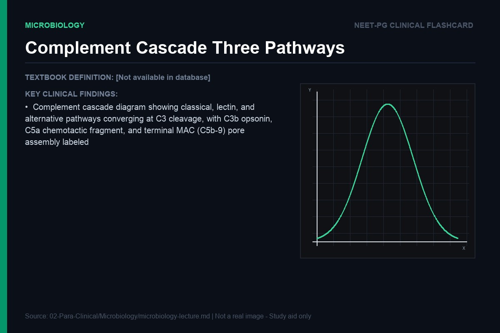
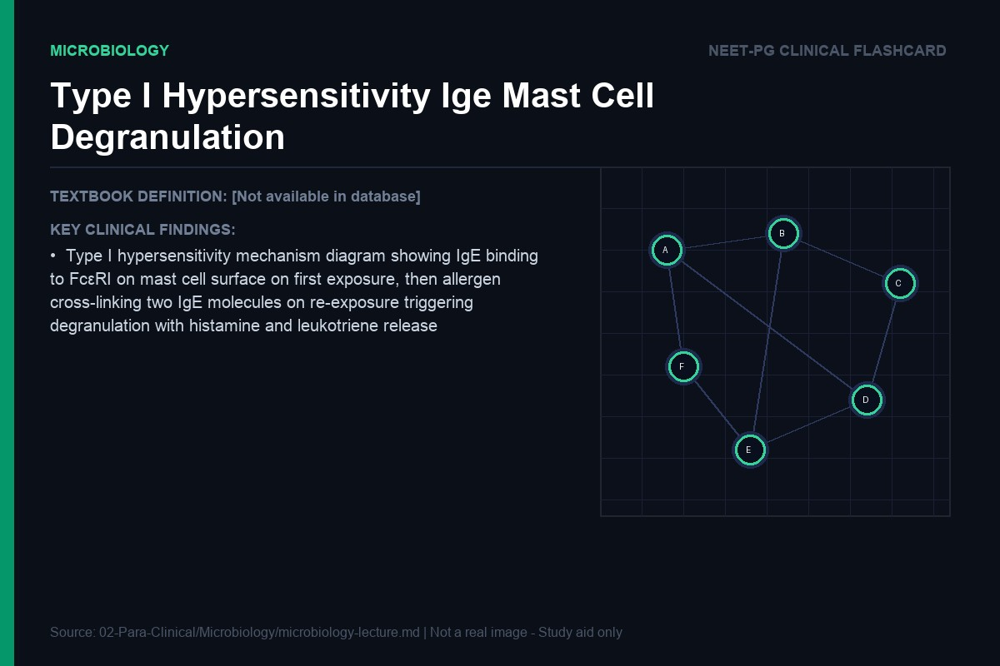
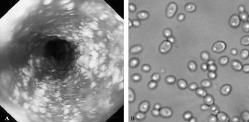

> **Diagram note:** Mermaid mindmap — renders in VS Code (Markdown Preview), Obsidian, or GitHub with the Mermaid extension. Plain-text overview below.

```mermaid
graph TD
    A["🦠 MICROBIOLOGY — NEET PG<br/>6 Major Domains"]

    A --> B["Bacteriology Basics"]
    A --> C["Immunology"]
    A --> D["Gram-Positive Organisms"]
    A --> E["Gram-Negative Organisms"]
    A --> F["Mycobacteria & Special"]
    A --> G["Virology & Parasitology"]

    B --> B1["Staining<br/>Gram / ZN / India ink / Giemsa"]
    B --> B2["Culture Media<br/>Blood agar / MacConkey / LJ"]
    B --> B3["Sterilization<br/>Autoclave 121°C / Hot air 160°C"]

    C --> C1["Hypersensitivity<br/>Type I-IV / Gel-Coombs"]
    C --> C2["Immunodeficiency<br/>Bruton / SCID / DiGeorge / CVID"]
    C --> C3["Vaccines<br/>Live attenuated / Killed / Toxoid"]

    D --> D1["Staph aureus<br/>TSST-1 / Exfoliatin / MRSA mecA"]
    D --> D2["Streptococci<br/>Pyogenes (hyaluronidase) / Pneumococcus"]
    D --> D3["Clostridium<br/>C. perfringens α-toxin / Botulinum / Tetanus"]

    E --> E1["E. coli<br/>EHEC Shiga toxin → HUS"]
    E --> E2["Salmonella typhi<br/>Blood culture week 1 / Widal week 2"]
    E --> E3["Vibrio cholerae<br/>Cholera toxin → cAMP / Rice-water stool"]

    F --> F1["M. tuberculosis<br/>ZN stain / LJ medium / DST"]
    F --> F2["Leprosy<br/>PB vs MB / MDT regimen / Type 1&2 reactions"]
    F --> F3["Treponema pallidum<br/>VDRL (screening) / FTA-ABS (confirm)"]

    G --> G1["Hepatitis B<br/>HBsAg / HBeAg / Anti-HBs / Window period"]
    G --> G2["HIV<br/>ELISA screen / Western blot confirm / CD4"]
    G --> G3["Plasmodium<br/>P. falciparum banana gametocytes / ACT"]
```

**Subject Overview (plain text):**
- Bacteriology Basics: Staining (Gram/ZN/India ink/Giemsa), Culture Media (Blood agar/MacConkey/LJ), Sterilization (Autoclave/Hot air)
- Immunology: Hypersensitivity (Type I-IV/Gel-Coombs), Immunodeficiency (Bruton/SCID/DiGeorge/CVID), Vaccines
- Gram-Positive Organisms: Staph aureus (TSST-1/Exfoliatin/MRSA), Streptococci (Pyogenes/Pneumococcus), Clostridium
- Gram-Negative Organisms: E. coli (EHEC Shiga toxin → HUS), Salmonella typhi, Vibrio cholerae
- Mycobacteria & Special: M. tuberculosis (ZN stain/LJ medium), Leprosy (PB vs MB/MDT), Treponema pallidum (VDRL/FTA-ABS)
- Virology & Parasitology: Hepatitis B (HBsAg/HBeAg/Window period), HIV (ELISA/Western blot/CD4), Plasmodium

# Microbiology — Lecture Notes for NEET PG
### Written in the style of an infectious disease specialist talking to a sharp student

---

## The Central Question of Microbiology

Before we name a single organism or memorize a single virulence factor, ask yourself the only question that matters in this subject: what does a pathogen want? It wants to survive, replicate, and spread to the next host. That is it. Every virulence factor, every toxin, every immune evasion strategy is in service of that single biological imperative. And on the other side, your immune system has one job: stop that from happening. Microbiology, at its core, is a war story. When you understand the strategies and counter-strategies, you stop memorizing and start understanding — and that is what the exam rewards.

---

## Immunology: The Foundation

### Why the Immune System Exists

Your body is a warm, nutrient-rich environment that every microorganism on Earth would love to colonize permanently. The immune system exists because without it, the first bacterial encounter would be your last. But immunity is not a single thing — it is a layered defense system, built from two fundamentally different philosophies about how to fight infection.

The first philosophy is speed at the cost of precision. The second is precision at the cost of speed. These two philosophies gave rise to the innate immune system and the adaptive immune system, respectively — and understanding why each exists the way it does will make every downstream concept make intuitive sense.

### The Innate Immune System: The First Responders

The innate immune system is your body's standing army — always deployed, always ready, never needing to be trained. It operates on a principle called pattern recognition. Over millions of years of co-evolution with microbes, the innate immune system has learned to recognize molecular patterns that are common to broad classes of pathogens but absent from human cells. These are called Pathogen-Associated Molecular Patterns (PAMPs), and the sensors that detect them are Pattern Recognition Receptors (PRRs), the most famous of which are the Toll-Like Receptors (TLRs).

Think of TLRs as tripwires. TLR4 detects lipopolysaccharide (LPS), the outer membrane molecule of Gram-negative bacteria. The moment LPS touches TLR4 on a macrophage, the macrophage does not need to pause and think — it immediately begins secreting inflammatory cytokines (TNF-α, IL-1, IL-6), upregulating phagocytic activity, and sending out chemical distress signals. This happens within minutes of infection. The innate response does not care whether the bacterium is E. coli or Klebsiella — it just knows it is a Gram-negative organism and responds accordingly.

**Analogy:** The innate immune system is like a smoke alarm. It does not tell you exactly what is burning or where — it just detects "fire" and triggers the alarm. Effective, fast, but not precise.

Neutrophils are the foot soldiers of the innate response. They arrive first (within hours), engulf pathogens via phagocytosis, and kill them with a devastating chemical arsenal: reactive oxygen species (respiratory burst — mediated by NADPH oxidase), myeloperoxidase (which generates hypochlorous acid — essentially bleach inside a cell), and proteolytic enzymes stored in granules. The neutrophil is not designed for finesse; it is designed to destroy pathogens quickly, and it does not much care about the collateral damage to surrounding tissue — which is why acute inflammation (pus, swelling, redness) is largely a neutrophil production.

Macrophages are more sophisticated. They are the tissue-resident phagocytes — present in virtually every organ (Kupffer cells in liver, microglia in brain, alveolar macrophages in lung) — and they do two things: they kill pathogens directly (phagocytosis, oxidative burst), and they bridge the innate and adaptive systems by acting as antigen-presenting cells (APCs). When a macrophage phagocytoses a bacterium, it breaks the proteins down into peptide fragments, loads them onto MHC class II molecules, and presents them on its surface to CD4+ T helper cells. This handoff is the moment the adaptive immune system is activated.

Natural Killer (NK) cells deserve special mention because they solve an important problem: viruses often downregulate MHC class I expression on infected cells to hide from cytotoxic T cells (because CTLs need MHC-I to identify targets). NK cells have a brilliant counter-strategy: they are inhibited by MHC-I. Normal cells express MHC-I → NK cells leave them alone. Virally infected cells lose MHC-I → NK cells kill them without needing prior sensitization. It is a "missing self" recognition system, the mirror image of the adaptive system's "foreign recognition."

### The Complement System: Chemical Warfare

The complement system is one of the most elegant weapons in the innate immune arsenal, and it is also one of the most tested topics in NEET PG. Think of it as a cascade of plasma proteins that, once triggered, operate like a chain of dominoes — each protein activating the next — ultimately converging on three distinct outcomes, each of which damages the pathogen in a different way.

Complement can be activated by three pathways: the classical pathway (triggered by antibody-antigen complexes — so technically a bridge to adaptive immunity), the lectin pathway (triggered by mannose-binding lectin recognizing mannose on bacterial surfaces), and the alternative pathway (triggered directly by pathogen surfaces — completely innate, requires no antibody). All three pathways converge on the cleavage of C3 into C3a and C3b.

> **IBQ tip:** Look for all three pathways labeled separately before they converge at C3 — the key differentiator is the trigger molecule: C1q for classical (antibody-dependent), MBL for lectin, and Factor B/D for alternative (antibody-independent). The MAC pore at the end is the only directly bactericidal output; confusing the alternative pathway (innate) with the classical (adaptive bridge) is a common MCQ trap.

C3b is the opsonin. It coats the bacterial surface like a flag, and phagocytes have receptors (CR1) that recognize C3b-coated targets and preferentially engulf them. **Analogy:** Opsonization is like spray-painting a target fluorescent orange so your soldiers can find it in the dark. Bacteria that have been opsonized are phagocytosed at dramatically higher rates than non-opsonized bacteria.

C5a is the chemotactic agent — it diffuses outward from the site of complement activation and acts as a chemical gradient that neutrophils and macrophages follow toward the infection. It also activates mast cells (causing local inflammation) and primes neutrophils for the oxidative burst. C5a is the "calling all units, come to this address" signal.

The terminal complement components (C5b through C9) assemble into the Membrane Attack Complex (MAC). The MAC inserts into the bacterial cell membrane like a drill bit, creating a pore that disrupts the osmotic barrier — water rushes in, the bacterium swells and lyses. This is the only way complement kills directly without needing phagocytes. It is particularly effective against Neisseria species (N. meningitidis, N. gonorrhoeae) — which is why patients with terminal complement deficiencies (C5-C9 deficiency) are specifically susceptible to recurrent Neisseria infections.

> **Exam key:** C3 deficiency → susceptibility to encapsulated organisms (complement-mediated opsonization fails). C5-C9 deficiency → susceptibility to Neisseria species (MAC-mediated lysis fails). Deficiency of C1-inhibitor → hereditary angioedema (uncontrolled activation of the classical pathway).

### The Adaptive Immune System: Precision Warfare

The adaptive immune system takes 7-14 days to mount its first response — an eternity in infection terms. So why does it exist? Because it does something the innate system cannot: it generates exquisitely specific responses against any pathogen it encounters, and it remembers. The memory cells generated after a primary response allow secondary responses that are faster, larger, and more specific — this is the biological basis of vaccination.

The adaptive system has two arms: humoral immunity (B cells → antibodies) and cellular immunity (T cells). But T cells are not a monolithic population — they are divided into subsets that are specialized for different types of threats, and understanding these subsets through the lens of "what problem is each one solving?" makes everything click.

### T Helper Cell Subsets: Immune System Generals

CD4+ T helper cells are the generals of the adaptive immune response. They do not kill pathogens directly — they coordinate and amplify the responses of other immune cells. Different subsets of Th cells have evolved to deal with different categories of threats.

**Th1 cells** exist because of intracellular pathogens — bacteria and parasites that hide inside macrophages (Mycobacterium, Leishmania, Salmonella). Antibodies cannot reach them (antibodies are in the extracellular space), and complement cannot opsonize what it cannot see. The solution is to supercharge the macrophage that is already harboring the pathogen. Th1 cells secrete IFN-γ, which activates macrophages and dramatically upregulates their killing capacity (increased NADPH oxidase, more reactive oxygen species, inducible nitric oxide synthase → nitric oxide → lethal to intracellular pathogens). So Th1 → activated macrophages → intracellular killing. The price: the same activated macrophages can cause tissue damage if the response is excessive or chronic (tuberculosis granuloma, delayed-type hypersensitivity).

**Th2 cells** exist because of helminths — large, multicellular parasites that cannot be phagocytosed. The solution to a large parasite is a different kind of immune response: IgE-mediated mast cell degranulation (immediate hypersensitivity), eosinophil recruitment (ADCC — antibody-dependent cellular cytotoxicity, where eosinophils attach to IgE-coated worms and release toxic granule contents), and increased mucus secretion (to expel gut parasites). Th2 cells drive this via IL-4 (promotes IgE class switching), IL-5 (eosinophil production and activation), and IL-13 (mucus production). This is also the pathway that goes wrong in allergy and asthma — chronic Th2 activation against harmless antigens (pollen, dust mites).

**Th17 cells** exist because of extracellular bacteria and fungi — pathogens that live outside cells in tissues but evade simple phagocytosis. The solution is massive neutrophil recruitment to the site of infection. Th17 cells secrete IL-17, which acts on epithelial cells and fibroblasts to produce G-CSF and CXC chemokines → neutrophil recruitment and mobilization from bone marrow. Th17 cells also drive production of antimicrobial peptides at mucosal surfaces. Loss of Th17 function (as in Job syndrome / Hyper-IgE syndrome) → recurrent bacterial and fungal infections (cold abscesses, recurrent skin and pulmonary infections).

### The Four Types of Hypersensitivity: When Immunity Causes Disease

Hypersensitivity reactions are not infections — they are the immune system causing collateral damage, either because it is reacting to a harmless antigen or because the immune response itself is injuring the host. Gell and Coombs classified these into four types, and understanding each through the lens of mechanism (not just memorization) is critical.

**Type I — IgE-mediated (Immediate Hypersensitivity):** This is the pathway that exists legitimately to fight helminths but goes wrong in allergy. On first exposure to an allergen (pollen, bee venom, penicillin), B cells class-switch to produce IgE under Th2 instruction. IgE binds to high-affinity receptors (FcεRI) on mast cells and basophils, effectively "loading" these cells. On re-exposure, the allergen cross-links two adjacent IgE molecules on the mast cell surface → immediate degranulation (within seconds to minutes) → release of preformed mediators (histamine, tryptase, heparin) and newly synthesized mediators (prostaglandins, leukotrienes, PAF) → vasodilation, bronchospasm, increased vascular permeability. In severe cases (anaphylaxis), systemic vasodilation → distributive shock. Treatment: epinephrine (counteracts vasodilation and bronchospasm by activating α and β adrenergic receptors).

> **IBQ tip:** The key visual is two IgE molecules being cross-linked by a single bivalent allergen — this cross-linking is the physical trigger for degranulation; a monovalent hapten cannot cross-link and therefore does not trigger anaphylaxis. Distinguish Type I (seconds to minutes, IgE/mast cell) from Type III (6-12 hours, immune complexes/complement) by the timeline and the cell type involved.

**Type II — Antibody-Mediated Cytotoxicity:** Here, antibodies target antigens on cell surfaces, leading to cell destruction. The antibody (IgG or IgM) binds its target → activates complement (MAC lysis) or recruits NK cells (ADCC) or facilitates phagocytosis. Classic examples: autoimmune hemolytic anemia (antibodies against RBC surface antigens → complement-mediated lysis or splenic phagocytosis), Goodpasture's syndrome (antibodies against type IV collagen in glomerular basement membrane), myasthenia gravis (antibodies against acetylcholine receptors at the neuromuscular junction → receptor internalization and blockade → muscle weakness). Note: some Type II reactions involve stimulatory antibodies rather than destructive ones — Graves' disease (TSH receptor-stimulating antibodies → hyperthyroidism).

> **IBQ tip:** The critical differentiator from Type III is that Type II antibodies target antigens fixed on a cell surface, whereas Type III antibodies form soluble circulating immune complexes — look for "cell-bound antigen" in the question stem as the Type II signature. Also note that not all Type II reactions are destructive: stimulatory antibodies (Graves') and blocking antibodies (myasthenia) are both Type II.

**Type III — Immune Complex-Mediated:** When antigen-antibody complexes form in excess (antigen excess or small complexes that don't precipitate well), they circulate and deposit in vessel walls, glomeruli, and synovium. There they activate complement → C5a attracts neutrophils → neutrophils attempt to phagocytose the complexes but are frustrated (the complexes are embedded in vessel wall) → release of lysosomal enzymes into the extracellular space → tissue damage. This is why Type III reactions characteristically cause vasculitis, nephritis, and arthritis. Classic examples: serum sickness (after foreign protein injection — immune complexes develop 7-10 days later), SLE (autoantibodies against nuclear antigens → immune complex deposition in kidneys, skin, joints), post-streptococcal glomerulonephritis (streptococcal antigen-antibody complexes deposit in glomeruli).

> **IBQ tip:** The hallmark gross pathology is a triad of vasculitis, nephritis, and arthritis caused by immune complex deposition at filtration surfaces — if the question mentions all three organ systems together with a 7-10 day lag after antigen exposure, it is Type III (serum sickness pattern). Distinguish from Type II by location: Type III complexes are in vessel walls and glomeruli (deposited from circulation), not on cell surfaces.

**Type IV — T Cell-Mediated (Delayed-Type Hypersensitivity):** This is the only type that does not involve antibodies. Instead, sensitized CD4+ T cells (Th1 subtype) recognize antigen presented by APCs and release IFN-γ → macrophage activation → tissue damage. The "delayed" refers to the timeline: 48-72 hours after antigen exposure (versus minutes for Type I). The tuberculin (Mantoux) test is the classic example: inject purified protein derivative (PPD) intradermally → in a sensitized individual, local Th1 cells recognize the antigen → macrophage accumulation → induration (not redness, but induration — the firmness from cellular infiltration) after 48-72 hours. Contact dermatitis (nickel, poison ivy) is also Type IV — haptens penetrate skin, bind to skin proteins, forming a complete antigen that sensitizes local T cells.

> **IBQ tip:** The single most tested distinguishing feature of Type IV is that it is the only antibody-independent hypersensitivity — look for "T cell-mediated" or "no antibodies involved" in the question stem. In the Mantoux test, measure induration (firm cellular infiltrate felt by palpation), not the diameter of redness — the erythema alone is non-specific and does not indicate prior sensitization.

> **Exam key:** Type IV is the ONLY antibody-independent hypersensitivity. The tuberculin test measures induration (cellular infiltration), not redness (which is vascular). Caseous necrosis in TB granulomas is a manifestation of Type IV hypersensitivity — macrophage activation gone to destructive extremes.

---

## Key Bacterial Pathogens

### Staphylococcus aureus: The Master of Immune Evasion

If bacteria were poker players, S. aureus would be the one who has memorized every tell at the table and written a cheat sheet for every situation. It is not the most deadly organism, but it is arguably the most strategically sophisticated — and studying its virulence factors teaches you more about the immune system than any textbook chapter on immunology alone.

S. aureus's first strategy is to prevent opsonization. Protein A, anchored in the cell wall, binds the Fc region of IgG — but in reverse orientation. Normally, antibodies bind antigen via their Fab region and leave their Fc region free to bind phagocyte Fc receptors (the Fc region is the "handle" that phagocytes grab). Protein A binds the Fc region directly → the antibody is oriented backwards → the Fab regions point inward → the phagocyte has nothing to grab → opsonization is neutralized. It is a spectacularly simple trick: bind the weapon by its handle so it cannot be used.

The second strategy is the fibrin coat. Coagulase is an enzyme secreted by S. aureus that converts fibrinogen to fibrin — but unlike normal coagulation (which requires the clotting cascade), coagulase does this directly. The result is a fibrin shell around the bacterium. **Analogy:** Coagulase builds a personal bunker around S. aureus — a wall of clotted protein that phagocytes cannot penetrate. This is also why S. aureus infections tend to form abscesses (loculated collections of pus with a fibrin wall) rather than spreading diffusely.

The third strategy — and the most devastating — is Panton-Valentine Leukocidin (PVL). PVL is a pore-forming toxin that targets leukocytes (primarily neutrophils). It inserts into the neutrophil cell membrane, creates a pore, and kills the cell. Consider what this means: the bacterium is killing the very cells that are trying to kill it. PVL-positive S. aureus strains (commonly community-acquired MRSA) cause particularly severe skin and soft tissue infections and necrotizing pneumonia, because they systematically eliminate the primary cellular defense at the site of infection.

Beyond these evasion strategies, S. aureus produces a range of toxins that cause disease through specific mechanisms. Alpha-toxin pore-forms in red blood cells and platelets. Exfoliative toxins (ETs A and B) cleave desmoglein-1 in the superficial epidermis → splitting at the stratum granulosum → scalded skin syndrome (Ritter's disease in neonates, staphylococcal scalded skin syndrome in children). The toxin cleaves desmoglein-1 — the same molecule targeted by autoantibodies in pemphigus foliaceus — which is why both diseases look identical histologically.

S. aureus on Gram stain appears as gram-positive cocci in clusters — the characteristic "grape-like" arrangement reflecting cell division in multiple planes.

> **IBQ tip:** The cluster arrangement (division in multiple planes) distinguishes S. aureus from Streptococcus (which divides in one plane, producing chains or pairs) — this is visible on Gram stain and is the single fastest way to separate these two gram-positive cocci genera. Also note the golden-yellow pigment of colonies on blood agar; on Gram stain the cocci themselves appear uniformly purple regardless of colony color.

**Superantigens: Why TSST-1 Causes Toxic Shock.** Normal T cell activation is extraordinarily specific. A T cell receptor (TCR) recognizes a specific peptide (8-12 amino acids) bound in the groove of an MHC molecule. This interaction is like a lock-and-key fit — only the right key (specific peptide-MHC combination) opens the lock. The result is that at any given moment, perhaps 1 in 10,000 to 1 in 100,000 T cells are activated by any given antigen. The immune response is precise and proportionate.

Superantigens throw this elegant specificity out the window. TSST-1 (Toxic Shock Syndrome Toxin-1) does not enter the groove of the MHC molecule and does not need to be processed by APCs. Instead, it bridges the outside of the MHC class II molecule to the Vβ region of the TCR — a region that is shared by large families of T cells regardless of their antigen specificity. One superantigen can activate 5-30% of all T cells simultaneously. The result is a catastrophic cytokine storm: massive simultaneous release of IL-2, IFN-γ, TNF-α, and IL-1 from thousands of T cells and macrophages → fever, hypotension, multiorgan failure → toxic shock syndrome. The name "superantigen" reflects this: it acts like an antigen, but with super-physiological, non-specific power.

**Clinical connection:** The management of TSST-mediated toxic shock is not just antibiotics — it includes clindamycin (which inhibits ribosomal protein synthesis, reducing toxin production at the existing bacterial load, even if the bacteria are not killed) and IVIg (which contains antibodies that neutralize the superantigen). Understanding the mechanism tells you exactly why each treatment component works.

> **Exam key:** TSST-1 is associated with tampon use and surgical wound infections. S. aureus food poisoning is caused by preformed enterotoxins (heat-stable — boiling the food kills the bacteria but NOT the toxin), which act as superantigens in the gut → rapid-onset vomiting within 1-6 hours (no fever, short duration). This distinguishes it from Salmonella/Campylobacter (which require live bacteria and cause fever and diarrhea 12-48 hours later).

### Mycobacterium tuberculosis: Biology as Strategy

Mycobacterium tuberculosis is an organism that has co-evolved with the human immune system for tens of thousands of years, and it shows. Its entire biology is an adaptation to surviving inside the most hostile environment that eukaryotic evolution has created — the activated macrophage. To understand TB, you must understand that this organism is not trying to avoid the immune system; it is trying to live inside it.

The mycolic acid coat is the foundational adaptation. Mycolic acids are long-chain fatty acids (60-90 carbons long) that form a waxy, hydrophobic layer around the cell wall, outside the peptidoglycan layer. This coat does three things simultaneously: it makes the organism acid-fast (the lipid coat retains carbol fuchsin even after treatment with acid-alcohol — the basis of the Ziehl-Neelsen stain); it makes the organism extraordinarily resistant to desiccation (TB can survive in aerosolized droplet nuclei for hours in still air); and it makes the organism resistant to the oxidative killing mechanisms of macrophages (the waxy coat is partially resistant to hydrogen peroxide and hypochlorite).

Acid-fast bacilli (AFB) on Ziehl-Neelsen staining appear as bright red rods against a blue (methylene blue) counterstained background — the carbol fuchsin dye is retained within the mycolic acid coat despite decolorization with acid-alcohol.

> **IBQ tip:** The defining feature is the red rods against blue background — AFB retain carbol fuchsin after acid-alcohol decolorization because the mycolic acid coat is hydrophobic and traps the dye; all non-acid-fast organisms lose the red stain and take up the blue counterstain. Distinguish from a Gram stain (where mycobacteria stain poorly or not at all — they are technically gram-positive but gram-staining is unreliable for MTB).

But the most important adaptation is the mechanism of phagosomal escape. When a macrophage phagocytoses a normal bacterium, the phagosome (the membrane bubble containing the bacterium) fuses with lysosomes (bags of hydrolytic enzymes) to form a phagolysosome — the bacterium is bathed in acid and enzymes and dies. MTB inhibits this phagosome-lysosome fusion by secreting proteins (including lipoarabinomannan, or LAM, and the ESX-1 secretion system effectors) that interfere with the vesicle trafficking machinery of the macrophage. The bacterium sits inside a phagosome that never acidifies and never acquires lysosomal enzymes — essentially living in a protected vacuole within the macrophage. The macrophage that was supposed to kill the pathogen has been turned into its host.

**The Immunology of Granuloma Formation.** When the innate immune system fails to eliminate MTB (because lysosomal killing is blocked), the adaptive immune system mounts a Th1-dominated response. CD4+ Th1 cells recognize MTB antigens presented on MHC class II by infected macrophages → secrete IFN-γ → macrophages are activated to a more powerful killing state → some bacteria are killed. But the immune system cannot fully eliminate the infection, so it does the next best thing: it walls it off. Macrophages begin to fuse and transform into epithelioid cells and Langhans giant cells, surrounding the infected macrophages with layer after layer of activated macrophages, forming a granuloma. The center of the granuloma undergoes caseous necrosis — a dry, cheese-like material (caseum) resulting from the cytotoxic effects of the Th1-driven immune response on the infected cells. The granuloma is essentially a prison: the bacteria are alive inside it (this is latent TB), but they are contained and cannot spread.

**Primary TB versus Reactivation TB.** In a child with no prior immunity encountering MTB for the first time, the organism reaches the alveoli (usually lower or middle lobes, where ventilation is greatest) and begins multiplying. The initial focus of infection is called the Ghon focus — a small area of pneumonitis in the lung parenchyma. The organism spreads via lymphatics to the hilar lymph nodes, forming the Ghon complex (Ghon focus + enlarged hilar nodes). The Ranke complex refers to the calcified remnant of the Ghon complex visible on chest X-ray years later. In an immunocompetent host, this primary infection is usually self-limited — the adaptive immune response walls off the infection in granulomas, and the patient never becomes sick (primary TB is subclinical in most cases). The organism enters a state of metabolic dormancy (or very slow replication) inside the granuloma — this is latent TB.

The Ghon complex — the Ghon focus plus ipsilateral hilar lymphadenopathy — is the hallmark of primary tuberculosis on chest X-ray.

> **IBQ tip:** The Ghon focus is in the lower or mid zone (high-ventilation regions where primary TB lodges), and it connects to enlarged hilar nodes — this combination is called the Ghon complex; the calcified remnant visible years later is the Ranke complex. Distinguish primary TB (lower/mid zone + hilar adenopathy) from reactivation TB (upper lobe cavitation without hilar adenopathy) — the zone and presence of lymphadenopathy are the key radiological differentiators.

Reactivation TB occurs when the immunological containment fails — most commonly due to declining immunity from HIV infection, malnutrition, diabetes mellitus, corticosteroid use, or simply the immunosenescence of old age. The granuloma breaks down (the Th1 response weakens, the prison walls crumble). The bacteria begin replicating actively again. But now the infection is different: this is a host who has previously been sensitized to MTB antigens, so the immune response is intense — paradoxically, this intense immune response is what causes the tissue destruction of reactivation TB. Cytokines drive liquefactive necrosis (the caseum liquefies — creating the perfect culture medium for extracellular MTB replication). The liquefied caseum drains into a bronchus → cavity formation (cavities are characteristically in the upper lobes because the upper lobe has high oxygen tension, which MTB prefers as an obligate aerobe). The patient becomes infectious (cavitary lesions → organisms in the airways → expelled in cough).

> **Exam key:** The difference between primary and reactivation TB is an immunological story, not just anatomical. Lower/middle lobe + hilar lymphadenopathy + calcified Ghon complex = primary TB (in an immunologically naive host). Upper lobe cavitation + hemoptysis + weight loss = reactivation TB (in a previously sensitized host with waning immunity). MTB is the most common cause of granulomatous disease worldwide.

---

## Virology

### Hepatitis B: The Immune System as the Weapon

Hepatitis B virus is a masterclass in the concept that in viral disease, the virus is often not directly killing cells — the immune response is. This distinction has profound clinical implications for understanding disease outcomes and designing treatments.

HBV is a DNA virus (Hepadnaviridae family) with a compact, partially double-stranded circular genome. It infects hepatocytes via the NTCP (sodium-taurocholate co-transporting polypeptide) receptor. Inside the hepatocyte, the viral DNA is converted to covalently closed circular DNA (cccDNA), which acts as a stable episomal template for viral transcription. This is critically important: cccDNA is not integrated into the host genome, but it is extremely stable, resides in the nucleus, and is very difficult to eliminate — which is why HBV infection can persist for decades and why current antivirals (which block the polymerase) suppress viral replication but do not eliminate the cccDNA reservoir.

The hepatocyte infected with HBV does not immediately die. HBV is not intrinsically cytopathic at normal viral loads. The hepatocyte manufactures viral proteins (HBsAg, HBeAg) and assembles viral particles, but it continues to function. What brings it down is the cytotoxic T lymphocyte (CTL) response: CD8+ T cells recognize viral peptides presented on MHC class I on the infected hepatocyte surface → kill the hepatocyte. This is the host trying to eliminate infected cells to stop viral spread — but the collateral damage is hepatocyte death → elevation of ALT/AST → hepatitis.

**The neonatal story.** If the immune system causes hepatitis by killing infected hepatocytes, then a weak immune response should cause less hepatitis — but also less viral clearance. This is exactly what happens in neonates. The neonatal immune system is immature (lower CTL activity, poor T cell responses to new antigens, regulatory T cells predominate to prevent autoimmunity). When a neonate is infected with HBV (most commonly during delivery, from an HBeAg-positive mother), the CTL response is inadequate — not enough hepatocytes are being killed, so there is minimal acute hepatitis (neonates rarely develop symptomatic acute hepatitis B). But because the virus is not being cleared, it establishes persistent infection. Over 90% of neonates infected with HBV become chronically infected. In contrast, healthy adults who acquire HBV have fully competent immune responses — they develop acute hepatitis (elevated ALT, jaundice, symptoms) but clear the infection in over 95% of cases.

**Clinical connection:** This is why universal HBV vaccination of all neonates (within 24 hours of birth, ideally in the delivery room) is so critical. A neonate who escapes vaccination and acquires HBV from its HBeAg-positive mother has a >90% chance of becoming a chronic carrier — and 25% of those chronic carriers will eventually die of cirrhosis or hepatocellular carcinoma. Vaccination completely prevents this chain of events.

**HBV Serological Markers as a Timeline.** The serological course of HBV infection is one of the most frequently tested topics in NEET PG, and it is much easier to understand as a narrative than as a list.

HBsAg (surface antigen) is the first marker to appear — it shows up 1-6 weeks after infection, even before symptoms, and indicates that virus is present. HBeAg (envelope antigen) appears shortly after and indicates active viral replication (it is a secreted form of the core protein, acting as a marker of high replicative activity). ALT rises as the CTL response begins killing infected hepatocytes — this is when the patient becomes symptomatic. In a patient who will clear the infection, HBeAg disappears first (replication slows), followed by appearance of anti-HBe antibodies. Then HBsAg disappears (window period — neither HBsAg nor anti-HBs detectable). Finally, anti-HBs appears — this is the marker of protective immunity (either from infection clearance or from vaccination). Anti-HBc (core antibody, IgM then IgG) persists for life as a marker of past or present infection.

> **IBQ tip:** The window period is defined by the simultaneous absence of both HBsAg and anti-HBs — the only positive marker is IgM anti-HBc, which identifies this as recent acute infection rather than vaccination (vaccination produces anti-HBs alone without any anti-HBc). This is the single most-tested detail of HBV serology.

> **Exam key — the window period:** A patient in the window period has neither HBsAg nor anti-HBs — the only marker present is IgM anti-HBc. This patient had acute HBV infection, is in the process of clearing it, and is not yet immune. In this period, standard surface antigen testing is falsely negative — only anti-HBc IgM identifies recent infection. Anti-HBs alone (without anti-HBc) = vaccine-induced immunity.

### HIV: The Systematic Dismantling of Adaptive Immunity

HIV is not just a virus — it is a 10-year project to dismantle the adaptive immune system from the inside. The tragedy of HIV is that the cell it preferentially infects is the very cell that coordinates the entire adaptive immune response: the CD4+ T helper cell.

HIV enters CD4+ cells via a two-receptor system: CD4 is the primary receptor (which is why CD4+ T cells, macrophages, and dendritic cells — all of which express CD4 — are targets), but HIV also requires a co-receptor for entry. CCR5 is the co-receptor used by R5-tropic (macrophage-tropic) strains, which dominate early infection. CXCR4 is the co-receptor for X4-tropic (T cell-tropic) strains, which emerge later in disease. Individuals who are homozygous for the CCR5Δ32 mutation (a deletion that results in a non-functional CCR5 receptor) are almost completely resistant to HIV-1 infection — a genetic accident that has inspired the development of CCR5 antagonists (maraviroc) as antiretrovirals.

Once inside, HIV undergoes reverse transcription (RNA → DNA via reverse transcriptase — an error-prone enzyme that introduces mutations with every replication cycle, generating the extraordinary genetic diversity that makes vaccine development so challenging) and integration (the viral DNA integrates into the host chromosome via integrase, becoming a provirus that persists as long as the host cell lives).

HIV Western blot is used to confirm HIV infection: bands appear at gp120 and gp41 (envelope glycoproteins) and p24 (core capsid protein) — reactivity to at least two of these three bands is required for a positive result.

> **IBQ tip:** A positive Western blot requires reactivity to at least two of the three major bands (gp120, gp41, p24) — reactivity to p24 alone is indeterminate (not positive), which is a common MCQ trap. Distinguish from ELISA (the screening test, high sensitivity, lower specificity): ELISA detects anti-HIV antibodies but has false positives; Western blot is the confirmatory test because it identifies specific viral proteins.

**The CD4 count as a measure of immune competence.** A normal CD4 count is 500-1500 cells/μL. As HIV progressively depletes CD4+ T helper cells (both by direct viral cytopathic effect and by immune-mediated killing of infected cells), the immune system loses its coordination capacity. But different arms of the immune system require different levels of CD4 support to function, and different pathogens require different levels of immune defense to be contained. This is why opportunistic infections appear in a predictable sequence as the CD4 count falls.

At CD4 >500, the immune system is largely intact — the patient has AIDS-related complex (ARC) or may be asymptomatic. Between 200-500, cellular immunity begins to wane — susceptibility to some fungi (Candida, especially mucosal), reactivation of VZV (shingles), and bacterial infections increases. Below 200 cells/μL, the CDC definition of AIDS is met, and Pneumocystis jirovecii pneumonia (PCP) becomes the major threat. PCP is caused by an organism that is present (as spores) in the lungs of most normal adults without causing disease — it only becomes pathogenic when T cell-mediated immunity falls below a critical threshold. Below 100, Toxoplasma gondii reactivates — latent Toxoplasma cysts in the brain break down (when Th1 CD4+ cell-mediated immunity collapses) → reactivation toxoplasmosis → multiple ring-enhancing lesions in the brain (particularly in basal ganglia and at the grey-white junction). Below 50, CMV disseminates — CMV is kept in check by CD8+ CTLs (which require CD4+ T cell help for maintenance) and NK cells — as both decline, CMV can infect the retina (CMV retinitis — "pizza pie" appearance on fundoscopy), colon, and adrenal glands.

> **Exam key — CD4 thresholds and prophylaxis:** PCP prophylaxis (TMP-SMX) is initiated at CD4 <200. Toxoplasma prophylaxis (also TMP-SMX) at CD4 <100 (and positive Toxoplasma serology). MAC (Mycobacterium avium complex) prophylaxis (azithromycin) at CD4 <50. CMV prophylaxis is generally not given routinely (relies on ART-mediated immune reconstitution). These thresholds reflect the CD4 levels at which each pathogen's containment fails.

**Clinical connection:** The viral load determines how quickly CD4 cells are destroyed (rate of disease progression). The CD4 count determines current immune status and what infections to prevent. ART targets multiple steps in the viral replication cycle simultaneously (NRTI + NNRTI or PI + integrase inhibitor) to prevent resistance emergence — any single drug is defeated by mutational escape within weeks; three drugs with different targets make the probability of simultaneous resistance to all three vanishingly small.

---

## Summary Tables

### Complement Pathways

| Pathway | Trigger | Key Proteins | Outcome |
|---|---|---|---|
| Classical | Ab-Ag complex (IgG, IgM) | C1q, C1r, C1s, C4, C2 | C3 cleavage → C3b, C3a |
| Lectin | Mannose on pathogens | MBL, MASP1/2 | C3 cleavage |
| Alternative | Pathogen surfaces (spontaneous) | Factor B, D, Properdin | C3 cleavage |
| All converge | C3 cleavage | C3b (opsonin), C3a/C5a (anaphylatoxins), MAC (C5b-9) | Opsonization, chemotaxis, lysis |

### Hypersensitivity Quick Reference

| Type | Mediator | Timing | Prototype Disease |
|---|---|---|---|
| I | IgE + mast cells | Minutes | Anaphylaxis, asthma, urticaria |
| II | IgG/IgM vs cell surface | Hours | AIHA, Goodpasture, Graves |
| III | Immune complexes | 6-12 hours | SLE, serum sickness, PSGN |
| IV | T cells (Th1/CTL) | 48-72 hours | TB tuberculin, contact dermatitis, transplant rejection |

### HBV Serological Markers

| Marker | Significance | Present in |
|---|---|---|
| HBsAg | Virus present | Acute + chronic infection |
| Anti-HBs | Immunity | Recovery OR vaccination |
| HBeAg | Active replication | High infectivity |
| Anti-HBe | Replication declining | Late acute / chronic low-replication |
| IgM anti-HBc | Recent acute infection | Acute + window period |
| IgG anti-HBc | Past infection | Resolved infection + chronic |

### HIV CD4 Count and Opportunistic Infections

| CD4 Count | Opportunistic Infection |
|---|---|
| <500 | Candida (mucosal), VZV reactivation |
| <200 | PCP (Pneumocystis jirovecii pneumonia) |
| <100 | Toxoplasma encephalitis, Cryptosporidium |
| <50 | CMV retinitis, MAC (M. avium complex) |

---

## Mycology: The Forgotten Kingdom

### Why Fungi Are Fundamentally Different — and Why That Matters for Treatment

Before we discuss any individual fungal pathogen, we need to understand why treating fungal infections is so much harder than treating bacterial infections — and the answer lies in cell biology.

Bacteria are prokaryotes. Their cells are organized differently from human cells: they have cell walls made of peptidoglycan, 70S ribosomes (versus human 80S ribosomes), and prokaryotic DNA replication machinery. These differences are the targets of antibiotics. Penicillin attacks peptidoglycan synthesis — human cells have no peptidoglycan, so penicillin is exquisitely selective. Aminoglycosides inhibit 70S ribosomes — human ribosomes (80S) are resistant. The pharmacological principle behind antibiotics is selective toxicity: find a target present in the pathogen and absent in the host, and attack it.

Fungi are eukaryotes — just like us. Their cells have 80S ribosomes, a nuclear membrane, and a cytoskeleton identical in principle to ours. Finding a target present in fungi but absent in humans is far more difficult. There is, however, one major structural difference that has become the cornerstone of antifungal pharmacology: the fungal cell membrane.

Fungal cell membranes contain **ergosterol** as the primary membrane sterol. Human cell membranes contain **cholesterol**. These are structurally related molecules — both are sterols — but they are different enough that drugs can be designed to target ergosterol specifically. This is why virtually all major antifungal drugs target the ergosterol pathway: azoles (fluconazole, itraconazole, voriconazole) inhibit lanosterol 14α-demethylase (a fungal cytochrome P450 enzyme), blocking the conversion of lanosterol to ergosterol. Amphotericin B binds ergosterol directly, forming pores in the fungal membrane. Terbinafine inhibits squalene epoxidase, an earlier step in ergosterol synthesis.

**Analogy:** Targeting ergosterol in fungi is like attacking an enemy base that uses a slightly different fuel supply than yours. You can design a weapon that contaminates that specific fuel without affecting your own. The problem is that cholesterol and ergosterol are chemically similar — amphotericin B, the most potent antifungal, has significant nephrotoxicity because it also binds (less avidly) to cholesterol in kidney tubular cells.

Fungi also have a cell wall, but unlike bacteria, the fungal cell wall is made of **chitin** (a polymer of N-acetylglucosamine) and **β-glucans** — not peptidoglycan. This is why antibiotics that target peptidoglycan synthesis (penicillins, cephalosporins, vancomycin) have zero antifungal activity. The echinocandins (caspofungin, micafungin, anidulafungin) target the fungal cell wall by inhibiting β-(1,3)-glucan synthase — an enzyme absent in mammalian cells — making them among the safest antifungals in terms of host toxicity.

> **Exam key:** Antifungal targets: Azoles → ergosterol synthesis (CYP51 inhibition). Amphotericin B → ergosterol binding → membrane pores. Echinocandins → β-glucan synthesis (cell wall). Terbinafine → squalene epoxidase (ergosterol synthesis). Flucytosine → fungal RNA/DNA synthesis (converted to 5-fluorouracil by fungal cytosine deaminase — human cells lack this enzyme). No antifungal targets peptidoglycan because fungi don't have it.

---

### Candida: The Commensal Gone Rogue

Candida species — particularly Candida albicans — are perhaps the most common fungal pathogens of humans, and they illustrate a fundamental principle of infectious disease: a commensal organism that is harmless in a healthy host can become a devastating pathogen when host defenses fall. Candida lives as part of the normal microbiota of the gastrointestinal tract, oral cavity, and vagina of most healthy humans. It causes no disease there. Understanding when and why it crosses the line into pathogen is the key to understanding candidiasis.

**Virulence Mechanisms: What Candida Does When the Opportunity Arises**

C. albicans has a remarkable virulence strategy — it is a dimorphic organism that switches between a yeast form (round, non-invasive, the commensal form) and a hyphal or pseudohyphal form (filamentous, invasive, the pathogenic form). This transition is triggered by environmental signals: body temperature (37°C triggers hyphal formation), neutral pH, and critically, the presence of serum. When Candida encounters damaged tissue or enters the bloodstream, these signals drive it toward the invasive hyphal form.

The hyphae are invasive for a specific reason: they secrete enzymes. Secreted aspartyl proteases (SAPs) are encoded by a family of 10 genes (SAP1-SAP10 in C. albicans) and cleave host proteins — collagen, fibronectin, complement proteins, and secretory IgA. By degrading complement components, Candida directly undermines one of the host's first defenses. By degrading fibronectin and collagen, it creates a path through the extracellular matrix for hyphal invasion. Phospholipases similarly degrade phospholipid membranes at the cell surface. The hyphae also produce proteins that allow them to adhere to epithelial cells (Als proteins — agglutinin-like sequences) and to endothelial cells — facilitating invasion into the bloodstream (candidemia).

Candida on KOH mount shows pseudohyphae (chains of elongated budding yeast cells) or true hyphae alongside blastoconidia — a pattern diagnostic of Candida in clinical specimens.

> **IBQ tip:** Pseudohyphae have constrictions at the attachment points (like a string of sausages) — true hyphae have no constrictions and are parallel-walled. The presence of pseudohyphae on KOH mount is the key indicator of Candida (not Aspergillus, which produces true septate hyphae with acute-angle branching). KOH clears the keratinous debris and host cells, leaving fungal elements highlighted.

**Biofilm Formation: Candida's Fortress**

One of Candida's most clinically important virulence factors is its ability to form biofilms. On medical devices — central venous catheters, urinary catheters, prosthetic valves, intravascular stents — Candida can adhere to the surface and form a complex three-dimensional community of yeast and hyphal cells embedded in a self-produced extracellular polysaccharide matrix. Within this biofilm, Candida is dramatically more resistant to antifungals (fluconazole resistance within biofilms can be 1000-fold higher than planktonic cells), protected from immune cells (neutrophils and macrophages cannot penetrate the matrix effectively), and shielded from host antibody responses.

**Clinical connection:** This is why Candida line infections (candidemia from an infected central line) require removal of the line — antifungals alone cannot sterilize a biofilm-infected device. This is also why Candida is the most common cause of healthcare-associated fungemia in many countries: the ubiquity of central lines and other devices creates perfect Candida habitats. The echinocandins (caspofungin) have superior activity against Candida biofilms compared to azoles — one of the reasons they are now preferred as first-line for invasive candidiasis.

**Host Risk Factors — Why Immunity Matters**

Candida causes disease on a spectrum that is entirely determined by host immune status:

1. **Mucosal candidiasis (thrush, vaginal candidiasis):** Occurs when local host defenses are disrupted — antibiotic use (which kills competing bacteria, allowing Candida overgrowth), inhaled corticosteroids (which suppress local immune responses in the oropharynx — hence rinsing the mouth after inhaler use), pregnancy (altered hormonal milieu changes vaginal pH and glycogen content), and mild immunosuppression (CD4 <500 in HIV). The immune response that normally controls Candida at mucosal surfaces is predominantly Th17-driven — IL-17 from Th17 cells drives production of antimicrobial peptides (defensins, histatins in saliva) that kill Candida. Genetic deficiency of IL-17 signaling (STAT3 mutations in Job syndrome, IL-17F mutations, AIRE mutations causing polyendocrinopathy-candidiasis-ectodermal dystrophy — APECED) leads to chronic mucocutaneous candidiasis, demonstrating the indispensable role of Th17 immunity against Candida at mucosal surfaces.

2. **Invasive/disseminated candidiasis:** Requires a fundamentally broken immune system. Neutrophils are the primary defense against invasive Candida — they phagocytose yeast cells and kill them via oxidative burst, and they release neutrophil extracellular traps (NETs) that catch and kill hyphae. Severe neutropenia (absolute neutrophil count <500/μL) — from chemotherapy for hematological malignancies, bone marrow transplantation, or aplastic anemia — dramatically increases the risk of invasive candidiasis. A neutropenic patient with persistent fever despite broad-spectrum antibiotics should receive empirical antifungal therapy specifically because of Candida (and Aspergillus) risk. CARD9 deficiency (a mutation in the innate signaling adaptor protein that connects CLR pattern recognition receptors to NFκB activation in myeloid cells) leads to profound susceptibility to invasive Candida and other fungal infections, illustrating that specific innate immune signaling pathways are critical for anti-Candida defense.

> **Exam key:** Candida — mucosal disease with Th17 deficiency, invasive disease with neutropenia. Dimorphism (yeast ↔ hyphae) is the invasion switch. Biofilm on medical devices resists azoles → echinocandin preferred + line removal. C. albicans produces germ tubes (true hyphae) at 37°C in serum within 3 hours — the germ tube test identifies C. albicans. C. glabrata and C. krusei are intrinsically resistant to fluconazole — important to know because these species are increasing in frequency in patients previously exposed to azoles.

C. albicans produces germ tubes — short outgrowths of true hyphae emerging from blastoconidia — when incubated in human serum at 37°C for 3 hours, distinguishing it from non-albicans Candida species.

> **IBQ tip:** The germ tube has no constriction at its base (it emerges seamlessly from the yeast cell) — this distinguishes it from pseudohyphae, which have a characteristic pinched-in appearance at each junction. The germ tube test is positive only for C. albicans and C. dubliniensis; all other Candida species are germ tube-negative, making this a rapid bedside-level identification test.

---

### Aspergillus: The Angioinvasive Threat

Aspergillus species — particularly A. fumigatus — are ubiquitous molds. Their conidia (asexual spores) are 2-3 micrometers in diameter, making them perfectly sized to reach and settle in the alveoli. Every human being inhales hundreds of Aspergillus conidia per day. In an immunocompetent host, this is of no consequence — alveolar macrophages rapidly phagocytose and kill the inhaled conidia, and the small number that escape are handled by neutrophils. Disease only occurs when these defenses fail.

**The Biology of Angioinvasion — Why Aspergillus is Dangerous When It Grows**

If conidia are not killed immediately, they germinate — the spore swells, breaks dormancy, and sends out a germ tube that elongates into a hypha. The hypha of A. fumigatus grows rapidly (several millimeters per day in infected tissue) and has a critical biological property: it is angiotropic. The fungal hyphae preferentially grow toward and invade blood vessels. This is not accidental — Aspergillus hyphae secrete a range of proteases, elastases, and phospholipases that degrade vascular endothelium. Once the hypha penetrates a blood vessel wall, two things happen simultaneously: thrombosis (platelet activation, clot formation at the damaged vessel → ischemic infarction of the tissue supplied by that vessel) and hematogenous dissemination (fungal elements enter the bloodstream and can seed any organ — brain, heart, kidneys, eyes).

Aspergillus on microscopy shows septate hyphae with acute-angle (45°) branching — the characteristic dichotomous branching pattern differentiating it from Mucor/Rhizopus (wide-angle, 90°, non-septate hyphae).

> **IBQ tip:** The two features that define Aspergillus microscopically are septate hyphae and acute-angle (45°) branching — if you see wide-angle (90°) branching with non-septate (coenocytic) hyphae, think Mucorales (Mucor, Rhizopus), which causes a different disease (rhinocerebral mucormycosis) in diabetic ketoacidosis rather than neutropenia. This distinction is clinically critical because treatment differs (voriconazole for Aspergillus; amphotericin B for Mucor).

This is the mechanism of invasive pulmonary aspergillosis (IPA). In a neutropenic patient (again, neutropenia is the central risk factor — neutrophils are the primary defense against germinated hyphae), A. fumigatus conidia germinate in the alveolar space, hyphae invade the lung parenchyma, reach pulmonary vessels, cause thrombotic infarction, and spread hematogenously. The radiological appearance of IPA is characteristic: on CT scan, nodular lesions with a "halo sign" — a ring of ground-glass opacity surrounding a solid nodule (the halo represents hemorrhagic infarction around the angioinvasive fungal nodule). As the lesion evolves and the fungal center is cleared, an "air-crescent sign" appears — a crescent of air between the contracted fungal ball and the surrounding infarcted tissue. These are not just radiological trivia — they are pathological fingerprints of the angioinvasive biology.

The halo sign on chest CT — a ground-glass opacity halo surrounding a solid fungal nodule — is the early radiological signature of invasive pulmonary aspergillosis in neutropenic patients.

 *([Source: Radiopaedia](https://radiopaedia.org/articles/halo-sign-pulmonary))*
> **IBQ tip:** The halo of ground-glass opacity represents hemorrhagic infarction surrounding the angioinvasive fungal nodule — it is the radiological footprint of blood vessel invasion; the solid center is the fungal mass itself. As the lesion matures and the neutrophil count recovers, the halo resolves and the "air-crescent sign" appears (a crescent of air between the contracted necrotic center and the surrounding tissue) — together, halo sign (early) and air-crescent sign (late) are the CT signature pair of IPA.

**Allergic vs Invasive Aspergillosis — The Same Organism, Different Host Responses**

Aspergillus produces a striking spectrum of disease depending entirely on host immune status:

- **Allergic bronchopulmonary aspergillosis (ABPA):** In an atopic host (asthmatic or cystic fibrosis patient) with a hyperactive Th2 response, Aspergillus conidia colonize the bronchi but do not invade tissue. Instead, the host mounts an exaggerated IgE and IgG response to Aspergillus antigens. IgE-mediated mast cell degranulation → bronchospasm and mucus plug formation. IgG-antigen immune complexes → Type III hypersensitivity → eosinophilic inflammation → proximal bronchiectasis. ABPA is diagnosed by elevated serum IgE (total and Aspergillus-specific), peripheral eosinophilia, positive Aspergillus skin test, and characteristic radiological findings (central bronchiectasis, mucus plugging). Treatment is corticosteroids (to dampen the immune response) plus itraconazole (to reduce fungal burden and antigenic stimulus).

- **Aspergilloma:** In a host with pre-existing lung cavities (from TB, bronchiectasis, sarcoidosis), Aspergillus hyphae colonize the cavity and form a fungal ball (aspergilloma or mycetoma) — a ball of matted hyphae, fibrin, and necrotic debris. The host immune system is intact (no tissue invasion occurs), but it cannot clear the fungal ball because it is in an anatomically sequestered cavity. The patient presents with hemoptysis (blood from the vascular granulation tissue surrounding the aspergilloma) and a characteristic "crescent sign" on chest X-ray — a radioopaque mass within a cavity with a surrounding crescent of air (the aspergilloma can move — "rolling ball" sign on CT when the patient changes position). Treatment is surgical resection or bronchial artery embolization for hemoptysis; antifungals have limited penetration into the avascular aspergilloma.

The aspergilloma crescent sign on chest X-ray shows a dense fungal ball (mycetoma) within a pre-existing lung cavity with a surrounding crescentic air space.

 *([Source: Radiopaedia](https://radiopaedia.org/articles/aspergilloma))*
> **IBQ tip:** The crescent sign of aspergilloma is an air crescent surrounding a dense ball within a cavity — the ball can move to a dependent position when the patient changes posture ("rolling ball" or "fallen leaf" sign on CT). Distinguish from the halo sign of invasive aspergillosis: halo sign is a ground-glass opacity around a nodule in neutropenic patients (early IPA), whereas the crescent sign in aspergilloma appears in immunocompetent patients with pre-existing cavities (no tissue invasion).

- **Invasive aspergillosis:** The angioinvasive form described above, almost exclusively in severely immunocompromised patients (profound neutropenia, solid organ transplant recipients on calcineurin inhibitors and corticosteroids, hematological malignancy). Treatment is voriconazole (a second-generation triazole with superior activity against Aspergillus compared to fluconazole — fluconazole has essentially no activity against Aspergillus). Amphotericin B (liposomal formulation, to reduce nephrotoxicity) is the alternative.

> **Exam key:** The three Aspergillus disease patterns — ABPA (Type I + III hypersensitivity in atopic hosts → bronchospasm, bronchiectasis), aspergilloma (non-invasive colonization of cavities → hemoptysis, crescent sign), invasive aspergillosis (angioinvasion in neutropenic hosts → halo sign, infarction, hematogenous dissemination). Voriconazole is first-line for invasive aspergillosis. Fluconazole does NOT cover Aspergillus.

---

### Cryptococcus: The Brain Invader

Cryptococcus neoformans is an encapsulated yeast that causes the most common life-threatening fungal infection of the central nervous system worldwide — cryptococcal meningitis. It almost exclusively causes serious disease in immunocompromised individuals, particularly those with CD4 counts below 100 cells/μL in HIV infection. Understanding its pathogenesis requires understanding how it evades the immune system so elegantly that it can travel to the brain undisturbed.

**The Polysaccharide Capsule: The Ultimate Anti-Phagocytic Shield**

C. neoformans is surrounded by a massive polysaccharide capsule — glucuronoxylomannan (GXM) and galactoxylomannan (GalXM) — that can be up to 5-10 times the diameter of the yeast cell body. This capsule is the primary virulence factor, and it subverts the immune system through multiple simultaneous mechanisms:

1. **Anti-phagocytic effect:** The capsule sterically hinders phagocyte Fc receptors and complement receptors from binding to the yeast surface — the capsule is so large and negatively charged that phagocytes cannot get a grip. Complement components (C3b) do deposit on the capsule, but the capsule is too thick for CR1 receptors on phagocytes to reach the underlying C3b.

2. **Immunological misdirection:** GXM is shed in large quantities from the yeast surface and circulates freely. This "decoy" GXM competes for available antibody and consumes complement, reducing the opsonization of the actual yeast. It also directly suppresses T cell responses and shifts macrophage polarization toward an anti-inflammatory M2 phenotype — reducing the inflammatory response that would otherwise contain the infection.

3. **Masking of PAMPs:** The capsule covers the fungal cell wall, hiding the β-glucan and chitin PAMPs that would otherwise be recognized by PRRs (Dectin-1, TLR2). Without PAMP recognition, the innate immune alarm is not triggered effectively.

**The "Trojan Horse" Hypothesis: How Cryptococcus Reaches the Brain**

The brain is protected by the blood-brain barrier (BBB) — tight junctions between endothelial cells and the surrounding astrocytic processes that prevent most pathogens and even most drugs from entering the brain. Cryptococcus has evolved a strategy to cross this barrier: the "Trojan horse" mechanism. Macrophages that have phagocytosed Cryptococcus but failed to kill it (because C. neoformans can survive inside macrophages — it inhibits phagosome-lysosome fusion by alkalinizing the phagosome and resisting oxidative killing via its melanin pigment, which scavenges free radicals) migrate across the BBB as part of normal macrophage trafficking. The yeast cells are carried inside macrophages, hidden from immune surveillance, and delivered directly to the brain parenchyma and meningeal spaces.

Melanin production is another key virulence factor: C. neoformans synthesizes melanin from dopamine (which is abundant in the brain and CNS — explaining the neurotropism of Cryptococcus). The melanin is deposited in the cell wall and acts as a potent antioxidant, absorbing reactive oxygen species generated by the macrophage's respiratory burst. **Analogy:** Melanin in Cryptococcus is like a bulletproof vest against oxidative killing — it absorbs the attack without letting it through to the fungal cell.

**Clinical Presentation and Diagnosis**

Cryptococcal meningitis presents as a subacute to chronic meningitis — the onset is insidious (days to weeks), with headache, fever, and gradually progressive altered mentation. The classic teaching is that Cryptococcus causes meningitis with remarkably low CSF inflammation — the CSF may show only mild pleocytosis (even zero cells in severely immunocompromised patients) because the capsule suppresses the inflammatory response. The opening pressure is markedly elevated (due to impaired CSF outflow — the capsular polysaccharide physically obstructs CSF reabsorption at the arachnoid granulations). The elevated intracranial pressure (ICP) is a major cause of morbidity and mortality — visual loss, papilledema, and brainstem herniation.

Diagnosis: India ink staining of CSF reveals the classic picture — the large capsule appears as a clear halo surrounding the dark yeast cells (the India ink is excluded from the capsule, creating a negative stain). The cryptococcal antigen test (CrAg) detects GXM in serum or CSF — it is extremely sensitive and specific (>95% sensitivity in AIDS patients with cryptococcal meningitis). A positive serum CrAg can predict the development of cryptococcal meningitis before symptoms appear — allowing preemptive antifungal therapy.

India ink staining of CSF shows encapsulated Cryptococcus neoformans yeast cells as a clear halo (the capsule excludes the ink) surrounding a dark yeast cell body — this is a negative stain where the capsule is visualized by what it excludes.

> **IBQ tip:** The India ink preparation is a negative stain — the capsule is not stained, it appears as a clear unstained zone (halo) against the dark ink background; the large halo-to-cell ratio (capsule can be 5x the diameter of the yeast body) is the key visual. Distinguish from other encapsulated organisms: Cryptococcus yeast cells show narrow-based budding (distinguishing from Histoplasma, which is a smaller intracellular yeast without such a prominent capsule). The CrAg test is more sensitive than India ink in clinical practice.

Treatment: Amphotericin B + flucytosine (induction, 2 weeks) → fluconazole (consolidation and maintenance, at least 8 weeks, then long-term secondary prophylaxis until CD4 >200 on ART). Serial lumbar punctures to control ICP are as important as antifungals — the single most important predictor of short-term mortality in cryptococcal meningitis is the opening CSF pressure, and reducing ICP by controlled CSF drainage saves lives.

> **Exam key:** Cryptococcus — encapsulated yeast, neurotropic, almost exclusively in CD4 <100. India ink staining shows capsule (negative staining). CrAg test is the fastest diagnostic. Elevated ICP is a major cause of death — serial LP mandatory. Treatment: AmB + 5-FC induction → fluconazole maintenance. Melanin protects against oxidative killing (explains neurotropism — dopamine substrate in CNS).

---

## Parasitology: Plasmodium and Malaria

### The Malaria Lifecycle: Biology as Destiny

Malaria is caused by Plasmodium species — P. vivax, P. ovale, P. malariae, P. falciparum, and P. knowlesi — and understanding which species causes which clinical pattern is impossible without first understanding the biology of the parasite lifecycle. Every clinical feature of malaria — the fever cycle, the anemia, the danger of falciparum — flows directly from the parasite's biology.

**Why Does the Parasite Go to the Liver First?**

When an infected Anopheles mosquito bites a human, it injects sporozoites into the bloodstream through its saliva. The sporozoite's first destination is not the red blood cell — it is the hepatocyte. The sporozoites travel in the bloodstream to the liver within minutes of injection and invade hepatocytes using a specific receptor interaction: the sporozoite surface protein TRAP (thrombospondin-related adhesion protein) and CS protein (circumsporozoite protein) engage heparan sulfate proteoglycans on hepatocyte surfaces, then interact with CD81 on hepatocytes for invasion.

Why the liver? This is not arbitrary — it is a strategic biological choice. Inside the hepatocyte, the parasite undergoes schizogony (asexual multiplication by fission without fertilization). One sporozoite inside one hepatocyte divides repeatedly over 6-16 days (depending on the species), producing 10,000 to 30,000 merozoites from a single hepatocyte. The liver is the amplification factory: one sporozoite goes in, tens of thousands of merozoites come out. By hiding in hepatocytes during this amplification phase, the parasite is protected from the immune system (hepatocytes are not professional antigen-presenting cells, and intrahepatic antigens are partially tolerated by the liver's immune environment). If sporozoites directly entered RBCs, they would have nowhere to amplify — one sporozoite would infect one RBC, and the initial inoculum would be too small to establish infection reliably.

This liver phase is entirely clinically silent — the patient has no symptoms, and blood smears are negative (no parasites in the blood yet). This asymptomatic incubation period is 10-30 days depending on the species. The insidious danger is that a traveler returning from a malaria-endemic region feels completely well during this period — and may not seek medical attention.

**The Hypnozoite: Why Vivax and Ovale Relapse**

P. vivax and P. ovale have an additional biological trick that P. falciparum and P. malariae lack: after the sporozoite invades the hepatocyte, some parasites do not immediately undergo schizogony. Instead, they enter a dormant state as **hypnozoites** (from the Greek "hypnos" — sleep) — small, metabolically quiescent forms that can remain in the hepatocyte for months to years without producing merozoites. The trigger for hypnozoite reactivation is not fully understood but involves host immune factors and possibly the stress response.

When hypnozoites reactivate, they undergo delayed hepatic schizogony and produce a new wave of merozoites — causing a relapse of malaria weeks to months after the original infection. This explains the clinical history that every malaria textbook mentions but never explains: a patient treated for P. vivax malaria, apparently cured (blood smear negative), and then presenting 6 months later with malaria again — despite no new mosquito exposure. They were not re-infected; their dormant hypnozoites reactivated.

This is why treating P. vivax/P. ovale malaria requires two drugs: chloroquine (to kill the blood-stage merozoites and trophozoites — the erythrocytic phase) plus primaquine (a 8-aminoquinoline that is specifically hepatocytotoxic to hypnozoites — the only drug class that can kill hypnozoites and provide radical cure). Primaquine cannot be given to patients with G6PD deficiency (it causes severe hemolytic anemia in G6PD-deficient RBCs — G6PD activity must be checked before prescribing). P. falciparum and P. malariae have no hypnozoite stage — falciparum is treated without primaquine (no liver reservoir) and malariae can cause late recrudescence from persisting low-level bloodstream parasitemia, but this is distinct from the true relapse of hypnozoite reactivation.

**The Erythrocytic Cycle: Why Symptoms Come in Cycles**

Once merozoites are released from the liver into the bloodstream, they invade red blood cells. The invasion is species-specific and receptor-mediated: P. vivax requires the Duffy antigen (DARC — Duffy Antigen Receptor for Chemokines) on the RBC surface, which explains why people of West African descent who are Duffy-negative (a polymorphism common in this population as an evolutionary adaptation) are resistant to P. vivax infection. P. falciparum uses multiple receptors — including glycophorin A and B — which is one reason it can infect RBCs of all ages and achieve very high parasitemia.

Inside the RBC, the merozoite becomes a trophozoite (feeding stage — the parasite digests hemoglobin using proteases and converts heme to hemozoin, a non-toxic crystal — the failure to fully metabolize heme would be toxic to the parasite, which is why hemozoin formation is essential for parasite survival — and incidentally why chloroquine, which inhibits hemozoin formation by intercalating into heme, is toxic to the parasite). The trophozoite grows into a schizont (a stage filled with developing merozoites) and then ruptures — releasing merozoites, hemozoin, and parasite debris into the bloodstream.

This rupture is the moment of fever. The release of hemozoin, glycosylphosphatidylinositol (GPI) anchors, and other parasite products into the bloodstream triggers the innate immune response — TLR-mediated recognition of parasite PAMPs → macrophage activation → massive cytokine release (TNF-α, IL-1, IL-6) → fever. The fever is not from the parasite growing inside the RBC — the fever occurs at the precise moment of RBC rupture and merozoite release.

**The 48-Hour and 72-Hour Cycles — Using the Biology**

The duration of the erythrocytic cycle is species-specific and biologically fixed:
- P. vivax and P. ovale: 48-hour erythrocytic cycle → fever every 48 hours (every other day) → **tertian malaria** (the Latin "tertiana" counts the fever days as day 1, healthy day 2, fever day 3 — hence "tertian" even though the cycle is 48 hours)
- P. malariae: 72-hour erythrocytic cycle → fever every 72 hours → **quartan malaria** (fever on day 1, healthy days 2 and 3, fever on day 4)
- P. falciparum: 48-hour erythrocytic cycle — but because parasites invade RBCs asynchronously (not all at the same stage simultaneously), the fever is often irregular and continuous rather than clearly periodic, especially early in infection

The synchrony of the erythrocytic cycle — the fact that all the parasites in the body tend to rupture at approximately the same time — develops over the first few cycles of infection. Parasites synchronize through a mechanism involving the host's body temperature rhythm (the fever itself, paradoxically, helps synchronize the parasites — high fever kills asynchronous late-stage parasites more efficiently, leaving the more temperature-resistant ring stages to develop synchronously). Early in infection, before synchrony is established, fever may be daily or irregular.

**Why is P. falciparum So Dangerous? The Biology of Cerebral Malaria**

P. falciparum is responsible for the overwhelming majority of malaria deaths — approximately 600,000 per year globally, almost exclusively in sub-Saharan Africa and predominantly in children under 5. The reason P. falciparum is so much more lethal than other Plasmodium species comes down to two unique biological properties: the ability to infect RBCs of all ages, and the phenomenon of cytoadherence and sequestration.

**Age restriction and high parasitemia:** P. vivax can only infect reticulocytes (young RBCs) — this limits its parasitemia to perhaps 1-2% of RBCs. P. malariae infects only old RBCs — similarly limiting its density. P. falciparum can infect RBCs of any age. In a severe falciparum infection, parasitemia can exceed 10-20% of all circulating RBCs. This high parasitemia causes severe hemolytic anemia (massive RBC destruction with each schizont rupture), overwhelms the spleen's filtering capacity, and produces enormous quantities of inflammatory mediators — driving the systemic inflammatory response that contributes to multi-organ failure.

**Sequestration: The Unique Danger of Falciparum**

P. falciparum-infected RBCs undergo a dramatic change in their surface properties as the parasite matures. The trophozoite stage parasite (beginning about 18-24 hours into the erythrocytic cycle) exports a protein called **PfEMP1** (Plasmodium falciparum Erythrocyte Membrane Protein 1) to the surface of the infected RBC. PfEMP1 is encoded by the var gene family (approximately 60 var genes per parasite genome, with only one expressed at a time — this antigenic variation allows the parasite to evade antibody responses). PfEMP1 mediates cytoadherence — it binds to endothelial receptors in blood vessels, particularly ICAM-1 (intercellular adhesion molecule-1), CD36, and PECAM-1 on the microvasculature of the brain, placenta, and other organs.

The consequence is **sequestration**: mature trophozoites and schizonts disappear from the peripheral blood and become trapped in the microvasculature of organs — particularly the brain. This is why a patient with cerebral malaria may have only moderate parasitemia on the peripheral blood smear — the vast majority of infected RBCs are sequestered in cerebral vessels, invisible to the blood smear.

Sequestered infected RBCs cause cerebral malaria through several mechanisms: mechanical obstruction (the sequestered cells physically block microvascular flow → ischemia → cerebral dysfunction), endothelial activation (PfEMP1 binding to ICAM-1 activates endothelial cells → upregulation of further adhesion molecules → worsening inflammation, breakdown of the blood-brain barrier), and local inflammation (macrophage activation → cytokine release → NO dysregulation). The current "unified model" of cerebral malaria pathogenesis proposes that sequestration-induced endothelial activation and BBB disruption, combined with mechanical obstruction, creates a devastating cycle of ischemia and inflammation in the brain.

**Clinical connection:** This is why children with cerebral malaria can deteriorate and die very rapidly — and why prompt treatment is essential. Artesunate (the first-line treatment for severe falciparum malaria) works faster than quinine and is superior because it rapidly kills all stages of falciparum, including the sequestered mature trophozoites. It reduces sequestration burden faster than quinine, improving microvascular flow earlier.

> **Exam key:** P. falciparum is dangerous because of unrestricted RBC invasion (high parasitemia) and sequestration (PfEMP1-mediated cytoadherence → cerebral malaria). No hypnozoites → no relapse (but recrudescence from persisting bloodstream parasitemia possible). Cerebral malaria = unarousable coma in a falciparum-infected patient, most common cause of death. Diagnosis: peripheral smear (ring forms in falciparum — "headphone" appearance, multiple rings per RBC, crescent-shaped gametocytes — the only species with crescent/banana gametocytes). Treatment of severe falciparum: IV artesunate.

Peripheral blood thin film of P. falciparum shows multiple ring trophozoites within a single RBC (appliqué/accolé forms at the RBC margin), delicate "headphone" rings, and the pathognomonic crescent/banana-shaped gametocytes.

> **IBQ tip:** Two features are exclusive to P. falciparum on thin film: (1) multiple rings per RBC and accolé (appliqué) forms at the cell margin, and (2) crescent/banana-shaped gametocytes — all other species have round gametocytes. P. vivax thin film shows enlarged RBCs with Schüffner's dots (stippling visible in Giemsa-stained films) and ameboid trophozoites — no Schüffner's dots occur in P. falciparum.

Peripheral blood thin film of P. vivax shows enlarged RBCs containing ameboid trophozoites with Schüffner's dots — pink stippling of the RBC cytoplasm visible only in Giemsa-stained preparations.

> **IBQ tip:** Schüffner's dots (pink stippling) are the key visual marker for P. vivax (and P. ovale) — they represent invaginations of the RBC membrane caused by the parasite and are only visible with Giemsa stain. P. falciparum never produces Schüffner's dots on thin film; P. malariae shows Ziemann's dots (less prominent) in old RBCs that are normal-sized or smaller. The enlarged RBC size in P. vivax (it infects reticulocytes, which are larger) is the other differentiating feature.

---

## Sterilization and Disinfection: First Principles

### What Makes a Microbe Die?

Before classifying sterilization and disinfection methods, we need to understand the biology: what do you actually need to do to a microorganism to kill it? There are three fundamental mechanisms of microbial death, and every sterilization and disinfection method works through one or more of them:

1. **Protein denaturation:** Proteins are functional because they fold into precise three-dimensional structures determined by their amino acid sequence and maintained by non-covalent bonds (hydrogen bonds, hydrophobic interactions, ionic bonds) and sometimes disulfide bonds. When you heat proteins above a threshold temperature, the thermal energy disrupts these stabilizing bonds → the protein unfolds → it can no longer perform its function (enzymatic catalysis, structural support, receptor binding). All critical cellular proteins — the enzymes of metabolism, the structural components of the ribosome, the components of the cell membrane — are denatured by sufficient heat. The organism's biochemistry collapses and it dies. Most vegetative bacteria are killed at 60-70°C (pasteurization is based on this — heating to 72°C for 15 seconds kills Mycobacterium tuberculosis, Salmonella, Listeria, and other pathogens in milk without boiling). Spore-forming bacteria are the exception — the endospore has unique structural adaptations (dipicolinic acid complexes with calcium to stabilize DNA, small acid-soluble proteins protect DNA, the cortex creates physical protection) that allow it to survive temperatures that kill vegetative cells.

2. **Disruption of cell membranes:** The cell membrane is the critical boundary that maintains the electrochemical gradient and controls what enters and exits the cell. Agents that disrupt this membrane — detergents (which insert into the lipid bilayer and disrupt its integrity), alcohols (which dissolve membrane lipids), quaternary ammonium compounds — cause the membrane to lose integrity. The cell can no longer maintain ion gradients, osmotic homeostasis collapses, and the cell contents leak out. This is why lipid-enveloped viruses (HIV, hepatitis C, influenza) are killed by alcohol and detergents — they rely on their lipid envelope for infectivity, and disruption of that envelope inactivates them. Non-enveloped viruses (norovirus, poliovirus, hepatitis A) lack this lipid envelope and are therefore resistant to alcohol-based hand sanitizers — an important clinical and public health distinction.

3. **DNA damage:** Ultraviolet radiation (specifically UV-C, 260 nm wavelength — the wavelength most efficiently absorbed by DNA bases) causes pyrimidine dimers — adjacent thymine residues on the same DNA strand are covalently cross-linked. If enough dimers form, DNA cannot be replicated or transcribed → the cell cannot divide or make essential proteins → it dies. Alkylating agents (ethylene oxide, formaldehyde, glutaraldehyde) chemically modify DNA bases and proteins by adding alkyl groups to reactive sites — these modifications crosslink DNA strands, inactivate proteins, and ultimately kill the organism. Gamma radiation (from Cobalt-60 sources) causes ionization of water molecules → generation of hydroxyl radicals → strand breaks in DNA.

**Analogy:** Think of a microorganism as a factory. Protein denaturation destroys all the machines in the factory (enzymes can no longer function). Membrane disruption tears down the factory walls (osmotic integrity is lost, everything leaks out). DNA damage destroys the blueprints (the cell cannot replicate or manufacture new machines). Any one of these three attacks, if severe enough, ends the factory permanently.

**The Spectrum from Sterilization to Sanitization**

Now we can classify methods logically using these mechanisms:

**Sterilization** means the complete destruction of all life — including bacterial endospores (which are the most resistant biological entities we encounter). Sterilization is the highest standard: after sterilization, the probability of finding any viable organism on the item is less than 1 in a million (Sterility Assurance Level = 10⁻⁶). Methods that achieve sterilization must be able to kill spores:

- **Autoclaving (moist heat sterilization, 121°C, 15 psi, 15-30 minutes):** Steam under pressure delivers heat to 121°C — above the boiling point of water at sea pressure, achievable only with pressurization. Moist heat is far more effective than dry heat at the same temperature because water transfers heat to proteins much more efficiently than air (the specific heat capacity of steam is much higher), and water is directly involved in protein denaturation (hydrolysis of peptide bonds). The saturated steam at 121°C kills all vegetative bacteria immediately and kills even highly resistant spores (Bacillus stearothermophilus spores, the biological indicator for autoclaving) within the standard cycle time. Autoclaving is the gold standard for surgical instruments, laboratory media, and any heat-stable material that must be sterile.

- **Dry heat (160-170°C, 1-2 hours in a hot air oven):** Less efficient than moist heat — requires much higher temperature and longer exposure because air is a poor heat conductor and heat transfer without moisture is less effective at protein denaturation. Used for materials that cannot tolerate moisture (anhydrous oils, powders, glass syringes in settings without autoclaves). The biological indicator for dry heat is B. subtilis spores.

- **Ethylene oxide (EtO) gas sterilization:** Used for heat-sensitive items that cannot be autoclaved — plastics, electronic components, optical equipment, catheters. EtO is a colorless alkylating gas that penetrates packaging and kills by alkylating DNA and proteins. The process requires high humidity (to allow EtO penetration) and must be followed by an aeration phase to remove toxic residual EtO (EtO is carcinogenic, mutagenic, and explosive). The main limitation is the prolonged aeration time (12-24 hours) and the specialized handling requirements.

- **Gamma radiation:** Used industrially to sterilize single-use medical devices, sutures, and implants at the point of manufacture. Cobalt-60 gamma rays penetrate sealed packaging and kill all organisms including spores through DNA damage (hydroxyl radical generation). Cannot be used on items that would be chemically altered by radiation (some polymers and drugs). The advantage is that it can be applied to packaged, sealed products — maintaining sterility until the package is opened.

**Disinfection** means the destruction of most pathogenic organisms but not necessarily all spores. High-level disinfection kills vegetative bacteria, mycobacteria, viruses, and fungi but may not kill all spores. Intermediate and low-level disinfection kill progressively fewer categories of organisms.

- **Glutaraldehyde (2%):** High-level disinfectant and sterilant (if exposure is prolonged to 6-10 hours, it can kill spores — so it occupies the borderline between disinfection and sterilization). Used for endoscopes (which cannot be autoclaved) — the glutaraldehyde alkylates proteins and DNA on the surface of the instrument. Must be thoroughly rinsed before clinical use (glutaraldehyde is toxic to mucous membranes and can cause colitis if residual glutaraldehyde is introduced into the colon through a colonoscope). Orthophthalaldehyde (OPA) is increasingly replacing glutaraldehyde for endoscope disinfection — equally effective with fewer fumes and less irritation.

- **Alcohols (70% ethanol, 70% isopropanol):** Intermediate-level disinfectants that denature proteins and disrupt lipid membranes. 70% alcohol is more effective than 100% alcohol — pure alcohol dehydrates the surface so rapidly that it creates a protein coat that protects the interior of the cell; 70% alcohol penetrates more slowly and achieves better overall protein denaturation. Effective against vegetative bacteria (including M. tuberculosis), most viruses (enveloped viruses especially), and fungi. Not effective against bacterial spores (no mechanism to kill them) and not effective against non-enveloped viruses like norovirus (no lipid envelope to disrupt). This is why alcohol hand sanitizer does not protect against norovirus — soap and water is required, because the mechanical friction and surfactant action physically remove the non-enveloped virus from the skin.

- **Chlorine-based compounds (sodium hypochlorite — bleach):** Broad-spectrum disinfectant. Hypochlorous acid (the active species at physiological pH) oxidizes proteins and disrupts microbial membranes. At 0.5% (5000 ppm), effective for blood and body fluid spills (HIV is immediately killed by this concentration). At 0.05% (500 ppm), used for general surface disinfection. At very high concentrations (5-10%), can approach sporicidal activity. The limitation: inactivated by organic matter (blood, faeces) — surfaces must be pre-cleaned before hypochlorite application.

> **Exam key:** Resistant to most disinfectants in order: prions > spores > non-enveloped viruses > mycobacteria > enveloped viruses > Gram-positive bacteria > Gram-negative bacteria. The biological indicator for autoclave is Bacillus stearothermophilus (or Geobacillus stearothermophilus). For dry heat: B. subtilis. For EtO: B. subtilis. The Spaulding classification: critical items (enter sterile tissue/bloodstream) → sterilization required; semi-critical items (contact mucous membranes/non-intact skin — e.g., endoscopes) → high-level disinfection minimum; non-critical items (contact intact skin) → low/intermediate disinfection.

### Summary Tables (Additions)

#### Antifungal Drug Targets

| Drug Class | Mechanism | Target | Spectrum |
|---|---|---|---|
| Polyenes (Amphotericin B) | Binds ergosterol → membrane pores | Ergosterol (membrane) | Broad (Candida, Aspergillus, Cryptococcus) |
| Azoles (fluconazole, voriconazole) | Inhibit CYP51 (lanosterol 14α-demethylase) | Ergosterol synthesis | Varies (fluconazole: Candida; voriconazole: Candida + Aspergillus) |
| Echinocandins (caspofungin) | Inhibit β-(1,3)-glucan synthase | Fungal cell wall | Candida (including biofilms), Aspergillus |
| Flucytosine | Inhibits thymidylate synthase (after conversion to 5-FU) | DNA/RNA synthesis | Candida, Cryptococcus |

#### Plasmodium Species Comparison

| Feature | P. falciparum | P. vivax | P. malariae | P. ovale |
|---|---|---|---|---|
| RBC preference | All ages | Reticulocytes (young) | Old RBCs | Reticulocytes |
| Fever cycle | 48 hr (often irregular) | 48 hr (tertian) | 72 hr (quartan) | 48 hr (tertian) |
| Hypnozoites | No | Yes | No | Yes |
| Sequestration | Yes (PfEMP1) | No | No | No |
| Gametocyte shape | Crescent/banana | Round | Round | Round |
| Severity | Most dangerous | Moderate | Mild (nephrotic syndrome) | Mild |
| Radical cure needed | No (primaquine not needed) | Yes (primaquine) | No | Yes (primaquine) |

#### Sterilization Methods Quick Reference

| Method | Temperature/Agent | Mechanism | Kills Spores? | Use |
|---|---|---|---|---|
| Autoclave | 121°C, 15 min, 15 psi | Moist heat/protein denaturation | Yes | Surgical instruments, media |
| Dry heat | 160°C, 1-2 hr | Dry heat/protein denaturation | Yes | Oils, powders, glass |
| EtO gas | 50-60°C, alkylating gas | Alkylation of DNA/proteins | Yes | Heat-sensitive plastics |
| Gamma radiation | Cobalt-60 | DNA damage (hydroxyl radicals) | Yes | Pre-packaged devices |
| Glutaraldehyde (2%) | Room temp, 3-10 hr | Alkylation | Yes (prolonged) | Endoscopes |
| 70% alcohol | Room temp | Protein denaturation + membrane disruption | No | Skin prep, surfaces |
| Hypochlorite | Room temp | Oxidation | No (at usual concentrations) | Blood spills, surfaces |
