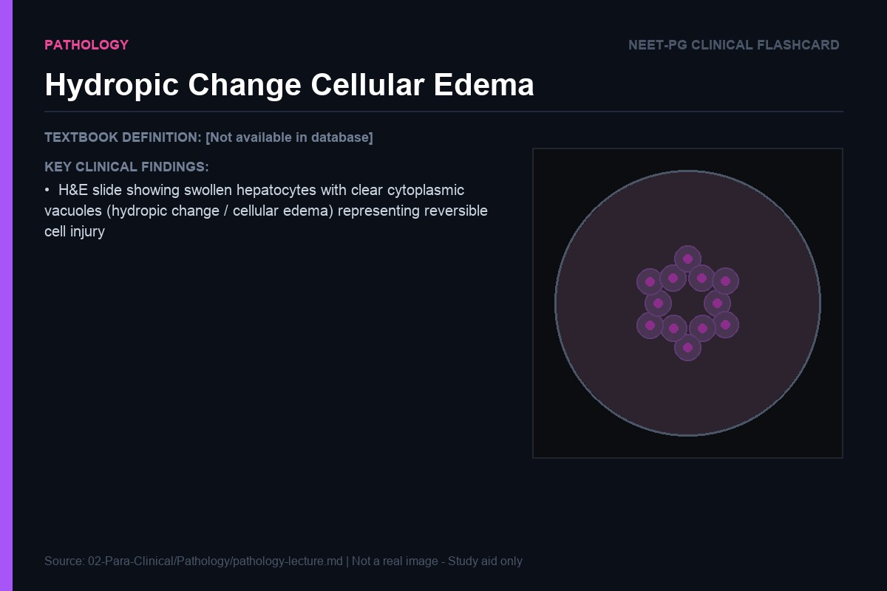
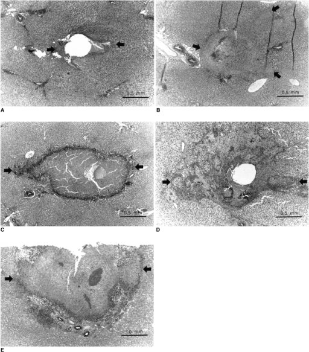
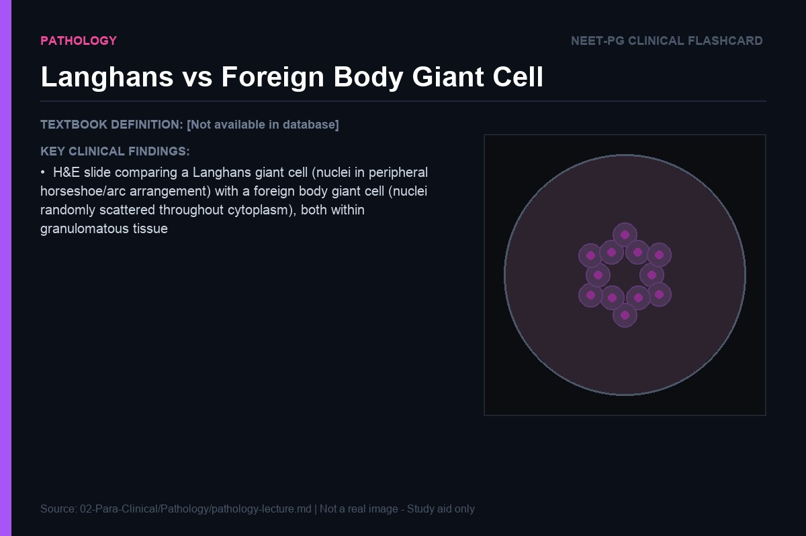
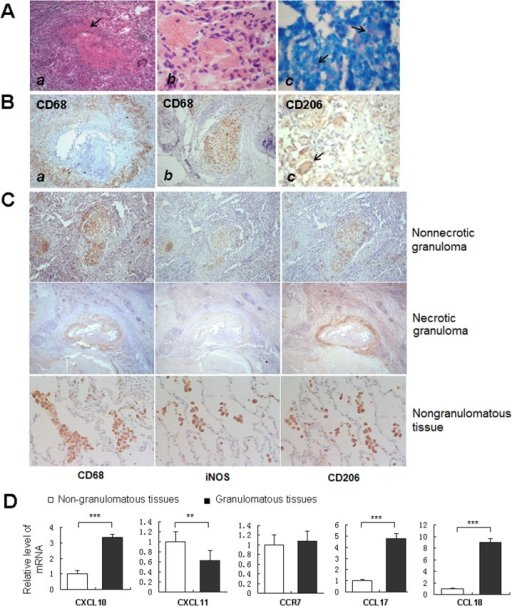
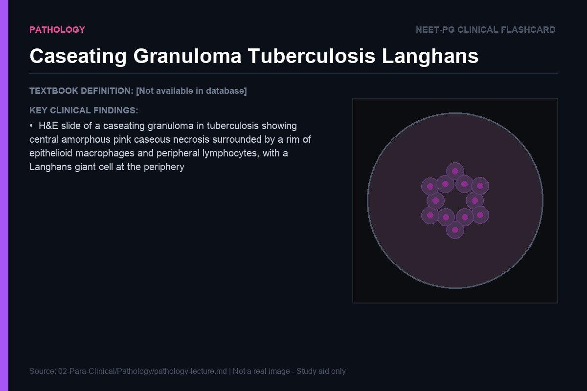
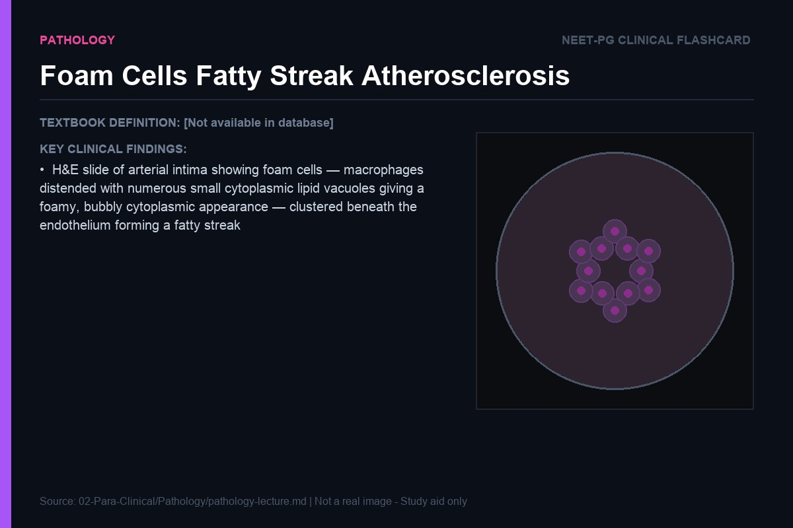
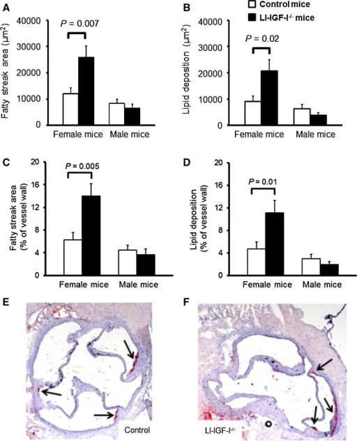

> **Diagram note:** Mermaid mindmap — renders in VS Code (Markdown Preview), Obsidian, or GitHub with the Mermaid extension. Plain-text overview below.

```mermaid
graph TD
    A["🔬 PATHOLOGY — NEET PG<br/>7 Major Domains"]

    A --> B["General Pathology"]
    A --> C["Hematology"]
    A --> D["Cardiovascular"]
    A --> E["Respiratory"]
    A --> F["GI & Hepatic"]
    A --> G["Neoplasia"]
    A --> H["Renal & Endocrine"]

    B --> B1["Cell Injury<br/>Reversible / Irreversible / Apoptosis"]
    B --> B2["Inflammation<br/>Acute / Chronic / Granuloma"]
    B --> B3["Amyloid<br/>Congo red → apple-green birefringence"]

    C --> C1["Anemias<br/>Iron / B12 / Folate / Hemolytic"]
    C --> C2["WBC Disorders<br/>CML / CLL / AML / ALL"]
    C --> C3["Lymphoma<br/>Hodgkin (RS cells) / NHL"]

    D --> D1["IHD<br/>STEMI / NSTEMI / Troponin timeline"]
    D --> D2["Endocarditis<br/>Bacterial / NBTE / Libman-Sacks"]
    D --> D3["Atherosclerosis<br/>Fatty streak → Fibrous plaque"]

    E --> E1["Pneumonia<br/>Lobar / Broncho / Interstitial"]
    E --> E2["TB<br/>Ghon focus / Ranke complex / Cavitation"]
    E --> E3["Lung Ca<br/>SCC / Adeno / SCLC / Mesothelioma"]

    F --> F1["Hepatitis<br/>Viral / Alcoholic / Cirrhosis / HCC"]
    F --> F2["GI Tumors<br/>Carcinoid / Adenoca / GIST"]
    F --> F3["Pancreatitis<br/>Acute (Ranson) / Chronic (calcification)"]

    G --> G1["Oncogenes<br/>RAS / MYC / HER2 / BCR-ABL"]
    G --> G2["Tumor Suppressors<br/>TP53 / RB / BRCA1/2 / APC"]
    G --> G3["Tumor Markers<br/>AFP / CEA / CA-125 / PSA / βhCG"]

    H --> H1["Glomerulonephritis<br/>Nephrotic vs Nephritic syndrome"]
    H --> H2["Thyroid<br/>Papillary (psammoma) / Follicular / MTC"]
    H --> H3["Adrenal<br/>Conn's / Cushing's / Phaeochromocytoma"]
```

**Subject Overview (plain text):**
- General Pathology: Cell Injury (Reversible/Irreversible/Apoptosis), Inflammation (Acute/Chronic/Granuloma), Amyloid (Congo red → apple-green birefringence)
- Hematology: Anemias (Iron/B12/Folate/Hemolytic), WBC Disorders (CML/CLL/AML/ALL), Lymphoma (Hodgkin RS cells/NHL)
- Cardiovascular: IHD (STEMI/NSTEMI/Troponin timeline), Endocarditis (Bacterial/NBTE/Libman-Sacks), Atherosclerosis
- Respiratory: Pneumonia (Lobar/Broncho/Interstitial), TB (Ghon focus/Ranke complex/Cavitation), Lung Ca (SCC/Adeno/SCLC/Mesothelioma)
- GI & Hepatic: Hepatitis (Viral/Alcoholic/Cirrhosis/HCC), GI Tumors (Carcinoid/Adenoca/GIST), Pancreatitis (Acute/Chronic)
- Neoplasia: Oncogenes (RAS/MYC/HER2/BCR-ABL), Tumor Suppressors (TP53/RB/BRCA1-2/APC), Tumor Markers
- Renal & Endocrine: Glomerulonephritis (Nephrotic vs Nephritic), Thyroid tumors (Papillary/Follicular/MTC), Adrenal disorders

# Pathology: Lecture Notes for NEET PG

> "To understand disease, you must first understand the cell — because every disease, no matter how grand its clinical presentation, begins with a molecular event in a single cell."

---

## Cell Injury and Death

### What Does a Cell Need to Survive?

Before we can understand how a cell dies, we need to understand how it lives. Think of a cell as a tiny factory with four non-negotiable requirements: a steady supply of ATP, intact membranes that separate inside from outside, functional DNA that carries the blueprint, and tightly regulated calcium balance. Take away any one of these, and the factory shuts down. Take away all four simultaneously, and it collapses.

ATP is the universal energy currency of the cell. The sodium-potassium ATPase pump uses ATP to maintain the electrochemical gradient across the plasma membrane — sodium out, potassium in. This gradient is everything. It drives nerve conduction, muscle contraction, and most critically, it determines the osmotic balance inside the cell. When ATP falls, this pump stops. Sodium accumulates inside the cell. Water follows by osmosis. The cell swells — a process called cellular edema or hydropic change. This is the first, reversible sign of cell injury, visible under light microscopy as cytoplasmic vacuolation. The cell is not dead yet; it is struggling. If ATP is restored, it can recover.

> **IBQ tip:** Look for enlarged cells with pale, watery, vacuolated cytoplasm and intact nuclei — the key feature of reversibility. Distinguish from fatty change (steatosis), where vacuoles are larger, rounder, and displace the nucleus to the periphery (signet-ring appearance in severe cases); fat stains (Oil Red O) will be positive only in steatosis.

Calcium is the second pillar of cellular homeostasis. Normally, cytosolic calcium is maintained at extraordinarily low concentrations — about 0.1 micromolar — while extracellular calcium is 10,000 times higher. This steep gradient exists because the cell actively pumps calcium out using energy-dependent transporters. When ATP fails, calcium floods inward. And calcium, in high concentrations, is a cellular executioner. It activates phospholipases (which digest membranes), endonucleases (which chop DNA), and proteases (which destroy proteins). This is why calcium dysregulation is not just a consequence of cell injury — it is an amplifier of it.

Membrane integrity is the third pillar. The plasma membrane is not just a passive barrier; it is an active participant in cell survival. Lipid peroxidation — the oxidative destruction of membrane lipids by free radicals — disrupts this barrier. Once the membrane breaks down irreversibly, the cell cannot recover. Contents spill out. Enzymes that were safely sequestered inside the cell now leak into the bloodstream, which is why we measure troponin after a heart attack or AST/ALT after liver injury.

**Analogy:** Think of a cell like a submarine. It needs a working engine (ATP), a watertight hull (intact membrane), accurate navigation charts (functional DNA), and precise ballast control (calcium balance). A submarine that loses any one of these is in trouble. A submarine that loses all four is going to the bottom.

### Ischemia and the Paradox of Reperfusion

Ischemia is the most common cause of cell injury in clinical medicine, and it is the best model for understanding how cell death unfolds in a logical, stepwise fashion. Ischemia means the cessation of blood flow — no oxygen, no glucose. Within seconds of ischemia beginning, oxidative phosphorylation fails. Mitochondria, unable to generate ATP through the electron transport chain, switch to anaerobic glycolysis. But anaerobic glycolysis is inefficient — it produces only 2 ATP per glucose molecule versus 36 from oxidative phosphorylation — and it generates lactate. The cell acidifies.

Within minutes, the ATP shortage causes the Na/K ATPase to fail. Sodium and water enter the cell. Calcium pumps fail. Intracellular calcium rises. Phospholipases are activated. The endoplasmic reticulum swells and releases more calcium. The mitochondria begin to accumulate calcium, which further damages their membranes and further impairs ATP production. This is a vicious positive feedback loop.

Here is the counterintuitive and deeply important concept: reperfusion — restoring blood flow — is not simply the solution to ischemia. It is partly the cause of a new, distinct injury called ischemia-reperfusion injury. Why? Because during ischemia, the cell has accumulated several dangerous substrates. Xanthine dehydrogenase, a normal intracellular enzyme, has been converted to xanthine oxidase by the calcium-activated proteases. When oxygen is suddenly reintroduced with reperfusion, xanthine oxidase uses it to generate superoxide radicals — oxygen free radicals — in a burst of oxidative stress. Simultaneously, the mitochondrial membranes, already damaged, open a structure called the mitochondrial permeability transition pore (MPTP). This pore allows the osmotic forces to drive water into the mitochondrial matrix, which swells and bursts the mitochondria.

The third arm of reperfusion injury is inflammatory. When the cell finally releases its contents (or signals distress), neutrophils and macrophages are recruited to the site. These cells generate their own burst of reactive oxygen species through the NADPH oxidase system — their weapons for killing bacteria, now turned on the already-injured tissue. In myocardial infarction, this inflammatory wave can extend the zone of injury beyond the originally ischemic territory.

> **Key exam fact:** The major mediators of reperfusion injury are: (1) oxygen free radicals, (2) calcium overload via mitochondrial permeability transition pore, and (3) neutrophil activation. This is why antioxidants and calcium channel blockers have been studied as cardioprotective agents in the setting of MI reperfusion.

**Clinical connection:** In STEMI management, the goal is door-to-balloon time under 90 minutes — restoring blood flow as quickly as possible limits ischemic injury. But the very act of reperfusion causes its own wave of damage. This explains why some patients develop ventricular arrhythmias (reperfusion arrhythmias) at the moment of successful PCI. The sudden calcium influx and free radical generation create a chaotic electrical environment in the myocardium.

### Apoptosis vs. Necrosis: Controlled Demolition vs. Building Collapse

Understanding the difference between apoptosis and necrosis is not about memorizing definitions — it is about understanding two fundamentally different philosophies of cell death, each with its own biological logic.

Necrosis is uncontrolled cell death. The cell does not choose to die; it is overwhelmed. When injury is severe and rapid — severe ischemia, toxins, extreme heat — the cell's defenses fail catastrophically. The membrane ruptures. The cell swells and breaks open. All cytoplasmic contents — enzymes, inflammatory signals, oxidized lipids — spill into the surrounding tissue. The body interprets this as a danger signal: damage-associated molecular patterns (DAMPs) trigger an inflammatory response. Neutrophils arrive. Tissue destruction propagates. This is the equivalent of a building collapsing: no control, debris everywhere, the surrounding neighborhood is affected.

**Analogy:** Necrosis is like a factory fire that spreads to the whole industrial park. Apoptosis is like a controlled demolition — the building is taken down brick by brick, wrapped in plastic, and the debris is neatly packaged and carried away without disturbing the neighbors.

Apoptosis is programmed cell death. It is a normal physiological process — it removes cells during embryogenesis (the webbing between your fingers disappears because the cells die by apoptosis), maintains tissue homeostasis (millions of blood cells are eliminated daily), and eliminates cells with damaged DNA before they can become cancerous. The apoptotic cell does not swell — it shrinks. It does not burst — it fragments into membrane-bound apoptotic bodies that are quietly engulfed by macrophages before they can spill their contents. No inflammation occurs. This is elegant, purposeful cell death.

There are two major pathways to apoptosis, and understanding the logic of each is critical. The **intrinsic (mitochondrial) pathway** is triggered by internal stress — DNA damage, hypoxia, loss of survival signals, oxidative stress. The cell essentially detects that something is deeply wrong with itself and decides to self-destruct before it can do harm. This decision is made at the level of the mitochondria. The key mediators are the BCL-2 family of proteins, which exist as a balance between pro-apoptotic members (BAX, BAK, BIM — the executioners) and anti-apoptotic members (BCL-2, BCL-XL — the guardians). Normally, the anti-apoptotic proteins prevail. When the cell is stressed, pro-apoptotic members overwhelm the guardians, and the mitochondrial outer membrane is permeabilized. Cytochrome C — normally safely sequestered within the mitochondria — leaks into the cytoplasm. There, it binds APAF-1, forming the apoptosome, which activates caspase-9, which activates the executioner caspases (caspase-3, 6, 7). These proteases systematically dismantle the cell: they activate CAD (caspase-activated DNase) which chops DNA into regularly-spaced fragments, cleave structural proteins, and activate signals that mark the cell's surface for phagocytosis.

The **extrinsic pathway** is triggered by external death signals — most importantly, TNF binding to the TNF receptor, or FasL binding to the Fas receptor. These receptors, when engaged, recruit FADD (Fas-associated death domain), which activates caspase-8, which activates the same executioner caspases. The extrinsic pathway is how cytotoxic T-lymphocytes kill virus-infected cells — by expressing FasL on their surface and engaging Fas on the target cell.

> **Key exam fact:** BCL-2 is the prototype anti-apoptotic protein. Overexpression of BCL-2 (via the t(14;18) translocation in follicular lymphoma) prevents lymphocytes from undergoing apoptosis → they accumulate and cause lymphoma. BCL-2 was literally discovered because it was the oncogene at the translocation breakpoint in follicular lymphoma.

The distinction between apoptosis and necrosis is not always absolute. There is a spectrum — in severe injury, cells that were trying to undergo apoptosis may undergo secondary necrosis if their ATP is depleted (because apoptosis itself requires ATP). This is seen in the centers of large infarcts, where cells die by coagulative necrosis, while cells at the periphery may undergo apoptosis.

> **IBQ tip:** The hallmark of coagulative necrosis is the paradox of preserved architecture in dead tissue — you can still see the shape of cells and their arrangement, but nuclei are gone (karyolysis, karyorrhexis, or pyknosis). This differs from liquefactive necrosis (brain infarcts, abscesses) where architecture is completely dissolved into liquid debris, and from caseous necrosis where no outlines are seen at all.

---

## Inflammation

### The Logic of Acute Inflammation

Acute inflammation is the body's emergency response system — its equivalent of calling the fire brigade, the ambulance, and the police simultaneously when something goes wrong. Like all emergency responses, it is powerful, fast, and necessarily imprecise. It causes collateral damage. But in most cases, it is far preferable to having no response at all.

The triggering event is tissue injury or infection — which the body detects through pattern recognition receptors (PRRs) such as Toll-like receptors (TLRs) that recognize pathogen-associated molecular patterns (PAMPs) and damage-associated molecular patterns (DAMPs). Once these receptors are engaged, a cascade of events unfolds that has a clear internal logic to every step.

The first response is **vascular dilation**. Blood vessels in the injured area dilate, driven by histamine (released from mast cells), nitric oxide, and prostaglandins. Why dilate? Because the body needs to get more cells and proteins to the scene as quickly as possible. Increased blood flow is the highway expansion that allows emergency vehicles to arrive faster. This dilation causes the classic signs of inflammation that Celsus described 2000 years ago: rubor (redness) and calor (heat) — both from increased blood flow.

But getting more blood to an area is useless if the cells can't exit the vessels. The second step is **increased vascular permeability**. The endothelial cells lining the postcapillary venules retract under the influence of histamine and bradykinin, creating gaps through which plasma proteins and eventually cells can exit. Albumin, immunoglobulins, complement proteins — these all flood the interstitial space. Why? Because antibodies need to reach the bacteria, complement needs to opsonize targets, and fibrinogen needs to form a fibrin mesh that walls off the infection. The fluid accumulation in the tissue causes tumor (swelling) and dolor (pain — partly from pressure on nerve endings, partly from bradykinin directly stimulating pain receptors).

### Neutrophil Recruitment: The Staged Docking Process

Now the body needs to get cells — specifically neutrophils, the first responders — from the blood into the tissue. This is accomplished through a beautifully orchestrated four-step process of margination, rolling, adhesion, and emigration. Think of it as a spacecraft docking sequence: each step prepares for the next and cannot be skipped.

**Margination** occurs when increased vascular permeability causes the plasma to leak out, making the blood more viscous and slowing flow. Neutrophils, normally tumbling along in the fast central stream of blood, begin to fall to the periphery of the vessel — the marginal zone — where they can interact with the endothelium.

**Rolling** is the next step. Selectins — E-selectin and P-selectin on the endothelial surface (upregulated by histamine and cytokines), and L-selectin on neutrophils — form weak, easily broken bonds with their ligands (sialyl-Lewis X on neutrophils). These weak bonds cause the neutrophil to roll along the endothelial surface, making and breaking connections in rapid succession. This slows the neutrophil further and positions it for the next step.

**Firm adhesion** occurs when chemokines (IL-8/CXCL8) displayed on the endothelial surface activate the neutrophil, causing conformational changes in neutrophil integrins (LFA-1, Mac-1) that make them bind tightly to ICAM-1 and ICAM-2 on the endothelium. Now the neutrophil is anchored.

**Emigration** (transmigration or diapedesis) is the final step — the neutrophil extends pseudopods, squeezes between endothelial cells through the gaps created by histamine, and enters the interstitial space. It follows a chemotactic gradient of C5a, IL-8, leukotriene B4, and bacterial products (fMLP) to the site of infection.

> **Key exam fact:** LAD (Leukocyte Adhesion Deficiency) is caused by a deficiency of CD18 (the beta-2 integrin subunit shared by LFA-1 and Mac-1). These patients cannot perform firm adhesion → neutrophils cannot emigrate into tissues → recurrent bacterial infections with markedly elevated peripheral neutrophil counts but no pus formation.

### Chemical Mediators: The Signaling Cascade

Understanding inflammatory mediators is not about memorizing a list — it is about understanding which mediator does what, and why, at each stage of the inflammatory response.

**Histamine** is the first alarm. Released immediately from mast cells, basophils, and platelets in response to injury (or IgE crosslinking in allergy), it causes rapid vasodilation and increased vascular permeability. It acts within seconds and lasts for minutes. Antihistamines (H1 blockers like cetirizine) block this early phase.

**Prostaglandins and leukotrienes** are the sustained amplifiers. They are synthesized from arachidonic acid by two enzymatic pathways. The COX (cyclooxygenase) pathway produces prostaglandins and thromboxane. PGE2 and PGI2 cause vasodilation, increased permeability, and critically, sensitize nociceptors to pain (explaining why inflamed tissues hurt even with mild stimuli). PGE2 also acts on the hypothalamus to raise the thermostat — fever. This is precisely why NSAIDs (which inhibit COX enzymes) reduce pain, swelling, and fever simultaneously: they block the source of prostaglandins.

The LOX (lipoxygenase) pathway produces leukotrienes. LTB4 is a powerful chemoattractant for neutrophils. LTC4, LTD4, and LTE4 (the cysteinyl leukotrienes, formerly called "slow-reacting substances of anaphylaxis" or SRS-A) cause bronchoconstriction and increased permeability. This is why montelukast (a leukotriene receptor antagonist) is used in asthma — it blocks the bronchoconstriction and airway inflammation driven by cysteinyl leukotrienes.

**Complement** is the effector cascade. C3a and C5a are anaphylatoxins — they activate mast cells to release histamine (amplifying the vascular response) and are chemotactic for neutrophils. C3b is an opsonin — it coats bacteria and makes them palatable for phagocytosis (neutrophils and macrophages have C3b receptors). The membrane attack complex (C5b-9) directly lyses bacteria by punching holes in their membranes.

**Clinical connection:** Hereditary angioedema is caused by deficiency of C1 inhibitor (C1-INH). C1-INH normally inhibits C1 (classical complement pathway) and also inhibits kallikrein (which generates bradykinin from kininogen). Without C1-INH, bradykinin accumulates → dramatic swelling of skin, lips, larynx. This is dangerous because laryngeal edema can cause fatal airway obstruction. Critically, it does not respond to antihistamines (because it's not histamine-mediated) — treatment is with C1-INH concentrate, icatibant (bradykinin B2 receptor antagonist), or tranexamic acid.

### Chronic Inflammation and Granuloma Formation

Not all inflammatory battles can be won quickly. When the offending agent is something the body cannot eliminate — a mycobacterium with a waxy, enzyme-resistant cell wall, a fungal spore, or an indigestible foreign body — the acute inflammatory response fails to resolve the problem. Neutrophils come and go; macrophages arrive and try to engulf the material but cannot digest it. The battle becomes a siege.

Chronic inflammation is characterized by the simultaneous presence of tissue destruction and attempted repair. Macrophages, lymphocytes, and plasma cells dominate (rather than neutrophils). Macrophages, frustrated by their inability to eliminate the offending agent, do something creative: they fuse with each other to form multinucleated giant cells, and they cluster together in a three-dimensional fortress called a granuloma.

A granuloma is the body's attempt to wall off something it cannot destroy. It consists of a central core of activated epithelioid macrophages (called epithelioid because they look vaguely like epithelial cells under the microscope — they are macrophages that have been activated to the point where their cytoplasm expands and the cell takes on a new morphology), surrounded by a rim of lymphocytes (primarily CD4+ T helper cells, which provide the cytokine signals — particularly IFN-gamma — that maintain the macrophage activation). Langhans giant cells (multinucleated, with nuclei arranged in a horseshoe pattern at the periphery) are seen in tuberculosis; foreign body giant cells (nuclei randomly distributed throughout) are seen in foreign body reactions.

> **IBQ tip:** The single most important distinguishing feature is nuclear distribution — horseshoe or peripheral clustering = Langhans (tuberculosis, fungal infections, leprosy); haphazardly scattered nuclei = foreign body giant cell (sutures, talc, silica, keratin). Both have abundant eosinophilic cytoplasm, but the nuclear pattern is the exam anchor.

The critical distinction for the exam is between **caseating** and **non-caseating** granulomas. In tuberculosis, the granuloma undergoes caseation necrosis at its center — so called because the center looks like white crumbly cheese (caseus = Latin for cheese). Why does caseation occur? Because Mycobacterium tuberculosis, even while walled off within the granuloma, continues to cause tissue destruction. The activated macrophages, despite being unable to kill the mycobacteria efficiently, release TNF-alpha and reactive nitrogen intermediates that damage the surrounding tissue. The center of the granuloma becomes a zone of necrotic, acellular material — the caseation. This is an important concept because caseation represents a failure to achieve full containment.

> **IBQ tip:** On gross pathology, caseous necrosis is the only necrosis that looks like crumbly white cheese — no other pattern replicates this. On histology the center is completely acellular and amorphous (pink-grey on H&E), unlike coagulative necrosis which retains "ghost" cellular outlines, and liquefactive necrosis which is fluid-filled and contains pus cells.

Non-caseating granulomas — seen in sarcoidosis, Crohn's disease, berylliosis, foreign body reactions — lack central necrosis. The immune response is strong enough to wall off the agent but not causing the same degree of tissue destruction. In sarcoidosis, the granulomas form throughout the body (lung, lymph nodes, skin, eye, liver) in response to an unknown antigen, and they do not caseate because there is no ongoing tissue destruction from the inciting agent.

> **Key exam fact:** Granulomas need CD4+ T cells (specifically Th1 cells producing IFN-gamma) to form and persist. This is why patients with AIDS (profound CD4 depletion) and patients on anti-TNF therapy are prone to disseminated tuberculosis — they cannot form effective granulomas to contain mycobacteria.

> **IBQ tip:** Fix your eyes on two features simultaneously — the ghost-like, cheese-textured acellular center (caseous necrosis) and the Langhans giant cell with its characteristic horseshoe/peripheral arc arrangement of nuclei. The key differential is a non-caseating granuloma (sarcoidosis, Crohn's, berylliosis): the center is absent or has only fibrinoid material but no caseous debris, and foreign body giant cells have nuclei scattered randomly throughout the cytoplasm rather than at the periphery.

---

## Neoplasia

### Cancer as a Disease of Dysregulated Cell Division

Every cell in the body receives signals telling it to divide, to differentiate, or to die. In a healthy tissue, these signals are perfectly balanced — growth is tightly regulated, cell division occurs only when needed, and cells that accumulate DNA damage are eliminated by apoptosis before they can proliferate. Cancer is what happens when this regulatory system breaks down, layer by layer, mutation by mutation, until a clone of cells is entirely free of normal growth constraints.

The starting concept is elegantly simple: cancer is the result of mutations in two classes of genes. **Oncogenes** are the accelerators — proto-oncogenes that, when mutated, drive cell proliferation continuously regardless of external growth signals. **Tumor suppressor genes** are the brakes — genes that normally slow or stop cell division, and whose loss removes a critical safety check. Cancer requires both: stuck accelerators and broken brakes.

### Oncogenes: The Stuck Accelerators

The RAS oncogene is the prototypical example and one of the most commonly mutated genes in all human cancers (found in approximately 30% of all human tumors). Understanding RAS means understanding how growth signaling works normally.

When a growth factor (say, EGF) binds to its receptor on the cell surface, the receptor activates RAS — a small GTP-binding protein — by causing it to exchange GDP for GTP. Active RAS-GTP then activates downstream signaling cascades (RAF → MEK → ERK) that ultimately drive gene transcription and cell cycle progression. Crucially, RAS also has an intrinsic GTPase activity — it eventually hydrolyzes the GTP back to GDP, turning itself off. This self-limiting mechanism is the off switch. The entire signaling event is normally brief and tightly controlled.

Now consider the mutated RAS seen in pancreatic cancer, colorectal cancer, and lung adenocarcinoma. A single point mutation — most commonly at codon 12 — destroys the GTPase activity. The mutant RAS protein gets stuck in the active (GTP-bound) conformation. It cannot turn itself off. It continuously signals downstream, driving cell proliferation regardless of whether any growth factor is present. The accelerator is jammed, the engine is always on.

**Analogy:** Normal RAS is like a car's accelerator with a spring mechanism — you press it, the car speeds up; you release it, the spring pulls it back to idle. Mutant RAS is like a car with the accelerator pedal wedged down with a brick. The car goes and goes regardless of what the driver does.

Other important oncogenes include: **MYC** (a transcription factor that drives expression of genes needed for proliferation — amplified in Burkitt lymphoma via the t(8;14) translocation, and in neuroblastoma as N-MYC amplification), **HER2/neu** (a growth factor receptor that is amplified in ~20% of breast cancers, making the cell hyperresponsive to growth signals — the target of trastuzumab/Herceptin), and **BCR-ABL** (the fusion oncogene from the t(9;22) Philadelphia chromosome translocation in CML — produces a constitutively active tyrosine kinase, the target of imatinib/Gleevec).

### Tumor Suppressor Genes: The Broken Brakes

If oncogenes are stuck accelerators, tumor suppressor genes are the brakes. Unlike oncogenes — where a single mutated copy can drive cancer (dominant effect) — tumor suppressor genes follow the **two-hit hypothesis** (Knudson's hypothesis): both copies of the gene must be inactivated for the protective function to be lost. One functional copy is enough. This explains the difference between hereditary and sporadic cancer: in hereditary retinoblastoma, the child is born with one defective copy (germline mutation) and only needs one additional somatic mutation to get retinoblastoma — hence it's bilateral and early onset. In sporadic retinoblastoma, both hits must occur somatically — hence unilateral and late onset.

**p53** is the most important tumor suppressor gene in human cancer, mutated in approximately 50% of all human tumors. p53 is the "guardian of the genome" — and this title captures its function perfectly. p53 is a transcription factor that is normally kept at low levels by MDM2 (which tags it for degradation). When the cell suffers DNA damage (from radiation, chemical mutagens, or replication errors), several kinases (ATM, ATR, CHK1, CHK2) phosphorylate p53, freeing it from MDM2. Stabilized p53 then does one of two things, depending on the severity of the damage: if the damage is repairable, p53 upregulates p21 (a CIP/KIP family CKI) which arrests the cell in G1 phase, buying time for DNA repair. If the damage is irreparable, p53 upregulates pro-apoptotic genes (BAX, PUMA, NOXA) and the cell eliminates itself.

When p53 is mutated, this entire quality control system is disabled. Cells with DNA damage no longer pause for repair; they continue dividing, accumulating more mutations with each generation. The genomic instability that results is a fundamental driver of cancer progression.

> **Key exam fact:** Li-Fraumeni syndrome is caused by germline p53 mutation — affected patients develop multiple cancers at young ages (sarcomas, breast cancer, brain tumors, adrenocortical carcinomas). The p53 protein can be detected immunohistochemically — mutant p53 is paradoxically overexpressed (because it can't be degraded), so strong nuclear p53 staining often indicates a p53 mutation.

### The Multi-Step Model of Carcinogenesis: Colorectal Cancer

Cancer does not typically arise from a single mutation. It requires the sequential accumulation of multiple mutations, each removing another layer of growth control. The colorectal cancer progression model is the best-described example of this principle and is essentially the textbook model of multistep carcinogenesis.

The sequence is: Normal epithelium → APC mutation → early adenoma → KRAS mutation → intermediate adenoma → SMAD4/DCC loss → late adenoma → p53 mutation → invasive carcinoma → distant metastasis. Each step represents a mutation in a different gene, each removing a different layer of growth regulation.

APC (adenomatous polyposis coli) is the first hit. APC is a tumor suppressor that normally promotes the degradation of beta-catenin. When APC is mutated (or lost), beta-catenin accumulates in the nucleus and acts as a transcriptional activator of pro-proliferative genes (including MYC and cyclin D1). In familial adenomatous polyposis (FAP), a germline APC mutation means every colonic epithelial cell has already taken the first hit — hundreds of polyps form in the colon, and cancer is inevitable by the fifth decade if the colon is not removed.

Subsequently, KRAS mutation activates RAS signaling independently of growth factors. Loss of DCC (deleted in colorectal carcinoma) — a cell adhesion molecule that normally provides contact inhibition of growth — removes another brake. Finally, p53 mutation allows cells with significant genomic damage to continue proliferating, and the clone acquires the ability to invade and metastasize.

### Metastasis: The Sequential Hurdles

Metastasis is responsible for over 90% of cancer deaths, and it is arguably the most remarkable biological process in all of medicine — a cancer cell must accomplish a series of steps, each of which is individually improbable, to establish a distant colony.

The steps of the metastatic cascade are: local invasion → intravasation → survival in circulation → extravasation → colonization at distant site.

**Local invasion** requires the cancer cell to detach from its neighbors (loss of E-cadherin, the adhesion molecule that normally keeps epithelial cells anchored to each other — E-cadherin loss is a hallmark of invasive carcinoma and is the key event in epithelial-to-mesenchymal transition), degrade the basement membrane (using matrix metalloproteinases, MMPs — enzymes that digest collagen and laminin), and migrate through the extracellular matrix.

**Intravasation** is the entry of cancer cells into blood vessels or lymphatics. Most cancer cells that enter the circulation die within minutes to hours — from mechanical shear forces, immune surveillance by NK cells, and anoikis (apoptosis triggered by loss of anchorage to the extracellular matrix). Only an extraordinarily small fraction of cancer cells survive in the circulation.

**Extravasation** at the distant site involves the cancer cell adhering to the vascular endothelium, performing a process similar to leukocyte diapedesis, and entering the foreign tissue. But arrival at a distant tissue is not enough — the cancer cell must then proliferate and recruit a blood supply in a new microenvironment. Most cancer cells that extravasate fail to form macrometastases, remaining instead as dormant micrometastases (which is why patients can relapse years or decades after apparently successful treatment).

**Organ tropism** — the tendency of certain cancers to metastasize to specific organs (breast → bone, lung, liver, brain; prostate → bone; colon → liver → lung) — is determined by the "seed and soil" hypothesis (Paget, 1889): a cancer cell (the seed) will only grow in an organ (the soil) that provides the right microenvironment. More molecularly, this reflects the expression of chemokine receptors on the cancer cell surface that match the chemokines expressed in the target organ.

---

## Hematology

### Anemias from First Principles

Before classifying anemias, establish the framework: anemia is not a diagnosis — it is a symptom. It means there is not enough functional hemoglobin to meet the body's oxygen demands. The diagnostic approach begins with a single, powerful question: is the problem (1) making red blood cells (hypoproliferative anemia — bone marrow failure or nutritional deficiency), (2) losing red blood cells (hemorrhagic anemia), or (3) destroying red blood cells (hemolytic anemia)? This framework, combined with the MCV (mean corpuscular volume), allows logical classification.

**Iron deficiency anemia** is the most common anemia worldwide, and its pathophysiology follows a beautifully logical sequence. The body stores iron in two forms: ferritin (intracellular storage, reflects total body iron stores) and hemosiderin (aggregated ferritin in macrophages). When iron intake is insufficient or blood loss is ongoing, the body first depletes these stores — ferritin falls below 12 ng/mL (the earliest indicator of iron deficiency). At this stage, there is no anemia; the body is running on reserve.

As stores deplete further, there is less iron available to the bone marrow for erythropoiesis. The body compensates by upregulating transferrin production (transferrin is the transport protein that carries iron in blood) and upregulating transferrin receptor expression on erythroid precursors — the cell essentially shouts "give me more iron!" by displaying more receptors for it. This creates the characteristic laboratory picture of iron deficiency: low serum iron, high transferrin (measured as TIBC — total iron binding capacity, which represents the maximum amount of iron that transferrin can carry), and low transferrin saturation (the ratio of serum iron to TIBC).

When iron availability for erythropoiesis falls below a critical threshold, the bone marrow begins making defective, smaller, paler red blood cells — microcytic, hypochromic RBCs. The MCV falls below 80 fL. The peripheral smear shows pencil cells (elliptocytes), target cells, and marked anisocytosis (variation in size) and poikilocytosis (variation in shape). The RDW (red cell distribution width) rises — reflecting the variation in cell size.

> **Key exam fact:** The sequence of changes in iron deficiency, from first to last: (1) ferritin falls (iron store depletion), (2) serum iron falls and TIBC rises (iron-deficient erythropoiesis), (3) hemoglobin falls (frank anemia), (4) MCV falls (microcytosis). Ferritin is the most sensitive early indicator of iron deficiency, but it is also an acute phase reactant — it can be falsely normal or elevated in the setting of infection or inflammation, masking iron deficiency.

### Sickle Cell Disease: Molecular Disease Made Clinical

Sickle cell disease is the paradigmatic example of a molecular disease — a single nucleotide change in the HBB gene (GAG → GTG, glutamic acid → valine at position 6 of the beta-globin chain) produces a protein with profoundly different physical properties.

Normal hemoglobin (HbA) is soluble regardless of oxygenation state. Sickle hemoglobin (HbS) behaves normally when fully oxygenated — the valine residue is buried. But when HbS is deoxygenated, the hydrophobic valine residue is exposed and forms hydrophobic contacts with a complementary hydrophobic pocket on an adjacent HbS molecule. This initiates polymerization — long, rigid fibers of HbS form within the red cell, distorting it into the characteristic sickle shape. The sickling is initially reversible with reoxygenation, but repeated sickling causes membrane damage and the cells become irreversibly sickled.

Sickling has multiple downstream consequences that explain the clinical manifestations. Sickled cells are rigid and cannot deform to squeeze through narrow capillaries — they obstruct microvascular flow, causing vaso-occlusion. This is the mechanism behind the painful crises (vaso-occlusive episodes), acute chest syndrome, stroke, avascular necrosis of the femoral head, and priapism. The triggers for sickling are any cause of deoxygenation: hypoxia (high altitude, pulmonary infection), acidosis (which shifts the oxygen-hemoglobin dissociation curve right, promoting oxygen release from HbS), dehydration (increases the intracellular HbS concentration, promoting polymerization), cold (causes local vasoconstriction and reduced blood flow), and fever (increased metabolic demand for oxygen).

The spleen is particularly susceptible to sickling injury. The spleen has a unique microcirculation — red cells must pass through the cords of Billroth into the sinuses, a slow, tortuous path with local deoxygenation and acidosis. In homozygous HbSS disease, repeated vaso-occlusive episodes in the spleen cause progressive splenic infarction. By the age of 5, most HbSS children have functionally asplenic — what begins as splenomegaly (in infancy, when the spleen is still attempting to compensate by extramedullary hematopoiesis) ends as a small, fibrotic, calcified remnant (autosplenectomy). The functional asplenia explains the increased susceptibility to encapsulated bacteria (Streptococcus pneumoniae, Haemophilus influenzae, Neisseria meningitidis) — the spleen is critical for clearing organisms that are opsonized with complement and antibodies, and without a spleen, these infections become overwhelming.

---

## Cardiovascular Pathology

### Atherosclerosis: From Endothelial Injury to Vulnerable Plaque

The endothelium is one of the most remarkable surfaces in biology. The entire inner lining of the blood vessels — a surface area equivalent to about six tennis courts in an adult human — normally presents a non-thrombogenic, non-adhesive surface to the blood. Endothelial cells produce nitric oxide (a vasodilator and antiplatelet agent), prostacyclin (PGI2, antiplatelet), and thrombomodulin (anticoagulant). They express heparan sulfates that activate antithrombin. They are, in the normal state, the ultimate non-stick surface.

Atherosclerosis begins with **endothelial dysfunction** — not necessarily endothelial death, but a subtle shift in endothelial behavior that converts the normally non-adhesive, anti-thrombotic surface into an adhesive, pro-inflammatory one. The major risk factors (hypertension, diabetes mellitus, hyperlipidemia, cigarette smoking) all cause endothelial dysfunction through different mechanisms. Hypertension causes shear stress injury, particularly at bifurcations and bends where turbulent flow concentrates. Diabetes causes glycation of proteins and oxidative stress. LDL enters the intima more readily through dysfunctional endothelium.

Once in the intima, LDL undergoes **oxidative modification** — oxidized LDL (oxLDL) is the truly dangerous species. oxLDL is chemotactic for monocytes, which are recruited from the blood, adhere to the activated endothelium (via VCAM-1, ICAM-1, and E-selectin upregulated by inflammatory cytokines and oxLDL), and migrate into the intima where they differentiate into macrophages. These macrophages express scavenger receptors (SR-A, CD36) that, unlike the normal LDL receptor, are not downregulated by rising intracellular cholesterol — they continue to engulf oxLDL until they are bloated with lipid droplets. These lipid-laden macrophages are foam cells. Clusters of foam cells in the intima form the **fatty streak** — the earliest grossly visible lesion of atherosclerosis, visible in the aortas of teenagers and even children.

> **IBQ tip:** Foam cells have abundant pale, vacuolated ("foamy") cytoplasm with a small, eccentric nucleus — the vacuoles represent dissolved lipid (removed during tissue processing). Distinguish from xanthoma cells in skin (also foam cells, but in the dermis in clusters called Touton giant cells in certain conditions) and from Gaucher cells (large macrophages with "crumpled tissue paper" cytoplasm, not vacuolated, PAS-positive).

> **IBQ tip:** Fatty streaks appear as flat, yellow, linear deposits along the intimal surface — they do not protrude into the lumen and do not cause stenosis. The key distinction from advanced fibrous plaque is the absence of elevation above the intimal surface; fibrous plaques are raised, white-grey lesions that narrow the lumen visibly.

The fatty streak is reversible. But the inflammatory process it triggers is self-perpetuating. Foam cells release cytokines (IL-1, TNF-alpha) that recruit more monocytes and activate smooth muscle cells in the media, which migrate into the intima and begin synthesizing extracellular matrix — collagen, elastin, proteoglycans. This forms the **fibrous plaque**: a lipid core surrounded by a fibrous cap of smooth muscle cells and matrix. Simultaneously, the fatty core begins to undergo necrosis — foam cells die (by apoptosis and necrosis), releasing their lipid contents into the extracellular space and forming the **necrotic core**.

The **fibrous cap** overlying the necrotic core is the critical structural element that determines whether a plaque is stable or vulnerable. A thick, collagen-rich fibrous cap can withstand the hemodynamic forces of blood flow. But plaques rich in inflammatory cells (particularly macrophages) produce MMPs that digest the collagen and thin the fibrous cap. A plaque with a large necrotic core, a thin fibrous cap, and abundant macrophages at the shoulders of the plaque is a **vulnerable plaque** — it may be only 30-40% stenotic on angiography (not causing significant obstruction) but it is on the verge of rupture.

**Plaque rupture** (or superficial erosion) exposes the highly thrombogenic lipid core and collagen to the flowing blood. Platelets adhere, aggregate, and form a thrombus. If the thrombus is large enough to occlude the vessel, the result is STEMI. If it partially occludes or embolizes distally, the result is NSTEMI or unstable angina. This explains the clinical paradox: a patient can have a perfectly normal stress test (because their plaques are hemodynamically non-significant) and then suffer a massive MI two weeks later. Stable plaque does not equal safe plaque.

> **Key exam fact:** Statins do not work primarily by reducing plaque size. Their main benefit in ACS is **plaque stabilization** — statins reduce macrophage content and inflammation in the plaque, increase collagen synthesis by smooth muscle cells, and reduce MMP activity → the fibrous cap thickens → the vulnerable plaque becomes more stable.

### Myocardial Infarction: The Pathological Timeline

The pathological changes in an MI evolve in a predictable timeline that connects molecular events to gross and histological findings, and to the clinical biomarkers we measure.

In the **first 1-6 hours**, there are no changes visible to the naked eye, and light microscopy is essentially normal. Only electron microscopy reveals swollen mitochondria and glycogen depletion. But cells are dying — and cardiac troponins (I and T) begin leaking from damaged myocytes into the bloodstream within 3-4 hours of the onset of ischemia. Troponin peaks at 12-24 hours and remains elevated for 7-14 days (due to slow release from structural proteins and continued myocyte death at the margins).

At **6-24 hours**, coagulative necrosis becomes visible on light microscopy. Coagulative necrosis is the pattern where cell architecture is preserved (the ghosts of dead cells are visible) but the cells are dead — eosinophilic (pink) cytoplasm, pyknotic (condensed) nuclei, and the characteristic **wavy fibers** (dead cardiomyocytes are stretched by the contractile forces of adjacent living myocytes, creating a waviness). The gross appearance of the infarcted area may begin to show subtle pallor, but changes are minimal.

> **IBQ tip:** Wavy fibers are pathognomonic of early (6-24 hour) MI — the undulating, corrugated appearance results from mechanical stretch of dead, non-contracting myocytes by adjacent living myocytes still pulling. The fibers are deeply eosinophilic and lack the usual cross-striations. Contrast with contraction band necrosis (seen in reperfusion injury and catecholamine excess): that shows hypercontracted, densely eosinophilic transverse bands across fibers — caused by massive calcium influx causing terminal contraction, not passive stretching.

At **1-3 days**, neutrophils flood the infarcted zone in response to the DAMPs released by necrotic cells. This is the neutrophil-dominated acute inflammatory phase. Grossly, the infarct appears yellow-tan (the color of necrotic tissue beginning to be infiltrated by inflammatory cells). CK-MB (creatine kinase MB isoform) — which peaks earlier than troponin (peaks at 24 hours, returns to normal by 48-72 hours) — is clinically useful for detecting reinfarction: if CK-MB re-elevates after initially normalizing, a second MI has occurred (troponin, remaining elevated, cannot be used for this purpose).

At **4-7 days**, macrophages replace neutrophils and begin the work of debridement — phagocytosing dead cells and cellular debris. This phase is characterized by maximal softening and weakness of the infarcted myocardium. The wall is soft, yellow, and friable. This is the peak period for mechanical complications: ventricular free wall rupture (leading to hemopericardium and cardiac tamponade — typically at 3-7 days), papillary muscle rupture (causing acute severe mitral regurgitation), and ventricular septal rupture (causing acute VSD with left-to-right shunt).

At **1-3 weeks**, granulation tissue replaces the necrotic tissue. Granulation tissue is the body's universal repair tissue — it consists of proliferating fibroblasts, new capillaries (angiogenesis), and macrophages. The infarcted zone becomes red and vascular (early granulation tissue), then progressively paler as collagen is deposited.

By **weeks to months**, the granulation tissue matures into a dense, white, avascular fibrous scar. Scar tissue cannot contract — so the size of the scar determines the degree of permanent systolic dysfunction. Large anterior MIs (LAD territory) create large scars, result in significant reduction in ejection fraction, and increase the risk of aneurysm formation (the scar bulges paradoxically during systole instead of contracting).

> **Key exam fact:** Dressler's syndrome (post-MI pericarditis) occurs 2-10 weeks after MI, caused by autoimmune response to myocardial antigens released during the infarct. It presents with fever, pleuritic chest pain, and pericardial rub. It is distinct from early pericarditis (which occurs 1-3 days after transmural MI, directly over the infarcted area, from the inflammatory response to the necrotic tissue).

| Timeline | Gross | Microscopic | Key Clinical |
|----------|-------|-------------|--------------|
| 0-6h | None | EM changes only | Troponin starts rising |
| 6-24h | Pale area | Coagulative necrosis, wavy fibers | CK-MB starts rising |
| 1-3d | Pallor, yellow center | Neutrophil infiltration | Troponin peaks |
| 4-7d | Yellow, soft | Macrophage debridement | Risk of rupture |
| 1-3w | Red granulation | Granulation tissue | Dressler's syndrome |
| Months | White scar | Dense collagen | LV aneurysm risk |

---

*These notes follow the "why before what" principle — every mechanism is explained from first principles, every clinical fact connects to the underlying biology.*
