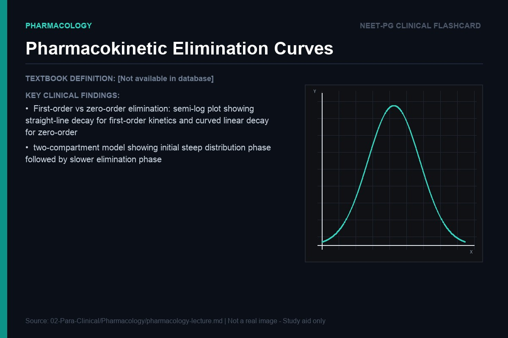
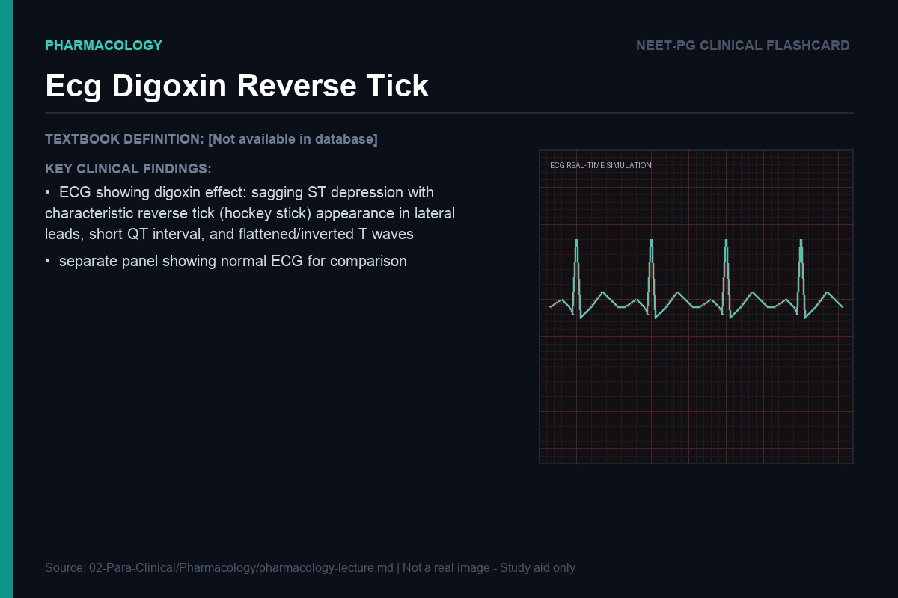
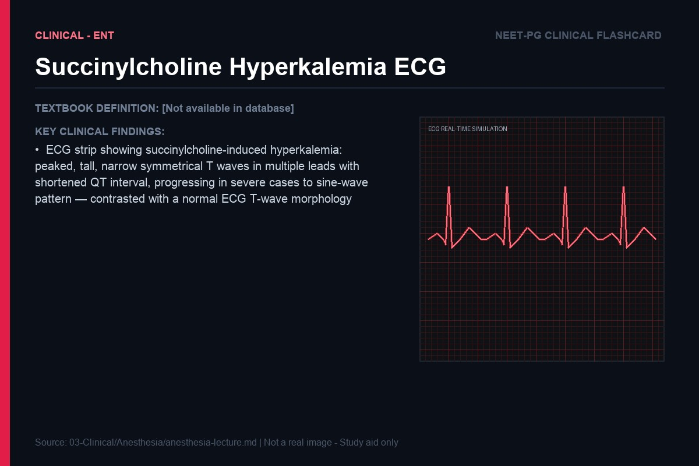

> **Diagram note:** Mermaid mindmap — renders in VS Code (Markdown Preview), Obsidian, or GitHub with the Mermaid extension. Plain-text overview below.

```mermaid
graph TD
    A["💊 PHARMACOLOGY — NEET PG<br/>8 Major Drug Classes"]

    A --> B["Autonomic Pharmacology"]
    A --> C["CVS Drugs"]
    A --> D["CNS Drugs"]
    A --> E["Antimicrobials"]
    A --> F["Endocrine Drugs"]
    A --> G["Pharmacokinetics"]
    A --> H["Chemotherapy & Special"]

    B --> B1["Cholinergic<br/>Ach / Atropine / Organophosphates"]
    B --> B2["Adrenergic<br/>Adrenaline / Beta-blockers / Alpha-blockers"]
    B --> B3["Neuromuscular Blockers<br/>Succinylcholine / Vecuronium / Reversal"]

    C --> C1["Antiarrhythmics<br/>Class IA-IV / Digoxin / Adenosine"]
    C --> C2["Antihypertensives<br/>ACEi / ARB / CCB / Diuretics"]
    C --> C3["Anticoagulants<br/>Heparin→Protamine / Warfarin→VitK/FFP"]

    D --> D1["Antipsychotics<br/>Typical (D2) / Atypical / Clozapine"]
    D --> D2["Antidepressants<br/>SSRIs / TCAs / MAOIs / SNRIs"]
    D --> D3["Antiepileptics<br/>Valproate / Phenytoin / Carbamazepine"]

    E --> E1["Beta-Lactams<br/>Penicillin / Cephalosporins / Carbapenems"]
    E --> E2["Aminoglycosides<br/>Gentamicin / Ototoxicity / Nephrotoxicity"]
    E --> E3["Antitubercular<br/>HRZE / Drug-specific toxicities"]

    F --> F1["Insulin Types<br/>Rapid / Short / Intermediate / Long"]
    F --> F2["Oral Hypoglycemics<br/>Metformin / Sulfonylureas / SGLT2i"]
    F --> F3["Thyroid Drugs<br/>Carbimazole / PTU / Levothyroxine"]

    G --> G1["PK Concepts<br/>Vd / t½ / Bioavailability / CYP450"]
    G --> G2["Drug Interactions<br/>Enzyme inducers vs inhibitors"]
    G --> G3["Teratogenic Drugs<br/>Thalidomide / Valproate / Isotretinoin"]

    H --> H1["Antineoplastics<br/>Alkylating / Antimetabolites / Targeted"]
    H --> H2["NSAIDs & Steroids<br/>COX-1/2 / Dexamethasone / Prednisolone"]
    H --> H3["Drugs of Choice<br/>DOC table for key conditions"]
```



**Subject Overview (plain text):**
- Autonomic Pharmacology: Cholinergic (ACh/Atropine/Organophosphates), Adrenergic (Adrenaline/Beta-blockers/Alpha-blockers), Neuromuscular Blockers
- CVS Drugs: Antiarrhythmics (Class IA-IV/Digoxin/Adenosine), Antihypertensives (ACEi/ARB/CCB/Diuretics), Anticoagulants (Heparin/Warfarin)
- CNS Drugs: Antipsychotics (Typical D2/Atypical/Clozapine), Antidepressants (SSRIs/TCAs/MAOIs/SNRIs), Antiepileptics
- Antimicrobials: Beta-Lactams (Penicillin/Cephalosporins/Carbapenems), Aminoglycosides (ototoxicity/nephrotoxicity), Antitubercular (HRZE)
- Endocrine Drugs: Insulin types (Rapid/Short/Intermediate/Long), Oral Hypoglycemics (Metformin/Sulfonylureas/SGLT2i), Thyroid drugs
- Pharmacokinetics: PK Concepts (Vd/t½/Bioavailability/CYP450), Drug Interactions (enzyme inducers/inhibitors), Teratogenic drugs
- Chemotherapy & Special: Antineoplastics (Alkylating/Antimetabolites/Targeted), NSAIDs & Steroids (COX-1/2), Drugs of Choice

> **Split Notes:** [Pharmacokinetics](pharma-pharmacokinetics.md) | [Autonomic](pharma-autonomic.md) | [CVS](pharma-cvs.md) | [CNS](pharma-cns.md) | [Antimicrobials](pharma-antimicrobials.md) | [Endocrine](pharma-endocrine.md) | [Anticancer](pharma-anticancer.md) | [Side Effects](pharma-side-effects.md) | [MCQs](pharmacology-mcqs.md) | [Notes Index](pharmacology-notes.md)

# Pharmacology: Lecture Notes for NEET PG

> "A drug without a mechanism is just a name. A drug with a mechanism is a tool — and a tool you understand is a tool you can use wisely, predict correctly, and never forget."

---

## Pharmacokinetics

### From the Pill to the Receptor: The Journey of a Drug

Every time you swallow a tablet, you are initiating one of the most complex logistical operations in biology. The drug must survive the acidic stomach, be absorbed across the intestinal epithelium, avoid immediate destruction by the liver, travel through the bloodstream, cross whatever barriers separate blood from its target tissue, bind to a specific receptor among thousands of other molecules competing for its attention, produce its effect, and then be eliminated safely. Each of these steps is governed by principles that, once understood, allow you to predict drug behavior from first principles rather than memorizing isolated facts.

**Bioavailability** is the fraction of an administered dose that reaches the systemic circulation in active form. For an intravenously administered drug, bioavailability is 100% by definition — the drug goes directly into the bloodstream. For an orally administered drug, bioavailability is always less than 100%, and often dramatically so, because of two sequential barriers: absorption across the gut wall (affected by solubility, molecular size, and transporter expression) and the **first-pass effect**.

The first-pass effect is the liver's preemptive strike against orally absorbed drugs. The hepatic portal vein carries blood from the intestine directly to the liver before it reaches the systemic circulation. The liver, which contains the highest concentration of CYP450 enzymes in the body, metabolizes a significant fraction of many drugs before they ever reach their target organ. Drugs with high hepatic extraction ratios (morphine, propranolol, nitroglycerin, lidocaine) undergo extensive first-pass metabolism — oral bioavailability may be only 10-30%. This is why nitroglycerin is given sublingually (absorbed via the sublingual veins directly into the systemic circulation, bypassing the portal system), and why oral morphine doses must be 3-6 times higher than IV doses to achieve the same plasma concentration.

**Analogy:** The first-pass effect is like a customs checkpoint at the border. Every oral drug must pass through the liver's customs before entering the body — and the liver confiscates a fraction of what it sees. Sublingual, transdermal, and IV routes smuggle the drug through a different border crossing that bypasses customs entirely.

### Volume of Distribution: Where Did the Drug Go?

Volume of distribution (Vd) is one of the most conceptually important — and most misunderstood — pharmacokinetic parameters. It does not represent a real anatomical volume. It is the hypothetical volume of fluid in which the total amount of drug in the body would need to be dissolved to produce the observed plasma concentration.

The formula is simple: Vd = Total amount of drug in body / Plasma concentration. But the implications are profound. If a drug has a high Vd (say, hundreds of liters), it means the plasma concentration is very low relative to the total drug in the body — which can only happen if the drug is extensively distributed into tissues, where it is not being measured. Drugs with high Vd are sequestered in peripheral compartments: fatty tissues, muscles, or bound to intracellular proteins.

**Digoxin** is the classic high-Vd drug, with a Vd of approximately 7 L/kg (that's about 490 liters for a 70 kg person — far exceeding the total body water of 42 liters). This happens because digoxin binds avidly to Na/K ATPase in myocardial and skeletal muscle cells, and is concentrated in these tissues. The practical consequence: because so little digoxin is in the blood at any given time, dialysis is almost useless for treating digoxin toxicity. You would have to dialyze the patient hundreds of times to remove a significant fraction of the total body digoxin. Treatment instead requires digoxin-specific antibody fragments (Fab fragments) that enter tissues, bind digoxin, and pull it back into the bloodstream for renal elimination.

**Warfarin**, by contrast, has a very low Vd (approximately 0.14 L/kg) because it is almost entirely protein-bound in plasma (>99% bound to albumin). Protein-bound drug cannot cross membranes or be filtered at the kidney — only free drug is pharmacologically active and can be eliminated. This protein binding creates an important drug interaction: any drug that displaces warfarin from albumin (like aspirin at high doses) will transiently increase free warfarin concentrations and potentiate anticoagulation.

### Half-Life, Steady State, and the Logic of Dosing Intervals

Half-life (t½) is the time for the plasma concentration of a drug to fall by 50%. For most drugs, this follows first-order kinetics — a constant fraction (not a constant amount) of the drug is eliminated per unit time. This means the drug concentration follows an exponential decay: 100% → 50% → 25% → 12.5% → 6.25%... It takes exactly 4-5 half-lives to eliminate approximately 97% of a drug from the body.


> **IBQ tip:** In first-order kinetics the log-concentration vs time plot is a straight line (constant half-life); in zero-order kinetics the raw concentration vs time plot is a straight line (constant amount eliminated per hour, e.g., alcohol, phenytoin at toxic doses). If a question shows a curved semi-log plot that eventually becomes linear, identify the two-compartment model: the early steep slope is the distribution (alpha) phase; the later shallow slope is the elimination (beta) phase.

The same mathematics governs drug accumulation. When a drug is given at regular intervals, each dose adds to the residual of previous doses. The drug accumulates until the rate of elimination equals the rate of administration — this equilibrium is called **steady state**, and it is reached after 4-5 half-lives of dosing. This has critical clinical implications. A drug with a t½ of 24 hours (like amlodipine) takes 4-5 days to reach steady state — so you cannot judge the full effect of a dose change until that time has elapsed. A drug with a t½ of 36 hours (like digoxin) takes 7-8 days to reach steady state.

When you need immediate therapeutic effect AND cannot wait for steady state, you give a **loading dose** — a large initial dose that immediately fills the volume of distribution and achieves therapeutic concentrations. Maintenance doses then sustain steady state. This is why amiodarone (t½ of weeks to months) requires aggressive loading (IV bolus followed by infusion), and why digoxin loading doses are given before starting maintenance therapy.

> **Key exam fact:** Drugs excreted unchanged by the kidney (aminoglycosides, lithium, vancomycin) have their half-lives dramatically prolonged in renal failure. The dose must be reduced or the interval extended. Drugs eliminated by the liver (most lipid-soluble drugs after hepatic metabolism) require dose adjustment in severe liver disease.

### Enzyme Induction and Inhibition: The Metabolism Battlefield

The CYP450 enzyme system in the liver is the primary site of drug metabolism, and it is the source of the most clinically important drug interactions in medicine. Understanding the two key phenomena — induction and inhibition — makes these interactions predictable rather than arbitrary.

**Enzyme induction** means an increase in the amount of CYP450 enzyme produced. This takes days to weeks (new protein must be synthesized). The result: drugs metabolized by the induced enzyme are eliminated faster → lower plasma concentrations → reduced efficacy. The classic inducer is **rifampicin**, which induces multiple CYP450 enzymes (CYP3A4, CYP2C9, CYP2C19). Rifampicin dramatically reduces the plasma concentrations of warfarin, oral contraceptives (leading to contraceptive failure — an important counseling point), cyclosporine, protease inhibitors, and many other drugs. Patients on warfarin starting rifampicin therapy will need significantly higher warfarin doses; when rifampicin is stopped, the warfarin dose must be reduced to avoid supratherapeutic anticoagulation.

Other important inducers: carbamazepine, phenytoin, phenobarbitone, griseofulvin, St. John's Wort (hypericum — an herbal supplement), and chronic alcohol use. The mnemonic is **PCR BAGS**: Phenytoin, Carbamazepine, Rifampicin, Barbiturates, Alcohol (chronic), Griseofulvin, St John's Wort.

**Enzyme inhibition** is faster — it takes effect as quickly as inhibitor concentrations build up (hours to days). The inhibitor competes with other drugs for the active site of CYP450, slowing their metabolism → higher plasma concentrations → increased effect and toxicity. The classic inhibitor is **ketoconazole** (and azole antifungals generally), which inhibits CYP3A4. Giving ketoconazole to a patient on ciclosporin can cause ciclosporin toxicity (nephrotoxicity, neurotoxicity) because ciclosporin accumulates. Erythromycin and clarithromycin inhibit CYP3A4 and can cause dangerous accumulation of statins (rhabdomyolysis risk) or carbamazepine. Ciprofloxacin inhibits CYP1A2, causing theophylline toxicity. Fluoxetine inhibits CYP2D6, causing TCA toxicity.


*Caption: Enzyme induction shortens the half-life of affected drugs by increasing the slope of the first-order elimination line on the semi-log plot — the concentration falls faster over the same time interval. Enzyme inhibition does the opposite: shallower slope, longer effective half-life, drug accumulation. Phenytoin at toxic doses transitions from first-order to zero-order kinetics (saturation of CYP2C9) — a straight linear decline at the same rate regardless of concentration, explaining why small dose increments cause disproportionate toxicity.*

---

## Autonomic Pharmacology

### The Autonomic Nervous System: Two Opposing Empires

The autonomic nervous system governs all involuntary physiological functions — and it does so through two anatomically and functionally distinct divisions that push against each other in a constant tug-of-war. The **sympathetic** nervous system (SNS) is the fight-or-flight system: evolved to prepare the organism for vigorous physical activity or escape from danger. The **parasympathetic** nervous system (PNS) is the rest-and-digest system: governing the quiet, vegetative functions of feeding, digestion, and reproduction.

Once you understand the physiological logic of each system, the entire pharmacology of autonomic drugs becomes predictable. Drugs that mimic or enhance one system will produce the physiological effects of that system. Drugs that block one system will unmask the opposing system. You never need to memorize lists — you deduce from first principles.

The key neurotransmitters: the SNS uses **norepinephrine** (at the effector organ) and **epinephrine** (from the adrenal medulla) acting on adrenergic receptors. The PNS uses **acetylcholine** acting on muscarinic receptors at effector organs. Both systems use acetylcholine and nicotinic receptors at the ganglia — this is why ganglionic blockers affect both divisions equally.

### Cholinergic Pharmacology: SLUDGE and its Logic

Muscarinic receptors are G-protein coupled receptors for acetylcholine that mediate parasympathetic effects at effector organs. There are five subtypes (M1-M5), but for clinical pharmacology, M1, M2, and M3 are what matter.

**M1 receptors** are found in the brain and on gastric parietal cells. In parietal cells, M1 stimulation promotes gastric acid secretion — which is why pirenzepine (a selective M1 antagonist) was used to treat peptic ulcer disease.

**M2 receptors** are found in the heart (SA node, AV node, atrial myocardium). Parasympathetic activation via M2 slows the heart rate (negative chronotropy) and reduces AV conduction velocity (negative dromotropy). The vagus nerve exerts a continuous "vagal tone" on the heart through M2 receptors — this is why the resting heart rate is 60-80 bpm rather than the intrinsic rate of the SA node (~100 bpm).

**M3 receptors** are found in smooth muscle (bronchi, gut, bladder detrusor, blood vessel walls) and exocrine glands (salivary, lacrimal, sweat glands). M3 activation contracts smooth muscle (bronchoconstriction, increased gut motility, bladder contraction) and stimulates glandular secretion.

The mnemonic **SLUDGE** captures muscarinic agonist effects: **S**alivation, **L**acrimation, **U**rination (incontinence), **D**efecation, **G**I motility, **E**mesis. Add bradycardia and bronchoconstriction to complete the picture. This describes the clinical picture of organophosphate poisoning (insecticides and nerve agents inhibit acetylcholinesterase → acetylcholine accumulates at all cholinergic synapses → massive muscarinic activation). The antidote is atropine (muscarinic blocker) plus pralidoxime (regenerates acetylcholinesterase before "aging" occurs).


*Caption: Organophosphate poisoning causes a cholinergic crisis — but the ECG changes to monitor include bradycardia (excess vagal M2 stimulation) and QT prolongation from the cholinergic-mediated electrolyte shifts. More broadly, hyperkalaemia ECG changes (peaked T waves → wide QRS → sine wave) are essential for any drug causing potassium release — including succinylcholine in at-risk patients (burns, denervation) and ACE inhibitor-induced hyperkalaemia. Identify the serial progression in these panels.*

### Atropine: Blocking All Muscarinic Receptors

Atropine is the prototypical muscarinic antagonist — it blocks all five muscarinic receptor subtypes without selectivity. Understanding its effects means asking: "What does parasympathetic tone normally do to each organ, and what happens when you remove it?"

**Heart (M2 block):** Removes vagal tone → tachycardia. Atropine is the first-line treatment for symptomatic bradycardia.

**Eye (M3 block):** The sphincter pupillae (which constricts the pupil) and the ciliary muscle (which contracts for near vision/accommodation) are both M3-mediated. Atropine blocks both → mydriasis (dilated pupil) and cycloplegia (loss of accommodation, causing blurred near vision). This is why atropine eye drops are used in fundoscopy (mydriasis for visualization) and in children with strabismus (cycloplegia as part of treatment).

**Salivary glands, sweat glands (M3 block):** Blockade → dry mouth and anhidrosis (inability to sweat). Anhidrosis can cause hyperthermia — particularly dangerous in hot environments. "Hot as a hare" in the classic anticholinergic toxidrome.

**Bladder (M3 block):** The detrusor muscle is M3-mediated. Atropine → detrusor relaxation → urinary retention. This is why atropine and other anticholinergic drugs are contraindicated in patients with benign prostatic hyperplasia (BPH), where urinary outflow is already compromised.

**Gut (M3 block):** Reduced gut motility → constipation.

The toxidrome of anticholinergic excess: "Blind as a bat (mydriasis), Mad as a hatter (CNS effects — delirium, agitation), Red as a beet (cutaneous vasodilation from unopposed sympathetic tone), Hot as a hare (hyperthermia), Dry as a bone (anhidrosis, dry mouth), Full as a flask (urinary retention), Fast as a fiddle (tachycardia)." Treatment is physostigmine (a cholinesterase inhibitor that crosses the blood-brain barrier).

### Adrenergic Receptors and the Fight-or-Flight Logic

The adrenergic receptors are classified into alpha (α1 and α2) and beta (β1, β2, and β3) subtypes, and their locations follow the logical demands of the fight-or-flight response.

**Alpha-1 receptors** mediate sympathetic vasoconstriction. They are found in blood vessels of the skin, gut, and kidneys — peripheral vascular beds that should be constricted during fight-or-flight (blood is shunted away from the gut and skin, toward the muscles and heart). Alpha-1 stimulation also contracts the smooth muscle of the urethra and prostate (explaining why alpha-1 blockers like tamsulosin relieve BPH symptoms by relaxing urethral smooth muscle).

**Beta-1 receptors** are predominantly in the heart. Stimulation increases heart rate (positive chronotropy), contractility (positive inotropy), and conduction velocity through the AV node. During fight-or-flight, you need more cardiac output — more blood pumped per minute to the muscles. Beta-1 stimulation delivers this.

**Beta-2 receptors** are found in bronchial smooth muscle (dilation → open the airways for maximum oxygen delivery), skeletal muscle vasculature (dilation → perfuse the muscles you're using), uterus (relaxation — not a priority during fighting), and liver (glycogenolysis → release glucose for fuel).

**Analogy:** Think of alpha-1 as "redirect the blood" and beta-1 as "power up the engine" and beta-2 as "open the airways and perfuse the muscles." All three serve the fight-or-flight response with perfect logic.


> **IBQ tip:** Identify which receptor subtype is labeled by its anatomical location and the physiological effect shown — beta-1 is always cardiac (rate and force), beta-2 is always bronchial/vascular/uterine dilation. The closest look-alike confusion is beta-1 vs beta-2: remember beta-1 = 1 heart, beta-2 = 2 lungs (and skeletal muscle vasculature).

**Epinephrine** stimulates all adrenergic receptors — α1, α2, β1, β2. The net effect at low doses is beta-dominated (β2 vasodilation in skeletal muscle and β1 cardiac stimulation), but at high doses alpha effects predominate (vasoconstriction). This is why the dose-response curve of epinephrine on blood pressure is complex: low-dose epinephrine can actually lower mean arterial pressure (because β2 vasodilation in the large skeletal muscle vascular bed overcomes the β1-mediated increase in cardiac output). This phenomenon — called the "epinephrine reversal" phenomenon — was historically demonstrated by giving alpha blockers before epinephrine: removing alpha vasoconstriction unmasks the beta-2 vasodilation and produces a fall in BP.

> **Key exam fact:** The sequence of adrenergic agonists by receptor selectivity: Norepinephrine (α1 > α2 > β1, negligible β2) → Epinephrine (α1 = α2 = β1 = β2) → Isoprenaline (β1 = β2, negligible α). Phenylephrine is a pure α1 agonist. Salbutamol is a relatively selective β2 agonist. Dobutamine is a relatively selective β1 agonist.

---

## Cardiovascular Drugs

### ACE Inhibitors: Blocking the Renin-Angiotensin Axis

To understand ACE inhibitors, you must first understand why angiotensin II exists and what it does. The renin-angiotensin-aldosterone system (RAAS) evolved as a blood pressure defense mechanism against volume depletion (hemorrhage, dehydration). When renal perfusion pressure falls, juxtaglomerular cells release renin, which cleaves angiotensinogen to angiotensin I. ACE (angiotensin-converting enzyme) — found abundantly on pulmonary vascular endothelium — converts angiotensin I to angiotensin II. Angiotensin II does three things: (1) directly constricts arterioles (raising blood pressure), (2) stimulates aldosterone secretion from the adrenal cortex (aldosterone → sodium and water retention → increased blood volume → increased blood pressure), and (3) stimulates ADH release (additional water retention). In hypertension, this system is inappropriately activated, maintaining elevated blood pressure when none is needed.

ACE inhibitors (enalapril, ramipril, lisinopril, perindopril) block ACE → angiotensin II is not produced → vasodilation (reduction in afterload) → reduced aldosterone (natriuresis → reduced preload and blood volume) → lower blood pressure. This makes them first-line drugs in hypertension, especially in patients with diabetes mellitus (they have the additional benefit of reducing intraglomerular pressure by dilating the efferent arteriole, slowing the progression of diabetic nephropathy), heart failure (reduce both preload and afterload, allow cardiac remodeling), and post-MI (reduce LV remodeling and prevent the development of heart failure).

But ACE does not only convert angiotensin I to angiotensin II. ACE is also kininase II — the enzyme that degrades bradykinin. When ACE is inhibited, bradykinin accumulates. Bradykinin is a potent vasodilator (contributes to the antihypertensive effect) but also stimulates airway C-fibers in the bronchial mucosa, producing a persistent dry cough — the most common side effect of ACE inhibitors, occurring in 10-20% of patients (more commonly in South Asian patients). The cough is not dose-dependent and does not resolve with continued use; the patient must switch to an ARB (angiotensin receptor blocker). Bradykinin accumulation also rarely causes angioedema — swelling of the lips, tongue, and larynx that can be life-threatening. This occurs more commonly in African-American patients and may appear months to years after starting the drug.

> **Key exam fact:** ACE inhibitors are **contraindicated** in: bilateral renal artery stenosis (ACE inhibitors reduce efferent arteriolar tone → fall in GFR → acute renal failure in the setting of bilateral RAS), pregnancy (fetotoxic — cause renal tubular dysgenesis, oligohydramnios, limb contractures — the ACE inhibitor fetopathy), and history of ACE inhibitor-induced angioedema.

### Beta-Blockers: Counterintuitive Cardioprotection

Beta-blockers are negative inotropes and negative chronotropes — they reduce heart rate and contractility. In acute heart failure, giving a drug that further reduces cardiac output seems dangerous. And acutely, it is — you never start a beta-blocker in an acutely decompensated patient. So why are beta-blockers among the most life-saving drugs in chronic heart failure?

The answer lies in understanding the neurohormonal pathophysiology of heart failure. When cardiac output falls (from any cause), the body activates two major compensatory systems: the sympathetic nervous system (increases heart rate and contractility, constricts vessels to maintain blood pressure) and the RAAS (retains sodium and water to increase preload). These adaptations help in the short term. But chronically, sympathetic overstimulation is profoundly toxic to the myocardium: norepinephrine is directly cardiotoxic (promotes cardiomyocyte apoptosis), causes hypertrophic remodeling (adds bulk without improving function), promotes arrhythmias, and leads to beta-receptor downregulation (the heart becomes less responsive to its own stimulation). The heart enters a vicious cycle of sympathetic overdrive → toxicity → further dysfunction → more sympathetic overdrive.

Beta-blockers interrupt this cycle. Chronically blocking beta-1 receptors in the heart allows the myocardium to recover: receptor density increases (upregulation), cardiomyocyte apoptosis decreases, pathological hypertrophy reverses, and arrhythmias decrease. The seminal trials (MERIT-HF with metoprolol, CIBIS-II with bisoprolol, COPERNICUS with carvedilol) demonstrated that these three beta-blockers reduce mortality in heart failure by approximately 34%. Notably, not all beta-blockers are equal in heart failure — only these three have proven mortality benefit. Carvedilol is unique in that it also blocks alpha-1 receptors (additional vasodilation) and has antioxidant properties.


*Caption: Beta-blockers in heart failure improve the Frank-Starling curve — over weeks of therapy, the failing curve (lower, right-shifted) moves upward toward normal as neurohormonal remodelling reverses. This is the graphical explanation for why beta-blockers are started at a low dose and uptitrated slowly: acutely they suppress contractility (shifting curve downward temporarily), but chronically they restore it. Contrast with ACE inhibitors, which primarily reduce afterload (shifting the operating point along the same curve, increasing output at the same preload).*

### Anticoagulants: Heparin and Warfarin from First Principles

The coagulation cascade exists to generate thrombin, which converts fibrinogen to fibrin — the structural scaffold of a clot. Both heparin and warfarin inhibit coagulation, but through completely different mechanisms that determine their clinical properties, their onsets of action, and their reversal strategies.


> **IBQ tip:** The exam image will show the cascade as a branching diagram — identify heparin's action at the bottom (common pathway, thrombin/Xa) vs warfarin's upstream effect on the vitamin K-dependent factors (II, VII, IX, X). Key differentiator: heparin prolongs aPTT (intrinsic pathway monitored); warfarin prolongs PT/INR (extrinsic pathway, Factor VII has the shortest half-life so it falls first).

> **ASCII diagram:**
> ```
> INTRINSIC                      EXTRINSIC
> XII→XI→[IX,VIII] ──┐          [VII] ← WARFARIN blocks (Vit K dep.)
>                    ↓                ↓
>                   [X] ←────────────┘  ← WARFARIN blocks (II,VII,IX,X)
>                    ↓
>          HEPARIN→ antithrombin III → inhibits [IIa] + [Xa]
>                    ↓
>               [II] → IIa (thrombin)          ← WARFARIN blocks Factor II
>                    ↓
>               Fibrinogen → Fibrin
>
> WARFARIN: blocks synthesis of II,VII,IX,X (Vit K-dependent) → PT/INR ↑
> HEPARIN:  activates antithrombin → neutralizes IIa + Xa immediately → aPTT ↑
> Reversal: Warfarin → Vit K / PCC;  Heparin → Protamine sulfate
> ```

**Heparin** works by activating antithrombin III (AT-III), an endogenous serine protease inhibitor that normally inactivates thrombin (Factor IIa) and Factor Xa (and to a lesser extent, Factors IXa, XIa, XIIa). AT-III works slowly on its own. Heparin is like a catalyst that magnifies AT-III's activity a thousandfold by inducing a conformational change in AT-III that dramatically increases its affinity for its targets. Since heparin works by activating an already-existing protein, its effect is immediate — anticoagulation begins within minutes of IV administration. Heparin is given IV or subcutaneously (it does not cross the gut wall — too large and anionic). It is monitored by the aPTT (target 1.5-2.5x normal). Reversal is with protamine sulfate (positively charged; binds and neutralizes heparin, which is negatively charged).

**Low molecular weight heparins (LMWHs** — enoxaparin, dalteparin) are fragments of unfractionated heparin (UFH) that predominantly inhibit Factor Xa with less antithrombin effect. They have more predictable pharmacokinetics (longer half-life, subcutaneous administration, less protein binding) and do not require aPTT monitoring. Their activity is monitored by anti-Xa levels if needed (in renal failure, pregnancy, obesity).

**Warfarin** works by a completely different mechanism: it inhibits Vitamin K epoxide reductase, the enzyme that recycles oxidized Vitamin K back to its reduced (active) form. Vitamin K in its active form is the cofactor required for the gamma-carboxylation of the vitamin K-dependent coagulation factors — Factors II (prothrombin), VII, IX, and X, and the anticoagulant Proteins C and S. Without functional Vitamin K, these factors are synthesized but are inactive (they can't bind calcium, which is required for their activity at phospholipid surfaces).

**Analogy:** Warfarin does not destroy the clotting factors — it removes the manufacturing equipment for new ones. The old ones already in circulation continue working until they die naturally. This is why warfarin takes 3-5 days to achieve full anticoagulant effect — you must wait for the existing vitamin K-dependent factors to be consumed. Factor VII has the shortest half-life (6 hours), which is why the PT/INR prolongs first (Factor VII is measured predominantly in the PT assay). But this also means the PT/INR may suggest anticoagulation before the patient is truly anticoagulated (Factor II, with its 60-hour half-life, may still be at near-normal levels). This is why heparin bridges warfarin initiation in high-risk patients.

> **Key exam fact:** When starting warfarin for DVT/PE, overlap with heparin for at least 5 days AND until the INR is therapeutic (>2.0) for 2 consecutive days. Protein C has the shortest half-life among vitamin K-dependent proteins — Protein C drops before the clotting factors do, creating a transient prothrombotic state at warfarin initiation (warfarin-induced skin necrosis in Protein C/S deficient patients).


*Caption: The full coagulation cascade anchors the two-drug comparison. Key exam point: heparin works immediately (activates existing antithrombin); warfarin has a 3–5 day onset because it only prevents new factor synthesis — existing factors must be consumed. Factor VII falls first (t½ 6 h), explaining early PT/INR rise; Factor II falls last (t½ 60 h), explaining the need for overlap. The cascade also shows why Factor Xa inhibitors (rivaroxaban, apixaban) are the new oral anticoagulants — they block the final convergence point.*

---

## Antimicrobials

### Antibiotic Mechanisms: The Logic of Killing Bacteria

Understanding antibiotic mechanisms is not just academic — it is the foundation for understanding drug selection, drug combinations, resistance mechanisms, and toxicity. Each class attacks a specific vulnerability of bacterial biology that either does not exist in humans or is sufficiently different to allow selective toxicity.

### Beta-Lactams: Sabotaging the Cell Wall Factory

Bacteria maintain structural integrity through a cell wall made of peptidoglycan — a cross-linked lattice of glycan chains bridged by peptide bonds. The cross-linking is performed by penicillin-binding proteins (PBPs), which are transpeptidase enzymes. Beta-lactam antibiotics (penicillins, cephalosporins, carbapenems, monobactams) share a four-membered beta-lactam ring that structurally mimics the D-Ala-D-Ala terminus of the peptidoglycan precursor. PBPs bind the antibiotic instead of their normal substrate — and are irreversibly inactivated. Without cross-linking, the cell wall weakens; osmotic forces drive water into the bacterium; it swells and lyses. Beta-lactams are bactericidal.


> **IBQ tip:** All beta-lactams share the 4-membered beta-lactam ring — identify it as the square ring in the structural diagram. The key structural difference between classes is the ring fused to it: penicillin has a 5-membered ring with sulfur (thiazolidine); cephalosporins have a 6-membered ring (dihydrothiazine); carbapenems replace the sulfur with carbon in the 5-membered ring. Monobactams (aztreonam) have no fused ring at all.

Resistance to beta-lactams occurs primarily through **beta-lactamase** enzymes — bacterial enzymes that cleave the beta-lactam ring and inactivate the antibiotic before it can reach the PBP. The clinical solution is to co-administer a **beta-lactamase inhibitor** (clavulanate, sulbactam, tazobactam) that irreversibly inhibits the beta-lactamase, protecting the antibiotic. Amoxicillin-clavulanate (co-amoxiclav), piperacillin-tazobactam, and ampicillin-sulbactam are clinically important examples.

The second major resistance mechanism is **altered PBPs** — the bacteria produce PBPs with low affinity for beta-lactams. This is the mechanism in MRSA (methicillin-resistant Staphylococcus aureus), which acquires the mecA gene encoding PBP2a — a PBP with negligible affinity for all beta-lactams. Beta-lactamase inhibitors are irrelevant here because the problem is the target, not the drug being destroyed. Treatment for MRSA requires non-beta-lactam agents: vancomycin, linezolid, daptomycin.

> **Key exam fact:** Carbapenems (imipenem, meropenem, ertapenem) have the broadest beta-lactam spectrum and are stable to most beta-lactamases — but not to carbapenemases (KPC, NDM-1, OXA-48), which are the basis for carbapenem-resistant Enterobacteriaceae (CRE). These "superbugs" represent a major public health threat because they are resistant to virtually all available antibiotics.


*Caption: Penicillin allergy is the most clinically important drug allergy — ~10% of patients report it, but true IgE-mediated (Type I) allergy with anaphylaxis risk is present in <1%. The beta-lactam ring opening generates haptens (penicilloyl determinants) that bind carrier proteins and trigger this pathway. Cross-reactivity between penicillins and cephalosporins is ~1–2% (due to shared side-chains, not the ring itself). For NEET PG: recognise the Type I pathway and link it to drug allergy testing and the decision to use alternative antibiotics vs desensitisation.*

### Aminoglycosides: 30S Ribosome, Irreversible Binding

Aminoglycosides (gentamicin, amikacin, tobramycin, streptomycin) target the 30S ribosomal subunit — specifically, they bind to the 16S rRNA at the decoding site, where the mRNA codon is read against the aminoacyl-tRNA anticodon. When aminoglycosides are bound, the ribosome makes translation errors — it misreads the mRNA codon and incorporates the wrong amino acid. This produces nonfunctional or toxic proteins that disrupt bacterial membranes, which paradoxically allows more aminoglycoside to enter the bacterium. This self-amplifying entry is why aminoglycosides require oxygen for uptake (energy-dependent process) — they are ineffective against obligate anaerobes.

The toxicity of aminoglycosides reflects their tissue concentration profile. They are filtered at the glomerulus and accumulate in the renal proximal tubular cells (where they are reabsorbed from the tubular lumen and accumulate intracellularly). The high concentrations damage the tubular cells → aminoglycoside nephrotoxicity (typically acute tubular necrosis). Similarly, they are concentrated in the endolymph of the cochlea → ototoxicity (both cochlear, causing sensorineural hearing loss, and vestibular, causing vertigo and balance disturbance). The risk factors for toxicity are prolonged use, high trough concentrations, pre-existing renal impairment, and concurrent use of other nephrotoxins (NSAIDs, vancomycin, cisplatin).

**Analogy:** Aminoglycosides are like a guided missile with collateral damage — highly effective against bacteria, but their concentration in specific human tissues (kidney tubules, cochlear hair cells) causes predictable, organ-specific toxicity. Once-daily dosing (taking advantage of the concentration-dependent killing and post-antibiotic effect of aminoglycosides) minimizes nephrotoxicity while maintaining efficacy.


*Caption: Aminoglycosides are used in combination against gram-positive pathogens (including S. aureus endocarditis — gentamicin + beta-lactam synergy) and are the backbone against gram-negative sepsis. Gram stain identification is the first step in targeted antimicrobial selection. Gram-positive cocci in clusters = Staphylococci (not Streptococci, which are in chains or pairs). This visual is the most tested microbiology image in NEET PG and should be immediately recognisable.*

### Fluoroquinolones: Paralyzing DNA Replication

Fluoroquinolones (ciprofloxacin, levofloxacin, moxifloxacin, norfloxacin) inhibit two bacterial type II topoisomerases: **DNA gyrase** (topoisomerase II, the primary target in gram-negative bacteria) and **topoisomerase IV** (the primary target in gram-positive bacteria). These enzymes are essential for managing the supercoiling that occurs ahead of the replication fork — as the two strands of DNA are unwound for copying, the DNA ahead becomes overwound (positive supercoil). Gyrase relieves this by introducing transient double-strand breaks, passing DNA through, and resealing. Fluoroquinolones bind the gyrase-DNA complex and stabilize it in the broken state — the DNA cannot be resealed, and the trapped cleavage complex is highly toxic to the bacterium. Fluoroquinolones are bactericidal.

There are two critical contraindications based on tissue distribution. First, fluoroquinolones have a strong affinity for **cartilage** — they chelate magnesium ions within the extracellular matrix of cartilage and accumulate there, causing arthropathy in growing cartilage. This makes them **contraindicated in children and in pregnancy** (though ciprofloxacin is used in selected cases where the risk-benefit ratio favors treatment). Second, fluoroquinolones lower the seizure threshold (they are GABA-A receptor antagonists) — caution in epilepsy, and they should not be combined with theophylline or NSAIDs (which also lower the seizure threshold).

> **Key exam fact:** Fluoroquinolones have important interactions: (1) They chelate multivalent cations (Ca2+, Mg2+, Al3+, Fe2+) → absorption is dramatically reduced by antacids, calcium supplements, and iron supplements — take 2 hours apart. (2) They inhibit CYP1A2 → theophylline toxicity. (3) They prolong the QT interval — avoid in patients on other QT-prolonging drugs or with hypokalemia.


> **IBQ tip:** QT prolongation is measured from the start of the QRS to the end of the T wave — a corrected QT (QTc) >450 ms in men or >470 ms in women is abnormal. Torsades de pointes is identified by the hallmark twisting of QRS polarity around the baseline (complexes appear to "twist" from positive to negative and back) with a rate of 150-250 bpm; it degenerates to VF if untreated. Distinguishes from monomorphic VT (uniform QRS morphology, no twisting).

### Metronidazole: A Drug That Requires a Living Organism to Activate It

Metronidazole is one of the most fascinating drugs in medicine — it is a prodrug whose activation requires the reductive environment of anaerobic organisms. The nitro group in metronidazole is chemically inert until it is reduced. In anaerobic bacteria and protozoa (but not in human cells), ferredoxin and other electron carriers maintain a low intracellular redox potential and can transfer electrons to the nitro group. The reduced nitro group becomes a highly reactive radical intermediate that causes single- and double-strand DNA breaks, rapidly killing the organism.

Human cells cannot perform this reduction — we maintain a higher intracellular redox potential and lack the appropriate electron carriers. This is the basis for the selective toxicity of metronidazole: it kills anaerobes and protozoa while leaving aerobic bacteria and human cells unharmed.

**Clinical applications:** Metronidazole is first-line for: Clostridioides difficile colitis (oral/nasogastric, though vancomycin/fidaxomicin is now preferred for severe disease), bacterial vaginosis (Gardnerella — an anaerobe), anaerobic infections (Bacteroides fragilis — a major cause of intra-abdominal abscesses, it is uniformly susceptible to metronidazole), Trichomonas vaginalis, Entamoeba histolytica, Giardia lamblia, and Helicobacter pylori (as part of combination therapy).

The interaction with alcohol — the "Antabuse effect" (disulfiram-like reaction) — is caused by metronidazole inhibiting aldehyde dehydrogenase. When alcohol is consumed, acetaldehyde (normally rapidly metabolized by aldehyde dehydrogenase) accumulates → flushing, tachycardia, nausea, vomiting. Patients must be counselled to avoid alcohol during and for 48 hours after metronidazole therapy.

---

## CNS Drugs

### Antidepressants: The Monoamine Hypothesis and Its Pharmacology

Depression is a complex neurobiological disorder, and our pharmacological approach to it rests on the monoamine hypothesis: depression is associated with reduced synaptic concentrations of monoamine neurotransmitters — principally serotonin (5-HT), norepinephrine (NE), and to a lesser extent dopamine (DA) — in key limbic circuits. This hypothesis emerged partly backwards from pharmacology: reserpine (an antihypertensive that depletes monoamine stores) caused depression; imipramine (the first TCA, developed as an antihistamine) was observed to improve mood in hospitalized patients. The monoamine hypothesis provided the post-hoc explanation.

**Selective Serotonin Reuptake Inhibitors (SSRIs)** — fluoxetine, sertraline, paroxetine, citalopram, escitalopram — are the most widely prescribed antidepressants. Their mechanism is simple: they block the serotonin transporter (SERT), preventing the reuptake of serotonin from the synapse back into the presynaptic terminal. Serotonin accumulates in the synapse and has more opportunity to stimulate postsynaptic receptors.

But here lies a fascinating paradox: if the mechanism is so straightforward, why does the antidepressant effect take 2-4 weeks to emerge? Why does SERT blockade not immediately produce mood improvement?

The answer is the **somatodendritic autoreceptor desensitization hypothesis**. In the raphe nuclei (the origin of all serotonergic projections in the brain), serotonergic neurons have autoreceptors — specifically 5-HT1A receptors on the cell body and dendrites (somatodendritic autoreceptors). These autoreceptors sense local serotonin concentration and, when activated, reduce neuronal firing and serotonin release — a negative feedback loop. When you first block SERT, serotonin accumulates at the synapse, but it also accumulates at the cell body in the raphe nucleus. The somatodendritic autoreceptors are activated, the neuron slows down, and less serotonin is released — partially counteracting the SERT blockade.

Over 2-4 weeks of SSRI treatment, these autoreceptors desensitize (downregulate) — they stop responding to the elevated serotonin. Now the brake is removed: serotonergic neurons fire normally, SERT is still blocked, and serotonin accumulates at postsynaptic synapses throughout the brain. The full antidepressant effect emerges. This is why you must warn patients about the 2-4 week delay: it is not that the drug is not working, it is that the full effect requires receptor adaptation.

**Tricyclic Antidepressants (TCAs)** — imipramine, amitriptyline, clomipramine, nortriptyline — were the first effective antidepressants. They block reuptake of both serotonin and norepinephrine (dual reuptake inhibition), which is likely responsible for their antidepressant efficacy. Some TCAs (clomipramine) are more serotonergic; others (nortriptyline, desipramine) are more noradrenergic.

The problem with TCAs is receptor promiscuity. In addition to blocking SERT and NET, TCAs block: **H1 histamine receptors** (causing sedation and weight gain), **muscarinic receptors** (causing the full anticholinergic syndrome: dry mouth, constipation, urinary retention, blurred vision, tachycardia, confusion in the elderly), **alpha-1 adrenergic receptors** (causing orthostatic hypotension — the patient stands up and faints), and **cardiac sodium channels** (causing the most dangerous effect — prolongation of the QRS complex and QT interval, predisposing to ventricular arrhythmias and sudden death in overdose). TCA overdose is a medical emergency: the triad of coma, seizures, and QRS prolongation. Treatment is sodium bicarbonate (alkalinization narrows the QRS by promoting TCA dissociation from sodium channels).


> **IBQ tip:** The key visual distinction is where the drug acts on the synapse diagram — SERT blocker (SSRI) acts on the reuptake transporter at the cleft; TCA acts on the same transporter plus multiple flanking receptors (look for the extra receptor icons indicating H1, muscarinic, and alpha-1 blockade); MAOI acts inside the presynaptic neuron at the enzyme. MAOIs are the only class that increases all three monoamines simultaneously (no transporter selectivity).

> **Key exam fact:** Serotonin syndrome — caused by excessive serotonergic activity (combining SSRIs with MAOIs, tramadol, linezolid, triptans, or St. John's Wort) — presents with the triad of: (1) cognitive changes (confusion, agitation), (2) autonomic instability (hyperthermia, tachycardia, hypertension, diarrhea), and (3) neuromuscular abnormalities (clonus — the pathognomonic sign, hyperreflexia, tremor). Treatment is cyproheptadine (5-HT2A antagonist) and supportive care. Distinguished from neuroleptic malignant syndrome (NMS) by: in SS, clonus and hyperreflexia predominate; in NMS, lead-pipe rigidity predominates.

### Antipsychotics: The Dopamine Hypothesis of Schizophrenia

The positive symptoms of schizophrenia (hallucinations, delusions, disorganized thought) are attributed to **hyperdopaminergic activity in the mesolimbic pathway** — the pathway projecting from the ventral tegmental area (VTA) to the nucleus accumbens and limbic structures. The evidence for this hypothesis is indirect but compelling: all effective antipsychotics block D2 receptors, the degree of D2 blockade correlates with antipsychotic efficacy, and drugs that increase dopamine (amphetamines, L-DOPA in excess) produce psychosis in normal individuals.

The negative symptoms of schizophrenia (flat affect, alogia, avolition, social withdrawal) and cognitive symptoms are attributed, at least partly, to **hypodopaminergic activity in the prefrontal cortex** (mesocortical pathway) — and this is why antipsychotics, by blocking D2 everywhere, often fail to improve and may even worsen negative symptoms.

**Typical (first-generation) antipsychotics** — chlorpromazine, haloperidol, fluphenazine, trifluoperazine — are potent, relatively selective D2 blockers. Their efficacy against positive symptoms is comparable to atypical antipsychotics, but their D2 blockade in the **nigrostriatal pathway** (projecting from the substantia nigra to the striatum — the same pathway depleted in Parkinson's disease) produces **extrapyramidal symptoms (EPS)**:

- **Acute dystonia** (within hours to days): sustained muscle contraction, torticollis, oculogyric crisis — treated with anticholinergics (benztropine, diphenhydramine).
- **Akathisia** (within days to weeks): intense subjective restlessness, inability to remain still — treated with propranolol or benzodiazepines.
- **Parkinsonism** (within weeks): bradykinesia, rigidity, resting tremor — treated with anticholinergics.
- **Tardive dyskinesia (TD)** (months to years): involuntary, repetitive movements (lip smacking, tongue protrusion, chorea) — largely irreversible, caused by D2 receptor upregulation in the striatum from chronic blockade. Treatment is difficult; prevention is critical.

In addition, D2 blockade in the **tuberoinfundibular pathway** (hypothalamus → pituitary) prevents dopamine from inhibiting prolactin release → **hyperprolactinemia** → galactorrhea, amenorrhea, gynecomastia, sexual dysfunction.

**Atypical (second-generation) antipsychotics** — clozapine, risperidone, olanzapine, quetiapine, aripiprazole, ziprasidone — were developed with the goal of maintaining antipsychotic efficacy while reducing EPS. The key to their reduced EPS lies in their 5-HT2A receptor blockade (in addition to D2 blockade). 5-HT2A receptors, when activated, normally inhibit dopamine release in the nigrostriatal pathway. By blocking 5-HT2A, atypical antipsychotics allow more dopamine to be released in the striatum — partially overcoming D2 blockade in that pathway and reducing EPS. The limbic system has relatively fewer 5-HT2A receptors, so antipsychotic efficacy is maintained.

**Analogy:** Imagine D2 blockade as putting your foot on the dopamine brake equally in all pathways. Adding 5-HT2A blockade is like installing a throttle in the nigrostriatal pathway specifically — you push a little more dopamine through there to compensate for the brake, reducing EPS, while keeping the brake fully applied in the mesolimbic pathway for antipsychotic effect.

**Clozapine** deserves special mention. It is the most effective antipsychotic — the only drug shown to be effective in treatment-resistant schizophrenia and in reducing suicidality. It causes minimal EPS (because it has very fast D2 dissociation kinetics — it briefly blocks the receptor and leaves, not giving the receptor time to upregulate). But clozapine causes **agranulocytosis** in approximately 1-2% of patients (mechanism unclear — likely immune-mediated) — a potentially fatal granulocyte depletion. This requires mandatory weekly CBC monitoring for the first 6 months, then fortnightly. Clozapine also causes significant weight gain, metabolic syndrome, hypersalivation (paradoxically — M4 receptor agonism), and lowers the seizure threshold (dose-dependent).

| Drug | D2 block | 5-HT2A | H1 | M | α1 | Key concern |
|------|----------|---------|----|----|-----|------------|
| Haloperidol | +++ | + | + | + | + | High EPS, TD |
| Clozapine | + | +++ | +++ | +++ | +++ | Agranulocytosis, weight gain |
| Olanzapine | ++ | +++ | +++ | ++ | ++ | Metabolic syndrome |
| Quetiapine | + | ++ | ++ | + | ++ | Sedation, low EPS |
| Risperidone | +++ | +++ | ++ | 0 | ++ | EPS (dose-dependent), hyperprolactinemia |
| Aripiprazole | partial D2 | ++ | + | 0 | + | Akathisia, minimal metabolic |


> **IBQ tip:** The digoxin "reverse tick" or "scooped" ST segment is a sagging concave-down ST depression that slopes gently downward from the J-point and scoops upward into an inverted T wave — resembling an upside-down tick mark or a hockey stick on its side. It is a drug effect (not ischemia) and is seen at therapeutic digoxin levels. Distinguish from ischemic ST depression: ischemia produces flat or downsloping ST depression with upright T waves, not the smooth sagging scooped morphology of digoxin.

> **Key exam fact:** **Neuroleptic Malignant Syndrome (NMS)** is a rare but life-threatening complication of antipsychotic use (any dopamine antagonist). The tetrad: (1) **H**yperthermia, (2) **A**utonomy dysfunction (unstable BP, HR), (3) **R**igidity (lead-pipe), (4) **D**ecreased consciousness — HARD. Labs: markedly elevated CK, leukocytosis, elevated LFTs. Treatment: stop the antipsychotic, aggressive cooling, dantrolene (muscle relaxant that reduces rigidity and hyperthermia), bromocriptine/amantadine (dopamine agonists to restore dopaminergic tone). Do not use succinylcholine (risk of fatal hyperkalemia from the rigid muscles).


*Caption: Succinylcholine is the only depolarising neuromuscular blocker in clinical use — it causes initial fasciculations (brief depolarisation of all motor end-plates) followed by sustained flaccid paralysis. The fasciculations cause transient K⁺ efflux from all muscle cells simultaneously, raising serum K⁺ by ~0.5 mEq/L in normal patients (safe). In patients with burns, crush injuries, denervation, prolonged immobility, or NMS, the number of extrasynaptic acetylcholine receptors is massively upregulated — succinylcholine causes catastrophic hyperkalaemia (K⁺ rise of 5–10 mEq/L → VF). The ECG changes shown are the warning that must trigger immediate calcium gluconate.*


*Caption: TOF monitoring distinguishes depolarising from non-depolarising block — the key exam discriminator. Depolarising block (succinylcholine): all four twitches reduced equally, no fade, no post-tetanic potentiation — resembles "channel block." Non-depolarising block (vecuronium, rocuronium): progressive fade (T4 < T3 < T2 < T1) due to presynaptic acetylcholine depletion; post-tetanic potentiation present. Clinical use: TOF ratio >0.9 at T4/T1 confirms adequate reversal before extubation — below this, residual curarisation causes impaired respiratory drive and aspiration risk.*


*Caption: Malignant hyperthermia (MH) is the pharmacogenomic emergency most commonly triggered by succinylcholine or halothane. It is distinct from NMS — MH is a primary skeletal muscle Ca²⁺ channel disorder (RYR1 mutation), not a central dopaminergic problem. The treatment is dantrolene (blocks RYR1, reducing Ca²⁺ release). Key exam discriminator: MH occurs in the operating theatre during induction; NMS occurs days after starting antipsychotics. Both cause hyperthermia and rigidity — but MH has rapid onset and CO₂ rise (from aerobic metabolism collapse) is the earliest sign.*


> **IBQ tip:** The critical distinction in antagonism questions is whether the Emax (ceiling) is preserved. Competitive antagonism shifts the curve rightward (higher dose needed for same effect) but the ceiling is fully restored by increasing the agonist dose — parallel shift, same Emax. Non-competitive antagonism depresses the ceiling (Emax falls) and cannot be overcome by adding more agonist. Partial agonist curves are identified by a lower ceiling even with no antagonist present — they look like a non-competitive antagonist curve but are intrinsically limited.

> **ASCII diagram:**
> ```
> Effect
>  100% ─┤                    Full agonist ──────────────┐
>        │              Competitive antag →  ───────────┐│ (same Emax,
>        │                                              ││  shifted right)
>   70% ─┤       Partial agonist ──────────────┐       ││
>        │                                     │       ││
>   50% ─┼  ─  ─  ─  ─  ─ (ED50 reference)   │       ││
>        │                                     │       ││
>        │  Non-competitive ──────┐            │       ││ (↓ Emax,
>   30% ─┤                       │            │       ││  no parallel shift)
>        │                       │            │       ││
>    0% ─┴───────────────────────┴────────────┴───────┴┘──→ log[Dose]
>
> Competitive:     parallel rightward shift, same Emax
> Non-competitive: depressed ceiling (Emax ↓), no rightward shift
> Partial agonist: intrinsically lower ceiling even alone
> ```


> **IBQ tip:** The therapeutic index = LD50 / ED50. A narrow therapeutic index is shown graphically by the ED50 and LD50 curves being close together or overlapping — meaning a dose that is therapeutic in most patients is lethal in some. Classic narrow-TI drugs: digoxin, lithium, warfarin, aminoglycosides, theophylline, phenytoin. Distinguish from a drug with a wide TI where the LD50 curve is far to the right of the ED50 curve (e.g., penicillin).

---

*These notes are built on mechanistic reasoning — every drug's effects follow logically from its receptor pharmacology, and every side effect is predicted from the receptor it shouldn't have blocked.*
