> **Diagram note:** Mermaid mindmap — renders in VS Code (Markdown Preview), Obsidian, or GitHub with the Mermaid extension. Plain-text overview below.

```mermaid
graph TD
    A["💉 ANESTHESIA — NEET PG<br/>6 Major Domains"]

    A --> B["Intravenous Agents"]
    A --> C["Inhalational Agents"]
    A --> D["Local Anesthetics"]
    A --> E["Muscle Relaxants"]
    A --> F["Regional Anesthesia"]
    A --> G["Anesthetic Emergencies"]

    B --> B1["Propofol<br/>Rapid onset/offset / TIVA / Antiemetic"]
    B --> B2["Ketamine<br/>Dissociative / Maintains airway / Hemorrhagic shock"]
    B --> B3["Thiopentone<br/>Rapid induction / Contraindicated in porphyria"]

    C --> C1["Halothane<br/>Hepatotoxicity / Malignant hyperthermia trigger"]
    C --> C2["Isoflurane<br/>Coronary steal / Least metabolized"]
    C --> C3["Nitrous Oxide<br/>Analgesic / Diffusion hypoxia / Avoid pneuothorax"]

    D --> D1["Lignocaine<br/>Amide / 1% plain / Adrenaline extends duration"]
    D --> D2["Bupivacaine<br/>Longest acting / Cardiac toxicity"]
    D --> D3["Mechanism<br/>Na⁺ channel block / Order: B-C-A-D fibers"]

    E --> E1["Succinylcholine<br/>Depolarizing / Fastest onset / Hyperkalemia CI"]
    E --> E2["Non-depolarizing<br/>Vecuronium / Atracurium / Rocuronium"]
    E --> E3["Reversal<br/>Neostigmine (+ Atropine) / Sugammadex for roc"]

    F --> F1["Spinal Anesthesia<br/>L3-L4 / Into CSF / Fast dense block"]
    F --> F2["Epidural Anesthesia<br/>Outside dura / Catheter / Slow onset"]
    F --> F3["Nerve Blocks<br/>Brachial plexus / Femoral / Sciatic"]

    G --> G1["Malignant Hyperthermia<br/>Ryanodine receptor / Dantrolene treatment"]
    G --> G2["Failed Intubation<br/>Cormack-Lehane / LMA / Surgical airway"]
    G --> G3["Anaphylaxis<br/>Adrenaline 0.5mg IM / Airway first"]
```

**Subject Overview (plain text):**
- Intravenous Agents: Propofol (TIVA/Antiemetic), Ketamine (Dissociative/Hemorrhagic shock), Thiopentone (Rapid induction)
- Inhalational Agents: Halothane (Hepatotoxicity/Malignant hyperthermia trigger), Isoflurane (Coronary steal/Least metabolized), Nitrous Oxide (Analgesic/Diffusion hypoxia)
- Local Anesthetics: Lignocaine (Amide/Adrenaline extends duration), Bupivacaine (Longest acting/Cardiac toxicity), Mechanism (Na+ channel block/fiber order B-C-A-D)
- Muscle Relaxants: Succinylcholine (Depolarizing/Fastest onset/Hyperkalemia CI), Non-depolarizing (Vecuronium/Atracurium/Rocuronium), Reversal (Neostigmine/Sugammadex)
- Regional Anesthesia: Spinal (L3-L4/Into CSF/Fast dense block), Epidural (Outside dura/Catheter/Slow onset), Nerve Blocks
- Anesthetic Emergencies: Malignant Hyperthermia (Ryanodine receptor/Dantrolene), Failed Intubation (Cormack-Lehane/LMA), Anaphylaxis

# Anesthesia — Lecture Notes for NEET PG
### Written from first principles. Always WHY before WHAT.

---

## General Anesthesia — What Is It?

### The Nature of Consciousness and How We Abolish It

Before we can understand anesthesia, we must ask a question that philosophers and neuroscientists have argued about for centuries: what is consciousness? At its most fundamental, consciousness is the brain's ability to generate an integrated, moment-to-moment experience of the world — the sense that you are here, now, perceiving and responding. It is not localised to one area of the brain. Rather, it emerges from dynamic, coordinated activity across several key circuits: the reticular activating system in the brainstem, which maintains wakefulness and arousal; the thalamus, which acts as the brain's relay station, routing sensory signals to the cortex; and the cortex itself, which processes these signals into conscious experience. General anesthesia works by suppressing all three levels simultaneously. It does not simply "put you to sleep" the way natural sleep does — it creates a pharmacologically induced state of reversible unconsciousness, analgesia, amnesia, and skeletal muscle relaxation.

Nobody fully understands the precise molecular mechanism of general anesthesia. This is not a gap in your knowledge — it is an acknowledged frontier of modern neuroscience. What we do know is that virtually all anesthetic agents, inhalational or intravenous, potentiate inhibitory neurotransmission (GABA) or inhibit excitatory neurotransmission (NMDA glutamate receptors) — and they do so in lipid membranes of neurons. The net result is a suppression of synaptic firing across the thalamo-cortical and brainstem circuits responsible for arousal. The patient is rendered unconscious, unresponsive to surgical stimulation, and amnestic for events during the procedure.

**Analogy:** Think of consciousness as a symphony produced by many musicians playing in synchrony. The reticular activating system is the conductor. Anesthetic agents are like a sound-dampening fog that settles over the entire orchestra — the musicians (neurons) are still there, but the coordinated music (consciousness) cannot emerge.

The triad of general anesthesia requires three things: unconsciousness (hypnosis), analgesia (pain suppression), and muscle relaxation. No single drug provides all three optimally, which is why balanced anesthesia uses a combination of agents — each targeted at one component of the triad. Understanding this triad is the foundation for everything that follows.

### MAC — The Dose of an Inhalational Agent

When we talk about inhalational anesthetic agents, we need a way to quantify their "dose." Unlike intravenous drugs where we give milligrams, inhalational agents are gases — and their dose is measured as a concentration in the alveolar gas. The key concept here is MAC: Minimum Alveolar Concentration. MAC is defined as the alveolar concentration of an inhalational agent at which 50% of patients do not move in response to a standard surgical incision (skin incision). It is, in statistical terms, the ED50 of the agent — the dose effective in half the population.

Why the alveolus? Because at steady state, the partial pressure of the anesthetic in the alveolus equals the partial pressure in the arterial blood, which equals the partial pressure in the brain. The alveolus is in equilibrium with the brain. So measuring the alveolar concentration is an indirect but reliable measure of the brain concentration. This is why anesthetic vaporizers are calibrated in percentage of alveolar gas, and why we monitor end-tidal anesthetic concentration (ETAC) as a surrogate for brain drug level during anesthesia.

> **Key insight for NEET PG:** MAC is additive. If you use 0.5 MAC of sevoflurane plus 0.5 MAC of nitrous oxide, the combined effect is 1 MAC. MAC is reduced by age (elderly need less), hypothermia, opioids, and alpha-2 agonists. MAC is increased by hyperthermia, chronic alcohol use, and hyperthyroidism.

**Clinical connection:** MAC-awake is approximately 0.3 MAC — the concentration at which 50% of patients regain consciousness. MAC-bar (blocking autonomic response) is about 1.5 MAC. The therapeutic window between MAC-awake and MAC-bar is the range in which we typically operate.

### Why Lipid Solubility Determines Potency — The Meyer-Overton Hypothesis

Here is a beautiful principle from pharmacology that explains why some inhalational agents are potent at very low concentrations and others require much higher concentrations. In 1899 and 1901, Meyer and Overton independently observed that the potency of inhalational anesthetics correlates almost perfectly with their oil-water partition coefficient — that is, how much they prefer lipid over water. The more lipid-soluble an agent, the lower its MAC (more potent). This is the Meyer-Overton hypothesis.

Why does this make sense? Neuronal membranes are lipid bilayers. An anesthetic agent that is highly lipid-soluble will partition preferentially into the membrane, reaching effective concentrations in the lipid phase at very low inspired concentrations. An agent that is poorly lipid-soluble requires a much higher concentration in the gas phase to achieve the same membrane concentration. The potency is fundamentally governed by how easily the molecule dissolves into the lipid bilayer of the neuron.

**Analogy:** Imagine trying to dissolve a substance into oil versus water. A molecule that loves oil (high oil-water partition coefficient) dissolves readily at low concentrations — you need very little of it to saturate the oil layer. A molecule that prefers water needs to be present at very high concentrations before enough partitions into the oil phase.

| Agent | Oil-Gas Partition Coefficient | MAC (%) |
|---|---|---|
| Halothane | 224 | 0.75 |
| Isoflurane | 99 | 1.15 |
| Sevoflurane | 47 | 2.0 |
| Desflurane | 19 | 6.0 |
| Nitrous oxide | 1.4 | 104 |

> **IBQ tip:** In the bar chart, the key visual feature is the dramatic jump to nitrous oxide (104%) compared to all others — this immediately flags that N2O cannot achieve surgical anesthesia alone at atmospheric pressure. The closest look-alike confusion is sevoflurane (2.0%) vs desflurane (6.0%): remember desflurane has the lowest oil-gas coefficient (least lipid-soluble) and therefore the highest MAC — least potent among the volatile agents in clinical use.

Notice that nitrous oxide, with a MAC of 104%, cannot produce surgical anesthesia at atmospheric pressure alone — you cannot give 104% of any gas at 1 atm. It requires a hyperbaric chamber or combination with other agents.

---

## Induction Agents

### Propofol — The Workhorse of Modern Anesthesia

Propofol (2,6-diisopropylphenol) is the most widely used induction agent in the world, and understanding it from first principles illuminates not just its uses but also its side effects. The brain has two broad classes of neurotransmitter systems: excitatory (glutamate, working through NMDA and AMPA receptors) and inhibitory (GABA, working through GABA-A receptors). GABA-A is a ligand-gated chloride channel — when GABA binds, the channel opens, chloride ions flow in (the cell is already negative inside, so negative chloride influx makes it more negative), and the neuron becomes hyperpolarized and harder to fire. This is inhibition.

Propofol is a GABA-A potentiator. It does not directly activate GABA-A receptors but binds to a separate site on the receptor (distinct from the GABA binding site and distinct from the benzodiazepine site) and prolongs the opening of the chloride channel when GABA binds. The result is enhanced inhibitory tone throughout the CNS — particularly in the reticular activating system and cortex — producing rapid, smooth induction of unconsciousness. This is fundamentally the same mechanism as benzodiazepines, but propofol is faster, more potent at its site, and has a shorter context-sensitive half-time.

**Analogy:** Think of the GABA-A receptor as a revolving door that opens to let chloride in. GABA gives the door a push. Benzodiazepines make the door open more frequently. Propofol makes the door stay open longer with each push. The net result — more chloride in — is the same, but the mechanism is subtly different.

Propofol causes hypotension, and understanding why is essential. It acts through two mechanisms simultaneously: peripheral vasodilation (via potentiation of nitric oxide signaling in vascular smooth muscle, reducing systemic vascular resistance) and direct negative inotropic effects on the myocardium (reduces cardiac contractility). The result is a drop in both afterload and cardiac output, producing significant hypotension — typically a 25-40% fall in mean arterial pressure. This is why propofol must be used cautiously or avoided in haemodynamically compromised patients (hypovolaemia, septic shock, severe cardiac disease). In such patients, ketamine or etomidate are preferred.

Why does propofol hurt on injection? Propofol is insoluble in water and must be formulated in a lipid emulsion (soya bean oil, glycerol, egg lecithin). When injected into a small vein, the lipid vehicle irritates the vein wall and activates pain receptors (nociceptors via bradykinin release). The pain is reduced by injecting into a large antecubital vein, by pre-treating the vein with lidocaine (1-2 ml IV, then tourniquet), or by mixing lidocaine with the propofol. The lipid formulation also supports bacterial growth — propofol must be prepared and used aseptically within 6 hours.

**Clinical connection:** Propofol is the agent of choice for Total Intravenous Anesthesia (TIVA) because of its favourable context-sensitive half-time. Context-sensitive half-time (CSHT) is the time for plasma concentration to fall by 50% after stopping an infusion, and it varies with the duration of infusion (the "context"). Propofol has a relatively short CSHT even after prolonged infusions — because it has a very large volume of distribution (widely distributed to fat and muscle) but is also rapidly metabolised (hepatic glucuronidation plus extrahepatic metabolism). This means that even after hours of infusion, patients wake up predictably when propofol is stopped. This predictability is propofol's greatest clinical advantage over older agents like thiopental, which has a very long CSHT.

> **Key exam insight:** Propofol infusion syndrome (PRIS) is a rare but fatal complication of high-dose, prolonged propofol infusions (>4 mg/kg/hr for >48 hours). It causes metabolic acidosis, rhabdomyolysis, cardiac failure, and renal failure. The mechanism involves impairment of mitochondrial fatty acid oxidation. More common in children. Recognised by rising lactate, new ECG changes, and renal failure during propofol infusion.

### Ketamine — The Dissociative Anesthetic

Ketamine is mechanistically unlike every other induction agent, and this difference explains its unique clinical profile. While propofol works by enhancing inhibition (GABA potentiation), ketamine works by blocking excitation — specifically, it is a non-competitive antagonist of the NMDA receptor (N-methyl-D-aspartate), which is the principal excitatory glutamate receptor in the brain. By blocking the NMDA receptor, ketamine prevents glutamate from exciting thalamo-cortical circuits, while the limbic system (emotional/sensory processing) is less affected. The result is a dissociation between these two systems — the patient appears awake (eyes may be open, swallowing reflex preserved, pharyngeal reflexes maintained) but is profoundly unconscious and analgesic. This is called dissociative anesthesia.

The catecholamine-stimulating effect of ketamine is its most important cardiovascular property. Ketamine blocks neuronal reuptake of catecholamines (norepinephrine), producing sympathetic stimulation: tachycardia, hypertension, increased cardiac output, and bronchodilation. This makes ketamine the agent of choice in haemodynamically unstable patients — trauma, septic shock, hypovolaemia — where propofol would cause catastrophic hypotension. In these patients, ketamine actually raises blood pressure. However, in patients with depleted catecholamine stores (end-stage shock, severe heart failure), ketamine loses this sympathomimetic effect and may directly depress the myocardium, causing hypotension.

**Clinical connection:** Ketamine is the agent of choice in asthma. The mechanism is bronchodilation via catecholamine release (beta-2 adrenergic stimulation) and direct smooth muscle relaxation. In a patient with severe bronchospasm coming to emergency surgery, ketamine protects the airway and maintains haemodynamics simultaneously.

The emergence phenomena of ketamine are its principal limitation: vivid dreams, hallucinations, and delirium during recovery — termed emergence delirium. These are more common in adults than children, and in patients with a history of psychiatric disease. They are reduced by co-administering a benzodiazepine (midazolam) — which suppresses the limbic hyperactivity during emergence — and by conducting recovery in a quiet, low-stimulation environment.

**Analogy:** Ketamine is like cutting the communication cable between the thalamus (the relay station) and the limbic system (the emotional core), while leaving both systems running. The brain becomes internally disconnected — it cannot integrate sensory input into conscious experience, but external signs of arousal (open eyes, preserved reflexes) persist.

> **Key exam insight:** Ketamine raises intracranial pressure (ICP) via cerebral vasodilation (increases cerebral blood flow). It is therefore CONTRAINDICATED in head injury, intracranial hypertension, and open eye injuries. It also raises intraocular pressure. Exception: recent evidence suggests ketamine may be safe in head injury when the patient is already ventilated and CO2 is controlled — but for NEET PG, remember it is contraindicated in raised ICP.

### Thiopental, Etomidate, and Midazolam — Brief Notes

Thiopental (sodium thiopentone) is a barbiturate — also a GABA-A potentiator — that was the standard induction agent before propofol. It has a long context-sensitive half-time (accumulates in fat, slow redistribution back into blood), so patients wake slowly after repeat doses. Its great advantage is that it reduces ICP and cerebral metabolic rate (CMRO2), making it useful for neuroprotection in status epilepticus and raised ICP situations. It causes a "flat" EEG (burst suppression) at high doses.

Etomidate is unique because it causes minimal cardiovascular depression — it is the haemodynamically stable induction agent, ideal for cardiac patients, the elderly, and the haemodynamically compromised (unlike propofol). Its mechanism is also GABA-A potentiation. Its major limitation is adrenocortical suppression: it inhibits 11-beta-hydroxylase in the adrenal cortex → suppresses cortisol synthesis → adrenal insufficiency. Even a single induction dose suppresses cortisol for 4-8 hours; repeated doses or infusions cause clinically significant adrenal insufficiency. This is why etomidate is not used for maintenance and is avoided in septic patients where cortisol response is critical.

---

## Regional Anesthesia

### Local Anesthetics — Mechanism from First Principles

To understand local anesthetics (LAs), you must first understand how neurons generate action potentials. A nerve at rest has a resting membrane potential of approximately -70 mV (inside negative). When a stimulus depolarises the membrane to threshold (-55 mV), voltage-gated sodium channels open: Na+ rushes in (driven by both concentration gradient and electrical gradient), the membrane depolarises rapidly to +30 mV — this is the action potential. The wave of depolarisation propagates along the axon. After depolarisation, voltage-gated K+ channels open, K+ exits, and the membrane repolarises.

Local anesthetics are lipid-soluble weak bases (pKa typically 7.5-9.0). In tissue (physiological pH 7.4), they exist in equilibrium between the ionised (protonated) form and the unionised (free base) form. The unionised form is lipid-soluble and penetrates the nerve membrane. Once inside the axoplasm, the molecule re-ionises (the intracellular pH is slightly different, and the ionised form is trapped inside). The ionised form then blocks the voltage-gated Na+ channel from the inside by binding to the inner pore of the channel — this is the "charged molecule" hypothesis of LA action. The channel is blocked, Na+ cannot flow, the action potential cannot propagate, and nerve conduction fails.

Importantly, LAs exhibit use-dependent block (also called frequency-dependent block or phasic block). They block Na+ channels more effectively when the channels are open (during active firing) because the blocking molecule accesses the channel from the inside, and the channel must open for the molecule to enter. Nerves firing at high frequency (pain fibres during acute pain) are therefore more susceptible to LA block than quiescent motor fibres. This underpins the selectivity of LAs for pain over motor function at low concentrations.

**Analogy:** The LA molecule is like a bouncer that can only enter a revolving door when it is spinning. When the door is still (resting state of the channel), the bouncer cannot get in. When the door is spinning rapidly (high-frequency firing), the bouncer enters easily and jams the door closed.

### The Sequence of Nerve Block — Why Sensation Goes Before Motor

Not all nerve fibres are equally sensitive to local anesthetics. The sequence of block depends primarily on fibre size (diameter) and myelination:

1. **B-fibres** (preganglionic sympathetic, small, lightly myelinated) — blocked first
2. **C-fibres** (unmyelinated, small diameter — pain, temperature, autonomic postganglionic) — blocked early
3. **A-delta fibres** (small myelinated — sharp pain, temperature) — blocked next
4. **A-beta fibres** (medium myelinated — touch, pressure, proprioception) — blocked later
5. **A-alpha fibres** (large myelinated — motor, proprioception) — blocked last

Why does size matter? Smaller diameter fibres have less myelin (or none) and a higher surface-area-to-volume ratio. A smaller absolute number of Na+ channels need to be blocked to prevent action potential propagation. Additionally, in myelinated fibres, action potentials jump between nodes of Ranvier (saltatory conduction). For block to occur in myelinated fibres, at least 2-3 consecutive nodes must be blocked — which requires a greater length of nerve to be exposed to adequate LA concentration. Small fibres have shorter internodal distances, so this length of exposure is achieved more easily.

**Clinical connection:** In spinal anesthesia, the sequence of block from the patient's perspective is: loss of temperature sensation, then pain, then sympathetic blockade (vasodilation, hypotension), then proprioception, and finally motor block. On recovery, the reverse sequence applies — motor function returns first. This gradient is clinically important: a patient who can move their legs but feels warm may still have sympathetic block and be at risk for hypotension on sitting up.

> **Key exam insight:** Differential nerve block explains why epidural anesthesia can provide analgesia (pain block) while preserving motor function — by titrating the concentration of LA. Low concentrations block C and A-delta fibres (pain) while sparing A-alpha (motor). High concentrations block everything, including motor fibres.

### Spinal Anesthesia — Baricity, Positioning, and Complications

Spinal anesthesia involves injecting local anesthetic directly into the subarachnoid space (CSF), where it acts on nerve roots as they traverse from the spinal cord to their exit foramina. The drug acts extremely rapidly because it contacts nerve roots directly without needing to diffuse through membranes. The level of block depends on: the dose and volume injected, the baricity of the solution relative to CSF, and patient positioning.

Baricity is the ratio of the density of the anesthetic solution to the density of CSF (CSF density ≈ 1.003-1.007 g/ml at 37°C). A hyperbaric solution (density > CSF) — typically made by mixing local anesthetic with 8% dextrose (glucose) — is denser than CSF and therefore sinks with gravity to the most dependent part of the subarachnoid space. A hypobaric solution (density < CSF) floats upward. An isobaric solution distributes evenly regardless of positioning.

> **IBQ tip:** In the cross-section image, identify the subarachnoid space as the CSF-filled gap between the arachnoid and the pia mater — this is where local anesthetic is deposited for spinal block. The closest look-alike confusion is with epidural space, which is outside the dura (no CSF visible); in the image the needle tip that is in CSF (spinal) lies deeper than the needle tip in the epidural space.

**Analogy:** Think of the subarachnoid space as a fish tank filled with CSF. A hyperbaric solution is like a dense salt solution dropped into the tank — it sinks to the bottom (the dependent region). Positioning the patient tilts the tank: the heavy solution runs toward whichever end is lowest.

The most feared complication of spinal anesthesia is hypotension, caused by sympathetic blockade. The sympathetic nervous system maintains vascular tone — when it is blocked, peripheral vasodilation occurs, venous pooling reduces preload, and cardiac output drops. In pregnant patients (e.g., caesarean section), this is exacerbated by aortocaval compression in the supine position, and by the already high baseline block levels required. Management: left lateral tilt (displaces the gravid uterus off the IVC), IV fluid preloading, and vasopressors (phenylephrine — the preferred vasopressor in obstetric spinal anesthesia as it maintains uteroplacental blood flow better than ephedrine).

### Post-Dural Puncture Headache — Mechanism and Treatment

Post-dural puncture headache (PDPH) is one of the most important and mechanistically beautiful complications of neuraxial anesthesia. Understanding why it occurs from first principles makes it unforgettable. The dura mater is punctured by the spinal needle. If the needle gauge is large or the tip is cutting (Quincke tip) rather than pencil-point (Whitacre, Sprotte), the dural hole is significant. CSF leaks out through this hole into the epidural space, faster than the choroid plexus can replace it. CSF pressure falls.

The brain floats in CSF — it is buoyant and supported by the intracranial CSF pressure. When CSF pressure drops, the brain literally sags downward under gravity — particularly when the patient is upright. This "sagging" exerts traction on pain-sensitive intracranial structures: the dura, the dural sinuses, the bridging veins, and the meningeal arteries. These structures are richly innervated and highly pain-sensitive. The result is a severe, positional headache: worse when upright (gravity exacerbates the sagging), dramatically better when supine (gravity equalised, no traction). This postural nature — severe upright, relieved supine — is pathognomonic of PDPH.

The headache is typically frontal or occipital, may be accompanied by photophobia, nausea, and diplopia (if cranial nerves — particularly the sixth nerve, which has the longest intracranial course — are stretched by traction). It usually develops 24-48 hours after the procedure and persists for days to weeks if untreated.

**Clinical connection:** The epidural blood patch is the definitive treatment. 15-20 ml of the patient's own blood is drawn and immediately injected into the epidural space at the same level as the original puncture. The blood clots over the dural hole within minutes, sealing the CSF leak. CSF pressure is rapidly restored — patients often report immediate resolution of headache while still on the procedure table. The mechanism is both mechanical (clot seals the hole) and possibly via a transient mass effect that raises epidural pressure and compresses the subarachnoid space.

> **Key exam insight:** Risk of PDPH increases with: large needle gauge (cut needle > pencil point needle), multiple attempts, younger age, female sex, pregnancy, and history of previous PDPH. The incidence with a 25G Whitacre (pencil-point) needle is <1%; with a 18G Tuohy (epidural) needle accidentally puncturing the dura, it is 50-80%.

---

## Neuromuscular Blocking Agents

### The Neuromuscular Junction — From First Principles

To understand neuromuscular blocking agents (NMBAs), you must understand the normal physiology of the neuromuscular junction (NMJ). A motor nerve action potential arrives at the axon terminal and triggers voltage-gated calcium channels to open. Ca2+ floods into the terminal → this triggers fusion of acetylcholine (ACh)-containing vesicles with the presynaptic membrane → ACh is released into the synaptic cleft by exocytosis. ACh diffuses across the cleft and binds to nicotinic acetylcholine receptors (nAChR) on the motor end-plate of the muscle fibre. The nAChR is a ligand-gated ion channel: when two ACh molecules bind (both alpha subunits must be occupied), the channel opens → Na+ and Ca2+ rush in, K+ flows out → the end-plate is depolarised (end-plate potential). If this depolarisation is large enough, it triggers a muscle action potential → muscle contraction.

ACh in the cleft is rapidly hydrolysed by acetylcholinesterase (AChE) into choline + acetic acid, terminating the signal. Choline is taken back up into the nerve terminal and recycled. The entire process from nerve impulse to muscle contraction takes milliseconds.

NMBAs interrupt this process at the level of the nAChR. There are two fundamentally different mechanisms — depolarising and non-depolarising — and understanding the distinction is essential.

### Succinylcholine — Depolarising Block

Succinylcholine (suxamethonium) is structurally two acetylcholine molecules joined end to end. This "double ACh" structure allows it to bind both alpha subunits of the nAChR simultaneously and with high affinity — mimicking ACh and depolarising the end-plate. However, unlike ACh, succinylcholine is NOT rapidly hydrolysed by AChE (it is only slowly broken down by plasma cholinesterase / pseudocholinesterase). Therefore, it remains bound to the receptor, keeping the end-plate persistently depolarised.

Initially, the sustained depolarisation causes a brief, generalised muscle fasciculation — a visible ripple of muscle contractions across the body as the muscle fires once. Then, the receptor cannot repolarise (the inactivation gate of the muscle membrane Na+ channel stays closed at depolarised potentials), and the muscle enters a state of flaccid paralysis. This is Phase I (depolarising) block. The muscle cannot respond to further ACh because the membrane is locked in the depolarised state. The nicotinic receptor is occupied by succinylcholine but the muscle is paralysed — this is the paradox of depolarising block.

**Analogy:** Imagine a fire alarm that, when triggered, keeps ringing continuously. All the building staff respond to the alarm initially (fasciculations). But when the alarm never stops, they eventually ignore it completely and stop responding (paralysis). The receptor is activated but the muscle is exhausted and unresponsive.

The clinical advantages of succinylcholine are its extremely rapid onset (60 seconds) and extremely short duration (8-12 minutes, until plasma cholinesterase degrades it). This makes it ideal for rapid sequence intubation (RSI) — situations where you need to secure the airway urgently and accept the risks of full-stomach, aspiration-prone patients. After succinylcholine, if you cannot intubate, the drug wears off in minutes and the patient can breathe spontaneously — a safety net unavailable with most non-depolarising NMBAs.

### Succinylcholine and Hyperkalemia — The Life-Threatening Complication

The sustained depolarisation caused by succinylcholine opens ion channels in the muscle membrane. During depolarisation, K+ normally exits the cell (K+ moves from high intracellular concentration to low extracellular concentration, driven by concentration gradient). In a normal individual, this causes a transient rise in serum K+ of about 0.5 mEq/L — clinically insignificant.

But consider what happens in burns, crush injuries, prolonged immobilisation, denervation (spinal cord injury, stroke, peripheral nerve injury), and severe sepsis. In all these conditions, the muscle surface upregulates extrajunctional acetylcholine receptors — nicotinic receptors appear over the entire muscle membrane, not just the NMJ. The body does this in response to decreased neural input or muscle damage, attempting to remain sensitive to any available ACh. Now, when succinylcholine is given, it binds to ALL these receptors across the entire muscle surface. The area available for K+ efflux is dramatically — sometimes 10-20 times — greater than normal. The resulting K+ efflux can raise serum K+ by 5-10 mEq/L instantaneously → ventricular fibrillation → cardiac arrest.

> **IBQ tip:** In the ECG strip, the hallmark of hyperkalemia is the tall, symmetrical, narrow-based peaked T wave — differentiate from normal T waves (asymmetric, broader base) and from the tall T waves of early STEMI (which are asymmetric and associated with ST changes in a territorial distribution). Succinylcholine-induced peaked T waves appear within minutes of drug administration in susceptible patients.

> **Key exam insight:** Succinylcholine is absolutely CONTRAINDICATED in: burns (>24-48 hours old, risk lasts months), crush injuries, denervation injuries (spinal cord injury, peripheral nerve injury, stroke — risk starts 72 hours after injury, lasts months to years), prolonged immobilisation/ICU myopathy, and hyperkalaemia of any cause. It is SAFE to use acutely (within the first 24 hours) in burns and trauma — the upregulation of extrajunctional receptors takes time.

**Analogy:** The normal NMJ is like a single tap — succinylcholine opens it and some K+ leaks out. In a denervated muscle, the tap has become a floodgate covering the entire muscle surface — opening it causes a catastrophic flood of K+ into the bloodstream.

Pseudocholinesterase deficiency (plasma cholinesterase deficiency) prolongs the action of succinylcholine dramatically — from 8-12 minutes to hours. This is because the enzyme responsible for degrading succinylcholine is absent or dysfunctional. Patients with this genetic condition present with "scoline apnoea" — failure to breathe after succinylcholine for an unexpected duration. Management is supportive ventilation until the drug is eventually metabolised by non-specific esterases. The dibucaine number (dibucaine inhibition test) identifies the normal vs. atypical enzyme — normal enzyme is 80% inhibited by dibucaine (dibucaine number = 80); atypical enzyme is only 20% inhibited (dibucaine number = 20).

### Non-Depolarising NMBAs — Competitive Antagonists

Non-depolarising NMBAs (rocuronium, vecuronium, atracurium, cisatracurium, pancuronium) are competitive antagonists at the nAChR. They bind the alpha subunits of the receptor but do NOT activate the ion channel — they simply block ACh from binding. Because this is competitive inhibition, it can be reversed by flooding the NMJ with ACh (by inhibiting AChE). This is the basis of reversal agents — neostigmine inhibits AChE, ACh accumulates in the cleft, and outcompetes the NMBA for the receptor. The muscle recovers.

The critical difference: non-depolarising block produces NO initial fasciculations (the receptor is blocked, not activated), and the block IS reversible with neostigmine (cholinesterase inhibitor). Depolarising block with succinylcholine shows initial fasciculations and is NOT reversed by neostigmine (in fact, neostigmine worsens Phase I block).

> **IBQ tip:** The diagnostic feature in the image is the presence or absence of fade: non-depolarising block shows clear fade (T4/T1 ratio <0.9) because each stimulus depletes the presynaptic ACh store further against a competitive block, while depolarising block shows no fade — all four twitches diminish equally. This TOF fade pattern is what distinguishes the two block types clinically at the bedside.

Sugammadex (cyclodextrin) is a newer, revolutionary reversal agent specifically for rocuronium and vecuronium. It encapsulates the NMBA molecule in a water-soluble cage, preventing it from binding to the nAChR. The drug-sugammadex complex is excreted in urine. It can reverse even profound block within minutes, without the muscarinic side effects of neostigmine (bradycardia, bronchospasm, increased secretions).

---

## Malignant Hyperthermia

### The Ryanodine Receptor and Calcium — Understanding MH from Physics

To understand malignant hyperthermia (MH), you need to understand excitation-contraction (E-C) coupling in skeletal muscle. A muscle action potential travels down the T-tubule system into the interior of the muscle fibre. At the junction between the T-tubule and the sarcoplasmic reticulum (SR), there is a voltage sensor (the dihydropyridine receptor, DHPR) that detects the depolarisation and mechanically activates the ryanodine receptor (RYR1) — a massive Ca2+ release channel on the SR. RYR1 opens → Ca2+ floods out of the SR into the cytoplasm → Ca2+ binds troponin C → conformational change → myosin-actin cross-bridge cycling → muscle contraction. When the action potential ends, Ca2+ is pumped back into the SR by the SERCA pump, Ca2+ falls, troponin C releases, the muscle relaxes.

Malignant hyperthermia is a pharmacogenetic disorder caused by an autosomal dominant mutation in the RYR1 gene (and less commonly CACNA1S, the DHPR gene). The mutant RYR1 channel is hypersensitive to triggering agents — specifically volatile inhalational anesthetics (halothane, isoflurane, sevoflurane, desflurane) and succinylcholine. In susceptible individuals exposed to these trigger agents, the mutant RYR1 cannot close — it remains open, releasing Ca2+ from the SR in an uncontrolled, massive, sustained torrent.

The consequences of this calcium storm cascade physiologically in a way that explains every clinical feature of MH. Sustained, uncontrolled muscle contraction is the primary event. Uncontrolled contraction consumes ATP at an enormous rate → ATP synthase works overtime → massive O2 consumption → CO2 production (rising end-tidal CO2 is the earliest sign, appearing before temperature or rigidity). As ATP is depleted, the SERCA pump fails (it needs ATP to pump Ca2+ back into SR) — worsening the Ca2+ overload in a positive feedback loop. The muscle cell becomes necrotic → releases K+ (hyperkalemia), myoglobin (myoglobinuria, renal failure), CK (rhabdomyolysis). Heat is produced by the futile Ca2+ cycling and uncoupled ATP hydrolysis — temperature rises rapidly (may reach 42-44°C). Metabolic acidosis develops from lactate (anaerobic metabolism when O2 delivery is overwhelmed) and CO2 retention.

> **IBQ tip:** In the cascade diagram, the critical starting point is the RYR1 channel on the SR membrane — all downstream events flow from this single uncontrolled Ca2+ release. The closest look-alike confusion is neuroleptic malignant syndrome (NMS), which shares hyperthermia and rigidity but is triggered by dopamine antagonists (not anesthetic agents) and lacks the RYR1 mutation; dantrolene works in MH but not reliably in NMS.

**Analogy:** Imagine the SR as a dam holding back a reservoir of Ca2+. The mutant ryanodine receptor is a gate that, when touched by the trigger agent, opens completely and cannot be closed. The reservoir empties in an uncontrolled flood — the muscle fires continuously, burning through all available fuel (ATP), generating catastrophic heat, acid, and cellular destruction.

### Clinical Recognition — The Earliest Sign

The clinical presentation of MH is dramatic and rapidly progressive. The earliest and most reliable sign — and the most important for NEET PG — is an unexpected, unexplained rise in end-tidal CO2 (ETCO2). This occurs because the hypermetabolic muscle is producing enormous quantities of CO2 from oxidative metabolism (and later anaerobic metabolism). ETCO2 begins to rise minutes after exposure to the trigger agent, before temperature has risen and before rigidity is apparent. This is why ETCO2 monitoring is mandatory during all general anesthetics using volatile agents.

Other signs in temporal sequence: masseter muscle rigidity (especially after succinylcholine — jaw rigidity so severe you cannot open the mouth), generalised muscle rigidity, tachycardia, metabolic and respiratory acidosis (mixed acidosis), rising core temperature (a late sign — temperature rise of >2°C/hour is diagnostic), hyperkalemia, rhabdomyolysis, and eventually multi-organ failure.

> **Key exam insight (The NEET PG question):** The earliest sign of malignant hyperthermia is a rise in end-tidal CO2 (ETCO2). Not fever — that is late. Not rigidity — that is early but less specific. ETCO2 rises first because of hypermetabolic CO2 production.

### Management — Dantrolene and the Principles of Reversal

The moment MH is suspected: call for help, remove all trigger agents immediately, switch to a clean anesthesia machine (or maintain anesthesia with propofol/TIVA), and give dantrolene. Dantrolene is the only specific antidote for MH. Its mechanism is direct and beautiful: it binds to the RYR1 channel and stabilises it in the closed state, preventing Ca2+ release from the SR. By blocking the source of the calcium flood, it interrupts the entire cascade — muscle relaxes, ATP consumption falls, heat production ceases, CO2 production drops.

Dantrolene dose: 2.5 mg/kg IV bolus, repeated every 5-10 minutes up to 10 mg/kg (or until the crisis resolves). Supportive measures are critical simultaneously: active cooling (ice packs, cold IV fluids, cold water lavage of body cavities in extreme cases), treatment of hyperkalemia (calcium gluconate, insulin-dextrose, bicarbonate), correction of acidosis (sodium bicarbonate), treatment of arrhythmias (amiodarone), urine alkalinisation to prevent myoglobin-induced renal tubular damage (IV fluids + sodium bicarbonate), and dantrolene continued for 24-48 hours to prevent recrudescence.

**Clinical connection:** MH susceptible patients can be identified prospectively by the caffeine-halothane contracture test (CHCT) — muscle biopsy specimen contracts abnormally when exposed to caffeine or halothane. Susceptible patients must be told to carry a MH alert card and must always be managed with a trigger-free anesthetic (propofol TIVA, non-depolarising NMBAs, avoidance of all volatile agents and succinylcholine). There is a hereditary pattern — first-degree relatives of MH patients should be investigated.

---

## Summary Tables

### MAC Values and Properties of Common Inhalational Agents

| Agent | MAC (%) | Blood-Gas Coeff. | Oil-Gas Coeff. | Key Feature |
|---|---|---|---|---|
| Halothane | 0.75 | 2.4 | 224 | Hepatotoxicity, sensitises myocardium to catecholamines |
| Isoflurane | 1.15 | 1.4 | 99 | Standard agent, coronary steal possible |
| Sevoflurane | 2.0 | 0.65 | 47 | Preferred for inhalation induction (non-pungent) |
| Desflurane | 6.0 | 0.42 | 19 | Fastest recovery, pungent (irritant), not for induction |
| Nitrous oxide | 104 | 0.47 | 1.4 | Analgesia, cannot achieve surgical anesthesia alone |

### Induction Agents Summary

| Agent | Mechanism | CV Effect | CNS Effect | Key Use / Avoid |
|---|---|---|---|---|
| Propofol | GABA-A potentiation | Hypotension | Antiemetic, anticonvulsant | TIVA; avoid in haemodynamically unstable |
| Ketamine | NMDA antagonism | HTN, tachycardia | Dissociative, raises ICP | Haemodynamic instability, asthma; avoid in raised ICP |
| Thiopental | GABA-A potentiation (barbiturate) | Hypotension | Reduces ICP, CMRO2 | Status epilepticus, raised ICP |
| Etomidate | GABA-A potentiation | Minimal | Adrenal suppression | Cardiac patients; avoid in sepsis |
| Midazolam | Benzodiazepine (GABA-A) | Minimal | Anxiolysis, amnesia | Premedication |

### NMBAs Summary

| Drug | Type | Onset | Duration | Reversal | Key Point |
|---|---|---|---|---|---|
| Succinylcholine | Depolarising | 60 sec | 8-12 min | None (plasma cholinesterase) | RSI; K+ risk; fasciculations |
| Rocuronium | Non-depolarising | 60-90 sec | 30-60 min | Neostigmine / Sugammadex | High-dose (1.2 mg/kg) = RSI dose |
| Vecuronium | Non-depolarising | 3-4 min | 25-40 min | Neostigmine / Sugammadex | Steroidal, no CVS effects |
| Atracurium | Non-depolarising | 3-5 min | 20-35 min | Neostigmine | Hoffmann degradation (organ-independent) |
| Pancuronium | Non-depolarising | 3-5 min | 60-90 min | Neostigmine | Tachycardia; vagolytic |

---

*End of Anesthesia Lecture Notes*
