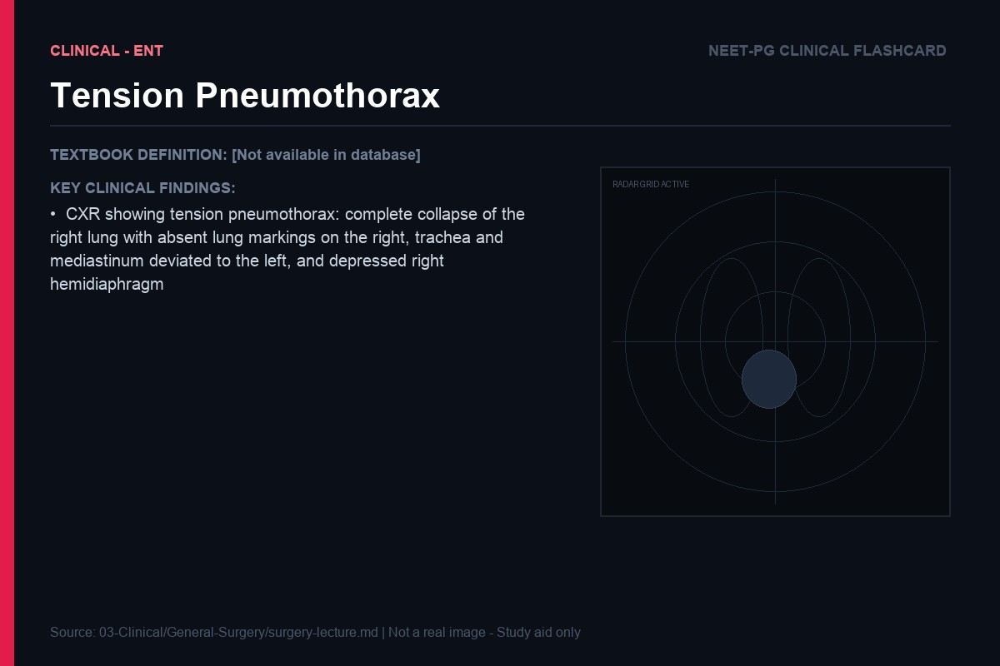
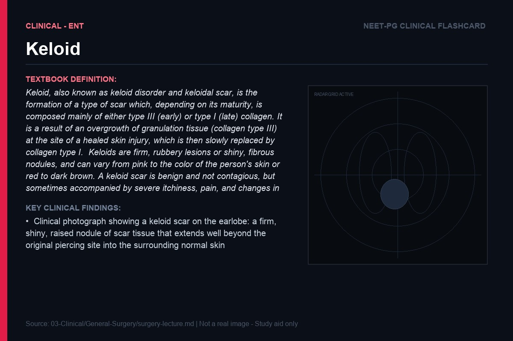
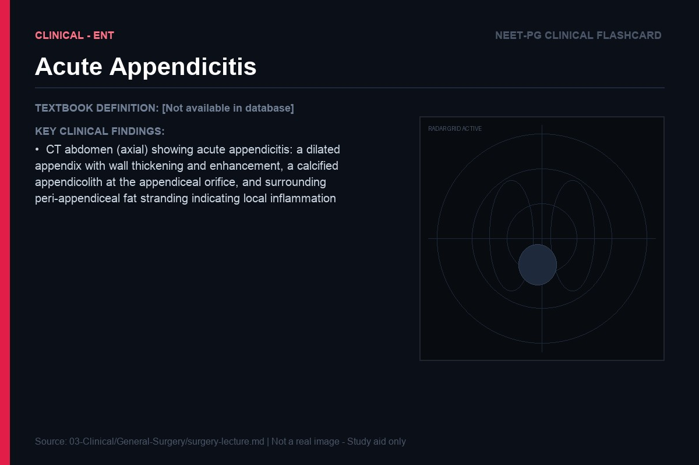
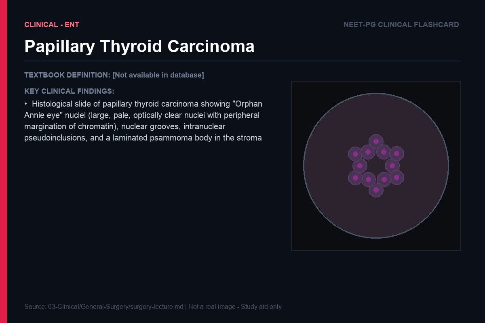
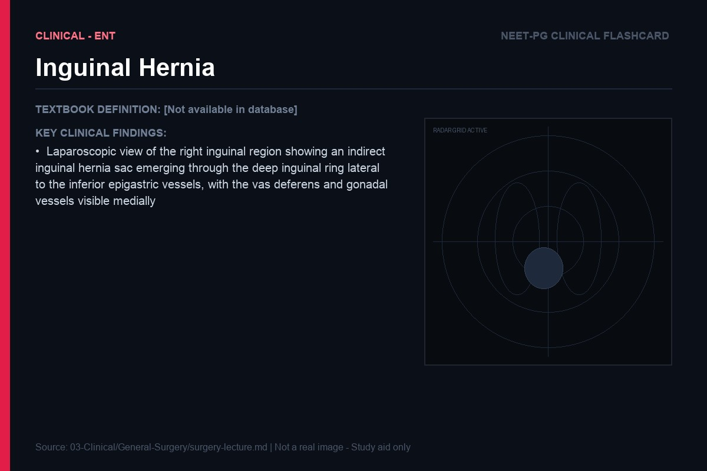
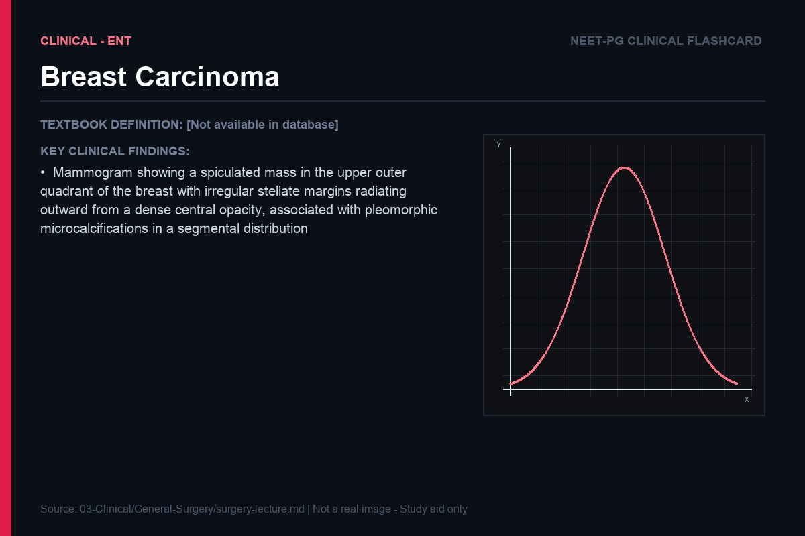
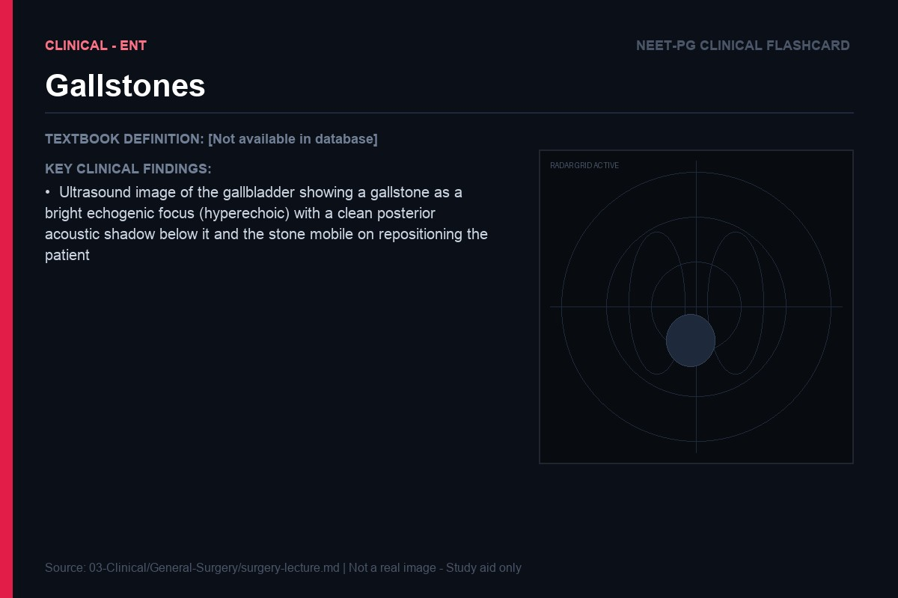
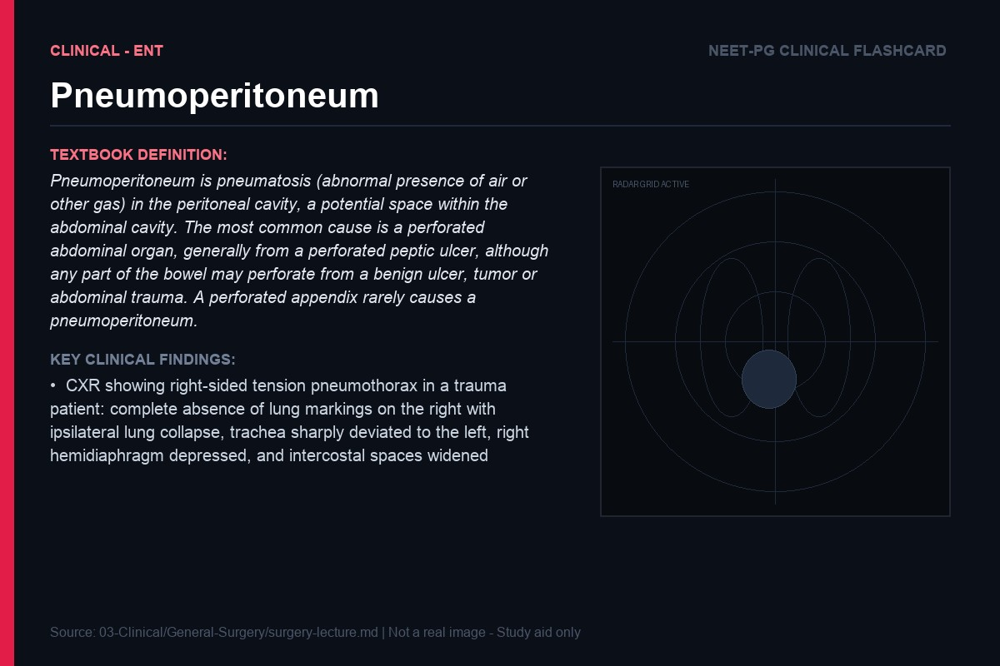

> **Diagram note:** Mermaid mindmap — renders in VS Code (Markdown Preview), Obsidian, or GitHub with the Mermaid extension. Plain-text overview below.

```mermaid
graph TD
    A["🔪 GENERAL SURGERY — NEET PG<br/>8 Major Domains"]

    A --> B["GI Surgery"]
    A --> C["Hepatobiliary"]
    A --> D["Breast"]
    A --> E["Thyroid & Parathyroid"]
    A --> F["Hernia"]
    A --> G["Vascular"]
    A --> H["Head Injury & Trauma"]

    B --> B1["Appendicitis<br/>McBurney's / Rovsing's / Open vs Lap"]
    B --> B2["Colorectal Ca<br/>Duke's / TNM / Hartmann's"]
    B --> B3["Intestinal Obstruction<br/>Small vs Large / Coffee bean SV"]
    B --> B4["Pancreatitis<br/>Ranson ≥3 severe / ERCP for stones"]

    C --> C1["Gallstones<br/>Courvoisier's law / ERCP / Lap chole"]
    C --> C2["Cholangitis<br/>Charcot's triad → Reynold's pentad"]
    C --> C3["CBD & Portal HTN<br/>CBD normal ≤6 mm / Varices management"]

    D --> D1["Breast Ca<br/>Infiltrating ductal / Staging / Sentinel LN"]
    D --> D2["Benign Breast<br/>Fibroadenoma / Fibrocystic / Fat necrosis"]
    D --> D3["Modified Radical Mastectomy<br/>Patey / Halsted / Breast conservation"]

    E --> E1["Thyroid Ca<br/>Papillary (psammoma / best prognosis)"]
    E --> E2["Thyroidectomy<br/>RLN injury → hoarseness"]
    E --> E3["Hyperparathyroidism<br/>Stones / Bones / Groans / Psychic moans"]

    F --> F1["Inguinal Hernia<br/>Indirect (lateral) vs Direct (medial)"]
    F --> F2["Femoral Hernia<br/>Below & lateral to pubic tubercle"]
    F --> F3["Obstructed vs Strangulated<br/>Strangulated = ischemia → emergency"]

    G --> G1["AAA<br/>Surgery >5.5 cm / EVAR vs Open"]
    G --> G2["Peripheral Vascular<br/>Fontaine classification / ABI"]
    G --> G3["DVT & PE<br/>Virchow's triad / D-dimer / LMWH"]

    H --> H1["Head Injury<br/>GCS ≤8 = severe / CT without contrast first"]
    H --> H2["Epidural Hematoma<br/>Biconvex / MMA rupture / Lucid interval"]
    H --> H3["Subdural Hematoma<br/>Crescent / Bridging veins / Crosses sutures"]
```

**Subject Overview (plain text):**
- GI Surgery: Appendicitis (McBurney's/Rovsing's), Colorectal Ca (Duke's/TNM/Hartmann's), Intestinal Obstruction (Small vs Large/Coffee bean SV), Pancreatitis (Ranson criteria)
- Hepatobiliary: Gallstones (Courvoisier's law/ERCP/Lap chole), Cholangitis (Charcot's triad → Reynold's pentad), CBD & Portal HTN
- Breast: Breast Ca (Infiltrating ductal/Staging/Sentinel LN), Benign Breast (Fibroadenoma/Fibrocystic), Modified Radical Mastectomy (Patey/Halsted)
- Thyroid & Parathyroid: Thyroid Ca (Papillary psammoma/best prognosis), Thyroidectomy (RLN injury → hoarseness), Hyperparathyroidism (Stones/Bones/Groans/Psychic moans)
- Hernia: Inguinal Hernia (Indirect lateral vs Direct medial), Femoral Hernia (below & lateral to pubic tubercle), Obstructed vs Strangulated
- Vascular: AAA (Surgery >5.5 cm/EVAR vs Open), Peripheral Vascular (Fontaine classification/ABI), DVT & PE (Virchow's triad/D-dimer/LMWH)
- Head Injury & Trauma: Head Injury (GCS ≤8=severe/CT first), Epidural Hematoma (Biconvex/MMA rupture/Lucid interval), Subdural Hematoma (Crescent/Bridging veins)

# General Surgery — Lecture Notes for NEET PG
### Written in the style of bedside clinical teaching

---

> Surgery is applied pathophysiology with a knife. Every incision, every anastomosis, every drain placed is a response to a biological problem. Understand the biology and the surgery becomes obvious.

---

## Shock

### First Principles — What Shock Actually Is

What is shock fundamentally trying to do to the patient? It is killing them at the cellular level by denying oxygen to tissues. Not just low blood pressure — that is a sign, not the disease. Shock is **inadequate tissue oxygen delivery to meet metabolic demand**. Cells deprived of oxygen cannot maintain aerobic respiration. They switch to anaerobic glycolysis, producing two ATP per glucose instead of thirty-eight, generating lactic acid as a by-product. Lactate accumulates. Metabolic acidosis develops. Ion pumps fail. Cells swell and die. Organs fail sequentially. This is the final common pathway regardless of the cause of shock.

Understanding this definition immediately explains two things. First: why blood pressure alone is a poor marker of shock. Young, fit patients can maintain normal blood pressure through intense vasoconstriction even when cardiac output has fallen dramatically — until they can't, and then they crash precipitously. The compensated shocked patient is the dangerous one. Second: why lactate is the best marker of shock severity and treatment response. Lactate measures the downstream consequence of oxygen debt — it tells you whether the tissues are getting enough oxygen regardless of what the blood pressure says.

### The Four Types — Classified by Mechanism

There are four types of shock. The classification is not academic — it directly determines treatment. Giving IV fluids helps hypovolaemic shock but kills the patient in cardiogenic shock (by increasing the already-failing heart's preload). Understanding the mechanism tells you what to do.

**Hypovolaemic shock**: not enough intravascular volume. Blood volume is depleted (haemorrhage, severe dehydration, burns, third-space losses). Preload drops. By the Frank-Starling relationship, reduced preload means reduced stroke volume, reduced cardiac output, reduced blood pressure, reduced oxygen delivery. The body compensates: sympathetic activation causes tachycardia (increases CO by raising HR) and intense peripheral vasoconstriction (maintains MAP). This compensation is the basis of the ATLS haemorrhage classification.

**Cardiogenic shock**: the pump fails. Adequate circulating volume but the heart cannot generate sufficient cardiac output. The common cause is massive MI — loss of >40% of LV myocardium acutely → contractility drops catastrophically. The body activates the same compensatory mechanisms (sympathetics, RAAS), but here they are counterproductive: vasoconstriction increases afterload, making the failing heart work harder against more resistance; fluid retention increases preload, causing pulmonary oedema. The patient is cold, clammy (peripheral vasoconstriction), hypotensive, with elevated JVP and pulmonary oedema — the classic picture of cardiogenic shock.

**Distributive shock**: blood volume is adequate and the heart is working, but blood is in the wrong places. Profound vasodilatation means blood pools in the peripheral vasculature, bypassing the capillary beds where oxygen exchange occurs. Septic shock is the most important example. Anaphylactic shock (histamine and other mediators → massive vasodilatation) and neurogenic shock (loss of sympathetic tone after spinal cord injury → vasodilatation and bradycardia) are others.

**Obstructive shock**: mechanical obstruction to blood flow. Tension pneumothorax compresses the mediastinum, kinking the superior vena cava and preventing venous return. Massive pulmonary embolism obstructs the pulmonary vasculature, preventing right ventricular outflow. Cardiac tamponade compresses the heart externally, preventing diastolic filling. The heart is intact and blood volume is adequate, but blood cannot flow through. The treatment is to remove the obstruction — decompress the tension pneumothorax (needle thoracocentesis), systemic thrombolysis for massive PE, pericardiocentesis for tamponade. Fluids and vasopressors are temporising measures.

 *([Source: Radiopaedia](https://radiopaedia.org/articles/tension-pneumothorax))*
> **IBQ tip:** The tracheal deviation is the key differentiating sign — it shifts away from the side of the pneumothorax (unlike a pleural effusion, where the trachea also shifts away, but the hemidiaphragm is elevated and there is opacification rather than hyperlucency). Absent lung markings on the affected side + hyperluency + mediastinal shift = tension pneumothorax until proven otherwise; do not wait for imaging to decompress.

### Septic Shock — A Detailed Analysis

Septic shock deserves special attention because it is the most common cause of death in intensive care units and because its pathophysiology is paradoxical and counterintuitive.

The story begins with infection — most commonly Gram-negative bacteria (such as E. coli, Klebsiella, Pseudomonas) though Gram-positive organisms, fungi, and viruses can also cause sepsis. Gram-negative bacteria have **lipopolysaccharide (LPS)**, also called endotoxin, as a component of their outer membrane. When they are lysed (by immune attack or antibiotics), LPS is released into the bloodstream. LPS binds to CD14 and TLR-4 (Toll-like receptor 4) on macrophages. This triggers an explosion of cytokine production: **TNF-α, IL-1, IL-6, IL-8, IL-12**.

These cytokines cause several simultaneous catastrophes. They stimulate the production of **nitric oxide** (via inducible nitric oxide synthase — iNOS) from vascular endothelium and macrophages. Nitric oxide is the most potent vasodilator known — it causes profound, generalised arterial and venous vasodilatation. Systemic vascular resistance drops dramatically. This is why early septic shock is "warm shock" — despite severely compromised haemodynamics, the patient's peripheries are warm and flushed because of vasodilatation. The low SVR is compensated initially by a dramatically increased cardiac output (the heart pumps faster and harder to maintain blood pressure against a low-resistance circuit). Heart rate 120-130/min, high CO, low SVR — this is the haemodynamic profile of early septic shock.

The cytokines also cause **capillary leak** — they disrupt the tight junctions between endothelial cells, making capillaries leaky. Protein-rich fluid pours out of the circulation into the interstitium. This causes two problems: hypovolaemia (circulating volume drops) and tissue oedema (the fluid-logged interstitium impairs oxygen diffusion from capillary to mitochondrion). The oedematous tissues paradoxically become hypoxic despite being surrounded by fluid.

**Late septic shock** — if the patient is not resuscitated effectively — progresses to myocardial depression. The same cytokines that initially cause a hyperdynamic state eventually cause cardiomyocyte injury and depression. Cardiac output falls. The patient transitions from warm, vasodilated (distributive) shock to cold, vasoconstricted shock. This is the point at which mortality skyrockets.

**Analogy:** Septic shock is like a country whose government (the immune system) responds to an invasion (bacteria) by simultaneously opening all the border gates (vasodilatation), flooding the streets (capillary leak), and then deploying the army in a way that accidentally destroys the power grid (myocardial depression). The response to the threat becomes as dangerous as the threat itself.

Treatment of septic shock follows logically from the pathophysiology: aggressive IV fluid resuscitation (correct the relative hypovolaemia from vasodilatation and capillary leak), vasopressors if fluids insufficient to maintain perfusion pressure (noradrenaline — an alpha-1 agonist — causes vasoconstriction, restoring SVR; it is the vasopressor of choice), broad-spectrum antibiotics within 1 hour (remove the trigger), source control (drain the abscess, remove the infected catheter — the ongoing bacterial source), and organ support (ventilation for respiratory failure, renal replacement therapy for AKI).

> **NEET PG Insight:** The Surviving Sepsis Campaign "Hour-1 Bundle" — within 1 hour: measure lactate, obtain blood cultures before antibiotics, administer broad-spectrum antibiotics, begin IV fluids 30 ml/kg, apply vasopressors if hypotension persists. Vasopressor of choice in septic shock: noradrenaline (norepinephrine). Second-line: vasopressin. Dopamine is associated with more arrhythmias and is not preferred. Hydrocortisone is added in refractory septic shock.

### ATLS Classification of Haemorrhagic Shock — The Body's Progressive Response

The body's response to blood loss is not all-or-nothing — it is progressive, and the ATLS classification reflects the physiological milestones.

**Class I (0-15% blood loss, up to 750ml):** The compensatory mechanisms are barely activated. Heart rate may be minimally elevated. Blood pressure is normal. Respiratory rate is normal. The patient may feel anxious. The body has coped. No resuscitation needed beyond oral fluids.

**Class II (15-30% blood loss, 750-1500ml):** Now the sympathetic response is clearly activated. Heart rate rises above 100/min (tachycardia). Blood pressure is maintained by peripheral vasoconstriction — systolic BP is normal, but diastolic BP rises (because of vasoconstriction), so pulse pressure narrows. Respiratory rate increases. Urine output begins to fall (kidneys sense decreased perfusion, conserve water). The patient is anxious, restless. Crystalloid resuscitation required.

**Class III (30-40% blood loss, 1500-2000ml):** Decompensation begins. Heart rate above 120/min. Systolic blood pressure now begins to fall (the compensatory mechanisms are overwhelmed). Respiratory rate 30-40/min. Urine output markedly reduced (oliguria). The patient is confused — cerebral perfusion is compromised. Immediate IV access, rapid fluid resuscitation, likely blood transfusion required.

**Class IV (>40% blood loss, >2000ml):** Cardiovascular collapse. Heart rate above 140/min (or bradycardia in terminal state — the vagal response to extreme hypotension). Blood pressure is severely low. No urine output. Obtunded or unconscious. This is immediately life-threatening. Massive blood transfusion protocol activated. Blood products in a 1:1:1 ratio (packed red cells : FFP : platelets) to replicate whole blood. Emergency surgery for source control.

> **NEET PG Insight:** The key insight from ATLS is that blood pressure is a late sign of haemorrhagic shock. Tachycardia and narrowed pulse pressure precede hypotension. A normal blood pressure in a tachycardic trauma patient should never be falsely reassuring. The patient is Class II, not stable.

---

## Wound Healing and Surgical Infections

### The Four Phases — Logic of Repair

What is wound healing fundamentally trying to do? It is restoring structural integrity to damaged tissue. The body has evolved an elegant, sequential programme to achieve this. The four phases are not arbitrary divisions — each phase accomplishes a specific task that creates the conditions for the next phase.

**Phase 1 — Haemostasis (immediate, minutes to hours):** The first priority after tissue injury is to stop bleeding. Vascular injury exposes subendothelial collagen and tissue factor. Platelets bind to exposed collagen (via von Willebrand factor and GPIb receptor) and are activated — they change shape, release granules (ADP, TXA₂, which recruit more platelets), and form the primary platelet plug. Simultaneously, tissue factor (expressed by subendothelial fibroblasts and smooth muscle cells) activates the extrinsic coagulation cascade → thrombin generated → fibrinogen converted to fibrin → fibrin mesh reinforces the platelet plug → secondary haemostasis. The clot is the scaffold on which all subsequent healing occurs.

Critically, platelets release growth factors from their alpha granules — PDGF (platelet-derived growth factor), TGF-β — which act as chemical signals, recruiting neutrophils and macrophages to the wound site. Haemostasis is not just about stopping bleeding — it is setting the stage for the inflammatory phase.

**Phase 2 — Inflammation (days 1-5):** The wound is now contaminated — by bacteria, devitalised tissue, and foreign material. The body must clean house before it can build. Neutrophils arrive first (within hours), recruited by cytokines and chemokines from the activated platelets and damaged tissue. They phagocytose bacteria and debride dead tissue, releasing proteolytic enzymes (elastase, collagenase) and reactive oxygen species (the oxidative burst). Neutrophils are the short-lived, crude first responders.

Macrophages arrive over the next 2-3 days, recruited from circulating monocytes by PDGF and MCP-1. Macrophages are the directors of wound healing — they phagocytose bacteria and dead neutrophils (switching from an M1 pro-inflammatory to an M2 pro-repair phenotype), and they secrete the growth factors that initiate the proliferative phase: VEGF (angiogenesis), FGF (fibroblast proliferation), and TGF-β (collagen synthesis). The macrophage is the pivot point between clearing the wound and repairing it. Remove macrophages from an animal experiment and wound healing fails entirely.

**Phase 3 — Proliferation (days 5 to weeks 3-4):** Three parallel processes fill the wound: **fibroplasia, angiogenesis, and re-epithelialisation**.

Fibroplasia: fibroblasts migrate into the wound, stimulated by PDGF and FGF from macrophages. They proliferate and begin synthesising collagen — initially predominantly Type III collagen (weaker, more flexible). The wound begins to gain tensile strength. The combination of fibroblasts, new capillaries, and loose collagen matrix is called **granulation tissue** — the pink, moist, beefy tissue you see in an open wound. A critically important cell at this stage is the **myofibroblast** — a fibroblast that has acquired contractile properties (expressing alpha-smooth muscle actin). Myofibroblasts cause wound contraction, physically pulling the wound edges together, reducing the area that needs to be covered by new tissue.

Angiogenesis: hypoxic wound tissue releases VEGF (vascular endothelial growth factor). VEGF stimulates endothelial cell proliferation and migration, forming new capillary buds that grow into the wound. This is essential — the new collagen-synthesising fibroblasts need oxygen and nutrients. No angiogenesis = no wound healing. This is why ischaemia is such a potent inhibitor of healing.

Re-epithelialisation: keratinocytes at the wound edges migrate across the granulation tissue surface under the influence of EGF (epidermal growth factor). They move in a sheet, maintaining contact with each other. Once the surface is covered, they stop migrating (contact inhibition) and differentiate, re-establishing the stratified squamous epithelium. The stimulus to migrate is removal of normal epithelial contact — keratinocytes at the edge of a wound are no longer in contact with adjacent cells on one side, and this is the signal to migrate.

**Phase 4 — Remodelling (weeks to years):** The wound is covered and its structural integrity is restored, but the job is not done. Type III collagen is gradually replaced by stronger Type I collagen (the mature, stronger form). Collagen cross-linking (through lysyl oxidase — requires copper as cofactor) increases tensile strength. The wound matures. But even after complete remodelling, scar tissue never equals uninjured skin — maximum tensile strength is only 80% of normal.

### Keloid vs Hypertrophic Scar — The Overshoot Problem

Both keloid and hypertrophic scars represent excessive collagen deposition. Both are consequences of dysregulation of the remodelling phase — the normal "stop signals" for fibroblast activity and collagen synthesis are either absent or ignored. But they differ in one crucial way.

A **hypertrophic scar** remains within the boundaries of the original wound. It is raised, red, and firm, and appears within weeks of injury. The fibroblasts have overproduced collagen, but they have eventually responded to stop signals. Over time (months to years), hypertrophic scars tend to flatten spontaneously. They are more common in wounds under tension, across flexion creases, and in burn injuries.

A **keloid** extends beyond the original wound margins, invading the surrounding normal skin. It does not regress spontaneously. It can continue growing for years after the initial wound. It is caused by fibroblasts that have genetically lost their responsiveness to apoptotic and growth-inhibitory signals — they continue to proliferate and produce collagen even when the wound is fully healed. Keloids are significantly more common in people with darker skin pigmentation (prevalence 15-20x higher in African and Asian populations), suggesting a strong genetic component. They commonly affect the earlobes (after piercing), shoulders, sternum, and upper back.

> **IBQ tip:** The defining visual feature of a keloid is extension beyond the original wound boundary — the scar tissue overgrows onto previously uninjured skin (clawing outward). A hypertrophic scar, by contrast, is also raised and red but its lateral margins align exactly with the original wound edges. Both are firm; only the keloid invades normal tissue.

> **NEET PG Insight:** Keloid: grows beyond wound margins, does not regress, genetic predisposition, common on earlobes/sternum, more common in darker skin. Hypertrophic scar: stays within wound margins, may regress, improves with pressure garments/silicone. Treatment of keloids: intralesional corticosteroid injection (triamcinolone — reduces collagen synthesis and inflammation), compression, surgical excision (but often recurs, sometimes worse). Radiation after excision reduces recurrence.

### Factors That Impair Wound Healing — Why Wounds Fail

Understanding why wounds fail is essential surgical knowledge. Every factor maps back to the four phases.

**Ischaemia**: Collagen synthesis requires molecular oxygen — specifically for hydroxylation of proline and lysine residues (catalysed by prolyl hydroxylase, which requires O₂, Vitamin C, and Fe²+). Angiogenesis is stimulated by hypoxia (via HIF-1α → VEGF), but severe ischaemia means new capillaries cannot form fast enough or at all. No oxygen = no collagen synthesis = no tensile strength. This is why peripheral arterial disease, venous insufficiency (causing local tissue hypoxia from oedema and high venous pressure), and diabetic small vessel disease are the most common reasons for chronic non-healing wounds.

**Infection**: Bacteria in a wound are not just a source of systemic disease — they directly impair healing locally. Bacteria produce metalloproteinases and proteases that break down newly synthesised collagen, growth factors, and the extracellular matrix. They also redirect macrophages toward a persistent inflammatory (M1) state, preventing the switch to the M2 pro-repair phenotype that is essential for the proliferative phase. The result: the wound remains stuck in the inflammatory phase, cannot progress to proliferation, and becomes a chronic wound. The critical threshold is >10⁵ organisms per gram of tissue — above this, wound closure is unlikely to succeed.

**Diabetes**: A perfect storm of healing impairment. Vascular disease (both macro and micro) causes ischaemia. Peripheral neuropathy removes the protective sensation that warns of trauma — patients don't notice small injuries that become infected. The neutrophil and macrophage function is impaired in hyperglycaemia (impaired chemotaxis, phagocytosis, and killing). Non-enzymatic glycation of collagen produces AGEs (advanced glycation end-products) that cross-link collagen abnormally, making it rigid and impairing the normal remodelling process. And hyperglycaemia itself impairs fibroblast proliferation and collagen synthesis. The diabetic foot is the clinical manifestation of this convergence.

**Malnutrition**: Collagen is a protein — its synthesis requires adequate protein substrate. Vitamin C (ascorbic acid) is an essential co-factor for prolyl and lysyl hydroxylase (which hydroxylate proline and lysine residues, essential for collagen's triple helix structure — without hydroxylation, collagen cannot be cross-linked and is weak). Vitamin C deficiency causes scurvy — wounds that dehisce, gums that bleed, old scars that break down. Zinc is a co-factor for DNA polymerase (cell proliferation) and metalloproteinases (remodelling). Zinc deficiency impairs all phases of healing.

**Clinical connection:** Albumin <30g/L is associated with markedly impaired wound healing and anastomotic leak after gastrointestinal surgery. Pre-operative nutritional optimisation — enteral or parenteral nutrition to correct hypoalbuminaemia — is an essential component of enhanced recovery protocols, particularly before major colorectal, oesophageal, and pancreatic surgery.

---

## GI Surgery

### Appendicitis — Logic in the RIF

What is appendicitis fundamentally doing to the patient? It is allowing luminal obstruction to progress, through a well-defined sequence, to perforation. Understanding this sequence allows you to predict the clinical presentation at every stage.

The appendix is a blind-ending tube arising from the caecum. Its lumen can be obstructed by several things: **fecaliths** (hardened faecal material — the most common cause in adults), lymphoid hyperplasia (reactive enlargement of the submucosal lymphoid follicles — the most common cause in children, often post-viral), tumours (carcinoid of the appendix — the most common appendiceal tumour), or parasites (Enterobius vermicularis in some populations).

Once the lumen is obstructed, the appendiceal mucosa continues to secrete mucus (it has no way of knowing the outlet is blocked). **Intraluminal pressure rises**. When the intraluminal pressure exceeds capillary venous pressure, venous drainage is obstructed first (arteries have higher pressure and remain patent longer). Venous congestion → oedema → the appendiceal wall becomes oedematous and swollen. Now luminal bacteria — E. coli, Bacteroides, streptococci — which were previously in a healthy relationship with the mucosa begin to invade the weakened, ischaemic wall. Transmural bacterial invasion + inflammation = **acute appendicitis**.

As arterial pressure is eventually exceeded too, the appendix becomes frankly ischaemic. Gangrenous appendicitis — black, necrotic, foul-smelling. The gangrenous wall cannot withstand the pressure of the luminal contents and ruptures. **Perforation**. Pus and faecal material enter the peritoneal cavity.

Now trace the pain. The appendix is a midgut structure — it derives its visceral afferent nerve supply from T10 (which also supplies the periumbilical skin). Early appendicitis causes poorly localised, colicky, **periumbilical pain** — the classic visceral pain of midgut pathology, indistinguishable from any other midgut problem. As the inflammation progresses and the parietal peritoneum overlying the appendix (in the right iliac fossa) becomes inflamed, somatic pain fibres (which provide precise anatomical localisation) are now involved. The pain shifts to the **right iliac fossa** — specifically to **McBurney's point** (two-thirds of the way from the umbilicus to the right anterior superior iliac spine). This shift in pain location — periumbilical to RIF — is pathognomonic of appendicitis.

**Analogy:** Visceral pain is like a phone call where the signal is breaking up — you know there's a problem but you can't tell exactly where it's coming from. Somatic pain is like a text message — precise, accurate, locatable.

The clinical signs follow the same logic. Rebound tenderness (Blumberg's sign): gentle palpation over the appendix then sudden release → the parietal peritoneum, which was being held still during palpation, snaps back → if inflamed, this causes sharp pain. Rovsing's sign: palpation in the left iliac fossa causes pain in the right iliac fossa — because palpating the left side shifts the abdominal contents, moving the inflamed appendix and its adjacent peritoneum. Psoas sign: extension of the right hip causes pain — the psoas muscle lies behind the appendix; if the appendix is retrocaecal, it lies directly on the psoas, and hip extension stretches the psoas against the inflamed appendix. Obturator sign: internal rotation of the flexed right hip causes pain — the obturator internus lies medial to a pelvic appendix.

> **NEET PG Insight:** The Alvarado score combines clinical and laboratory features to predict appendicitis: Migration of pain to RIF (1), Anorexia (1), Nausea/vomiting (1), RIF tenderness (2), Rebound tenderness (1), Elevated temperature (1), Leukocytosis (2) — maximum 10 points. Score ≥7 = likely appendicitis, operate. Score 5-6 = possible, observe or image. Score <5 = unlikely.

 *([Source: Radiopaedia](https://radiopaedia.org/articles/appendicitis))*
> **IBQ tip:** An appendicolith appears as a bright calcified density at the appendiceal base (like a tooth in the RIF); peri-appendiceal fat stranding is haziness of the normally dark (low-density) fat surrounding the appendix, indicating oedema and inflammation spreading into adjacent tissue. Distinguish from a normal appendix (diameter <6 mm, no wall thickening, no fat stranding) and from a Meckel's diverticulum (arises from the anti-mesenteric border of the ileum, 2 feet from the ileocaecal valve, often midline).

### Colorectal Cancer — The Adenoma-Carcinoma Sequence

Colorectal cancer is perhaps the best-understood example of stepwise carcinogenesis in all of oncology. The **adenoma-carcinoma sequence** — first described by Fearon and Vogelstein in 1990 — demonstrates that colon cancer arises through an accumulation of specific genetic mutations over a period of 10-15 years. This sequence is why colonoscopic polypectomy prevents cancer.

The sequence begins with the **APC gene** (adenomatous polyposis coli). APC is a tumour suppressor gene whose protein product is part of the destruction complex that continuously targets beta-catenin (a transcription factor in the Wnt signalling pathway) for degradation. When APC is functioning normally, beta-catenin is continuously degraded, keeping Wnt signalling (which drives cell proliferation) in check. When APC is mutated (loss-of-function mutation), beta-catenin accumulates and migrates to the nucleus, where it activates genes promoting cell proliferation. The mucosal cell cannot stop dividing → a benign adenoma forms. This is the first step.

The adenoma grows and acquires additional mutations. A mutation in **KRAS** (a small GTPase that acts as a molecular switch in the EGFR-RAS-MAPK signalling pathway) occurs next. Normally, KRAS is transiently activated by growth factor signals and then rapidly inactivated. Mutant KRAS is permanently stuck in the "on" position — the growth signal is constitutively active, regardless of whether any actual growth factor is present. The adenoma grows faster. More mutations accumulate in DNA repair genes, in SMAD4 (TGF-β pathway tumour suppressor), and finally in **p53** — the genome's guardian. When p53 is lost, the cell loses its ability to detect DNA damage and undergo apoptosis. Cells with genomic instability survive and proliferate instead of dying. The adenoma transitions to invasive carcinoma.

**FAP (Familial Adenomatous Polyposis)**: A germline mutation in APC means every colonocyte is born one mutation step further down the adenoma-carcinoma sequence. Hundreds to thousands of adenomatous polyps form throughout the colon beginning in adolescence. By age 40, the cumulative probability of colorectal cancer is nearly 100% if the colon is not removed. Treatment: prophylactic total colectomy. The duodenum is also at risk (periampullary polyps → duodenal cancer — a major cause of death in FAP patients who have had colectomy).

**HNPCC / Lynch Syndrome**: A germline mutation in one of the **mismatch repair (MMR) genes** (MLH1, MSH2, MSH6, PMS2). MMR genes detect and correct base pair mismatches that occur during DNA replication — they are the proofreaders of the genome. Without functional MMR, replication errors accumulate especially in repetitive DNA sequences called microsatellites (short tandem repeats throughout the genome). **Microsatellite instability (MSI)** develops — the lengths of these microsatellite sequences become unstable and variable between tumour and normal tissue. MSI is a molecular fingerprint of MMR deficiency and is now tested routinely in all colorectal cancers (as it guides immunotherapy selection — MSI-high tumours respond dramatically to PD-1 checkpoint inhibitors).

Lynch syndrome differs fundamentally from FAP: the cancer arises without large numbers of polyps (hence the older term "hereditary non-polyposis colorectal cancer"), occurs at a younger age (mean 45 years vs 70 years in sporadic CRC), and is more commonly in the right colon (unusual for sporadic CRC, which is predominantly left-sided). Lynch syndrome also predisposes to endometrial cancer (the second most common Lynch-associated cancer), ovarian, urological, and small bowel cancers.

> **NEET PG Insight:** Duke's staging (older but still examined): A = confined to bowel wall, B = through bowel wall, C = lymph node involvement, D = distant metastases. TNM is the current standard. Colon cancer metastasises most commonly to the liver (via portal vein), then lungs. Rectal cancer can metastasise directly to lungs (bypassing the liver via the inferior rectal veins → systemic circulation). Know this distinction — it explains why rectal cancers can have pulmonary metastases without liver metastases.

---

## Thyroid Surgery and Endocrine Surgery

### The Anatomy Is the Complication

Thyroid surgery complication avoidance is an exercise in applied anatomy. The thyroid gland lies in the anterior neck, wrapped around the trachea, with intimate relationships to several critical structures. Understanding these relationships predicts every complication.

The **recurrent laryngeal nerve (RLN)** is the most feared structure in thyroid surgery. On the right, it loops around the subclavian artery before ascending in the tracheoesophageal groove to reach the larynx. On the left, it loops around the arch of the aorta (hence why it is longer) before ascending. In the neck, it travels in the tracheoesophageal groove, passing deep to the inferior pole of the thyroid, where it crosses — with variable anatomy — in close proximity to the inferior thyroid artery. This crossing point is where the nerve is most at risk during thyroidectomy. The inferior thyroid artery must be ligated during thyroidectomy, and if this ligation is done close to the thyroid gland rather than at its origin, the risk to the RLN is lower (because the nerve tends to branch near the gland, and individual branches may be spared).

Unilateral RLN injury causes ipsilateral vocal cord paralysis. The cord lies in the paramedian position (it cannot abduct or adduct fully). The voice becomes hoarse — the patient sounds as though they have a severe cold. The opposite cord compensates partially over time. Bilateral RLN injury is a surgical emergency. Both cords lie in the paramedian position, nearly apposed — the airway is critically narrowed. Inspiratory stridor, respiratory distress. Emergency tracheostomy may be required.

There is also a **superior laryngeal nerve (SLN)**, which provides sensory supply to the supraglottic larynx (internal branch) and motor supply to the cricothyroid muscle (external branch). Injury to the external branch of the SLN (during ligation of the superior thyroid vessels, which must be done close to the thyroid capsule to protect the nerve) causes loss of high-pitched voice — the cricothyroid muscle is the tensor of the vocal cords, responsible for producing high notes. Singers and professional voice users are particularly affected.

### Parathyroid Glands — Tiny, Critical, Easily Destroyed

The four parathyroid glands — typically 4mm in diameter, weighing 40mg each, brown-yellow, resembling a small lentil — lie on the posterior surface of the thyroid. The superior pair arise from the fourth pharyngeal pouch and are relatively constant in position. The inferior pair arise from the third pharyngeal pouch (with the thymus — hence they migrate further and are more variable in position, occasionally found in the mediastinum, within the thymic tissue). During thyroidectomy, these glands can be inadvertently removed (they are tiny and may not be identified), devascularised (their blood supply comes from the inferior thyroid artery, which is being ligated), or thermally damaged (electrocautery near the thyroid capsule can transmit heat to the parathyroids).

When parathyroid function is lost, PTH secretion drops. PTH normally maintains serum calcium by: stimulating osteoclastic bone resorption (releasing calcium from bone), stimulating renal calcium reabsorption (in the distal tubule), and indirectly increasing intestinal calcium absorption (by stimulating renal 1-alpha-hydroxylase to convert 25-OH vitamin D to 1,25-OH vitamin D = calcitriol, which is the active form that drives intestinal calcium absorption). Without PTH, serum calcium falls — **hypocalcaemia**.

Hypocalcaemia causes reduced threshold for nerve excitation. Calcium stabilises the sodium channel — it raises the threshold for action potential generation. With less calcium, neurons fire more easily and spontaneously. This manifests as: **Chvostek's sign** (tapping over the facial nerve anterior to the ear causes ipsilateral facial muscle twitching — because the facial nerve, at reduced calcium concentration, fires spontaneously when mechanically stimulated); **Trousseau's sign** (inflating a blood pressure cuff above systolic pressure for 3 minutes causes carpal spasm — carpopedal spasm — because the ischaemic nerve in the arm fires spontaneously under relative hypocalcaemia compounded by the alkalosis of ischaemia); **tetany** (involuntary muscle contractions); and at its most severe, **seizures** and **laryngospasm** (life-threatening airway obstruction).

**Clinical connection:** After total thyroidectomy, calcium is checked at 6-12 hours post-operatively and the patient is monitored for symptoms of hypocalcaemia. Prophylactic calcium carbonate and calcitriol are often given. If transient (the glands were bruised/devascularised but not destroyed — they recover over weeks), calcium supplementation is sufficient. If permanent (glands were removed), lifelong calcium and vitamin D supplementation is needed.

### Thyroid Cancer — Cell Biology Determines Behaviour

There are four main types of thyroid cancer, each arising from a different cell type with a different molecular driver and therefore different behaviour.

**Papillary thyroid carcinoma** (PTC, 80% of all thyroid cancers): Arises from follicular cells (the cells that produce thyroid hormone). The dominant molecular driver is **BRAF V600E mutation** (a mutation that keeps the BRAF kinase constitutively active, driving the MAPK proliferation pathway — the same mutation seen in melanoma). PTC spreads characteristically via **lymphatics** — regional lymph node metastases are common (in up to 50% of cases at presentation) but this does not dramatically worsen the prognosis (unlike most cancers). The tumour has characteristic histological features: empty-looking, overlapping ("Orphan Annie eye") nuclei, nuclear grooves, intranuclear pseudoinclusions, and papillary architecture. Psammoma bodies (concentric calcifications, remnants of necrotic papillae) are pathognomonic. Prognosis is excellent — 10-year survival >95% for localised disease. This is the cancer that even the thyroid gland would choose.

> **IBQ tip:** "Orphan Annie eye" nuclei are the hallmark — the nucleus appears empty or ground-glass because the chromatin is marginated to the nuclear membrane, leaving the centre pale (likened to the blank eyes of the comic strip character). Psammoma bodies are concentric, calcified, laminated structures — present in PTC, meningioma, and serous ovarian carcinoma; in this thyroid context they are pathognomonic. Distinguish from follicular carcinoma (follicular architecture without these nuclear features — requires capsular/vascular invasion to diagnose malignancy).

**Follicular thyroid carcinoma** (FTC, 10%): Also from follicular cells, but with a different molecular driver — **RAS mutation** or **PAX8-PPARG translocation**. The critical difference from PTC is the route of spread: FTC spreads **haematogenously** via blood vessels. Bone metastases (osteolytic — they gobble up bone, causing pain, fractures, hypercalcaemia) and lung metastases are the hallmarks. Importantly, lymph node metastases are uncommon in FTC. Histologically, the distinction from follicular adenoma (benign) requires evidence of **capsular invasion or vascular invasion** — you cannot make the diagnosis of FTC on fine-needle aspiration cytology (Bethesda category IV = follicular neoplasm — requires surgical excision for definitive diagnosis because FNAC cannot demonstrate capsular invasion).

**Medullary thyroid carcinoma** (MTC, 5-10%): Arises from **parafollicular C-cells** — the neuroendocrine cells that secrete calcitonin. C-cells are embryologically different from follicular cells (they derive from neural crest cells) and produce a completely different hormone. MTC secretes **calcitonin** — a sensitive tumour marker used for diagnosis and surveillance. The molecular driver is **RET proto-oncogene mutation** — either germline (hereditary MTC, associated with MEN2A and MEN2B) or somatic (sporadic MTC). MEN2A: MTC + phaeochromocytoma + primary hyperparathyroidism. MEN2B: MTC + phaeochromocytoma + marfanoid habitus + mucosal neuromas. Every patient with MTC should be screened for RET mutation and for phaeochromocytoma (because operating on an unsuspected phaeochromocytoma can cause hypertensive crisis and death).

**Anaplastic thyroid carcinoma** (ATC, 1-2%): The most lethal cancer in endocrinology. An undifferentiated, rapidly growing tumour that invades locally (trachea, oesophagus, carotid artery) and metastasises haematogenously. Often develops from dedifferentiation of pre-existing PTC or FTC. Median survival is 3-6 months from diagnosis. It does not take up radioiodine (the cells have lost all thyroid differentiation markers). Treatment is palliative in most cases.

> **NEET PG Insight:** Radioactive iodine (RAI, I-131) treatment works only for thyroid cancers that retain the sodium-iodide symporter — i.e., differentiated (papillary and follicular) thyroid cancers. After total thyroidectomy and RAI ablation, thyroglobulin becomes an exquisitely sensitive tumour marker (because there are no more thyroid cells to produce it — any detectable thyroglobulin = residual or recurrent disease). Medullary and anaplastic cancers do not respond to RAI.

---

## Hernias

### Embryology First — Then the Surgery Makes Sense

To understand inguinal hernias, you must first understand testicular descent. During embryological development, the testes form in the retroperitoneum, near the kidney. Over the course of foetal life (primarily in the third trimester), the testes descend — guided by the gubernaculum — from the retroperitoneum, through the inguinal canal, and into the scrotum. Leading this descent is a finger-like projection of peritoneum that extends through the inguinal canal ahead of the testis: the **processus vaginalis**.

After testicular descent is complete, the processus vaginalis normally obliterates — it closes, separating the peritoneal cavity from the tunica vaginalis (the serous covering of the testis). If this obliteration fails, a patent processus vaginalis persists — an open channel between the peritoneal cavity and the scrotum. This is the anatomical basis of the **indirect inguinal hernia** — abdominal contents (bowel, omentum) can slide down this pre-formed peritoneal sac, through the deep inguinal ring (the internal opening of the inguinal canal), along the inguinal canal, and potentially into the scrotum. This explains why indirect hernias are most common in young males and in premature infants (who haven't had time for the processus to close).

**Indirect inguinal hernia** enters the inguinal canal through the **deep inguinal ring** (which lies lateral to the inferior epigastric vessels) and travels along the inguinal canal, medially, potentially exiting through the superficial ring into the scrotum. The deep ring is a relatively tight, fibromuscular opening. This anatomical tightness is what makes indirect hernias susceptible to **strangulation** — the ring can constrict the neck of the hernia sac, compressing the mesenteric vessels supplying the herniated bowel segment, causing ischaemia and then gangrene.

> **IBQ tip:** On the laparoscopic (preperitoneal) view, the inferior epigastric vessels are the landmark — an indirect hernia defect is lateral to these vessels at the deep ring, where the peritoneal sac follows the cord structures. A direct hernia defect is medial to the inferior epigastric vessels, a broad area of posterior wall weakness without a distinct ring. This lateral vs medial relationship is the single most reliable intraoperative distinction.

**Direct inguinal hernia** has a completely different mechanism. There is no processus vaginalis involved. Instead, the posterior wall of the inguinal canal — specifically the **transversalis fascia** in **Hesselbach's triangle** — weakens and gives way under the chronic strain of increased intra-abdominal pressure (heavy lifting, chronic cough from smoking, straining from constipation or BPH, obesity). The triangle is bounded by the inguinal ligament inferiorly, the inferior epigastric vessels laterally, and the rectus sheath medially. A direct hernia bulges straight through this weakened area, **medial to the inferior epigastric vessels**, into the inguinal canal (but typically does not enter the scrotum because it is not following a pre-formed peritoneal sac). The defect in a direct hernia is a **wide area of posterior wall weakness** — not a tight ring. This explains why direct hernias rarely strangulate: there is no constricting ring to compress the bowel.

> **IBQ tip:** The direct hernia defect is a diffuse, wide weakness in the posterior wall medial to the epigastric vessels — there is no tight ring, which is why strangulation is rare. Contrast with the indirect defect's discrete ring at the deep inguinal ring laterally. In TAPP/TEP repair, a mesh covers the myopectineal orifice, simultaneously protecting against both indirect and direct defects.

**Analogy:** An indirect inguinal hernia is like a burglar entering through a specific window (the deep ring) using a pre-existing passage (processus vaginalis). A direct hernia is like the wall itself collapsing inward from internal pressure — a different kind of structural failure, at a different location, with different consequences.

### Femoral Hernia — The Geometry of Strangulation Risk

Femoral hernias descend through the femoral canal (medial to the femoral vein, below the inguinal ligament, entering the femoral triangle). The femoral ring (the upper opening of the femoral canal) is bordered by rigid, unyielding structures: the inguinal ligament anteriorly, the lacunar ligament medially, the femoral vein laterally, and the pectineal ligament posteriorly. None of these structures can stretch.

This rigid ring explains why femoral hernias have the highest strangulation rate of all hernias (approaching 50% within 1-2 years of presentation). The hernia contents are gripped by a non-compliant bony and ligamentous ring that cannot expand to accommodate them. A femoral hernia should be repaired urgently. They are more common in women (broader female pelvis → larger femoral canal → higher risk). Clinically, a femoral hernia presents as a small, tense swelling **below and lateral to the pubic tubercle** (as opposed to inguinal hernia, which is above and medial to the pubic tubercle). This distinction is crucial for examination technique.

### Complications of Hernia — A Logical Hierarchy

**Reducible**: contents can be returned to the abdominal cavity by manual pressure (taxis). Not an emergency.

**Irreducible (incarcerated)**: contents cannot be returned but the blood supply is intact. Not immediately dangerous but warrants elective or urgent repair to prevent strangulation.

**Obstructed**: irreducible hernia containing bowel that is obstructed — the bowel lumen is kinked or compressed at the hernia neck. The patient presents with features of intestinal obstruction (vomiting, abdominal distension, absolute constipation, colicky pain) with a tense, irreducible hernia. The blood supply is still intact at this stage. Emergency repair required.

**Strangulated**: the blood supply to the hernial contents is compromised. Venous occlusion occurs first (veins have lower pressure and are compressed first), causing oedema and congestion. Then arterial supply fails. The contents become ischaemic, then gangrenous. The patient becomes systemically unwell — fever, tachycardia, severe localised pain (the hernia was mildly uncomfortable; now it is exquisitely tender). Emergency surgery, with bowel resection if the bowel is gangrenous.

> **NEET PG Insight:** Richter's hernia — only part of the circumference of the bowel is caught in the hernia neck (like a pinch of the bowel wall). The bowel lumen is not completely obstructed (so no classic obstruction signs), but the pinched segment of wall becomes ischaemic and gangrenous. This is a trap — the patient may not have classic obstruction symptoms but is at risk of perforation. More common in femoral and obturator hernias. Littre's hernia — a Meckel's diverticulum is the content of the hernia.

### Inguinal Hernia Repair — Understanding the Principle

The goal of hernia repair is to close the defect permanently. The fundamental principle is tension-free repair. Attempts to bring tissue together under tension invariably fail — the tension causes ischaemia and necrosis of the approximated tissue, leading to recurrence.

The **Lichtenstein tension-free repair** is the current gold standard for open inguinal hernia repair. A polypropylene mesh is placed over the posterior wall of the inguinal canal (behind the spermatic cord) and sutured to the inguinal ligament and conjoint tendon. The mesh provides a permanent prosthetic reinforcement — it is the structural replacement for the weakened posterior wall. The deep ring is reconstituted around the cord. No tissue is brought together under tension because the mesh bridges the defect.

Laparoscopic repair (TAPP — trans-abdominal preperitoneal, or TEP — totally extraperitoneal) places the mesh in the preperitoneal space, covering the myopectineal orifice (the entire weak area through which inguinal and femoral hernias can occur). The advantages over open repair: less post-operative pain, faster return to activity, better for bilateral hernias (both sides repaired through the same incisions), and lower recurrence rates in experienced hands. But the learning curve is steep and the consequences of error (injury to the iliac vessels, vas deferens, femoral nerve) are more serious.

> **NEET PG Insight:** In a strangulated hernia with gangrenous bowel, use a non-absorbable mesh only in a clean field. If there is gross contamination (perforated gangrenous bowel, faecal peritonitis), placing a prosthetic mesh risks mesh infection, a devastating complication. In this scenario: primary tissue repair (e.g., Bassini or Shouldice — bringing the conjoint tendon to the inguinal ligament) is performed, accepting a higher recurrence rate in preference to mesh infection.

---

## Summary Tables

### Shock — Classification and Management

| Type | Mechanism | Haemodynamics | Clinical Signs | Treatment |
|------|-----------|--------------|----------------|-----------|
| Hypovolaemic | ↓Blood volume | ↓CO, ↑SVR, ↑HR | Cold, clammy, tachycardic | IV fluids, blood, source control |
| Cardiogenic | ↓Pump function | ↓CO, ↑SVR, ↑PCWP | Cold, clammy, pulm oedema, ↑JVP | Inotropes, IABP, revascularisation |
| Distributive (Septic) | ↓SVR (vasodilation) | ↑CO, ↓SVR (early) | Warm, flushed, bounding pulse | Fluids, noradrenaline, antibiotics |
| Obstructive | Mechanical obstruction | ↓CO, ↑SVR | Context-specific | Remove obstruction |

### Wound Healing Phases

| Phase | Timing | Key Cells | Key Events | Impaired By |
|-------|--------|-----------|------------|-------------|
| Haemostasis | Minutes-hours | Platelets | Platelet plug, fibrin clot, growth factor release | Anticoagulants, thrombocytopenia |
| Inflammation | Days 1-5 | Neutrophils, Macrophages | Debridement, phagocytosis, cytokine release | Steroids, immunosuppression, malnutrition |
| Proliferation | Days 5 – weeks 3 | Fibroblasts, Endothelial cells, Keratinocytes | Collagen synthesis, angiogenesis, re-epithelialisation | Ischaemia, infection, diabetes, Vit C deficiency |
| Remodelling | Weeks – years | Fibroblasts, Myofibroblasts | Type III → Type I collagen, cross-linking, scar maturation | Chronic inflammation, infection |

### Thyroid Cancer Comparison

| Type | Cell Origin | Mutation | Spread | Marker | Prognosis |
|------|------------|---------|--------|--------|-----------|
| Papillary | Follicular cells | BRAF V600E | Lymphatic | Thyroglobulin | Excellent (10yr >95%) |
| Follicular | Follicular cells | RAS, PAX8-PPARG | Haematogenous (bone, lung) | Thyroglobulin | Good |
| Medullary | C-cells | RET | Lymphatic + haematogenous | Calcitonin | Moderate |
| Anaplastic | Dedifferentiated | Multiple | Local invasion + haematogenous | None specific | Very poor (median 3-6 months) |

### Hernia Types — Key Distinctions

| Feature | Indirect Inguinal | Direct Inguinal | Femoral |
|---------|------------------|----------------|---------|
| Cause | Patent processus vaginalis | Posterior wall weakness | Femoral canal weakness |
| Position relative to epigastric vessels | Lateral | Medial | Below inguinal ligament |
| Relation to pubic tubercle | Above and medial | Above and medial | Below and lateral |
| Strangulation risk | High (tight deep ring) | Low (wide defect) | Very high (rigid ring) |
| Common in | Young males | Older males | Women |
| Enters scrotum | Yes (can) | Rarely | No |

### Colorectal Cancer — Adenoma-Carcinoma Sequence

| Mutation | Gene | Function | Effect When Lost |
|---------|------|----------|----------------|
| First | APC | Controls Wnt signalling (destroys beta-catenin) | Uncontrolled proliferation → adenoma |
| Second | KRAS | GTPase switch in EGFR-MAPK pathway | Constitutive growth signal |
| Third | SMAD4 | TGF-β signalling | Loss of growth inhibition |
| Fourth | TP53 | DNA damage checkpoint, apoptosis inducer | Genomic instability tolerated → carcinoma |

---

## Breast Surgery

### Breast Cancer — Biology Before Surgery

What is breast cancer fundamentally doing to the patient? It is converting epithelial cells of the breast ducts or lobules into cells that have escaped the normal constraints of proliferation and have acquired the capacity to invade adjacent tissue and metastasise to distant organs. To approach breast cancer intelligently, you must understand it not as a single disease but as a collection of biologically distinct subtypes — each with different drivers, different behaviours, and different treatment strategies.

The breast is a ductal-lobular system — ducts carry milk from lobules (where milk is produced) to the nipple. Breast cancer arises most commonly from the **terminal duct-lobular unit (TDLU)** — the junction of the duct and lobule. The sequence, as with colon cancer, is one of stepwise progression: normal epithelium → atypical ductal hyperplasia (ADH) → ductal carcinoma in situ (DCIS) → invasive ductal carcinoma. DCIS is the non-invasive precursor — the cancer cells are filling and distending the duct but have not yet broken through the basement membrane. Once they breach the basement membrane, they have access to the lymphatics and blood vessels — invasion has occurred.

 *([Source: Radiopaedia](https://radiopaedia.org/articles/breast-carcinoma))*
> **IBQ tip:** A spiculated (stellate) mass with irregular margins is the mammographic hallmark of malignancy — the spicules represent tumour cells pulling on surrounding stroma (desmoplastic reaction). Microcalcifications in a segmental or linear distribution suggest DCIS. Contrast with a benign lesion: a fibroadenoma has a smooth, well-defined oval or lobulated margin with a halo sign and no calcifications; a cyst is round with sharp margins and posterior acoustic enhancement on ultrasound.

The most important molecular classification of breast cancer is by **receptor status**: **oestrogen receptor (ER), progesterone receptor (PR), and HER2** (human epidermal growth factor receptor 2). This classification determines biology, prognosis, and treatment.

**ER/PR-positive (luminal) breast cancer** (approximately 70%): These tumours are driven by oestrogen signalling — oestrogen binds the ER, acting as a transcription factor driving proliferation genes. They tend to be slower growing, well-differentiated, and have a better prognosis. But they can be treated with hormonal therapies that block oestrogen: **tamoxifen** (selective oestrogen receptor modulator — blocks ER in breast tissue, used pre- and peri-menopausal) or **aromatase inhibitors** (anastrozole, letrozole — block the peripheral aromatase enzyme that converts androgens to oestrogen, used post-menopausal because the ovaries are no longer the main oestrogen source). These hormonal therapies have transformed survival in ER-positive breast cancer — 5 years of tamoxifen reduces recurrence by 50%.

**HER2-positive breast cancer** (approximately 15-20%): HER2 is a transmembrane tyrosine kinase receptor — a growth factor receptor. Gene amplification results in massive overexpression of HER2 on the cell surface, which is constitutively active, driving cell proliferation. These tumours were historically aggressive with poor prognosis. **Trastuzumab (Herceptin)** — a monoclonal antibody targeting HER2 — transformed the outcome. It binds HER2, blocking the receptor and recruiting immune cells to destroy it (ADCC — antibody-dependent cellular cytotoxicity). Addition of trastuzumab to chemotherapy in HER2-positive breast cancer reduced recurrence by ~50% and mortality by ~35%. The principle: identify the driver, target the driver.

**Triple-negative breast cancer (TNBC)** (ER-negative, PR-negative, HER2-negative, approximately 15-20%): The most aggressive subtype. No hormonal receptor to target with hormonal therapy, no HER2 to target with trastuzumab. Treatment relies on chemotherapy and increasingly on immunotherapy (pembrolizumab — PD-1 inhibitor — in TNBC). TNBC is more common in younger women and in BRCA1 mutation carriers (BRCA1 normally repairs double-strand DNA breaks by homologous recombination — without it, the tumour is genomically unstable but is also vulnerable to PARP inhibitors, which block an alternative DNA repair pathway, causing synthetic lethality).

### Sentinel Lymph Node Biopsy — A Revolution in Staging

The axillary lymph nodes are the first lymph nodes to receive lymphatic drainage from the breast — and therefore the first place breast cancer metastasises. Historically, all patients with breast cancer underwent axillary lymph node dissection (removal of all axillary lymph nodes) to stage the axilla. The morbidity was significant: chronic lymphoedema of the arm (in up to 30% of patients), numbness from intercostobrachial nerve damage, shoulder stiffness, and axillary web syndrome.

The concept of the **sentinel lymph node** changed this. The sentinel node is the first lymph node in the lymphatic drainage chain from the tumour — the first node through which tumour cells would travel. If the sentinel node is free of metastatic disease, the remaining axillary nodes are almost certainly also free (false negative rate 5-10%). If the sentinel node contains metastasis, further axillary surgery may be needed.

Intraoperatively, the sentinel node is identified by injecting blue dye (patent blue V) or radioactive colloid (Tc-99m sulphur colloid) — or both — around the tumour. These tracers flow along the lymphatic channels to the sentinel node. The surgeon identifies the blue-stained or radioactive-hot node, removes it, and sends it for frozen section or imprint cytology. If negative, no further axillary dissection. If positive — historically full axillary dissection, but now increasingly selected by the extent of nodal involvement and the planned treatment.

> **NEET PG Insight:** Know the surgical procedures. WLE (wide local excision) + radiotherapy = breast conservation. Mastectomy = removal of entire breast. Modified radical mastectomy = mastectomy + axillary clearance (but preserves pectoralis muscles — unlike the old Halsted radical mastectomy which removed pectoralis major). Indications for mastectomy over WLE: large tumour relative to breast size, multicentric tumour, patient preference, inability to achieve clear margins with WLE.

---

## Biliary Surgery and the Hepatobiliary System

### Gallstones — The Chemistry of Bile

What are gallstones fundamentally? They are a failure of the solubilisation mechanism that keeps cholesterol dissolved in bile. Bile is a complex mixture: bile salts (the detergent, synthesised from cholesterol in the liver), phospholipids (lecithin — the co-detergent that works synergistically with bile salts), and cholesterol (which is insoluble in water and must be kept in solution by bile salts and phospholipids). When the balance is disrupted — too much cholesterol or too few bile salts — cholesterol precipitates out of solution, forming cholesterol crystals that aggregate into stones.

The **critical triangle** of bile lithogenicity is expressed by the cholesterol saturation index: the ratio of cholesterol to the solubilising capacity of bile salts and lecithin. When this ratio exceeds 1, bile is supersaturated with cholesterol (lithogenic bile). Contributing factors: obesity (increased hepatic cholesterol synthesis and secretion), oestrogen (promotes cholesterol saturation — explains why gallstones are more common in women and in women on OCP or during pregnancy), rapid weight loss (bile salt pool contracts faster than cholesterol output drops), Crohn's disease (terminal ileum absorbs bile salts — in Crohn's, bile salt reabsorption is impaired → bile salt pool depleted → lithogenic bile), prolonged fasting (bile stasis allows supersaturated bile to crystallise).

The **5 Fs** — Fat, Fertile (female), Forty, Fair (historically cited but actually a myth about racial differences — discard), and Family history — is the traditional mnemonic for risk factors. The mechanistic explanation is more useful: female (oestrogen), fertile (progesterone reduces gallbladder motility → bile stasis), forty (cholesterol synthesis increases with age), fat (obesity, insulin resistance → hepatic cholesterol hypersecretion).

Gallstones are classified by composition. **Cholesterol stones** (80% in developed countries): yellow-white, solitary or few, large, floatable (because cholesterol-rich and gas-forming bacteria colonise them). **Pigment stones** (brown or black): composed of calcium bilirubinate. Black pigment stones form in haemolytic conditions (sickle cell disease, hereditary spherocytosis, thalassaemia) — excess bilirubin production overwhelms conjugation capacity, unconjugated bilirubin precipitates. Brown pigment stones form in infected bile (bacteria produce beta-glucuronidase, which deconjugates bilirubin glucuronide → free bilirubin precipitates with calcium).

 *([Source: Radiopaedia](https://radiopaedia.org/articles/cholelithiasis))*
> **IBQ tip:** The posterior acoustic shadow is the key sign — sound cannot penetrate the calcified stone and is reflected back, leaving an anechoic (black) shadow behind the stone; this distinguishes a true calculus from a gallbladder polyp (which is echogenic but casts no shadow and does not move with gravity). Porcelain gallbladder appears as a curvilinear echogenic rim at the gallbladder wall with posterior shadowing — the entire wall is calcified, distinguishable from a stone by its fixed wall location rather than intraluminal position.

### The Gallstone Cascade — From Asymptomatic to Emergency

Most gallstones are asymptomatic (approximately 80%) and are discovered incidentally on ultrasound. The decision to operate on asymptomatic gallstones is generally conservative — prophylactic cholecystectomy is not recommended for the majority of asymptomatic gallstones because the lifetime risk of developing a complication is lower than the risk of elective cholecystectomy in many patients.

**Biliary colic** occurs when a stone temporarily impacts the cystic duct (the outlet of the gallbladder). The gallbladder contracts against the obstruction — intense, colicky pain in the right hypochondrium or epigastrium, often radiating to the right shoulder tip (because the phrenic nerve — C3,4,5 — shares segmental innervation with the right shoulder, and diaphragmatic peritoneal irritation refers pain to the right shoulder). The pain lasts 30 minutes to several hours and resolves when the stone falls back into the gallbladder or passes. No fever — because there is no infection at this stage. Elective cholecystectomy is the treatment.

**Acute cholecystitis** occurs when a stone becomes persistently impacted in the cystic duct. The obstructed gallbladder initially develops chemical inflammation (from bile salts on the gallbladder mucosa), then bacterial overgrowth (Gram-negative organisms — E. coli, Klebsiella — colonise the stagnant bile). The gallbladder becomes distended, inflamed, and tender. The patient has right hypochondriac pain + fever + nausea/vomiting. Murphy's sign: deep inspiration while the examiner presses under the right costal margin causes the inflamed gallbladder to descend onto the examiner's fingers → inspiratory arrest (the pain stops the breath). This sign is highly specific for acute cholecystitis. Treatment: analgesia, antibiotics, IV fluids, then cholecystectomy (either within 72 hours — early cholecystectomy, or after 6 weeks — delayed, once the acute inflammation has resolved).

**Common bile duct stones (choledocholithiasis)** — stones passing from the gallbladder through the cystic duct into the common bile duct. They cause obstructive jaundice: conjugated (direct) hyperbilirubinaemia (because bilirubin is conjugated by the liver but cannot be excreted into the duodenum — it regurgitates into the blood), dark urine (conjugated bilirubin is water-soluble and excreted in urine), pale stools (no bilirubin reaching the gut to form stercobilinogen), and pruritus (bile salts deposited in the skin — stimulate itch receptors via TGR5 receptor). Treatment: ERCP (endoscopic retrograde cholangiopancreatography) to remove the stone from the CBD, followed by cholecystectomy.

**Ascending cholangitis** — infected bile under pressure in an obstructed biliary tree (from CBD stones, biliary strictures, or malignancy). The classic triad is **Charcot's triad**: right upper quadrant pain + fever with rigors + jaundice. If the patient also develops hypotension and altered consciousness, this is **Reynolds' pentad** — indicating severe, septic cholangitis with bacteraemia, a surgical emergency. Treatment: urgent biliary decompression via ERCP or percutaneous transhepatic cholangiography (PTC), plus IV antibiotics.

> **NEET PG Insight:** The anatomy of Calot's triangle (the cystic triangle) is crucial for cholecystectomy. Bounded by the cystic duct (inferiorly), the hepatic duct or liver edge (superiorly), and the cystic artery (which must be identified and clipped within this triangle). Critical view of safety (CVS) requires dissecting Calot's triangle until only two structures enter the gallbladder — the cystic duct and cystic artery. Failure to achieve CVS before clipping is the mechanism of most bile duct injuries during laparoscopic cholecystectomy.

---

## Trauma Surgery

### ATLS Approach — Primary Survey as Physiology

The ATLS (Advanced Trauma Life Support) primary survey is a protocol built on a physiological principle: address life threats in the order in which they will kill the patient. The order is ABCDE — and each letter corresponds to a mechanism of death, not just an anatomical compartment.

**A — Airway (with cervical spine protection):** The first priority because airway obstruction kills in 3-4 minutes. In a trauma patient, the commonest cause of airway obstruction is the tongue falling back (in unconscious patients), followed by blood, vomit, or foreign material. But before securing the airway, you must consider **cervical spine injury** — forced extension of the neck to open the airway could dislocate an unstable C-spine and convert a partial cord injury into a complete one. Hence, jaw thrust instead of head tilt-chin lift, and manual inline stabilisation during intubation. A patient who is talking is protecting their own airway — but continuously reassess.

**B — Breathing:** An open airway does not mean adequate ventilation. The major immediately life-threatening ventilatory problems are the **five that kill** in the primary survey: tension pneumothorax, open pneumothorax, massive haemothorax, flail chest, and cardiac tamponade. **Tension pneumothorax** is the most time-critical: air enters the pleural space (through a lung tear or chest wall injury) and cannot escape. Each breath pumps more air in. The pleural pressure rises above atmospheric. The mediastinum is pushed to the opposite side, kinking the superior vena cava → venous return drops catastrophically → cardiovascular collapse. Clinical signs: absent breath sounds on the affected side, tracheal deviation away from the side (late sign), distended neck veins (because venous return is obstructed), hypotension, and hypoxia. Treatment: do NOT wait for a chest X-ray. Immediate needle decompression (14G cannula in the 2nd intercostal space, midclavicular line) followed by chest drain.

 *([Source: Radiopaedia](https://radiopaedia.org/articles/riglers-sign))*
> **IBQ tip:** In tension pneumothorax the diaphragm on the affected side is depressed (the trapped air pushes it down) while the mediastinum and trachea are pushed away — this combination of ipsilateral depression + contralateral mediastinal shift distinguishes it from a massive pleural effusion (where the diaphragm is elevated on the affected side and opacification replaces the lucency). Clinically, this is a diagnosis made at the bedside, not on X-ray — needle decompression precedes imaging.

**C — Circulation (with haemorrhage control):** The ATLS algorithm recognises that haemorrhage is the most common cause of preventable death after trauma. The principle: find the bleeding and stop it. There are only five places where life-threatening haemorrhage can occur: external (visible), chest (haemothorax), abdomen (intraperitoneal), pelvis (retroperitoneal pelvic haematoma), and long bones (particularly femur — up to 2 litres per fracture). External haemorrhage: direct pressure, tourniquet if limb. Chest: large-bore chest drain (drains haemothorax, re-expands lung). Abdomen: FAST scan (focused assessment with sonography in trauma) → if positive with haemodynamic instability → immediate laparotomy. Pelvis: pelvic binder to close the ring and tamponade retroperitoneal bleeding.

**Damage Control Surgery** is the modern approach to the exsanguinating trauma patient. The traditional approach — definitive repair of all injuries in a single prolonged operation — causes the "lethal triad" of hypothermia (from exposure and fluid administration), acidosis (from haemorrhagic shock), and coagulopathy (from dilutional coagulopathy + DIC + consumption). These three together are mutually reinforcing and rapidly fatal. Damage control: abbreviated laparotomy (control bleeding — pack the abdomen, ligate bleeding vessels; control contamination — oversew bowel perforations, don't anastomose), close the abdomen temporarily (usually with a vacuum pack), resuscitate the patient in ICU (correct hypothermia, acidosis, and coagulopathy), then return to theatre for definitive repair 24-48 hours later when the physiology is restored. This approach, combined with haemostatic resuscitation (1:1:1 ratio of red cells, FFP, and platelets — balancing coagulation factors with red cells, rather than crystalloid-heavy resuscitation which dilutes clotting factors), has dramatically improved survival in major trauma.

> **NEET PG Insight:** FAST scan in trauma identifies free fluid (blood) in four locations: hepatorenal recess (Morison's pouch — the most dependent right-sided peritoneal space), splenorenal recess, pelvic peritoneum (pouch of Douglas in females, rectovesical pouch in males), and pericardium (pericardial effusion/tamponade). A positive FAST in a haemodynamically unstable patient = operating theatre immediately. E-FAST (extended FAST) also includes bilateral chest ultrasound to detect pneumothorax and haemothorax.

---

## Summary Tables (Extended)

### Breast Cancer Subtypes

| Subtype | Receptor Status | Biology | Treatment | Prognosis |
|---------|----------------|---------|-----------|-----------|
| Luminal A | ER+/PR+, HER2- | Low grade, slow growing | Hormonal (tamoxifen/AI) ± chemo | Best |
| Luminal B | ER+, HER2+/- | Intermediate | Hormonal + HER2-directed + chemo | Intermediate |
| HER2-enriched | ER-, PR-, HER2+ | Aggressive | Trastuzumab + chemo | Improved with targeted therapy |
| Triple Negative | ER-, PR-, HER2- | Most aggressive | Chemo ± immunotherapy (pembrolizumab), PARP inhibitors (BRCA+) | Worst |

### Gallstone Complications and Presentation

| Complication | Mechanism | Clinical Features | Treatment |
|-------------|-----------|------------------|-----------|
| Biliary colic | Transient cystic duct impaction | RHC pain, no fever, resolves | Elective cholecystectomy |
| Acute cholecystitis | Persistent cystic duct obstruction + infection | RHC pain + fever, Murphy's sign | Antibiotics + cholecystectomy |
| Choledocholithiasis | Stone in CBD | Obstructive jaundice (painless or painful) | ERCP + stone removal |
| Acute cholangitis | Infected obstructed CBD | Charcot's triad (RHC pain + fever + jaundice) | Emergency ERCP + IV antibiotics |
| Gallstone pancreatitis | Stone impacts ampulla of Vater | Epigastric pain, elevated amylase/lipase | Conservative ± ERCP |

### ATLS Primary Survey — Life Threats and Interventions

| Step | Life Threat | Signs | Intervention |
|------|-----------|-------|-------------|
| A | Airway obstruction | Stridor, absent air entry | Jaw thrust, OPA, RSI intubation |
| B | Tension pneumothorax | Absent BS, deviated trachea, ↑JVP, haemodynamic collapse | Needle decompression → chest drain |
| B | Open pneumothorax | Sucking chest wound | Three-sided occlusive dressing |
| B | Massive haemothorax | Absent BS, dull percussion, shock | Large bore chest drain |
| C | Haemorrhage | Tachycardia, hypotension, Class III/IV shock | Haemorrhage control, 1:1:1 resuscitation |
| C | Cardiac tamponade | Beck's triad (hypotension, ↑JVP, muffled HS) | Pericardiocentesis, thoracotomy |
| D | TBI with herniation | Anisocoria, Cushing's reflex | Mannitol, hyperventilation, emergency neurosurgery |

---

*End of General Surgery Lecture Notes*
