> **Diagram note:** Mermaid mindmap — renders in VS Code (Markdown Preview), Obsidian, or GitHub with the Mermaid extension. Plain-text overview below.

```mermaid
graph TD
    A["🤰 OBG — NEET PG<br/>7 Major Domains"]

    A --> B["Normal Obstetrics"]
    A --> C["Hypertensive Disorders"]
    A --> D["Antepartum Hemorrhage"]
    A --> E["Labor & Delivery"]
    A --> F["Postpartum"]
    A --> G["Gynecology"]

    B --> B1["ANC<br/>10 visits / USG dating / Booking visit"]
    B --> B2["Fetal Surveillance<br/>NST / BPP / AFI normal 5-25 cm"]
    B --> B3["Screening Tests<br/>Down: ↑hCG ↓AFP ↓estriol / GDM 24-28wk"]

    C --> C1["Preeclampsia<br/>BP ≥140/90 + proteinuria after 20wk"]
    C --> C2["Eclampsia<br/>MgSO4 Pritchard / Antidote: Ca gluconate"]
    C --> C3["HELLP Syndrome<br/>Hemolysis + ELFTs + Low platelets → Deliver"]

    D --> D1["Placenta Previa<br/>Painless bright-red / No PV exam"]
    D --> D2["Abruptio Placentae<br/>Painful dark blood / Woody uterus"]
    D --> D3["Vasa Previa<br/>Fetal vessel bleeding / Sinusoidal CTG"]

    E --> E1["Stages of Labor<br/>1st (effacement/dilation) / 2nd / 3rd"]
    E --> E2["Bishop Score<br/>≥8 favorable / Induction methods"]
    E --> E3["Instrumental Delivery<br/>Forceps vs Ventouse / Indications"]

    F --> F1["PPH<br/>>500mL vaginal / Atony most common"]
    F --> F2["4 T's<br/>Tone / Tissue / Trauma / Thrombin"]
    F --> F3["Puerperal Sepsis<br/>Endomyometritis / Pyrexia day 2-10"]

    G --> G1["Menstrual Disorders<br/>DUB / PCOD / Endometriosis"]
    G --> G2["Gynecological Tumors<br/>Cervical (SCC) / Endometrial / Ovarian"]
    G --> G3["Contraception<br/>OCP / IUCD / Sterilization / Emergency"]
```

**Subject Overview (plain text):**
- Normal Obstetrics: ANC (10 visits/USG dating/Booking visit), Fetal Surveillance (NST/BPP/AFI), Screening Tests (Down syndrome/GDM 24-28wk)
- Hypertensive Disorders: Preeclampsia (BP ≥140/90+proteinuria after 20wk), Eclampsia (MgSO4 Pritchard/Ca gluconate antidote), HELLP Syndrome
- Antepartum Hemorrhage: Placenta Previa (Painless bright-red/No PV exam), Abruptio Placentae (Painful dark blood/Woody uterus), Vasa Previa
- Labor & Delivery: Stages of Labor (1st/2nd/3rd), Bishop Score (≥8 favorable/Induction methods), Instrumental Delivery (Forceps vs Ventouse)
- Postpartum: PPH (>500mL vaginal/Atony most common), 4 T's (Tone/Tissue/Trauma/Thrombin), Puerperal Sepsis
- Gynecology: Menstrual Disorders (DUB/PCOD/Endometriosis), Gynecological Tumors (Cervical/Endometrial/Ovarian), Contraception

# Obstetrics and Gynecology — Lecture Notes for NEET PG

*Written in the style of bedside teaching by an experienced obstetrician. Understand the physiology, and the pathology explains itself.*

---

## Normal Labor

### The Preparation the Body Makes for Nine Months

Labor is not a sudden event. It is the final expression of a biological program that has been running since the moment of implantation. The uterus spends most of pregnancy in a state of deliberate quiescence — progesterone, produced first by the corpus luteum and then by the placenta, keeps the myometrium electrically isolated, gap junctions between muscle cells suppressed, and uterine irritability low. Think of progesterone as the parking brake. As long as it remains engaged, the uterus stays still regardless of how much oxytocin is circulating.

Near term, this equilibrium shifts. Progesterone dominance wanes — not because progesterone levels dramatically fall in humans (they don't, as sharply as in other species), but because the ratio of progesterone receptor isoforms changes. PR-A, an inhibitory isoform, rises relative to PR-B. Functionally, this is "progesterone withdrawal" even without a drop in circulating levels. Simultaneously, estrogen levels continue to rise, and estrogen does two critical things: it upregulates oxytocin receptors on myometrial cells (so the uterus becomes exquisitely sensitive to even modest amounts of oxytocin), and it promotes the formation of gap junctions between myometrial cells (so the uterus can now fire as a coordinated syncytium). Prostaglandins — particularly PGE2 and PGF2α — further sensitize myometrial receptors and ripen the cervix by stimulating collagenases to break down the dense collagen matrix. The cervix, which has spent months as a rigid, closed gate, softens, effaces, and begins to dilate.

**Analogy:** Think of term pregnancy as a dam that has been holding back a reservoir for months. The structural changes near term are like engineers quietly weakening the dam wall. Labor is not the addition of water — it is the dam finally giving way to the pressure that was always there.

When labor begins — whether spontaneously or induced — it is defined by regular, painful, progressive uterine contractions causing cervical change. The first stage (latent + active phase) runs from onset to full dilation (10 cm). The latent phase is slow, sometimes agonizingly so — cervical effacement and early dilation from 0 to 6 cm. Active phase begins at 6 cm and progresses more rapidly, at least 1 cm per hour in nulliparas. The second stage runs from full dilation to delivery of the baby. The third stage is delivery of the placenta.

**Clinical connection:** When a patient's labor "arrests" — stops progressing — you must think mechanistically. Is it a power problem (inadequate contractions — treat with oxytocin augmentation)? A passenger problem (fetal malposition or macrosomia)? A passage problem (contracted pelvis)? The three P's of labor dystocia. Each has a different solution, and conflating them is dangerous.

### Cardinal Movements: The Fetus Navigates a Bony Labyrinth

Here is a humbling fact about human parturition: delivery is more complex in humans than in virtually any other mammal. The reason is bipedalism. Upright walking reshaped the human pelvis into a compact structure with an inlet that is widest in the transverse diameter and an outlet that is widest in the anteroposterior diameter. The fetal head is ovoid — it too has a long axis and a short axis. To pass through a pelvis where the widest diameter changes orientation from inlet to outlet, the fetus must rotate. The cardinal movements are not random — they are a logically sequenced series of adaptations.

**Engagement** occurs when the widest part of the fetal head (the biparietal diameter, approximately 9.5 cm at term) passes through the pelvic inlet. Because the inlet is widest transversely, the head enters in the transverse or oblique diameter. In nulliparas, engagement typically occurs 2-4 weeks before labor; in multiparas, it may not occur until labor itself. Station zero marks engagement — the biparietal diameter at the level of the ischial spines.

**Descent** is the progressive downward movement of the fetal head through the pelvis. It occurs throughout labor but accelerates in the second stage as the mother pushes. **Flexion** occurs as the descending head meets resistance from the pelvic floor and cervix — the chin is pressed toward the chest, presenting the suboccipitobregmatic diameter (9.5 cm) rather than the larger occipitofrontal diameter (11.5 cm). Nature is solving a geometry problem: present the smallest possible diameter to the narrowest possible passage.

**Internal rotation** is the most conceptually important movement. The head rotates from its transverse position at the inlet to face the sacrum (occiput anterior) at the outlet. Why? Because the pelvic outlet is widest in the anteroposterior diameter. The head must align its long axis with the widest available space. The muscular pelvic floor guides this rotation — the levator ani acts like a gutter, directing the descending head to rotate anteriorly. When internal rotation fails — when the occiput stops at the transverse or rotates to the posterior position — you have persistent occiput transverse (OT) or occiput posterior (OP), a common cause of labor dystocia and severe back labor ("back pain like you've never felt").

**Extension** occurs as the head reaches the pelvic outlet and the nape of the neck pivots under the pubic symphysis (the subpubic arch). The head extends — the face and chin sweep over the perineum. This is the moment of crowning and delivery of the head. **External rotation** (restitution) follows: the head, now delivered, rotates back to its original position as the shoulders align themselves in the anteroposterior diameter for their own delivery. The anterior shoulder is then delivered under the symphysis, followed by the posterior shoulder over the perineum, and the body follows with ease.

**Clinical connection:** Understanding cardinal movements explains instrumental delivery. Forceps and vacuum are applied when the second stage is prolonged or when maternal pushing is insufficient. But you can only apply these instruments when the head is engaged and at an appropriate station. Applying vacuum at a high station risks catastrophic maternal and fetal injury. Always know where the head is before reaching for instruments.

### Fetal Heart Rate Monitoring: Reading the Baby's Language

Electronic fetal monitoring gives us a window into fetal wellbeing during labor, but only if we understand the physiology behind each pattern. The baseline fetal heart rate is 110-160 bpm, maintained by the balance between sympathetic tone (accelerates) and parasympathetic (vagal) tone (decelerates). Term fetuses have good vagal tone, which manifests as normal variability — the beat-to-beat variation of 6-25 bpm that tells us the fetal autonomic nervous system is healthy and responsive.

**Early decelerations** are gradual, symmetric decelerations that mirror contractions — they begin and end with the contraction. The mechanism is pure vagal reflex: uterine contraction compresses the fetal head → brief rise in intracranial pressure → vagal stimulation → heart rate slows. This is physiological. Early decelerations do not indicate fetal distress. They simply mean the head is in the pelvis and being compressed during contractions. No intervention is needed.

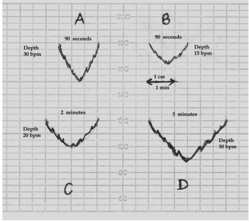
> **IBQ tip:** Look for the nadir of the dip to be perfectly synchronised with the contraction peak — the deceleration starts and ends with the contraction. Contrast with late decelerations, where the nadir is shifted rightward (delayed) relative to the contraction peak.

**Late decelerations** are the worrying ones. They begin after the contraction peak and return to baseline after the contraction ends — the nadir of the deceleration is delayed relative to the contraction peak. The mechanism: during a uterine contraction, intervillous blood flow temporarily decreases. In a well-perfused placenta, the fetus has sufficient oxygen reserve to tolerate this brief interruption. But in uteroplacental insufficiency — in pre-eclampsia, post-term pregnancy, intrauterine growth restriction, placental abruption — the placenta is already operating at marginal reserve. When contractions further reduce flow, fetal hypoxia occurs → chemoreceptors detect falling PO2 → vagal reflex → late deceleration. Late decelerations signal a struggling fetus. Persistent late decelerations with loss of variability are an ominous sign demanding urgent delivery.

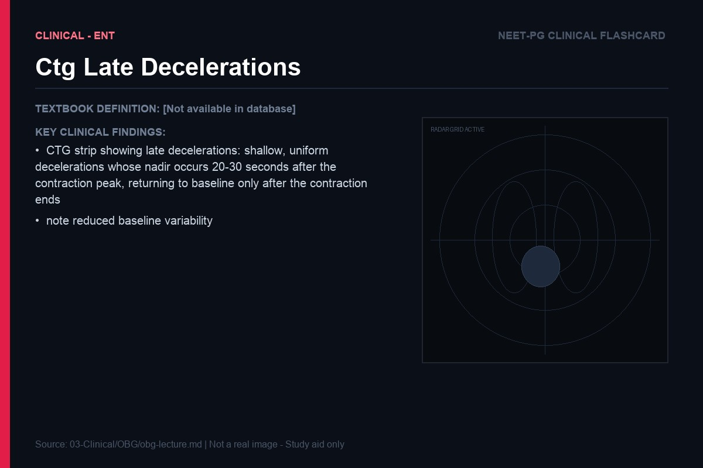
> **IBQ tip:** The key feature is the time delay — the dip starts AFTER the contraction peak and the heart rate does not recover until the contraction is over. Reduced baseline variability alongside late decelerations is especially ominous; early decelerations by contrast mirror the contraction with no time offset.

**Variable decelerations** have a variable relationship to contractions — they can occur anytime, are rapid in onset and offset, and are characteristically V-shaped or U-shaped. The mechanism is cord compression: when the umbilical cord is compressed (nuchal cord, cord prolapse, oligohydramnios reducing the fluid buffer around the cord), blood flow through the cord is transiently obstructed. The response is a baroreceptor-mediated vagal reflex causing rapid heart rate deceleration. Most variable decelerations are benign, but severe variables (lasting >60 seconds, falling below 60 bpm, with slow recovery) or those associated with loss of variability suggest the fetus is no longer compensating.

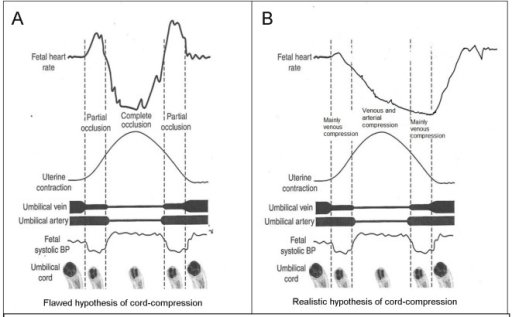
> **IBQ tip:** The hallmark is abruptness — the heart rate drops and returns nearly vertically on the trace. "Shoulders" (small accelerations flanking the dip) are reassuring and indicate intact autonomic response. Loss of shoulders or a slow return to baseline upgrades severity.

**Sinusoidal pattern** — a smooth, undulating sine-wave baseline with no variability, amplitude 5-15 bpm, frequency 2-5 cycles per minute, persisting for >20 minutes. It indicates severe fetal anemia (classically Rh isoimmunization, vasa previa bleeding, or fetomaternal hemorrhage).

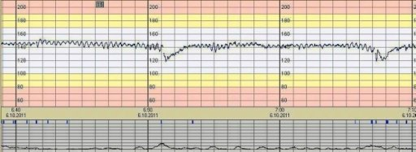
> **IBQ tip:** Normal CTG has an irregular, "fuzzy" baseline variability (6-25 bpm fluctuations). The sinusoidal pattern is pathologically smooth and regular — like a perfect sine wave — with complete absence of the normal beat-to-beat irregularity. It must be distinguished from a pseudosinusoidal pattern (induced by opioid analgesia), which is transient and has some preserved variability.

> **Key exam insight:** Late decelerations = uteroplacental insufficiency. They require position change (left lateral, to take the uterus off the inferior vena cava), oxygen, IV fluids, stopping oxytocin, and if persistent, delivery. Do not confuse them with early decelerations — the timing relative to the contraction is everything.

| Deceleration Type | Timing | Mechanism | Clinical Significance |
|---|---|---|---|
| Early | Mirrors contraction | Head compression → vagal reflex | Benign, physiological |
| Late | After contraction peak | Uteroplacental insufficiency → fetal hypoxia | Ominous, requires intervention |
| Variable | Unrelated to contractions | Cord compression → baroreceptor reflex | Variable — severity determines significance |

---

## Pre-eclampsia and Eclampsia

### Why the Placenta Goes Wrong: Failed Remodeling as the Root Cause

To understand pre-eclampsia, you must first understand normal placentation, because pre-eclampsia is fundamentally a disease of abnormal placentation. In the first trimester, cytotrophoblast cells from the developing placenta invade the maternal decidua and, critically, invade the walls of the maternal spiral arteries. This is trophoblastic invasion, and it is an extraordinary biological process: the trophoblasts migrate up inside the spiral arteries, replace the muscular and elastic wall components with fibrinoid material, and transform these arteries from narrow, high-resistance muscular vessels into wide, low-resistance flaccid conduits. By the end of the second trimester, the placental bed is perfused by a lake of maternal blood flowing at low pressure, high volume — ideal for nutrient and gas exchange across a vast surface area.

In pre-eclampsia, this remodeling is shallow and incomplete. The trophoblastic invasion fails to penetrate beyond the decidua into the myometrium. The spiral arteries retain their muscular walls, remain narrow and high-resistance, and vasoconstrict in response to normal vasopressors — behavior normal arteries have, but properly remodeled placental bed arteries should not. The result: placental perfusion is chronically reduced. The placenta is ischemic.

**Analogy:** Imagine trying to supply a large city (the growing fetus) through pipes that were supposed to be wide industrial mains but ended up as narrow household pipes. The city never gets enough water, especially as demand grows in the third trimester.

### The Cascade: From Ischemic Placenta to Systemic Disease

The ischemic placenta does not suffer in silence. It releases a cascade of factors into the maternal circulation that cause the systemic disease we recognize as pre-eclampsia. Two key mediators have been identified. **sFlt-1** (soluble FMS-like tyrosine kinase-1) is a truncated form of the VEGF receptor that is released by the ischemic placenta in excess quantities. It circulates freely, binding VEGF and PlGF (placental growth factor) and neutralizing them before they can reach their receptors. The result is a state of anti-angiogenic excess — maternal endothelial cells throughout the body are starved of the VEGF signals they need to maintain their integrity and function. **Soluble endoglin (sEng)** similarly blocks TGF-β signaling, further disrupting endothelial function.

The consequence is widespread endothelial dysfunction. And here is the key insight that ties the entire clinical picture together: every feature of pre-eclampsia can be explained by endothelial dysfunction.

**Hypertension:** Healthy endothelium produces nitric oxide (NO), the most potent vasodilator, to maintain vascular tone. Dysfunctional endothelium produces less NO and more vasoconstrictors like endothelin-1 and thromboxane A2. The balance tips toward vasoconstriction → blood pressure rises. In normal pregnancy, BP actually falls in the first and second trimesters because healthy endothelium is producing abundant NO in response to the hyperdynamic state of pregnancy. In pre-eclampsia, this fall doesn't happen — BP rises instead.

**Proteinuria:** The glomerular filtration barrier depends on healthy glomerular endothelium and the glycocalyx layer. In pre-eclampsia, glomerular endothelial cells swell (glomerular endotheliosis — the pathognomonic renal lesion of pre-eclampsia), the filtration barrier becomes leaky, and albumin spills into the urine. Proteinuria ≥300 mg/24h (or protein:creatinine ratio ≥0.3) defines the renal involvement.

**Edema:** Endothelial dysfunction increases capillary permeability. Fluid leaks from the intravascular space into the interstitium. But here is the paradox — pre-eclamptic women are simultaneously edematous (excess interstitial fluid) and volume-contracted (reduced intravascular volume). Giving large volumes of IV fluid is dangerous because the damaged endothelium cannot keep it intravascular — it will simply flood the interstitium and lungs.

**Clinical connection:** This is why fluid management in pre-eclampsia is a delicate balance. You restrict fluids to avoid pulmonary edema, but you maintain enough intravascular volume to protect renal perfusion. The goal is not generous hydration — it is careful, targeted fluid administration with frequent assessment of urine output.

### HELLP Syndrome: Endothelial Damage in Multiple Organs

HELLP syndrome (Hemolysis, Elevated Liver enzymes, Low Platelets) is not a separate disease — it is a severe manifestation of the same endothelial process, concentrated in the liver and microvascular beds. **Hemolysis** (the H) is microangiopathic: damaged endothelial surfaces cause red blood cells to fragment as they pass through — you see schistocytes on the peripheral smear, elevated LDH, and falling hemoglobin. **Elevated liver enzymes** (the EL) result from hepatic sinusoidal endothelial damage — fibrin deposits in the hepatic sinusoids obstruct blood flow, causing hepatocellular ischemia and necrosis. Subcapsular hematomas can form, and if they rupture, you have a catastrophic surgical emergency. **Low platelets** (the LP) occur because platelets are consumed at sites of endothelial damage throughout the microcirculation.

> **Key exam insight:** HELLP can occur without hypertension in up to 20% of cases, and can present postpartum. Always check LFTs and platelets in a woman with right upper quadrant or epigastric pain in the third trimester, even if her BP seems normal. The epigastric pain is hepatic capsule stretching from liver swelling or subcapsular hematoma.

The only definitive treatment for pre-eclampsia is delivery — removal of the placenta eliminates the source of anti-angiogenic factors. But the timing of delivery must balance maternal risk against fetal prematurity. At ≥37 weeks, delivery is appropriate for any pre-eclampsia. Before 37 weeks, the decision becomes agonizing — the more preterm the fetus, the higher the neonatal morbidity from prematurity; but the longer you delay, the higher the maternal risk from progressive disease.

### Eclampsia and the Role of Magnesium Sulfate

Eclampsia is the occurrence of generalized tonic-clonic seizures in a woman with pre-eclampsia who has no other cause for seizures. The pathophysiology involves cerebral endothelial dysfunction leading to loss of cerebrovascular autoregulation, cerebral vasospasm, focal ischemia, and potentially cerebral edema. The seizure is not primarily caused by hypertension — patients can seize at blood pressures well below 160/110. The endothelial dysfunction in cerebral vessels is the primary driver.

**Magnesium sulfate (MgSO4)** is the drug of choice for both prevention and treatment of eclamptic seizures, and understanding why requires understanding its mechanisms. Magnesium is an NMDA receptor antagonist — it blocks the glutamate-gated ion channel that plays a central role in seizure propagation. By blocking NMDA receptors, Mg2+ raises the seizure threshold. Additionally, magnesium reduces cerebral vasospasm by inhibiting smooth muscle contraction (calcium antagonism), improves placental blood flow, and has membrane-stabilizing effects that reduce neuronal excitability.

The Pritchard regimen remains widely used: 4g IV loading dose over 15-20 minutes (slow — rapid infusion causes cardiac arrest), followed by 1-2g/hour maintenance infusion. Monitor for toxicity: loss of patellar reflexes (earliest sign, at serum Mg2+ ~7-10 mEq/L) → respiratory depression (~12 mEq/L) → cardiac arrest (~15 mEq/L). Calcium gluconate (10ml of 10% solution IV) is the antidote and must be at the bedside.

> **Key exam insight:** MgSO4 is superior to diazepam, phenytoin, and other anticonvulsants for eclampsia. The MAGPIE trial established this definitively. It is NOT a general anticonvulsant — it specifically targets the cerebrovascular and NMDA-mediated pathways relevant to eclampsia.

| Feature | Pre-eclampsia | Severe Pre-eclampsia | Eclampsia | HELLP |
|---|---|---|---|---|
| BP | ≥140/90 | ≥160/110 | ≥140/90 (usually) | Variable |
| Proteinuria | ≥300mg/24h | Marked | Present | Variable |
| Seizures | Absent | Absent | Present | Absent |
| Platelets | Normal | May be low | May be low | <100,000 |
| LFTs | Normal | Elevated | Elevated | Markedly elevated |
| Treatment | Deliver ≥37 wks | Stabilize, deliver | MgSO4, deliver | Deliver (platelets if <50k before surgery) |

---

## Postpartum Hemorrhage

### The Living Ligature: Understanding How the Uterus Stops Its Own Bleeding

To understand postpartum hemorrhage (PPH), you must first understand how the postpartum uterus — which has been receiving 700-800 mL of blood per minute at term — normally stops that hemorrhage so efficiently that most women lose only 300-500 mL at a vaginal delivery. The answer is one of the most elegant mechanisms in obstetrics: the "living ligature."

The placenta is attached to the uterine wall at the placental bed, where the spiral arteries have been remodeled into large, open sinuses. After placental separation, these sinuses are open and gushing. But the uterine myometrium is not just a sac — it is a three-dimensional meshwork of interlacing muscle fibers, and those fibers run in every direction, surrounding the blood vessels from all angles. When the uterus contracts powerfully after delivery, these muscle fibers compress the blood vessels mechanically from all sides, occluding them as effectively as ligatures. No sutures needed — the uterus clots itself by contracting.

**Analogy:** Press your fist hard into a foam sponge threaded with rubber tubes — the tubes collapse completely. Release your fist, and they spring open. The myometrium works exactly this way. Contraction = vessel occlusion. Relaxation = hemorrhage.

This is why uterine atony — failure of the uterus to contract adequately after delivery — accounts for 70-80% of all PPH. And this is why every uterotonic drug we give (oxytocin, ergometrine, misoprostol, carboprost) is targeting the same endpoint: sustained myometrial contraction.

### The 4 Ts: A Mechanistic Framework for PPH

**Tone (Atony)** is the most common cause. Risk factors illuminate the mechanism: overdistension (twins, polyhydramnios, macrosomia) stretches the myometrial fibers and impairs their ability to contract efficiently; prolonged labor exhausts myometrial contractility; general anesthesia (especially halogenated agents) relaxes smooth muscle; grand multiparity (>5 pregnancies) leads to replacement of myometrium with fibrous tissue. Management proceeds in a stepwise fashion, escalating from least to most invasive.

Bimanual uterine massage stimulates mechanoreceptors that trigger contraction. **Oxytocin** (10-20 IU IV infusion or 10 IU IM) is first-line — it acts on myometrial oxytocin receptors (which have been upregulated near term) to cause sustained contraction. However, IV bolus oxytocin must be given slowly (never as a rapid bolus) because it causes transient but profound vasodilation and hypotension. **Ergometrine** (or methylergometrine) causes tetanic uterine contraction by acting on α-adrenergic receptors on myometrial cells — sustained, powerful, prolonged. It is contraindicated in hypertension (causes vasoconstriction → dangerous BP spike). **Misoprostol** (600-800 mcg sublingual or per rectum) is a prostaglandin E1 analogue — it causes sustained uterine contraction and can be used when IV access is unavailable, making it crucial in resource-limited settings. **Carboprost** (15-methyl PGF2α, 0.25 mg IM) is a prostaglandin F2α analogue — very effective, but contraindicated in asthma (causes bronchospasm) and relatively contraindicated in cardiac disease.

If medical management fails, surgical options escalate: **B-Lynch suture** (a brace suture that physically compresses the uterus), **uterine artery ligation**, **internal iliac artery ligation** (reduces pulse pressure to the uterine bed — does not eliminate flow), and finally **hysterectomy** (definitive). **Interventional radiology** with uterine artery embolization is available in centers with the capability and a hemodynamically stable patient.

**Clinical connection:** In any PPH, never wait for the patient to decompensate before escalating. A young, healthy woman can compensate dramatically (maintaining BP until 30-40% of blood volume is lost) — her apparent stability is deceptive. The time to transfuse and escalate management is when the bleeding is recognized, not when she goes into shock.

**Trauma** — the second T — includes lacerations of the cervix, vagina, and perineum. These are the cause when the uterus is well-contracted (tone is present) but bleeding continues. Inspect methodically under good lighting: the cervix at 3 and 9 o'clock where the uterine arteries are closest, the vaginal sidewalls, the perineum. Hematomas are deceptive — a paravaginal or broad ligament hematoma can accumulate 1-2L of blood with minimal external bleeding and only a tense, painful mass on examination. Uterine rupture — most commonly in a scarred uterus (previous cesarean) with oxytocin augmentation — presents with sudden cessation of contractions, fetal bradycardia, and abdominal pain. It requires immediate surgical repair.

**Tissue** — retained placenta or membranes. The placenta normally separates within 30 minutes of delivery. If it doesn't (placenta accreta, where trophoblasts abnormally invade the myometrium; or simply an adherent placenta), it must be removed manually or surgically. Placenta accreta spectrum (accreta, increta, percreta) has become more common as cesarean rates rise — the cesarean scar is the most common site of abnormal placentation. These can require cesarean hysterectomy.

**Thrombin** — coagulopathy. This can be the primary cause (women with inherited coagulation disorders, ITP, HELLP-related thrombocytopenia, or abruption-related DIC arriving in labor already coagulopathic) or, more dangerously, can develop as a consequence of massive hemorrhage. As massive bleeding continues, coagulation factors are consumed and diluted (especially when replaced only with packed red cells). The vicious cycle: hemorrhage → hemorrhagic shock → hepatic ischemia → impaired factor synthesis → worsening coagulopathy → more bleeding → deeper shock. This is why massive transfusion protocols use fixed ratios of packed red cells:fresh frozen plasma:platelets (typically 1:1:1) — you replace coagulation capacity alongside oxygen-carrying capacity.

> **Key exam insight:** The most common cause of PPH is uterine atony. The single most effective prevention is active management of the third stage: oxytocin 10 IU IM within 1 minute of delivery, controlled cord traction, and uterine massage. This reduces PPH incidence by 60% compared to expectant management.

---

## Gynecological Cancers

### Cervical Cancer: The HPV Story

Cervical cancer is perhaps the most preventable cancer in medicine — it has a known causative agent, a long precancerous phase that is detectable, and an effective vaccine. Understanding it requires understanding the biology of human papillomavirus.

HPV is a small, non-enveloped DNA virus. Over 100 serotypes exist, but types 16 and 18 together cause approximately 70% of cervical cancers (high-risk types: 16, 18, 31, 33, 45). The virus infects the basal cells of the cervical epithelium at the transformation zone — the area where the columnar endocervical epithelium meets the stratified squamous ectocervical epithelium (the squamocolumnar junction, or SCJ). This junction migrates during life: in adolescence and pregnancy, hormonal stimulation causes columnar epithelium to evert onto the ectocervix, where it undergoes squamous metaplasia (conversion to squamous epithelium through exposure to the vaginal environment). Cells in the process of squamous metaplasia are biologically vulnerable — their DNA replication machinery is active, making them susceptible to viral integration.

The two critical HPV oncoproteins are E6 and E7. **E6** binds to and promotes the ubiquitin-mediated degradation of **p53**. p53 is the "guardian of the genome" — a tumor suppressor that halts the cell cycle when DNA damage is detected and, if damage is irreparable, triggers apoptosis. With p53 eliminated, cells with damaged DNA continue dividing rather than dying. **E7** binds to and inactivates **Rb** (retinoblastoma protein). Rb is the "brake" on the cell cycle — it normally sequesters E2F transcription factors, keeping the cell in G1 phase. When E7 inactivates Rb, E2F is released, driving cells into S phase (DNA synthesis) regardless of whether conditions are appropriate. The result: accelerated, uncontrolled cell cycle progression in cells that also lack the p53 checkpoint. This is the molecular engine of carcinogenesis.

**Analogy:** Imagine a city's nuclear power plant. p53 is the automatic shutdown system — when sensors detect a problem, it shuts the reactor down. Rb is the permission key required to start the reactor. E6 destroys the shutdown system. E7 steals the permission key and jams it in the "on" position. Now the reactor runs uncontrolled.

The progression from normal cervix to invasive cancer is not abrupt — it takes 10-20 years. Cervical intraepithelial neoplasia (CIN) represents the precancerous stage. CIN 1 (mild dysplasia) — low-grade squamous intraepithelial lesion (LSIL) — represents productive HPV infection, with koilocytes (cells with perinuclear halos) visible on histology. Most CIN 1 regresses spontaneously. CIN 2/3 (moderate/severe dysplasia) — high-grade SIL (HSIL) — represents integration of HPV DNA into the host genome, loss of E2 (the viral gene that suppresses E6/E7), and uncontrolled E6/E7 expression. CIN 3 (carcinoma in situ) has a significant risk of progressing to invasion, particularly with HPV 16/18.

### The Pap Smear and Colposcopy Logic

The Pap smear is a sampling of cells from the transformation zone — specifically, cells shed from the SCJ and the endocervical canal. You are looking for nuclear atypia: enlarged, irregular, hyperchromatic nuclei with increased nuclear-to-cytoplasmic ratio. These are the morphological correlates of the dysregulated cell cycle driven by E6/E7. Bethesda system classification: ASCUS (atypical squamous cells of undetermined significance), LSIL, HSIL, and (rarely) carcinoma.

**Clinical connection:** A single abnormal Pap smear does not mean cancer — it means you need to look more closely. Colposcopy (magnified examination of the cervix with acetic acid and Lugol's iodine) identifies areas of acetowhite change (abnormal cells lose glycogen and don't stain brown with iodine — Schiller's test), mosaic pattern, punctation, and atypical vessels. These areas are biopsied. Only the biopsy provides histological diagnosis.

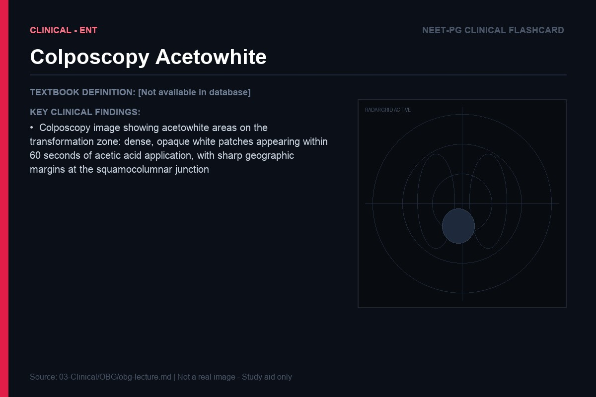
> **IBQ tip:** Dense, opaque acetowhitening that appears rapidly and persists is higher grade than thin, translucent whitening that fades quickly. The borders matter — geographic, sharp-edged acetowhite areas close to the SCJ are more suspicious than diffuse, fading whitening away from the junction.

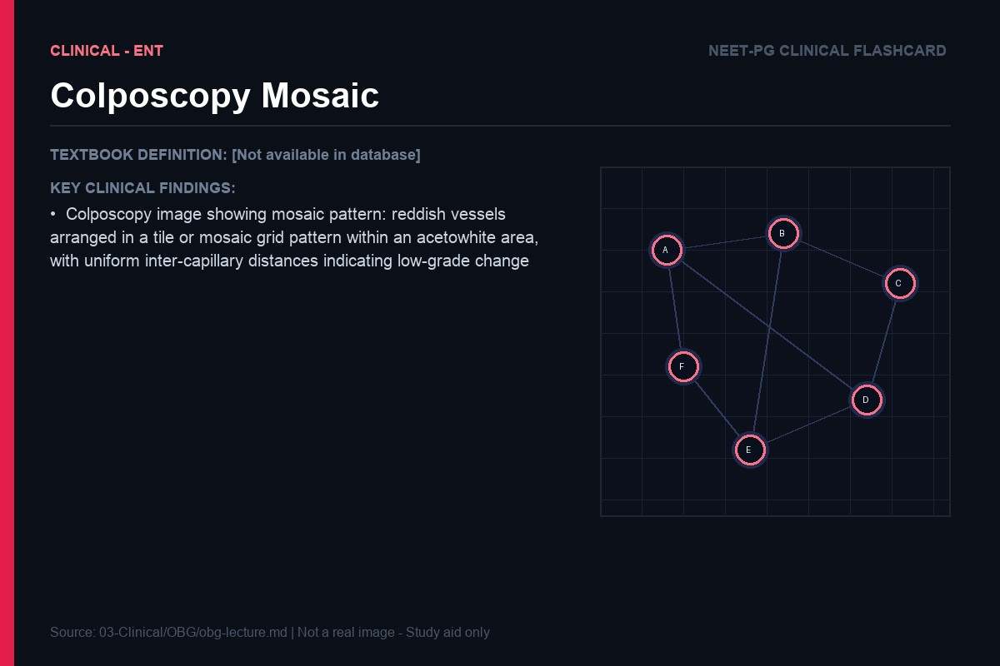
> **IBQ tip:** Coarse mosaic (irregular, widely spaced blocks with varying inter-capillary distances) suggests high-grade CIN or invasion; fine mosaic (regular, small, uniform blocks) is low-grade. Distinguish from punctation by the pattern — mosaic forms a 2D grid, punctation forms isolated red dots (punctate capillaries seen end-on).

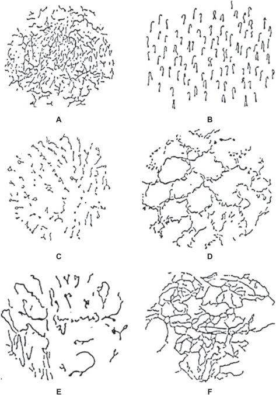
> **IBQ tip:** Coarse punctation — irregular, widely separated, large red dots with varying inter-dot distances — indicates high-grade CIN. Fine punctation is regular and small. Both differ from mosaic in that punctation shows individual dots rather than a polygonal grid.

> **IBQ tip:** In Schiller's test, "positive" test (Schiller-positive) means the area FAILS to stain — it remains pale yellow/mustard — and is abnormal. Normal squamous epithelium is glycogen-rich and stains dark brown. Do not confuse the naming convention: iodine-negative = Schiller-positive = abnormal.

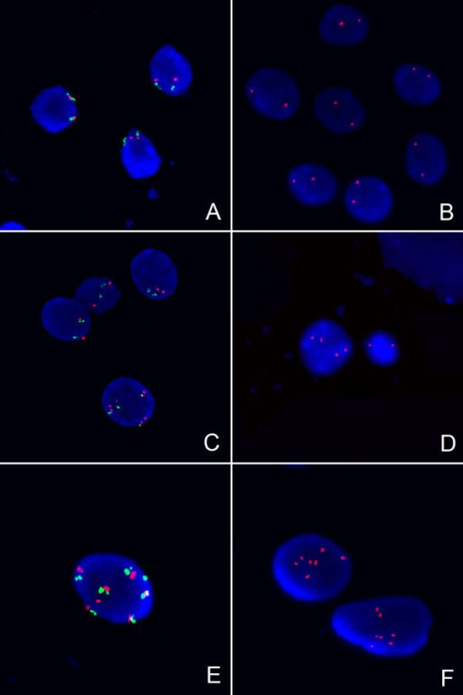
> **IBQ tip:** The fraction of the epithelial thickness replaced by immature, dysplastic cells defines the CIN grade — CIN I = lower third, CIN II = lower two-thirds, CIN III = full thickness (carcinoma in situ). Koilocytes (the HPV cytopathic effect) are most prominent in CIN I/II and represent productive viral infection.

> **IBQ tip:** The basement membrane remains intact in CIN III — this is the single feature that distinguishes CIN III from invasive carcinoma. Once the dysplastic cells breach the basement membrane and enter the stroma, the lesion is invasive carcinoma regardless of extent.

The HPV vaccine (Gardasil 9, nonavalent) is the primary prevention strategy. It is most effective when given before sexual debut (before HPV exposure). In India, it is recommended for girls aged 9-14, with a two-dose schedule. The vaccine does not treat existing HPV infection — it prevents new infection. Girls and women who have received the vaccine still need cervical screening, because the vaccine does not cover all oncogenic HPV types.

### Endometrial and Ovarian Cancers

Endometrial cancer divides into two pathogenetically distinct types. **Type I** (endometrioid, 80% of cases) is driven by unopposed estrogen — estrogen stimulates endometrial proliferation, and without the counterbalancing maturation signal from progesterone (as occurs when ovulation is absent, as in PCOS, or with exogenous estrogen use without progesterone), the endometrium proliferates abnormally. The pathway: simple hyperplasia → complex hyperplasia → atypical hyperplasia → invasive endometrioid carcinoma. Risk factors (obesity, PCOS, tamoxifen use, nulliparity, late menopause) all share the common mechanism of relative estrogen excess. Protective factors (oral contraceptive use, multiparity) share the mechanism of regular progesterone exposure.

**Type II** endometrial cancer (serous, clear cell) is not driven by estrogen. It arises in atrophic endometrium, typically in older women, through a TP53 mutation pathway. It is far more aggressive, typically presenting at advanced stage, with a much worse prognosis.

The classic symptom of endometrial cancer is **postmenopausal bleeding** — any bleeding after 12 months of amenorrhea demands endometrial sampling. In premenopausal women, intermenstrual or heavy bleeding in the context of PCOS or obesity should prompt evaluation. Transvaginal ultrasound showing endometrial thickness >4mm (postmenopausal) or suspicious irregularity warrants pipelle biopsy or hysteroscopy.

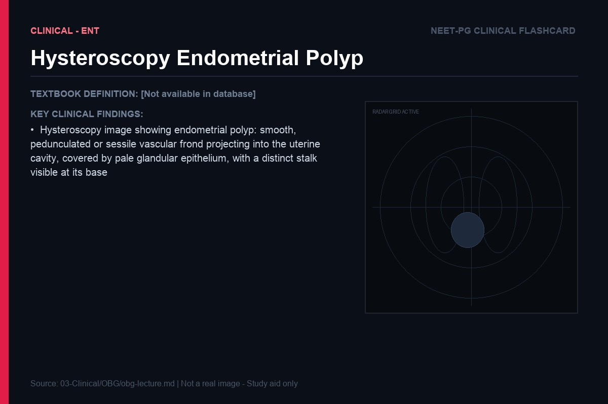
> **IBQ tip:** A polyp is a focal, smooth projection with a stalk — compare with a submucous fibroid, which is a broad-based, firm, white/pale mass that distorts the cavity contour but has no stalk. On hysteroscopy, polyps are soft and move with fluid irrigation; fibroids are hard and immobile.

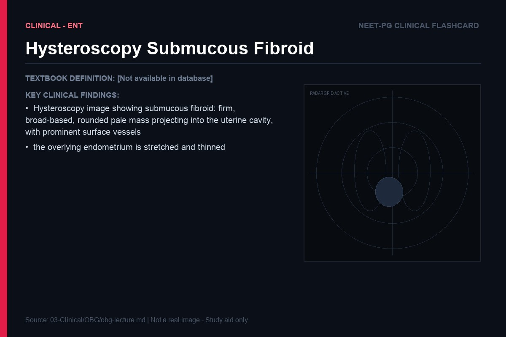
> **IBQ tip:** The key distinguishing feature from a polyp is the surface texture and firmness — fibroids appear white/pale with a harder contour and distort the cavity without a clear stalk. Polyps are softer, more vascular-appearing (pinkish), and have a defined stalk.

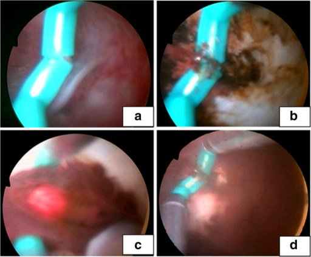
> **IBQ tip:** On hysteroscopy, a septum is a pale, avascular midline ridge. On 3D ultrasound or MRI (the gold standard distinguishing test), a septum shows a flat or concave external fundal contour, whereas a bicornuate uterus shows a convex external fundal notch >10 mm deep.

Ovarian cancer is the "silent killer" because it has no screening test of proven efficacy and presents late. The majority (75%) present at Stage III or IV, when 5-year survival is only 20-30%. Understanding the risk factors requires understanding the ovulatory theory: every ovulation causes a small injury to the ovarian surface epithelium, which must be repaired by cell division. Repeated cell division = cumulative DNA replication errors = cancer risk. Hence: high parity, prolonged OCP use, breastfeeding (all reduce lifetime ovulations) are protective. Early menarche, late menopause, nulliparity increase risk. BRCA1/2 mutations dramatically increase ovarian cancer risk (BRCA1: 40-60% lifetime risk; BRCA2: 15-20% lifetime risk) — these warrant risk-reducing bilateral salpingo-oophorectomy at 35-40 after childbearing is complete.

> **Key exam insight:** CA-125 is elevated in 80% of ovarian cancers but is NOT a screening test — its specificity is too low (elevated in endometriosis, fibroids, PID, even normal menstruation). It is used for monitoring response to treatment and detecting recurrence in known ovarian cancer patients. The most common ovarian tumor in India is the serous cystadenoma (benign); the most common malignant ovarian tumor is serous cystadenocarcinoma.

| Cancer | Classic Presentation | Key Risk Factor | Key Protective Factor | Primary Treatment |
|---|---|---|---|---|
| Cervical | Postcoital bleeding, vaginal discharge | HPV 16/18, multiple partners | HPV vaccine, barrier contraception | Surgery (early), chemoradiation (advanced) |
| Endometrial (Type I) | Postmenopausal bleeding | Obesity, unopposed estrogen | OCP use, multiparity | Total hysterectomy + BSO |
| Ovarian | Vague abdominal symptoms, late presentation | BRCA mutation, nulliparity | OCP use, multiparity | Surgery + chemotherapy (platinum + taxane) |

---

## Antepartum Hemorrhage and Placental Abnormalities

### Placenta Previa: When the Placenta Misses Its Address

The placenta implants wherever the blastocyst lands, and normally this is in the upper uterine segment, away from the internal cervical os. In placenta previa, the placenta implants low in the uterus, partially or completely covering the internal os. As the lower uterine segment forms in the third trimester (a physiological process of progressive thinning and elongation), the lower segment and cervix dilate away from the placenta, causing placental separation and maternal bleeding.

The classic presentation is **painless, bright red, antepartum hemorrhage** in the third trimester, often beginning with a "warning bleed" — a modest, self-limited bleed that can be the only opportunity to diagnose and plan management before a massive hemorrhage. The painlessness distinguishes it from placental abruption (painful). The management principle: if the patient is stable and preterm, conservative management (hospitalization, corticosteroids for lung maturity, blood transfusion as needed) to delay delivery. The definitive delivery is by cesarean section — vaginal delivery is impossible when the placenta blocks the cervical os.

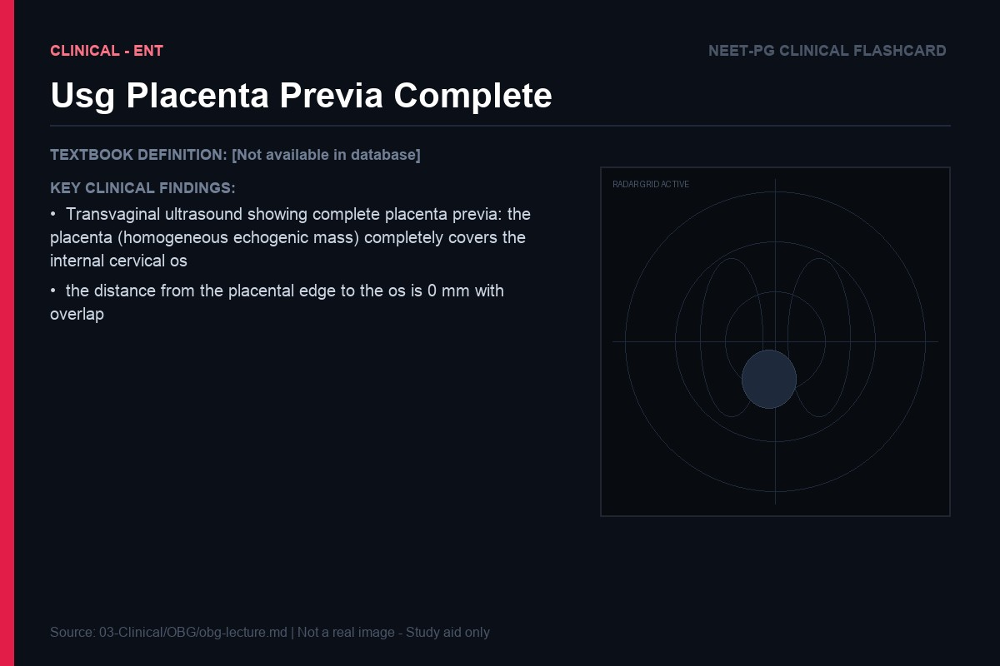
> **IBQ tip:** On TVUSS, complete previa shows placental tissue overlying the internal os (the os appears as the V-shaped notch at the cervical canal end). Low-lying placenta is defined as the placental edge within 2 cm of the os without covering it; marginal previa means the edge just reaches the os. The measurement is from the leading edge of the placenta to the centre of the os.

> **IBQ tip:** The retroplacental clear (hypoechoic) zone is the normal sonographic landmark separating placenta from myometrium. Its disappearance — especially combined with irregular lacunae within the placenta and reduced myometrial thickness (<1 mm) — is the most reliable USS sign of placenta accreta. Colour Doppler shows turbulent intraplacental flow within the lacunae.

**Analogy:** The placenta is like a doormat blocking the only exit. The baby cannot leave the building without disturbing it.

### Placental Abruption: Separation at the Wrong Time

Placental abruption is premature separation of a normally implanted placenta from the uterine wall. The mechanism: rupture of maternal spiral arteries in the decidua basalis → retroplacental hematoma → expansion of hematoma → progressive placental separation → fetal compromise. Risk factors include hypertension (damaged vessels), trauma (sudden deceleration), smoking (vasoconstriction and thrombosis), cocaine use (severe vasospasm), and prior abruption (50% recurrence risk).

The classic presentation is **painful, dark red antepartum hemorrhage**, with a "woody-hard" uterus on palpation (uterine irritability from blood infiltrating the myometrium) and fetal heart rate abnormalities (late decelerations, bradycardia) indicating fetal compromise. But 20% of abruptions are concealed — the blood does not escape through the cervix but accumulates behind the placenta. These are more dangerous because the severity of bleeding is not apparent externally.

The consumptive coagulopathy of abruption is particularly severe — placental thromboplastin enters the maternal circulation, triggering widespread fibrin deposition and DIC. A large abruption can consume enough fibrinogen that the maternal blood simply does not clot.

> **Key exam insight:** In abruption with DIC, the priority is delivery (to stop the ongoing release of thromboplastin from the separating placenta) and aggressive replacement of coagulation factors (FFP, cryoprecipitate for fibrinogen, platelets). Fibrinogen level <150 mg/dL is a trigger for cryoprecipitate. Do not wait for the full DIC panel before treating — treat empirically.

---

*These notes are intended as a conceptual framework for examination preparation. The physiology-first approach will allow you to reconstruct management decisions from first principles rather than relying on memorized lists.*

---

## Infertility

### What Conception Actually Requires: A Checklist Built from First Principles

Infertility is defined as failure to conceive after 12 months of regular, unprotected intercourse (6 months if the woman is over 35). Before diving into causes, step back and ask: what does a successful conception require? Work through it logically, and you have a built-in framework for investigation.

**First:** sperm must be produced, in adequate numbers and with sufficient motility and normal morphology. **Second:** sperm must be deposited vaginally and be capable of traversing the cervical mucus. **Third:** the fallopian tube must be patent, and capable of transporting both sperm (upward, to the ampulla) and the embryo (downward, to the uterine cavity). **Fourth:** ovulation must occur — a mature egg must be released at the right time. **Fifth:** fertilization must occur in the ampulla of the tube. **Sixth:** the fertilized egg must undergo normal early cell division. **Seventh:** the endometrium must be receptive — adequately thickened and properly prepared by progesterone — to allow implantation. **Eighth:** implantation must succeed, trophoblast invasion must occur, and early pregnancy must be maintained by the corpus luteum (and later the placenta).

Each of these steps is a potential failure point. Infertility is the clinical manifestation of a failure at one or more of these steps. Let that structure guide your history, examination, and investigation.

**Male factor infertility** accounts for approximately 40% of cases — nearly equal to female factor (another 40%), with the remaining 20% being unexplained or combined. This is a clinically important fact: when a couple presents for infertility investigation, the male partner must be investigated from day one, not as an afterthought after the female workup is complete. Semen analysis is cheap, non-invasive, and immediately informative.

Understanding semen analysis parameters requires understanding what each parameter reflects physiologically. **Sperm count** (normal: ≥15 million/mL, or ≥39 million per ejaculate) reflects the efficiency of spermatogenesis — the production of sperm from spermatogonia in the seminiferous tubules, a process driven by follicle-stimulating hormone (FSH) acting on Sertoli cells, and testosterone (produced by Leydig cells under LH stimulation). Azoospermia (no sperm) can be obstructive (the testes produce sperm but the ductal system is blocked — post-vasectomy, post-infection, congenital bilateral absence of the vas deferens in cystic fibrosis carriers) or non-obstructive (testicular failure — primary hypogonadism, Klinefelter syndrome, cryptorchidism). The distinction matters enormously: obstructive azoospermia can sometimes be corrected surgically; non-obstructive azoospermia requires donor sperm or microdissection testicular sperm extraction (microTESE) for IVF.

**Sperm motility** (normal: ≥40% total motility, ≥32% progressive motility) reflects the energy production capacity of the sperm's midpiece, which contains a helical arrangement of mitochondria. These mitochondria power the dynein ATPase motors that drive the axoneme (the flagellar core) to produce the whip-like movement that propels the sperm. Asthenospermia (poor motility) can result from mitochondrial dysfunction, reactive oxygen species damage (oxidative stress from infection, varicocele, smoking, heat exposure), or structural axonemal defects (Kartagener's syndrome — primary ciliary dyskinesia, where a dynein arm defect impairs both sperm motility and airway ciliary function, presenting as bronchiectasis + situs inversus + infertility).

**Sperm morphology** (assessed by Kruger strict criteria — normal: ≥4% normal forms) reflects the fidelity of the spermiogenesis process, where round spermatids differentiate into mature spermatozoa with their characteristic oval head (containing the acrosome, which carries enzymes for zona pellucida penetration), midpiece, and tail. Teratospermia (abnormal morphology) is the most common semen abnormality and is associated with failure of zona binding and fertilization.

**Analogy:** Think of semen analysis as a quality-control report from a factory. Count tells you the production volume. Motility tells you whether the finished products can actually do their job. Morphology tells you whether they were manufactured to spec. A factory can fail on any one or all three parameters — and each failure has different root causes.

### Female Factor: The Hormone Axis and Why Ovulation Fails

The ovulatory cycle is orchestrated by a precisely timed hormonal cascade. The hypothalamus releases GnRH in pulses → the pituitary responds with FSH and LH secretion → FSH acts on granulosa cells of the developing follicle → granulosa cells proliferate and produce estrogen → rising estrogen feeds back positively on the pituitary (the positive feedback switch occurs at around day 12-13 when estrogen rises above a threshold for 24-36 hours) → the pituitary generates the LH surge → the LH surge triggers ovulation (rupture of the dominant follicle) and luteinization of the remaining granulosa cells → the corpus luteum produces progesterone → progesterone prepares the endometrium for implantation.

**PCOS (Polycystic Ovary Syndrome)** is the most common cause of ovulatory dysfunction, accounting for 70-80% of anovulatory infertility. Understanding it requires tracing the pathophysiology through the axis. The core abnormality is excess androgen production — from the theca cells of ovarian follicles and from the adrenal glands. Several mechanisms converge: insulin resistance (present in 60-80% of PCOS women, related to intrinsic signaling defects in insulin receptor pathways) → hyperinsulinemia → excess insulin acts synergistically with LH on theca cells → excess androgen production. The excess androgens are aromatized to estrogens in peripheral adipose tissue, creating a state of chronic, non-cyclical estrogen exposure. This sustained estrogen does not produce the sharp peak needed for positive feedback → no LH surge → no ovulation. The follicles begin to develop (FSH is not profoundly deficient) but stall before reaching maturity, accumulating as the subcortical "cysts" (really arrested antral follicles) visible on ultrasound — the so-called "necklace sign."

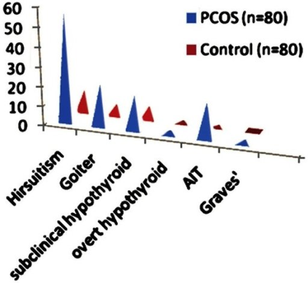
> **IBQ tip:** The follicles in PCOS are arranged at the periphery (subcortical) around an echogenic, enlarged stroma — this peripheral arrangement creates the necklace/string-of-pearls pattern. A normal ovary has follicles scattered throughout the parenchyma without this subcortical predominance. Rotterdam criteria requires ≥20 follicles per ovary OR ovarian volume >10 mL.

The LH/FSH ratio >2 in PCOS reflects the tonic LH elevation (driven by the chronic estrogen milieu) and the relatively suppressed FSH (suppressed by estrogen, with no cyclical rise). High LH further stimulates theca cells → more androgens → the cycle perpetuates itself. Insulin resistance makes this worse: hyperinsulinemia also suppresses SHBG (sex hormone binding globulin), increasing free androgen bioavailability.

> **Key exam insight:** PCOS diagnosis uses the Rotterdam criteria (two of three): oligo/anovulation, clinical or biochemical hyperandrogenism, polycystic ovarian morphology on ultrasound (≥20 follicles per ovary OR ovarian volume >10 mL). Clomiphene citrate (an estrogen receptor antagonist that blocks hypothalamic negative feedback → increases FSH → stimulates follicular development) is first-line ovulation induction. Letrozole (aromatase inhibitor — reduces estrogen → releases FSH inhibition) is now preferred in PCOS for higher live birth rates. Metformin addresses the insulin resistance component, improving cycle regularity and potentiating ovulation induction.

**Tubal factor infertility** is the consequence of pelvic inflammatory disease (PID, most commonly from Chlamydia trachomatis or Neisseria gonorrhoeae) — infection causes salpingitis → tubal scarring → blockage or damage of the ciliated epithelium that transports the egg. Hysterosalpingography (HSG) — contrast injected through the cervix, with X-ray imaging — demonstrates tubal patency or obstruction. Laparoscopy remains the gold standard for tubal and peritoneal assessment.

**Clinical connection:** Unexplained infertility (20% of couples) is, in many cases, not truly unexplained — it likely reflects subtle defects in gamete quality, fertilization, or implantation that our current investigations cannot detect. These couples are candidates for IUI (intrauterine insemination — depositing processed sperm directly into the uterus, bypassing cervical barriers and reducing the journey sperm must make) or IVF (in vitro fertilization — retrieving eggs, fertilizing with sperm in the lab, and transferring embryos directly to the uterus).

---

## Contraception

### The Combined Oral Contraceptive Pill: Three Mechanisms, One Tablet

The combined oral contraceptive pill (COCP) is the most widely prescribed hormonal contraceptive, and understanding its mechanism from first principles makes it impossible to confuse with other methods. The COCP contains two synthetic hormones: an **estrogen** (most commonly ethinylestradiol) and a **progestogen** (various: levonorgestrel, norethisterone, desogestrel, drospirenone). Each component contributes distinct mechanisms.

**Estrogen's primary action:** suppression of FSH. Recall that FSH is the signal that drives follicular development — without FSH stimulation, no follicle develops to dominance, no egg matures. The exogenous estrogen in the pill tells the pituitary "there is already adequate estrogen — no need to stimulate follicle development." The pituitary reduces FSH secretion, follicular development is suppressed, and without a developing follicle, there is no estrogen rise, no LH surge, and no ovulation.

**Progestogen's primary actions are multiple:** (1) suppression of the LH surge — even if a follicle were somehow developing (due to a missed pill), the progestogen suppresses the LH surge that would trigger ovulation; (2) thickening of cervical mucus — progestogen acting on the cervical glands causes them to produce a thick, viscous, hostile mucus rather than the clear, stretchy, sperm-permeable "egg-white" mucus of the mid-cycle (the progestogen essentially builds a physical barrier at the cervix — sperm cannot penetrate); (3) thinning of the endometrium — progestogen causes endometrial gland regression and stroma decidualization followed by atrophy, making the endometrium hostile to implantation even if breakthrough ovulation and fertilization were to occur.

**Analogy:** Think of the COCP as a triple lock. The estrogen deadbolts the factory door (no follicle development). The progestogen locks the gate (no LH surge, no ovulation) and bolts the entrance (hostile mucus). And the thin endometrium removes the welcome mat (poor implantation site). An embryo would have to pick three independent locks simultaneously.

**Why progestogen-only pills (POPs, or the "mini-pill") are preferred in breastfeeding women:** estrogen-containing contraceptives suppress prolactin secretion. Prolactin — produced by the anterior pituitary — is the primary driver of milk production (lactogenesis). The exogenous estrogen in COCPs reduces prolactin levels and can significantly reduce breast milk supply in lactating women. Progestogen-only preparations (POPs, DMPA injection, LNG-IUS) have no significant effect on prolactin and are therefore safe to use during breastfeeding without compromising milk supply.

**Intrauterine Contraceptive Devices:** The IUCD family divides into two fundamentally different mechanisms. **Copper IUDs (Cu-IUD):** copper ions released from the copper surface of the device are directly **spermicidal** — copper disrupts sperm enzyme activity, impairs mitochondrial function (reducing sperm motility), and induces an acrosomal reaction prematurely (rendering the sperm incapable of fertilizing the egg). In addition, copper triggers a sterile inflammatory reaction in the endometrium — macrophages and neutrophils infiltrate the endometrial stroma, creating an inhospitable environment. The combined effect is a highly effective barrier at the level of sperm function and implantation. The copper IUD is also the most effective emergency contraceptive available (>99% effective if inserted within 5 days of unprotected intercourse) — because even if fertilization has occurred, the inflammatory endometrial environment prevents implantation.

**Hormonal IUDs (LNG-IUS, e.g., Mirena):** release a small, sustained dose of levonorgestrel (a progestogen) locally into the uterine cavity. The local progestogen has two main effects: (1) it thickens cervical mucus (the same mechanism as POPs — hostile to sperm penetration), and (2) it causes endometrial atrophy — the endometrium becomes thin, glandularly suppressed, and incapable of supporting implantation. The LNG-IUS has the additional benefit of dramatically reducing menstrual blood loss (it is licensed for menorrhagia as well as contraception) — by atrophying the endometrium, it reduces the amount of tissue shed. Ovulation is usually not suppressed (systemic progestogen levels are very low), which distinguishes it mechanistically from systemic hormonal methods.

> **Key exam insight:** Cu-IUD failure rate: ~0.8% per year. LNG-IUS failure rate: ~0.2% per year (one of the most effective reversible contraceptives available). Both are effective immediately after insertion. Neither requires user compliance after placement — a major advantage over pills requiring daily adherence.

---

## Ectopic Pregnancy

### Why the Tube Cannot Sustain a Pregnancy: The Decidua Principle

An ectopic pregnancy — a pregnancy implanting outside the uterine cavity, most commonly (95%) in the fallopian tube — is one of the true obstetric emergencies. To understand why it is dangerous, and why it is almost always doomed, you must understand what the endometrium does that the fallopian tube cannot.

When a fertilized embryo arrives in the uterus, the progesterone-primed endometrial stroma undergoes a transformation called the **decidual reaction** — stromal fibroblasts enlarge, accumulate glycogen and lipid, and become decidual cells. The decidua serves two functions: it nourishes the early embryo (through secretion of glycogen, growth factors, and cytokines) and it controls the depth of trophoblast invasion (decidual cells resist and regulate the invasive trophoblast, preventing it from burrowing too deeply into the uterine wall). The uterus, in other words, has evolved to host a pregnancy — it provides nutrition and manages invasion.

The fallopian tube has no decidual reaction. Its wall is thin (1-2 mm), composed of a delicate epithelium and a small amount of smooth muscle — there is no thick decidua to nourish the embryo or to limit trophoblast invasion. When the embryo implants in the tube, the trophoblast — doing what trophoblast does — invades. With no decidua to restrain it, the trophoblast invades the thin tubal wall directly, eroding into subepithelial blood vessels. The tube begins to bleed (causing the pelvic pain). As the trophoblast continues to erode, the thin muscular wall of the tube is breached — tubal rupture, typically at 6-8 weeks, causing sudden, catastrophic intraperitoneal hemorrhage.

**Analogy:** Imagine trying to grow a fig tree (the embryo) in a pot designed for cacti (the fallopian tube). The pot is too small, has no soil depth, and has walls too thin to contain the roots. The tree's roots will break the pot.

The **classic triad** of ectopic pregnancy — amenorrhea (typically 6-8 weeks), lower abdominal pain (from peritoneal irritation by tubal blood), and vaginal bleeding (from the poorly supported ectopic trophoblast sloughing irregular fragments of uterine lining under the influence of inadequate hormonal support) — is present in only 50% of cases. Many ectopics present atypically, which is why any woman of reproductive age with pelvic pain and a positive pregnancy test must be presumed ectopic until proven otherwise.

**The β-hCG discriminatory zone:** In a normal intrauterine pregnancy, β-hCG rises by at least 66% every 48 hours (doubling time approximately 48 hours) as the trophoblast proliferates rapidly in the well-supported, well-nourished uterine environment. In ectopic pregnancy, the trophoblast is poorly implanted — it is invasive but not well-supplied, and the tube cannot support the same exponential proliferation. The result is a **sluggishly rising or plateauing β-hCG** — suboptimal doublings, often rising by only 20-50% in 48 hours.

The **discriminatory zone** is the β-hCG level above which an intrauterine pregnancy should be visible on transvaginal ultrasound. Typically set at 1500-2000 mIU/mL for transvaginal ultrasound. If β-hCG exceeds the discriminatory zone and no intrauterine pregnancy is seen on TVUSS, ectopic pregnancy (or a failed pregnancy) must be strongly suspected. A "pregnancy of unknown location" (PUL) — positive β-hCG with no visible intrauterine or ectopic pregnancy on ultrasound — is a common and challenging clinical scenario, managed with serial β-hCG measurements and repeated ultrasound.

> **IBQ tip:** The adnexal ring sign is an echogenic ring separate from the ovary — this is the key distinguishing feature from a corpus luteum cyst, which is within the ovary and surrounded by ovarian stroma. Free fluid (blood) in the Pouch of Douglas alongside an empty uterus and a positive βhCG makes ectopic the working diagnosis until proven otherwise.

**Management** depends on hemodynamic stability and clinical presentation. **Surgical:** laparoscopic salpingectomy (removal of the affected tube) is the standard for ruptured or unstable ectopics. Salpingostomy (incision into the tube to remove the pregnancy, preserving the tube) may be considered if the contralateral tube is damaged and future fertility is critical — but carries a higher risk of persistent trophoblast and recurrent ectopic. **Medical:** methotrexate (a folic acid antagonist that inhibits dihydrofolate reductase → impairs rapidly dividing cells, especially trophoblast) is appropriate for unruptured, hemodynamically stable ectopics meeting specific criteria: β-hCG <5000 mIU/mL, no fetal cardiac activity, ectopic mass <4 cm, no contraindications (renal/hepatic disease, immunodeficiency, active pulmonary disease). Success rate with single-dose methotrexate: approximately 90%.

> **Key exam insight:** Risk factors for ectopic pregnancy are all conditions that impair tubal transport: previous PID (tubal scarring → impaired ciliary transport of the embryo → embryo implants in the tube), previous ectopic, tubal surgery, endometriosis (pelvic adhesions distorting tubal anatomy), IUD in situ (prevents intrauterine implantation but not ectopic implantation), and IVF (multiple embryos transferred, some may migrate into the tube — heterotopic pregnancy, simultaneous intrauterine and ectopic pregnancy, a rare but important complication of ART).
