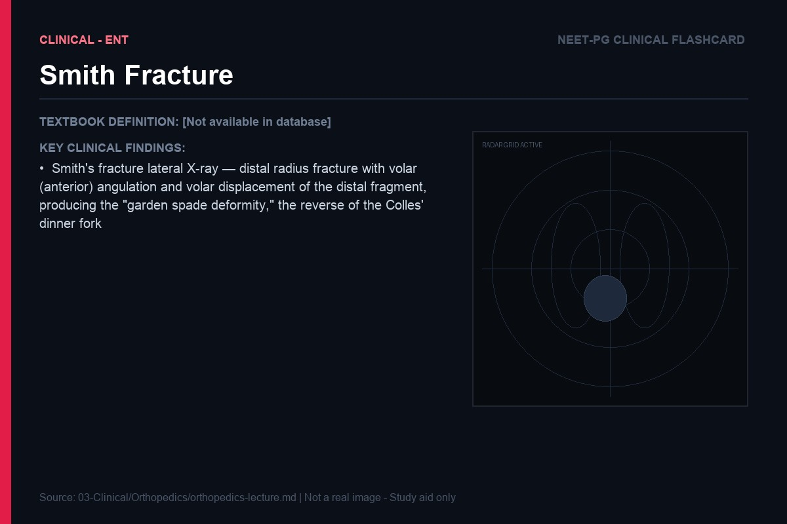
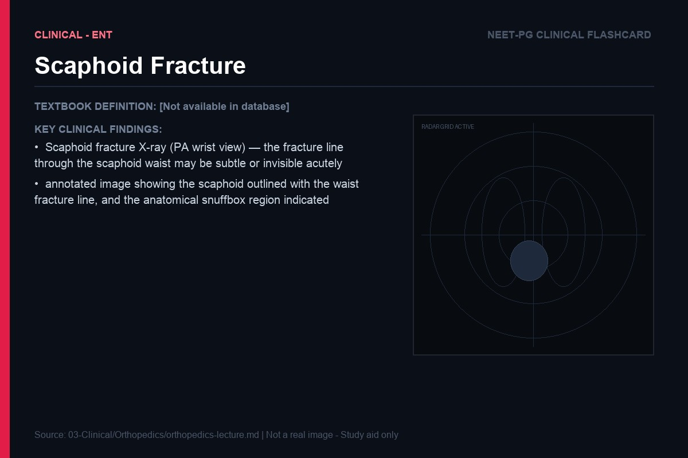
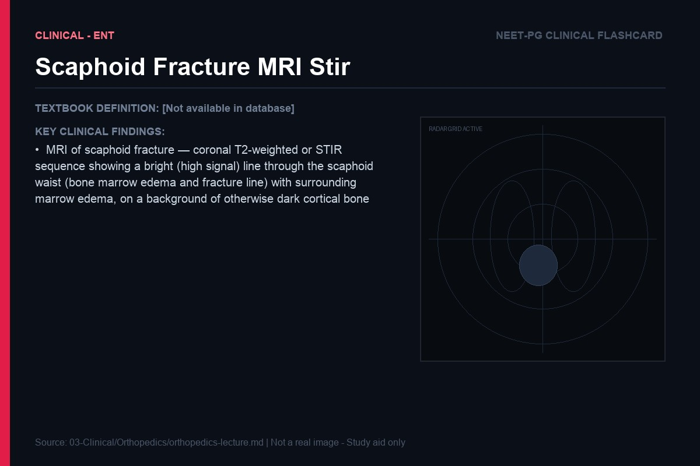
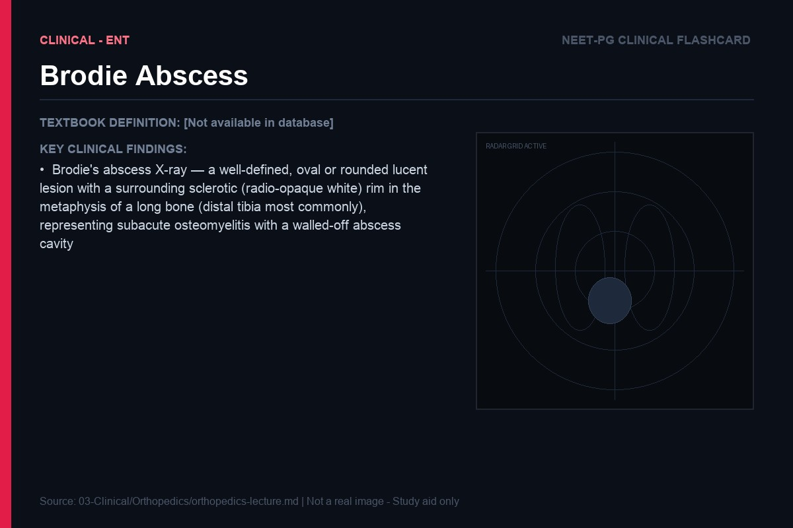

> **Diagram note:** Mermaid mindmap — renders in VS Code (Markdown Preview), Obsidian, or GitHub with the Mermaid extension. Plain-text overview below.

```mermaid
graph TD
    A["🦴 ORTHOPEDICS — NEET PG<br/>6 Major Domains"]

    A --> B["Fracture Principles"]
    A --> C["Upper Limb Fractures"]
    A --> D["Lower Limb Fractures"]
    A --> E["Bone Infections & Tumors"]
    A --> F["Joint Disorders & Spine"]
    A --> G["Metabolic & Pediatric"]

    B --> B1["Salter-Harris I-V<br/>SH-V worst prognosis (crush)"]
    B --> B2["Fracture Healing<br/>Hematoma→Fibrocartilage→Callus→Remodel"]
    B --> B3["Compartment Syndrome<br/>Pressure >30 mmHg → Fasciotomy"]

    C --> C1["Colles' Fracture<br/>FOOSH / Dinner-fork / Radial nerve safe"]
    C --> C2["Scaphoid Fracture<br/>Snuffbox / AVN risk / X-ray −ve early"]
    C --> C3["Supracondylar<br/>AIN injury / Volkmann's ischemia"]

    D --> D1["NOF Fracture<br/>Garden I-IV / AVN risk (III & IV)"]
    D --> D2["Tibial Plateau<br/>Schatzker classification"]
    D --> D3["Ankle Fractures<br/>Pott's = bimalleolar fracture"]

    E --> E1["Osteomyelitis<br/>Staph aureus / Brodie's abscess"]
    E --> E2["Osteosarcoma<br/>Sunburst + Codman's triangle / Distal femur"]
    E --> E3["Ewing's Sarcoma<br/>Onion-skin / Diaphysis / EWS-FLI1"]

    F --> F1["OA vs RA<br/>OA: osteophytes / RA: erosions + pannus"]
    F --> F2["Pott's Disease<br/>TB spine / Gibbus / Psoas abscess"]
    F --> F3["IVDP<br/>L4-L5: foot drop / L5-S1: ankle reflex loss"]

    G --> G1["Osteoporosis<br/>T-score ≤-2.5 / Bisphosphonates"]
    G --> G2["DDH<br/>Ortolani/Barlow / Pavlik harness"]
    G --> G3["SUFE<br/>Obese adolescent male / Ice-cream off cone"]
```

**Subject Overview (plain text):**
- Fracture Principles: Salter-Harris I-V (SH-V worst prognosis), Fracture Healing (Hematoma→Fibrocartilage→Callus→Remodel), Compartment Syndrome (Pressure >30 mmHg → Fasciotomy)
- Upper Limb Fractures: Colles' Fracture (FOOSH/Dinner-fork), Scaphoid Fracture (Snuffbox/AVN risk/X-ray -ve early), Supracondylar (AIN injury/Volkmann's ischemia)
- Lower Limb Fractures: NOF Fracture (Garden I-IV/AVN risk III & IV), Tibial Plateau (Schatzker classification), Ankle Fractures (Pott's = bimalleolar)
- Bone Infections & Tumors: Osteomyelitis (Staph aureus/Brodie's abscess), Osteosarcoma (Sunburst+Codman's triangle/Distal femur), Ewing's Sarcoma (Onion-skin/Diaphysis)
- Joint Disorders & Spine: OA vs RA (Osteophytes vs Erosions+Pannus), Pott's Disease (TB spine/Gibbus/Psoas abscess), IVDP (L4-L5 foot drop/L5-S1 ankle reflex loss)
- Metabolic & Pediatric: Osteoporosis (T-score ≤-2.5/Bisphosphonates), DDH (Ortolani/Barlow/Pavlik harness), SUFE (Obese adolescent male)

# Orthopedics — Lecture Notes for NEET PG
### Written in the voice of a clinician teaching at the fracture clinic

---

## Fracture Healing — Bone as a Living Tissue

### The Biology of Bone Repair

Bone is the only tissue in the body that heals by complete regeneration — not by scar formation. Every other tissue, when damaged beyond a critical size, heals with fibrosis — the replaced tissue is mechanically inferior to the original. Bone, remarkably, can reconstitute itself to be indistinguishable from normal bone, in exactly the right shape and mechanical properties. Understanding why this is possible — and why it sometimes fails — requires understanding the biology of each phase of bone healing.

When a bone fractures, the first event is hemorrhage — bleeding from the disrupted periosteum, cortex, and marrow cavity into the fracture gap and surrounding soft tissues. This blood clots, forming the fracture hematoma. This is not simply a passive blood clot waiting to be organized — it is an active, biologically rich scaffold. The hematoma contains platelets, which immediately begin releasing a cocktail of growth factors: PDGF (platelet-derived growth factor), TGF-β (transforming growth factor-beta), BMP-2 and BMP-7 (bone morphogenetic proteins), VEGF (vascular endothelial growth factor), and FGF (fibroblast growth factor). These act as the "go" signals for repair. They attract mesenchymal stem cells (MSCs) from the periosteum, endosteum, and surrounding muscle to the fracture site, and they promote angiogenesis (new blood vessel formation) — which is essential because the healing tissue has a very high oxygen demand. The pH of the hematoma is initially low (lactic acid from ischemic cells) — this acidic environment actually promotes osteoclast activity (preparing the fracture ends for union) and will shift toward alkaline as healing proceeds (alkaline phosphatase rises in the serum — a useful marker of active bone repair).

**Analogy:** The fracture hematoma is like a construction site with the raw materials (stem cells, growth factors) and the project manager (PDGF, BMP) already on-site. The hematoma is not waste to be cleared — it is the beginning of the repair. This is why washing out a fracture hematoma (as might happen with vigorous irrigation) impairs healing. Conversely, augmenting the hematoma with platelet-rich plasma or bone morphogenetic proteins can accelerate healing in difficult cases.

The second phase — soft callus formation — begins 1–2 weeks after injury. Mesenchymal stem cells from the periosteum (the most important source — periosteum is a remarkably pluripotent tissue, capable of forming both bone and cartilage) migrate into the fracture hematoma and begin differentiating. The differentiation pathway depends critically on the local mechanical and biological environment. In a slightly mobile fracture gap (where there is some inter-fragment motion), the MSCs differentiate into chondroblasts and deposit cartilage (type II collagen matrix) — this is the soft callus. The soft callus physically bridges the fracture gap and reduces inter-fragment motion. Critically, the soft callus also expresses VEGF, which drives vascularization of the fracture site. Radiologically, this phase is invisible — soft callus does not appear on X-ray.

The third phase — hard callus (woven bone) formation — begins at 3–6 weeks. As the soft callus is progressively vascularized, the chondrocytes within it undergo hypertrophy and mineralize their surrounding matrix (a process essentially identical to the growth plate of a developing bone — fracture healing re-runs embryological endochondral ossification). Simultaneously, the periosteum at the fracture margins undergoes intramembranous ossification (direct osteoblast activity without a cartilaginous intermediate). Osteoblasts, stimulated by BMP-2/7 and mechanical loading, begin depositing woven bone (irregular collagen fiber arrangement, less strong than mature lamellar bone) within the calcified cartilage matrix. The cartilage is progressively replaced by woven bone — this mineralized tissue is visible on X-ray as the callus. The callus is initially exuberant (visible bulge around the fracture on X-ray), providing splinting stability even before it is fully mineralised.

The fourth phase — remodeling — begins at 6–12 weeks and continues for months to years. The woven bone (with its irregular collagen arrangement and inferior mechanical properties) is replaced by lamellar bone — organized into osteons (Haversian systems), with collagen fibers arranged in precise helical patterns that are oriented along the lines of mechanical stress. This is Wolff's law: bone remodels to the forces placed upon it. The lamellar bone that ultimately forms is mechanically adapted to the exact load patterns experienced by the bone. Excess callus (bone formed beyond the mechanical requirements) is resorbed by osteoclasts. The medullary canal is recanalized. Eventually — in a perfectly healed fracture — the bone is radiologically indistinguishable from normal, and the fracture line disappears.

> **Key exam point:** The four stages: (1) Hematoma → rich in growth factors (PDGF, TGF-β, BMP). (2) Soft callus → cartilage, weeks 1–3, not visible on X-ray. (3) Hard callus → woven bone, weeks 3–12, visible on X-ray. (4) Remodeling → lamellar bone, months to years, governed by Wolff's law. Alkaline phosphatase rises with active bone formation. The primary source of cells for fracture healing is the periosteum (not the endosteum or marrow — the periosteum is the most important).

### Primary vs Secondary Bone Healing

The description above — hematoma → soft callus → hard callus → remodeling — describes secondary (indirect) bone healing, which occurs when there is a fracture gap and some inter-fragment motion. This is the most common pattern, and it is what happens in fractures treated with splints, casts, intramedullary nails, and plates with some flexibility.

Primary (direct) bone healing occurs only when the fracture ends are in absolute anatomical contact and under absolute mechanical stability (rigid internal fixation — typically a compression plate applied with interfragmentary lag screws, or headless compression screws in small bones). When there is no gap and no motion, cutting cones of osteoclasts directly cross the fracture line, creating Haversian canals that osteoblasts then fill with lamellar bone — directly, without any cartilaginous intermediate and without visible callus formation. The bone heals "invisibly" — there is no callus on the X-ray. This is the rationale for absolute stability fixation in articular fractures: the cartilage of a joint cannot tolerate any surface irregularity, so the underlying bone must be reconstructed to anatomical precision, which requires rigid fixation and primary healing.

**Clinical connection:** This is why a perfectly fixed fracture with no callus forming on X-ray at 6 weeks does not necessarily mean non-union — if it was fixed with a compression plate achieving primary healing, absence of callus is expected and appropriate. Conversely, a fracture treated with a cast should be showing callus at 6 weeks; if it is not, investigate for causes of non-union.

---

### Complications of Fracture Healing

**Non-union** is the failure of a fracture to heal. It is defined clinically and radiologically — typically when a fracture shows no progressive healing for 3 consecutive months after a period of at least 6 months from injury (the conventional definition, though in practice this is pragmatic). There are two types: hypertrophic non-union and atrophic non-union, and they have different pathogeneses and treatments.

Hypertrophic non-union occurs when there is adequate biology (blood supply, stem cells, growth factors) but excessive inter-fragment motion. The fracture ends are reactive — they are trying to heal (you see an "elephant foot" callus on X-ray — exuberant but disorganized bone formation that cannot bridge the gap because the motion prevents the callus from maturing). Treatment is to provide stability — intramedullary nail, plating — and the biology does the rest.

Atrophic non-union occurs when the biology is deficient — poor blood supply to the fracture ends, devascularized bone, infection, bone loss, metabolic disease (vitamin D deficiency, hypothyroidism, hypophosphatasia), or the systemic effects of smoking (nicotine impairs periosteal blood flow and osteoblast function). The fracture ends are avascular, osteoporotic, and show no attempt at healing (the X-ray shows pencil-thin, sclerotic fracture ends, no callus). Treatment requires both mechanical stability AND biological augmentation — debridement of avascular bone ends, autologous bone graft (the gold standard — provides osteogenic cells, osteoinductive growth factors, and osteoconductive scaffold in one procedure), BMP-2/7 application, and if infected, staged treatment (debridement → Masquelet technique or antibiotic-laden cement spacer → delayed reconstruction).

**Malunion** is healing of the fracture in an unacceptable position. The fracture has healed — but in shortening, angulation, rotation, or a combination. The functional consequences depend on the bone and the degree of deformity: tibial malunion with significant angulation can cause premature knee and ankle osteoarthritis (by altering the mechanical axis); femoral malunion with rotational deformity causes a cosmetically and functionally abnormal gait; radius malunion impairs forearm rotation (critical for daily activities like using a doorknob). Treatment is corrective osteotomy — refracturing the bone at the malunion site, correcting the deformity, and stabilizing with a plate. Deformity analysis (CORA — centre of rotation of angulation — methodology) allows precise planning of the osteotomy site and correction angle.

---

### Compartment Syndrome — Ischemia in a Closed Space

Compartment syndrome is a genuine surgical emergency — minutes matter, and a missed or delayed diagnosis results in irreversible muscle necrosis, contracture, nerve damage, and potentially life-threatening consequences. The underlying mechanism is beautifully logical once you understand it from first principles, and it begins with the anatomy of fascial compartments.

The limb muscles are organized into compartments — groups of muscles enclosed by inelastic fascial walls. The lower leg has four compartments (anterior, lateral, superficial posterior, deep posterior); the forearm has two (volar and dorsal); the thigh has three (anterior, posterior, medial); the foot has nine. These fascial envelopes cannot expand. They are the key structural feature that makes compartment syndrome possible.

When injury (fracture, crush, prolonged limb compression, reperfusion after vascular injury) causes bleeding, edema, or inflammatory exudate within a compartment, the volume within the rigid fascial envelope increases. By Laplace's law, pressure rises. Venous outflow from the compartment occurs at low pressure (approximately 10–15 mmHg in venules) — as compartment pressure rises toward venous pressure, venous outflow is progressively impeded. This further increases volume → pressure → further venous obstruction. Arterial inflow continues (mean arterial pressure is ~85 mmHg) — this inflow, unable to exit via the venous system, worsens the swelling. Perfusion pressure = mean arterial pressure minus compartment pressure. When compartment pressure rises above 30 mmHg (or within 30 mmHg of diastolic blood pressure), tissue perfusion becomes inadequate — first the metabolically demanding muscle fibers, then the nerves.

**Analogy:** Compartment syndrome is like squeezing a sponge inside a rigid box. Initially, you can force water in (arterial inflow). But the box is full — the water cannot drain out (venous obstruction). The more you pump in, the more the sponge (muscle) is compressed from all sides. Eventually the pressure exceeds the driving force, and nothing flows — the sponge suffocates.

The 6 P's of compartment syndrome — pain, pressure (tense compartment on palpation), paresthesia, paralysis, pallor, pulselessness — are all consequences of ischemia in the sequence of their development. Pain is the earliest and most important sign — specifically, pain out of proportion to the injury, and pain with passive stretch of the muscles in the involved compartment (passive dorsiflexion of the foot stretches the anterior compartment of the leg; passive extension of the fingers stretches the volar forearm compartment). Paresthesia (pins and needles) and hypoesthesia occur as peripheral nerve axons — which are very sensitive to ischemia — begin to fail. Paralysis and pulselessness are late signs — by the time pulses are absent, the ischemia is far advanced and irreversible damage has almost certainly occurred. Do not wait for pulselessness to act.

> **Key exam point:** Compartment pressure > 30 mmHg (or delta P = diastolic BP minus compartment pressure < 30 mmHg) → emergency fasciotomy. All four compartments of the lower leg must be released (through two-incision approach: anteromedial for anterior and deep posterior compartments, lateral for superficial posterior and lateral). The most common fracture causing compartment syndrome is tibia fracture. Forearm compartment syndrome: Volkmann's ischemic contracture — fibrosis of the forearm flexors causes the wrist to flex and the fingers to curl. Three degrees: mild (intrinsic plus position managed conservatively), moderate (flexor origin slide), severe (free muscle transfer needed).

---

## Specific Fracture Patterns and Their Clinical Logic

### Colles' Fracture — Why This Fracture, Why This Patient

Colles' fracture is the most common fracture in adults, and it is a fracture you will see every day in clinical practice. Before you can understand it properly, you must understand three converging factors: the mechanism of injury, the anatomy of the distal radius, and the effect of osteoporosis.

A fall on an outstretched hand (FOOSH mechanism) transmits the force of the fall through the palm, wrist, and distal forearm. The wrist is instinctively extended during the fall — a protective reflex. The distal radius receives the majority of the load (approximately 80% of the axial load across the wrist passes through the distal radius; only 20% through the ulna and triangular fibrocartilage complex). The distal radius, at the metaphysis, is composed predominantly of cancellous bone — trabecular bone that is highly susceptible to osteoporotic thinning. In a young person with dense bone, a FOOSH mechanism typically causes a scaphoid fracture or ligamentous injury (the stronger bone of the radius can withstand the force). In an elderly osteoporotic patient, the weakest link is the porous distal radial metaphysis — it compresses and fractures.

The classic Colles' fracture is a transverse fracture of the distal radial metaphysis approximately 2 cm proximal to the radiocarpal joint. The distal fragment displaces dorsally (dorsal angulation — pushed backward by the impact force), radially (the pull of the brachioradialis muscle and the weight of the hand), and is impacted (compressed into the proximal fragment). The result is the "dinner fork deformity" — viewed from the lateral side, the wrist has a step-like silhouette: the hand and wrist are displaced dorsally relative to the forearm, producing a shape reminiscent of a dinner fork lying face-down. The radial styloid appears prominent (because the distal fragment has shifted radially). The radial angulation of the distal articular surface (normally 22–24° radially tilted) is lost or reversed (dorsal tilt). Radial shortening occurs.

 *([Source: Radiopaedia](https://radiopaedia.org/articles/colles-fracture))*
> **IBQ tip:** On the lateral view, look for the dorsal tilt of the distal radial articular surface (normally 10–15° volar tilt — in Colles' it reverses to dorsal tilt) and the step-off between the radius and carpus; on the AP view, look for radial shortening (ulnar styloid appears relatively prominent) — these three findings (dorsal tilt, dorsal displacement, radial shortening) together confirm Colles' and distinguish it from Smith's (volar tilt on lateral view).

**Clinical connection:** Colles' fracture is the sentinel osteoporotic fracture. A patient presenting with a Colles' fracture should be assessed and treated for osteoporosis — DEXA scan, calcium/vitamin D supplementation, bisphosphonate therapy if indicated. The fracture is a warning: the next fracture may be a hip fracture, which carries 20–30% one-year mortality. Treatment of the fracture itself: undisplaced or minimally displaced → below-elbow plaster cast for 6 weeks. Displaced → manipulation under anesthesia (restoring radial length, palmar tilt, radial inclination) + cast. Unstable, comminuted, or intra-articular → percutaneous K-wire fixation or volar locking plate (the standard for active patients — provides stable fixation allowing early mobilization).

The reverse Colles' fracture is the **Smith's fracture** (Garden spade deformity) — the distal fragment displaces volarly (forward, toward the palm). Mechanism: fall on a flexed wrist, or a direct blow to the dorsum of the wrist. Barton's fracture is an intra-articular fracture-dislocation: the fracture line enters the articular surface, and the carpal bones displace with the distal fragment (volar Barton's is the most common — the volar rim of the distal radius fractures and the carpus subluxes anteriorly). These intra-articular fractures require surgical fixation to restore the joint surface.

> **IBQ tip:** On the lateral view, the distal fragment tilts volarly (toward the palm) — the exact opposite of Colles' (dorsal tilt); remember "Smith's = volar = forward fall on a flexed wrist" vs "Colles' = dorsal = fall on an outstretched extended wrist."

---

### Scaphoid Fracture — The Treacherous Wrist Injury

The scaphoid is the most commonly fractured carpal bone, and it has a well-deserved reputation for causing diagnostic and management problems — primarily because of its precarious blood supply. The scaphoid spans both the proximal and distal rows of carpal bones, articulating with the distal radius, lunate, capitate, and trapezoid. This position makes it the force-transmitting bridge of the wrist — and in a FOOSH, the scaphoid takes the brunt of the radial-sided compression. The fracture typically occurs at the scaphoid waist (most common, ~70%), though it can occur at the proximal pole or distal pole (tuberosity).

The blood supply to the scaphoid enters distally — via a branch of the radial artery penetrating the dorsal ridge of the scaphoid at its distal third, providing a retrograde supply to the proximal pole. The proximal pole has NO independent blood supply entering it directly. Fracture at the waist (or proximal pole) interrupts the only blood supply to the proximal pole. The proximal pole is now avascular — it cannot receive nutrients, it cannot participate in fracture healing, and it progressively undergoes avascular necrosis (AVN). The proximal pole becomes sclerotic on X-ray (it appears denser than the surrounding bone — the dead bone does not undergo normal bone turnover, so it doesn't thin, while the surrounding living bone remodels and becomes osteoporotic by comparison). Eventually, the dead proximal pole collapses → scaphoid nonunion advanced collapse (SNAC) → carpal instability → diffuse wrist arthritis.

**Analogy:** The proximal scaphoid is like a village connected to the outside world by a single bridge road. Fracture the scaphoid at the waist and you cut that road — the village is isolated. Initially, life continues on stockpiles, but progressively the village deteriorates. The village (proximal pole) cannot receive building materials (nutrients, oxygen) and cannot be repaired (no osteoblasts are delivered). It dies.

The diagnostic challenge is that scaphoid fractures are classically **occult on initial X-ray** — the fracture line may not be visible for 10–14 days (when bone resorption at the fracture ends makes the line apparent). A patient presents after a FOOSH with pain and tenderness at the anatomical snuffbox (the hollow between the extensor pollicis longus, extensor pollicis brevis, and abductor pollicis longus at the base of the thumb — the floor of the snuffbox is the scaphoid) but a normal X-ray. This is a clinical scaphoid fracture until proven otherwise. The two options: immobilize in a scaphoid cast (thumb spica cast) for 10–14 days and repeat X-ray, or obtain MRI immediately (the most sensitive and specific modality for acute scaphoid fracture — sensitivity >95% within 24 hours). MRI is now the gold standard for suspected scaphoid fracture.

> **IBQ tip:** The X-ray is often normal in acute scaphoid fracture — the key radiographic clue when visible is a hairline lucency transversely crossing the scaphoid waist on the PA view; if the X-ray is normal but snuffbox tenderness is present after a FOOSH, the exam answer is MRI (not repeat X-ray) because MRI detects the fracture within 24 hours with >95% sensitivity, whereas repeat X-ray at 2 weeks still misses up to 20% of fractures.

> **IBQ tip:** On MRI (STIR or fat-suppressed T2), the fracture appears as a line of high signal (bright white) through the scaphoid waist surrounded by marrow edema (also bright); avascular necrosis of the proximal pole appears as low signal (dark) on all sequences on T1 — loss of the normal fatty marrow signal — distinguishing it from the edema pattern of an acute fracture.

> **Key exam point:** Scaphoid fracture: anatomical snuffbox tenderness, pain with axial loading of the thumb, FOOSH mechanism. X-ray negative initially → MRI diagnostic. Waist fracture → moderate AVN risk. Proximal pole fracture → very high AVN risk → almost always treat surgically (Herbert screw fixation). Distal pole → good blood supply, low AVN risk, treat conservatively. Complication of delayed/missed scaphoid fracture: AVN proximal pole → SNAC → carpal collapse.

---

### Hip Fractures — Anatomy Determines Prognosis

Hip fractures are among the most common and consequential fractures in the elderly. Globally, they are associated with enormous morbidity (immobility, pressure sores, pneumonia, DVT/PE, delirium) and a mortality rate of approximately 20–30% within one year. Understanding the anatomy of the proximal femur — particularly its blood supply — is essential for understanding why different fractures require different treatments.

The proximal femur has two anatomically and clinically distinct regions: the femoral neck (intracapsular — within the joint capsule) and the trochanteric/subtrochanteric region (extracapsular). This distinction is critical because it determines the blood supply to the femoral head, and thus the risk of AVN.

The femoral head receives its blood supply from three sources: (1) retinacular vessels — branches of the medial femoral circumflex artery (MFCA) that run along the femoral neck within the joint capsule and supply the majority of the femoral head; (2) the artery of the ligamentum teres (a branch of the obturator artery) — a small, inconsistent contributor that becomes less important after early childhood; (3) endosteal vessels from the femoral neck (minor contribution). The MFCA is by far the most important. It arises from the profunda femoris artery, courses around the back of the femoral neck, and sends its retinacular branches superiorly along the neck to perforate the bone at the head-neck junction.

Now consider a displaced femoral neck fracture: the fracture shears across the femoral neck → the retinacular vessels, which run along the surface of the femoral neck, are torn → the femoral head loses its dominant blood supply → AVN. The rate of AVN for displaced femoral neck fractures is approximately 15–35% — and this is the reason that the treatment of these fractures in elderly patients is replacement (hemiarthroplasty or total hip replacement) rather than fixation. An elderly patient who sustains a displaced femoral neck fracture, undergoes fixation, and then develops AVN of the femoral head faces a second major operation (revision to THR) — which is far more risky than doing the replacement at the outset. In young patients (< 65 years typically), despite the AVN risk, fixation is preferred because preserving the native femoral head is worth the risk, and the consequences of a THR in a young, active patient (implant loosening, limited longevity of prosthesis) are also significant.

**The Garden classification** of femoral neck fractures logically stratifies the fracture by displacement and AVN risk. Garden I: incomplete, impacted, in valgus — the trabecular pattern of the head is in slight valgus relative to the neck. Garden II: complete but undisplaced — the fracture is through the full neck but the fragments have not moved. Garden III: partially displaced — the trabecular pattern is disrupted but the bone fragments remain in contact. Garden IV: completely displaced — the femoral head and neck are fully separated, the retinacular vessels are certainly torn. The classification simplifies into undisplaced (Garden I and II — treat with internal fixation, cannulated screws) and displaced (Garden III and IV — treat with arthroplasty in elderly, fixation in young).

> **IBQ tip:** The key radiographic distinction is between undisplaced (Garden I/II — fracture line visible but fragments not shifted, trabecular pattern of head aligns with acetabulum) and displaced (Garden III/IV — the head has rotated or completely separated from the neck); Garden IV is recognized by the femoral head rotating to a neutral position within the acetabulum while the femur shaft is externally rotated — the head "re-aligns" with gravity rather than the neck.

> **IBQ tip:** A pathological fracture is identified by the presence of pre-existing bone abnormality at the fracture site — the cortex appears irregularly destroyed, expanded, or replaced by lucent or sclerotic tumor tissue before the fracture occurred; in a pure traumatic fracture the bone quality on both sides of the fracture line is normal.

**Clinical connection:** The decision between hemiarthroplasty (replacing only the femoral head, leaving the native acetabulum) and total hip replacement (replacing both) in elderly displaced femoral neck fractures depends on the patient's activity level and pre-injury functional status. For fit, mobile, community-dwelling elderly patients, THR gives better functional outcomes (lower dislocation rate, better pain relief, higher activity levels) — confirmed by the HEALTH trial. For frail, cognitively impaired, or low-demand patients, hemiarthroplasty is quicker and simpler.

**Extracapsular hip fractures** (intertrochanteric and subtrochanteric) occur outside the joint capsule — the retinacular vessels are not at risk. AVN of the femoral head does not occur. However, these fractures occur in highly vascular cancellous bone (the trochanteric region) and can cause significant blood loss. The treatment is surgical fixation — dynamic hip screw (DHS, also called the sliding hip screw) for intertrochanteric fractures (the lag screw slides within the barrel, allowing controlled impaction of the fracture as the patient weight-bears, which actually promotes healing); cephalomedullary nails (e.g., PFNA, Gamma nail) for unstable intertrochanteric and subtrochanteric fractures.

> **Key exam point:** Garden classification: I = impacted valgus, II = undisplaced, III = partially displaced, IV = completely displaced. I and II = cannulated screws (internal fixation). III and IV = arthroplasty (elderly) or fixation (young). Extracapsular = DHS (most intertrochanteric) or cephalomedullary nail (unstable, subtrochanteric). DVT prophylaxis is mandatory peri-operatively (LMWH). Aim to operate within 36–48 hours — delay worsens mortality.

---

### Spine — The Backbone of Understanding

### Intervertebral Disc Prolapse — Mechanical and Neurological

The intervertebral disc is the primary load-bearing structure between vertebral bodies — it distributes compressive loads, allows spinal flexibility, and absorbs shock. Each disc consists of two components: the nucleus pulposus (NP) — a gelatinous, highly hydrated (80% water) core composed of type II collagen and proteoglycans (aggrecan, keratan sulphate) that attract and retain water — and the annulus fibrosus (AF) — a series of concentric lamellae of type I collagen fibers arranged at alternating angles (like the layers of a plywood sheet), designed to resist tensile and rotational forces. The disc is avascular — nutrition reaches the NP by diffusion through the cartilaginous end plates of the vertebral bodies, which are permeable to small molecules.

With age (the disc begins degenerating from the second decade of life), the NP loses its proteoglycan content → loses water → the disc becomes flatter, less elastic, and less able to distribute loads evenly. The AF weakens — the concentric lamellae develop fissures from repetitive loading. When a fissure reaches the outer AF, the degenerated NP can herniate through it — disc prolapse. The herniated material compresses neural structures: nerve roots in the lumbar region (radiculopathy), the cauda equina in severe cases (cauda equina syndrome), or the spinal cord in the cervical and thoracic regions (myelopathy).

The level of the lumbar disc prolapse determines which nerve root is affected, and this follows the anatomy precisely. In the lumbar spine, nerve roots exit below the pedicle of the same-numbered vertebra (L4 root exits at L4-L5 foramen, beneath the L4 pedicle). But posterolateral disc prolapse (the most common location — the AF is weakest posterolaterally, and the posterior longitudinal ligament reinforces the central AF) at L4-L5 compresses the L5 root (which is traversing the spinal canal at that level on its way down to exit at the L5-S1 level). A prolapse at L5-S1 compresses the S1 root. This is why radicular symptoms are one level below the prolapsed disc in the lumbar spine.

> **IBQ tip:** On T2 MRI, a healthy (well-hydrated) disc is bright white (high signal); a degenerated disc is dark (low signal = loss of water/proteoglycans); the herniation appears as a focal posterior protrusion of disc material compressing the bright white thecal sac or obliterating the nerve root fat — the level of compression determines the root involved (L4-L5 prolapse compresses L5 root, L5-S1 compresses S1 root).

L5 radiculopathy: weakness of extensor hallucis longus (great toe extension), tibialis anterior (foot dorsiflexion — foot drop), sensory loss over the dorsum of the foot and great toe, NO ankle jerk loss (ankle jerk = S1). S1 radiculopathy: weakness of peronei (foot eversion), gastrocnemius/soleus (plantarflexion — difficulty walking on tiptoe), absent ankle jerk (S1 is the reflex arc for ankle jerk), sensory loss over the lateral foot and sole and little toe.

**Cauda equina syndrome** is the most feared complication of lumbar disc prolapse — a surgical emergency. A massive central disc prolapse at L4-L5 (or L5-S1) compresses multiple sacral nerve roots simultaneously, causing: bilateral leg weakness, bilateral sciatica, saddle anesthesia (numbness in the perineum — the S3, S4, S5 dermatomes form the "saddle" area), loss of bladder control (urinary retention, painless — the patient cannot feel the bladder filling → overflow incontinence), and loss of bowel control (fecal incontinence or retention). This is a genuine emergency — every hour of cord compression increases the risk of permanent neurological deficit. MRI is the investigation of choice, and decompressive surgery (discectomy) should be performed within 24–48 hours of symptom onset to maximize neurological recovery.

> **Key exam point:** L4-L5 disc = L5 root: weak EHL, foot drop, no reflex change, sensation big toe/dorsum. L5-S1 disc = S1 root: weak plantarflexion, absent ankle jerk, sensation lateral foot/sole. Cervical disc: C5-C6 disc → C6 root: weak biceps, wrist extensors, absent biceps jerk, sensation thumb/index. C6-C7 disc → C7 root: weak triceps, wrist flexors, absent triceps jerk, sensation middle finger. Cauda equina syndrome = emergency. Absolute indications for surgery in disc disease: cauda equina syndrome, progressive neurological deficit, intractable pain failing conservative management.

---

## Bone Tumors — First Principles of Classification

Understanding bone tumors requires an organizational framework before memorizing individual entities. Tumors can be primary (arising from the bone itself — osteosarcoma, Ewing's, chondrosarcoma) or secondary (metastatic — far more common; the commonest malignant bone tumor is metastatic carcinoma). Primary tumors are classified by their cell of origin and by their biological behavior (benign, intermediate, or malignant).

**Osteosarcoma** is the most common primary malignant bone tumor (excluding myeloma and lymphoma), most common in the second decade of life, at the metaphysis of rapidly growing long bones (distal femur > proximal tibia > proximal humerus — the knee around the rapidly growing growth plates of adolescence). It arises from osteoblast precursors and produces osteoid (immature bone matrix). The X-ray shows a destructive metaphyseal lesion with sunburst pattern (spicules of reactive bone formation) and Codman's triangle (elevation of the periosteum at the edge of the tumor, with new bone formation forming a triangle between the periosteum and cortex). The tumor breaks through the cortex and grows into the soft tissues. Serum alkaline phosphatase and LDH are elevated (markers of active bone matrix production and cell turnover). Treatment is preoperative chemotherapy (to shrink the tumor and treat micrometastases) + wide surgical excision (limb salvage whenever possible) + postoperative chemotherapy. Prognosis: 5-year survival approximately 65–70% with modern chemotherapy.

 *([Source: Radiopaedia](https://radiopaedia.org/articles/codmans-triangle))*
> **IBQ tip:** The sunburst pattern (radiating spicules perpendicular to the cortex, like rays from the sun) is produced by tumor osteoid deposited in soft tissue extensions along the path of periosteal vessels — distinguish from the onion-skin layering of Ewing's (concentric rings parallel to the cortex); Codman's triangle at the edge of the tumor (where periosteum is still adherent) forms a right-angled triangle with the cortex — this triangle of reactive bone at the tumor margin is the key radiographic pointer to an aggressive periosteal-elevating lesion.

**Ewing's sarcoma** is the second most common primary malignant bone tumor of childhood and adolescence (most cases in the second decade). It arises from primitive neuroectodermal precursors — most cases carry a characteristic chromosomal translocation t(11;22)(q24;q12) producing the EWS-FLI1 fusion protein. Unlike osteosarcoma (metaphyseal), Ewing's is a diaphyseal tumor. The X-ray shows a permeative (moth-eaten) diaphyseal lesion with "onion-skin" periosteal reaction (layers of periosteal new bone formation lifting off sequentially as the tumor grows outward). Systemically, Ewing's can cause fever, elevated WBC, and elevated LDH — mimicking osteomyelitis (important differential). Treatment: multi-agent chemotherapy + surgery (limb salvage) ± radiotherapy.

 *([Source: Radiopaedia](https://radiopaedia.org/articles/ewings-sarcoma))*
> **IBQ tip:** The onion-skin periosteal reaction consists of multiple parallel layers of reactive bone deposited concentrically around the cortex (like the layers of an onion cut in cross-section) — this is a diaphyseal location finding; osteosarcoma produces a sunburst (radiating spicules, metaphyseal), and the distinction between the two is primarily location (diaphysis vs metaphysis) and periosteal pattern (laminated vs sunburst).

**Giant cell tumor (GCT)** of bone is an intermediate-grade tumor (locally aggressive, occasionally metastasizes to lung) occurring in the epiphysis of long bones in skeletally mature patients (after growth plate closure — 20–40 years). The classic location is the distal femur or proximal tibia, immediately adjacent to the articular surface (epiphyseal). The tumor consists of mononuclear stromal cells (the true neoplastic component) and multinucleate giant cells (osteoclast-like — which give the tumor its destructive, lytic character). On X-ray: eccentric, expansile, lytic lesion at the epiphysis with a "soap bubble" appearance, no sclerotic margin (reflects local aggressiveness). Treatment: curettage with high-speed burring, phenol or liquid nitrogen application, and cement/bone graft filling. Denosumab (anti-RANKL antibody — inhibits osteoclast function) is used for unresectable or recurrent GCT.

 *([Source: Radiopaedia](https://radiopaedia.org/articles/giant-cell-tumour-of-bone))*
> **IBQ tip:** The soap-bubble appearance (thin internal bony strands creating a multi-locular bubbly pattern within an expansile lytic lesion) at the epiphysis reaching the articular surface in a 20–40-year-old is the classic GCT image; aneurysmal bone cyst also has a soap-bubble pattern but is typically in the metaphysis in younger patients (<20 years); the eccentricity (GCT touches one cortex more than the other) and the subarticular location are the key distinguishing features.

**Fibrous dysplasia** is a benign developmental anomaly in which normal medullary bone is replaced by fibrous tissue containing irregular woven bone trabeculae — the result is a lesion with a characteristic "ground glass" or "hazy smoke" appearance on X-ray, reflecting the fibrous tissue matrix with scattered fine bony spicules rather than organized trabecular bone. It most commonly affects the proximal femur (can cause the "shepherd's crook deformity" — coxa vara from repeated stress fractures), ribs, and skull. The lesion is typically well-defined, with a surrounding sclerotic rim, and occurs in young patients. Polyostotic fibrous dysplasia with café-au-lait macules and precocious puberty = McCune-Albright syndrome.

> **IBQ tip:** The ground glass matrix (uniform hazy opacity, like frosted glass — neither the pure black of a cyst nor the white of mineralized bone) with a well-defined sclerotic border is the distinguishing feature of fibrous dysplasia; osteosarcoma also shows a mixed matrix but has periosteal reaction (sunburst/Codman's triangle) and aggressive cortical destruction, while fibrous dysplasia has intact cortex and a benign-looking sclerotic margin.

**Multiple myeloma** produces characteristic **punched-out lytic lesions** on the skull X-ray — discrete, round, well-defined radiolucent holes without surrounding sclerosis, scattered randomly across the calvarium. These lesions represent plasma cell deposits replacing the normal diploic bone. Unlike metastatic carcinoma (which may show mixed lytic/sclerotic lesions and may have periosteal reaction), myeloma lesions have no sclerotic halo (because the plasma cells suppress osteoblast function via DKK-1 and sclerostin — there is no new bone formation around the lytic foci). The skull X-ray ("pepper-pot skull") is the classic imaging site; other sites include the spine (vertebral collapse → "codfish vertebra" on lateral spine X-ray), pelvis, and proximal long bones.

 *([Source: Radiopaedia](https://radiopaedia.org/articles/multiple-myeloma))*
> **IBQ tip:** The punched-out lesions in myeloma have no sclerotic rim and no surrounding bone reaction — they look as if someone removed perfect circles of bone with a cookie cutter; metastatic carcinoma to the skull can also be lytic but often has irregular margins and may coexist with sclerotic lesions (particularly from prostate or breast primaries), while myeloma lesions are uniformly round and non-sclerotic; serum protein electrophoresis (M-band) and Bence-Jones proteinuria confirm the diagnosis.

---

## Summary Tables

### Fracture Healing — Stage Timeline

| Stage | Timing | Biology | X-ray Appearance |
|---|---|---|---|
| Hematoma | 0–48 hours | Clot, platelets, growth factors | Normal |
| Soft callus | Weeks 1–3 | Cartilage (endochondral), periosteal MSCs | Normal (not visible) |
| Hard callus | Weeks 3–12 | Woven bone replacing cartilage | Callus visible |
| Remodeling | Months to years | Lamellar bone, Wolff's law | Callus resolves |

### Hip Fracture Classification and Management

| Fracture Type | Location | Blood Supply at Risk | AVN Risk | Treatment |
|---|---|---|---|---|
| Garden I | Intracapsular, impacted | Partially preserved | Low | Cannulated screws |
| Garden II | Intracapsular, undisplaced | Partially preserved | Low–moderate | Cannulated screws |
| Garden III | Intracapsular, partial displacement | Significantly disrupted | High | Arthroplasty (elderly) / Fixation (young) |
| Garden IV | Intracapsular, complete displacement | Torn | Very high | Arthroplasty (elderly) / Fixation (young) |
| Intertrochanteric | Extracapsular | Not at risk | Nil | DHS or cephalomedullary nail |
| Subtrochanteric | Extracapsular | Not at risk | Nil | Cephalomedullary nail |

### Bone Tumors — High-Yield Summary

| Tumor | Age | Location | X-ray | Key Feature |
|---|---|---|---|---|
| Osteosarcoma | 10–20 years | Metaphysis, distal femur | Sunburst, Codman's triangle | Most common primary malignant |
| Ewing's sarcoma | 10–20 years | Diaphysis | Onion-skin periosteal reaction | t(11;22), mimics osteomyelitis |
| Chondrosarcoma | >40 years | Pelvis, proximal femur | Ring-and-arc calcification | Cartilaginous matrix |
| Giant cell tumor | 20–40 years (skeletally mature) | Epiphysis | Soap bubble, eccentric, lytic | Anti-RANKL (denosumab) |
| Osteoid osteoma | <30 years | Cortex, tibia/femur | Nidus < 2 cm with sclerosis | Night pain, relieved by aspirin |
| Osteochondroma | <20 years | Metaphysis (away from joint) | Sessile or pedunculated exostosis | Commonest benign bone tumor |
| Simple bone cyst | <20 years | Proximal humerus, femur | Central, metaphyseal, fallen fragment sign | Pathological fracture |

### Compartment Syndrome — Compartments of the Lower Leg

| Compartment | Contents | Syndrome Manifestation |
|---|---|---|
| Anterior | Tibialis anterior, EHL, EDL, deep peroneal nerve | Foot drop, dorsal foot numbness |
| Lateral | Peronei, superficial peroneal nerve | Foot eversion weakness, lateral leg numbness |
| Superficial posterior | Gastrocnemius, soleus, sural nerve | Plantar flexion weakness, posterior leg/lateral foot numbness |
| Deep posterior | FHL, FDL, tibialis posterior, posterior tibial nerve | Toe flexion weakness, plantar numbness |

---

---

## Bone Tumors — Cell of Origin Determines Biology

### Malignant Bone Tumors from First Principles

A bone tumor's behavior — how fast it grows, whether it metastasizes, how it responds to treatment — is fundamentally determined by the biology of its cell of origin. Memorizing tumor names without understanding this biological logic is an exercise in futility. Let us build the understanding correctly.

**Osteosarcoma** arises from osteoblast precursors — cells that are programmed to produce osteoid (the unmineralized collagen matrix of bone). The malignant osteoblasts in osteosarcoma retain this function: they make osteoid. But they do so in a pathologically disorganized, uncontrolled pattern — the osteoid is laid down chaotically, without the normal lamellar organization, without respect to the mechanical stresses of the local bone, and without coupling to osteoclast resorption (the normal bone remodeling balance is absent). The tumor produces disorganized, immature bone matrix — detectable radiologically as irregular mineralized densities within a destructive lesion. This "tumor bone production" is what creates the distinctive X-ray features.

The **sunburst pattern** arises because the tumor grows outward through the cortex and into the surrounding soft tissues, and osteoid is deposited in spicules radiating outward from the tumor surface — like rays from the sun. The **Codman's triangle** forms at the leading edge of periosteal elevation: as the rapidly expanding tumor pushes the periosteum outward, the periosteum lays down reactive new bone at its attached margins (where it is still adherent to the cortex). This forms a triangular structure between the elevated periosteum and the cortex — a triangle of reactive bone at the edge of the tumor, visible on the X-ray profile.

> **Key pearl:** The biology of osteosarcoma determines its response to chemotherapy. Osteoblast precursors are cycling, mitotically active cells — and chemotherapy targets dividing cells. Osteosarcoma responds to multi-agent chemotherapy (methotrexate, doxorubicin, cisplatin — MAP regimen). The histological response to preoperative chemotherapy (percentage of necrotic cells in the resected specimen — "good response" = >90% necrosis) is the strongest prognostic indicator. Lungs are the most common site of metastasis (haematogenous spread via the pulmonary circulation — staging must include chest CT).

**Chondrosarcoma** arises from malignant chondrocytes, and its unique biology immediately explains its clinical behavior. Normal articular cartilage is avascular — it is the only connective tissue in the body without blood vessels, relying entirely on diffusion from the synovial fluid. Malignant chondrocytes retain this avascular biology: the chondrosarcoma matrix is avascular. This has one critical treatment consequence: **chemotherapy cannot reach the tumor cells**. Chemotherapy is delivered via the bloodstream — but if the tumor has no blood supply, the drugs cannot enter it. Chondrosarcoma is therefore **chemotherapy resistant**. Treatment is purely surgical — wide excision with clear margins. If the margins are inadequate, local recurrence is the rule, and repeated recurrence eventually results in a more aggressive, higher-grade tumor. This is why surgical planning and achieving clear margins at the first operation is absolutely critical.

The X-ray of chondrosarcoma shows the characteristic **ring-and-arc** or **popcorn calcifications** within the tumor matrix — this is the calcification of cartilaginous matrix (chondroid matrix calcifies in a curved, lobular pattern, reflecting the lobular architecture of the cartilage matrix). The tumor commonly arises in the pelvis, proximal femur, and proximal humerus — the metaphysis and epiphysis of central bones — typically in patients over 40 (unlike osteosarcoma and Ewing's, which are diseases of adolescence).

**Ewing's sarcoma** has a completely different histological origin: it arises from **primitive neuroectodermal cells** — undifferentiated small round blue cells that are related to neural crest derivatives. The defining molecular event is the **translocation t(11;22)(q24;q12)**: chromosome 22 breaks in the region of the *EWS* gene (encoding a RNA-binding protein), and chromosome 11 breaks in the region of the *FLI1* gene (an ETS transcription factor). The translocation fuses these two genes, creating the **EWS-FLI1 fusion protein** — an aberrant transcription factor that dysregulates hundreds of target genes, driving uncontrolled cell proliferation, blocking differentiation, and suppressing apoptosis. This single chromosomal event is found in approximately 85% of Ewing's sarcomas and is both diagnostically definitive (detectable by FISH or RT-PCR on tumor tissue) and the fundamental oncogenic driver.

The **onion-skin periosteal reaction** of Ewing's sarcoma is one of the most visually memorable X-ray signs in orthopedics, and its biology is worth understanding. Ewing's sarcoma is a rapidly proliferating diaphyseal tumor. As the tumor mass expands within the medullary cavity, it progressively infiltrates the cortex, elevating the periosteum in waves. Each time the periosteum is lifted by the advancing tumor, it responds by depositing reactive new bone on its inner surface (periosteal osteoblasts, stimulated by the stretch, lay down bone). Before this reactive bone can thicken, the tumor advances again, lifting the periosteum further — and the periosteum lays down another layer of reactive bone. This cyclical process of tumor lifting and periosteal reactive bone deposition produces the characteristic concentric layers of new bone — like the layers of an onion. Each ring corresponds to one wave of periosteal elevation and reactive bone deposition.

**Analogy:** Imagine peeling wallpaper off a wall repeatedly, with the wall plastering itself over again each time you start peeling. Each plaster layer corresponds to one wave of tumor elevation and periosteal reaction. The multiple layers accumulating are the onion-skin pattern.

Clinically, Ewing's presents with diaphyseal bone pain and swelling, often with systemic features (fever, elevated ESR, elevated WBC, elevated LDH) — a presentation so similar to acute osteomyelitis that the two can be indistinguishable clinically. MRI is essential (Ewing's typically shows large extraosseous soft tissue mass, whereas osteomyelitis shows periosteal reaction without soft tissue mass of this magnitude). Biopsy is mandatory. Treatment: multi-agent chemotherapy (vincristine, ifosfamide, doxorubicin, etoposide — VIDE protocol) + local control (surgery or radiotherapy — Ewing's is radiosensitive, unlike osteosarcoma, and radiotherapy can be used when surgical resection would cause unacceptable functional loss).

---

## Infections of Bone and Joint

### Osteomyelitis — Why Bacteria Love the Metaphysis

Haematogenous osteomyelitis is not a random event — bacteria seed the bone at a very specific location, and understanding why reveals the pathogenesis clearly. The metaphysis of long bones (the region just below the growth plate) has a unique vascular anatomy that makes it an ideal environment for bacterial seeding. The terminal arterioles of the metaphyseal circulation make sharp hairpin turns just below the growth plate cartilage, connecting to large, thin-walled sinusoidal venous spaces. These sinusoids have:

1. **Sluggish, turbulent blood flow** — the slow flow in the sinusoids allows bacteria to settle out of the circulation (like sediment settling in slow-moving water).
2. **Relatively few macrophages** — the metaphyseal sinusoids lack the fixed macrophages (Kupffer cells equivalent) that line the sinusoids of the liver and spleen, which clear bacteria from the circulation efficiently. Bacteria survive longer here.
3. **High metabolic activity** — the rapidly growing metaphysis (especially in children) provides a nutrient-rich environment for bacteria.

During a transient bacteremia (from a dental procedure, skin infection, or even vigorous tooth-brushing), bacteria that reach the metaphysis can settle in the sinusoidal vessels, extravasate, and begin multiplying in the bone.

**Analogy:** The metaphyseal sinusoids are like a badly managed settling tank at a water treatment plant — the flow is too slow, there are no filters (macrophages), and debris (bacteria) sinks to the bottom and accumulates.

The sequence from seeding to abscess follows inexorably. Bacteria multiply in the metaphysis → acute inflammatory response (pus forms — bacteria + neutrophils + liquefied bone and marrow) → pus under pressure builds up in the rigid bone → pus tracks along the path of least resistance: through the cortex via Volkmann's and Haversian canals → lifts the periosteum → **subperiosteal abscess** → further tracks into the soft tissues → may spontaneously drain, forming a sinus tract.

The elevated periosteum stimulates new bone formation around the infected area — laying down a shell of reactive bone (the **involucrum**). Meanwhile, the pus and elevated periosteum strip the blood supply from the underlying cortical bone. Without blood supply, the cortical bone dies — forming the **sequestrum** (dead, devascularized bone). The sequestrum is critical: bacteria can hide within the dead bone, protected from both the immune system and antibiotics (which require vascular delivery). The sequestrum cannot be penetrated by antibiotics. It becomes a source of persistent, chronic infection. Chronic osteomyelitis is, fundamentally, the disease of the sequestrum — until the dead bone is surgically removed (sequestrectomy), the infection cannot be fully eradicated.

> **IBQ tip:** The sequestrum appears denser (whiter) than surrounding living bone because the dead bone does not undergo normal remodeling-related thinning — it retains its original density while the surrounding viable bone becomes osteoporotic from disuse and infection; the involucrum is the outer shell of new bone (less dense, with irregular outer margins) that surrounds the sequestrum — together they form the "bone within bone" appearance that is pathognomonic of chronic osteomyelitis.

 *([Source: Radiopaedia](https://radiopaedia.org/articles/brodies-abscess))*
> **IBQ tip:** The Brodie's abscess has a clear sclerotic (dense white) rim surrounding a central lucency — the sclerotic margin represents the host's attempt to wall off the infection; distinguish from a simple bone cyst (which is central, lacks sclerotic margin, and occurs in younger patients with no inflammatory history) and from osteoid osteoma (which has a nidus < 2 cm with a thick sclerotic halo and causes night pain relieved by aspirin).

> **Key exam point:** Acute haematogenous osteomyelitis: most common in children, metaphysis of long bones (distal femur, proximal tibia, proximal humerus). Most common causative organism overall: Staphylococcus aureus. Special settings: neonates → Group B Strep, Gram-negative rods; sickle cell disease → Salmonella (second most common after S. aureus); IV drug users → Pseudomonas aeruginosa; immunocompromised → Candida, Aspergillus. Sequestrum = dead bone (on X-ray: dense, avascular fragment separated from living bone by radiolucent zone). Involucrum = surrounding shell of reactive new bone. Treatment: IV antibiotics (minimum 4–6 weeks, guided by sensitivities) + surgical drainage of subperiosteal abscess/sequestrectomy if bone is necrotic or abscess is present.

### Septic Arthritis — An Emergency Measured in Hours

Septic arthritis is a joint infection that constitutes one of the true emergencies in orthopedics. The emergency status is not because patients look desperately unwell (though they may) — it is because of what bacteria do to articular cartilage once they are inside a joint, and the speed at which they do it.

Articular cartilage is avascular and alymphatic — it has no blood supply or lymphatic drainage. Like the cartilage matrix of chondrosarcoma, it depends on diffusion from the synovial fluid for nutrition. Bacteria that reach the joint (via haematogenous spread, from adjacent osteomyelitis, or from penetrating trauma) multiply rapidly in the warm, protein-rich synovial fluid. They release **proteases (metalloproteases, hyaluronidases, collagenases)** that directly degrade the proteoglycan matrix of cartilage. The resulting inflammatory response recruits neutrophils into the joint — and activated neutrophils themselves release elastase, collagenase, and reactive oxygen species. The combination of bacterial proteases and neutrophil enzymes destroys cartilage with terrifying speed — irreversible cartilage damage can occur within 8–24 hours of infection. Within days, the entire articular surface may be destroyed.

Because cartilage cannot regenerate (chondrocytes have essentially no regenerative capacity in adults), cartilage destruction is permanent. A joint that has had septic arthritis and delayed treatment will develop secondary osteoarthritis — loss of joint space, pain, stiffness, eventually requiring total joint replacement. In a child, septic arthritis of the hip can cause avascular necrosis of the femoral head (bacteria or elevated intra-articular pressure from pus compromises the retinacular vessels supplying the femoral head) → permanent deformity.

> **Key pearl:** Any hot, swollen joint — especially the hip in a child, or any joint in a febrile patient — is septic arthritis until proven otherwise. Joint aspiration is diagnostic: send aspirate for microscopy (white cell count > 50,000/μL with >90% neutrophils is septic until proven otherwise), Gram stain, culture and sensitivity. Blood cultures (bacteremia is present in ~50%). Immediate surgical drainage (arthroscopic or open washout) + IV antibiotics. Do not delay for imaging — every hour without drainage increases permanent cartilage destruction. The most common organisms: S. aureus (all ages), Streptococcus species, Gram-negatives (neonates, elderly, immunocompromised), Neisseria gonorrhoeae (sexually active young adults — a major consideration in this population, often presents with migratory polyarthritis and skin lesions before monoarthritis develops).

---

## Spine — Scoliosis, Disc Disease, and the Cauda Equina

### Scoliosis — When the Spine Curves Laterally

Scoliosis is a lateral curvature of the spine greater than 10 degrees (Cobb angle on a standing AP radiograph), almost invariably accompanied by rotation of the vertebral bodies. The rotation is the key to understanding the clinical deformity: as the vertebral body rotates, the posterior elements (spinous processes) rotate toward the concavity of the curve, and the ribs attached to the thoracic vertebral bodies rotate posteriorly on the convex side — producing the characteristic **rib hump** seen on forward bending (Adam's forward bend test). The rib hump is not simply a consequence of the lateral curve — it is a consequence of the vertebral rotation that accompanies the lateral curve.

> **IBQ tip:** The Cobb angle is measured between the superior end plate of the uppermost vertebra tilted into the curve and the inferior end plate of the lowermost vertebra tilted into the curve — draw a perpendicular to each end plate and measure the angle between the perpendiculars; the Cobb angle determines management (<20° observe, 20–40° brace, >40–45° surgery) and is always measured on a STANDING AP X-ray (lying down partially corrects the curve and underestimates the true magnitude).

**Idiopathic scoliosis** (the most common form, ~80% of all cases) is classified by age of onset: infantile (< 3 years), juvenile (3–10 years), and adolescent (most common — females:males approximately 8:1, onset at puberty, right thoracic curve most common). The etiology is multifactorial and incompletely understood — genetic factors play a significant role (familial clustering, multiple genetic associations), and asymmetric spinal growth during the adolescent growth spurt is the mechanical driver of curve progression. The risk of progression is highest during periods of rapid growth (Risser grade 0–1 = immature skeleton = high progression risk).

Management depends on curve magnitude: curves < 20 degrees → observe (6-monthly radiographs during growth). Curves 20–40 degrees in a skeletally immature patient → bracing (TLSO — thoracolumbar sacral orthosis, the "Boston brace") worn 16–23 hours/day to prevent progression. Curves > 40–45 degrees → surgery (posterior spinal fusion with instrumentation — pedicle screws, rods, and cross-links to correct and hold the curve while fusion occurs). The indication for surgery is not purely cosmetic — curves > 50–60 degrees in the thoracic spine can compromise pulmonary function (the rotated, fused rib cage cannot expand normally during breathing → restrictive lung disease → cor pulmonale in severe untreated cases).

> **Key pearl:** Always exclude **secondary causes** of scoliosis: congenital scoliosis (vertebral formation defects — hemivertebra, wedge vertebra — require early surgery), neuromuscular scoliosis (cerebral palsy, Duchenne muscular dystrophy, spinal muscular atrophy — curves are large, collapse into the pelvis, and require fusion including the pelvis), and important red flags in a scoliosis patient suggesting an underlying lesion: left thoracic curve (idiopathic curves are almost always right thoracic — a left thoracic curve raises suspicion of intraspinal pathology, e.g., syrinx, Chiari malformation), rapid progression, pain (idiopathic scoliosis is usually painless), neurological signs.

### Spondylolisthesis and the Scotty Dog Sign

**Spondylolisthesis** is the anterior slippage of one vertebral body on the one below, most commonly at L4-L5 or L5-S1. The most common cause in young athletes is **isthmic spondylolisthesis** — a stress fracture (spondylolysis) through the **pars interarticularis** (the bridge of bone between the superior and inferior articular processes of a vertebra). When both sides fracture, the anterior element (vertebral body + pedicles + superior articular processes) can slip forward, while the posterior element (inferior articular processes + lamina + spinous process) remains behind.

The **Scotty dog sign** on the oblique lumbar X-ray is the classic radiographic appearance of the normal pars interarticularis region. On the oblique view, the outline of the vertebra resembles a Scottish terrier: the **transverse process = nose**, the **pedicle = eye**, the **superior articular process = ear**, the **inferior articular process = front leg**, and the **pars interarticularis = neck of the Scotty dog**. When the pars is fractured (spondylolysis), a radiolucent crack appears across the "neck" of the Scotty dog — as if the dog is wearing a collar. When slippage has occurred (spondylolisthesis), the Scotty dog appears "decapitated" — the neck-level fracture allows the head (anterior element) to move away from the body (posterior element).

 *([Source: Radiopaedia](https://radiopaedia.org/articles/scottie-dog-sign))*
> **IBQ tip:** The "collar on the Scotty dog" (a radiolucent band across the pars interarticularis = neck of the dog) is the radiographic sign of spondylolysis — you must request the OBLIQUE view specifically because the pars defect is not visible on standard AP or lateral views; a bilateral pars defect allows the vertebral body to slip forward (spondylolisthesis), graded I–IV by percentage of slip.

### Ankylosing Spondylitis — Bamboo Spine

**Ankylosing spondylitis (AS)** is an HLA-B27-associated seronegative spondyloarthropathy that causes chronic inflammation at the sacroiliac joints and spinal entheses (insertions of ligaments into bone). The inflammation progressively destroys the normal bone and then heals by ossification — the ligaments and discs become calcified and ossified, the vertebral bodies lose their normal concavity (becoming "squared" as the anterior corners are first eroded and then filled with new bone), and the entire spine gradually fuses into a single rigid column.

The **bamboo spine** is the late-stage radiographic appearance of AS on AP lumbar X-ray: **syndesmophytes** (vertical bony bridges connecting adjacent vertebral bodies — calcification within the outer fibers of the annulus fibrosus) create continuous columns of bone along the lateral and anterior margins of the spine, with the fused sacroiliac joints at the base. The spine appears like a length of bamboo — segmented by vertebral bodies with bridging calcification between them. Earlier changes: sacroiliac joint erosion and sclerosis (first sign), squaring of vertebral bodies (loss of normal anterior concavity on lateral view — the "squared vertebrae" of AS).

 *([Source: Radiopaedia](https://radiopaedia.org/articles/bamboo-spine))*
> **IBQ tip:** Syndesmophytes are VERTICAL (parallel to the long axis of the spine, following the disc margin) — distinguish from osteophytes in degenerative disc disease (which are HORIZONTAL/horizontal claw-like projections from the vertebral end-plates at right angles to the disc) and from the "flowing wax" anterior ossification of DISH (diffuse idiopathic skeletal hyperostosis, which involves at least 4 contiguous vertebrae anteriorly, without sacroiliac joint involvement).

---

## Developmental Conditions of the Hip

### DDH, Perthes Disease, and SUFE

**Developmental dysplasia of the hip (DDH)** encompasses a spectrum from mild acetabular dysplasia to frank dislocation of the femoral head. The acetabulum fails to develop normally (shallow, oblique acetabular roof rather than the deep, curved cup that normally contains the femoral head), and the femoral head may be subluxed or completely dislocated. Risk factors: female sex (8:1 female predominance — because female fetuses are more sensitive to maternal relaxin, which causes ligamentous laxity), breech presentation, firstborn, positive family history, oligohydramnios.

On AP pelvis X-ray in DDH, the key findings are: **shallow acetabulum** (the acetabular index — angle between the acetabular roof and the horizontal — is increased; normal < 30° in infants), **high-riding femoral head** (the femoral head ossification centre, when it appears at 4–6 months, is superolateral to its normal position), and **broken Shenton's line** — the smooth, continuous, crescent-shaped line drawn along the inferior border of the femoral neck and the superior border of the obturator foramen is disrupted (the line is discontinuous) in subluxation/dislocation.

 *([Source: Radiopaedia](https://radiopaedia.org/articles/shentons-line))*
> **IBQ tip:** Shenton's line is a smooth arc drawn from the medial femoral neck to the superior obturator foramen border — if this arc is interrupted (the femoral neck curves higher than it should before meeting the obturator line), the femoral head is displaced superolaterally, which is the radiographic sign of subluxation or dislocation; a normal Shenton's line is a continuous, smooth curve on both sides.

**Perthes disease** (Legg-Calvé-Perthes disease) is avascular necrosis of the femoral head in children (4–10 years), caused by disruption of the blood supply to the femoral head epiphysis during a critical period of growth. The femoral head undergoes ischemic necrosis, then revascularization, then reossification — over a 2–4 year natural history. The X-ray evolves: early — subtle subchondral lucency (crescent sign) and increased density of the femoral head (dead bone appears denser because it does not undergo normal remodeling); late — flattening and fragmentation of the femoral head with irregular density, eventual reossification. The femoral head in severe Perthes becomes flattened (coxa magna — a large, flat, mushroom-shaped head) that no longer fits in the acetabulum.

> **IBQ tip:** In Perthes, the femoral head loses its spherical shape and becomes flat and fragmented — the key radiographic distinction from SUFE (where the head is not fragmented but slips posteriorly on the neck, with Klein's line not intersecting the head) and from septic arthritis of the hip (where the joint space is lost early and the head is not sclerotic).

**Slipped upper femoral epiphysis (SUFE)** occurs when the femoral head epiphysis separates from the femoral neck through the physis (growth plate) — the head displaces posteriorly and inferiorly while the neck moves anteriorly. It affects obese adolescents (10–16 years) during the growth spurt, predominantly males, with a bilateral occurrence in 25%. The displacement occurs through the hypertrophic zone of the growth plate (the weakest zone). The characteristic clinical presentation is an obese adolescent with groin or knee pain (the latter from obturator nerve referred pain) and a limb that is held in external rotation.

**Klein's line** on the AP pelvis X-ray is the key radiographic sign: a line drawn along the superior border of the femoral neck should intersect the lateral portion of the femoral head (normally, the head overlaps Klein's line). In SUFE, because the head has slipped posteromedially, Klein's line passes entirely above the femoral head without intersecting it — like a line drawn along the top of an ice cream cone that no longer touches the ice cream because the scoop has slipped off to one side ("ice cream falling off cone" appearance).

 *([Source: Radiopaedia](https://radiopaedia.org/articles/slipped-capital-femoral-epiphysis))*
> **IBQ tip:** Always compare both sides — Klein's line normally intersects at least 20% of the femoral head width; in SUFE, the line passes entirely above the head without touching it on the affected side; the frogleg lateral view shows the posterior slip most clearly (the head sits below and behind the neck like a scoop of ice cream slipping off the back of a cone).

---

### Disc Prolapse Levels and the Cauda Equina

The clinical consequences of lumbar disc prolapse are entirely predictable from the anatomy of the nerve roots, and the level of the prolapse can be determined from the clinical examination alone. The disc naming convention: L4-L5 disc = disc between the L4 and L5 vertebral bodies. The nerve root that exits through the L4-L5 foramen is the L4 root (exits ABOVE the disc, through the foramen between L4 and L5 pedicles). The nerve root most commonly compressed by a posterolateral L4-L5 disc prolapse is the **L5 root** — because the L5 root is traversing the spinal canal at that level on its way down to exit at the L5-S1 foramen, and it is caught in the lateral recess by the prolapsing disc.

This rule — disc at level X-Y compresses the X+1 root (for posterolateral prolapse) — is fundamental and applies because the exiting root has already left the canal above, while the traversing root is present in the canal at that level.

**Cauda equina syndrome (CES)** deserves emphasis as a genuine surgical emergency. Below the level of the conus medullaris (which ends at approximately L1-L2 in adults), the spinal canal contains not the spinal cord but the cauda equina — the bundle of lumbar and sacral nerve roots descending to their respective exit foramina. A massive central disc prolapse (most commonly at L4-L5) can compress multiple sacral roots simultaneously. The sacral roots (S2, S3, S4) carry: the efferent innervation to the bladder detrusor (urinary control), the efferent innervation to the external anal sphincter (bowel control), and the sensory innervation to the perineum and perianal region (the saddle area — S3, S4, S5 dermatomes). Compression of these roots produces the CES triad: bladder dysfunction (typically urinary retention — the patient cannot feel or void, resulting in painless overflow incontinence), bowel dysfunction (constipation or incontinence), and saddle anesthesia (numbness in the perineum, inner thighs, and genitalia).

CES is not simply a painful condition — it is a loss of sphincter function that, if not decompressed urgently (within 24–48 hours), results in permanent bladder and bowel incontinence and permanent sexual dysfunction. The cardinal red flags: bilateral leg weakness, saddle anesthesia, and urinary retention (or incontinence). Any one of these in a patient with back pain mandates emergency MRI and same-day surgical referral.

> **Key exam point — Disc levels summary:**
> - L3-L4 disc → L4 root: weak quadriceps (knee extension), reduced knee jerk, sensory loss medial shin/medial foot.
> - L4-L5 disc → L5 root: weak EHL (great toe dorsiflexion), weak tibialis anterior (foot drop), NO jerk change, sensory loss dorsum of foot and first webspace.
> - L5-S1 disc → S1 root: weak gastrocnemius/soleus (plantarflexion — cannot walk on tiptoe), absent ankle jerk, sensory loss lateral foot, sole, and heel.
> - Cervical: C5-C6 disc → C6 root: weak biceps, wrist extensors, absent biceps jerk, sensory loss thumb and index finger.
> - C6-C7 disc → C7 root: weak triceps, wrist flexors, finger extensors, absent triceps jerk, sensory loss middle finger.

---

> **Final clinical pearl:** Every fracture is a biomechanical event occurring in a biological context. The mechanism of injury tells you the force vector and thus the fracture pattern (torsion → spiral, compression → impaction, bending → transverse, avulsion → tension). The biological context — patient's age, bone quality, blood supply, nutrition, medications (steroids impair healing, NSAIDs impair early prostaglandin-mediated inflammation which is necessary for healing) — determines how and whether the fracture heals. Treat both: give the fracture the mechanical stability it needs, and give the biology the optimal conditions to do its work. When both are right, bone heals completely, and the patient walks away with a limb indistinguishable from what it was before. That is the miracle of bone.
