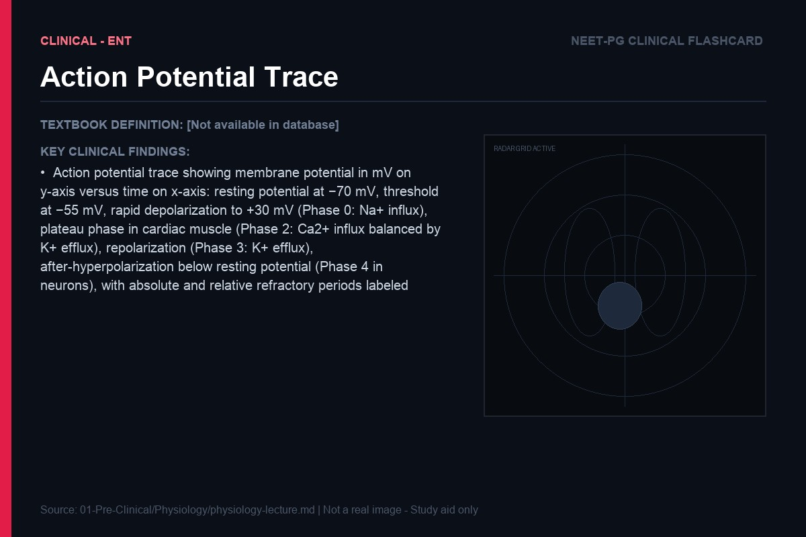
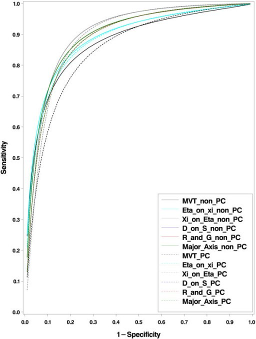
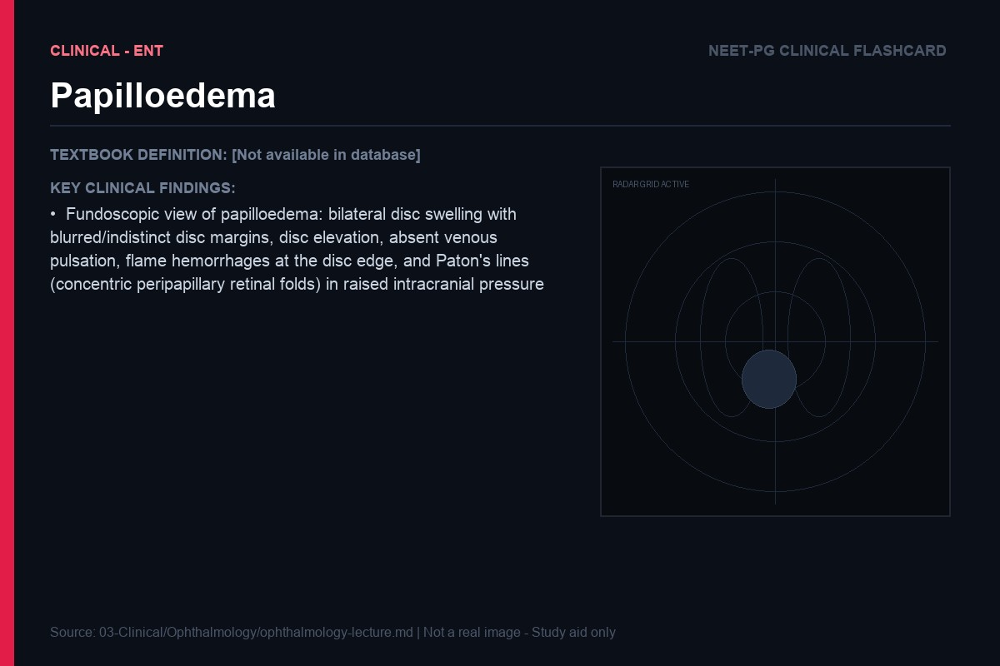

> **Diagram note:** Mermaid mindmap — renders in VS Code (Markdown Preview), Obsidian, or GitHub with the Mermaid extension. Plain-text overview below.

```mermaid
graph TD
    A["🧠 PSYCHIATRY — NEET PG<br/>6 Major Domains"]

    A --> B["Psychotic Disorders"]
    A --> C["Mood Disorders"]
    A --> D["Anxiety & OCD"]
    A --> E["Substance Use"]
    A --> F["Psychopharmacology"]
    A --> G["Forensic & Child Psychiatry"]

    B --> B1["Schizophrenia<br/>≥6 months / Positive & Negative sx"]
    B --> B2["Brief Psychotic Disorder<br/><1 month / Schizoaffective"]
    B --> B3["Delusional Disorder<br/>Non-bizarre delusions / Insight preserved"]

    C --> C1["MDD<br/>SIGECAPS ≥5 for ≥2 weeks"]
    C --> C2["Bipolar I vs II<br/>BPI: Mania ≥7d / BPII: Hypomania + MDD"]
    C --> C3["ECT<br/>Severe depression / Catatonia / TRD"]

    D --> D1["GAD vs Panic Disorder<br/>GAD: generalized / Panic: discrete attacks"]
    D --> D2["OCD<br/>Ego-dystonic / Obsessions + Compulsions"]
    D --> D3["PTSD<br/>Re-experiencing / Avoidance / Hyperarousal"]

    E --> E1["Alcohol<br/>CAGE / Delirium tremens → BZD"]
    E --> E2["Opioids<br/>Withdrawal: CRAMS / Naloxone antidote"]
    E --> E3["Personality Disorders<br/>Cluster A/B/C"]

    F --> F1["Antipsychotics<br/>Typical D2 / Atypical / Clozapine agranulocytosis"]
    F --> F2["Lithium<br/>0.6–1.2 mEq/L therapeutic / Monitor TFT/RFT"]
    F --> F3["Antidepressants<br/>SSRIs first-line / TCAs / MAOIs"]

    G --> G1["McNaughton Rule<br/>IPC Sec 84 / Not know nature of act"]
    G --> G2["ADHD<br/>Methylphenidate / Atomoxetine"]
    G --> G3["Suicide Risk<br/>Male > Female attempts / Female > Male attempts"]
```

**Subject Overview (plain text):**
- Psychotic Disorders: Schizophrenia (≥6 months/Positive & Negative symptoms), Brief Psychotic Disorder (<1 month/Schizoaffective), Delusional Disorder (Non-bizarre delusions)
- Mood Disorders: MDD (SIGECAPS ≥5 for ≥2 weeks), Bipolar I vs II (BPI Mania ≥7d/BPII Hypomania+MDD), ECT (Severe depression/Catatonia/TRD)
- Anxiety & OCD: GAD vs Panic Disorder (GAD generalized/Panic discrete attacks), OCD (Ego-dystonic/Obsessions+Compulsions), PTSD (Re-experiencing/Avoidance/Hyperarousal)
- Substance Use: Alcohol (CAGE/Delirium tremens → BZD), Opioids (Withdrawal CRAMS/Naloxone antidote), Personality Disorders (Cluster A/B/C)
- Psychopharmacology: Antipsychotics (Typical D2/Atypical/Clozapine agranulocytosis), Lithium (0.6–1.2 mEq/L/Monitor TFT/RFT), Antidepressants (SSRIs first-line/TCAs/MAOIs)
- Forensic & Child Psychiatry: McNaughton Rule (IPC Sec 84), ADHD (Methylphenidate/Atomoxetine), Suicide Risk (Male > Female completed/Female > Male attempts)

# Psychiatry — Lecture Notes for NEET PG

*Written in the style of bedside teaching by a thoughtful psychiatrist. Mental illness is brain illness — understand the neurobiology, and the symptoms make sense.*

---

## Introduction: Why Psychiatry Is Medicine

Before we begin the individual topics, let me address the skepticism that some medical students bring to psychiatry. "It's not real medicine." "It's just talking." "There's nothing objective." This skepticism, while understandable, reflects a misunderstanding of what psychiatric disorders are. Every psychiatric disorder we will discuss has a neurobiological basis — aberrant neurotransmitter signaling, dysfunctional neural circuit activity, structural brain changes, dysregulated neuroendocrine axes. The fact that we cannot yet take a brain biopsy and diagnose depression the way we biopsy a lymph node and diagnose lymphoma does not mean that depression is less real than lymphoma. It means our tools are less advanced.

The biopsychosocial model — introduced by George Engel in 1977 — provides the most accurate framework for understanding psychiatric illness. **Biological** factors: genetics (heritability of schizophrenia is ~80%), neurochemistry, neurodevelopment, medical illness, substance use. **Psychological** factors: early experiences, trauma, cognitive patterns, defense mechanisms, personality. **Social** factors: poverty, isolation, family dysfunction, discrimination, life events. In most psychiatric disorders, all three interact — biology creates vulnerability, psychological and social factors determine whether that vulnerability is expressed and how severely.

Think of it this way: a person may carry genetic variants that predispose to schizophrenia (biological), grow up with early trauma and attachment disruption (psychological), and live in poverty with social isolation (social). All three factors lower the threshold at which the illness emerges and worsen its course. Treatment that addresses only one domain — only medication, for example — will be less effective than treatment addressing all three.

---

## Schizophrenia

### Understanding the Dopamine Hypothesis: A Circuit Problem

Schizophrenia affects approximately 1% of the world's population, regardless of culture, geography, or socioeconomic status — one of the strongest pieces of evidence that it has a fundamental neurobiological basis. It is not a "disease of civilization" or a consequence of modern stress. It is a disorder of brain development and neurotransmission that emerges characteristically in late adolescence and early adulthood (peak onset: 18-25 years in men, 25-35 years in women — the sex difference in onset is itself neurobiologically interesting, probably related to the neuroprotective effects of estrogen).

The **dopamine hypothesis** remains the most influential neuroscientific framework for schizophrenia, though it is now understood as more nuanced than it originally appeared. The dopamine system is not a single circuit — it is multiple parallel circuits with different origins, destinations, and functions. Four major dopamine pathways are clinically relevant:

The **mesolimbic pathway** runs from the ventral tegmental area (VTA) to the nucleus accumbens and other limbic structures. This pathway is central to motivation, reward, and salience — it signals "this is important, pay attention to this." In schizophrenia, this pathway is hyperactive — there is excess dopamine transmission at D2 receptors in the limbic system. The consequences: the brain begins attributing salience to stimuli that are actually random and irrelevant. Random thoughts feel profound and meaningful (this is the neurobiological substrate of delusion formation). Internally generated neural activity is experienced as external (this is the neurobiological substrate of auditory hallucinations — the brain generates a signal, but without the tagging mechanism that normally marks self-generated thoughts as "mine," it is experienced as an external voice). These are the positive symptoms of schizophrenia.

The **mesocortical pathway** runs from the VTA to the prefrontal cortex. This pathway is hypoactive in schizophrenia — insufficient dopamine signaling in the PFC. The PFC is responsible for executive function, motivation, working memory, and the regulation of emotion. When this pathway is deficient, you get the negative symptoms: flat affect (reduced emotional expression), alogia (poverty of speech), avolition (profound lack of motivation — not laziness, but a neurological inability to initiate goal-directed activity), anhedonia (loss of pleasure), and asociality. You also get the cognitive symptoms that are, arguably, more functionally disabling than positive symptoms: impaired working memory, attention deficits, and executive dysfunction.

**Analogy:** Imagine the mesolimbic pathway as a fire alarm system. In schizophrenia, the alarm is perpetually triggered — going off randomly, in response to no real fire. Every noise feels significant, every coincidence feels meaningful, every internal thought feels external and threatening. Meanwhile, the mesocortical pathway is the control center that normally would say "wait, let's evaluate this calmly before responding" — and it is understaffed, unable to modulate the alarm's false positives.

The **nigrostriatal pathway** runs from the substantia nigra to the striatum and is the pathway responsible for movement control. This pathway has nothing to do with schizophrenia pathophysiology — but it becomes critically important when you treat schizophrenia. All antipsychotic medications work primarily by blocking D2 dopamine receptors — this reduces mesolimbic hyperactivity and treats positive symptoms. But blocking D2 receptors in the nigrostriatal pathway produces **extrapyramidal side effects (EPS)**: drug-induced parkinsonism (rigidity, tremor, bradykinesia — because nigrostriatal dopamine normally suppresses cholinergic tone in the striatum; blocking it releases cholinergic dominance), akathisia (intense, distressing internal restlessness — one of the most underrecognized and dangerous side effects, because it can drive patients to stop medications and has been associated with suicidality), and tardive dyskinesia (late-onset, often irreversible involuntary movements — particularly orofacial — from D2 receptor upregulation after chronic blockade, causing receptor supersensitivity).

The **tuberoinfundibular pathway** runs from the hypothalamus to the pituitary, where dopamine normally inhibits prolactin secretion. Block D2 here → loss of prolactin inhibition → **hyperprolactinemia**: galactorrhea, amenorrhea, sexual dysfunction, and long-term bone loss from estrogen deficiency.

> **IBQ tip:** In the image, identify each pathway by its origin and termination — mesolimbic ends at the nucleus accumbens (positive symptoms when hyperactive), mesocortical ends at the PFC (negative symptoms when hypoactive). The closest look-alike confusion is mesocortical vs mesolimbic: both originate in the VTA, but mesocortical goes *up* to the cortex (cognition/negatives) while mesolimbic goes to *limbic* structures (reward/positives).

### Why Clozapine Is Different

Clozapine occupies a unique position in antipsychotic pharmacology. Introduced in the 1960s and then withdrawn in many countries in the 1970s (due to fatal agranulocytosis), it was reintroduced in the 1990s after controlled trials demonstrated its superior efficacy in treatment-resistant schizophrenia. It is the only antipsychotic that works when all others have failed — approximately 30-60% of treatment-resistant patients respond to clozapine.

Why does clozapine work differently? Its receptor profile is unusually broad: it has relatively WEAK D2 blockade (compared to haloperidol, for example) but very STRONG blockade of 5-HT2A receptors (serotonin), H1 receptors (histamine), α1-adrenergic receptors, and muscarinic M1 receptors. The 5-HT2A blockade is thought to be critical — serotonin normally inhibits dopamine release in the mesocortical pathway, so blocking 5-HT2A disinhibits mesocortical dopamine release, partially correcting the dopamine deficit in the PFC (improving negative symptoms and cognition) while the weak D2 blockade reduces mesolimbic hyperactivity sufficiently to treat positive symptoms. The weak D2 blockade also explains clozapine's remarkably low EPS profile — minimal nigrostriatal D2 blockade.

But clozapine's broad receptor binding is also the source of its significant side effect burden: weight gain (H1 and 5-HT2C blockade → increased appetite, decreased satiety), metabolic syndrome (insulin resistance), excessive sedation (H1, M1), hypotension (α1 blockade), sialorrhea (paradoxically, despite M1 blockade — possibly through α2 agonism in salivary glands), seizures (lowers seizure threshold at high doses), and the feared agranulocytosis (idiosyncratic, unpredictable, occurs in 1-2% of patients, typically in the first 6 months — requires weekly blood monitoring for 6 months, then fortnightly, then monthly).

> **Key exam insight:** Indications for clozapine: treatment-resistant schizophrenia (failed two antipsychotics at adequate dose and duration), suicidality in schizophrenia/schizoaffective disorder (strong evidence for anti-suicidal effect independent of antipsychotic effect), and tardive dyskinesia (paradoxically, clozapine improves TD because its weak D2 blockade does not produce the supersensitivity that causes TD). It requires mandatory neutrophil monitoring due to agranulocytosis risk.

| Pathway | Origin | Destination | Function | Effect of D2 Blockade |
|---|---|---|---|---|
| Mesolimbic | VTA | Nucleus accumbens, limbic | Salience, reward | Reduces positive symptoms |
| Mesocortical | VTA | Prefrontal cortex | Executive function, motivation | Worsens negative symptoms (problem with conventional antipsychotics) |
| Nigrostriatal | Substantia nigra | Striatum | Motor control | EPS (parkinsonism, akathisia, TD) |
| Tuberoinfundibular | Hypothalamus | Pituitary | Prolactin inhibition | Hyperprolactinemia |

---

## Mood Disorders

### Depression: A Disorder of Brain Circuitry, Not Weakness

Of all the misconceptions about psychiatric illness, perhaps none is more harmful than the belief that depression is a character flaw — a failure of willpower, a choice to remain sad. Depression is a neurobiological disorder with measurable changes in brain structure, function, and neurochemistry. It is no more a moral failure than hypothyroidism or diabetes.

The neural circuitry of mood regulation is distributed across multiple brain regions, all interconnected. The **prefrontal cortex (PFC)** — particularly the dorsolateral PFC (dlPFC) and ventromedial PFC (vmPFC) — is responsible for executive regulation of emotion: the ability to consciously modulate emotional responses, maintain positive affect, and exert top-down control over the limbic system. The **amygdala** is the brain's alarm system — it responds to emotionally salient stimuli, especially threats, with rapid activation and fear/anxiety responses. The **hippocampus** is critical for episodic memory and contextual learning — including learning from emotional experiences. The **anterior cingulate cortex (ACC)** serves as a bridge between cognitive (PFC) and emotional (limbic) processing.

In depression, this circuit is systematically dysregulated. Neuroimaging studies (fMRI, PET) consistently show: reduced activity in the dlPFC (impaired positive emotion regulation, anhedonia, difficulty experiencing reward), increased amygdala activity at rest and in response to negative stimuli (heightened reactivity to negative emotional content — the world looks threatening and bleak, not because it is, but because the amygdala is overactive), reduced hippocampal volume (neuroimaging studies show this reliably in chronic depression — it reflects reduced hippocampal neurogenesis, possibly driven by chronic elevation of cortisol). The result is a brain that cannot generate positive affect, cannot regulate negative affect, and interprets neutral stimuli as threatening.

The **monoamine hypothesis** provides the pharmacological framework: depression results from insufficient activity of serotonin, norepinephrine, and/or dopamine at synapses in mood-relevant circuits. This hypothesis arose from clinical observations: reserpine (which depletes monoamine stores) causes depression; MAOIs (which prevent monoamine breakdown) and tricyclic antidepressants (which block monoamine reuptake) relieve depression. The hypothesis predicts the mechanism of all our major antidepressants: SSRIs block serotonin reuptake, SNRIs block both serotonin and norepinephrine reuptake, NDRIs (bupropion) block norepinephrine and dopamine reuptake.

*Caption: The three main antidepressant classes act at different points on the monoamine synapse. SSRIs block reuptake only; TCAs block reuptake plus multiple other receptors (explaining their side-effect profile); MAOIs prevent intracellular breakdown. The wider receptor footprint of TCAs explains why overdose causes cardiac arrhythmia, seizures, and anticholinergic toxicity — all high-yield exam scenarios.*

But here is where the story gets more interesting. The monoamine hypothesis, strictly interpreted, says that increasing monoamine levels at synapses should relieve depression. And SSRIs do increase synaptic serotonin within hours of the first dose. Yet the clinical antidepressant effect takes 2-4 weeks to emerge. This time lag is the Achilles heel of the pure monoamine hypothesis — it suggests that the therapeutic mechanism is not simply increased monoamine availability, but rather something that takes weeks to develop.

The current understanding involves two additional mechanisms: **autoreceptor desensitization** and **neuroplasticity**. Serotonin neurons have autoreceptors (5-HT1A on the cell body and dendrites; 5-HT1B on the axon terminals) that provide negative feedback — when synaptic serotonin rises, autoreceptors activate and reduce serotonin synthesis and release, partially blunting the initial increase. Over 2-4 weeks of sustained SSRI exposure, these autoreceptors desensitize (downregulate), removing the feedback inhibition and allowing the full increase in serotonergic transmission. **Neuroplasticity:** SSRIs and other antidepressants increase expression of BDNF (brain-derived neurotrophic factor) in the hippocampus. BDNF promotes neurogenesis, dendritic branching, and synaptic strengthening in the hippocampus. Animal studies show that BDNF is necessary for antidepressant effects — blocking BDNF signaling abolishes antidepressant response. Neurogenesis takes weeks to occur, which aligns perfectly with the clinical time course. The current hypothesis: antidepressants work by restoring hippocampal neuroplasticity and remodeling dysfunctional mood circuits, with monoamine increases as the initiating signal.

**Clinical connection:** This understanding of the time course has profound clinical implications. A patient starting an SSRI for the first time will not feel better for 2-4 weeks — but they may experience side effects (nausea, anxiety, insomnia, sexual dysfunction) from day one. This is why many patients stop taking their medication in the first 2 weeks, before they have had a chance to benefit. Counseling patients about this delay — being explicit that "you may feel worse before you feel better, but this medication is working even when you can't feel it yet" — is one of the most important things you can do to improve adherence.

### Bipolar Disorder: The Kindling Model and the Logic of Mood Stabilizers

Bipolar disorder — characterized by episodes of mania (elevated or irritable mood, decreased need for sleep, grandiosity, pressured speech, increased goal-directed activity, impulsivity, racing thoughts) alternating with episodes of depression — affects approximately 1-4% of the population. The lifetime risk is similar in men and women, though the pattern differs: women have more depressive episodes, men more manic. Bipolar I requires at least one manic episode (lasting ≥7 days or requiring hospitalization); Bipolar II features hypomania (less severe, not requiring hospitalization) and depressive episodes.

Understanding why bipolar disorder has the episodic, cycling pattern it does — and why it tends to worsen over time if untreated — requires the **kindling model**. Originally described in epilepsy by Robert Post, kindling refers to the observation that repeated electrical stimulation of limbic structures, each individually insufficient to cause a seizure, eventually causes permanent lowering of the seizure threshold — subsequent stimuli that were originally sub-threshold now trigger full seizures, and eventually the seizure occurs spontaneously without any external trigger. The brain has been permanently sensitized.

Post proposed that bipolar mood episodes follow similar dynamics. Early in the illness, episodes tend to be triggered by identifiable psychosocial stressors. With each episode, the neural circuits involved (particularly limbic and prefrontal circuits governing mood regulation) become progressively sensitized. Later in the illness course, episodes occur more frequently, last longer, and are triggered by progressively smaller stressors — eventually occurring autonomously, with no identifiable external trigger. This explains why the longitudinal course of untreated bipolar disorder tends to worsen: more episodes, shorter inter-episode intervals, progressive cognitive decline.

The kindling model also explains the neuroprotective rationale for mood stabilizers. **Lithium** and **valproate** — the two classical mood stabilizers — both have anticonvulsant-like effects on neural circuits, reducing the excitability of kindled circuits. Lithium acts through multiple mechanisms: inhibition of inositol monophosphatase (depleting inositol and reducing PKC signaling), inhibition of GSK-3β (a kinase involved in apoptosis and neurodegeneration — lithium's inhibition of GSK-3β is thought to be neuroprotective), and upregulation of BDNF and Bcl-2 (an anti-apoptotic protein). Lithium-treated patients show increased gray matter volume in prefrontal regions — direct evidence of neuroplasticity and neuroprotection. Valproate acts through multiple mechanisms including GABA enhancement (increases GABA synthesis and release), sodium channel blockade, and HDAC inhibition (epigenetic effects that regulate gene expression relevant to mood and neuroprotection).

> **Key exam insight:** Lithium has the most evidence for anti-suicidal effects of any mood stabilizer — reducing suicidal behavior by 2-3-fold compared to placebo in bipolar patients. This is independent of its mood-stabilizing effect and may be related to its serotonergic effects. When a bipolar patient presents with suicidality, lithium should be strongly considered if not already prescribed. Therapeutic lithium levels: 0.8-1.2 mEq/L for acute mania, 0.6-0.8 mEq/L for maintenance. Signs of toxicity: tremor (at therapeutic levels — benign), coarse tremor, ataxia, confusion, seizures (at toxic levels >1.5 mEq/L).

*Caption: Lithium toxicity and many psychotropic drugs (TCAs, antipsychotics, methadone) prolong the QT interval and can precipitate torsades de pointes — a polymorphic VT that "twists" around the baseline. QTc >500 ms demands urgent action. Tested as: "lithium patient develops palpitations; ECG shows?"*

**Analogy:** Think of bipolar disorder as a brain with a thermostat that has become increasingly sensitive and unstable. Early on, large temperature swings (major stressors) are needed to trigger the system to overshoot. With kindling, the thermostat becomes hair-trigger — small inputs cause wild temperature swings, and eventually the thermostat oscillates on its own. Mood stabilizers reset the sensitivity of the thermostat.

---

## Anxiety Disorders

### Fear as Physiology: The Normal Made Abnormal

Fear is not a psychiatric problem. Fear is one of the most evolutionarily conserved responses in the animal kingdom — the fight-or-flight response, orchestrated by the amygdala, has kept organisms alive in the face of predators for hundreds of millions of years. When a threat is detected (auditory, visual, olfactory, or contextual cues), the amygdala — particularly its basolateral nucleus — activates, triggering the hypothalamus and brainstem to initiate the autonomic storm of the fear response: sympathetic activation (epinephrine and norepinephrine surge → heart rate increases, blood pressure rises, blood is shunted to muscles, pupils dilate, glucose is mobilized), corticotrophin-releasing hormone (CRH) release from the hypothalamus → ACTH from the pituitary → cortisol from the adrenal cortex (preparing the body for sustained threat). This response is adaptive, life-saving, and brilliant.

Anxiety disorders occur when this beautiful, adaptive system fires inappropriately — in the absence of real threat, or in proportion grotesquely exceeding any actual threat. The amygdala becomes dysregulated: it has a lower threshold for activation (activating in response to minimal or ambiguous stimuli), it generates stronger responses than the stimuli warrant, and it fails to be adequately suppressed by the prefrontal cortex. This last point is crucial: in healthy individuals, the vmPFC exerts top-down inhibitory control over the amygdala, essentially saying "calm down — this is not actually dangerous." This is the neural substrate of "talking yourself down" from anxiety, and it is impaired in anxiety disorders. The PFC has lost its braking ability over the amygdala.

**Analogy:** The amygdala is a smoke detector in your brain — essential for survival, designed to fire in response to real fires. In anxiety disorders, the detector has a faulty sensor that goes off in response to toast, steam, or nothing at all. And the system that would normally reset the detector (the PFC) isn't working properly either.

### Panic Disorder: The Catastrophic Misinterpretation

Panic disorder is characterized by recurrent, unexpected panic attacks — sudden surges of intense fear reaching a peak within minutes, accompanied by physical symptoms (palpitations, shortness of breath, chest pain, dizziness, paresthesias, sweating, trembling) and cognitive symptoms (fear of dying, fear of losing control, fear of "going crazy"). After a panic attack, characteristic anticipatory anxiety and avoidance behavior develop.

The neurobiological model of panic disorder involves a dysfunctional **fear network**: the amygdala, the locus coeruleus (the brainstem's norepinephrine center, which normally activates in response to threat signals and generates the physical fear response), and the periaqueductal gray (PAG — mediates the "freeze" response and contributes to the subjective experience of terror). In panic disorder, this network can be activated by **interoceptive** cues — sensations arising from within the body — as well as by external threats. A slightly elevated heart rate (from climbing stairs, caffeine, emotion), a slight chest tightness, a brief dizziness — any of these interoceptive signals can trigger amygdala activation.

What follows is the classic **panic cycle**: the initial physical sensation (perhaps a racing heart from coffee) → amygdala activation (interprets this as a threat signal) → physiological fear response amplifies the original symptom (more heart racing, more chest tightness) → the person catastrophically interprets these symptoms as evidence of a heart attack or death → this catastrophic cognition further activates the amygdala → the physical symptoms intensify further → the person becomes convinced they are dying. All within minutes. The panic attack is, in a sense, the fear of fear — the physical symptoms of anxiety are mistaken for the symptoms of a life-threatening illness, generating the very anxiety that produces those symptoms.

**Clinical connection:** This understanding has direct therapeutic implications. **Cognitive-behavioral therapy (CBT)** for panic disorder specifically targets the catastrophic cognition: interoceptive exposure (deliberately inducing mild physical sensations — spinning in a chair, breathing through a straw — to demonstrate that they are not dangerous) combined with cognitive restructuring (challenging the belief that "fast heartbeat = heart attack"). Over time, this retrains the PFC to properly contextualize and suppress the amygdala's alarm response. The effect is not just behavioral — fMRI studies show that successful CBT normalizes the PFC-amygdala connectivity in anxiety disorders.

**SSRIs** are the first-line pharmacological treatment for panic disorder — but the therapeutic mechanism is not immediate relief (in fact, SSRIs often transiently worsen anxiety in the first 1-2 weeks, which can be distressing for panic patients — always start low, go slow). Over 4-6 weeks, SSRIs downregulate amygdala reactivity, reduce the sensitization of the fear network, and increase serotonergic modulation of the PFC-amygdala circuit. The result is a raised threshold for panic attacks and a more regulated fear response.

**Benzodiazepines** (lorazepam, clonazepam, diazepam) provide immediate relief from panic and anxiety by potentiating GABA-A receptors — the main inhibitory receptors in the brain. Benzodiazepines bind to an allosteric site on the GABA-A receptor, increasing the frequency of chloride channel opening in response to GABA, hyperpolarizing neurons, and reducing overall neuronal excitability. In the amygdala, this directly suppresses the hyperactivated fear circuitry, providing rapid, reliable anxiolysis. The anti-panic effect is immediate — within 30 minutes of ingestion.

*Caption: The GABA-A receptor works by opening Cl⁻ channels, hyperpolarising the neuron further below threshold — the mirror image of the Na⁺ depolarisation shown here. Benzodiazepines increase Cl⁻ channel opening frequency; barbiturates increase opening duration. This distinction is tested when questions ask which drug has a "ceiling effect" (benzodiazepines — due to limited Cl⁻ driving force at very negative membrane potentials).*

But benzodiazepines carry a critical liability: **physiological dependence**. With chronic benzodiazepine use, GABA-A receptors are chronically overstimulated → they undergo adaptive downregulation (fewer receptors, reduced receptor sensitivity). The brain compensates for chronic inhibitory excess by reducing its own inhibitory capacity. When benzodiazepines are stopped, the downregulated GABA system is suddenly without its pharmacological support → uncompensated neuronal hyperexcitability → benzodiazepine withdrawal: anxiety (worse than before), insomnia, tremor, seizures. This is why benzodiazepines should be used for short-term relief while SSRIs are built up to therapeutic levels, and then gradually tapered. Treating chronic anxiety with chronic benzodiazepines creates a pharmacological prison.

*Caption: EEG is clinically relevant in psychiatry for: confirming encephalopathy in delirium (diffuse slow-wave activity — theta/delta predominance), ruling out absence epilepsy mimicking inattention, and monitoring during ECT. Sleep EEG shows that benzodiazepines suppress REM and Stage 3/4 slow-wave sleep — contributing to non-restorative sleep with chronic use. Tested as: "which sleep stage is suppressed by benzodiazepines?"*

> **Key exam insight:** Benzodiazepine withdrawal is one of the few drug withdrawal syndromes that can be life-threatening (along with alcohol withdrawal — mechanistically identical, since alcohol also potentiates GABA-A). Both can cause seizures. Abrupt cessation after chronic high-dose benzodiazepine use must be avoided — use a gradual taper with a long-acting benzodiazepine (diazepam) for cross-tolerance.

### OCD and PTSD: Circuits of Compulsion and Trauma

**Obsessive-compulsive disorder (OCD)** is characterized by obsessions (intrusive, distressing, unwanted thoughts, images, or urges) and compulsions (repetitive behaviors or mental acts performed to reduce the anxiety generated by obsessions). The neurobiology centers on a dysfunctional **cortico-striato-thalamo-cortical (CSTC) circuit**. In healthy individuals, the orbitofrontal cortex (OFC) monitors for errors and triggers a "something is wrong" signal to the caudate nucleus (in the striatum) → the caudate dampens activity in the globus pallidus → the globus pallidus releases its inhibition of the thalamus → the thalamus sends a signal back to the cortex. In OCD, this loop is hyperactive and fails to terminate: the "something is wrong" signal from the OFC never turns off, even after the person has checked the stove 20 times. The compulsion temporarily suppresses the signal (creating reinforcement for compulsive behavior) but the signal returns within minutes.

**Analogy:** Imagine a car alarm that keeps going off even after you've checked and confirmed the car is fine. The alarm (OFC error signal) keeps sounding. Each time you run outside to check the car (compulsion), it stops briefly — but then starts again. The problem isn't the car (there's nothing actually wrong) — it's the alarm mechanism (the OFC-caudate-thalamo circuit) that won't turn off.

Treatment: **SSRIs at higher doses** than used for depression (OCD requires higher serotonergic activity — e.g., fluoxetine 60-80 mg/day) and **CBT with exposure and response prevention (ERP)**. ERP is the most effective psychological treatment: the patient is gradually exposed to their feared stimuli (touching a "contaminated" surface) and prevented from performing the compulsion (not washing hands). Over time, the anxiety habituates without the compulsion — the OFC error signal diminishes as the brain learns that the feared consequence does not materialize. Neuroimaging studies show that successful ERP treatment normalizes CSTC circuit activity — the hyperactivity in the OFC and caudate decreases to near-normal levels.

**Post-traumatic stress disorder (PTSD)** is the paradigmatic example of fear learning gone wrong. Normal fear learning: the amygdala, in conjunction with the hippocampus, encodes the memory of a traumatic event with strong emotional valence — this is adaptive, it ensures you avoid similar dangers in the future. Normal fear extinction: the vmPFC gradually learns to inhibit the amygdala's response to the trauma cue, reducing the conditioned fear response over time. In PTSD, this extinction fails — the vmPFC cannot adequately suppress the amygdala, and the trauma memory remains raw, unprocessed, and highly reactive. Every reminder of the trauma (re-experiencing — intrusive memories, nightmares, flashbacks) triggers a full amygdala activation and physiological fear response as if the trauma were happening again.

Neurobiologically: PTSD is associated with amygdala hyperreactivity, vmPFC hypoactivity (failure of top-down extinction), and hippocampal atrophy (the hippocampus is critical for contextualizing memories — placing them in the past, recognizing that a cue in the present is not the actual danger. With reduced hippocampal volume/function, context processing fails, and old threats feel current). Chronic cortisol elevation (from sustained HPA axis activation) contributes to hippocampal damage — cortisol is neurotoxic to hippocampal pyramidal cells at high concentrations.

Treatment: trauma-focused psychotherapy (prolonged exposure, EMDR — Eye Movement Desensitization and Reprocessing), SSRIs (sertraline and paroxetine are FDA-approved for PTSD). EMDR is particularly interesting neurobiologically — the bilateral eye movements during trauma processing may engage the hippocampus and facilitate reconsolidation of the traumatic memory in a less emotionally charged form, although the mechanism remains debated.

---

## Substance Use Disorders

### The Hijacked Reward System

Addiction — now termed substance use disorder — is perhaps the most misunderstood condition in psychiatry. The popular conception of addiction as a moral failing, a choice, a lack of willpower — this conception is not just wrong, it is harmful. Addiction is a disorder of the brain's reward and motivation circuitry, specifically the dopaminergic mesolimbic pathway (the nucleus accumbens — the brain's "pleasure center" — and its connections to the PFC and amygdala).

All addictive substances — whether alcohol, opioids, cocaine, amphetamines, nicotine, or cannabis — share one fundamental neurobiological property: they cause a supraphysiological surge of dopamine in the nucleus accumbens. Alcohol does this by potentiating GABA-A and inhibiting NMDA receptors, which disinhibits dopamine neurons in the VTA (they are released from GABAergic inhibition). Opioids do this by activating mu-opioid receptors on GABA interneurons in the VTA — the same disinhibition mechanism. Cocaine and amphetamines do this directly — cocaine blocks the dopamine transporter (DAT), preventing reuptake; amphetamines reverse the DAT to actively pump dopamine out. Nicotine activates nicotinic acetylcholine receptors on VTA dopamine neurons, directly stimulating dopamine release.

The result: a dopamine surge 2-10 times greater than any natural reward (food, sex, social interaction). The nucleus accumbens receives this signal as an overwhelming "THIS IS IMPORTANT — REMEMBER THIS AND DO IT AGAIN" signal. Over time, several things happen. **Tolerance**: with repeated drug exposure, dopamine receptors in the nucleus accumbens downregulate (the brain protects itself from overstimulation). Natural rewards — which produce modest dopamine releases — no longer produce meaningful pleasure responses in a desensitized reward system. The person loses interest in previously pleasurable activities (anhedonia) — but drug use, because it produces such a massive dopamine surge, remains reinforcing even as tolerance develops. This is why addicted individuals describe feeling "empty" without drugs even though they don't particularly enjoy using them anymore.

**Craving and relapse** involve the prefrontal cortex and anterior cingulate cortex — addiction damages the very brain regions responsible for impulse control and decision-making. Long-term substance use produces structural changes in the PFC (reduced gray matter, impaired white matter connectivity between PFC and nucleus accumbens) — the circuits responsible for choosing long-term benefits over short-term urges are literally damaged. This is why relapse is so common: it is not weakness. The brain circuits that should say "don't do this — remember the consequences" are impaired by the addiction itself.

**Clinical connection:** Understanding the neurobiological basis of addiction changes how you approach treatment. Medications for opioid use disorder: **methadone** (full mu-opioid agonist — taken daily under supervision, it prevents withdrawal and reduces craving without producing the euphoric spike of heroin; the key is the slow, steady blood level, which avoids the "high"), **buprenorphine** (partial mu-opioid agonist with ceiling effect — reduces withdrawal and craving, much lower overdose risk than methadone, can be prescribed for self-administration; often combined with naloxone to deter injection), **naltrexone** (mu-opioid antagonist — blocks the euphoric effect of opioids entirely, effective for motivated patients, available as monthly injection for adherence). For alcohol use disorder: **naltrexone** (reduces alcohol craving by blocking the opioid-mediated reward component of alcohol use), **acamprosate** (reduces NMDA receptor hyperexcitability during protracted withdrawal, reducing craving), **disulfiram** (inhibits aldehyde dehydrogenase → acetaldehyde accumulates with alcohol use → aversive flushing, nausea, vomiting).

> **Key exam insight:** CAGE questionnaire: Cut down (have you felt you should), Annoyed (have people annoyed you by criticizing your drinking), Guilty (have you felt guilty about drinking), Eye-opener (have you had a drink first thing in the morning). Two or more positive responses: high sensitivity for alcohol use disorder. AUDIT (Alcohol Use Disorders Identification Test) is more comprehensive and internationally validated.

> **IBQ tip:** In the table image, the key feature to identify is which letter corresponds to which question — "Eye-opener" (morning drink) is the item most specific for dependence, distinguishing it from hazardous use. The AUDIT table looks similar but has 10 items scored 0-4; CAGE has only 4 binary yes/no items — the number of rows instantly differentiates them.

---

## Personality Disorders

### When Traits Become Disorder

Personality disorders represent enduring, inflexible patterns of inner experience and behavior that deviate markedly from cultural expectations, are pervasive and stable across time, cause significant distress or functional impairment, and are not better accounted for by another mental disorder or substance effects. They are clustered into three groups in DSM-5:

**Cluster A** ("odd, eccentric"): Paranoid, Schizoid, Schizotypal — these share genetic and phenomenological overlap with the schizophrenia spectrum. Schizotypal personality disorder (ideas of reference, magical thinking, odd perceptual experiences, social isolation) may represent a genetically milder expression of the same neurodevelopmental vulnerability that produces schizophrenia in more severely affected individuals.

**Cluster B** ("dramatic, emotional, erratic"): Antisocial, Borderline, Histrionic, Narcissistic. **Borderline personality disorder (BPD)** deserves extended discussion because it is both common (2-3% prevalence) and clinically challenging. BPD is characterized by: frantic efforts to avoid abandonment, unstable and intense relationships (idealization alternating with devaluation — splitting), identity disturbance, impulsivity (self-damaging), recurrent self-harm or suicidal behavior, affective instability (intense emotional reactivity with difficulty returning to baseline), chronic feelings of emptiness, inappropriate intense anger, and transient stress-related dissociation. The neurobiology: amygdala hyperreactivity (heightened emotional responses) combined with PFC hypoactivity (poor emotion regulation, impulsivity) — a pattern that overlaps with PTSD, reflecting the high rates of early trauma (especially childhood sexual abuse and neglect) in BPD patients.

**Analogy:** Imagine having no emotional calluses. Every emotional experience — a friend being 10 minutes late, a perceived slight in a text message, a change of plans — lands like a blow to exposed, tender skin. The emotional reactivity is not disproportionate to the person's subjective experience of pain — it is disproportionate to what most people would feel in that situation, because BPD removes the buffering that most people's emotional systems provide.

The most evidence-based treatment for BPD is **Dialectical Behavior Therapy (DBT)**, developed by Marsha Linehan (who herself had BPD). DBT teaches four skill sets: mindfulness, distress tolerance, emotional regulation, and interpersonal effectiveness. It dramatically reduces self-harm, suicidality, hospitalizations, and improves quality of life. The pharmacotherapy for BPD is symptomatic — SSRIs or mood stabilizers for affective instability, low-dose antipsychotics for brief psychotic episodes during stress.

*Caption: Aripiprazole — used as an adjunct in BPD affective instability — is a partial D2 agonist, exemplified by the partial agonist curve above. It acts as a functional antagonist when synaptic dopamine is high (mesolimbic hyperdopaminergia) but as a weak agonist when dopamine is low (mesocortical hypodopaminergia). This "dopamine system stabiliser" mechanism is why aripiprazole has a low EPS and metabolic profile compared to full D2 antagonists.*

**Cluster C** ("anxious, fearful"): Avoidant, Dependent, Obsessive-Compulsive personality disorder. These share phenomenological overlap with anxiety disorders — avoidant personality disorder, for example, is distinguished from social anxiety disorder primarily by the degree of pervasiveness and ego-syntonic quality of the traits.

> **Key exam insight:** Personality disorders, by definition, have early onset (adolescence or early adulthood), are ego-syntonic (the person does not usually experience their personality as the problem — they experience others and the world as the problem), and are pervasive. They are NOT episodes — they are enduring. This distinguishes personality disorder from mood disorder (episodic) or psychosis (episodic in most forms). Comorbidity is common and complicates treatment.

---

## Child and Adolescent Psychiatry

### ADHD: The Underpowered PFC

Attention-deficit/hyperactivity disorder (ADHD) is the most common neurodevelopmental disorder, affecting 5-7% of children worldwide. It is characterized by inattention (difficulty sustaining attention, easily distracted, forgetful, losing things) and/or hyperactivity-impulsivity (fidgeting, leaving seat, running/climbing inappropriately, talking excessively, blurting out answers, difficulty waiting). By definition, symptoms must be present in multiple settings (not just school or just home), onset before age 12, and cause functional impairment.

The neurobiological core of ADHD: **prefrontal cortex hypofunction**. The PFC is responsible for executive functions — working memory, inhibitory control, attention regulation, planning, and cognitive flexibility. In ADHD, PFC activity is reduced, particularly in the dlPFC and ACC. This manifests as difficulty suppressing irrelevant thoughts and impulses (impaired inhibitory control), difficulty maintaining goal-directed attention in the absence of immediate reward (attention to "boring" tasks requires PFC to maintain the goal representation — this is impaired), and difficulty regulating activity level to match situational demands.

The catecholamine hypothesis explains ADHD pharmacology: optimal PFC function requires optimal — not too low, not too high — levels of dopamine and norepinephrine in the PFC. Too little of either impairs PFC-mediated working memory and inhibitory control. Stimulant medications (**methylphenidate**, which blocks DAT and NET; **amphetamine salts**, which also reverse DAT/NET and increase catecholamine release) raise dopamine and norepinephrine levels in the PFC to the optimal range. Non-stimulant medications (**atomoxetine**, a selective NET inhibitor; **guanfacine**, an α2A agonist that directly activates postsynaptic receptors on PFC neurons) also improve PFC catecholaminergic function.

> **Key exam insight:** Stimulant medications (methylphenidate, amphetamine) are Schedule II controlled substances with potential for abuse — their mechanism (dopamine increase in nucleus accumbens as well as PFC) means they have reinforcing properties at supraphysiological doses or when taken by people without ADHD. However, in properly diagnosed ADHD patients, stimulants are taken at doses that specifically improve PFC function without producing the abuse-associated dopamine spike. Untreated ADHD, paradoxically, is a risk factor for substance use disorder — probably because impulsivity and sensation-seeking drive self-medication with illicit drugs.

---

## Forensic Psychiatry

### The McNaughton Rules and Criminal Responsibility

When a person commits a crime while suffering from severe mental illness, the law grapples with the question of criminal responsibility: can someone be held morally and legally responsible for actions that resulted from a disease of the brain? The McNaughton rules (established 1843, following the trial of Daniel McNaughton who shot the British Prime Minister's secretary while suffering from paranoid delusions) provide the classical legal standard: a person is not criminally responsible if, at the time of the act, they were suffering from such a defect of reason from disease of the mind that they either: (1) did not know the nature and quality of the act they were doing, or (2) if they did know it, they did not know that what they were doing was wrong.

This is a high threshold. Most people with schizophrenia who commit crimes do so with awareness that their actions are illegal — they may have delusional justifications for the act, but they know it is illegal. The McNaughton defense applies to the extreme cases — a person with command hallucinations who genuinely does not know they are hurting a real person, for example.

**Clinical connection:** Fitness to stand trial (competency) is separate from the insanity defense. A defendant must be competent to stand trial — meaning they currently understand the charges against them and can assist in their own defense. A person can have been insane at the time of the offense but competent to stand trial now (their illness may be treated). Competency is assessed by the treating psychiatrist using structured tools (MacArthur Competence Assessment Tool for Treatment — MacCAT-T) and is ultimately a legal determination, not a medical one.

*Caption: Forensic psychiatry tools (CAGE, AUDIT, McNaughton assessment instruments) all have published sensitivity and specificity figures that are tested numerically. The 2×2 table is the universal framework — CAGE ≥2 has sensitivity ~85% and specificity ~70-80% for alcohol use disorder. A perfect screening test (high sensitivity = low false-negative rate) is different from a perfect confirmatory test (high specificity = low false-positive rate): for forensic psychiatric assessment, both dimensions matter because errors in either direction have legal consequences.*

---

---

## Substance Use Disorders: The Neurobiology of Addiction

### How Drugs Hijack the Brain's Reward System

The section on substance use disorders already introduced the foundational framework of the mesolimbic dopamine system and specific pharmacological treatments. Let us now build a deeper mechanistic understanding of tolerance, withdrawal, and the particular pathophysiology of alcohol — because these are the examination battlegrounds.

**Tolerance** is one of the most counterintuitive phenomena in pharmacology: you take more drug and feel less effect. The explanation requires understanding that the brain is not a passive recipient of pharmacological manipulation — it is an adaptive organ that constantly attempts to restore equilibrium. When a drug produces supraphysiological dopamine release in the nucleus accumbens, the brain does not simply accept this: it responds by **downregulating dopamine receptors** (particularly D1 and D2 receptors in the nucleus accumbens and prefrontal cortex) and by reducing the downstream signaling efficiency of D1-mediated cAMP/PKA cascades. The brain is turning down the volume on its reward circuitry to compensate for the artificially loud signal.

The tragic consequence: the downregulated reward system now has a **reduced baseline hedonic set-point**. Natural rewards — the pleasure of food, sex, social connection, achievement — produce only modest dopamine releases. These modest releases, hitting a desensitized, downregulated receptor population, produce negligible pleasure. The world becomes grey and joyless without the drug. This is why tolerance and anhedonia (the loss of pleasure from previously enjoyable activities) are so tightly linked in addiction — they are two faces of the same receptor downregulation. The person now needs more drug simply to feel baseline normal, not to feel the original euphoria.

**Withdrawal** is the equal and opposite consequence of the same homeostatic adaptation. When the drug is abruptly removed, the brain's compensatory downregulation is suddenly unmasked: the inhibitory mechanisms the brain built to counteract the drug's effect are now unopposed. The result is a **rebound** — the exact opposite of the drug's acute pharmacological effect.

Consider opioid withdrawal: opioids (heroin, morphine, codeine, fentanyl) work primarily by activating mu-opioid receptors. One of the key effects of opioid agonism is **suppression of the locus coeruleus**

*Caption: Opioids have a narrow therapeutic index — the difference between an analgesic dose and a respiratory-depressant dose is small. Methadone maintenance therapy aims to keep plasma levels within the therapeutic window using its long half-life to avoid peaks (euphoria/toxicity) and troughs (withdrawal). Buprenorphine's ceiling effect on the ED50 curve (partial agonist) shifts the LD50 curve far right, making overdose much less likely — the visual basis for its improved safety profile.* (the brainstem's norepinephrine nucleus — the primary source of norepinephrine in the brain, with projections to the cortex, limbic system, spinal cord, and peripheral sympathetic ganglia). The locus coeruleus drives sympathetic tone and arousal; opioids quiet it. With chronic opioid use, the locus coeruleus adapts by upregulating its firing rate to compensate for chronic suppression. When opioids are withdrawn, this hyper-sensitized, upregulated locus coeruleus fires without restraint — producing a **sympathetic storm**: tachycardia, hypertension, diaphoresis, piloerection ("cold turkey" — literally, goosebumps resembling a plucked turkey's skin), lacrimation, rhinorrhea, mydriasis, diarrhea, intense anxiety, insomnia, and diffuse muscle aching. Opioid withdrawal is agonizing but rarely life-threatening in otherwise healthy adults.

**Analogy:** Opioids act like a hand pressing down on a spring (the locus coeruleus). The spring compresses and adapts by becoming stiffer in resistance. Remove the hand (withdraw the opioid), and the stiffened spring shoots upward violently — overshoot, not just return to baseline.

**Alcohol withdrawal** operates through a different but parallel mechanism, and it can be lethal. Alcohol has two primary pharmacological actions: it **potentiates GABA-A receptors** (increasing chloride influx → neuronal hyperpolarization → global CNS depression) and it **blocks NMDA glutamate receptors** (reducing excitatory glutamate transmission). The combined effect is powerful CNS inhibition — sedation, anxiolysis, impaired coordination, ultimately anesthesia and coma at high doses.

With chronic alcohol exposure, the brain adapts in the equal and opposite direction: GABA-A receptors are **downregulated** (reduced number and sensitivity — the brain reduces its inhibitory capacity to compensate for chronic pharmacological enhancement), and NMDA receptors are **upregulated** (the brain increases its excitatory capacity to compensate for chronic blockade). Now remove alcohol: the downregulated GABA system provides insufficient inhibition, and the upregulated NMDA system provides excessive excitation. The brain is simultaneously under-braked and over-accelerated. The consequence: neuronal hyperexcitability → anxiety, tremor, insomnia, tachycardia, hypertension, sweating (the early syndrome, 6-24 hours after last drink) → seizures (24-48 hours — "rum fits," typically generalized tonic-clonic, can be status epilepticus) → delirium tremens (48-96 hours — the fully developed syndrome: florid psychosis with visual hallucinations, extreme autonomic instability, hyperthermia, potentially fatal).

> **IBQ tip:** In the image, identify the temporal sequence — seizures peak before delirium tremens, not simultaneously. The closest look-alike error is confusing the hallucination band (12-24 h, patient is alert) with the delirium tremens band (48-96 h, patient is confused/agitated); the key differentiator is whether consciousness is impaired — it is not in alcoholic hallucinosis but is in DTs.

> **Key exam insight:** Alcohol withdrawal seizures are managed with benzodiazepines (lorazepam IV for acute seizure; diazepam or chlordiazepoxide on a tapering schedule for the withdrawal syndrome). Benzodiazepines are the substitution therapy — they potentiate GABA-A receptors by the same mechanism as alcohol, providing the inhibitory support the downregulated GABA system can no longer provide, while being tapered slowly enough to allow receptor re-upregulation. Phenytoin is NOT effective for alcohol withdrawal seizures (the mechanism — NMDA hyperexcitability and GABA deficiency — is not the mechanism phenytoin targets).

### Wernicke's Encephalopathy: Thiamine, Glucose, and a Critical Priority Rule

Wernicke's encephalopathy (WE) is an acute neurological emergency caused by **thiamine (Vitamin B1) deficiency** in the context of chronic alcohol use. Understanding why it occurs requires understanding thiamine's biochemical role.

Thiamine pyrophosphate (the active form of thiamine) is an essential cofactor for three critical enzymes in carbohydrate metabolism: **pyruvate dehydrogenase** (converts pyruvate to acetyl-CoA — the gateway to the Krebs cycle), **alpha-ketoglutarate dehydrogenase** (a key Krebs cycle enzyme), and **transketolase** (in the pentose phosphate pathway). These enzymes collectively generate NADH and ATP — the energy currency of cells. Without thiamine, these enzymes fail, and cells cannot produce adequate ATP through aerobic metabolism.

Why are alcoholic patients thiamine-deficient? Two compounding mechanisms: (1) **malabsorption** — ethanol directly impairs thiamine absorption from the small intestine by damaging intestinal mucosa and impairing active transport of thiamine via the thiamine transporter (THTR1); and (2) **increased consumption** — the high carbohydrate intake of many alcoholic patients (alcohol is metabolized as a carbohydrate equivalent) increases the metabolic demand for thiamine as a cofactor. The combination of reduced intake and increased demand rapidly depletes thiamine stores (which are meager — the body has only 2-3 weeks of thiamine stores at baseline).

Why do the **mammillary bodies and the mediodorsal thalamus** bear the brunt of thiamine deficiency? These structures have the highest metabolic demand relative to their size in the brain — they require a disproportionate amount of ATP per unit time. When thiamine-dependent energy production fails, these high-demand areas reach the threshold of energy failure before other brain regions, producing selective necrosis. The classic clinical triad of Wernicke's encephalopathy reflects the anatomy of these lesions: **confusion/encephalopathy** (thalamic involvement), **ophthalmoplegia and nystagmus** (cranial nerve nuclei III, VI in the periaqueductal gray and tegmentum — also thiamine-vulnerable areas), and **ataxia** (involvement of the vestibulocerebellar connections through the mammillary bodies and thalamus).

If Wernicke's is untreated or inadequately treated, the surviving patient may develop **Korsakoff's syndrome**: a chronic amnestic disorder characterized by severe anterograde amnesia (inability to form new memories), retrograde amnesia, and — characteristically — **confabulation** (the patient unconsciously fabricates memories to fill the gaps, without awareness of doing so). Korsakoff's reflects permanent structural damage to the mammillary bodies and mediodorsal thalamus, which are critical nodes in the Papez circuit for memory.

**The glucose-before-thiamine rule — and why it is wrong:** A common clinical scenario in emergency medicine is a patient presenting with altered consciousness who may be both hypoglycemic and thiamine-deficient (alcoholic patients, malnourished patients). The historical teaching was to give glucose first, then thiamine. This is backwards and dangerous: **give thiamine BEFORE glucose**.

The reasoning: thiamine-dependent enzymes are responsible for metabolizing glucose (specifically, pyruvate dehydrogenase is required to convert glucose's metabolic product, pyruvate, into acetyl-CoA for complete oxidation). If you administer a glucose load to a thiamine-depleted patient, you dramatically increase the metabolic demand for thiamine at precisely the moment when thiamine is absent. Pyruvate cannot be converted to acetyl-CoA → it accumulates → is converted to lactate instead → **lactic acidosis** worsens. Simultaneously, the increased metabolic demand of glucose metabolism in high-demand brain regions (mammillary bodies, thalamus) drives acute energy failure and neuronal necrosis — **precipitating acute Wernicke's encephalopathy** or converting subclinical Wernicke's into fulminant disease. Thiamine given first (IV, 100-500 mg before any glucose administration) allows adequate cofactor to be present when the glucose load arrives.

**Analogy:** Giving glucose without thiamine to a depleted patient is like running a factory at full speed with no oil in the machines. The increased activity only accelerates the damage.

*Caption: Wernicke's encephalopathy can produce raised intracranial pressure in severe cases, causing papilloedema visible on fundoscopy. More importantly, the ocular motor signs (ophthalmoplegia, nystagmus) are the most specific features of the classic triad and should be specifically sought. Blurred disc margins here vs the normal sharp disc edge is the key visual discriminator.*

---

## Child and Adolescent Psychiatry: Deeper Dives

### Autism Spectrum Disorder: The Social Brain and Theory of Mind

Autism spectrum disorder (ASD) is a neurodevelopmental condition characterized by deficits in social communication and interaction, and restricted, repetitive patterns of behavior, interests, or activities. Its prevalence has risen dramatically over recent decades (now ~1 in 36 children in the US), partly due to broadened diagnostic criteria and greater awareness, and possibly partly due to genuine increases in prevalence.

The defining cognitive feature of ASD — the one that underlies most of the social symptoms — is a deficit in **theory of mind** (ToM), also called "mentalizing." Theory of mind is the ability to understand that other people have their own mental states — their own beliefs, desires, intentions, and knowledge — that are different from your own. Most typically developing children acquire a reliable theory of mind between 3-5 years of age. Children with ASD characteristically fail to develop this capacity fully or develop it late and incompletely.

The most elegant demonstration of ToM is the **Sally-Anne false belief test**, used clinically to assess theory of mind. The scenario: Sally has a basket; Anne has a box. Sally puts a marble in her basket, then leaves the room. While Sally is gone, Anne takes the marble from Sally's basket and puts it in her box. Sally comes back. Where will Sally look for the marble?

A typically developing 4-year-old answers: "In her basket" — because they understand that Sally has a **false belief** (she doesn't know the marble was moved, so she still believes it's in her basket). The child is tracking Sally's mental state separately from their own knowledge.

A child with ASD typically answers: "In the box" — because they answer from their own knowledge (they know the marble is in the box) without being able to shift perspective to model Sally's separate, false belief. They cannot compute Sally's mental state as distinct from reality. This is not a memory failure or attention failure — it is a specific deficit in the cognitive architecture that represents other minds.

**Clinical connection:** This core deficit in mentalizing explains the full ASD phenotype. Difficulty reading social cues (facial expressions, tone of voice, body language are all signals about other people's mental states — decoding them requires ToM). Difficulty with non-literal language (sarcasm, irony, metaphor all require computing what the speaker intends rather than what the words literally say — this is ToM-dependent). Difficulty with joint attention (pointing to share interest with another person — "look at that, isn't it interesting?" — requires understanding that the other person has a perspective to share). Difficulty with imaginative play (pretend play requires modeling another character's mental states and perspectives).

The neurobiological basis of ToM deficits in ASD involves the **social brain network** — a distributed set of regions including the medial prefrontal cortex (involved in self-referential and other-referential mentalizing), the temporoparietal junction (TPJ — particularly important for distinguishing self from other, and for decoding others' beliefs and intentions), the superior temporal sulcus (STS — processes biological motion, gaze direction, and social meaning of observed actions), and the fusiform face area (FFA — specialized for face processing). Neuroimaging in ASD consistently shows reduced activation and altered connectivity in this network during social cognition tasks.

The **mirror neuron system** — neurons in the premotor cortex and inferior parietal lobule that fire both when an individual performs an action and when they observe another performing the same action — has been proposed to play a role in ASD, with the "broken mirror" hypothesis suggesting that impaired mirror neuron function underlies the social-cognitive deficits. This hypothesis remains contested but has been productive in generating research.

*Caption: ASD red flags on the developmental chart: no babbling by 12 months, no single words by 16 months, no two-word spontaneous phrases by 24 months, or any regression in language or social skills at any age — each of these warrants immediate evaluation. The chart anchors normal milestones for ADHD vs ASD comparison: ADHD typically shows normal developmental milestones but executive-dysfunction symptoms presenting in a structured school environment, whereas ASD shows early social-communication deviation visible before 24 months.*

**Analogy:** Theory of mind is like a social GPS that tells you where another person is standing mentally — what they believe, want, and feel from their vantage point. ASD is like navigating social life with the GPS turned off. You can still move through the world, but you lack the map that everyone else is using to coordinate movements with each other.

> **Key exam insight:** DSM-5 ASD diagnostic criteria require: (A) persistent deficits in social communication and interaction across multiple contexts, AND (B) restricted, repetitive patterns of behavior, interests, or activities. Symptoms must be present in early developmental period (may not fully manifest until social demands exceed limited capacity). Severity is rated on a three-level scale based on support requirements. ASD has high heritability (~80%) but is polygenic — hundreds of genes contribute small-effect variants; rare copy number variants (15q11-13, 16p11.2 deletions/duplications) confer large risk. There is NO causal link between vaccines and autism — the original Wakefield study was fraudulent and has been formally retracted.

### ADHD: The Prefrontal Cortex Catecholamine Theory

ADHD is already introduced earlier in these notes. Here we deepen the neurobiology that is most testable.

The prefrontal cortex is disproportionately affected in ADHD — neuroimaging studies consistently show reduced gray matter volume in the dorsolateral PFC, inferior frontal gyrus, and anterior cingulate cortex in children with ADHD relative to age-matched controls (though the developmental trajectory matters: many ADHD children show cortical maturation delays of approximately 3-5 years rather than permanent differences — the PFC catches up, partially explaining why many adults show reduced symptom severity). The PFC is slower to mature than any other cortical region (myelination of PFC is not complete until the mid-20s), which explains why ADHD symptoms are most prominent in childhood and improve, though often persist, into adulthood.

The **catecholamine hypothesis of PFC function** is the key: the PFC requires an optimal, narrow range of dopamine (D1 receptor-mediated) and norepinephrine (α2A receptor-mediated) signaling to perform its executive functions — working memory (holding information in mind and manipulating it), inhibitory control (suppressing prepotent but inappropriate responses), and attentional regulation (staying on task rather than being captured by salient distractors). Both too little and too much catecholamine impairs PFC function (an inverted-U dose-response relationship). In ADHD, catecholamine signaling in the PFC is suboptimal — there is insufficient D1 and α2A receptor stimulation, impairing these executive functions.

The implication: a child who cannot sustain attention on a "boring" math worksheet is not lazy — their PFC literally cannot maintain the goal representation strongly enough to resist distraction. A child who blurts out answers before the question is finished is not rude — their PFC cannot apply sufficient inhibitory control to suppress the prepotent response. A child who cannot sit still is not defiant — their PFC cannot regulate motor activity level to match situational demands (sitting still requires the PFC to continuously suppress the child's naturally higher activity drive). Reconceptualizing ADHD symptoms as PFC executive dysfunction rather than behavioral misbehavior changes everything about how you approach the patient and family.

**Clinical connection:** This is why stimulants work for ADHD — they raise PFC catecholamine signaling toward the optimal range — but only at therapeutic doses in diagnosed patients. Supraphysiological doses in people without ADHD produce too much PFC catecholamine stimulation (climbing the right side of the inverted-U) and impair PFC function, causing anxiety, impaired cognition, and in the case of amphetamines, psychosis. This is also why untreated ADHD is not "just about school performance" — impulsivity and poor executive function drive higher rates of accidents, relationship difficulties, risk-taking behavior, and substance use disorder across the lifespan.

> **Key exam insight:** ADHD in girls is chronically under-diagnosed. Boys typically present with the hyperactive-impulsive subtype (visible, disruptive) while girls more commonly present with the predominantly inattentive subtype (the "daydreamer" who quietly struggles academically). The inattentive subtype often escapes diagnosis until the academic demands of secondary school exceed the compensatory strategies the child has developed. Treat with methylphenidate (first-line in India) or atomoxetine (preferred when comorbid anxiety is present, or when stimulant abuse risk is a concern in the household). Behavioral therapy is essential alongside pharmacotherapy, particularly in children under 6 years where stimulants are less well-studied.

*Caption: Methylphenidate follows first-order kinetics — its plasma concentration decays exponentially, which is why twice-daily dosing is needed for the immediate-release form and why extended-release formulations maintain flatter concentration curves. Alcohol in the brain — a key ADHD comorbidity context — follows zero-order kinetics at drinking doses: a constant amount (~10 mL ethanol/hour) is eliminated regardless of plasma level. This explains why blood alcohol concentration falls predictably by ~15–20 mg/dL/hour regardless of how much was drunk.*

*Psychiatry is not soft medicine. It is neuroscience applied to suffering. Approach every patient with the same diagnostic rigor you would bring to cardiology or nephrology — and the empathy that all suffering demands.*
