# Radiology — Image-Based MCQs (IBQ)

> 25 questions | Image interpretation | NEET PG pattern
> These questions use actual radiological images — practice identifying signs visually.

---

**Q1.**

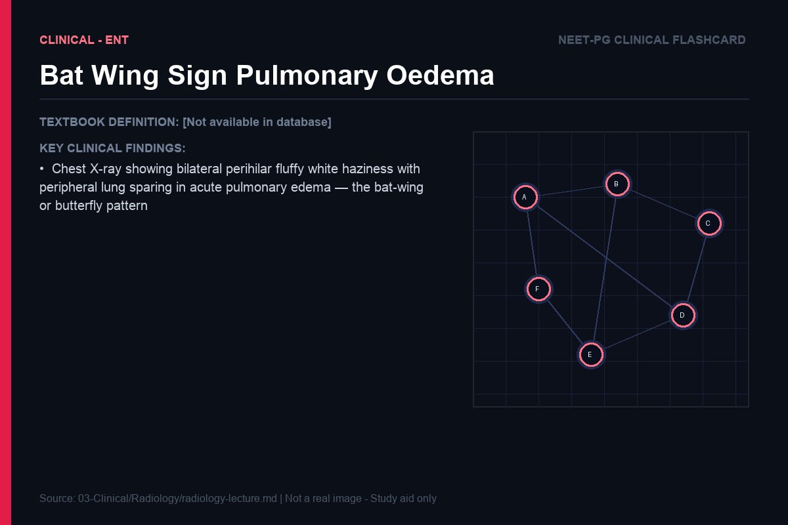

**The chest X-ray finding shown above is MOST consistent with:**
- A) Lobar pneumonia
- B) Pulmonary oedema
- C) Pulmonary embolism
- D) Tension pneumothorax

Answer

**Correct: B** — **Bat-wing (butterfly) sign**, seen in **acute pulmonary oedema**. Bilateral perihilar shadowing with relative peripheral sparing creates a bat-wing shape; caused by fluid redistribution to the perihilar zone due to raised pulmonary venous pressure. Other options: A) lobar pneumonia causes unilateral lobar consolidation; C) PE shows oligaemia (Westermark sign); D) tension pneumothorax shows absent lung markings with mediastinal shift away.

---

**Q2.**

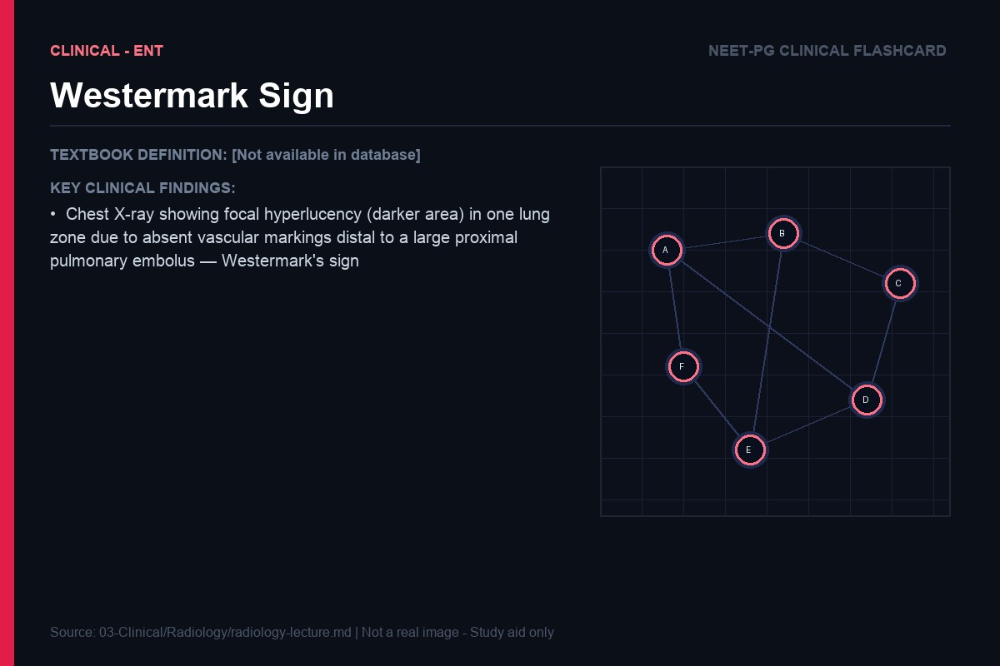

**The radiological finding shown is the Westermark sign. This is MOST associated with:**
- A) Tension pneumothorax
- B) Pulmonary embolism
- C) Lung abscess
- D) Lobar collapse

Answer

**Correct: B** — **Westermark sign** is focal oligaemia (decreased vascular markings) distal to a pulmonary embolus on plain CXR. It reflects absent blood flow beyond the occluded vessel. Other options: A) pneumothorax shows absent lung markings at the periphery with a visible pleural line; C) lung abscess shows a cavity with an air-fluid level; D) lobar collapse shows increased density and volume loss.

---

**Q3.**

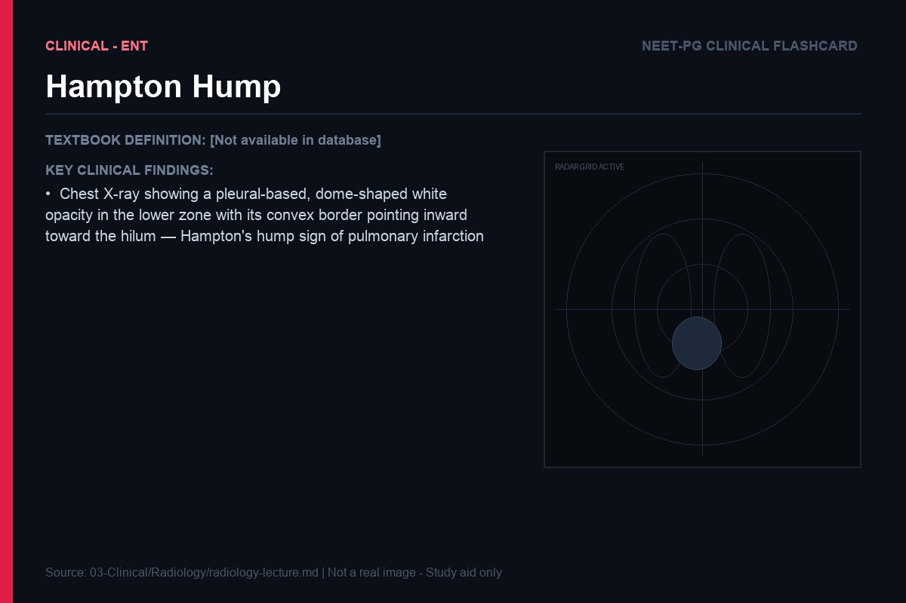

**The wedge-shaped peripheral opacity shown (Hampton's Hump) indicates:**
- A) Pleural effusion
- B) Pulmonary infarction from embolism
- C) Bronchogenic carcinoma
- D) Round pneumonia

Answer

**Correct: B** — **Hampton's Hump** is a wedge-shaped, pleural-based opacity with the apex pointing towards the hilum, representing pulmonary infarction following embolism. It is a late sign of PE. Other options: A) pleural effusion produces meniscus sign; C) bronchogenic carcinoma is a central or peripheral mass; D) round pneumonia is spherical and more common in children.

---

**Q4.**

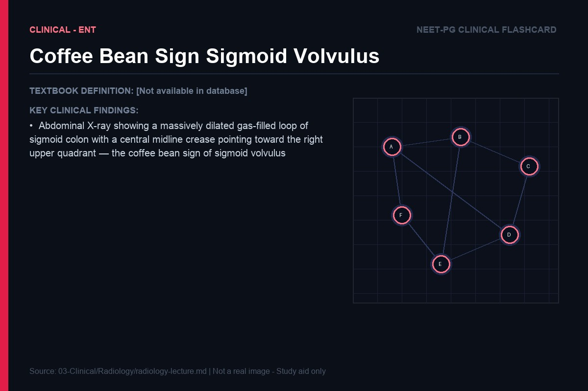

**The abdominal X-ray sign shown is the "coffee bean sign." This finding is diagnostic of:**
- A) Intussusception
- B) Caecal volvulus
- C) Sigmoid volvulus
- D) Paralytic ileus

Answer

**Correct: C** — **Coffee bean sign (Omega/horseshoe sign)** on plain AXR is pathognomonic of **sigmoid volvulus**. The massively dilated sigmoid loop with its two walls fused centrally forms a coffee-bean shape pointing to the right upper quadrant. Other options: A) intussusception shows target sign on USS/CT; B) caecal volvulus produces a kidney-shaped loop in the left upper quadrant; D) paralytic ileus shows generalised gaseous distension without a dominant loop.

---

**Q5.**

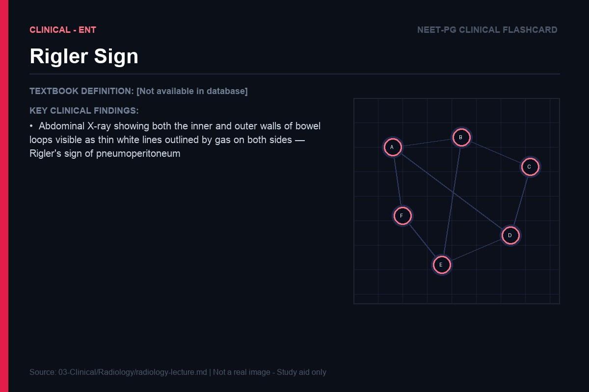

**The finding of gas outlining both sides of the bowel wall (Rigler/double wall sign) on AXR indicates:**
- A) Intramural gas (pneumatosis intestinalis)
- B) Free intraperitoneal air (pneumoperitoneum)
- C) Retroperitoneal air
- D) Portal venous gas

Answer

**Correct: B** — **Rigler sign (double wall sign)**: when free intraperitoneal air is present, both the inner and outer walls of the bowel become visible because gas outlines both sides. Normally only the inner mucosal surface is visible (gas within lumen only). Other options: A) pneumatosis shows gas within the bowel wall itself; C) retroperitoneal air outlines the kidneys and psoas; D) portal venous gas is a branching lucency overlying the liver.

---

**Q6.**

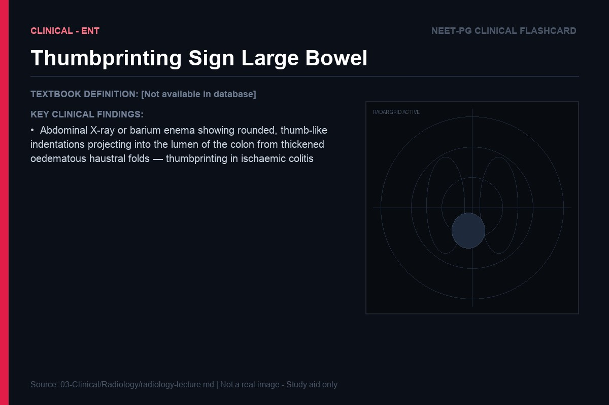

**The "thumbprinting" pattern shown on this large bowel study is MOST consistent with:**
- A) Sigmoid volvulus
- B) Ischaemic colitis or mucosal oedema
- C) Carcinoma of the colon
- D) Hirschsprung's disease

Answer

**Correct: B** — **Thumbprinting** represents submucosal oedema/haemorrhage creating regular nodular indentations along the bowel wall, classically seen in **ischaemic colitis**, ulcerative colitis, and angiodysplasia. Other options: A) sigmoid volvulus shows coffee-bean sign; C) colonic carcinoma shows an "apple-core" stricture; D) Hirschsprung's disease shows a narrowed rectum with dilated proximal bowel.

---

**Q7.**

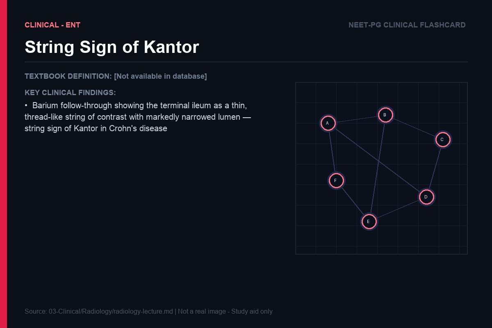

**The "string sign of Kantor" shown on barium follow-through is characteristic of:**
- A) Ulcerative colitis
- B) Crohn's disease of the terminal ileum
- C) Intestinal tuberculosis
- D) Carcinoid tumour

Answer

**Correct: B** — **String sign of Kantor**: a thin thread-like barium column through the terminal ileum due to severe luminal narrowing caused by fibrosis and spasm in **Crohn's disease**. The "skip lesions" of Crohn's affect terminal ileum most commonly. Other options: A) UC is a continuous colonic disease — "lead-pipe colon" on barium; C) intestinal TB causes Fleischner sign (ileocaecal involvement, pulling up of caecum); D) carcinoid causes extrinsic mesenteric desmoplastic changes.

---

**Q8.**

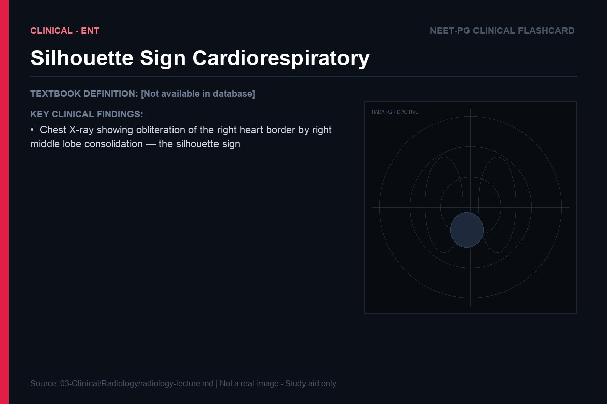

**The "silhouette sign" on chest X-ray (loss of a normal border) localises pathology. Loss of the right heart border indicates consolidation in which lobe?**
- A) Right lower lobe
- B) Right upper lobe
- C) Right middle lobe
- D) Left lower lobe

Answer

**Correct: C** — The **silhouette sign**: an intrathoracic opacity erases the border of an adjacent structure when they share the same density. The right heart border is formed by the right middle lobe — consolidation here erases it. Right lower lobe consolidation erases the right hemidiaphragm; right upper lobe erases the right upper mediastinum. This is Felson's silhouette sign.

---

**Q9.**

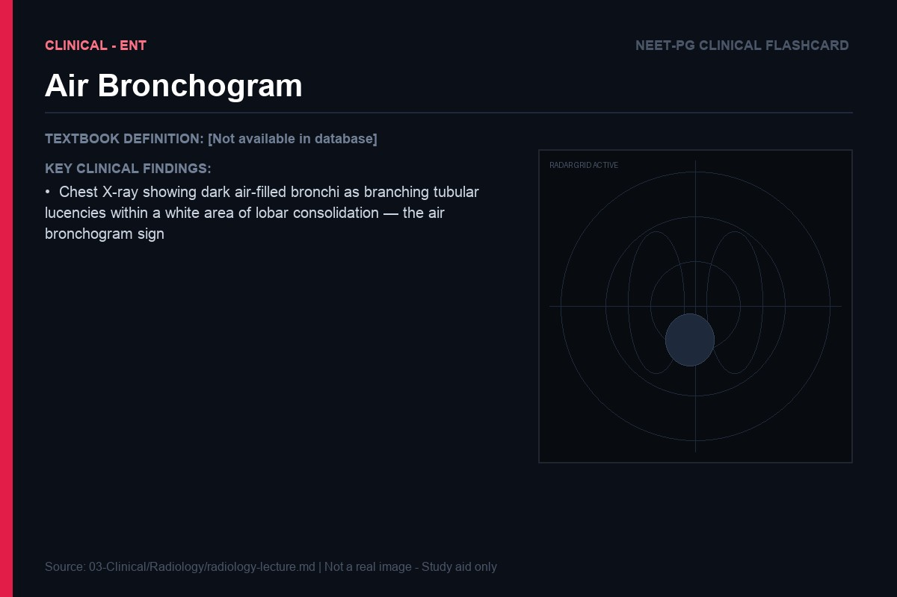

**Air bronchograms (visible air-filled airways within opacification) are MOST characteristic of:**
- A) Pleural effusion
- B) Lobar collapse/atelectasis
- C) Airspace (alveolar) consolidation
- D) Pulmonary abscess

Answer

**Correct: C** — **Air bronchograms** occur when the alveoli surrounding airways fill with fluid/exudate while the airways remain air-filled, making them visible. This is characteristic of **airspace consolidation** (pneumonia, pulmonary oedema, haemorrhage). Other options: A) pleural effusion does not contain airways; B) collapse/atelectasis causes absorbed airways — air bronchograms are absent in obstructive collapse; D) abscess shows a cavity with an air-fluid level.

---

**Q10.**

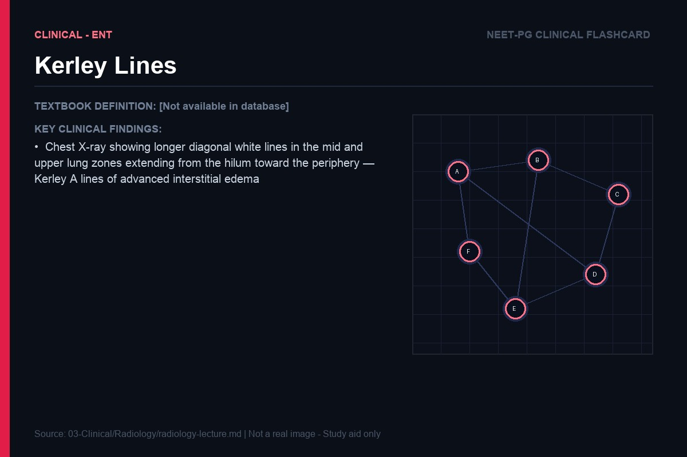

**Kerley B lines on a chest X-ray represent:**
- A) Pleural plaques
- B) Dilated lymphatics / interstitial oedema at the costophrenic angles
- C) Pneumonia in the lower zones
- D) Rib metastases

Answer

**Correct: B** — **Kerley B lines** are short (1–2 cm), horizontal, peripheral lines perpendicular to and touching the pleural surface in the lower zones, representing fluid in the interlobular septa and distended lymphatics. Seen in left heart failure, mitral stenosis, and lymphangitis carcinomatosa. Other options: A) pleural plaques are calcified peripheral densities; C) pneumonia produces lobar/segmental opacity; D) rib metastases are lytic/sclerotic rib lesions.

---

**Q11.**

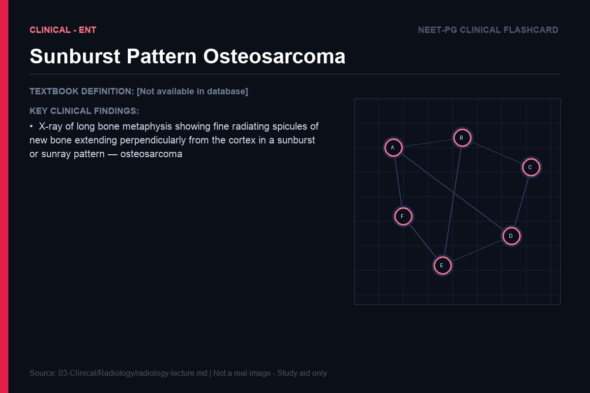

**The "sunburst" periosteal reaction shown on this X-ray is the classic radiological sign of:**
- A) Ewing sarcoma
- B) Osteosarcoma
- C) Giant cell tumour
- D) Fibrous dysplasia

Answer

**Correct: B** — **Sunburst pattern**: radiating spicules of new bone perpendicular to the cortex, pathognomonic of **osteosarcoma**. Typically affects the metaphysis of long bones (distal femur, proximal tibia) in adolescents. Codman's triangle (periosteal elevation) may also be seen. Other options: A) Ewing sarcoma shows "onion peel/lamellated" periosteal reaction; C) GCT shows a soap-bubble lytic lesion at the epiphysis; D) fibrous dysplasia shows ground-glass appearance.

---

**Q12.**

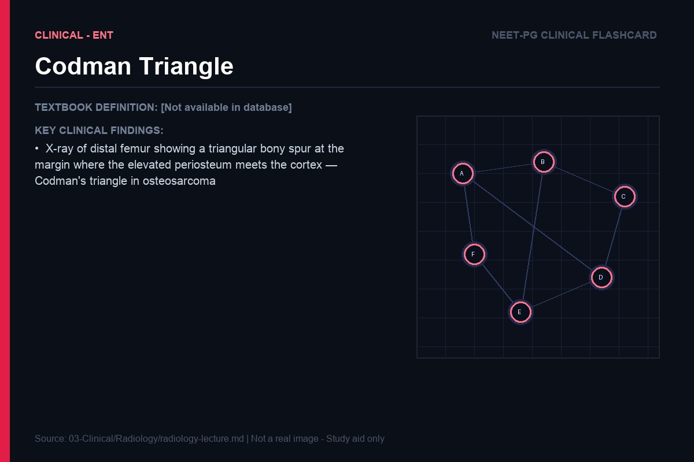

**The Codman triangle (periosteal elevation) is seen in this X-ray. This finding indicates:**
- A) A benign, slow-growing lesion
- B) An aggressive bone lesion (malignant or aggressive infection)
- C) Avascular necrosis
- D) Stress fracture

Answer

**Correct: B** — **Codman triangle** is a triangular area of periosteal new bone formed when a rapidly growing tumour (or aggressive infection) lifts the periosteum — the centre is too fast-growing for mineralisation. It signifies **aggressive bone pathology** (osteosarcoma, Ewing's, aggressive osteomyelitis). It is NOT a specific diagnosis but indicates malignancy or rapid growth. Other options: A) benign lesions form a complete periosteal shell; C) AVN shows crescent/double-line signs; D) stress fractures show a thin transverse lucency.

---

**Q13.**

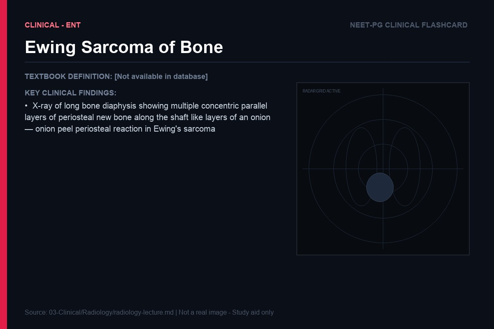

**The "onion peel/lamellated" periosteal reaction shown is the classic finding in:**
- A) Osteosarcoma
- B) Multiple myeloma
- C) Ewing sarcoma
- D) Chondrosarcoma

Answer

**Correct: C** — **Ewing sarcoma** classically shows a lamellated (onion skin) periosteal reaction — multiple layers of new periosteal bone. It affects the diaphysis of long bones and the flat bones of the pelvis in children (5–15 years). Other options: A) osteosarcoma shows sunburst pattern; B) myeloma shows punched-out lytic lesions; D) chondrosarcoma shows arcs-and-rings calcification (chondroid matrix).

---

**Q14.**

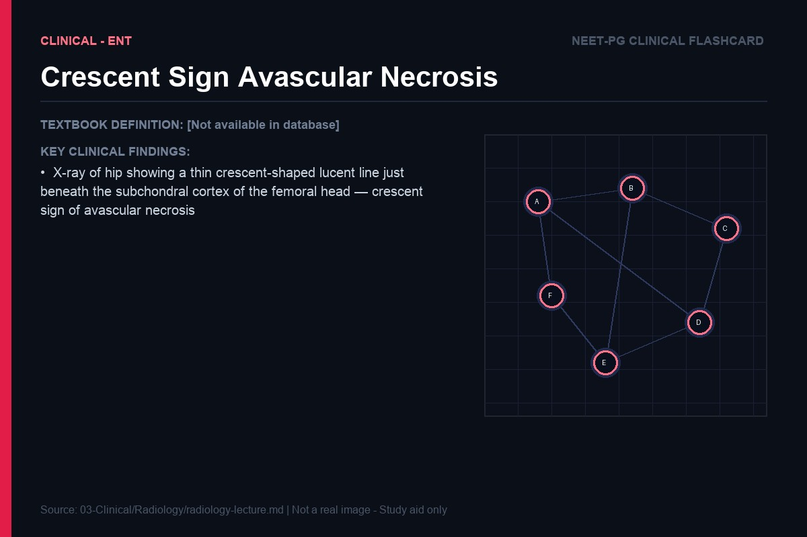

**The "crescent sign" shown subchondrally in the femoral head represents:**
- A) Stress fracture through the femoral head
- B) Subchondral collapse in avascular necrosis
- C) Septic arthritis erosion
- D) Paget's disease of bone

Answer

**Correct: B** — **Crescent sign (Ficat-Arlet)**: a subchondral lucent crescent on plain X-ray indicating collapse of necrotic bone beneath intact cartilage — a late sign of **avascular necrosis (AVN)** of the femoral head. The double-line sign on MRI (inner bright T2 line of granulation tissue, outer dark sclerotic rim) is earlier and more sensitive. Other options: A) stress fractures show a linear lucency; C) septic arthritis causes joint space loss and erosions; D) Paget's shows trabecular coarsening and bone expansion.

---

**Q15.**

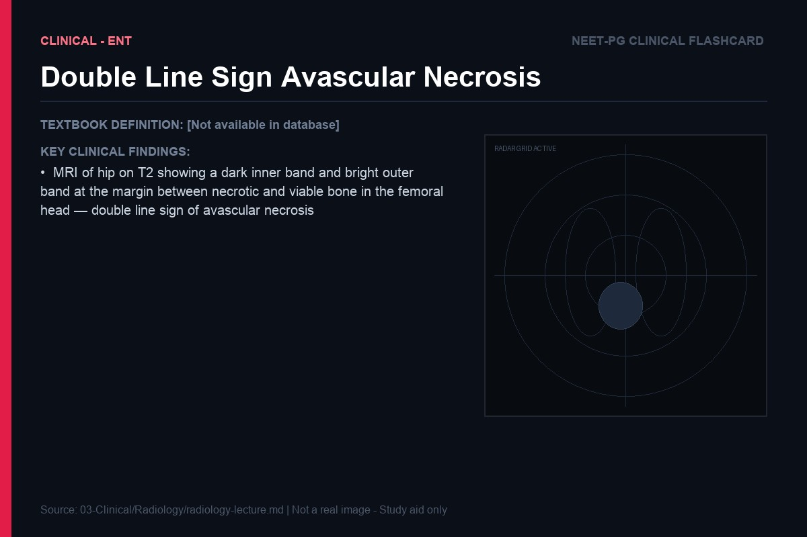

**The "double-line sign" on MRI of the femoral head (bright inner rim, dark outer rim on T2) is pathognomonic of:**
- A) Transient osteoporosis of the hip
- B) Avascular necrosis (osteonecrosis)
- C) Pigmented villonodular synovitis
- D) Stress fracture

Answer

**Correct: B** — **Double-line sign on MRI T2**: the inner bright line represents reactive granulation/hyperaemic tissue; the outer dark line represents sclerotic bone at the interface of viable and necrotic tissue. This is pathognomonic of **AVN** and is the most sensitive early sign. Other options: A) transient osteoporosis shows diffuse marrow oedema without a double-line; C) PVNS shows haemosiderin (dark on all sequences); D) stress fracture shows a band of low signal without a double-line.

---

**Q16.**

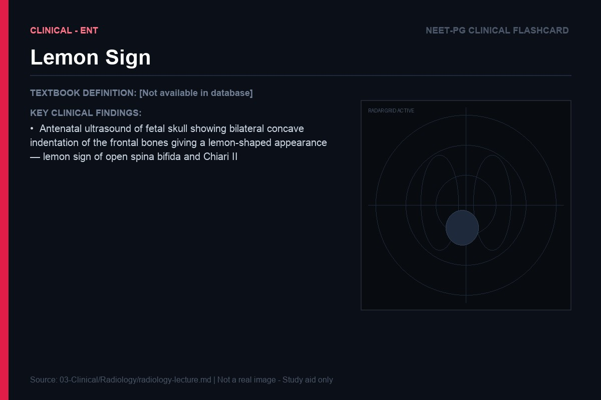

**The "lemon sign" on fetal ultrasound (flattening of the frontal bones giving a lemon shape) is associated with:**
- A) Anencephaly
- B) Open neural tube defect (spina bifida)
- C) Holoprosencephaly
- D) Dandy-Walker malformation

Answer

**Correct: B** — **Lemon sign** (seen at 16–24 weeks): scalloping of the frontal bones creates a lemon-shaped skull on axial USS, caused by downward herniation of the hindbrain through the foramen magnum (Arnold-Chiari type II) in **open spina bifida**. It is seen in ~99% of open NTDs at 16–24 weeks. Other options: A) anencephaly shows absent vault; C) holoprosencephaly shows fused thalami/monoventricle; D) Dandy-Walker shows enlarged posterior fossa with absent vermis.

---

**Q17.**

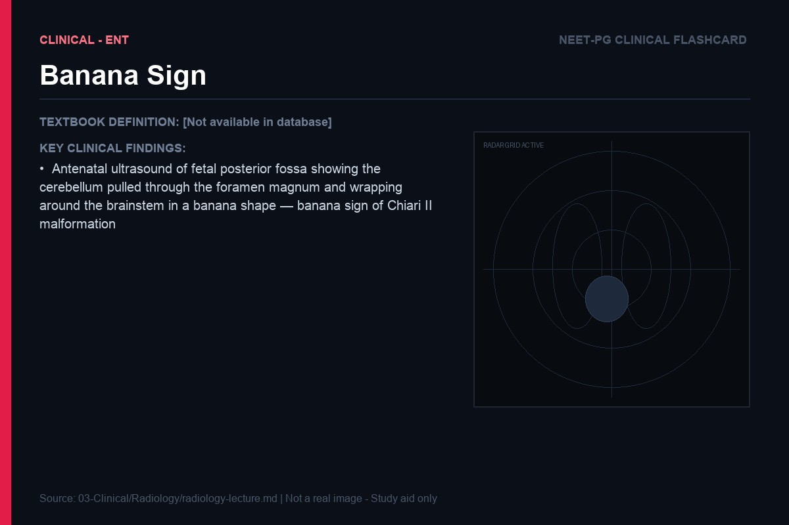

**The "banana sign" on fetal cranial ultrasound represents:**
- A) Aqueductal stenosis with hydrocephalus
- B) Cerebellar herniation (Arnold-Chiari II) associated with open spina bifida
- C) Cerebellar agenesis
- D) Normal cerebellar shape variant

Answer

**Correct: B** — **Banana sign**: the cerebellum is curved/crescent-shaped (like a banana) rather than dumbbell-shaped because the posterior fossa is small and the cerebellum wraps around the brainstem, as the hindbrain herniates through the foramen magnum in **Arnold-Chiari type II malformation** associated with open spina bifida. Usually seen with the lemon sign. Other options: A) aqueductal stenosis shows isolated hydrocephalus; C) cerebellar agenesis shows absent posterior fossa structures; D) normal cerebellum is dumbbell/bilobate-shaped.

---

**Q18.**

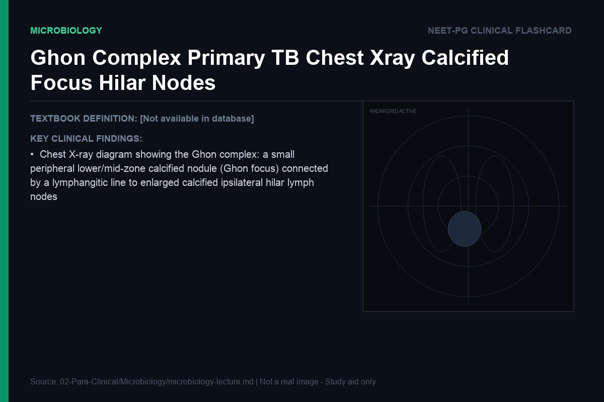

**The calcified peripheral focus with ipsilateral calcified hilar lymph nodes shown on chest X-ray constitutes:**
- A) Rasmussen aneurysm
- B) Ghon complex (Ranke complex) of primary tuberculosis
- C) Aspergilloma
- D) Pulmonary hamartoma

Answer

**Correct: B** — **Ghon complex (= Ghon focus + ipsilateral hilar/mediastinal calcified nodes = Ranke complex)**: the calcified parenchymal focus (Ghon focus) + calcified draining lymph nodes represent healed **primary tuberculosis**. The lower lobe or mid-zone subpleural location is typical. Other options: A) Rasmussen aneurysm is a pulmonary artery aneurysm in a TB cavity; C) aspergilloma shows a fungal ball with air crescent inside a pre-existing cavity; D) pulmonary hamartoma shows "popcorn" calcification.

---

**Q19.**

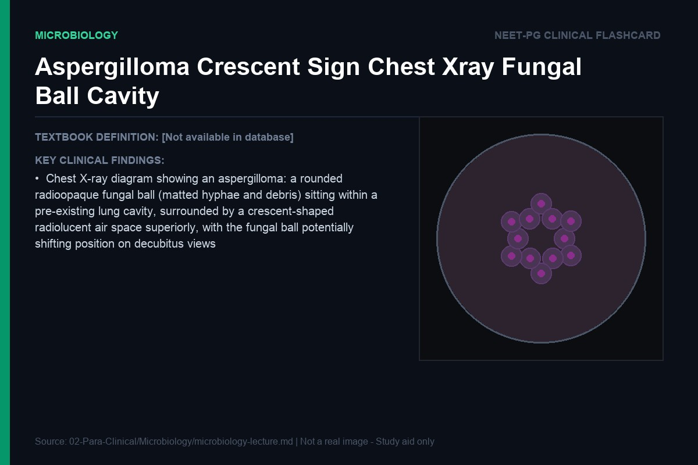

**The "air crescent sign" showing a soft tissue ball within a pulmonary cavity (Monod sign) is diagnostic of:**
- A) Lung abscess
- B) Aspergilloma (mycetoma)
- C) Hydatid cyst
- D) Bronchogenic carcinoma with cavitation

Answer

**Correct: B** — **Aspergilloma (fungus ball/mycetoma)**: a mobile mass of Aspergillus hyphae, fibrin, and debris within a pre-existing cavity (old TB, sarcoidosis, bronchiectasis), surrounded by an air crescent (Monod sign). The ball moves with positional changes. Other options: A) lung abscess shows a thick-walled cavity with air-fluid level; C) hydatid shows "water-lily sign" (floating membranes) after rupture; D) cavitating carcinoma has thick, irregular walls without a free mobile ball.

---

**Q20.**

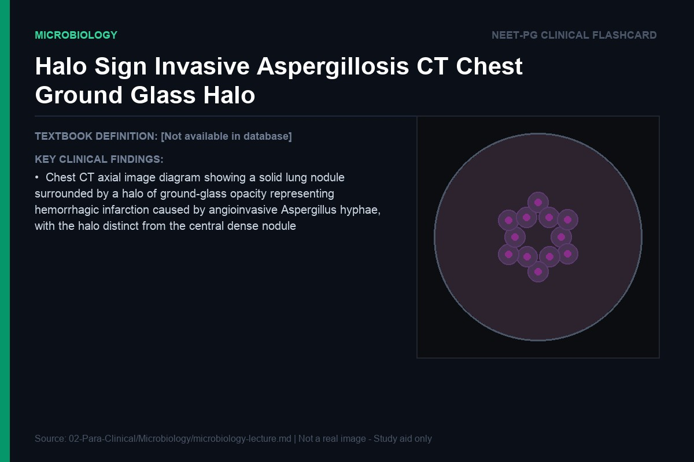

**The CT chest "halo sign" (ground-glass opacity surrounding a nodule) in an immunocompromised patient is MOST suggestive of:**
- A) Metastatic disease
- B) Invasive pulmonary aspergillosis
- C) Wegener's granulomatosis
- D) Carcinoid tumour

Answer

**Correct: B** — **Halo sign on CT**: a ring of ground-glass opacity (haemorrhage/oedema) around a central nodule (fungal infarct/necrosis) is an early and characteristic sign of **invasive pulmonary aspergillosis** in neutropenic/immunocompromised patients. It is an early finding; the "reversed halo" / atoll sign is seen in organising pneumonia. Other options: A) metastases are well-defined nodules without halo; C) Wegener's shows bilateral cavitating nodules; D) carcinoid is an endobronchial or peripheral nodule.

---

**Q21.**

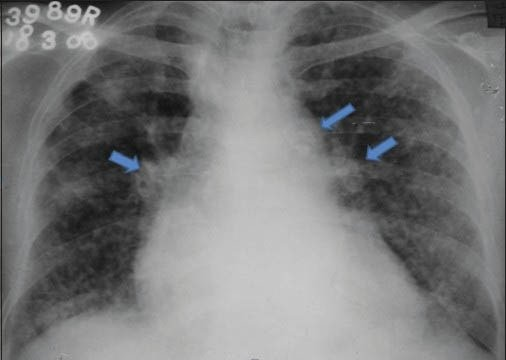

**"Eggshell calcification" of hilar lymph nodes on chest X-ray is pathognomonic of:**
- A) Sarcoidosis
- B) Silicosis
- C) Primary TB
- D) Histoplasmosis

Answer

**Correct: B** — **Eggshell calcification**: peripheral rim calcification of hilar and mediastinal lymph nodes is pathognomonic of **silicosis** (and occasionally sarcoidosis, but silicosis is the classic answer). Silicosis also shows upper-lobe-predominant nodules and progressive massive fibrosis. Other options: A) sarcoidosis shows bilateral hilar lymphadenopathy ("potato nodes") without eggshell calcification classically; C) primary TB shows calcified nodes without the eggshell pattern; D) histoplasmosis shows diffuse calcified nodules.

---

**Q22.**

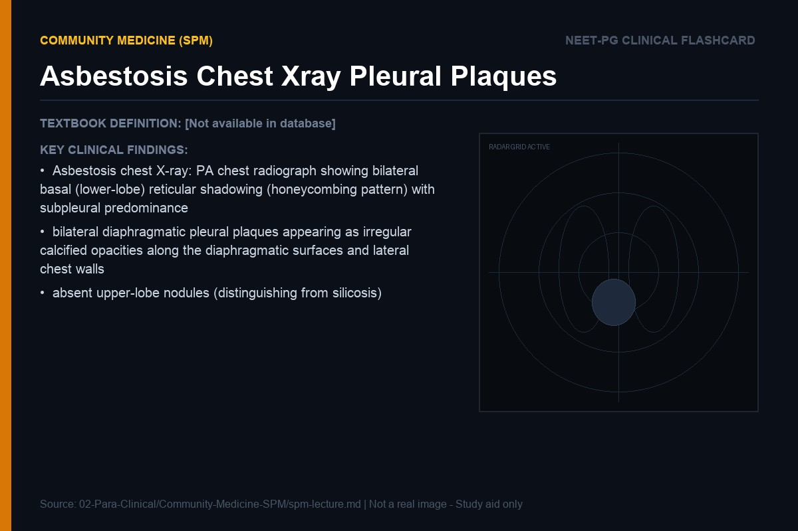

**Bilateral diaphragmatic pleural plaques with lower-zone reticulonodular shadowing, as shown, is characteristic of:**
- A) Mesothelioma
- B) Silicosis
- C) Asbestosis
- D) Coal workers' pneumoconiosis

Answer

**Correct: C** — **Asbestosis**: bilateral lower-zone fibrosis (ILD pattern) with diaphragmatic/pericardial pleural plaques (often calcified) is the signature of **asbestosis** — the only pneumoconiosis with lower lobe predominance. Asbestos exposure also predisposes to mesothelioma and bronchogenic carcinoma. Other options: A) mesothelioma shows a unilateral pleural rind with effusion; B) silicosis is upper-lobe-predominant with hilar eggshell nodes; D) CWP shows upper-lobe nodules similar to silicosis.

---

**Q23.**

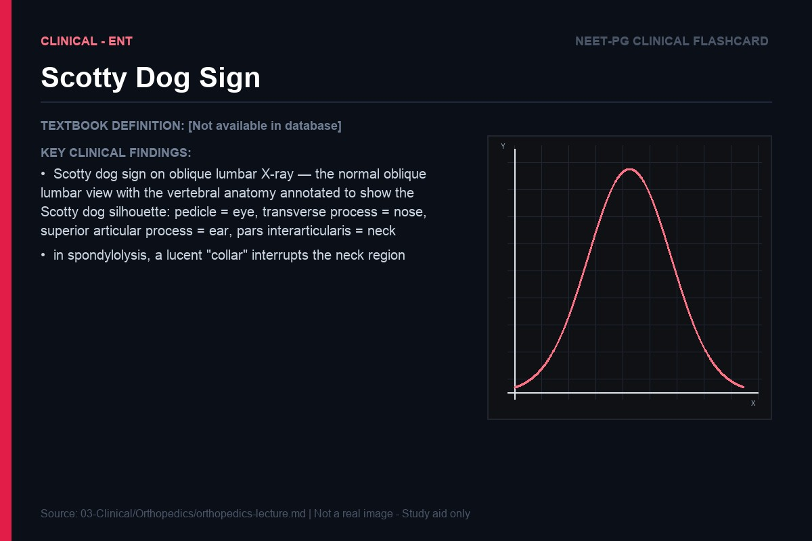

**The "Scotty dog sign" on oblique lumbar spine X-ray, with a lucent collar around the dog's neck (pars defect), indicates:**
- A) Lumbar disc prolapse
- B) Spondylolysis (pars interarticularis defect)
- C) Vertebral fracture with posterior element injury
- D) Ankylosing spondylitis

Answer

**Correct: B** — **Scotty dog sign**: on oblique lumbar X-ray, the normal pars interarticularis appears as the "neck" of the Scotty dog. A lucent band (fracture/defect) through the neck = **spondylolysis**. Bilateral spondylolysis allows forward slip = spondylolisthesis (graded by Meyerding). Common in gymnasts and fast bowlers (L5 most common). Other options: A) disc prolapse is diagnosed on MRI, not plain X-ray; C) posterior element fractures are traumatic and non-bilateral; D) AS shows bamboo spine with syndesmophytes.

---

**Q24.**

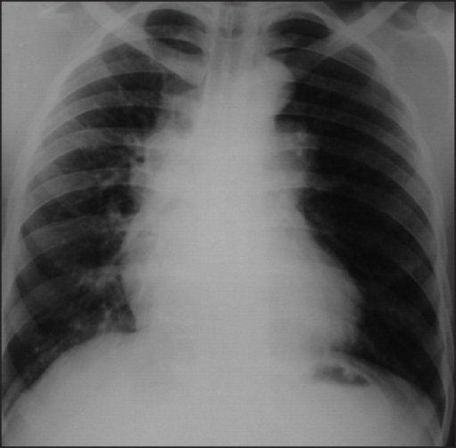

**The "boot-shaped heart" (coeur en sabot) on CXR with oligaemic lung fields is the classic appearance of:**
- A) Transposition of the great arteries
- B) Total anomalous pulmonary venous connection
- C) Tetralogy of Fallot
- D) Ventricular septal defect

Answer

**Correct: C** — **Boot-shaped heart in TOF**: right ventricular hypertrophy elevates the cardiac apex, pulmonary infundibular stenosis causes a concave pulmonary bay, and decreased pulmonary blood flow causes oligaemic lung fields — creating the "coeur en sabot" (boot-shaped heart). TOF is the most common cyanotic CHD after 1 year. Other options: A) TGA shows egg-on-its-side appearance; B) TAPVC shows snowman/figure-of-eight appearance; D) VSD shows cardiomegaly with plethoric lung fields.

---

**Q25.**

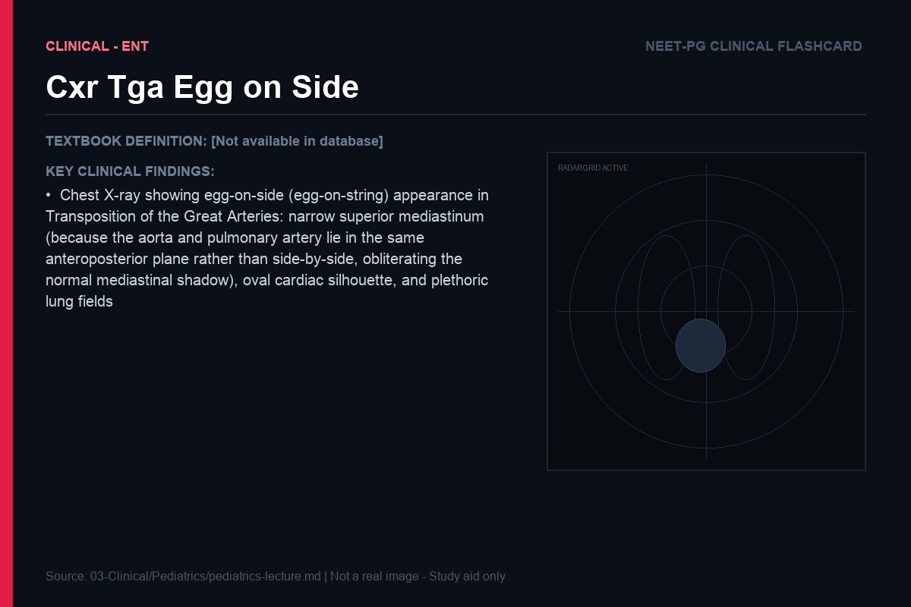

**The "egg-on-its-side" (egg-on-a-string) appearance on CXR with a narrow superior mediastinum and plethoric lung fields is the classic sign of:**
- A) Tetralogy of Fallot
- B) Transposition of the great arteries (TGA)
- C) Truncus arteriosus
- D) Tricuspid atresia

Answer

**Correct: B** — **Egg-on-its-side sign in TGA**: the aorta arises anteriorly from the RV and the pulmonary artery from the LV — the parallel relationship of the great arteries creates a narrow vascular pedicle on frontal CXR, with an oval cardiac shadow (egg shape) and plethoric lung fields (increased pulmonary blood flow). TGA is the most common cyanotic CHD presenting in the **neonatal period**. Other options: A) TOF shows boot-shaped heart with oligaemia; C) truncus arteriosus shows a high right aortic arch; D) tricuspid atresia shows a flat right heart border.

---

*End of IBQ session — 25 questions completed.*
